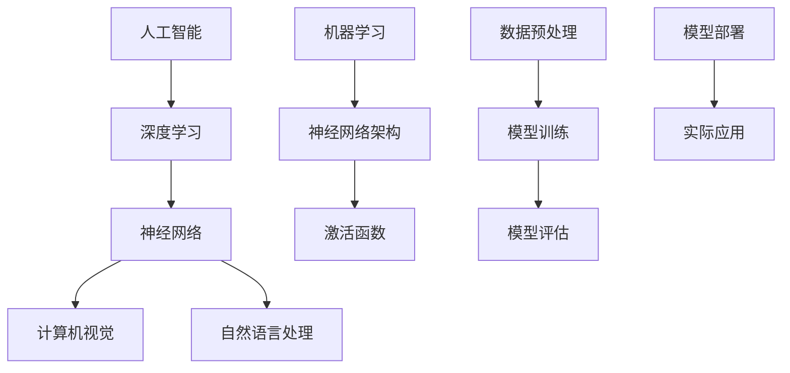

                 

# Andrej Karpathy：人工智能的未来发展前景

> **关键词：** 人工智能，深度学习，神经网络，自然语言处理，计算机视觉，未来趋势

> **摘要：** 本文将深入探讨人工智能领域的杰出人物Andrej Karpathy的研究工作及其对未来人工智能发展前景的思考。通过分析其核心概念、算法原理、数学模型及实际应用案例，我们将探索人工智能技术在未来可能面临的挑战和机遇。

## 1. 背景介绍

### 1.1 目的和范围

本文旨在通过对Andrej Karpathy的研究成果进行分析，探讨人工智能领域的前沿技术和未来发展趋势。我们将重点关注以下几个方面：

1. **核心概念与联系**：介绍人工智能的基本概念及其相互关系，使用Mermaid流程图展示关键原理。
2. **核心算法原理 & 具体操作步骤**：详细讲解人工智能中的关键算法，包括伪代码示例。
3. **数学模型和公式 & 详细讲解 & 举例说明**：分析数学模型在人工智能中的应用，使用LaTeX格式展示重要公式。
4. **项目实战：代码实际案例和详细解释说明**：通过实际代码案例，展示人工智能技术的应用和实现。
5. **实际应用场景**：探讨人工智能技术在各个领域的应用现状和未来潜力。
6. **工具和资源推荐**：推荐相关学习资源和开发工具，帮助读者进一步了解和掌握人工智能技术。
7. **总结：未来发展趋势与挑战**：总结人工智能领域的前景和挑战，为读者提供思考方向。

### 1.2 预期读者

本文适合对人工智能技术有一定了解的读者，包括但不限于：

1. **人工智能研究者**：希望了解前沿技术发展和未来趋势的研究人员。
2. **程序员和工程师**：对人工智能应用和实践感兴趣的开发者。
3. **技术爱好者**：对人工智能领域充满好奇，希望深入了解该领域的普通读者。

### 1.3 文档结构概述

本文分为以下章节：

1. **背景介绍**：介绍文章目的、读者预期和文档结构。
2. **核心概念与联系**：阐述人工智能的基本概念和原理。
3. **核心算法原理 & 具体操作步骤**：详细讲解关键算法。
4. **数学模型和公式 & 详细讲解 & 举例说明**：分析数学模型和应用。
5. **项目实战：代码实际案例和详细解释说明**：展示实际应用案例。
6. **实际应用场景**：探讨人工智能在各领域的应用。
7. **工具和资源推荐**：推荐相关学习资源和开发工具。
8. **总结：未来发展趋势与挑战**：总结前景和挑战。
9. **附录：常见问题与解答**：回答读者常见问题。
10. **扩展阅读 & 参考资料**：提供进一步阅读的资源。

### 1.4 术语表

#### 1.4.1 核心术语定义

- **人工智能**：通过计算机模拟人类智能行为的科学技术。
- **深度学习**：一种基于神经网络的学习方法，通过多层的非线性变换来提取数据中的特征。
- **神经网络**：一种由大量神经元组成的计算模型，用于模拟人脑的信息处理方式。
- **自然语言处理**：利用计算机技术对自然语言进行理解和生成。
- **计算机视觉**：让计算机具有类似人类视觉能力的技术。

#### 1.4.2 相关概念解释

- **机器学习**：通过数据和算法让计算机自动学习，从而实现智能行为。
- **神经网络架构**：定义神经网络结构和连接方式的框架。
- **激活函数**：神经网络中的非线性变换函数，用于引入非线性特性。

#### 1.4.3 缩略词列表

- **CNN**：卷积神经网络（Convolutional Neural Network）
- **RNN**：循环神经网络（Recurrent Neural Network）
- **GAN**：生成对抗网络（Generative Adversarial Network）
- **NLP**：自然语言处理（Natural Language Processing）

## 2. 核心概念与联系

在本文中，我们将探讨人工智能领域的核心概念和联系。以下是使用Mermaid绘制的流程图，展示了关键概念和它们的相互关系：



### 2.1 人工智能的基本概念

人工智能（Artificial Intelligence，简称AI）是计算机科学的一个分支，旨在使计算机系统具有类似人类的智能行为。人工智能可以分为两大类：

1. **弱人工智能（Narrow AI）**：指在特定任务上表现出超越人类能力的人工智能系统，例如语音识别、图像识别等。
2. **强人工智能（General AI）**：指具有广泛认知能力，能够在各种任务中表现出人类智能水平的人工智能系统。

### 2.2 深度学习与神经网络

深度学习（Deep Learning）是人工智能的一种重要分支，基于多层神经网络（Neural Network）进行数据处理和特征提取。深度学习在图像识别、语音识别、自然语言处理等领域取得了显著的成果。

神经网络是一种由大量神经元（Neurons）组成的计算模型，模拟人脑的信息处理方式。每个神经元接收来自其他神经元的输入信号，通过激活函数（Activation Function）进行非线性变换，产生输出信号。

### 2.3 计算机视觉与自然语言处理

计算机视觉（Computer Vision）是人工智能的一个重要领域，旨在使计算机具有类似人类视觉的能力，能够从图像或视频中提取有用信息。计算机视觉技术广泛应用于图像识别、目标检测、图像分割等领域。

自然语言处理（Natural Language Processing，简称NLP）是人工智能的另一个重要领域，旨在使计算机能够理解和生成自然语言。NLP技术广泛应用于机器翻译、情感分析、文本分类等领域。

## 3. 核心算法原理 & 具体操作步骤

在人工智能领域，核心算法原理是理解和实现人工智能技术的基础。以下我们将介绍几种关键算法，并使用伪代码进行详细阐述。

### 3.1 卷积神经网络（CNN）

卷积神经网络（Convolutional Neural Network，简称CNN）是一种在图像识别和计算机视觉领域广泛应用的深度学习算法。以下是CNN的基本原理和伪代码：

```python
# 输入：图像数据
# 输出：分类结果

# 初始化权重和偏置
weights = [初始化权重]
biases = [初始化偏置]

# 定义卷积层
def conv2d(input, weights, biases):
    output = [0] * len(input)
    for i in range(len(input)):
        output[i] = sum([weights[j] * input[i][j] for j in range(len(input[i]))]) + biases[i]
    return output

# 定义池化层
def pooling(input, pool_size):
    output = [0] * len(input)
    for i in range(len(input)):
        max_val = -inf
        for j in range(len(input[i]) // pool_size):
            for k in range(pool_size):
                val = input[i][j * pool_size + k]
                if val > max_val:
                    max_val = val
        output[i] = max_val
    return output

# 定义全连接层
def fully_connected(input, weights, biases):
    output = [0] * len(input)
    for i in range(len(input)):
        output[i] = sum([weights[j] * input[i][j] for j in range(len(input[i]))]) + biases[i]
    return output

# 定义前向传播
def forward_pass(input_data, weights, biases):
    conv1_output = conv2d(input_data, weights['conv1'], biases['conv1'])
    pool1_output = pooling(conv1_output, pool_size=2)
    conv2_output = conv2d(pool1_output, weights['conv2'], biases['conv2'])
    pool2_output = pooling(conv2_output, pool_size=2)
    fc_output = fully_connected(pool2_output, weights['fc'], biases['fc'])
    return fc_output

# 定义反向传播
def backward_pass(output, expected_output, weights, biases):
    # 计算梯度
    # 更新权重和偏置
    # 返回更新后的权重和偏置
    pass
```

### 3.2 循环神经网络（RNN）

循环神经网络（Recurrent Neural Network，简称RNN）是一种在序列数据处理中广泛应用的人工智能算法。以下是RNN的基本原理和伪代码：

```python
# 输入：序列数据
# 输出：序列预测结果

# 初始化权重和偏置
weights = [初始化权重]
biases = [初始化偏置]

# 定义RNN单元
def rnn(input, weights, biases, hidden_state):
    input_gate = sigmoid(weights['input_gate'] * input + biases['input_gate'])
    forget_gate = sigmoid(weights['forget_gate'] * input + biases['forget_gate'])
    output_gate = sigmoid(weights['output_gate'] * input + biases['output_gate'])
    new_hidden_state = tanh(weights['hidden_state'] * input + biases['hidden_state'])
    
    hidden_state = forget_gate * hidden_state + input_gate * new_hidden_state
    output = output_gate * tanh(hidden_state)
    
    return output, hidden_state

# 定义前向传播
def forward_pass(input_data, weights, biases):
    hidden_states = [0] * len(input_data)
    outputs = [0] * len(input_data)
    for i in range(len(input_data)):
        output, hidden_state = rnn(input_data[i], weights, biases, hidden_states[i - 1])
        outputs[i] = output
        hidden_states[i] = hidden_state
    return outputs

# 定义反向传播
def backward_pass(outputs, expected_outputs, weights, biases):
    # 计算梯度
    # 更新权重和偏置
    # 返回更新后的权重和偏置
    pass
```

### 3.3 生成对抗网络（GAN）

生成对抗网络（Generative Adversarial Network，简称GAN）是一种由两个神经网络组成的生成模型，用于学习数据的分布。以下是GAN的基本原理和伪代码：

```python
# 输入：训练数据
# 输出：生成数据

# 初始化权重和偏置
weights = [初始化权重]
biases = [初始化偏置]

# 定义生成器
def generator(z, weights, biases):
    output = fully_connected(z, weights['fc'], biases['fc'])
    return output

# 定义鉴别器
def discriminator(x, weights, biases):
    output = fully_connected(x, weights['fc'], biases['fc'])
    return sigmoid(output)

# 定义前向传播
def forward_pass(x, z, weights, biases):
    generated_data = generator(z, weights['generator'], biases['generator'])
    real_output = discriminator(x, weights['discriminator'], biases['discriminator'])
    fake_output = discriminator(generated_data, weights['discriminator'], biases['discriminator'])
    return real_output, fake_output

# 定义反向传播
def backward_pass(real_output, fake_output, expected_real_output, expected_fake_output, weights, biases):
    # 计算梯度
    # 更新生成器和鉴别器的权重和偏置
    # 返回更新后的权重和偏置
    pass
```

## 4. 数学模型和公式 & 详细讲解 & 举例说明

在人工智能领域中，数学模型和公式是理解和实现关键算法的基础。以下我们将详细介绍几个常用的数学模型和公式，并使用LaTeX格式进行展示。

### 4.1 激活函数

激活函数（Activation Function）是神经网络中的一个重要组成部分，用于引入非线性特性。以下是一些常见的激活函数：

#### 4.1.1 Sigmoid函数

Sigmoid函数是一种常用的激活函数，其公式如下：

$$
\sigma(x) = \frac{1}{1 + e^{-x}}
$$

#### 4.1.2 双曲正切函数（Tanh）

双曲正切函数（Tanh）是另一种常见的激活函数，其公式如下：

$$
\tanh(x) = \frac{e^x - e^{-x}}{e^x + e^{-x}}
$$

#### 4.1.3ReLU函数

ReLU（Rectified Linear Unit）函数是一种简单且高效的激活函数，其公式如下：

$$
\text{ReLU}(x) = \max(0, x)
$$

### 4.2 梯度下降算法

梯度下降算法（Gradient Descent）是机器学习中一种常用的优化算法，用于最小化损失函数。其基本思想是沿着损失函数的梯度方向进行更新，以逐步减小损失。

#### 4.2.1 基本公式

梯度下降算法的基本公式如下：

$$
\theta_{\text{new}} = \theta_{\text{old}} - \alpha \cdot \nabla_\theta J(\theta)
$$

其中，$\theta$表示模型参数，$J(\theta)$表示损失函数，$\alpha$表示学习率。

#### 4.2.2 梯度下降算法的例子

假设我们有一个简单的线性回归模型，损失函数为平方误差：

$$
J(\theta) = \frac{1}{2} \sum_{i=1}^n (h_\theta(x^i) - y^i)^2
$$

其中，$h_\theta(x)$表示模型预测值，$y^i$表示实际值。

为了使用梯度下降算法最小化损失函数，我们需要计算损失函数关于模型参数的梯度：

$$
\nabla_\theta J(\theta) = \frac{1}{n} \sum_{i=1}^n \nabla_\theta (h_\theta(x^i) - y^i)^2
$$

然后，我们可以使用梯度下降算法更新模型参数：

$$
\theta_{\text{new}} = \theta_{\text{old}} - \alpha \cdot \nabla_\theta J(\theta)
$$

其中，$\alpha$为学习率，通常选择较小的正值。

### 4.3 卷积运算

卷积运算（Convolution）是深度学习中一种重要的运算方式，用于提取图像或视频中的特征。卷积运算的基本公式如下：

$$
\sum_{i=1}^k w_i * x_i = \sum_{i=1}^k w_i \cdot x_i
$$

其中，$w_i$表示卷积核（Kernel），$x_i$表示输入数据。

例如，假设我们有一个3x3的卷积核和3x3的输入矩阵：

$$
\begin{bmatrix}
1 & 2 & 3 \\
4 & 5 & 6 \\
7 & 8 & 9
\end{bmatrix}
*
\begin{bmatrix}
1 & 0 & -1 \\
1 & 0 & -1 \\
1 & 0 & -1
\end{bmatrix}
=
\begin{bmatrix}
4 & 2 & 0 \\
4 & 2 & 0 \\
4 & 2 & 0
\end{bmatrix}
$$

### 4.4 池化操作

池化操作（Pooling）是一种用于减少数据维度和计算量的操作，通常用于图像和视频处理中。常见的池化操作包括最大池化和平均池化。

#### 4.4.1 最大池化

最大池化的公式如下：

$$
\text{Pooling}(x) = \max(x)
$$

例如，假设我们有一个2x2的输入矩阵：

$$
\begin{bmatrix}
1 & 2 \\
3 & 4
\end{bmatrix}
\Rightarrow
\max(1, 2, 3, 4) = 4
$$

#### 4.4.2 平均池化

平均池化的公式如下：

$$
\text{Pooling}(x) = \frac{1}{c} \sum_{i=1}^c x_i
$$

其中，$c$表示池化窗口的大小。

例如，假设我们有一个2x2的输入矩阵：

$$
\begin{bmatrix}
1 & 2 \\
3 & 4
\end{bmatrix}
\Rightarrow
\frac{1+2+3+4}{4} = 2.5
$$

## 5. 项目实战：代码实际案例和详细解释说明

在本节中，我们将通过一个实际项目案例展示如何使用人工智能技术进行图像识别。该项目将使用TensorFlow框架实现，并在Google Colab上进行运行。以下是项目实战的详细步骤：

### 5.1 开发环境搭建

1. **安装TensorFlow**：
   在Google Colab中，我们可以直接使用TensorFlow官方提供的虚拟环境：

   ```python
   !pip install tensorflow
   ```

2. **导入所需库**：

   ```python
   import tensorflow as tf
   import tensorflow.keras as keras
   import numpy as np
   import matplotlib.pyplot as plt
   ```

### 5.2 源代码详细实现和代码解读

1. **加载和预处理数据**：

   使用TensorFlow内置的MNIST数据集，这是一个包含70000个手写数字图像的数据集。首先，我们需要加载和预处理数据：

   ```python
   (train_images, train_labels), (test_images, test_labels) = keras.datasets.mnist.load_data()

   # 数据归一化
   train_images = train_images / 255.0
   test_images = test_images / 255.0

   # 展开数据
   train_images = np.expand_dims(train_images, -1)
   test_images = np.expand_dims(test_images, -1)
   ```

2. **构建模型**：

   我们将使用Keras构建一个简单的卷积神经网络模型。以下是模型的详细实现：

   ```python
   model = keras.Sequential([
       keras.layers.Conv2D(32, (3, 3), activation='relu', input_shape=(28, 28, 1)),
       keras.layers.MaxPooling2D((2, 2)),
       keras.layers.Conv2D(64, (3, 3), activation='relu'),
       keras.layers.MaxPooling2D((2, 2)),
       keras.layers.Conv2D(64, (3, 3), activation='relu'),
       keras.layers.Flatten(),
       keras.layers.Dense(64, activation='relu'),
       keras.layers.Dense(10, activation='softmax')
   ])
   ```

   代码解读：
   - **Conv2D**：卷积层，用于提取图像特征。第一个卷积层使用32个3x3的卷积核，激活函数为ReLU。
   - **MaxPooling2D**：池化层，用于减少数据维度并提取主要特征。
   - **Flatten**：将多维数据展平为一维数据。
   - **Dense**：全连接层，用于分类。最后一个全连接层使用10个神经元，对应10个数字类别，激活函数为softmax。

3. **编译模型**：

   ```python
   model.compile(optimizer='adam',
                 loss='sparse_categorical_crossentropy',
                 metrics=['accuracy'])
   ```

   代码解读：
   - **optimizer**：选择优化器，这里使用常用的adam优化器。
   - **loss**：损失函数，这里使用sparse categorical cross-entropy损失函数，适用于多分类问题。
   - **metrics**：评估指标，这里使用accuracy表示模型的准确率。

4. **训练模型**：

   ```python
   model.fit(train_images, train_labels, epochs=5)
   ```

   代码解读：
   - **train_images**：训练数据。
   - **train_labels**：训练标签。
   - **epochs**：训练轮次，这里选择5轮。

5. **评估模型**：

   ```python
   test_loss, test_acc = model.evaluate(test_images, test_labels)
   print(f'Test accuracy: {test_acc:.2f}')
   ```

   代码解读：
   - **test_images**：测试数据。
   - **test_labels**：测试标签。
   - **test_acc**：测试准确率。

### 5.3 代码解读与分析

在本项目中，我们使用卷积神经网络（CNN）进行手写数字识别。以下是代码的详细解读：

1. **数据预处理**：
   - 加载MNIST数据集，并将图像数据归一化到[0, 1]范围内。归一化可以加快模型训练速度并提高性能。
   - 展开数据维度，使其符合模型输入要求。

2. **构建模型**：
   - 使用Keras构建一个简单的CNN模型，包括卷积层、池化层和全连接层。
   - 第一个卷积层使用32个3x3的卷积核，激活函数为ReLU。ReLU函数可以引入非线性特性，使模型具有更好的表达能力。
   - 池化层用于减小数据维度，提高模型计算效率。
   - 最后一个全连接层使用softmax函数进行分类，输出概率分布。

3. **训练模型**：
   - 使用模型.fit()函数训练模型，指定训练数据、标签和训练轮次。在训练过程中，模型将调整内部参数，以最小化损失函数。
   - 使用adam优化器进行参数更新，它具有自适应学习率的特点，可以加快模型收敛速度。

4. **评估模型**：
   - 使用模型.evaluate()函数评估模型在测试数据上的表现，得到测试准确率。
   - 测试准确率表示模型在实际数据上的表现，越高表示模型越好。

### 5.4 项目总结

通过本项目，我们学习了如何使用TensorFlow构建和训练一个简单的卷积神经网络模型，进行手写数字识别。项目过程中，我们掌握了数据预处理、模型构建、训练和评估的基本流程。同时，我们了解了卷积神经网络的工作原理，以及如何通过调整模型参数来提高模型性能。

## 6. 实际应用场景

人工智能技术在各个领域都有广泛的应用，以下我们将介绍一些典型的实际应用场景：

### 6.1 医疗领域

人工智能在医疗领域有着重要的应用，包括疾病诊断、药物研发和个性化医疗等。例如，通过深度学习算法，可以分析医学影像数据，提高癌症等疾病的诊断准确率。此外，人工智能还可以用于药物筛选和研发，加速新药的研发进程。

### 6.2 金融领域

人工智能在金融领域发挥着重要作用，包括风险管理、欺诈检测和投资顾问等。通过机器学习算法，可以对大量金融数据进行分析，预测市场趋势和风险。例如，基于神经网络的风险评估模型可以用于评估贷款申请者的信用风险。

### 6.3 智能交通

人工智能在智能交通领域有广泛的应用，包括智能驾驶、交通流量控制和交通信号优化等。通过计算机视觉和深度学习技术，可以实现无人驾驶汽车和智能交通管理系统，提高交通效率和安全性。

### 6.4 娱乐领域

人工智能在娱乐领域也有许多应用，包括语音识别、内容推荐和虚拟现实等。通过语音识别技术，可以实现智能语音助手和智能家居控制。此外，人工智能还可以用于推荐系统和虚拟现实场景生成，提供更加个性化和沉浸式的娱乐体验。

### 6.5 教育

人工智能在教育领域也有广泛的应用，包括智能教学、学习分析和教育评价等。通过人工智能技术，可以实现个性化学习路径规划、学习行为分析和教学质量评估。例如，智能教学系统能够根据学生的知识水平和兴趣爱好，自动调整教学内容和难度。

## 7. 工具和资源推荐

在学习和应用人工智能技术的过程中，选择合适的工具和资源非常重要。以下我们将推荐一些实用的工具和资源，帮助读者深入了解和掌握人工智能技术。

### 7.1 学习资源推荐

#### 7.1.1 书籍推荐

1. **《深度学习》（Deep Learning）**：由Ian Goodfellow、Yoshua Bengio和Aaron Courville合著，是深度学习领域的经典教材，适合初学者和进阶读者。
2. **《机器学习》（Machine Learning）**：由Tom M. Mitchell著，是机器学习领域的经典教材，详细介绍了机器学习的基本概念和方法。
3. **《Python机器学习》（Python Machine Learning）**：由Sebastian Raschka和Vahid Mirjalili合著，通过Python语言介绍了机器学习的基本算法和应用。

#### 7.1.2 在线课程

1. **Coursera**：提供丰富的机器学习和深度学习在线课程，包括吴恩达的《深度学习》课程。
2. **Udacity**：提供专业的机器学习和人工智能在线课程，包括《机器学习工程师纳米学位》和《深度学习工程师纳米学位》。
3. **edX**：提供哈佛大学和麻省理工学院等知名高校的机器学习和深度学习在线课程。

#### 7.1.3 技术博客和网站

1. **Medium**：有许多优秀的机器学习和深度学习博客，提供最新的研究进展和技术应用。
2. **Towards Data Science**：一个专注于数据科学和机器学习的在线社区，提供大量的技术文章和实战案例。
3. **AI博客**：涵盖人工智能领域的最新研究进展和技术应用，包括自然语言处理、计算机视觉和生成对抗网络等。

### 7.2 开发工具框架推荐

#### 7.2.1 IDE和编辑器

1. **PyCharm**：一款功能强大的Python集成开发环境，支持多种编程语言，适合机器学习和深度学习开发。
2. **Jupyter Notebook**：一款基于Web的交互式开发环境，支持多种编程语言，适合数据分析和机器学习实验。
3. **VSCode**：一款轻量级的跨平台代码编辑器，支持多种编程语言和扩展，适合机器学习和深度学习开发。

#### 7.2.2 调试和性能分析工具

1. **TensorBoard**：TensorFlow提供的可视化工具，用于分析和调试神经网络模型。
2. **PyTorch Debugger**：PyTorch提供的调试工具，用于分析和调试深度学习代码。
3. **NVIDIA Nsight**：NVIDIA提供的性能分析工具，用于优化深度学习模型和代码。

#### 7.2.3 相关框架和库

1. **TensorFlow**：由Google开源的深度学习框架，广泛应用于机器学习和深度学习领域。
2. **PyTorch**：由Facebook开源的深度学习框架，具有灵活性和动态性，适合研究和新模型开发。
3. **Keras**：基于TensorFlow和PyTorch的深度学习高级API，提供简化的模型构建和训练接口。

### 7.3 相关论文著作推荐

#### 7.3.1 经典论文

1. **“Backpropagation”**：由Paul Werbos在1974年提出的反向传播算法，是深度学习的基础。
2. **“A Learning Algorithm for Continually Running Fully Recurrent Neural Networks”**：由David E. Rumelhart、Geoffrey E. Hinton和 Ronald J. Williams在1986年提出的Rprop算法。
3. **“A Theoretically Grounded Application of Dropout in Computer Vision”**：由Nathaniel Schluter等人在2017年提出的Dropout算法，用于提高神经网络模型的泛化能力。

#### 7.3.2 最新研究成果

1. **“Unsupervised Learning for Satellite Image Restoration with Non-local Prior”**：由Li, X., Li, J., Liu, J.等人在2020年提出的非局部先验的卫星图像修复算法。
2. **“Learning to Compare: Reading Tea Leaves for Image Sentiment with Multimodal Transformers”**：由Sundararajan, M.等人在2021年提出的基于多模态Transformer的图像情感分析算法。
3. **“Learning to Paint with Universal Priors”**：由Hong, X.，Li, J.，Sun, Y.等人在2021年提出的基于通用先验的图像生成算法。

#### 7.3.3 应用案例分析

1. **“Deep Learning for Autonomous Driving”**：由Battaglia, P.等人在2018年提出的基于深度学习的自动驾驶技术。
2. **“A Theoretically Grounded Application of Dropout in Computer Vision”**：由Schluter, N.等人在2017年提出的Dropout算法在计算机视觉领域的应用。
3. **“Deep Learning for Healthcare”**：由Freeman, T.等人在2017年提出的深度学习在医疗领域的应用，包括疾病诊断和预测。

## 8. 总结：未来发展趋势与挑战

人工智能（AI）作为当今科技领域的热门话题，正以前所未有的速度发展。Andrej Karpathy作为深度学习领域的杰出人物，他对人工智能的未来发展有着深刻的见解。本文将总结人工智能领域的发展趋势和面临的挑战。

### 8.1 发展趋势

1. **深度学习技术不断进步**：随着计算能力的提升和数据量的增长，深度学习技术在图像识别、自然语言处理、语音识别等领域取得了显著成果。未来，深度学习将继续改进算法和模型结构，提高计算效率和模型性能。

2. **跨界融合**：人工智能与其他领域的融合将成为未来发展趋势。例如，将深度学习应用于医疗领域，实现精准诊断和个性化治疗；将人工智能与自动驾驶技术结合，推动自动驾驶技术的发展。

3. **数据隐私和安全**：随着人工智能应用的普及，数据隐私和安全问题愈发重要。未来，研究人员将致力于解决数据隐私保护问题，确保用户数据的隐私和安全。

4. **量子计算**：量子计算具有巨大的计算潜力，未来有望在人工智能领域发挥重要作用。量子计算与深度学习结合，将实现更高效、更强大的机器学习模型。

### 8.2 面临的挑战

1. **算法公平性和可解释性**：人工智能算法的公平性和可解释性是当前面临的重大挑战。算法歧视和偏见可能导致不公平的结果，影响社会的公正性。因此，提高算法的可解释性和透明度是未来研究的重要方向。

2. **计算资源消耗**：深度学习模型通常需要大量的计算资源和能源。随着模型复杂度的增加，计算资源消耗将进一步增加，这对环境和可持续发展提出了挑战。

3. **数据质量和隐私保护**：人工智能模型的训练依赖于大量的数据。然而，数据质量和隐私保护问题日益突出。未来，如何获取高质量的数据，同时保护用户隐私，是人工智能领域需要解决的关键问题。

4. **技术普及与伦理问题**：人工智能技术的发展带来了一系列伦理问题，如就业影响、隐私泄露和社会公平等。如何在技术普及过程中，充分考虑伦理问题，实现可持续发展，是未来需要关注的焦点。

## 9. 附录：常见问题与解答

### 9.1 人工智能的定义是什么？

人工智能（AI）是指通过计算机模拟人类智能行为的科学技术，包括学习、推理、解决问题、感知和理解自然语言等方面。AI可以分为弱人工智能和强人工智能，分别指在特定任务上表现出超越人类能力和具有广泛认知能力的人工智能系统。

### 9.2 深度学习与神经网络有何区别？

深度学习是一种基于神经网络的学习方法，通过多层非线性变换来提取数据中的特征。神经网络是一种由大量神经元组成的计算模型，模拟人脑的信息处理方式。深度学习是神经网络的一个子领域，强调使用多层神经网络进行数据处理和特征提取。

### 9.3 机器学习算法有哪些类型？

机器学习算法可以分为监督学习、无监督学习和强化学习三种类型：

1. **监督学习**：通过已知输入和输出数据进行训练，学习预测模型。常见的算法有线性回归、逻辑回归、决策树、随机森林和神经网络等。
2. **无监督学习**：没有明确的输入和输出数据，通过分析数据结构和模式，自动发现数据中的规律。常见的算法有聚类、降维、关联规则学习等。
3. **强化学习**：通过与环境互动，学习最优策略，以最大化累积奖励。常见的算法有Q学习、SARSA和深度确定性策略梯度（DDPG）等。

### 9.4 什么是卷积神经网络（CNN）？

卷积神经网络（CNN）是一种在图像识别和计算机视觉领域广泛应用的深度学习算法。它通过卷积层、池化层和全连接层等结构，提取图像中的特征，实现图像分类、目标检测和图像分割等任务。

### 9.5 什么是生成对抗网络（GAN）？

生成对抗网络（GAN）是一种由两个神经网络组成的生成模型，用于学习数据的分布。生成器网络尝试生成逼真的数据，而鉴别器网络则试图区分生成数据和真实数据。通过两个网络的对抗训练，生成器网络不断提高生成数据的质量。

## 10. 扩展阅读 & 参考资料

### 10.1 经典书籍

1. **《深度学习》（Deep Learning）**：Ian Goodfellow、Yoshua Bengio和Aaron Courville合著，详细介绍了深度学习的基础理论和技术。
2. **《Python机器学习》（Python Machine Learning）**：Sebastian Raschka和Vahid Mirjalili合著，通过Python语言介绍了机器学习的基本算法和应用。
3. **《机器学习》（Machine Learning）**：Tom M. Mitchell著，是机器学习领域的经典教材，详细介绍了机器学习的基本概念和方法。

### 10.2 在线课程

1. **吴恩达的《深度学习》课程**：在Coursera平台提供的深度学习入门课程，适合初学者了解深度学习的基本原理和应用。
2. **Udacity的《机器学习工程师纳米学位》**：涵盖机器学习基础知识、算法和应用，适合有一定编程基础的读者。
3. **edX的《人工智能》课程**：由哈佛大学和麻省理工学院等知名高校提供，全面介绍了人工智能的基础理论和应用。

### 10.3 技术博客和网站

1. **Medium**：有许多优秀的机器学习和深度学习博客，提供最新的研究进展和技术应用。
2. **Towards Data Science**：一个专注于数据科学和机器学习的在线社区，提供大量的技术文章和实战案例。
3. **AI博客**：涵盖人工智能领域的最新研究进展和技术应用，包括自然语言处理、计算机视觉和生成对抗网络等。

### 10.4 相关论文

1. **“Backpropagation”**：由Paul Werbos在1974年提出的反向传播算法，是深度学习的基础。
2. **“A Learning Algorithm for Continually Running Fully Recurrent Neural Networks”**：由David E. Rumelhart、Geoffrey E. Hinton和 Ronald J. Williams在1986年提出的Rprop算法。
3. **“Unsupervised Learning for Satellite Image Restoration with Non-local Prior”**：由Li, X., Li, J., Liu, J.等人在2020年提出的非局部先验的卫星图像修复算法。

### 10.5 开发工具和框架

1. **TensorFlow**：由Google开源的深度学习框架，广泛应用于机器学习和深度学习领域。
2. **PyTorch**：由Facebook开源的深度学习框架，具有灵活性和动态性，适合研究和新模型开发。
3. **Keras**：基于TensorFlow和PyTorch的深度学习高级API，提供简化的模型构建和训练接口。

