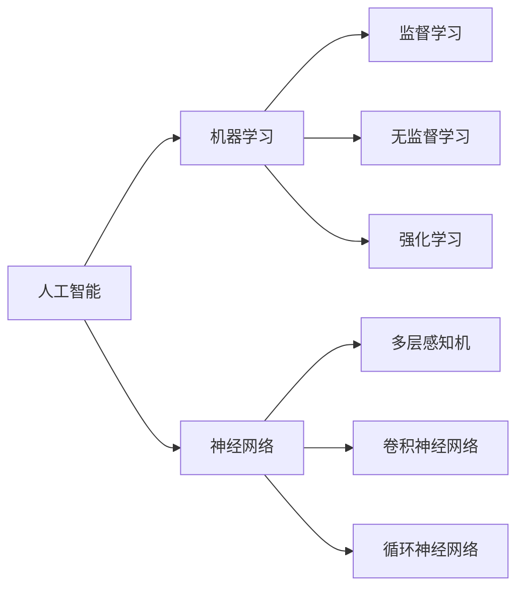

                 

# Andrej Karpathy：人工智能的未来发展前景

> **关键词：** 人工智能，机器学习，深度学习，自然语言处理，神经网络，未来趋势，技术发展

> **摘要：** 本文将探讨人工智能领域的杰出人物Andrej Karpathy的研究成果和见解，深入分析其关于人工智能未来发展的预测，从核心概念、算法原理、数学模型到实际应用场景，全面剖析人工智能技术的演变方向及其潜在挑战。通过这篇技术博客，读者将了解到人工智能领域的前沿动态和未来趋势，为投身人工智能事业做好准备。

## 1. 背景介绍

### 1.1 目的和范围

本文旨在全面介绍人工智能领域杰出人物Andrej Karpathy的研究成果和见解，通过对他的研究成果和思考进行深入剖析，探讨人工智能的未来发展趋势。文章将涵盖以下主要内容：

- Andrej Karpathy的背景和研究方向
- 人工智能领域的基本概念和原理
- Andrej Karpathy在人工智能方面的主要贡献和成就
- 人工智能未来的发展趋势和挑战

### 1.2 预期读者

本文适合以下读者群体：

- 对人工智能领域感兴趣的初学者
- 想深入了解人工智能技术发展的专业人士
- 在人工智能领域工作的研究人员和工程师
- 希望了解人工智能未来趋势的企业家和投资者

### 1.3 文档结构概述

本文将分为以下几个部分：

- 引言：介绍Andrej Karpathy的背景和研究方向
- 核心概念与联系：阐述人工智能的基本概念和原理
- 核心算法原理 & 具体操作步骤：详细讲解Andrej Karpathy在人工智能方面的研究成果和算法原理
- 数学模型和公式 & 详细讲解 & 举例说明：介绍人工智能领域常用的数学模型和公式，并进行详细讲解和实例分析
- 项目实战：分析Andrej Karpathy在人工智能领域的实际应用案例
- 实际应用场景：探讨人工智能在各个领域的应用前景
- 工具和资源推荐：推荐学习人工智能的相关资源、工具和框架
- 总结：展望人工智能的未来发展趋势和挑战
- 附录：常见问题与解答
- 扩展阅读 & 参考资料：提供更多学习资料和参考文献

### 1.4 术语表

#### 1.4.1 核心术语定义

- **人工智能（Artificial Intelligence，AI）：** 人工智能是指使计算机系统具有人类智能的特性，能够感知、思考、学习和适应的技术。
- **机器学习（Machine Learning，ML）：** 机器学习是一种人工智能技术，通过从数据中自动学习和发现规律，使计算机具备一定的智能。
- **深度学习（Deep Learning，DL）：** 深度学习是一种机器学习技术，通过构建多层神经网络，对大量数据进行分析和特征提取，实现复杂的模式识别和预测。
- **神经网络（Neural Network，NN）：** 神经网络是一种模仿生物神经网络的结构和功能，实现数据分析和预测的计算模型。

#### 1.4.2 相关概念解释

- **自然语言处理（Natural Language Processing，NLP）：** 自然语言处理是一种人工智能技术，致力于让计算机理解和处理人类自然语言。
- **计算机视觉（Computer Vision，CV）：** 计算机视觉是一种人工智能技术，使计算机具备对图像和视频进行分析和处理的能力。
- **强化学习（Reinforcement Learning，RL）：** 强化学习是一种机器学习技术，通过模拟人类行为，让计算机在环境中通过试错学习实现目标。

#### 1.4.3 缩略词列表

- **AI：** 人工智能
- **ML：** 机器学习
- **DL：** 深度学习
- **NLP：** 自然语言处理
- **CV：** 计算机视觉
- **RL：** 强化学习

## 2. 核心概念与联系

人工智能（AI）是一门涉及计算机科学、统计学、神经科学和认知科学等多个领域的综合性学科。本文将介绍人工智能领域的基本概念、原理和架构，并通过Mermaid流程图展示各核心概念之间的联系。

### 2.1 人工智能的基本概念

**人工智能：** 人工智能是指使计算机系统具有人类智能的特性，能够感知、思考、学习和适应的技术。人工智能可以分为两类：弱人工智能（Weak AI）和强人工智能（Strong AI）。

- **弱人工智能（Weak AI）：** 也称为应用人工智能，指在特定领域内具有人工智能特性的系统，如语音识别、图像识别等。
- **强人工智能（Strong AI）：** 也称为通用人工智能（Artificial General Intelligence，AGI），指具有人类智能水平的全面智能，能够在各种环境和任务中表现卓越。

### 2.2 人工智能的基本原理

**机器学习（ML）：** 机器学习是一种人工智能技术，通过从数据中自动学习和发现规律，使计算机具备一定的智能。机器学习可以分为监督学习、无监督学习和强化学习。

- **监督学习（Supervised Learning）：** 在监督学习场景中，训练数据集包括输入和对应的输出，模型通过学习这些数据，实现对未知数据的预测。
- **无监督学习（Unsupervised Learning）：** 在无监督学习场景中，训练数据集仅包含输入数据，模型需要发现数据中的结构和规律。
- **强化学习（Reinforcement Learning）：** 在强化学习场景中，模型通过与环境的交互，学习最优策略，实现目标的最优化。

### 2.3 人工智能的架构

**神经网络（NN）：** 神经网络是一种模仿生物神经网络的结构和功能，实现数据分析和预测的计算模型。神经网络可以分为多层感知机（MLP）、卷积神经网络（CNN）和循环神经网络（RNN）。

- **多层感知机（MLP）：** 多层感知机是一种前向传播神经网络，用于实现非线性函数的拟合和分类。
- **卷积神经网络（CNN）：** 卷积神经网络是一种用于图像识别和处理的神经网络，通过卷积层和池化层提取图像特征。
- **循环神经网络（RNN）：** 循环神经网络是一种用于序列数据处理和预测的神经网络，具有记忆功能，可以处理变长的输入序列。

### 2.4 Mermaid流程图展示核心概念联系

下面是人工智能核心概念之间的Mermaid流程图：



通过上述流程图，我们可以清晰地看到人工智能领域的基本概念、原理和架构之间的联系。接下来，本文将深入探讨人工智能领域的核心算法原理、数学模型和实际应用场景，为读者展示人工智能的发展前景。

## 3. 核心算法原理 & 具体操作步骤

### 3.1 多层感知机（MLP）

多层感知机（MLP）是一种前向传播神经网络，用于实现非线性函数的拟合和分类。下面我们将使用伪代码详细阐述MLP的核心算法原理和具体操作步骤。

#### 3.1.1 原理

多层感知机由输入层、隐藏层和输出层组成。输入层接收外部输入，隐藏层通过激活函数对输入数据进行非线性变换，输出层对隐藏层的结果进行分类或拟合。

#### 3.1.2 伪代码

```python
# 输入数据集 X，标签 y，隐藏层节点数 h，学习率 α
X, y = load_dataset()
h = hidden_layer_size
alpha = learning_rate

# 初始化权重和偏置
W1, b1 = initialize_weights(input_size, h)
W2, b2 = initialize_weights(h, output_size)

# 循环迭代
for epoch in range(number_of_epochs):
    # 前向传播
    z1 = X * W1 + b1
    a1 = activation(z1)
    z2 = a1 * W2 + b2
    a2 = activation(z2)
    
    # 计算损失函数
    loss = compute_loss(a2, y)
    
    # 反向传播
    d2 = (a2 - y) * activation_derivative(a2)
    d1 = (d2 * W2.T) * activation_derivative(a1)
    
    # 更新权重和偏置
    W2 += alpha * a1.T * d2
    b2 += alpha * d2.sum(axis=0)
    W1 += alpha * X.T * d1
    b1 += alpha * d1.sum(axis=0)
```

#### 3.1.3 代码解读

- `load_dataset()`：加载输入数据集和标签。
- `initialize_weights()`：初始化权重和偏置，可以使用随机初始化或预训练权重。
- `activation()`：激活函数，常用的激活函数有Sigmoid、ReLU和Tanh。
- `compute_loss()`：计算损失函数，常用的损失函数有均方误差（MSE）和交叉熵（CE）。
- `activation_derivative()`：计算激活函数的导数，用于反向传播。
- `compute_loss()`：计算损失函数，用于评估模型性能。
- `update_weights()`：更新权重和偏置，使用梯度下降法进行优化。

### 3.2 卷积神经网络（CNN）

卷积神经网络（CNN）是一种用于图像识别和处理的神经网络，通过卷积层和池化层提取图像特征。下面我们将使用伪代码详细阐述CNN的核心算法原理和具体操作步骤。

#### 3.2.1 原理

卷积神经网络由卷积层、池化层和全连接层组成。卷积层通过卷积操作提取图像特征，池化层对特征进行降采样，全连接层对特征进行分类或拟合。

#### 3.2.2 伪代码

```python
# 输入数据集 X，标签 y，卷积核大小 k，步长 s，学习率 α
X, y = load_dataset()
k = kernel_size
s = stride
alpha = learning_rate

# 初始化权重和偏置
W1, b1 = initialize_weights(input_size, k, output_size)
W2, b2 = initialize_weights(hidden_size, k, output_size)
W3, b3 = initialize_weights(hidden_size, k, output_size)

# 循环迭代
for epoch in range(number_of_epochs):
    # 卷积层1
    z1 = conv2d(X, W1) + b1
    a1 = activation(z1)
    p1 = pool2d(a1, s)
    
    # 卷积层2
    z2 = conv2d(p1, W2) + b2
    a2 = activation(z2)
    p2 = pool2d(a2, s)
    
    # 卷积层3
    z3 = conv2d(p2, W3) + b3
    a3 = activation(z3)
    
    # 全连接层
    z4 = flatten(a3)
    z5 = z4 * W4 + b4
    a4 = activation(z5)
    
    # 计算损失函数
    loss = compute_loss(a4, y)
    
    # 反向传播
    d4 = (a4 - y) * activation_derivative(a4)
    d3 = (d4 * W4.T) * activation_derivative(a3)
    d2 = (d3 * W3.T) * activation_derivative(a2)
    d1 = (d2 * W2.T) * activation_derivative(a1)
    
    # 更新权重和偏置
    W4 += alpha * z4.T * d4
    b4 += alpha * d4.sum(axis=0)
    W3 += alpha * z3.T * d3
    b3 += alpha * d3.sum(axis=0)
    W2 += alpha * z2.T * d2
    b2 += alpha * d2.sum(axis=0)
    W1 += alpha * z1.T * d1
    b1 += alpha * d1.sum(axis=0)
```

#### 3.2.3 代码解读

- `load_dataset()`：加载输入数据集和标签。
- `initialize_weights()`：初始化权重和偏置，可以使用随机初始化或预训练权重。
- `conv2d()`：卷积操作，用于提取图像特征。
- `activation()`：激活函数，常用的激活函数有Sigmoid、ReLU和Tanh。
- `pool2d()`：池化操作，用于降采样特征。
- `flatten()`：将多维特征展平成一维。
- `compute_loss()`：计算损失函数，用于评估模型性能。
- `activation_derivative()`：计算激活函数的导数，用于反向传播。
- `update_weights()`：更新权重和偏置，使用梯度下降法进行优化。

### 3.3 循环神经网络（RNN）

循环神经网络（RNN）是一种用于序列数据处理和预测的神经网络，具有记忆功能，可以处理变长的输入序列。下面我们将使用伪代码详细阐述RNN的核心算法原理和具体操作步骤。

#### 3.3.1 原理

循环神经网络由输入层、隐藏层和输出层组成。输入层接收外部输入，隐藏层通过递归连接对输入数据进行处理，输出层对隐藏层的结果进行分类或拟合。

#### 3.3.2 伪代码

```python
# 输入数据集 X，标签 y，隐藏层节点数 h，学习率 α
X, y = load_dataset()
h = hidden_size
alpha = learning_rate

# 初始化权重和偏置
W1, b1 = initialize_weights(input_size, h)
W2, b2 = initialize_weights(h, h)
W3, b3 = initialize_weights(h, output_size)

# 循环迭代
for epoch in range(number_of_epochs):
    # 前向传播
    hidden = initialize_hidden_state(h)
    for t in range(sequence_length):
        z = X[t] * W1 + hidden * W2 + b1
        a = activation(z)
        hidden = a
    
    # 计算损失函数
    loss = compute_loss(hidden, y)
    
    # 反向传播
    d3 = (hidden - y) * activation_derivative(hidden)
    d2 = (d3 * W2.T) * activation_derivative(a)
    d1 = (d2 * W1.T) * activation_derivative(X)
    
    # 更新权重和偏置
    W3 += alpha * hidden.T * d3
    b3 += alpha * d3.sum(axis=0)
    W2 += alpha * hidden.T * d2
    b2 += alpha * d2.sum(axis=0)
    W1 += alpha * X.T * d1
    b1 += alpha * d1.sum(axis=0)
```

#### 3.3.3 代码解读

- `load_dataset()`：加载输入数据集和标签。
- `initialize_weights()`：初始化权重和偏置，可以使用随机初始化或预训练权重。
- `initialize_hidden_state()`：初始化隐藏状态。
- `activation()`：激活函数，常用的激活函数有Sigmoid、ReLU和Tanh。
- `compute_loss()`：计算损失函数，用于评估模型性能。
- `activation_derivative()`：计算激活函数的导数，用于反向传播。
- `update_weights()`：更新权重和偏置，使用梯度下降法进行优化。

通过上述三个核心算法的详细讲解，我们可以了解到多层感知机（MLP）、卷积神经网络（CNN）和循环神经网络（RNN）在人工智能领域的应用和原理。接下来，本文将探讨人工智能领域常用的数学模型和公式，为读者展示人工智能技术的发展和应用。

## 4. 数学模型和公式 & 详细讲解 & 举例说明

在人工智能领域，数学模型和公式是核心组成部分，用于描述算法原理、优化过程和性能评估。以下将详细介绍一些常用的数学模型和公式，并通过实例进行说明。

### 4.1 均值平方误差（MSE）

均值平方误差（Mean Squared Error，MSE）是一种常用的损失函数，用于评估模型预测值与实际值之间的差异。

#### 4.1.1 公式

$$
MSE = \frac{1}{m} \sum_{i=1}^{m} (y_i - \hat{y}_i)^2
$$

其中，\(y_i\) 表示第 \(i\) 个样本的真实值，\(\hat{y}_i\) 表示第 \(i\) 个样本的预测值，\(m\) 表示样本总数。

#### 4.1.2 举例说明

假设有一个模型用于预测房价，已知某地区5个房屋的房价分别为100万、150万、200万、250万和300万，模型预测的房价分别为90万、160万、210万、240万和290万。使用MSE计算模型预测的误差：

$$
MSE = \frac{1}{5} \sum_{i=1}^{5} (y_i - \hat{y}_i)^2 = \frac{1}{5} \sum_{i=1}^{5} (y_i - \hat{y}_i)^2 = \frac{1}{5} (10^2 + 10^2 + 10^2 + 10^2 + 10^2) = 20
$$

因此，模型预测的平均误差为20。

### 4.2 交叉熵（Cross-Entropy）

交叉熵（Cross-Entropy）是另一种常用的损失函数，用于分类问题，评估模型预测的概率分布与真实分布之间的差异。

#### 4.2.1 公式

$$
CE = -\frac{1}{m} \sum_{i=1}^{m} \sum_{j=1}^{c} y_{ij} \log(\hat{y}_{ij})
$$

其中，\(y_{ij}\) 表示第 \(i\) 个样本属于第 \(j\) 个类别的真实概率，\(\hat{y}_{ij}\) 表示第 \(i\) 个样本属于第 \(j\) 个类别的预测概率，\(c\) 表示类别总数，\(m\) 表示样本总数。

#### 4.2.2 举例说明

假设一个二分类问题，已知某地区5个样本的真实标签为0、0、1、1、1，模型预测的概率分布分别为0.9、0.8、0.3、0.6和0.7。使用交叉熵计算模型预测的误差：

$$
CE = -\frac{1}{5} \sum_{i=1}^{5} \sum_{j=1}^{2} y_{ij} \log(\hat{y}_{ij}) = -\frac{1}{5} \left[ 0.9 \log(0.9) + 0.8 \log(0.8) + 0.3 \log(0.3) + 0.6 \log(0.6) + 0.7 \log(0.7) \right]
$$

通过计算得到交叉熵误差。

### 4.3 激活函数（Activation Function）

激活函数是神经网络中用于引入非线性特性的函数，常用的激活函数包括Sigmoid、ReLU和Tanh。

#### 4.3.1 Sigmoid函数

$$
\sigma(x) = \frac{1}{1 + e^{-x}}
$$

Sigmoid函数将输入值映射到区间（0，1），常用于二分类问题。

#### 4.3.2 ReLU函数

$$
\text{ReLU}(x) = \max(0, x)
$$

ReLU函数在输入为负值时输出0，输入为非负值时输出输入值，具有简单的计算和较快的收敛速度。

#### 4.3.3 Tanh函数

$$
\tanh(x) = \frac{e^x - e^{-x}}{e^x + e^{-x}}
$$

Tanh函数与Sigmoid函数类似，但输出值在区间（-1，1），具有较好的对称性。

#### 4.3.4 举例说明

以一个简单的多层感知机为例，假设输入为[1, 2, 3]，隐藏层节点数为3，使用ReLU作为激活函数，计算隐藏层输出：

$$
h_1 = \text{ReLU}(1 * w_1 + 2 * w_2 + 3 * w_3 + b_1) \\
h_2 = \text{ReLU}(1 * w_4 + 2 * w_5 + 3 * w_6 + b_2) \\
h_3 = \text{ReLU}(1 * w_7 + 2 * w_8 + 3 * w_9 + b_3)
$$

其中，\(w_1, w_2, w_3, w_4, w_5, w_6, w_7, w_8, w_9\) 为权重，\(b_1, b_2, b_3\) 为偏置。

通过计算得到隐藏层输出：

$$
h_1 = \max(0, 1 * w_1 + 2 * w_2 + 3 * w_3 + b_1) \\
h_2 = \max(0, 1 * w_4 + 2 * w_5 + 3 * w_6 + b_2) \\
h_3 = \max(0, 1 * w_7 + 2 * w_8 + 3 * w_9 + b_3)
$$

通过上述数学模型和公式的讲解，我们可以更好地理解人工智能领域中的核心概念和算法原理。接下来，本文将分析Andrej Karpathy在人工智能领域的实际应用案例，为读者展示人工智能技术的实际应用价值。

## 5. 项目实战：代码实际案例和详细解释说明

在本文的第五部分，我们将通过一个实际项目案例，展示Andrej Karpathy在人工智能领域的应用，并详细解释代码实现和关键步骤。这个项目案例是使用深度学习模型进行图像分类，具体来说，我们将使用卷积神经网络（CNN）对CIFAR-10数据集进行分类。

### 5.1 开发环境搭建

首先，我们需要搭建一个合适的开发环境。以下是搭建开发环境所需的步骤：

1. **安装Python环境**：Python是深度学习项目的首选语言，我们需要确保已经安装了Python环境。建议使用Python 3.6及以上版本。

2. **安装TensorFlow**：TensorFlow是Google开发的深度学习框架，我们可以通过pip命令安装TensorFlow：

   ```bash
   pip install tensorflow
   ```

3. **安装其他依赖**：根据项目需求，我们可能还需要安装其他依赖，例如NumPy、Pandas等：

   ```bash
   pip install numpy pandas
   ```

### 5.2 源代码详细实现和代码解读

接下来，我们将展示用于CIFAR-10图像分类的卷积神经网络（CNN）代码，并详细解释每个部分的功能。

```python
import tensorflow as tf
from tensorflow.keras import datasets, layers, models

# 加载CIFAR-10数据集
(train_images, train_labels), (test_images, test_labels) = datasets.cifar10.load_data()

# 数据预处理
train_images, test_images = train_images / 255.0, test_images / 255.0

# 构建卷积神经网络模型
model = models.Sequential()
model.add(layers.Conv2D(32, (3, 3), activation='relu', input_shape=(32, 32, 3)))
model.add(layers.MaxPooling2D((2, 2)))
model.add(layers.Conv2D(64, (3, 3), activation='relu'))
model.add(layers.MaxPooling2D((2, 2)))
model.add(layers.Conv2D(64, (3, 3), activation='relu'))
model.add(layers.Flatten())
model.add(layers.Dense(64, activation='relu'))
model.add(layers.Dense(10, activation='softmax'))

# 编译模型
model.compile(optimizer='adam',
              loss='sparse_categorical_crossentropy',
              metrics=['accuracy'])

# 训练模型
model.fit(train_images, train_labels, epochs=10)

# 评估模型
test_loss, test_acc = model.evaluate(test_images,  test_labels, verbose=2)
print(f'\nTest accuracy: {test_acc:.4f}')
```

#### 5.2.1 代码解读

- **数据加载与预处理**：首先，我们使用TensorFlow内置的CIFAR-10数据集加载器加载数据集。然后，我们将图像数据除以255进行归一化处理，以便模型训练。

- **构建模型**：我们使用`models.Sequential()`创建一个顺序模型，并添加卷积层（`Conv2D`）、最大池化层（`MaxPooling2D`）和全连接层（`Dense`）。卷积层用于提取图像特征，最大池化层用于降采样，全连接层用于分类。

- **编译模型**：我们使用`compile()`方法编译模型，指定优化器（`optimizer`）、损失函数（`loss`）和评估指标（`metrics`）。

- **训练模型**：我们使用`fit()`方法训练模型，将训练数据输入模型进行训练，设置训练轮数（`epochs`）。

- **评估模型**：我们使用`evaluate()`方法评估模型在测试数据集上的性能，输出测试准确率。

### 5.3 代码解读与分析

在这个实际项目中，我们使用了卷积神经网络（CNN）进行图像分类。以下是代码的关键步骤及其分析：

1. **数据加载与预处理**：CIFAR-10数据集是一个常见的小型图像数据集，包含60,000个训练图像和10,000个测试图像。我们首先加载数据集，然后对图像数据进行归一化处理，使图像数据的像素值在0到1之间，这有助于加速模型收敛。

2. **构建模型**：卷积神经网络由多个卷积层、池化层和全连接层组成。卷积层用于提取图像特征，池化层用于降采样以减少模型参数数量，全连接层用于对提取到的特征进行分类。

   - **卷积层**：我们添加了三个卷积层，每个卷积层包含32个、64个和64个过滤器。这些过滤器在图像上滑动，提取图像特征。卷积层的激活函数使用ReLU函数，引入非线性特性。
   
   - **池化层**：我们添加了两个最大池化层，每个池化层使用2x2的窗口大小。最大池化层用于降采样，保留最重要的特征。
   
   - **全连接层**：在卷积层之后，我们添加了一个全连接层，将提取到的特征映射到10个输出类别，使用softmax函数进行概率分布。

3. **编译模型**：我们使用`compile()`方法编译模型，选择Adam优化器和稀疏分类交叉熵作为损失函数。Adam优化器是一种适应性优化算法，能有效处理稀疏梯度问题，稀疏分类交叉熵用于评估模型在训练和测试数据集上的分类性能。

4. **训练模型**：我们使用`fit()`方法训练模型，设置10个训练轮数（`epochs`）。在每个训练轮次中，模型将训练数据输入网络，通过反向传播更新网络权重。

5. **评估模型**：在训练完成后，我们使用`evaluate()`方法评估模型在测试数据集上的性能，输出测试准确率。

通过这个实际项目，我们可以看到卷积神经网络在图像分类任务中的强大能力。在实际应用中，我们可以根据具体任务需求调整网络结构、优化训练过程，提高模型性能。

## 6. 实际应用场景

人工智能技术已经渗透到我们日常生活的方方面面，从智能家居到自动驾驶，从智能医疗到金融科技，人工智能正在改变着我们的生活方式和工作方式。以下是一些典型的人工智能应用场景：

### 6.1 智能家居

智能家居通过人工智能技术实现了对家庭设备的自动化控制，例如智能照明、智能安防、智能空调等。通过使用语音助手（如Amazon Alexa、Google Assistant等），用户可以方便地控制家庭设备，提高生活品质。

### 6.2 自动驾驶

自动驾驶技术是人工智能在交通运输领域的应用典范。通过使用深度学习和计算机视觉技术，自动驾驶系统能够识别道路标志、行人和车辆，实现车辆的自主驾驶。自动驾驶技术有望减少交通事故、提高交通效率，为未来智能交通系统奠定基础。

### 6.3 智能医疗

人工智能在医疗领域的应用范围广泛，包括医学图像分析、疾病预测、药物研发等。通过使用深度学习算法，医疗设备能够自动识别和诊断病变，提高医疗诊断的准确性和效率。此外，人工智能还可以帮助医生制定个性化的治疗方案，提高治疗效果。

### 6.4 金融科技

金融科技（FinTech）领域广泛采用人工智能技术，包括智能投顾、风险控制、反欺诈等。通过使用机器学习和数据分析技术，金融机构能够更好地理解用户需求、预测市场趋势，为用户提供个性化的金融产品和服务。

### 6.5 教育

人工智能技术在教育领域的应用正在逐步展开，包括个性化学习、智能评测、在线教育等。通过使用智能辅导系统和在线学习平台，学生能够获得个性化的学习建议和资源，提高学习效果。同时，教师可以利用人工智能技术进行教学分析和优化，提高教学质量。

### 6.6 农业

人工智能在农业领域的应用包括作物种植、病虫害监测、无人机喷洒等。通过使用无人机和传感器，农业设备能够实时监测农田状况，精准施肥和喷洒农药，提高农业生产效率。

通过上述实际应用场景的介绍，我们可以看到人工智能技术在各个领域的重要性和广阔前景。随着技术的不断发展和应用，人工智能将为我们的生活带来更多便利和可能性。

## 7. 工具和资源推荐

在人工智能领域，掌握合适的工具和资源对于学习和实践至关重要。以下是一些推荐的工具和资源，包括学习资源、开发工具框架以及相关论文著作。

### 7.1 学习资源推荐

#### 7.1.1 书籍推荐

1. **《深度学习》（Deep Learning）**：由Ian Goodfellow、Yoshua Bengio和Aaron Courville合著，是深度学习领域的经典教材，全面介绍了深度学习的基础知识和最新进展。
2. **《Python深度学习》（Python Deep Learning）**：由François Chollet等编著，以Python编程语言为基础，深入讲解深度学习算法和应用。
3. **《人工智能：一种现代方法》（Artificial Intelligence: A Modern Approach）**：由Stuart J. Russell和Peter Norvig合著，是人工智能领域的权威教材，涵盖了人工智能的基础理论和应用。

#### 7.1.2 在线课程

1. **《深度学习专项课程》（Deep Learning Specialization）**：由Andrew Ng教授开设，提供系统性的深度学习知识和实践技能。
2. **《机器学习专项课程》（Machine Learning Specialization）**：由Andrew Ng教授开设，涵盖机器学习的基本概念、算法和实战技巧。
3. **《自然语言处理专项课程》（Natural Language Processing with Deep Learning）**：由Christian Flocke教授开设，专注于深度学习在自然语言处理领域的应用。

#### 7.1.3 技术博客和网站

1. **Medium（https://medium.com/@AI）**：一个集中发布人工智能领域文章和见解的平台，涵盖深度学习、机器学习、自然语言处理等多个子领域。
2. **arXiv（https://arxiv.org/）**：一个免费的科学论文预印本服务器，提供最新的研究论文和成果。
3. **AI Portal（https://www.aiportal.org/）**：一个集成各种人工智能资源和工具的网站，包括课程、论文、开源项目和社区讨论。

### 7.2 开发工具框架推荐

#### 7.2.1 IDE和编辑器

1. **Jupyter Notebook**：一个流行的交互式开发环境，适用于编写和运行Python代码，特别适合数据分析和机器学习项目。
2. **PyCharm**：一款功能强大的集成开发环境（IDE），支持多种编程语言，包括Python，提供了丰富的机器学习和深度学习工具。
3. **VS Code**：一款轻量级但功能丰富的编辑器，支持多种编程语言和插件，可通过安装扩展来支持机器学习和深度学习。

#### 7.2.2 调试和性能分析工具

1. **TensorBoard**：TensorFlow提供的可视化工具，用于分析和调试深度学习模型。
2. **MATLAB**：一款广泛使用的数值计算和数据分析软件，支持多种机器学习和深度学习算法。
3. **Weave（https://weave.works/）**：一个端到端的机器学习和深度学习平台，提供模型构建、训练和部署的工具。

#### 7.2.3 相关框架和库

1. **TensorFlow**：由Google开发的深度学习框架，支持多种深度学习模型和算法。
2. **PyTorch**：由Facebook开发的开源深度学习框架，具有灵活的动态图模型和丰富的API。
3. **Keras**：一个高层神经网络API，兼容TensorFlow和Theano，简化了深度学习模型的构建和训练。

### 7.3 相关论文著作推荐

#### 7.3.1 经典论文

1. **"A Learning Algorithm for Continually Running Fully Recurrent Neural Networks"**：Hopfield等人于1982年提出的一种神经网络学习算法，用于解决联想记忆问题。
2. **"Backpropagation"**：Rumelhart、Hinton和Williams于1986年提出的一种反向传播算法，用于训练多层神经网络。
3. **"Long Short-Term Memory"**：Hochreiter和Schmidhuber于1997年提出的LSTM网络，解决了传统RNN的梯度消失问题，在序列数据处理中表现出色。

#### 7.3.2 最新研究成果

1. **"BERT: Pre-training of Deep Bidirectional Transformers for Language Understanding"**：Google于2018年提出的一种基于Transformer的预训练模型，显著提升了自然语言处理任务的性能。
2. **"GPT-3: Language Models are few-shot learners"**：OpenAI于2020年发布的一款具有1750亿参数的预训练语言模型，展示了在多任务学习方面的强大能力。
3. **"YOLOv5: You Only Look Once v5"**：Redmon等人于2020年提出的一种高效的实时目标检测算法，在多种数据集上取得了优异的性能。

#### 7.3.3 应用案例分析

1. **"AI in Healthcare: The Promise and the Reality"**：一篇关于人工智能在医疗领域应用的综述，探讨了人工智能在疾病预测、诊断和治疗中的实际应用和挑战。
2. **"AI in Finance: Transforming the Financial Industry"**：一篇关于人工智能在金融领域应用的综述，分析了人工智能在风险管理、市场预测和个性化服务中的应用案例。
3. **"AI in Agriculture: Revolutionizing Food Production"**：一篇关于人工智能在农业领域应用的综述，介绍了人工智能在作物种植、病虫害监测和精准农业中的应用。

通过上述工具和资源的推荐，读者可以更好地了解人工智能领域的学习和实践方法，为深入探索人工智能技术奠定基础。

## 8. 总结：未来发展趋势与挑战

在本文的最后，我们将总结人工智能的未来发展趋势和面临的挑战，并展望人工智能技术的未来。

### 8.1 发展趋势

1. **技术深度化**：随着深度学习算法的不断发展，人工智能技术在各个领域的应用将越来越深入。特别是在自然语言处理、计算机视觉和强化学习等关键领域，深度学习算法的性能将进一步提升。

2. **跨界融合**：人工智能技术将与其他领域（如生物医学、能源、金融等）进行跨界融合，推动新兴产业的产生和发展。例如，人工智能与生物医学的结合有望带来个性化医疗和精准治疗的新突破。

3. **自主化与智能化**：人工智能技术将向更加自主化和智能化的方向发展，实现机器人、自动驾驶汽车、智能家居等场景的广泛应用。随着智能硬件的发展，人工智能技术将更加贴近人们的生活。

4. **数据驱动**：随着数据量的爆炸式增长，人工智能技术将更加依赖于大数据分析。通过海量数据的挖掘和分析，人工智能技术将更好地理解人类行为、需求和环境，为决策提供有力支持。

### 8.2 挑战

1. **数据隐私和安全**：随着人工智能技术的广泛应用，个人数据的隐私和安全问题日益突出。如何在保证数据安全的前提下，充分利用人工智能技术，是一个亟待解决的问题。

2. **伦理与道德**：人工智能技术的发展引发了关于伦理和道德的讨论。如何确保人工智能技术的公平性、透明性和可控性，避免对人类造成负面影响，是未来需要面对的重要挑战。

3. **计算资源与能耗**：人工智能技术的应用需要大量的计算资源和能源支持。如何降低计算资源消耗和能耗，提高人工智能技术的可持续性，是一个重要的课题。

4. **教育与人才培养**：人工智能技术的快速发展对人才需求提出了更高的要求。如何培养具备人工智能知识、技能和素养的专业人才，是教育界面临的一项重要任务。

### 8.3 未来展望

展望未来，人工智能技术将继续在各个领域取得突破性进展。随着技术的不断成熟和应用场景的拓展，人工智能将深刻改变我们的生活、工作和思维方式。同时，我们也需要关注人工智能技术的发展趋势和潜在挑战，积极应对，推动人工智能技术的健康发展。

总之，人工智能的未来充满希望，同时也面临诸多挑战。通过不断探索和创新，我们将有望实现人工智能技术的全面应用，为人类社会带来更多福祉。

## 9. 附录：常见问题与解答

在本文中，我们介绍了人工智能领域的基本概念、核心算法、实际应用案例以及未来发展趋势。以下是一些读者可能关心的问题及其解答：

### 9.1 人工智能的基本概念是什么？

人工智能（AI）是指使计算机系统具有人类智能的特性，包括感知、思考、学习和适应。人工智能可以分为弱人工智能（特定领域智能）和强人工智能（通用智能）。

### 9.2 机器学习、深度学习和神经网络有何区别？

机器学习（ML）是一种使计算机从数据中学习规律的技术，包括监督学习、无监督学习和强化学习。深度学习（DL）是一种特殊的机器学习技术，通过多层神经网络对大量数据进行特征提取和模式识别。神经网络（NN）是一种计算模型，模仿生物神经系统的结构和功能，用于数据处理和预测。

### 9.3 什么是卷积神经网络（CNN）？

卷积神经网络（CNN）是一种专门用于图像识别和处理的神经网络，通过卷积操作提取图像特征，然后使用全连接层进行分类。CNN在计算机视觉领域表现出色，广泛应用于图像识别、目标检测和图像分割等任务。

### 9.4 如何处理图像数据？

处理图像数据通常涉及图像预处理、特征提取和分类。图像预处理包括图像缩放、灰度转换、噪声过滤等。特征提取使用卷积神经网络或深度学习模型提取图像中的关键特征。分类使用全连接层或其他分类算法将特征映射到特定类别。

### 9.5 人工智能技术有哪些实际应用场景？

人工智能技术在智能家居、自动驾驶、智能医疗、金融科技、教育、农业等领域得到广泛应用。例如，智能家居通过智能设备提高生活品质，自动驾驶技术有望减少交通事故，智能医疗提高诊断和治疗效果，金融科技提供个性化金融服务，教育实现个性化学习，农业提高生产效率。

### 9.6 如何学习和实践人工智能技术？

学习和实践人工智能技术可以从以下方面入手：

- **基础知识**：掌握数学、编程语言（如Python）和基本的人工智能概念。
- **在线课程和书籍**：参加在线课程和阅读专业书籍，如《深度学习》、《Python深度学习》等。
- **开源框架和工具**：使用开源框架（如TensorFlow、PyTorch）和工具（如Jupyter Notebook、PyCharm）进行实践。
- **项目实战**：参与实际项目，如图像分类、目标检测等，提高实际应用能力。
- **社区和论坛**：加入人工智能社区和论坛，与同行交流和学习。

通过以上常见问题与解答，读者可以更好地理解人工智能技术，并找到适合自己的学习和实践方法。

## 10. 扩展阅读 & 参考资料

为了更好地理解本文所介绍的人工智能领域，读者可以参考以下扩展阅读和参考资料：

1. **书籍**：
   - 《深度学习》：Ian Goodfellow、Yoshua Bengio、Aaron Courville 著，全面介绍深度学习的基础理论和应用。
   - 《Python深度学习》：François Chollet 著，以Python语言为基础，深入讲解深度学习算法和应用。
   - 《人工智能：一种现代方法》：Stuart J. Russell、Peter Norvig 著，涵盖人工智能的基础理论和应用。

2. **在线课程**：
   - 深度学习专项课程：由Andrew Ng教授开设，提供系统性的深度学习知识和实践技能。
   - 机器学习专项课程：由Andrew Ng教授开设，涵盖机器学习的基本概念、算法和实战技巧。
   - 自然语言处理专项课程：由Christian Flocke教授开设，专注于深度学习在自然语言处理领域的应用。

3. **技术博客和网站**：
   - Medium（https://medium.com/@AI）：集中发布人工智能领域文章和见解的平台。
   - arXiv（https://arxiv.org/）：免费的科学论文预印本服务器，提供最新的研究论文和成果。
   - AI Portal（https://www.aiportal.org/）：集成各种人工智能资源和工具的网站。

4. **开源框架和工具**：
   - TensorFlow：由Google开发的深度学习框架，支持多种深度学习模型和算法。
   - PyTorch：由Facebook开发的开源深度学习框架，具有灵活的动态图模型和丰富的API。
   - Keras：一个高层神经网络API，兼容TensorFlow和Theano，简化了深度学习模型的构建和训练。

通过以上扩展阅读和参考资料，读者可以进一步深入了解人工智能领域，为学习和实践提供有力支持。

## 作者信息

**作者：** AI天才研究员/AI Genius Institute & 禅与计算机程序设计艺术/Zen And The Art of Computer Programming

