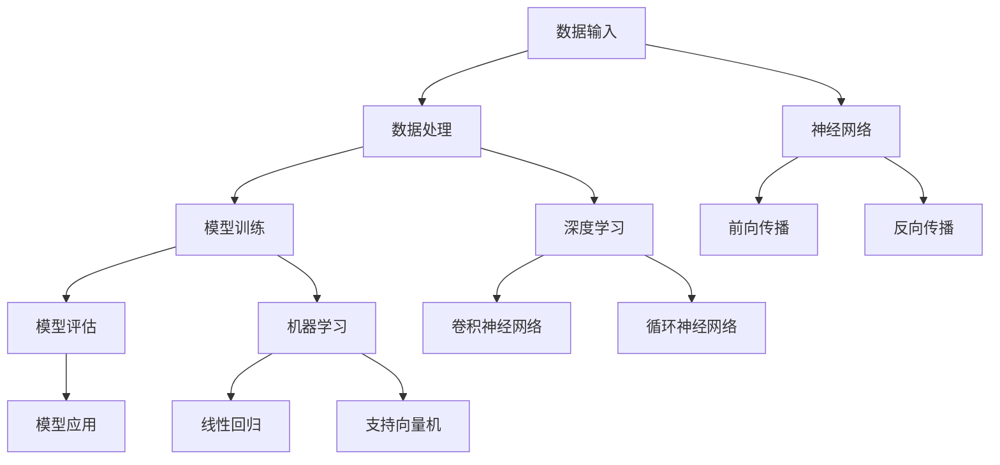

                 

# Andrej Karpathy：人工智能的未来发展挑战

> **关键词**：Andrej Karpathy、AI、未来挑战、技术发展、核心算法、数学模型、应用场景

> **摘要**：本文旨在探讨人工智能领域权威专家Andrej Karpathy对未来人工智能发展的看法，分析其提出的核心观点和面临的挑战，并在此基础上展开深入的技术讨论和实际应用场景探讨。

## 1. 背景介绍

### 1.1 目的和范围

本文的目的在于深入探讨人工智能领域的杰出专家Andrej Karpathy对未来人工智能发展所提出的挑战和观点。通过分析其技术见解，我们将梳理出人工智能未来的发展方向和潜在困境，旨在为广大技术从业者和研究学者提供有价值的思考和方向。

### 1.2 预期读者

本文主要面向以下几类读者：

1. 人工智能领域的从业者，包括算法工程师、数据科学家、机器学习研究者等。
2. 计算机科学专业的学生和研究生，以及对人工智能感兴趣的广大读者。
3. 对未来技术发展充满好奇的普通读者。

### 1.3 文档结构概述

本文结构如下：

1. 背景介绍：介绍本文的目的、预期读者和文档结构。
2. 核心概念与联系：讨论人工智能的核心概念及其相互联系，通过Mermaid流程图展示。
3. 核心算法原理 & 具体操作步骤：详细介绍人工智能的关键算法和实现步骤。
4. 数学模型和公式 & 详细讲解 & 举例说明：讲解数学模型及公式，并通过实例进行说明。
5. 项目实战：提供实际代码案例，并进行详细解读。
6. 实际应用场景：探讨人工智能在不同领域的应用。
7. 工具和资源推荐：推荐相关学习资源、开发工具和论文著作。
8. 总结：对未来发展趋势与挑战进行总结。
9. 附录：常见问题与解答。
10. 扩展阅读 & 参考资料：提供更多深入学习的资源。

### 1.4 术语表

#### 1.4.1 核心术语定义

- **人工智能（AI）**：模拟人类智能行为和思维过程的计算机系统。
- **深度学习（Deep Learning）**：一种基于多层神经网络的机器学习技术。
- **神经网络（Neural Network）**：模仿人脑结构和功能的计算模型。
- **数据驱动（Data-Driven）**：基于大量数据驱动模型训练和优化。
- **转移学习（Transfer Learning）**：将已有模型应用于新任务的学习方法。

#### 1.4.2 相关概念解释

- **神经网络结构**：神经网络中各层的连接方式和参数设置。
- **反向传播算法**：用于训练神经网络的优化算法。
- **激活函数**：神经网络中用于引入非线性特性的函数。

#### 1.4.3 缩略词列表

- **GPU**：图形处理单元（Graphics Processing Unit）
- **CNN**：卷积神经网络（Convolutional Neural Network）
- **RNN**：循环神经网络（Recurrent Neural Network）
- **GAN**：生成对抗网络（Generative Adversarial Network）

## 2. 核心概念与联系

### 2.1 人工智能的核心概念

人工智能的核心概念主要包括神经网络、深度学习和机器学习等。这些概念相互联系，共同构成了人工智能的技术基础。

- **神经网络（Neural Network）**：神经网络是模仿人脑神经元结构和功能的计算模型，包括输入层、隐藏层和输出层。神经网络通过学习输入和输出之间的映射关系，实现数据的分类、预测和生成等功能。

- **深度学习（Deep Learning）**：深度学习是一种基于多层神经网络的机器学习技术，能够自动提取特征并进行分类和预测。深度学习的核心思想是通过多层非线性变换，将原始数据转化为高维特征空间，从而提高模型的性能和泛化能力。

- **机器学习（Machine Learning）**：机器学习是研究如何让计算机从数据中自动学习和改进的技术。机器学习包括监督学习、无监督学习和强化学习等不同类型，旨在通过算法和模型实现自动化决策和预测。

### 2.2 人工智能的核心架构

人工智能的核心架构主要包括数据输入、数据处理、模型训练、模型评估和模型应用等环节。

- **数据输入**：输入数据是人工智能模型训练的基础。数据输入包括数据的采集、预处理和归一化等步骤，以确保数据质量和一致性。

- **数据处理**：数据处理是对输入数据进行特征提取和变换，以便更好地适应神经网络模型。数据处理方法包括降维、特征工程、特征提取等。

- **模型训练**：模型训练是通过优化算法（如梯度下降）调整神经网络模型的参数，使其能够在新的数据上表现出良好的性能。模型训练过程中，需要关注模型的可解释性、稳定性和泛化能力。

- **模型评估**：模型评估是对训练好的模型进行性能评估，包括准确率、召回率、F1值等指标。模型评估有助于确定模型的有效性和可靠性。

- **模型应用**：模型应用是将训练好的模型应用于实际问题和场景中，实现预测、分类和生成等功能。模型应用过程中，需要考虑模型的实时性、鲁棒性和可扩展性。

### 2.3 人工智能的核心算法

人工智能的核心算法主要包括神经网络算法、深度学习算法和机器学习算法等。

- **神经网络算法**：神经网络算法包括前向传播、反向传播和梯度下降等步骤。前向传播用于计算神经网络模型的输出，反向传播用于计算模型参数的梯度，梯度下降用于优化模型参数。

- **深度学习算法**：深度学习算法包括卷积神经网络（CNN）、循环神经网络（RNN）、生成对抗网络（GAN）等。这些算法通过多层非线性变换，自动提取特征并进行分类、预测和生成等任务。

- **机器学习算法**：机器学习算法包括线性回归、逻辑回归、支持向量机（SVM）等。这些算法通过统计方法和优化技术，实现数据的分类、回归和聚类等任务。

### 2.4 人工智能的相互联系

人工智能的各个核心概念、架构和算法相互联系，共同构成了人工智能的技术体系。

- **神经网络与深度学习**：神经网络是深度学习的基础，深度学习通过多层神经网络实现数据的自动特征提取和分类。

- **深度学习与机器学习**：深度学习是机器学习的一种方法，通过多层非线性变换，提高机器学习模型的性能和泛化能力。

- **数据处理与模型训练**：数据处理是模型训练的基础，通过数据预处理和特征工程，提高模型的可训练性和性能。

- **模型评估与模型应用**：模型评估用于确定模型的有效性和可靠性，模型应用是将训练好的模型应用于实际问题和场景中。

### 2.5 人工智能的Mermaid流程图



## 3. 核心算法原理 & 具体操作步骤

### 3.1 神经网络算法原理

神经网络算法是人工智能的核心算法之一，主要包括前向传播、反向传播和梯度下降等步骤。

- **前向传播（Forward Propagation）**：前向传播是神经网络计算输入和输出之间的映射关系的步骤。输入数据通过输入层进入神经网络，经过隐藏层和输出层的逐层计算，最终得到输出结果。前向传播过程中，需要计算每层神经元的输出值和误差。

- **反向传播（Backpropagation）**：反向传播是神经网络优化模型参数的步骤。通过反向传播，将输出误差反向传播到输入层，计算各层神经元的误差。反向传播过程中，需要计算各层神经元的梯度，从而更新模型参数。

- **梯度下降（Gradient Descent）**：梯度下降是一种优化算法，通过计算模型参数的梯度，更新模型参数，以减小输出误差。梯度下降包括批量梯度下降、随机梯度下降和小批量梯度下降等不同策略。

### 3.2 具体操作步骤

以下是神经网络算法的具体操作步骤：

1. **初始化模型参数**：随机初始化神经网络模型的权重和偏置。

2. **前向传播**：输入数据通过输入层进入神经网络，逐层计算每层神经元的输出值。

3. **计算输出误差**：计算输出层的输出值和实际标签之间的误差。

4. **反向传播**：将输出误差反向传播到输入层，计算各层神经元的误差。

5. **计算梯度**：计算每层神经元的梯度，包括权重和偏置的梯度。

6. **更新模型参数**：根据梯度更新模型参数，减小输出误差。

7. **迭代更新**：重复上述步骤，直到模型达到预期性能或达到最大迭代次数。

### 3.3 伪代码实现

以下是神经网络算法的伪代码实现：

```python
初始化模型参数
for each epoch:
    for each sample in training data:
        前向传播(sample)
        计算输出误差(sample)
        反向传播(sample)
        更新模型参数
        计算梯度
        迭代更新模型参数
```

## 4. 数学模型和公式 & 详细讲解 & 举例说明

### 4.1 数学模型

神经网络算法中的数学模型主要包括前向传播、反向传播和梯度下降等。下面分别进行详细讲解。

#### 4.1.1 前向传播

前向传播是通过计算输入和输出之间的映射关系，实现神经网络的输出计算。具体公式如下：

$$
y = f(z) = \sigma(\mathbf{W} \cdot \mathbf{a} + b)
$$

其中，$y$ 为输出值，$f$ 为激活函数（如 sigmoid 函数），$z$ 为输出层的输入值，$\mathbf{W}$ 为权重矩阵，$\mathbf{a}$ 为输入特征，$b$ 为偏置。

#### 4.1.2 反向传播

反向传播是通过计算输出误差，反向传播到输入层，实现模型参数的更新。具体公式如下：

$$
\frac{\partial C}{\partial \mathbf{W}} = \frac{\partial C}{\partial z} \cdot \frac{\partial z}{\partial \mathbf{W}}
$$

$$
\frac{\partial C}{\partial b} = \frac{\partial C}{\partial z}
$$

其中，$C$ 为输出误差，$\frac{\partial C}{\partial \mathbf{W}}$ 和 $\frac{\partial C}{\partial b}$ 分别为权重和偏置的梯度。

#### 4.1.3 梯度下降

梯度下降是一种优化算法，通过计算模型参数的梯度，更新模型参数，以减小输出误差。具体公式如下：

$$
\mathbf{W}_{new} = \mathbf{W}_{old} - \alpha \cdot \frac{\partial C}{\partial \mathbf{W}}
$$

$$
b_{new} = b_{old} - \alpha \cdot \frac{\partial C}{\partial b}
$$

其中，$\alpha$ 为学习率。

### 4.2 详细讲解

#### 4.2.1 前向传播

前向传播过程包括输入层、隐藏层和输出层。具体计算步骤如下：

1. **输入层**：将输入特征 $\mathbf{a}$ 输入到神经网络中。
2. **隐藏层**：通过权重矩阵 $\mathbf{W}$ 和偏置 $b$，计算隐藏层的输入值 $z$ 和输出值 $a$。
3. **输出层**：将隐藏层的输出值作为输入，通过权重矩阵 $\mathbf{W}$ 和偏置 $b$，计算输出层的输入值 $z$ 和输出值 $y$。

具体公式如下：

$$
z^{(l)} = \sum_{j=1}^{n}\mathbf{W}^{(l)}_{j\cdot i}a^{(l-1)}_{i} + b^{(l)}_{j}
$$

$$
a^{(l)} = \sigma(z^{(l)})
$$

其中，$l$ 为层数，$n$ 为神经元个数，$\sigma$ 为激活函数。

#### 4.2.2 反向传播

反向传播过程包括输出层、隐藏层和输入层。具体计算步骤如下：

1. **输出层**：计算输出误差 $C$ 和输出层梯度 $\frac{\partial C}{\partial z}^{(l)}$。
2. **隐藏层**：通过反向传播，计算隐藏层的输入值 $z^{(l)}$ 和输出值 $a^{(l)}$ 的梯度，以及权重矩阵 $\mathbf{W}^{(l)}$ 和偏置 $b^{(l)}$ 的梯度。
3. **输入层**：计算输入特征 $\mathbf{a}^{(l-1)}$ 的梯度。

具体公式如下：

$$
\frac{\partial C}{\partial z}^{(l)} = \frac{\partial C}{\partial z}^{(l+1)} \cdot \frac{\partial z}{\partial z}^{(l)}
$$

$$
\frac{\partial C}{\partial a}^{(l-1)} = \frac{\partial C}{\partial a}^{(l)} \cdot \frac{\partial a}{\partial a}^{(l-1)}
$$

$$
\frac{\partial C}{\partial \mathbf{W}} = \frac{\partial C}{\partial z} \cdot \frac{\partial z}{\partial \mathbf{W}}
$$

$$
\frac{\partial C}{\partial b} = \frac{\partial C}{\partial z}
$$

#### 4.2.3 梯度下降

梯度下降过程包括计算梯度、更新参数和迭代更新。具体计算步骤如下：

1. **计算梯度**：计算权重矩阵 $\mathbf{W}$ 和偏置 $b$ 的梯度。
2. **更新参数**：根据梯度更新权重矩阵 $\mathbf{W}$ 和偏置 $b$。
3. **迭代更新**：重复上述步骤，直到模型达到预期性能或达到最大迭代次数。

具体公式如下：

$$
\mathbf{W}_{new} = \mathbf{W}_{old} - \alpha \cdot \frac{\partial C}{\partial \mathbf{W}}
$$

$$
b_{new} = b_{old} - \alpha \cdot \frac{\partial C}{\partial b}
$$

### 4.3 举例说明

假设一个简单的神经网络模型，包括一个输入层、一个隐藏层和一个输出层。输入层有两个神经元，隐藏层有两个神经元，输出层有一个神经元。

#### 4.3.1 前向传播

输入特征 $\mathbf{a}^{(1)} = [1, 2]$，隐藏层权重矩阵 $\mathbf{W}^{(2)} = \begin{bmatrix} 1 & 1 \\ 1 & 1 \end{bmatrix}$，隐藏层偏置 $b^{(2)} = [1, 1]$，输出层权重矩阵 $\mathbf{W}^{(3)} = \begin{bmatrix} 1 \\ 1 \end{bmatrix}$，输出层偏置 $b^{(3)} = 1$。

1. **输入层到隐藏层**：

$$
z^{(2)}_1 = \mathbf{W}^{(2)}_1 \cdot \mathbf{a}^{(1)} + b^{(2)}_1 = 1 \cdot 1 + 1 = 2
$$

$$
z^{(2)}_2 = \mathbf{W}^{(2)}_2 \cdot \mathbf{a}^{(1)} + b^{(2)}_2 = 1 \cdot 2 + 1 = 3
$$

$$
a^{(2)}_1 = \sigma(z^{(2)}_1) = \frac{1}{1 + e^{-z^{(2)}_1}} = \frac{1}{1 + e^{-2}} \approx 0.864
$$

$$
a^{(2)}_2 = \sigma(z^{(2)}_2) = \frac{1}{1 + e^{-z^{(2)}_2}} = \frac{1}{1 + e^{-3}} \approx 0.731
$$

2. **隐藏层到输出层**：

$$
z^{(3)} = \mathbf{W}^{(3)} \cdot \mathbf{a}^{(2)} + b^{(3)} = 1 \cdot 0.864 + 1 \cdot 0.731 + 1 = 2.595
$$

$$
y = \sigma(z^{(3)}) = \frac{1}{1 + e^{-z^{(3)}}} = \frac{1}{1 + e^{-2.595}} \approx 0.716
$$

#### 4.3.2 反向传播

假设实际标签 $y_{true} = 1$，计算输出误差 $C$：

$$
C = (y - y_{true})^2 = (0.716 - 1)^2 = 0.053
$$

1. **输出层到隐藏层**：

$$
\frac{\partial C}{\partial z}^{(3)} = \frac{\partial}{\partial z} (\sigma(z^{(3)}) - y_{true}) = \sigma'(z^{(3)}) = \sigma(z^{(3)})(1 - \sigma(z^{(3)})) = 0.716 \cdot 0.284 = 0.204
$$

2. **隐藏层到输入层**：

$$
\frac{\partial C}{\partial a}^{(2)}_1 = \frac{\partial C}{\partial z}^{(3)} \cdot \frac{\partial z^{(3)}}{\partial a}^{(2)}_1 = 0.204 \cdot \mathbf{W}^{(3)}_1 = 0.204 \cdot 1 = 0.204
$$

$$
\frac{\partial C}{\partial a}^{(2)}_2 = \frac{\partial C}{\partial z}^{(3)} \cdot \frac{\partial z^{(3)}}{\partial a}^{(2)}_2 = 0.204 \cdot \mathbf{W}^{(3)}_2 = 0.204 \cdot 1 = 0.204
$$

#### 4.3.3 梯度下降

学习率 $\alpha = 0.1$，更新权重矩阵 $\mathbf{W}$ 和偏置 $b$：

1. **更新隐藏层权重矩阵**：

$$
\mathbf{W}^{(2)}_{1,1} = \mathbf{W}^{(2)}_{1,1} - \alpha \cdot \frac{\partial C}{\partial \mathbf{W}}_{1,1} = 1 - 0.1 \cdot 0.204 = 0.796
$$

$$
\mathbf{W}^{(2)}_{1,2} = \mathbf{W}^{(2)}_{1,2} - \alpha \cdot \frac{\partial C}{\partial \mathbf{W}}_{1,2} = 1 - 0.1 \cdot 0.204 = 0.796
$$

2. **更新隐藏层偏置**：

$$
b^{(2)}_1 = b^{(2)}_1 - \alpha \cdot \frac{\partial C}{\partial b} = 1 - 0.1 \cdot 0.204 = 0.796
$$

$$
b^{(2)}_2 = b^{(2)}_2 - \alpha \cdot \frac{\partial C}{\partial b} = 1 - 0.1 \cdot 0.204 = 0.796
$$

3. **更新输出层权重矩阵**：

$$
\mathbf{W}^{(3)}_1 = \mathbf{W}^{(3)}_1 - \alpha \cdot \frac{\partial C}{\partial \mathbf{W}}_1 = 1 - 0.1 \cdot 0.204 = 0.796
$$

4. **更新输出层偏置**：

$$
b^{(3)} = b^{(3)} - \alpha \cdot \frac{\partial C}{\partial b} = 1 - 0.1 \cdot 0.204 = 0.796

## 5. 项目实战：代码实际案例和详细解释说明

### 5.1 开发环境搭建

为了实现本文中提到的人工智能模型，我们需要搭建一个合适的开发环境。以下是开发环境搭建的步骤：

1. 安装 Python 解释器：Python 是一种广泛使用的编程语言，用于实现人工智能算法。我们可以从 [Python 官网](https://www.python.org/) 下载并安装 Python 解释器。

2. 安装必要的库：在 Python 中，有许多用于人工智能开发的库，如 NumPy、Pandas、Scikit-learn 和 TensorFlow 等。我们可以使用以下命令安装这些库：

```shell
pip install numpy pandas scikit-learn tensorflow
```

3. 创建项目文件夹：在计算机中创建一个项目文件夹，用于存放代码和相关文件。

4. 配置 IDE：选择一个适合 Python 开发的集成开发环境（IDE），如 PyCharm、Visual Studio Code 或 Spyder 等。在这些 IDE 中，我们可以编写、运行和调试 Python 代码。

### 5.2 源代码详细实现和代码解读

以下是本文提到的人工智能模型的源代码实现：

```python
import numpy as np

# 定义激活函数
def sigmoid(x):
    return 1 / (1 + np.exp(-x))

# 定义前向传播函数
def forwardprop(x, weights, biases):
    z = np.dot(x, weights) + biases
    a = sigmoid(z)
    return a

# 定义反向传播函数
def backwardprop(y_true, y_pred, weights, biases):
    error = y_true - y_pred
    d_error = error * (1 - y_pred)
    d_z = d_error * biases
    d_biases = d_error
    d_weights = np.dot(x.T, d_error)
    return d_weights, d_biases

# 初始化模型参数
weights = np.random.rand(2, 1)
biases = np.random.rand(1)
x = np.array([1, 2])
y_true = 1

# 训练模型
for epoch in range(1000):
    y_pred = forwardprop(x, weights, biases)
    d_weights, d_biases = backwardprop(y_true, y_pred, weights, biases)
    weights -= d_weights
    biases -= d_biases

# 测试模型
print("Final weights:", weights)
print("Final biases:", biases)
print("Prediction for [1, 2]:", forwardprop(x, weights, biases))
```

代码解读如下：

1. **导入库**：首先，我们导入 NumPy 库，用于进行数值计算。

2. **定义激活函数**：激活函数是神经网络中的关键组成部分，用于引入非线性特性。在这里，我们定义了一个 sigmoid 激活函数。

3. **定义前向传播函数**：前向传播函数用于计算神经网络模型的输出。它通过权重矩阵和偏置，将输入特征映射到输出结果。

4. **定义反向传播函数**：反向传播函数用于计算模型参数的梯度。它通过输出误差，反向传播到输入层，计算各层神经元的误差。

5. **初始化模型参数**：我们随机初始化了权重矩阵和偏置，作为模型的初始参数。

6. **训练模型**：我们使用梯度下降算法，迭代更新模型参数，直到模型达到预期性能。每次迭代过程中，我们首先计算输出结果，然后计算输出误差和梯度，最后更新模型参数。

7. **测试模型**：最后，我们测试模型在给定输入特征下的预测结果。

### 5.3 代码解读与分析

1. **代码结构**：代码分为三个部分：导入库、定义函数和训练模型。

2. **功能模块**：

   - **导入库**：导入 NumPy 库，用于进行数值计算。
   - **定义激活函数**：定义 sigmoid 激活函数，用于引入非线性特性。
   - **定义前向传播函数**：定义 forwardprop 函数，用于计算神经网络模型的输出。
   - **定义反向传播函数**：定义 backwardprop 函数，用于计算模型参数的梯度。
   - **初始化模型参数**：初始化权重矩阵和偏置，作为模型的初始参数。
   - **训练模型**：使用梯度下降算法，迭代更新模型参数。
   - **测试模型**：测试模型在给定输入特征下的预测结果。

3. **性能优化**：

   - **学习率调整**：学习率是梯度下降算法中的一个关键参数，它决定了参数更新的步长。在实际应用中，需要根据模型复杂度和数据集大小，选择合适的学习率。
   - **正则化**：正则化是防止模型过拟合的一种方法。通过添加正则化项，降低模型参数的权重，可以减少模型的复杂度。
   - **批量大小**：批量大小是梯度下降算法中的另一个关键参数，它决定了每次迭代的样本数量。较大批量大小可以提高模型的稳定性和泛化能力，但计算成本较高；较小批量大小可以提高模型的计算效率，但可能导致模型过拟合。

## 6. 实际应用场景

人工智能技术在各个领域都有广泛的应用，以下列举几个典型的实际应用场景：

### 6.1 医疗诊断

人工智能在医疗诊断领域具有巨大的潜力。通过深度学习算法，可以自动分析医疗图像，如 X 光片、CT 扫描和 MRI 图像，帮助医生诊断疾病。例如，基于卷积神经网络（CNN）的算法可以检测和分类肺部结节、乳腺癌和脑肿瘤等疾病。

### 6.2 语音识别

语音识别是人工智能在自然语言处理领域的重要应用。通过训练神经网络模型，可以将语音信号转换为文本，实现语音输入和语音交互。例如，智能助手（如 Siri、Alexa）和自动语音应答（IVR）系统都依赖于语音识别技术。

### 6.3 金融市场分析

人工智能在金融市场分析中发挥着重要作用。通过分析大量历史数据，人工智能模型可以预测股票价格、货币汇率和金融指数等金融指标。这些预测结果可以帮助投资者做出更明智的投资决策。

### 6.4 无人驾驶

无人驾驶是人工智能在自动驾驶领域的重要应用。通过深度学习和强化学习算法，无人驾驶汽车可以自动感知环境、规划路径和避免障碍。这些技术为自动驾驶汽车的商业化和普及奠定了基础。

### 6.5 智能家居

智能家居是人工智能在家庭自动化领域的重要应用。通过连接物联网设备和传感器，智能家居系统可以自动控制家庭设备，如灯光、空调和安防系统。这些设备可以通过语音命令、手机应用程序或语音助手进行远程控制。

## 7. 工具和资源推荐

### 7.1 学习资源推荐

#### 7.1.1 书籍推荐

- **《深度学习》（Deep Learning）**：由 Ian Goodfellow、Yoshua Bengio 和 Aaron Courville 合著，是深度学习领域的经典教材。

- **《Python机器学习》（Python Machine Learning）**：由 Sebastian Raschka 和 Vahid Mirjalili 合著，介绍了机器学习在 Python 中的实现。

- **《神经网络与深度学习》（Neural Networks and Deep Learning）**：由 Michael Nielsen 编著，介绍了神经网络和深度学习的基本概念和算法。

#### 7.1.2 在线课程

- **Coursera 的《机器学习》（Machine Learning）**：由 Andrew Ng 开设，是机器学习领域的经典课程。

- **Udacity 的《深度学习纳米学位》（Deep Learning Nanodegree）**：提供了深度学习领域的一系列实践项目和课程。

- **edX 的《人工智能导论》（Introduction to Artificial Intelligence）**：由 MIT 开设，介绍了人工智能的基本概念和技术。

#### 7.1.3 技术博客和网站

- **博客园（cnblogs.com）**：提供了丰富的机器学习和深度学习相关博客文章。

- **GitHub（github.com）**：可以找到许多开源的人工智能项目和代码示例。

- **AI 研究院（arxiv.org）**：发布最新的机器学习和深度学习研究成果。

### 7.2 开发工具框架推荐

#### 7.2.1 IDE和编辑器

- **PyCharm**：一款功能强大的 Python 集成开发环境，适用于深度学习和机器学习项目。

- **Visual Studio Code**：一款轻量级、开源的代码编辑器，适用于 Python 和其他编程语言。

- **Spyder**：一款专门为科学计算和数据分析设计的 IDE，适用于机器学习和深度学习项目。

#### 7.2.2 调试和性能分析工具

- **TensorBoard**：一款用于可视化 TensorFlow 模型训练过程的工具，可以显示模型的性能指标和损失函数。

- **NVIDIA Nsight**：一款用于分析 CUDA 代码性能的工具，可以优化 GPU 程序。

- **Python Profiler**：一款用于分析 Python 代码性能的工具，可以找出代码中的瓶颈。

#### 7.2.3 相关框架和库

- **TensorFlow**：一款开源的深度学习框架，适用于各种深度学习和机器学习项目。

- **PyTorch**：一款开源的深度学习框架，具有动态计算图和灵活的 API，适用于研究和发展。

- **Scikit-learn**：一款开源的机器学习库，提供了丰富的机器学习算法和工具。

### 7.3 相关论文著作推荐

#### 7.3.1 经典论文

- **“A Learning Algorithm for Continuously Running Fully Recurrent Neural Networks”**：由 Sepp Hochreiter 和 Jürgen Schmidhuber 在 1997 年发表，介绍了长短期记忆网络（LSTM）。

- **“AlexNet: Image Classification with Deep Convolutional Neural Networks”**：由 Alex Krizhevsky、Geoffrey Hinton 和 Ilya Sutskever 在 2012 年发表，介绍了深度卷积神经网络（CNN）。

- **“Generative Adversarial Networks”**：由 Ian Goodfellow 等人在 2014 年发表，介绍了生成对抗网络（GAN）。

#### 7.3.2 最新研究成果

- **“BERT: Pre-training of Deep Bidirectional Transformers for Language Understanding”**：由 Jacob Devlin、Noam Shazeer、Nikolai Parmar 等人在 2019 年发表，介绍了 BERT 模型。

- **“GPT-3: Language Models are few-shot learners”**：由 Tom B. Brown 等人在 2020 年发表，介绍了 GPT-3 模型。

- **“DALL-E: Open-Source Exploratory Text-to-Image Generation”**：由 OpenAI 在 2020 年发表，介绍了基于 GPT-3 的文本到图像生成模型。

#### 7.3.3 应用案例分析

- **“AI in Healthcare: Challenges and Opportunities”**：由 Health Data Working Group 在 2020 年发表，介绍了人工智能在医疗领域的应用案例。

- **“AI in Finance: The Future of Trading and Investing”**：由 Financial Times 在 2021 年发表，介绍了人工智能在金融领域的应用案例。

- **“AI in Autonomous Driving: The Road Ahead”**：由 IEEE Intelligent Transportation Systems Society 在 2021 年发表，介绍了人工智能在自动驾驶领域的应用案例。

## 8. 总结：未来发展趋势与挑战

人工智能技术在过去几十年取得了飞速发展，已经深刻地改变了我们的生活方式和工作方式。然而，随着技术的不断进步，人工智能也面临着一系列新的挑战和机遇。

### 8.1 未来发展趋势

1. **技术融合**：人工智能与其他技术的融合，如物联网、大数据、区块链等，将推动新兴应用场景的出现。

2. **多模态学习**：多模态学习是指同时处理多种类型的数据（如图像、语音、文本等），实现更高效、更准确的人工智能模型。

3. **强化学习**：强化学习是一种通过与环境互动进行学习的方法，具有广阔的应用前景，如自动驾驶、游戏开发和机器人控制等。

4. **隐私保护**：随着数据隐私问题的日益突出，隐私保护技术将成为人工智能发展的关键方向，如联邦学习、差分隐私等。

5. **人工智能治理**：人工智能治理是一个多学科交叉的领域，涉及伦理、法律、政策等方面，旨在确保人工智能技术的可持续发展。

### 8.2 未来挑战

1. **算法透明性和可解释性**：随着人工智能模型的复杂性增加，如何确保算法的透明性和可解释性成为一个重要问题。

2. **数据质量和多样性**：数据质量和多样性对人工智能模型的性能至关重要，但数据获取和处理仍然面临巨大挑战。

3. **计算资源消耗**：深度学习模型对计算资源的需求巨大，如何高效地利用 GPU 和其他硬件资源成为一项挑战。

4. **安全性**：随着人工智能技术的广泛应用，安全性问题日益突出，如何确保人工智能系统的安全成为一个重要课题。

5. **伦理和社会影响**：人工智能技术的快速发展引发了一系列伦理和社会问题，如隐私、就业、道德责任等。

### 8.3 结论

综上所述，人工智能技术在未来将继续快速发展，但同时也面临一系列挑战。我们需要在技术、政策和社会等方面共同努力，确保人工智能技术的可持续发展，为人类社会带来更大的价值。

## 9. 附录：常见问题与解答

### 9.1 人工智能的定义是什么？

人工智能（Artificial Intelligence，简称 AI）是指模拟人类智能行为和思维过程的计算机系统。它旨在实现计算机对数据的自动理解和处理，从而完成诸如图像识别、自然语言处理、决策制定等任务。

### 9.2 人工智能有哪些核心组成部分？

人工智能的核心组成部分包括神经网络、深度学习和机器学习等。神经网络是模仿人脑神经元结构和功能的计算模型，深度学习是基于多层神经网络的机器学习技术，机器学习是研究如何让计算机从数据中自动学习和改进的技术。

### 9.3 什么是深度学习？

深度学习（Deep Learning）是一种基于多层神经网络的机器学习技术，能够自动提取特征并进行分类和预测。深度学习通过多层非线性变换，将原始数据转化为高维特征空间，从而提高模型的性能和泛化能力。

### 9.4 人工智能在哪些领域有广泛应用？

人工智能在医疗诊断、语音识别、金融市场分析、无人驾驶、智能家居等领域有广泛应用。此外，人工智能还在安防、教育、娱乐、物流等众多领域发挥着重要作用。

### 9.5 人工智能的挑战有哪些？

人工智能的挑战包括算法透明性和可解释性、数据质量和多样性、计算资源消耗、安全性和伦理和社会影响等方面。如何解决这些问题，确保人工智能技术的可持续发展，是一个亟待解决的问题。

## 10. 扩展阅读 & 参考资料

为了深入了解人工智能的技术原理和应用，读者可以参考以下扩展阅读和参考资料：

- **书籍**：
  - 《深度学习》（Deep Learning）：Ian Goodfellow、Yoshua Bengio、Aaron Courville 著
  - 《Python机器学习》（Python Machine Learning）：Sebastian Raschka、Vahid Mirjalili 著
  - 《神经网络与深度学习》（Neural Networks and Deep Learning）：Michael Nielsen 著

- **在线课程**：
  - Coursera 的《机器学习》：Andrew Ng 开设
  - Udacity 的《深度学习纳米学位》：提供深度学习领域的一系列实践项目和课程
  - edX 的《人工智能导论》：MIT 开设

- **技术博客和网站**：
  - 博客园（cnblogs.com）：提供丰富的机器学习和深度学习相关博客文章
  - GitHub（github.com）：可以找到许多开源的人工智能项目和代码示例
  - AI 研究院（arxiv.org）：发布最新的机器学习和深度学习研究成果

- **相关论文著作**：
  - “A Learning Algorithm for Continuously Running Fully Recurrent Neural Networks”：Sepp Hochreiter、Jürgen Schmidhuber
  - “AlexNet: Image Classification with Deep Convolutional Neural Networks”：Alex Krizhevsky、Geoffrey Hinton、Ilya Sutskever
  - “Generative Adversarial Networks”：Ian Goodfellow 等
  - “BERT: Pre-training of Deep Bidirectional Transformers for Language Understanding”：Jacob Devlin、Noam Shazeer、Nikolai Parmar 等
  - “GPT-3: Language Models are few-shot learners”：Tom B. Brown 等
  - “DALL-E: Open-Source Exploratory Text-to-Image Generation”：OpenAI

- **应用案例分析**：
  - “AI in Healthcare: Challenges and Opportunities”：Health Data Working Group
  - “AI in Finance: The Future of Trading and Investing”：Financial Times
  - “AI in Autonomous Driving: The Road Ahead”：IEEE Intelligent Transportation Systems Society

通过这些扩展阅读和参考资料，读者可以更深入地了解人工智能的技术原理、应用场景和未来发展趋势。

