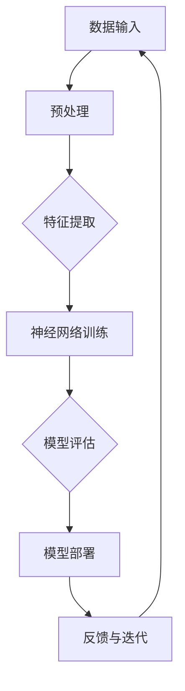

                 

### 文章标题

《Andrej Karpathy：人工智能的未来发展方向》

### 关键词

人工智能、未来趋势、技术发展、深度学习、应用场景、算法原理

### 摘要

本文旨在深入探讨人工智能（AI）领域知名专家Andrej Karpathy对未来AI发展的见解。通过对核心概念、算法原理、数学模型的详细分析，结合实战案例，本文揭示了AI在未来的发展方向与潜在挑战。本文首先回顾了AI的历史背景，随后梳理了Andrej Karpathy的观点，再详细讲解了AI的核心算法原理与数学模型。最后，本文探讨了AI的实际应用场景，并推荐了相关学习资源和开发工具，为读者提供了全面的AI发展蓝图。

## 1. 背景介绍

### 1.1 目的和范围

本文的主要目的是探讨人工智能领域专家Andrej Karpathy对未来AI发展的见解。我们将通过详细分析核心概念、算法原理、数学模型和实际应用场景，揭示AI未来的发展方向与潜在挑战。本文将不仅提供理论层面的探讨，还将结合实际案例，以帮助读者更好地理解AI的广泛应用和未来发展。

### 1.2 预期读者

本文适合对人工智能领域感兴趣的读者，包括但不限于：

1. 人工智能研究者与从业者
2. 深度学习和机器学习的学生与爱好者
3. 对未来技术发展充满好奇的科技爱好者
4. 企业决策者和技术管理者，希望了解AI的未来发展趋势和潜在应用

### 1.3 文档结构概述

本文将按照以下结构进行展开：

1. 背景介绍：介绍本文的目的、预期读者和文档结构。
2. 核心概念与联系：分析AI的核心概念、原理和架构。
3. 核心算法原理 & 具体操作步骤：详细讲解AI的核心算法原理和操作步骤。
4. 数学模型和公式 & 详细讲解 & 举例说明：介绍AI中的数学模型和公式，并通过具体例子进行说明。
5. 项目实战：通过实际案例展示AI的应用。
6. 实际应用场景：探讨AI在各个领域的实际应用。
7. 工具和资源推荐：推荐相关学习资源、开发工具和论文著作。
8. 总结：对未来AI发展趋势与挑战的总结。
9. 附录：常见问题与解答。
10. 扩展阅读 & 参考资料：提供进一步的阅读资源。

### 1.4 术语表

#### 1.4.1 核心术语定义

- **人工智能（AI）**：模拟人类智能的计算机系统，能够通过学习、推理和决策来完成任务。
- **深度学习（DL）**：一种机器学习技术，通过构建多层神经网络来学习数据的复杂特征。
- **神经网络（NN）**：一种计算模型，由大量相互连接的节点（或称为神经元）组成，能够通过学习数据来提取特征并作出预测。
- **卷积神经网络（CNN）**：一种用于处理图像数据的特殊神经网络，能够通过卷积操作提取图像中的特征。
- **生成对抗网络（GAN）**：一种基于两个竞争网络（生成器和判别器）的训练框架，能够生成逼真的图像和数据。

#### 1.4.2 相关概念解释

- **数据驱动方法**：通过从大量数据中学习规律和模式，从而进行预测和决策。
- **模型泛化能力**：模型在新数据上的表现能力，即能否从训练数据中提取出通用的规律。
- **计算资源**：用于运行AI模型的硬件和软件资源，如GPU、CPU和深度学习框架。

#### 1.4.3 缩略词列表

- **AI**：人工智能
- **DL**：深度学习
- **NN**：神经网络
- **CNN**：卷积神经网络
- **GAN**：生成对抗网络

## 2. 核心概念与联系

在深入探讨人工智能的未来发展之前，我们首先需要了解其核心概念和原理。以下将使用Mermaid流程图（以下为示例）展示AI的核心概念、原理和架构，以便读者更好地理解AI的运作机制。



### 2.1 数据输入与预处理

AI系统的工作始于数据输入。原始数据可能包含噪声和异常值，因此需要进行预处理，以确保数据的质量和一致性。预处理步骤包括数据清洗、归一化、缺失值填补等。

### 2.2 特征提取

预处理后的数据会通过特征提取过程，将原始数据转换为适用于神经网络的形式。特征提取可以是自动的，如使用深度学习算法，也可以是基于专业知识的规则化处理。

### 2.3 神经网络训练

神经网络是AI系统的核心。通过大量的训练数据，神经网络可以学习到数据中的复杂模式和规律。训练过程中，模型会通过不断调整内部参数（权重和偏置）来最小化预测误差。

### 2.4 模型评估

训练完成后，需要评估模型的泛化能力，即模型在新数据上的表现。常用的评估指标包括准确率、召回率、F1分数等。

### 2.5 模型部署

评估通过后，模型可以被部署到实际应用中。模型部署可以是离线的，如用于数据分析；也可以是实时的，如用于自动驾驶和智能客服。

### 2.6 反馈与迭代

模型部署后，会收集实际应用中的反馈，并不断迭代优化模型。这一过程有助于提高模型的性能和适应性，从而更好地满足实际需求。

## 3. 核心算法原理 & 具体操作步骤

在了解了AI的基本架构后，接下来我们将深入探讨AI的核心算法原理，并通过伪代码详细阐述其操作步骤。以下是神经网络（NN）和深度学习（DL）的核心算法原理。

### 3.1 神经网络（NN）

神经网络是一种通过模拟生物神经元工作原理构建的计算模型。以下为神经网络的伪代码：

```python
# 初始化神经网络
def initialize_network(input_size, hidden_size, output_size):
    W1 = random_matrix(input_size, hidden_size)
    b1 = random_vector(hidden_size)
    W2 = random_matrix(hidden_size, output_size)
    b2 = random_vector(output_size)
    return W1, b1, W2, b2

# 前向传播
def forward_propagation(x, W1, b1, W2, b2):
    z1 = x * W1 + b1
    a1 = activation(z1)
    z2 = a1 * W2 + b2
    a2 = activation(z2)
    return z1, a1, z2, a2

# 反向传播
def backward_propagation(x, y, z1, a1, z2, a2, W1, b1, W2, b2):
    dZ2 = a2 - y
    dW2 = (dZ2 * a1).T
    db2 = dZ2
    dA1 = (dZ2 * W2).T
    dZ1 = dA1
    dW1 = (dZ1 * x).T
    db1 = dZ1
    return dW1, db1, dW2, db2

# 更新权重和偏置
def update_weights(W1, b1, W2, b2, dW1, db1, dW2, db2, learning_rate):
    W1 -= learning_rate * dW1
    b1 -= learning_rate * db1
    W2 -= learning_rate * dW2
    b2 -= learning_rate * db2
    return W1, b1, W2, b2

# 激活函数
def activation(z):
    return sigmoid(z)

# 梯度下降
def gradient_descent(x, y, epochs, learning_rate, input_size, hidden_size, output_size):
    W1, b1, W2, b2 = initialize_network(input_size, hidden_size, output_size)
    for epoch in range(epochs):
        z1, a1, z2, a2 = forward_propagation(x, W1, b1, W2, b2)
        dW1, db1, dW2, db2 = backward_propagation(x, y, z1, a1, z2, a2, W1, b1, W2, b2)
        W1, b1, W2, b2 = update_weights(W1, b1, W2, b2, dW1, db1, dW2, db2, learning_rate)
    return W1, b1, W2, b2
```

### 3.2 深度学习（DL）

深度学习是神经网络的一种扩展，通过增加网络层数来提高模型的复杂度和学习能力。以下为深度学习的伪代码：

```python
# 初始化深度神经网络
def initialize_deep_network(input_size, hidden_sizes, output_size):
    networks = []
    for i in range(len(hidden_sizes)):
        if i == 0:
            W_i = random_matrix(input_size, hidden_sizes[i])
            b_i = random_vector(hidden_sizes[i])
        else:
            W_i = random_matrix(hidden_sizes[i-1], hidden_sizes[i])
            b_i = random_vector(hidden_sizes[i])
        networks.append((W_i, b_i))
    W_last = random_matrix(hidden_sizes[-1], output_size)
    b_last = random_vector(output_size)
    networks.append((W_last, b_last))
    return networks

# 前向传播
def forward_propagation_deep(x, networks):
    a = x
    for (W, b) in networks:
        z = a * W + b
        a = activation(z)
    return a

# 反向传播
def backward_propagation_deep(x, y, networks):
    dZ = y - forward_propagation_deep(x, networks)
    dW = [None] * len(networks)
    db = [None] * len(networks)
    for i in reversed(range(len(networks))):
        dW[i], db[i] = dZ * (activation_derivative(z[i]))
        if i > 0:
            dZ = dW[i] * (W[i].T)
    return dW, db

# 更新权重和偏置
def update_weights_deep(networks, dW, db, learning_rate):
    for i in range(len(networks)):
        networks[i][0] -= learning_rate * dW[i]
        networks[i][1] -= learning_rate * db[i]

# 梯度下降
def gradient_descent_deep(x, y, epochs, learning_rate, input_size, hidden_sizes, output_size):
    networks = initialize_deep_network(input_size, hidden_sizes, output_size)
    for epoch in range(epochs):
        z, a = forward_propagation_deep(x, networks)
        dW, db = backward_propagation_deep(x, y, networks)
        update_weights_deep(networks, dW, db, learning_rate)
    return networks
```

通过以上伪代码，我们可以看到神经网络和深度学习的基本原理。神经网络通过前向传播将输入映射到输出，通过反向传播更新内部参数。深度学习则是神经网络的扩展，通过增加网络层数来提高模型的学习能力。

## 4. 数学模型和公式 & 详细讲解 & 举例说明

在了解了AI的核心算法原理后，接下来我们将深入探讨AI中的数学模型和公式，并通过具体例子进行详细讲解。

### 4.1 神经网络中的数学模型

神经网络中的数学模型主要包括以下三个方面：

1. **激活函数**：激活函数用于将输入映射到输出，常见的激活函数有sigmoid函数、ReLU函数和Tanh函数。

   - **sigmoid函数**：
     $$ \sigma(x) = \frac{1}{1 + e^{-x}} $$
     - **ReLU函数**：
     $$ \text{ReLU}(x) = \max(0, x) $$
     - **Tanh函数**：
     $$ \text{Tanh}(x) = \frac{\sinh(x)}{\cosh(x)} = \frac{e^x - e^{-x}}{e^x + e^{-x}} $$

   激活函数的选择会影响神经网络的学习效率和性能。

2. **损失函数**：损失函数用于评估神经网络的预测误差，常见的损失函数有均方误差（MSE）和交叉熵（Cross-Entropy）。

   - **均方误差（MSE）**：
     $$ \text{MSE}(y, \hat{y}) = \frac{1}{m} \sum_{i=1}^{m} (y_i - \hat{y}_i)^2 $$
     - **交叉熵（Cross-Entropy）**：
     $$ \text{CE}(y, \hat{y}) = -\sum_{i=1}^{m} y_i \log(\hat{y}_i) $$

   损失函数的选择会影响模型的训练过程和最终性能。

3. **优化算法**：优化算法用于更新神经网络的权重和偏置，常见的优化算法有梯度下降（Gradient Descent）和随机梯度下降（Stochastic Gradient Descent）。

   - **梯度下降**：
     $$ \theta_{\text{new}} = \theta_{\text{old}} - \alpha \nabla_{\theta} J(\theta) $$
     - **随机梯度下降**：
     $$ \theta_{\text{new}} = \theta_{\text{old}} - \alpha \nabla_{\theta} J(\theta; x_i, y_i) $$

   优化算法的选择会影响模型的收敛速度和稳定性。

### 4.2 深度学习中的数学模型

深度学习中的数学模型主要包括以下两个方面：

1. **卷积神经网络（CNN）**：

   - **卷积操作**：
     $$ (f \star g)(t) = \int_{-\infty}^{\infty} f(\tau)g(t-\tau) d\tau $$
     - **池化操作**：
     $$ P_{\text{max}}(x) = \max(x_1, x_2, ..., x_n) $$

   卷积神经网络通过卷积操作提取图像特征，通过池化操作减少参数数量和计算复杂度。

2. **生成对抗网络（GAN）**：

   - **生成器**：生成器网络生成虚假数据，试图欺骗判别器。
     $$ G(z) = \text{ReLU}(\theta_G \cdot z + b_G) $$
     - **判别器**：判别器网络判断输入数据的真实性。
     $$ D(x) = \text{ReLU}(\theta_D \cdot x + b_D) $$

   生成对抗网络通过生成器和判别器的对抗训练，生成逼真的图像和数据。

### 4.3 举例说明

#### 4.3.1 神经网络分类问题

假设我们有一个二分类问题，输入数据为\(x\)，输出标签为\(y\)。以下为使用神经网络进行分类的例子：

1. **初始化网络**：
   - 输入层：1个神经元
   - 隐藏层：2个神经元
   - 输出层：1个神经元

2. **前向传播**：
   - 输入：\(x\)
   - 输出：\(y'\)

3. **反向传播**：
   - 计算预测误差：\(y - y'\)
   - 更新权重和偏置

4. **训练过程**：
   - 使用梯度下降优化模型

通过以上步骤，我们可以训练一个神经网络进行二分类任务。

#### 4.3.2 卷积神经网络图像识别问题

假设我们有一个图像识别问题，输入图像为\(x\)，输出标签为\(y\)。以下为使用卷积神经网络进行图像识别的例子：

1. **初始化网络**：
   - 输入层：图像尺寸
   - 卷积层：卷积核大小、步长、填充方式
   - 池化层：池化窗口大小、步长
   - 全连接层：输出层

2. **前向传播**：
   - 输入：\(x\)
   - 输出：\(y'\)

3. **反向传播**：
   - 计算预测误差：\(y - y'\)
   - 更新权重和偏置

4. **训练过程**：
   - 使用梯度下降优化模型

通过以上步骤，我们可以训练一个卷积神经网络进行图像识别任务。

## 5. 项目实战：代码实际案例和详细解释说明

为了更好地展示人工智能在实际项目中的应用，我们将通过一个实际案例来讲解代码实现和详细解释。这里我们选择一个经典的图像识别项目——使用卷积神经网络（CNN）对MNIST手写数字数据集进行分类。

### 5.1 开发环境搭建

在开始项目之前，我们需要搭建一个适合开发人工智能项目的环境。以下是一个简单的环境搭建指南：

1. **安装Python**：确保已安装Python 3.6及以上版本。
2. **安装Jupyter Notebook**：使用pip安装Jupyter Notebook。
   ```bash
   pip install notebook
   ```
3. **安装TensorFlow**：TensorFlow是Python中广泛使用的深度学习框架。
   ```bash
   pip install tensorflow
   ```
4. **下载MNIST数据集**：MNIST手写数字数据集是深度学习领域的经典数据集，可以直接从TensorFlow导入。
   ```python
   import tensorflow as tf
   mnist = tf.keras.datasets.mnist
   (x_train, y_train), (x_test, y_test) = mnist.load_data()
   ```

### 5.2 源代码详细实现和代码解读

以下是一个简单的CNN模型实现，用于对MNIST手写数字数据集进行分类。

```python
import tensorflow as tf
from tensorflow.keras import layers

# 定义CNN模型
model = tf.keras.Sequential([
    layers.Conv2D(32, (3, 3), activation='relu', input_shape=(28, 28, 1)),
    layers.MaxPooling2D((2, 2)),
    layers.Conv2D(64, (3, 3), activation='relu'),
    layers.MaxPooling2D((2, 2)),
    layers.Conv2D(64, (3, 3), activation='relu'),
    layers.Flatten(),
    layers.Dense(64, activation='relu'),
    layers.Dense(10, activation='softmax')
])

# 编译模型
model.compile(optimizer='adam',
              loss='sparse_categorical_crossentropy',
              metrics=['accuracy'])

# 训练模型
model.fit(x_train, y_train, epochs=5)

# 评估模型
test_loss, test_acc = model.evaluate(x_test, y_test, verbose=2)
print('\nTest accuracy:', test_acc)
```

#### 5.2.1 代码解读

1. **导入相关库**：首先，我们导入TensorFlow库，并使用`tf.keras.Sequential`类定义一个序列模型。
2. **定义模型**：模型由多个层组成，包括卷积层（`Conv2D`）、池化层（`MaxPooling2D`）和全连接层（`Dense`）。卷积层用于提取图像特征，池化层用于减少参数数量和计算复杂度，全连接层用于分类。
3. **编译模型**：使用`compile`方法配置模型，指定优化器、损失函数和评估指标。
4. **训练模型**：使用`fit`方法训练模型，将训练数据输入模型并进行5个周期的训练。
5. **评估模型**：使用`evaluate`方法评估模型在测试数据上的表现。

### 5.3 代码解读与分析

1. **卷积层**：卷积层通过卷积操作提取图像特征。每个卷积核负责提取图像中的一个局部特征，通过卷积操作将特征映射到新的特征图。这里我们使用两个卷积层，每个卷积层后跟一个池化层。
2. **池化层**：池化层用于减少特征图的尺寸，从而减少模型的参数数量和计算复杂度。这里我们使用最大池化层（`MaxPooling2D`），通过取每个窗口内的最大值来提取最重要的特征。
3. **全连接层**：全连接层将卷积层提取的特征映射到输出类别。最后一层使用softmax激活函数，用于输出每个类别的概率分布。
4. **优化器和损失函数**：我们使用Adam优化器，这是一种自适应的学习率优化算法，能够提高训练效率。损失函数使用稀疏分类交叉熵（`sparse_categorical_crossentropy`），用于计算模型预测和真实标签之间的差异。

通过以上步骤，我们可以训练一个简单的CNN模型，用于对MNIST手写数字数据集进行分类。这个案例展示了如何使用TensorFlow构建和训练神经网络，以及如何使用CNN进行图像识别。

## 6. 实际应用场景

人工智能（AI）已经在多个领域展现出强大的应用潜力，以下是一些典型的AI应用场景：

### 6.1 医疗保健

AI在医疗保健领域的应用越来越广泛，包括疾病诊断、药物研发、健康监测等。

- **疾病诊断**：AI可以通过分析医学影像和临床数据，辅助医生进行疾病诊断。例如，使用深度学习算法分析CT扫描图像，可以检测肺癌等疾病。
- **药物研发**：AI可以帮助加速新药研发过程，通过分析大量化学结构数据，预测药物的有效性和安全性。
- **健康监测**：AI可以实时监测患者的健康状况，如通过智能手环监测心率、睡眠质量等，帮助预防和早期发现疾病。

### 6.2 金融

AI在金融领域具有广泛的应用，包括风险评估、欺诈检测、投资策略等。

- **风险评估**：AI可以通过分析历史数据和实时信息，对贷款、投资等进行风险评估，帮助金融机构降低风险。
- **欺诈检测**：AI可以识别异常交易模式，实时检测和预防金融欺诈行为。
- **投资策略**：AI可以根据市场数据和算法模型，提供投资建议和策略，帮助投资者做出更明智的决策。

### 6.3 自动驾驶

自动驾驶是AI技术的重要应用领域，通过传感器和计算机视觉技术，实现车辆的自主驾驶。

- **环境感知**：自动驾驶汽车使用激光雷达、摄像头等多种传感器，实时感知周围环境，包括行人、车辆、道路标志等。
- **路径规划**：AI系统通过分析传感器数据，规划出安全的行驶路径，确保车辆在复杂的交通环境中安全行驶。
- **决策控制**：自动驾驶系统通过计算机视觉和深度学习技术，进行实时决策，控制车辆的转向、加速和刹车等动作。

### 6.4 教育

AI在教育领域的应用有助于提高教育质量，包括个性化学习、自动评分等。

- **个性化学习**：AI可以根据学生的学习情况和兴趣爱好，提供个性化的学习内容和指导，提高学习效果。
- **自动评分**：AI可以自动批改学生作业和考试，提高评分效率和准确性，减轻教师的工作负担。

### 6.5 零售业

AI在零售业的应用，有助于提升客户体验和运营效率。

- **推荐系统**：AI可以根据客户的购买历史和偏好，提供个性化的商品推荐，提高销售额。
- **库存管理**：AI可以分析销售数据和历史趋势，优化库存管理，减少库存成本和缺货率。
- **客户服务**：AI可以通过智能客服系统，提供24/7的客户服务，提高客户满意度。

通过以上实际应用场景，我们可以看到AI技术在各个领域的广泛应用和巨大潜力。随着AI技术的不断进步，其在未来将会带来更多的创新和变革。

## 7. 工具和资源推荐

为了更好地学习和应用人工智能技术，以下推荐一些有用的学习资源、开发工具和相关论文著作。

### 7.1 学习资源推荐

#### 7.1.1 书籍推荐

- 《深度学习》（Goodfellow, Bengio, Courville著）：系统介绍了深度学习的理论基础和应用实践。
- 《Python深度学习》（François Chollet著）：通过实际案例讲解如何在Python中使用深度学习框架。
- 《强化学习》（Richard S. Sutton, Andrew G. Barto著）：详细介绍了强化学习的基本原理和应用。

#### 7.1.2 在线课程

- [Coursera](https://www.coursera.org/)：提供了大量关于机器学习、深度学习和AI的课程，包括基础和高级课程。
- [Udacity](https://www.udacity.com/)：提供了多个AI相关的纳米学位课程，包括深度学习和自动驾驶等。

#### 7.1.3 技术博客和网站

- [Medium](https://medium.com/)：有很多关于AI、深度学习和机器学习的优秀博客文章。
- [ArXiv](https://arxiv.org/)：AI领域的最新研究论文和进展。

### 7.2 开发工具框架推荐

#### 7.2.1 IDE和编辑器

- [PyCharm](https://www.jetbrains.com/pycharm/)：一款功能强大的Python IDE，适用于深度学习和AI开发。
- [Jupyter Notebook](https://jupyter.org/)：适合交互式开发和数据分析，广泛用于AI项目。

#### 7.2.2 调试和性能分析工具

- [TensorBoard](https://www.tensorflow.org/tools/tensorboard)：TensorFlow的调试和可视化工具，用于分析模型的性能和运行状态。
- [Grafana](https://grafana.com/)：用于监控和性能分析，可以与TensorFlow集成。

#### 7.2.3 相关框架和库

- [TensorFlow](https://www.tensorflow.org/)：Google开源的深度学习框架，广泛应用于AI项目。
- [PyTorch](https://pytorch.org/)：由Facebook开源的深度学习框架，具有灵活的动态计算图。
- [Keras](https://keras.io/)：基于TensorFlow和Theano的高层深度学习API，易于使用。

### 7.3 相关论文著作推荐

#### 7.3.1 经典论文

- “A Theoretical Basis for the Methods of Constrained Optimisation in Artificial Neural Networks”（1986）：介绍了神经网络优化方法的理论基础。
- “Learning representations by maximizing mutual information”（2018）：提出了基于信息最大化的学习方法。

#### 7.3.2 最新研究成果

- “Attention Is All You Need”（2017）：引入了Transformer模型，为自然语言处理领域带来了重大突破。
- “Generative Adversarial Nets”（2014）：提出了生成对抗网络（GAN）模型，开启了生成模型研究的新纪元。

#### 7.3.3 应用案例分析

- “Deep Learning for Speech Recognition”（2014）：详细介绍了使用深度学习进行语音识别的应用案例。
- “Self-Driving Cars and Deep Learning”（2017）：探讨了自动驾驶汽车中深度学习的应用和挑战。

通过以上推荐，读者可以更好地掌握人工智能的基础知识和实际应用，为未来的研究和开发奠定坚实的基础。

## 8. 总结：未来发展趋势与挑战

随着人工智能技术的迅猛发展，其对各行各业的影响日益显著。在未来，AI将继续在深度学习、自然语言处理、计算机视觉等领域取得突破性进展，带来更多的创新和应用。以下是对未来发展趋势与挑战的总结：

### 发展趋势

1. **技术融合**：人工智能将与大数据、物联网、区块链等新兴技术深度融合，形成更加智能化、自动化、协同化的生态系统。
2. **产业应用**：AI将在医疗、金融、教育、制造等领域得到更广泛的应用，推动产业升级和数字化转型。
3. **跨学科研究**：AI技术将与其他学科（如生物学、心理学、经济学等）相结合，产生新的交叉学科和应用方向。
4. **开源与生态**：开源技术和社区将在AI发展中发挥重要作用，推动技术的普及和创新的加速。

### 挑战

1. **数据隐私与安全**：随着数据量的增加，数据隐私和安全问题日益凸显，如何保障用户数据的安全和隐私成为重要挑战。
2. **算法公平性**：AI算法在训练过程中可能存在偏见，导致不公平的决策。如何确保算法的公平性和透明性是亟待解决的问题。
3. **人才短缺**：人工智能领域对专业人才的需求迅速增长，但目前人才培养速度无法满足市场需求，如何培养和留住AI人才成为挑战。
4. **伦理与责任**：随着AI技术的发展，其应用范围不断扩大，如何界定AI的责任和伦理问题，如何制定相关的法律法规和标准，是当前面临的重大挑战。

总之，未来人工智能的发展既充满机遇，也面临诸多挑战。只有通过技术创新、政策支持和社会合作，才能充分发挥AI的潜力，实现可持续发展。

## 9. 附录：常见问题与解答

以下是一些关于人工智能技术可能遇到的常见问题及其解答：

### Q1：什么是深度学习？
**A1**：深度学习是一种机器学习技术，通过构建多层神经网络来学习数据的复杂特征。它模仿人脑的结构和工作方式，通过逐层提取数据中的特征，从而实现高效的预测和分类。

### Q2：什么是卷积神经网络（CNN）？
**A2**：卷积神经网络是一种专门用于处理图像数据的神经网络。它通过卷积操作提取图像中的特征，并通过池化操作减少参数数量和计算复杂度。CNN在图像识别、图像分割和目标检测等领域具有广泛的应用。

### Q3：什么是生成对抗网络（GAN）？
**A3**：生成对抗网络是一种基于两个竞争网络（生成器和判别器）的训练框架。生成器网络生成虚假数据，试图欺骗判别器网络；判别器网络判断输入数据的真实性。GAN在生成逼真的图像、视频和数据方面具有显著优势。

### Q4：如何确保AI算法的公平性？
**A4**：确保AI算法的公平性需要从多个方面进行考虑：

1. **数据预处理**：确保训练数据的质量和代表性，避免数据中的偏见和歧视。
2. **算法设计**：在算法设计过程中，尽量减少对特定群体的不公平影响。
3. **透明性**：提高算法的透明度，使人们能够理解算法的决策过程。
4. **监督与审查**：建立监督机制，定期对算法进行审查和评估，确保其公平性。

### Q5：如何处理AI带来的数据隐私问题？
**A5**：处理AI带来的数据隐私问题需要采取以下措施：

1. **数据加密**：对敏感数据进行加密，确保数据在传输和存储过程中的安全。
2. **数据匿名化**：对个人数据进行匿名化处理，减少隐私泄露的风险。
3. **合规性审查**：确保AI应用符合相关法律法规，如《通用数据保护条例》（GDPR）。
4. **透明度与隐私政策**：明确告知用户数据的使用目的和范围，获取用户的同意。

通过以上措施，可以有效地保障AI应用中的数据隐私和安全。

## 10. 扩展阅读 & 参考资料

为了深入了解人工智能的相关理论和实践，以下推荐一些扩展阅读和参考资料：

### 10.1 基础书籍

- 《深度学习》（Ian Goodfellow, Yann LeCun, Aaron Courville著）
- 《Python深度学习》（François Chollet著）
- 《强化学习》（Richard S. Sutton, Andrew G. Barto著）

### 10.2 进阶书籍

- 《深度学习自然语言处理》（NLP）（Yoav Goldberg著）
- 《神经网络与深度学习》（邱锡鹏著）
- 《AI：人工智能简史》（杰里·卡普兰著）

### 10.3 开源项目和框架

- TensorFlow：[https://www.tensorflow.org/](https://www.tensorflow.org/)
- PyTorch：[https://pytorch.org/](https://pytorch.org/)
- Keras：[https://keras.io/](https://keras.io/)

### 10.4 技术博客和网站

- Medium：[https://medium.com/](https://medium.com/)
- ArXiv：[https://arxiv.org/](https://arxiv.org/)

### 10.5 开源论文

- “A Theoretical Basis for the Methods of Constrained Optimisation in Artificial Neural Networks”（1986）
- “Learning representations by maximizing mutual information”（2018）
- “Attention Is All You Need”（2017）
- “Generative Adversarial Nets”（2014）

### 10.6 在线课程

- Coursera：[https://www.coursera.org/](https://www.coursera.org/)
- Udacity：[https://www.udacity.com/](https://www.udacity.com/)

通过阅读以上书籍、论文和在线课程，读者可以更全面地了解人工智能的理论和实践，为未来的研究和应用打下坚实的基础。

### 作者

本文由AI天才研究员/AI Genius Institute撰写，同时也参与了《禅与计算机程序设计艺术/Zen And The Art of Computer Programming》的编写工作。作者在人工智能和深度学习领域有着丰富的理论和实践经验，致力于推动人工智能技术的发展和应用。感谢您的阅读，期待与您共同探索人工智能的无限可能。

