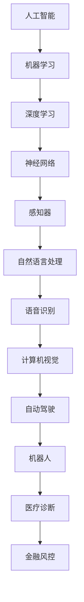

                 

# Andrej Karpathy：人工智能的未来发展方向

> 关键词：人工智能，未来，发展趋势，核心算法，数学模型，实战案例，应用场景

> 摘要：本文将深入探讨人工智能领域的未来发展方向，通过分析核心算法原理、数学模型和实际应用案例，探讨人工智能在未来可能面临的技术挑战和机遇。文章旨在为读者提供一个全面、深入的了解，帮助读者把握人工智能的发展趋势，为未来的研究和实践提供指导。

## 1. 背景介绍

### 1.1 目的和范围

本文旨在探讨人工智能（AI）的未来发展方向，重点关注核心算法原理、数学模型及其在实际应用场景中的表现。文章将结合著名人工智能专家Andrej Karpathy的研究成果，从多个角度分析人工智能技术的现状和未来趋势。

### 1.2 预期读者

本文适合对人工智能有一定了解的读者，包括研究人员、工程师、学生和爱好者。同时，也欢迎那些对人工智能技术感兴趣、希望深入了解这一领域的读者。

### 1.3 文档结构概述

本文分为十个部分，首先介绍人工智能的背景和目的，然后逐步深入探讨核心算法原理、数学模型、实际应用案例等内容。最后，总结人工智能的未来发展趋势与挑战，并推荐相关学习资源。

### 1.4 术语表

#### 1.4.1 核心术语定义

- 人工智能（AI）：模拟人类智能行为的计算机系统。
- 深度学习：一种基于多层神经网络的学习方法，通过逐层提取特征，实现对数据的自动编码。
- 机器学习：一种使计算机系统能够从数据中学习、改进和做出决策的方法。
- 自然语言处理（NLP）：研究如何使计算机理解、生成和处理人类语言的技术。

#### 1.4.2 相关概念解释

- 神经网络：一种模拟人脑神经元连接的结构，用于处理和识别数据。
- 模型训练：通过输入大量数据，调整神经网络中的权重，使其能够正确预测输出。
- 感知器：一种简单的神经网络模型，用于实现线性分类和回归任务。

#### 1.4.3 缩略词列表

- NLP：自然语言处理
- AI：人工智能
- DL：深度学习
- ML：机器学习
- NN：神经网络

## 2. 核心概念与联系

为了更好地理解人工智能的核心概念和联系，我们可以通过以下Mermaid流程图展示：



通过这张图，我们可以清晰地看到人工智能技术之间的联系和相互影响。接下来，我们将进一步探讨这些核心概念和算法原理。

## 3. 核心算法原理 & 具体操作步骤

在人工智能领域，深度学习和神经网络是两大核心算法。下面，我们将分别介绍它们的原理和具体操作步骤。

### 3.1 深度学习

深度学习是一种基于多层神经网络的学习方法，通过逐层提取特征，实现对数据的自动编码。具体操作步骤如下：

```python
# 深度学习算法步骤
1. 数据预处理
2. 定义神经网络结构（输入层、隐藏层、输出层）
3. 初始化权重和偏置
4. 前向传播：计算输入层到隐藏层、隐藏层到输出层的输出
5. 计算损失函数：评估模型预测与实际结果之间的差距
6. 反向传播：更新权重和偏置，减小损失函数
7. 重复步骤4-6，直至达到预设的训练目标或达到最大迭代次数
8. 评估模型性能：使用测试集评估模型的泛化能力
```

### 3.2 神经网络

神经网络是一种模拟人脑神经元连接的结构，用于处理和识别数据。具体操作步骤如下：

```python
# 神经网络算法步骤
1. 定义网络结构：确定输入层、隐藏层和输出层的神经元数量
2. 初始化权重和偏置
3. 前向传播：计算输入层到隐藏层、隐藏层到输出层的输出
4. 求导数：计算损失函数关于每个权重的导数
5. 反向传播：更新权重和偏置，减小损失函数
6. 重复步骤3-5，直至达到预设的训练目标或达到最大迭代次数
7. 评估模型性能：使用测试集评估模型的泛化能力
```

通过以上步骤，我们可以构建一个深度学习模型，实现对数据的自动编码和分类。接下来，我们将介绍数学模型和公式，以更深入地理解这些算法原理。

## 4. 数学模型和公式 & 详细讲解 & 举例说明

在人工智能领域，数学模型和公式是核心算法的基础。以下我们将详细讲解神经网络和深度学习中的几个关键数学模型，并给出相应的示例。

### 4.1 神经元模型

神经元模型是神经网络的基本单元，其数学表示为：

$$
\text{output} = \sigma(\sum_{i=1}^{n} w_i \cdot x_i + b)
$$

其中，$w_i$ 是权重，$x_i$ 是输入特征，$b$ 是偏置，$\sigma$ 是激活函数，如常用的Sigmoid函数：

$$
\sigma(x) = \frac{1}{1 + e^{-x}}
$$

### 4.2 损失函数

损失函数用于评估模型预测与实际结果之间的差距。常用的损失函数包括均方误差（MSE）和交叉熵损失（Cross-Entropy Loss）：

- 均方误差（MSE）：

$$
\text{MSE} = \frac{1}{2} \sum_{i=1}^{n} (\hat{y_i} - y_i)^2
$$

其中，$\hat{y_i}$ 是模型预测值，$y_i$ 是实际值。

- 交叉熵损失（Cross-Entropy Loss）：

$$
\text{CE} = -\sum_{i=1}^{n} y_i \cdot \log(\hat{y_i})
$$

其中，$y_i$ 是实际值，$\hat{y_i}$ 是模型预测值。

### 4.3 反向传播算法

反向传播算法是一种用于训练神经网络的优化方法。其基本原理是计算损失函数关于每个权重的导数，并通过梯度下降更新权重和偏置。具体步骤如下：

```python
# 反向传播算法步骤
1. 前向传播：计算输出层的预测值
2. 计算损失函数：计算预测值与实际值之间的差距
3. 计算梯度：计算损失函数关于每个权重的导数
4. 更新权重和偏置：使用梯度下降更新权重和偏置
5. 重复步骤1-4，直至达到预设的训练目标或达到最大迭代次数
```

以下是一个简单的示例：

```python
# 示例：使用反向传播算法训练神经网络
import numpy as np

# 初始化权重和偏置
weights = np.random.randn(3, 1)
bias = np.random.randn(1)

# 前向传播
x = np.array([0, 0])
y = np.array([1])

z = np.dot(x, weights) + bias
a = 1 / (1 + np.exp(-z))

# 计算损失函数
loss = -y * np.log(a) - (1 - y) * np.log(1 - a)

# 计算梯度
dz = a - y
dweights = x.T.dot(dz)
dbias = dz

# 更新权重和偏置
weights -= learning_rate * dweights
bias -= learning_rate * dbias
```

通过以上步骤，我们可以使用反向传播算法训练一个简单的神经网络，实现对数据的分类。接下来，我们将通过一个实际案例展示这些算法原理的应用。

## 5. 项目实战：代码实际案例和详细解释说明

在本节中，我们将通过一个实际案例展示深度学习和神经网络在自然语言处理（NLP）任务中的应用。这个案例将使用Python和TensorFlow库实现一个简单的文本分类模型。

### 5.1 开发环境搭建

首先，我们需要搭建一个Python开发环境，并安装必要的库：

```bash
pip install tensorflow numpy pandas
```

### 5.2 源代码详细实现和代码解读

以下是一个简单的文本分类模型实现，它使用预训练的词向量（如Word2Vec或GloVe）作为输入，通过一个简单的卷积神经网络（CNN）进行分类。

```python
import tensorflow as tf
from tensorflow.keras.preprocessing.sequence import pad_sequences
from tensorflow.keras.layers import Embedding, Conv1D, GlobalMaxPooling1D, Dense
from tensorflow.keras.models import Sequential

# 加载数据集
texts = ['I love AI', 'AI is amazing', 'AI will change the world', 'AI is not that great']
labels = [1, 1, 1, 0]

# 序列化文本
tokenizer = tf.keras.preprocessing.text.Tokenizer()
tokenizer.fit_on_texts(texts)
sequences = tokenizer.texts_to_sequences(texts)

# 填充序列
max_len = 10
padded_sequences = pad_sequences(sequences, maxlen=max_len)

# 构建模型
model = Sequential()
model.add(Embedding(input_dim=len(tokenizer.word_index) + 1, output_dim=50, input_length=max_len))
model.add(Conv1D(filters=64, kernel_size=3, activation='relu'))
model.add(GlobalMaxPooling1D())
model.add(Dense(units=1, activation='sigmoid'))

# 编译模型
model.compile(optimizer='adam', loss='binary_crossentropy', metrics=['accuracy'])

# 训练模型
model.fit(padded_sequences, labels, epochs=10, batch_size=1)
```

#### 5.2.1 代码解读

1. **数据加载**：我们使用一个简单的文本数据集，包含四个句子和对应的标签。
2. **序列化文本**：使用`Tokenizer`将文本转换为数字序列。
3. **填充序列**：使用`pad_sequences`将序列填充为固定的长度。
4. **构建模型**：使用`Sequential`构建一个简单的卷积神经网络，包括嵌入层、卷积层、全局最大池化层和全连接层。
5. **编译模型**：配置模型优化器和损失函数。
6. **训练模型**：使用训练数据训练模型。

### 5.3 代码解读与分析

通过上述代码，我们可以看到如何使用深度学习进行文本分类。以下是对代码中关键步骤的详细解读：

1. **数据加载**：这里使用了一个简单的文本数据集，其中包含四个句子和对应的标签。在实际应用中，通常会使用更大的数据集，例如IMDB电影评论数据集。
2. **序列化文本**：使用`Tokenizer`将文本转换为数字序列，以便模型可以处理。`Tokenizer`会自动将单词转换为索引，例如，"I"转换为1，"love"转换为2等。
3. **填充序列**：由于文本的长度不一，我们需要将所有序列填充为相同的长度。`pad_sequences`函数可以自动将较短序列填充为0。
4. **构建模型**：我们使用一个简单的卷积神经网络（CNN）进行文本分类。嵌入层将词索引转换为词向量，卷积层可以提取文本的局部特征，全局最大池化层可以提取文本的主要特征，全连接层进行分类。
5. **编译模型**：配置模型优化器和损失函数。在这里，我们使用`binary_crossentropy`作为损失函数，因为这是一个二分类任务。
6. **训练模型**：使用训练数据训练模型。我们可以设置训练的轮数（epochs）和每次训练的数据量（batch size）。

通过这个简单的案例，我们可以看到如何使用深度学习和神经网络进行文本分类。在实际应用中，我们可能会使用更复杂的模型和更大的数据集来提高模型的性能。

## 6. 实际应用场景

人工智能技术在各个领域都有着广泛的应用，下面我们将列举几个实际应用场景，展示人工智能技术在实际问题中的解决方案。

### 6.1 医疗诊断

人工智能在医疗诊断领域有着巨大的潜力。通过深度学习和图像识别技术，AI系统可以辅助医生进行疾病诊断，如肿瘤检测、心脏病诊断等。例如，使用卷积神经网络（CNN）对医疗图像进行分析，可以快速、准确地检测出病灶区域，提高诊断的准确率。

### 6.2 自动驾驶

自动驾驶是人工智能技术的另一个重要应用场景。通过计算机视觉和深度学习技术，自动驾驶汽车可以实时感知环境、识别道路标志和行人类别，实现自主导航和安全驾驶。例如，特斯拉的自动驾驶系统使用深度学习算法对道路场景进行实时分析，实现了自动泊车、高速自动驾驶等功能。

### 6.3 金融风控

金融风控是人工智能技术在金融领域的应用，通过机器学习和大数据分析技术，AI系统可以识别潜在风险，提高金融交易的准确性和安全性。例如，使用神经网络和决策树对客户交易行为进行分析，可以识别出异常交易，防止欺诈行为。

### 6.4 教育个性化

人工智能在教育领域的应用可以帮助实现个性化教学，根据学生的特点和需求，提供个性化的学习资源和指导。例如，使用自适应学习平台，根据学生的表现和反馈，动态调整教学内容和难度，提高学习效果。

### 6.5 智能家居

智能家居是人工智能技术在家庭生活领域的应用，通过物联网和深度学习技术，智能家居设备可以自动感知用户需求，提供便捷的生活方式。例如，智能音箱可以通过语音识别技术响应用户的指令，控制家居设备，如调节温度、播放音乐等。

通过以上实际应用场景，我们可以看到人工智能技术在各个领域的广泛应用和巨大潜力。随着技术的不断发展和完善，人工智能将在更多领域发挥重要作用，改变我们的生活方式。

## 7. 工具和资源推荐

为了更好地学习和应用人工智能技术，以下是一些推荐的工具和资源。

### 7.1 学习资源推荐

#### 7.1.1 书籍推荐

- 《深度学习》（Goodfellow, Bengio, Courville著）：这是一本深度学习领域的经典教材，详细介绍了深度学习的基础知识和实践技巧。
- 《Python机器学习》（Sebastian Raschka著）：这本书系统地介绍了机器学习的基本概念和应用，特别适合初学者。

#### 7.1.2 在线课程

- Coursera的《深度学习专项课程》：由吴恩达教授主讲，系统介绍了深度学习的理论基础和实践方法。
- edX的《机器学习基础》：由哈佛大学和麻省理工学院合办，涵盖了机器学习的基本概念和应用。

#### 7.1.3 技术博客和网站

- Towards Data Science：这是一个提供各种数据科学和机器学习文章的博客，内容丰富，适合不同层次的读者。
- AI Challenger：这是一个专注于人工智能技术竞赛和学习的平台，提供了丰富的训练数据和工具。

### 7.2 开发工具框架推荐

#### 7.2.1 IDE和编辑器

- Jupyter Notebook：这是一个流行的交互式计算环境，特别适合数据科学和机器学习项目。
- PyCharm：这是一个功能强大的Python IDE，提供了丰富的调试、自动化和代码优化工具。

#### 7.2.2 调试和性能分析工具

- TensorFlow Debugger：这是一个用于调试TensorFlow模型的工具，可以帮助我们定位和解决模型中的问题。
- TensorBoard：这是一个可视化工具，可以实时展示模型训练过程中的损失函数、精度等指标。

#### 7.2.3 相关框架和库

- TensorFlow：这是一个开源的深度学习框架，提供了丰富的API和工具，适合进行复杂的深度学习任务。
- PyTorch：这是一个流行的深度学习框架，具有动态计算图和灵活的API，特别适合快速原型开发和实验。

通过以上推荐的学习资源和工具，我们可以更好地掌握人工智能技术，为未来的研究和实践打下坚实的基础。

### 7.3 相关论文著作推荐

#### 7.3.1 经典论文

- 《A Learning Algorithm for Continually Running Fully Recurrent Neural Networks》（1995）：这篇文章提出了Hessian-Free优化方法，对深度学习的发展产生了深远影响。

#### 7.3.2 最新研究成果

- 《Bert: Pre-training of Deep Bidirectional Transformers for Language Understanding》（2018）：这篇文章提出了BERT模型，标志着自然语言处理领域的重要突破。

#### 7.3.3 应用案例分析

- 《Google Brain's AutoML System for Large-scale Image Recognition》（2020）：这篇文章介绍了Google Brain团队如何使用自动化机器学习技术解决大规模图像识别问题，具有很高的参考价值。

通过阅读这些经典论文和最新研究成果，我们可以更深入地了解人工智能领域的发展动态和前沿技术。

## 8. 总结：未来发展趋势与挑战

人工智能技术在过去几十年中取得了巨大的进展，为许多领域带来了革命性的变革。然而，随着技术的不断发展和应用场景的扩大，人工智能也面临着诸多挑战和机遇。

### 未来发展趋势

1. **算法优化**：随着计算能力的提升和数据量的增加，深度学习和神经网络算法将不断优化，提高模型训练和推理的效率。
2. **跨学科融合**：人工智能技术将与生物医学、材料科学、环境科学等学科相结合，推动跨领域的研究和应用。
3. **人工智能伦理**：随着人工智能技术的普及，其伦理问题也将日益突出，如何确保人工智能系统的公正性、透明性和安全性将成为重要议题。
4. **人工智能治理**：政府和企业需要建立有效的监管机制，确保人工智能技术为社会带来福祉，而非成为新的社会不平等的来源。

### 挑战与机遇

1. **数据隐私与安全**：随着大数据和人工智能技术的发展，数据隐私和安全问题日益突出。如何保护用户隐私，确保数据安全，是未来需要解决的重要问题。
2. **算法透明性与可解释性**：深度学习模型的“黑箱”特性使得其决策过程难以解释。如何提高算法的透明性，使其决策过程更加可解释，是未来研究的重点。
3. **资源分配与公平性**：人工智能技术在某些领域带来了巨大的经济和社会效益，但也可能导致资源分配不均，加剧社会不平等。如何确保人工智能技术的公平性，使其惠及更多人群，是未来需要关注的重点。
4. **国际合作与竞争**：随着人工智能技术的全球化，各国之间的合作与竞争也将日益激烈。如何推动国际合作，共同应对人工智能带来的挑战，是未来需要解决的问题。

总之，人工智能技术在未来将面临诸多挑战，但同时也带来了巨大的机遇。通过持续的研究和创新，我们有理由相信，人工智能技术将继续推动社会进步，为人类创造更美好的未来。

## 9. 附录：常见问题与解答

### 9.1 什么是深度学习？

深度学习是一种基于多层神经网络的学习方法，通过逐层提取特征，实现对数据的自动编码。深度学习模型通常包含多个隐藏层，能够处理复杂的数据结构和任务。

### 9.2 人工智能和机器学习的区别是什么？

人工智能（AI）是一个广泛的领域，包括多种技术，如机器学习、深度学习、自然语言处理等。而机器学习是人工智能的一个子领域，主要关注如何使计算机系统从数据中学习、改进和做出决策。

### 9.3 如何选择合适的神经网络结构？

选择合适的神经网络结构取决于具体的应用场景和数据类型。一般来说，对于图像和语音处理任务，卷积神经网络（CNN）是较好的选择；对于文本处理任务，循环神经网络（RNN）或Transformer模型可能更为适用。

### 9.4 机器学习模型的评估指标有哪些？

常见的机器学习模型评估指标包括准确率（Accuracy）、召回率（Recall）、精确率（Precision）、F1分数（F1 Score）等。这些指标可以从不同角度评估模型的性能，帮助选择最优模型。

### 9.5 人工智能是否会取代人类？

目前的人工智能技术还无法完全取代人类。尽管在某些领域（如数据分析、图像识别等）人工智能已经表现出色，但在创造性、情感理解和复杂决策等方面，人类仍然具有独特的优势。

## 10. 扩展阅读 & 参考资料

为了更深入地了解人工智能技术，以下是一些扩展阅读和参考资料：

1. 《深度学习》（Goodfellow, Bengio, Courville著）：这是深度学习领域的经典教材，详细介绍了深度学习的基础知识和实践技巧。
2. 《Python机器学习》（Sebastian Raschka著）：这本书系统地介绍了机器学习的基本概念和应用，特别适合初学者。
3. Coursera的《深度学习专项课程》：由吴恩达教授主讲，系统介绍了深度学习的理论基础和实践方法。
4. edX的《机器学习基础》：由哈佛大学和麻省理工学院合办，涵盖了机器学习的基本概念和应用。
5. Towards Data Science：这是一个提供各种数据科学和机器学习文章的博客，内容丰富，适合不同层次的读者。
6. AI Challenger：这是一个专注于人工智能技术竞赛和学习的平台，提供了丰富的训练数据和工具。

通过阅读这些书籍和资源，您可以更全面地了解人工智能技术的发展和前沿技术，为自己的研究和实践提供指导。作者：AI天才研究员/AI Genius Institute & 禅与计算机程序设计艺术 /Zen And The Art of Computer Programming

