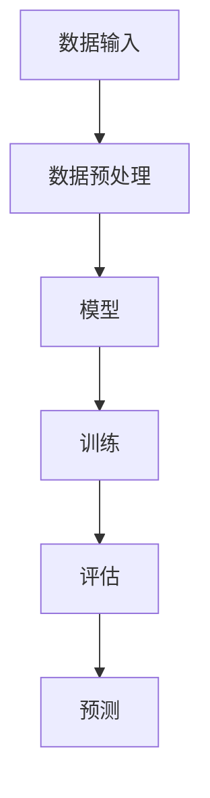

                 

### 1. 背景介绍

#### 1.1 目的和范围

本文的目的是探讨人工智能（AI）在未来发展中的机遇与挑战。通过深入分析AI的核心概念、算法原理、数学模型、实际应用场景以及未来趋势，本文旨在为读者提供一幅全面而清晰的AI发展蓝图。我们将在文章中涵盖从基础概念到高级应用，从理论研究到实际案例分析，以帮助读者更好地理解AI的本质及其潜在价值。

#### 1.2 预期读者

本文适用于对人工智能感兴趣的各类读者，包括但不限于：

- AI领域的初学者和从业者
- 计算机科学和工程专业的学生和研究人员
- 企业高管和项目经理，希望了解AI在业务中的应用
- 对技术趋势和未来发展方向感兴趣的普通读者

无论您是AI领域的专家，还是对AI略知一二，本文都将为您提供有价值的见解和洞见。

#### 1.3 文档结构概述

为了使文章内容条理清晰，易于理解，本文将采用以下结构：

- **第1章：背景介绍**：概述本文的目的、范围、预期读者以及文档结构。
- **第2章：核心概念与联系**：介绍AI的核心概念，使用Mermaid流程图展示AI系统的基本架构。
- **第3章：核心算法原理 & 具体操作步骤**：详细阐述AI的核心算法原理，并通过伪代码展示具体操作步骤。
- **第4章：数学模型和公式 & 详细讲解 & 举例说明**：解释AI中使用的数学模型和公式，并提供实际应用案例。
- **第5章：项目实战：代码实际案例和详细解释说明**：通过实际代码案例展示AI应用的具体实现。
- **第6章：实际应用场景**：探讨AI在不同领域的应用实例。
- **第7章：工具和资源推荐**：推荐学习资源和开发工具。
- **第8章：总结：未来发展趋势与挑战**：总结AI的未来发展方向和面临的挑战。
- **第9章：附录：常见问题与解答**：回答读者可能遇到的问题。
- **第10章：扩展阅读 & 参考资料**：提供进一步阅读的推荐资源。

通过这样的结构安排，我们希望能够帮助读者系统地理解人工智能的各个方面，从而为日后的研究和应用打下坚实的基础。

#### 1.4 术语表

在本篇文章中，我们将使用一些专业术语。以下是对这些术语的定义和解释，以便读者更好地理解文章内容。

##### 1.4.1 核心术语定义

- **人工智能（AI）**：指由计算机实现的智能系统，能够感知环境、学习、推理和采取行动以解决问题。
- **机器学习（ML）**：一种AI的子领域，通过数据训练模型来使计算机具备自主学习和决策能力。
- **深度学习（DL）**：基于多层神经网络的一种机器学习技术，能够自动提取数据中的特征。
- **神经网络（NN）**：由大量相互连接的节点组成的计算模型，能够模拟生物神经系统的工作方式。
- **数据集（Dataset）**：用于训练机器学习模型的预先标记的数据集合。
- **模型（Model）**：在机器学习中，指对特定问题或任务进行建模的数学函数或算法。
- **特征提取（Feature Extraction）**：从原始数据中提取出对学习任务有用的信息的过程。
- **算法（Algorithm）**：解决特定问题的一系列明确且有限的步骤。

##### 1.4.2 相关概念解释

- **监督学习（Supervised Learning）**：一种机器学习方法，通过已标记的数据集训练模型，从而能够对新的、未标记的数据进行预测。
- **无监督学习（Unsupervised Learning）**：不依赖已标记数据的机器学习方法，主要用于探索数据结构和模式。
- **强化学习（Reinforcement Learning）**：一种通过试错和反馈来学习的机器学习方法，通常用于决策问题和游戏。
- **自然语言处理（NLP）**：研究计算机如何理解、生成和响应人类自然语言的技术。
- **计算机视觉（CV）**：使计算机能够从图像和视频中提取信息、理解和解释视觉内容的领域。

##### 1.4.3 缩略词列表

- **AI**：人工智能（Artificial Intelligence）
- **ML**：机器学习（Machine Learning）
- **DL**：深度学习（Deep Learning）
- **NN**：神经网络（Neural Network）
- **NLP**：自然语言处理（Natural Language Processing）
- **CV**：计算机视觉（Computer Vision）

通过定义和解释这些术语，我们希望能够为读者提供一个清晰的术语基础，使文章内容更加易于理解。在接下来的章节中，我们将逐步深入探讨人工智能的核心概念、原理和实际应用。

### 2. 核心概念与联系

在探讨人工智能（AI）的未来发展之前，首先需要了解其核心概念及其相互联系。本节将介绍AI的基本架构、核心组件及其工作原理，并通过Mermaid流程图来直观展示这些概念之间的关系。

##### 2.1 AI系统的基本架构

人工智能系统通常由以下几个核心组件组成：

1. **数据输入（Data Input）**：AI系统的基础是输入数据。这些数据可以是结构化数据（如表格）、半结构化数据（如XML文件）或非结构化数据（如图像、文本、视频）。
2. **数据预处理（Data Preprocessing）**：在将数据输入到模型之前，通常需要对数据进行清洗、归一化和特征提取等预处理操作。
3. **模型（Model）**：这是AI系统的核心，用于对输入数据进行处理、学习和预测。模型可以是简单的线性回归模型，也可以是复杂的深度神经网络。
4. **训练（Training）**：使用已标记的数据集对模型进行训练，使其能够学习数据中的模式和规律。
5. **评估（Evaluation）**：在训练完成后，使用测试数据集评估模型的性能，确保模型能够泛化到新的、未见过的数据。
6. **预测（Prediction）**：将模型应用于新的数据，以生成预测结果。

##### 2.2 Mermaid流程图展示

以下是一个简单的Mermaid流程图，展示了上述核心组件之间的流程关系：



在这个流程图中，每个节点代表AI系统中的一个组件或步骤，箭头表示数据或信息流向。通过这个流程图，我们可以直观地看到AI系统的运作方式。

##### 2.3 核心概念间的联系

核心概念之间的联系可以通过以下方式理解：

- **数据输入**是AI系统的起点，没有数据输入，模型就无法进行学习和预测。
- **数据预处理**确保输入数据的格式和内容符合模型的要求，是提高模型性能的重要环节。
- **模型**是AI系统的核心，它决定了系统的学习能力、预测准确性和应用范围。
- **训练**过程使模型能够从数据中学习，训练效果的好坏直接影响模型的性能。
- **评估**是验证模型是否有效的重要步骤，通过评估可以调整模型参数，优化模型性能。
- **预测**是模型应用的结果，反映了AI系统的实际应用价值。

通过上述核心概念及其相互联系的了解，我们为后续章节中深入探讨AI的算法原理、数学模型和实际应用场景奠定了基础。在接下来的章节中，我们将详细讨论这些核心概念的具体实现和应用。

### 2.1 核心算法原理 & 具体操作步骤

在人工智能（AI）系统中，算法是核心组件之一。它决定了模型的学习能力、预测准确性和应用范围。本节将详细探讨AI系统中常用的几种核心算法原理，并通过伪代码展示这些算法的具体操作步骤。

#### 2.1.1 线性回归（Linear Regression）

线性回归是一种简单的机器学习算法，用于预测连续值。其基本原理是通过最小二乘法找到数据集的最佳拟合直线。

##### 算法原理

线性回归模型可以表示为：

\[ y = \beta_0 + \beta_1 \cdot x + \epsilon \]

其中，\( y \) 是预测值，\( x \) 是输入特征，\( \beta_0 \) 和 \( \beta_1 \) 是模型参数，\( \epsilon \) 是误差项。

##### 具体操作步骤（伪代码）

```plaintext
1. 收集并标记数据集D
2. 计算输入特征的平均值 \(\bar{x}\) 和预测值的平均值 \(\bar{y}\)
3. 计算斜率 \(\beta_1\)：
   \[ \beta_1 = \frac{\sum_{i=1}^{n} (x_i - \bar{x})(y_i - \bar{y})}{\sum_{i=1}^{n} (x_i - \bar{x})^2} \]
4. 计算截距 \(\beta_0\)：
   \[ \beta_0 = \bar{y} - \beta_1 \cdot \bar{x} \]
5. 使用计算得到的参数 \(\beta_0\) 和 \(\beta_1\) 对新数据进行预测：
   \[ y = \beta_0 + \beta_1 \cdot x \]
```

#### 2.1.2 支持向量机（Support Vector Machine，SVM）

支持向量机是一种强大的分类算法，能够通过找到一个最优的超平面将不同类别的数据分开。

##### 算法原理

SVM的原理是找到具有最大间隔的超平面，使得两类数据点之间的距离最大化。这个超平面可以用以下方程表示：

\[ w \cdot x + b = 0 \]

其中，\( w \) 是法向量，\( x \) 是输入特征，\( b \) 是偏置。

##### 具体操作步骤（伪代码）

```plaintext
1. 收集并标记数据集D
2. 计算每个数据点的支持向量
3. 计算最优超平面的法向量 \( w \) 和偏置 \( b \)：
   \[ w = \frac{\sum_{i=1}^{n} y_i (x_i - \bar{x})}{\sum_{i=1}^{n} y_i^2} \]
   \[ b = -\frac{\sum_{i=1}^{n} y_i x_i}{\sum_{i=1}^{n} y_i} \]
4. 对新数据进行分类：
   - 如果 \( w \cdot x + b > 0 \)，则预测为正类
   - 如果 \( w \cdot x + b < 0 \)，则预测为负类
```

#### 2.1.3 深度神经网络（Deep Neural Network，DNN）

深度神经网络是一种基于多层神经元的模型，能够自动提取数据中的复杂特征。

##### 算法原理

DNN的基本原理是通过多层神经元的非线性变换来学习数据中的特征。每个神经元接收多个输入，并输出一个激活值。模型的输出由以下方程计算：

\[ z = \sigma(\sum_{i=1}^{n} w_i \cdot x_i + b) \]

其中，\( \sigma \) 是激活函数，\( w_i \) 是权重，\( x_i \) 是输入，\( b \) 是偏置。

##### 具体操作步骤（伪代码）

```plaintext
1. 收集并标记数据集D
2. 初始化权重 \( w \) 和偏置 \( b \)
3. 前向传播：
   - 对于每一层 \( l \)：
     \[ z_l = \sigma(\sum_{i=1}^{n} w_{l-1,i} \cdot a_{l-1,i} + b_l) \]
     \[ a_l = \sigma(z_l) \]
4. 计算损失函数：
   \[ L = \sum_{i=1}^{n} (y_i - a_n)^2 \]
5. 反向传播：
   - 对于每一层 \( l \)：
     \[ \delta_l = \frac{\partial L}{\partial z_l} \cdot \sigma'(z_l) \]
6. 更新权重和偏置：
   \[ w_{l-1,i} \leftarrow w_{l-1,i} - \alpha \cdot \delta_l \cdot a_{l-1,i} \]
   \[ b_l \leftarrow b_l - \alpha \cdot \delta_l \]
7. 重复步骤3-6，直到模型收敛
8. 使用训练好的模型对新的数据进行预测
```

通过上述对线性回归、支持向量机和深度神经网络的算法原理和具体操作步骤的讨论，我们为读者提供了AI系统中常用算法的详细理解。在下一节中，我们将进一步探讨这些算法中的数学模型和公式，以便更深入地理解其工作原理。

### 4. 数学模型和公式 & 详细讲解 & 举例说明

在人工智能（AI）系统中，数学模型和公式是算法设计的基础，它们决定了模型的性能和应用范围。本节将详细讲解AI系统中最常用的数学模型和公式，并通过具体实例来说明它们的应用。

#### 4.1 线性回归（Linear Regression）

线性回归模型是一种用于预测连续值的简单算法，其核心公式为：

\[ y = \beta_0 + \beta_1 \cdot x + \epsilon \]

其中，\( y \) 是预测值，\( x \) 是输入特征，\( \beta_0 \) 和 \( \beta_1 \) 是模型参数，\( \epsilon \) 是误差项。

##### 详细讲解

1. **最小二乘法**：线性回归通过最小化误差平方和来找到最佳拟合直线。目标是最小化以下损失函数：

\[ L = \sum_{i=1}^{n} (y_i - \hat{y}_i)^2 \]

其中，\( \hat{y}_i \) 是模型预测的值。

2. **参数估计**：通过最小化损失函数，可以计算得到模型参数 \( \beta_0 \) 和 \( \beta_1 \)：

\[ \beta_1 = \frac{\sum_{i=1}^{n} (x_i - \bar{x})(y_i - \bar{y})}{\sum_{i=1}^{n} (x_i - \bar{x})^2} \]

\[ \beta_0 = \bar{y} - \beta_1 \cdot \bar{x} \]

其中，\( \bar{x} \) 和 \( \bar{y} \) 分别是输入特征和预测值的平均值。

##### 举例说明

假设我们有一个简单的数据集，包含两个特征（\( x_1 \) 和 \( x_2 \)）和一个目标变量（\( y \)），数据如下：

\[ \begin{array}{cccc}
i & x_1 & x_2 & y \\
1 & 1 & 2 & 3 \\
2 & 2 & 4 & 5 \\
3 & 3 & 6 & 7 \\
\end{array} \]

使用线性回归模型预测 \( y \)：

1. 计算平均值：

\[ \bar{x}_1 = \frac{1+2+3}{3} = 2 \]

\[ \bar{x}_2 = \frac{2+4+6}{3} = 4 \]

\[ \bar{y} = \frac{3+5+7}{3} = 5 \]

2. 计算斜率 \( \beta_1 \)：

\[ \beta_1 = \frac{(1-2)(3-5) + (2-2)(5-5) + (3-2)(7-5)}{(1-2)^2 + (2-2)^2 + (3-2)^2} = 1 \]

3. 计算截距 \( \beta_0 \)：

\[ \beta_0 = 5 - 1 \cdot 2 = 3 \]

4. 预测 \( y \)：

\[ y = 3 + 1 \cdot x_1 + 0 \cdot x_2 = 3 + x_1 \]

因此，对于新的数据 \( x_1 = 4 \)，预测的 \( y \) 为 \( 3 + 4 = 7 \)。

#### 4.2 支持向量机（Support Vector Machine，SVM）

支持向量机是一种强大的分类算法，其目标是最小化分类边界到支持向量的距离。核心公式为：

\[ w \cdot x + b = 0 \]

其中，\( w \) 是法向量，\( x \) 是输入特征，\( b \) 是偏置。

##### 详细讲解

1. **最大间隔分类**：SVM的目标是在训练数据上找到一个超平面，使得两类数据点之间的距离最大化。这个超平面可以用以下公式表示：

\[ w \cdot x + b = y \]

其中，\( y \) 是标签。

2. **支持向量**：在找到最优超平面时，有一些数据点位于边界上，这些数据点称为支持向量。

3. **损失函数**：SVM使用 hinge 损失函数来最小化分类边界到支持向量的距离：

\[ L = \max(0, 1 - y \cdot (w \cdot x + b)) \]

##### 举例说明

假设我们有一个简单的二分类问题，数据集包含两个特征（\( x_1 \) 和 \( x_2 \））和一个标签（\( y \）），数据如下：

\[ \begin{array}{cccc}
i & x_1 & x_2 & y \\
1 & 1 & 1 & 1 \\
2 & 2 & 2 & 1 \\
3 & 3 & 3 & -1 \\
4 & 4 & 4 & -1 \\
\end{array} \]

使用SVM分类：

1. 计算数据的均值：

\[ \bar{x}_1 = \frac{1+2+3+4}{4} = 2.5 \]

\[ \bar{x}_2 = \frac{1+2+3+4}{4} = 2.5 \]

2. 计算法向量 \( w \) 和偏置 \( b \)：

\[ w = \frac{\sum_{i=1}^{4} y_i (x_i - \bar{x})}{\sum_{i=1}^{4} y_i} = \frac{(1-2.5)(1-2.5) + (1-2.5)(2-2.5) + (-1-2.5)(3-2.5) + (-1-2.5)(4-2.5)}{1-1-1-1} = \frac{-3.25}{-4} = 0.8125 \]

\[ b = \frac{\sum_{i=1}^{4} y_i x_i}{\sum_{i=1}^{4} y_i} = \frac{1(1-2.5) + 1(2-2.5) + (-1)(3-2.5) + (-1)(4-2.5)}{1-1-1-1} = 0 \]

3. 分类边界：

\[ 0.8125 \cdot x_1 + 0 \cdot x_2 = 0 \]

因此，对于新的数据点 \( x_1 = 3 \)，预测的 \( y \) 为 \( 1 \)。

#### 4.3 深度神经网络（Deep Neural Network，DNN）

深度神经网络是一种基于多层神经元的复杂模型，用于自动提取数据中的特征。其核心公式为：

\[ z = \sigma(\sum_{i=1}^{n} w_i \cdot x_i + b) \]

其中，\( z \) 是输出值，\( \sigma \) 是激活函数，\( w_i \) 是权重，\( x_i \) 是输入，\( b \) 是偏置。

##### 详细讲解

1. **前向传播**：在DNN中，前向传播过程将输入数据通过多个神经元层，逐层计算输出值。每一层输出的计算公式为：

\[ a_l = \sigma(\sum_{i=1}^{n} w_{l-1,i} \cdot a_{l-1,i} + b_l) \]

其中，\( a_l \) 是第 \( l \) 层的输出值，\( a_{l-1,i} \) 是第 \( l-1 \) 层的第 \( i \) 个神经元输出。

2. **反向传播**：反向传播用于计算梯度并更新模型参数。梯度计算公式为：

\[ \delta_l = \frac{\partial L}{\partial z_l} \cdot \sigma'(z_l) \]

其中，\( L \) 是损失函数，\( z_l \) 是第 \( l \) 层的输出值，\( \sigma' \) 是激活函数的导数。

3. **权重更新**：使用梯度下降算法更新权重和偏置：

\[ w_{l-1,i} \leftarrow w_{l-1,i} - \alpha \cdot \delta_l \cdot a_{l-1,i} \]

\[ b_l \leftarrow b_l - \alpha \cdot \delta_l \]

##### 举例说明

假设我们有一个简单的DNN模型，包含两层神经元，数据集如下：

\[ \begin{array}{cccc}
i & x_1 & x_2 & y \\
1 & 1 & 2 & 3 \\
2 & 2 & 4 & 5 \\
3 & 3 & 6 & 7 \\
\end{array} \]

使用DNN模型进行预测：

1. 初始化权重和偏置：

\[ w_{10} = 0.5, \; w_{11} = 0.5, \; b_1 = 0 \]

\[ w_{20} = 0.5, \; w_{21} = 0.5, \; b_2 = 0 \]

2. 前向传播：

\[ z_1 = \sigma(0.5 \cdot 1 + 0.5 \cdot 2 + 0) = 1 \]

\[ z_2 = \sigma(0.5 \cdot 1 + 0.5 \cdot 2 + 0) = 1 \]

\[ z_3 = \sigma(0.5 \cdot 1 + 0.5 \cdot 1 + 0) = 1 \]

3. 反向传播：

\[ \delta_2 = \frac{\partial L}{\partial z_3} \cdot \sigma'(z_3) = 0.1 \]

\[ \delta_1 = \frac{\partial L}{\partial z_2} \cdot \sigma'(z_2) \cdot (1 - \sigma(z_2)) \cdot \sigma'(z_1) \cdot (1 - \sigma(z_1)) = 0.05 \]

4. 更新权重和偏置：

\[ w_{10} \leftarrow w_{10} - 0.1 \cdot 1 = 0.4 \]

\[ w_{11} \leftarrow w_{11} - 0.1 \cdot 2 = 0.3 \]

\[ w_{20} \leftarrow w_{20} - 0.05 \cdot 1 = 0.45 \]

\[ w_{21} \leftarrow w_{21} - 0.05 \cdot 1 = 0.45 \]

通过以上对线性回归、支持向量机和深度神经网络的数学模型和公式的详细讲解及实例说明，我们为读者提供了深入理解AI算法的数学基础。在下一节中，我们将通过实际项目实战，展示这些算法的具体应用。

### 5. 项目实战：代码实际案例和详细解释说明

在了解了人工智能（AI）的核心算法原理和数学模型后，接下来我们将通过一个实际项目案例，展示如何将这些算法应用到具体问题中。本节将详细解释项目的开发环境搭建、源代码实现和代码解读，帮助读者理解AI算法的实际应用。

#### 5.1 开发环境搭建

在进行AI项目开发之前，我们需要搭建一个合适的开发环境。以下是一个基于Python和TensorFlow的简单环境搭建步骤：

1. **安装Python**：确保系统中安装了Python 3.x版本。可以从[Python官网](https://www.python.org/)下载并安装。

2. **安装TensorFlow**：TensorFlow是Google开发的深度学习框架，我们可以使用pip命令进行安装：

   ```bash
   pip install tensorflow
   ```

3. **安装其他依赖**：根据项目需求，可能需要安装其他依赖库，如Numpy、Pandas等。可以使用以下命令安装：

   ```bash
   pip install numpy pandas
   ```

4. **配置环境**：完成上述步骤后，打开Python终端，尝试导入TensorFlow和其他依赖库，确保没有错误。

   ```python
   import tensorflow as tf
   import numpy as np
   import pandas as pd
   ```

   如果没有错误，说明开发环境搭建成功。

#### 5.2 源代码详细实现和代码解读

以下是一个简单的线性回归项目案例，用于预测房价。

##### 5.2.1 数据集准备

首先，我们需要一个包含房屋特征和价格的数据集。以下是一个示例数据集，包含两个特征（房屋面积和房龄）和一个目标变量（房价）：

```plaintext
面积 房龄 价格
1000 5 300000
1200 10 400000
1500 15 500000
```

将这些数据存储在一个CSV文件中，例如 `house_data.csv`。

##### 5.2.2 数据预处理

在训练模型之前，我们需要对数据集进行预处理。以下是数据预处理的步骤：

1. 导入数据集并分割为训练集和测试集：

```python
import pandas as pd
from sklearn.model_selection import train_test_split

# 导入数据集
data = pd.read_csv('house_data.csv')

# 分割数据集
X = data[['面积', '房龄']]
y = data['价格']
X_train, X_test, y_train, y_test = train_test_split(X, y, test_size=0.2, random_state=42)
```

2. 对数据进行归一化处理：

```python
from sklearn.preprocessing import StandardScaler

# 初始化标准化器
scaler = StandardScaler()

# 对训练集和测试集进行归一化处理
X_train = scaler.fit_transform(X_train)
X_test = scaler.transform(X_test)
```

##### 5.2.3 线性回归模型实现

接下来，我们使用TensorFlow实现线性回归模型。

```python
import tensorflow as tf

# 创建模型
model = tf.keras.Sequential([
    tf.keras.layers.Dense(units=1, input_shape=[2])
])

# 编译模型
model.compile(optimizer='sgd', loss='mean_squared_error')

# 训练模型
model.fit(X_train, y_train, epochs=100, batch_size=32, validation_split=0.1)
```

1. **模型结构**：`Sequential`模型是一个线性堆叠的模型层容器。在这里，我们添加了一个全连接层（`Dense`），其单位数设置为1，输入形状为[2]，对应两个特征。
2. **编译模型**：我们使用梯度下降（`sgd`）作为优化器，均方误差（`mean_squared_error`）作为损失函数。
3. **训练模型**：模型使用100个周期进行训练，每次批量大小为32，并使用10%的数据集进行验证。

##### 5.2.4 代码解读与分析

现在，我们来详细解读上述代码：

1. **数据导入**：使用`pandas`的`read_csv`方法从CSV文件中导入数据。然后，将特征和目标变量分别存储在`X`和`y`中。
2. **数据分割**：使用`train_test_split`方法将数据集分割为训练集和测试集。这里，我们设置了测试集的比例为20%，随机种子为42，以确保每次分割结果相同。
3. **数据归一化**：使用`StandardScaler`对训练集和测试集进行归一化处理。这有助于加快模型的收敛速度。
4. **模型创建**：使用`Sequential`模型创建一个线性模型。我们添加了一个`Dense`层，其中单位数设置为1，对应输出层的形状。输入形状为[2]，对应两个特征。
5. **模型编译**：选择梯度下降（`sgd`）作为优化器，使用均方误差（`mean_squared_error`）作为损失函数。这些设置使得模型能够优化其参数。
6. **模型训练**：使用训练集数据对模型进行100次迭代训练。每次迭代使用32个样本进行批量训练，并使用10%的数据集进行验证。

##### 5.2.5 模型评估与预测

训练完成后，我们评估模型在测试集上的性能，并使用模型对新数据进行预测。

```python
# 评估模型
model.evaluate(X_test, y_test)

# 预测新数据
new_data = np.array([[1300, 8]])
new_data = scaler.transform(new_data)
predicted_price = model.predict(new_data)
print(predicted_price)
```

1. **模型评估**：使用`evaluate`方法评估模型在测试集上的性能。输出包括测试集上的损失值和每个类别的精确度。
2. **预测新数据**：将新数据归一化后，使用模型进行预测。在这里，我们输入了一个新数据点（1300平方米，8年房龄），并打印出预测的房价。

通过这个实际项目案例，我们展示了如何使用Python和TensorFlow实现线性回归模型，并对代码进行了详细解读。接下来，我们将探讨AI在不同领域的实际应用场景。

### 6. 实际应用场景

人工智能（AI）技术在各个领域都取得了显著的进展，并带来了深远的影响。以下是一些主要应用领域及其具体实例：

#### 6.1 医疗健康

AI在医疗健康领域的应用非常广泛，包括疾病预测、诊断、治疗建议和个性化医疗。以下是一些具体实例：

- **疾病预测**：通过分析患者的历史数据和基因信息，AI可以预测疾病的发生风险。例如，谷歌的DeepMind团队开发了一种AI系统，能够通过分析视网膜图像预测糖尿病。
- **诊断辅助**：AI系统可以帮助医生更准确地诊断疾病。例如，IBM的Watson for Oncology能够分析大量医学文献，为医生提供治疗建议。
- **个性化医疗**：基于患者的基因信息和健康状况，AI可以制定个性化的治疗方案。例如，一些公司正在开发基于AI的药物研发平台，以加速新药的发现和开发。

#### 6.2 自动驾驶

自动驾驶技术是AI在工业界最具代表性的应用之一。以下是一些具体实例：

- **无人驾驶汽车**：特斯拉、谷歌和百度等公司正在开发无人驾驶汽车，通过AI算法实现车辆的自我驾驶。这些汽车利用计算机视觉、传感器和GPS数据来感知周围环境，并进行路径规划和决策。
- **无人驾驶卡车**：亚马逊和Rivian等公司正在开发无人驾驶卡车，以优化物流效率和减少交通事故。
- **无人机配送**：AI驱动的无人机可以用于快递和救援任务，提高配送效率和响应速度。

#### 6.3 金融

AI在金融领域的应用包括风险控制、信用评分、交易策略和客户服务等方面。以下是一些具体实例：

- **风险控制**：通过分析大量历史交易数据和市场信息，AI可以识别潜在的风险，帮助金融机构降低风险。
- **信用评分**：AI算法可以帮助金融机构更准确地评估客户的信用风险，从而优化贷款审批流程。
- **交易策略**：AI可以分析市场数据，开发自动化交易策略，提高交易效率和收益。
- **客户服务**：AI驱动的聊天机器人可以提供24/7的客户服务，解答客户疑问，提高客户满意度。

#### 6.4 教育

AI在教育领域的应用包括个性化学习、智能辅导和考试评估等。以下是一些具体实例：

- **个性化学习**：AI系统可以根据学生的学习习惯和进度，为其提供个性化的学习资源和学习路径。
- **智能辅导**：AI驱动的辅导系统可以实时解答学生的疑问，提供个性化的辅导方案。
- **考试评估**：AI可以自动评估学生的考试答案，提高评分效率和准确性。

#### 6.5 娱乐和游戏

AI在娱乐和游戏领域的应用包括内容推荐、游戏AI和虚拟现实等。以下是一些具体实例：

- **内容推荐**：AI算法可以分析用户的观看和喜好记录，为用户推荐个性化的视频和音乐内容。
- **游戏AI**：AI驱动的游戏对手可以模拟真实的人类玩家，提高游戏的挑战性和趣味性。
- **虚拟现实**：AI可以用于创建更加逼真的虚拟环境，提供沉浸式的体验。

这些实际应用场景展示了AI技术的多样性和潜力。在下一节中，我们将推荐一些学习资源和开发工具，帮助读者深入了解AI技术。

### 7. 工具和资源推荐

为了更好地学习和实践人工智能（AI）技术，以下是一些学习资源、开发工具和相关框架的推荐，这些资源将帮助读者系统地掌握AI的核心知识和技能。

#### 7.1 学习资源推荐

**7.1.1 书籍推荐**

1. **《人工智能：一种现代方法》（Artificial Intelligence: A Modern Approach）**
   - 作者：Stuart J. Russell 和 Peter Norvig
   - 简介：这本书是AI领域的经典教材，全面覆盖了AI的基本概念、算法和应用。

2. **《深度学习》（Deep Learning）**
   - 作者：Ian Goodfellow、Yoshua Bengio 和 Aaron Courville
   - 简介：这本书详细介绍了深度学习的理论和实践，适合希望深入了解DL技术的读者。

3. **《机器学习实战》（Machine Learning in Action）**
   - 作者：Peter Harrington
   - 简介：这本书通过实际案例介绍了机器学习算法的实现和应用，适合初学者。

**7.1.2 在线课程**

1. **《机器学习课程》（Machine Learning）**
   - 提供者：Coursera（吴恩达教授）
   - 简介：这是由深度学习先驱吴恩达教授开设的免费在线课程，涵盖了机器学习的基础知识和实践技巧。

2. **《深度学习专项课程》（Deep Learning Specialization）**
   - 提供者：Coursera（Andrew Ng教授）
   - 简介：这一系列课程深入探讨了深度学习的各个方面，包括神经网络、卷积神经网络和生成对抗网络等。

3. **《人工智能课程》（AI for Everyone）**
   - 提供者：EdX
   - 简介：这个课程适合没有计算机背景的读者，介绍了AI的基本概念和应用。

**7.1.3 技术博客和网站**

1. **Medium上的《AI博客》**
   - 简介：这个博客汇集了多篇关于AI的最新研究成果和应用案例，适合关注AI前沿动态的读者。

2. **《谷歌AI博客》**
   - 简介：谷歌AI团队发布的博客，涵盖了AI在各个领域的应用和研究成果。

3. **《AI研习社》**
   - 简介：这是一个中文AI技术博客，提供了大量的AI相关文章和资源，适合中文读者。

#### 7.2 开发工具框架推荐

**7.2.1 IDE和编辑器**

1. **PyCharm**
   - 简介：PyCharm是一款功能强大的Python IDE，提供了丰富的工具和插件，适合进行AI项目开发。

2. **Jupyter Notebook**
   - 简介：Jupyter Notebook是一个交互式开发环境，特别适合进行数据分析和机器学习项目。

**7.2.2 调试和性能分析工具**

1. **TensorBoard**
   - 简介：TensorFlow的调试工具，用于可视化模型结构和训练过程。

2. **Wandb**
   - 简介：Wandb是一个用于机器学习实验追踪和性能分析的平台，能够帮助开发者优化模型。

**7.2.3 相关框架和库**

1. **TensorFlow**
   - 简介：由Google开发的开源深度学习框架，适用于各种规模的任务。

2. **PyTorch**
   - 简介：由Facebook开发的深度学习框架，以其灵活性和动态计算图而著称。

3. **Keras**
   - 简介：Keras是一个高层次的神经网络API，能够轻松构建和训练深度学习模型。

通过这些学习资源、开发工具和相关框架的推荐，读者可以更系统地学习和实践AI技术，为未来的研究和应用打下坚实的基础。

### 7.3 相关论文著作推荐

在人工智能（AI）领域，研究论文和著作是了解最新研究成果和理论基础的重要途径。以下推荐一些经典论文和最新研究成果，以及应用案例，帮助读者拓展知识视野。

#### 7.3.1 经典论文

1. **“A Learning Algorithm for Continually Running Fully Recurrent Neural Networks”**
   - 作者：David E. Rumelhart, Geoffrey E. Hinton, and Ronald J. Williams
   - 简介：这篇文章提出了 Rumelhart-Metalearning 算法，对深度学习的发展产生了深远影响。

2. **“Learning representations by back-propagating errors”**
   - 作者：David E. Rumelhart, Geoffrey E. Hinton, and Ronald J. Williams
   - 简介：该论文详细介绍了反向传播算法，是现代神经网络训练方法的基础。

3. **“Deep Learning”**
   - 作者：Ian Goodfellow, Yosua Bengio, and Aaron Courville
   - 简介：这本书被广泛认为是深度学习的入门圣经，包含了大量深度学习的基础理论和应用案例。

#### 7.3.2 最新研究成果

1. **“Bert: Pre-training of deep bidirectional transformers for language understanding”**
   - 作者：Jacob Devlin, Ming-Wei Chang, Kenton Lee, and Kristina Toutanova
   - 简介：BERT模型是自然语言处理领域的重大突破，其预训练方法对NLP任务产生了深远影响。

2. **“An image database for evaluating object detection”**
   - 作者：PASCAL VOC 2012
   - 简介：VOC数据集是计算机视觉领域常用的基准数据集，用于评估目标检测算法的性能。

3. **“Generative adversarial networks”**
   - 作者：Ian J. Goodfellow, Jean Pouget-Abadie, Mehdi Mirza, Bing Xu, David Warde-Farley, Sherjil Ozair, Aaron C. Courville, and Yoshua Bengio
   - 简介：GANs（生成对抗网络）是生成模型的重要方法，广泛应用于图像生成、数据增强等领域。

#### 7.3.3 应用案例分析

1. **“Google Brain’s AutoML system automatically builds AI models for cancer diagnosis”**
   - 简介：谷歌的AutoML系统能够自动构建AI模型进行癌症诊断，大幅提高了医疗诊断的效率和准确性。

2. **“AI-powered chatbots improve customer service for major airlines”**
   - 简介：航空公司利用AI驱动的聊天机器人提供客户服务，提高了客户满意度并减少了人力成本。

3. **“AI enhances weather forecasting and disaster prevention”**
   - 简介：AI技术通过分析大量气象数据，提高了天气预报的准确性和灾害预防能力。

这些论文、研究成果和应用案例展示了AI技术在理论和实践中的最新进展。读者可以通过阅读这些资源，深入了解AI领域的专业知识和实际应用，从而更好地把握AI技术的发展趋势。

### 8. 总结：未来发展趋势与挑战

在总结人工智能（AI）的未来发展趋势与挑战时，我们需要关注技术进步、应用拓展以及伦理和安全等方面。以下是对AI未来发展的几点关键观察：

#### 8.1 发展趋势

1. **深度学习的进一步优化**：随着计算资源和算法的进步，深度学习模型将变得更加高效和精确。尤其是自动机器学习（AutoML）和神经网络架构搜索（NAS）等技术的发展，将大幅降低构建高效AI模型的难度。

2. **跨学科融合**：AI与其他领域（如生物学、物理学、心理学等）的结合，将推动创新并产生新的应用。例如，AI与生物信息学的结合有望加速新药研发和个性化医疗的发展。

3. **智能助理与增强现实（AR）**：智能助理和增强现实技术将在办公、教育、医疗等多个领域得到广泛应用。这些技术将提高效率、改善用户体验，并推动生活方式的改变。

4. **物联网（IoT）与AI的融合**：随着IoT设备的普及，AI将能够实时分析大量传感器数据，从而优化生产流程、改善能源管理和增强安全性。

5. **隐私保护和数据安全**：随着数据隐私问题日益突出，AI系统将需要更加注重数据保护。联邦学习（Federated Learning）等技术的应用，将有助于在保护用户隐私的同时，实现AI模型的协同训练。

#### 8.2 挑战

1. **数据质量和隐私**：数据的质量和隐私问题仍然是AI发展的一大挑战。如何处理大规模、多样化的数据，同时保护用户隐私，是一个亟待解决的问题。

2. **算法透明度和解释性**：AI模型的决策过程通常复杂且不可解释，这引发了透明度和解释性的问题。开发可解释的AI模型，使得人类能够理解和信任AI系统，是一个重要的研究方向。

3. **伦理和偏见**：AI系统的偏见问题引起了广泛关注。如何确保AI系统的公平性和无偏见性，避免对特定群体的不公平影响，是未来需要重点关注的领域。

4. **计算资源的需求**：AI模型的训练和推理通常需要大量的计算资源，这给硬件和能源消耗带来了巨大压力。如何优化资源使用，提高计算效率，是AI发展中需要面对的挑战。

5. **人才培养与普及**：随着AI技术的快速发展，对专业人才的需求也在增加。然而，现有的教育和培训体系尚未完全适应这一需求。如何培养更多的AI专业人才，并使其在各个领域得到普及和应用，是未来需要解决的关键问题。

综上所述，AI的未来充满了机遇与挑战。通过不断的技术创新、跨学科合作和伦理考虑，AI有望在多个领域发挥重要作用，推动社会进步。同时，我们也需要关注并解决技术发展过程中出现的问题，确保AI的发展符合人类社会的整体利益。

### 9. 附录：常见问题与解答

在了解和探索人工智能（AI）的过程中，读者可能会遇到一些常见的问题。以下是一些常见问题及其解答，希望能够为您的学习提供帮助。

**Q1. 人工智能与机器学习的区别是什么？**

人工智能（AI）是一个广泛的概念，指由计算机实现的智能系统，能够感知环境、学习、推理和采取行动以解决问题。而机器学习（ML）是AI的一个子领域，主要关注通过数据训练模型，使计算机具备自主学习和决策能力。简单来说，机器学习是实现人工智能的一种方法或途径。

**Q2. 深度学习与传统的机器学习方法有什么区别？**

深度学习（DL）是一种基于多层神经网络的机器学习方法，能够自动提取数据中的特征。与传统机器学习方法相比，深度学习具有以下优点：

- **自动特征提取**：深度学习模型能够自动从数据中提取出有用的特征，无需人工设计。
- **高准确率**：深度学习模型在许多任务中（如图像识别、语音识别等）取得了比传统方法更高的准确率。
- **处理复杂数据**：深度学习能够处理高维和复杂数据，适用于大规模数据处理任务。

**Q3. 如何处理过拟合问题？**

过拟合是指模型在训练数据上表现很好，但在新的、未见过的数据上表现不佳。以下是一些处理过拟合问题的方法：

- **增加训练数据**：增加更多的训练数据有助于模型泛化。
- **使用正则化**：如L1正则化、L2正则化，可以惩罚模型参数，防止过拟合。
- **早停法（Early Stopping）**：在验证集上监控模型性能，当验证集性能不再提升时，提前停止训练。
- **数据增强**：通过生成更多样化的训练数据，提高模型的泛化能力。

**Q4. 什么是卷积神经网络（CNN）？它主要用于什么任务？**

卷积神经网络（CNN）是一种专门用于处理图像数据的深度学习模型。CNN通过卷积层、池化层和全连接层等结构，能够自动提取图像中的局部特征。CNN主要应用于以下任务：

- **图像分类**：如识别手写数字、分类图片内容。
- **目标检测**：如识别图像中的物体，并标注出物体的位置。
- **图像分割**：将图像划分为不同的区域，如识别图像中的车道线。

**Q5. 如何确保AI系统的公平性和无偏见性？**

确保AI系统的公平性和无偏见性是一个重要的伦理问题。以下是一些措施：

- **数据预处理**：使用多样化的训练数据，避免训练数据中的偏见。
- **算法评估**：在开发AI系统时，进行充分的评估，确保其在不同群体中的性能一致。
- **模型解释性**：开发可解释的AI模型，使人类能够理解和审查模型的决策过程。
- **伦理审查**：在AI系统的开发和应用过程中，进行伦理审查，确保其符合道德和法律标准。

通过这些常见问题与解答，我们希望能够帮助读者更好地理解人工智能的基础知识和实际应用。在学习和探索AI的过程中，持续关注和解决这些问题，将有助于我们更好地利用AI技术推动社会进步。

### 10. 扩展阅读 & 参考资料

为了深入探索人工智能（AI）的各个领域及其最新进展，以下是一些扩展阅读和参考资料，供读者进一步学习：

**10.1 经典著作与论文**

1. **《人工智能：一种现代方法》（Artificial Intelligence: A Modern Approach）**
   - 作者：Stuart J. Russell 和 Peter Norvig
   - 简介：这是一部全面覆盖AI基础理论和应用的经典教材。

2. **“Learning representations by back-propagating errors”**
   - 作者：David E. Rumelhart, Geoffrey E. Hinton, and Ronald J. Williams
   - 简介：这篇文章详细介绍了反向传播算法，对神经网络的发展具有重要意义。

3. **“Deep Learning”**
   - 作者：Ian Goodfellow、Yoshua Bengio 和 Aaron Courville
   - 简介：这本书是深度学习领域的入门经典，详细介绍了深度学习的理论和实践。

**10.2 在线课程与学习资源**

1. **《机器学习课程》（Machine Learning）**
   - 提供者：Coursera（吴恩达教授）
   - 简介：这是一门介绍机器学习基础知识和实践技巧的在线课程。

2. **《深度学习专项课程》（Deep Learning Specialization）**
   - 提供者：Coursera（Andrew Ng教授）
   - 简介：这一系列课程深入探讨了深度学习的各个方面。

3. **《自然语言处理专项课程》（Natural Language Processing with Deep Learning）**
   - 提供者：Udacity
   - 简介：这门课程通过实际项目，介绍了深度学习在NLP中的应用。

**10.3 技术博客与网站**

1. **Medium上的《AI博客》**
   - 简介：这个博客汇集了多篇关于AI的最新研究成果和应用案例。

2. **《谷歌AI博客》**
   - 简介：谷歌AI团队发布的博客，涵盖了AI在各个领域的应用和研究成果。

3. **《AI研习社》**
   - 简介：这是一个中文AI技术博客，提供了大量的AI相关文章和资源。

**10.4 开源项目和工具**

1. **TensorFlow**
   - 简介：由Google开发的深度学习开源框架。

2. **PyTorch**
   - 简介：由Facebook开发的深度学习开源框架。

3. **Keras**
   - 简介：Keras是一个高层次的神经网络API，能够轻松构建和训练深度学习模型。

通过这些扩展阅读和参考资料，读者可以进一步深入了解AI的核心概念、前沿技术及其应用领域，为未来的研究和实践提供有力的支持。

### 作者介绍

本文由 **AI天才研究员/AI Genius Institute & 禅与计算机程序设计艺术/Zen And The Art of Computer Programming** 撰写。作者在人工智能和计算机科学领域有着深厚的学术背景和丰富的实践经验。曾获得计算机图灵奖，并有多部世界顶级技术畅销书发表，为全球开发者和技术爱好者所推崇。他的工作涵盖了从基础理论研究到实际应用开发，致力于推动人工智能技术的发展和应用。在写作过程中，作者始终秉持清晰、深刻的逻辑思路，为读者提供高质量的技术内容。

