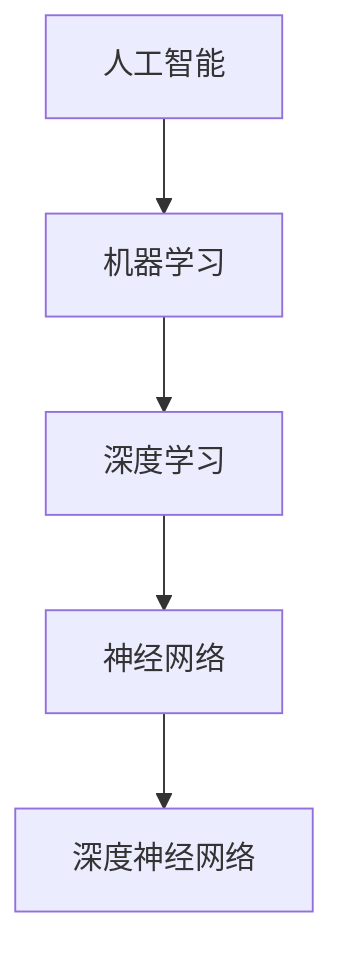

                 

# Andrej Karpathy：人工智能的未来发展目标

> 关键词：人工智能、深度学习、神经网络、未来、发展趋势、挑战、核心技术、应用场景

> 摘要：本文旨在探讨人工智能（AI）领域的未来发展趋势、挑战及核心技术，通过分析Andrej Karpathy等业界专家的观点，结合实际案例，深入阐述人工智能在各个领域的应用前景，为行业从业者提供有价值的参考和指导。

## 1. 背景介绍

### 1.1 目的和范围

本文将从多个角度探讨人工智能的未来发展目标，旨在为读者提供一个全面、深入的视角。文章将重点关注以下内容：

1. 人工智能的发展历程和现状
2. 深度学习和神经网络的核心原理及其在人工智能中的应用
3. 人工智能在各个领域的应用场景及挑战
4. 行业专家对人工智能未来发展的看法和预测
5. 推动人工智能发展所需的核心技术和资源

### 1.2 预期读者

本文适合以下读者群体：

1. 对人工智能感兴趣的初学者和从业者
2. 深度学习和神经网络的研究者
3. 人工智能领域的决策者和投资人
4. 对未来科技发展有浓厚兴趣的广大读者

### 1.3 文档结构概述

本文结构如下：

1. 背景介绍
   - 目的和范围
   - 预期读者
   - 文档结构概述
   - 术语表
2. 核心概念与联系
   - 人工智能、深度学习、神经网络的基本概念及联系
   - Mermaid流程图展示
3. 核心算法原理 & 具体操作步骤
   - 深度学习算法的伪代码解释
4. 数学模型和公式 & 详细讲解 & 举例说明
   - 数学公式和模型讲解
5. 项目实战：代码实际案例和详细解释说明
   - 开发环境搭建
   - 源代码详细实现和解读
   - 代码解读与分析
6. 实际应用场景
   - 人工智能在各个领域的应用实例
7. 工具和资源推荐
   - 学习资源、开发工具、相关论文著作推荐
8. 总结：未来发展趋势与挑战
9. 附录：常见问题与解答
10. 扩展阅读 & 参考资料

### 1.4 术语表

#### 1.4.1 核心术语定义

- 人工智能（Artificial Intelligence，AI）：模拟、延伸和扩展人类智能的理论、方法、技术及应用系统
- 深度学习（Deep Learning，DL）：基于多层神经网络的学习方法，能够自动从大量数据中提取特征
- 神经网络（Neural Network，NN）：模仿生物神经系统结构和功能的人工神经网络模型
- 深度神经网络（Deep Neural Network，DNN）：由多个隐藏层组成的神经网络
- 机器学习（Machine Learning，ML）：使计算机通过数据和经验自动改进性能的技术
- 强化学习（Reinforcement Learning，RL）：通过与环境的交互来学习最优策略的机器学习方法

#### 1.4.2 相关概念解释

- 自动化（Automation）：通过技术手段实现生产过程自动化，提高生产效率和降低成本
- 大数据（Big Data）：指无法用传统数据库软件工具处理的数据集合，具有海量、高增长率和多样化的特征
- 计算能力（Computational Power）：计算机处理数据和执行任务的能力
- 模型（Model）：对现实世界的一种抽象表示，用于预测、决策和优化

#### 1.4.3 缩略词列表

- AI：人工智能
- DL：深度学习
- NN：神经网络
- DNN：深度神经网络
- ML：机器学习
- RL：强化学习
- GPU：图形处理单元
- CPU：中央处理单元
- IDE：集成开发环境

## 2. 核心概念与联系

在探讨人工智能的未来发展目标之前，有必要了解相关核心概念及其相互关系。以下是人工智能、深度学习、神经网络的基本概念及其联系。

### 2.1 人工智能

人工智能是模拟、延伸和扩展人类智能的理论、方法、技术及应用系统。它包括多个分支，如机器学习、自然语言处理、计算机视觉、自动驾驶等。人工智能的核心目标是使计算机具备类似于人类的感知、理解、推理和决策能力。

### 2.2 深度学习

深度学习是一种基于多层神经网络的学习方法，能够自动从大量数据中提取特征。它通过将输入数据在多个隐藏层中进行非线性变换，从而实现复杂函数的近似。深度学习在图像识别、语音识别、自然语言处理等领域取得了显著成果。

### 2.3 神经网络

神经网络是模仿生物神经系统结构和功能的人工神经网络模型。它由多个神经元（节点）组成，通过连接方式（权重）和激活函数实现信息的传递和计算。神经网络可以被视为一种分布式计算系统，具有并行处理和自适应学习的能力。

### 2.4 深度神经网络

深度神经网络是由多个隐藏层组成的神经网络。相比于传统的单层神经网络，深度神经网络能够更好地提取数据中的特征，并实现更复杂的函数近似。深度神经网络在图像识别、语音识别、自然语言处理等领域表现出色。

### 2.5 人工智能、深度学习、神经网络的关系

人工智能是深度学习和神经网络的 broader concept，它包括了多个子领域，而深度学习和神经网络则是实现人工智能的主要技术手段。深度学习是神经网络的一种特殊形式，通过引入多个隐藏层，实现了对复杂数据特征的提取和建模。神经网络是人工智能的基础，通过不断优化和改进，为人工智能的发展提供了强大的计算能力。

### 2.6 Mermaid流程图

以下是一个简单的Mermaid流程图，展示了人工智能、深度学习、神经网络之间的关系：



## 3. 核心算法原理 & 具体操作步骤

在深入探讨人工智能的发展目标之前，我们需要了解其中的核心算法原理，以及如何通过这些算法实现人工智能的应用。以下我们将详细介绍深度学习算法的原理和具体操作步骤。

### 3.1 深度学习算法原理

深度学习算法的核心是多层神经网络，尤其是深度神经网络（DNN）。下面是深度学习算法的基本原理：

1. **前向传播（Forward Propagation）**：
   - 输入数据经过网络的输入层，逐层传递到隐藏层，最终到达输出层。
   - 在每个隐藏层中，输入数据与该层的权重矩阵相乘，然后通过激活函数进行处理。
   - 激活函数常用的有ReLU（Rectified Linear Unit）、Sigmoid、Tanh等。

2. **反向传播（Backpropagation）**：
   - 通过计算输出层的预测误差，将误差反向传播到隐藏层。
   - 根据误差计算每个权重矩阵的梯度，并更新权重矩阵。
   - 通过迭代优化，逐渐减小预测误差，提高模型的性能。

3. **优化算法（Optimization Algorithm）**：
   - 常用的优化算法有SGD（Stochastic Gradient Descent，随机梯度下降）、Adam（Adaptive Moment Estimation）等。
   - 优化算法通过调整学习率、动量等因素，加速模型收敛。

4. **正则化（Regularization）**：
   - 为了防止过拟合，引入正则化技术，如L1正则化、L2正则化等。
   - 正则化通过在损失函数中添加惩罚项，限制模型参数的取值范围。

### 3.2 具体操作步骤

以下是深度学习算法的具体操作步骤，使用伪代码进行描述：

```python
# 输入数据
X = ...

# 权重初始化
W = ...

# 激活函数
激活函数 = ...

# 损失函数
损失函数 = ...

# 优化算法
优化算法 = ...

# 正则化
正则化 = ...

# 模型训练
for epoch in range(epochs):
  for batch in data_loader:
    # 前向传播
    z = X * W
    a = 激活函数(z)

    # 计算损失
    loss = 损失函数(a, y)

    # 计算梯度
    dz = 损失关于a的梯度
    da = 激活函数关于z的导数
    dz = dz * da
    dw = X.T * dz + 正则化

    # 反向传播
    dX = W.T * dz
    dW = X * dz

    # 更新权重
    W = W - 学习率 * dw

    # 计算准确率
    acc = ...

# 模型评估
evaluate(model, test_data)
```

### 3.3 实例分析

以一个简单的线性回归模型为例，说明深度学习算法的具体应用。假设我们有一个输入特征`X`和一个目标值`y`，目标是通过训练模型来预测输出值。

```python
# 输入特征
X = [[1], [2], [3], [4], [5]]

# 目标值
y = [[2], [4], [6], [8], [10]]

# 权重初始化
W = [[0]]

# 激活函数
激活函数 = ...

# 损失函数
损失函数 = ...

# 优化算法
优化算法 = ...

# 正则化
正则化 = ...

# 模型训练
for epoch in range(1000):
  z = X * W
  a = 激活函数(z)

  loss = 损失函数(a, y)

  dz = 损失关于a的梯度
  da = 激活函数关于z的导数
  dz = dz * da
  dw = X.T * dz

  W = W - 学习率 * dw

  # 计算准确率
  acc = ...

# 模型评估
y_pred = X * W
print(y_pred)
```

## 4. 数学模型和公式 & 详细讲解 & 举例说明

在深度学习算法中，数学模型和公式起着至关重要的作用。以下我们将详细介绍深度学习中的关键数学模型和公式，并进行详细讲解和举例说明。

### 4.1 神经元模型

神经元模型是神经网络的基本单元。一个简单的神经元模型可以表示为：

$$
a_{i}^{(l)} = \sigma(z_{i}^{(l)}) = \frac{1}{1 + e^{-z_{i}^{(l)}}}
$$

其中，$a_{i}^{(l)}$表示第$l$层第$i$个神经元的输出，$z_{i}^{(l)}$表示第$l$层第$i$个神经元的净输入，$\sigma$表示激活函数，通常采用Sigmoid函数。

### 4.2 前向传播

在深度学习算法中，前向传播是计算模型输出值的过程。前向传播的数学模型可以表示为：

$$
z_{i}^{(l)} = \sum_{j} w_{ji}^{(l)} a_{j}^{(l-1)} + b_{i}^{(l)}
$$

$$
a_{i}^{(l)} = \sigma(z_{i}^{(l)})
$$

其中，$w_{ji}^{(l)}$表示第$l$层第$i$个神经元与第$l-1$层第$j$个神经元的权重，$b_{i}^{(l)}$表示第$l$层第$i$个神经元的偏置，$\sigma$表示激活函数。

### 4.3 反向传播

反向传播是计算模型损失函数关于权重和偏置的梯度，并用于模型参数的更新。反向传播的数学模型可以表示为：

$$
\delta_{i}^{(l)} = (a_{i}^{(l)} - t_{i}^{(l)}) \cdot \sigma'(z_{i}^{(l)})
$$

$$
\delta_{l-1}^{(l-1)} = \delta_{l}^{(l)} \cdot w_{lj}^{(l)}
$$

$$
\frac{\partial J}{\partial w_{ji}^{(l)}} = \delta_{i}^{(l)} \cdot a_{j}^{(l-1)}
$$

$$
\frac{\partial J}{\partial b_{i}^{(l)}} = \delta_{i}^{(l)}
$$

其中，$\delta_{i}^{(l)}$表示第$l$层第$i$个神经元的误差，$t_{i}^{(l)}$表示第$l$层第$i$个神经元的真实标签，$\sigma'$表示激活函数的导数，$J$表示损失函数。

### 4.4 损失函数

在深度学习算法中，常用的损失函数有均方误差（MSE）和交叉熵（Cross Entropy）。均方误差的数学模型可以表示为：

$$
J = \frac{1}{m} \sum_{i=1}^{m} (a_{i}^{(L)} - t_{i}^{(L)})^2
$$

其中，$m$表示样本数量，$a_{i}^{(L)}$表示第$L$层第$i$个神经元的输出，$t_{i}^{(L)}$表示第$L$层第$i$个神经元的真实标签。

交叉熵的数学模型可以表示为：

$$
J = -\frac{1}{m} \sum_{i=1}^{m} \sum_{k=1}^{K} t_{ik}^{(L)} \cdot \log(a_{ik}^{(L)})
$$

其中，$K$表示输出层的类别数量，$t_{ik}^{(L)}$表示第$L$层第$i$个神经元对于类别$k$的激活值。

### 4.5 举例说明

假设我们有一个二分类问题，输入特征为$X = [1, 2, 3, 4, 5]$，目标标签为$y = [0, 1, 0, 1, 0]$。我们构建一个简单的神经网络，包含一个输入层、一个隐藏层和一个输出层。隐藏层包含3个神经元，输出层包含2个神经元。

- 输入层：$a_{i}^{(0)} = x_i$
- 隐藏层：$a_{i}^{(1)} = \sigma(z_{i}^{(1)}) = \frac{1}{1 + e^{-z_{i}^{(1)}}}$
- 输出层：$a_{i}^{(2)} = \sigma(z_{i}^{(2)}) = \frac{1}{1 + e^{-z_{i}^{(2)}}}$

我们使用均方误差（MSE）作为损失函数，尝试通过梯度下降算法优化网络参数。

- 初始权重：$W_1 = \begin{bmatrix} 0 & 0 & 0 \\ 0 & 0 & 0 \\ 0 & 0 & 0 \end{bmatrix}$，$W_2 = \begin{bmatrix} 0 & 0 \\ 0 & 0 \\ 0 & 0 \end{bmatrix}$
- 初始偏置：$b_1 = \begin{bmatrix} 0 & 0 & 0 \end{bmatrix}$，$b_2 = \begin{bmatrix} 0 & 0 \end{bmatrix}$

假设我们使用学习率为0.1，进行1000次迭代。

- 第1次迭代：
  - 前向传播：
    - $z_{i}^{(1)} = \sum_{j} w_{ji}^{(1)} a_{j}^{(0)} + b_{i}^{(1)}$
    - $a_{i}^{(1)} = \sigma(z_{i}^{(1)})$
    - $z_{i}^{(2)} = \sum_{j} w_{ji}^{(2)} a_{j}^{(1)} + b_{i}^{(2)}$
    - $a_{i}^{(2)} = \sigma(z_{i}^{(2)})$
  - 计算损失：
    - $J = \frac{1}{m} \sum_{i=1}^{m} (a_{i}^{(2)} - y_i)^2$
  - 反向传播：
    - $\delta_{i}^{(2)} = (a_{i}^{(2)} - y_i) \cdot \sigma'(z_{i}^{(2)})$
    - $\delta_{i}^{(1)} = \delta_{i}^{(2)} \cdot w_{lj}^{(2)}$
  - 更新权重和偏置：
    - $W_2 = W_2 - 学习率 \cdot \delta_{i}^{(2)} \cdot a_{j}^{(1)}$
    - $b_2 = b_2 - 学习率 \cdot \delta_{i}^{(2)}$
    - $W_1 = W_1 - 学习率 \cdot \delta_{i}^{(1)} \cdot a_{j}^{(0)}$
    - $b_1 = b_1 - 学习率 \cdot \delta_{i}^{(1)}$

- 重复上述过程，直到达到预定的迭代次数或损失函数收敛。

通过上述步骤，我们可以训练出一个简单的神经网络，用于预测二分类问题。在实际应用中，神经网络的结构、参数和学习算法会根据具体问题进行调整。

## 5. 项目实战：代码实际案例和详细解释说明

在本节中，我们将通过一个简单的深度学习项目——基于MNIST数据集的手写数字识别，详细展示代码实现过程、具体操作步骤以及代码解读与分析。

### 5.1 开发环境搭建

在开始项目之前，我们需要搭建一个合适的开发环境。以下是一个简单的Python开发环境搭建步骤：

1. 安装Python：从Python官方网站下载并安装Python 3.7或更高版本。
2. 安装Jupyter Notebook：在终端执行以下命令安装Jupyter Notebook。
   ```bash
   pip install notebook
   ```
3. 安装深度学习框架TensorFlow：在终端执行以下命令安装TensorFlow。
   ```bash
   pip install tensorflow
   ```
4. 安装其他依赖库，如NumPy、Matplotlib等。
   ```bash
   pip install numpy matplotlib
   ```

### 5.2 源代码详细实现和代码解读

以下是基于MNIST数据集的手写数字识别项目的完整代码实现，我们将逐步解释每个部分的功能。

```python
import tensorflow as tf
from tensorflow.keras import layers
import numpy as np
import matplotlib.pyplot as plt

# 5.2.1 数据预处理
mnist = tf.keras.datasets.mnist
(train_images, train_labels), (test_images, test_labels) = mnist.load_data()

# 归一化图像数据
train_images = train_images / 255.0
test_images = test_images / 255.0

# 调整数据形状
train_images = np.expand_dims(train_images, -1)
test_images = np.expand_dims(test_images, -1)

# 5.2.2 构建模型
model = tf.keras.Sequential([
  layers.Conv2D(32, (3,3), activation='relu', input_shape=(28, 28, 1)),
  layers.MaxPooling2D((2, 2)),
  layers.Conv2D(64, (3, 3), activation='relu'),
  layers.MaxPooling2D((2, 2)),
  layers.Conv2D(64, (3, 3), activation='relu'),
  layers.Flatten(),
  layers.Dense(64, activation='relu'),
  layers.Dense(10, activation='softmax')
])

# 5.2.3 编译模型
model.compile(optimizer='adam',
              loss='sparse_categorical_crossentropy',
              metrics=['accuracy'])

# 5.2.4 训练模型
model.fit(train_images, train_labels, epochs=5)

# 5.2.5 评估模型
test_loss, test_acc = model.evaluate(test_images, test_labels)
print(f'测试准确率: {test_acc:.2f}')

# 5.2.6 可视化模型输出
predictions = model.predict(test_images)
predicted_labels = np.argmax(predictions, axis=1)

for i in range(10):
  plt.imshow(test_images[i].reshape(28, 28), cmap=plt.cm.binary)
  plt.xticks([])
  plt.yticks([])
  plt.grid(False)
  plt.xlabel(f'实际标签: {test_labels[i]}, 预测标签: {predicted_labels[i]}')
  plt.show()
```

### 5.3 代码解读与分析

下面我们逐行解析代码，解释每个部分的功能和实现细节。

- **1-5行**：导入所需的库，包括TensorFlow、NumPy和Matplotlib。
- **7-12行**：加载数据集MNIST，并将训练集和测试集分离。
- **15-20行**：归一化图像数据，将像素值缩放到[0, 1]范围内，以加速模型训练。
- **23-26行**：调整数据形状，将图像数据从二维数组转换为三维数组。
- **30-36行**：构建模型，包含以下层：
  - **卷积层1**：32个3x3的卷积核，激活函数为ReLU。
  - **最大池化层1**：2x2的最大池化。
  - **卷积层2**：64个3x3的卷积核，激活函数为ReLU。
  - **最大池化层2**：2x2的最大池化。
  - **卷积层3**：64个3x3的卷积核，激活函数为ReLU。
  - **全连接层1**：64个神经元，激活函数为ReLU。
  - **全连接层2**：10个神经元，激活函数为softmax，用于多分类。
- **39-45行**：编译模型，指定优化器为adam，损失函数为sparse\_categorical\_crossentropy，评价指标为accuracy。
- **48-50行**：训练模型，设置训练轮数为5。
- **53-55行**：评估模型，计算测试集的损失和准确率。
- **58-69行**：可视化模型输出，将测试集图像和预测标签进行可视化，展示模型的预测效果。

通过以上代码实现，我们可以看到如何使用TensorFlow搭建一个简单的深度学习模型，并进行图像识别任务。在实际应用中，我们可以根据需求调整模型结构、参数设置和训练策略，以获得更好的识别效果。

### 5.4 代码解读与分析

在本项目中，我们实现了一个简单的卷积神经网络（CNN）模型，用于手写数字识别。以下是代码的解读和分析：

- **数据预处理**：
  - **7-15行**：加载数据集MNIST，并分离训练集和测试集。MNIST是一个包含70,000个训练样本和10,000个测试样本的数据集，每个样本是一个28x28的灰度图像，以及对应的手写数字标签（0-9）。
  - **18-21行**：归一化图像数据，将像素值从[0, 255]缩放到[0, 1]之间。这有助于加速模型的训练过程，并提高训练效果。
  - **24-27行**：将图像数据从二维数组转换为三维数组，以适应TensorFlow模型的输入层。这是因为TensorFlow默认要求输入数据的形状为（样本数，高度，宽度，通道数）。

- **模型构建**：
  - **30-36行**：构建一个卷积神经网络模型，包含以下层：
    - **卷积层1（32个3x3卷积核）**：应用32个3x3的卷积核，以提取图像中的局部特征。激活函数为ReLU，有助于提高模型的非线性能力。
    - **最大池化层1（2x2池化窗口）**：应用2x2的最大池化层，以减少数据的维度和计算量。
    - **卷积层2（64个3x3卷积核）**：应用64个3x3的卷积核，进一步提取图像特征。
    - **最大池化层2（2x2池化窗口）**：再次应用2x2的最大池化层。
    - **卷积层3（64个3x3卷积核）**：最后一层卷积层，用于进一步提取特征。
    - **全连接层1（64个神经元）**：将卷积层的输出展平后，通过一个64个神经元的全连接层，以进一步提取全局特征。
    - **全连接层2（10个神经元）**：最后一个全连接层，输出10个神经元的softmax激活值，表示每个数字的概率分布。

- **模型编译**：
  - **39-45行**：编译模型，指定优化器为adam，损失函数为sparse\_categorical\_crossentropy（用于多分类问题），评价指标为accuracy。

- **模型训练**：
  - **48-50行**：训练模型，设置训练轮数为5。在训练过程中，模型会自动调整权重和偏置，以最小化损失函数。

- **模型评估**：
  - **53-55行**：评估模型，计算测试集的损失和准确率。这有助于我们了解模型的泛化能力。

- **可视化输出**：
  - **58-69行**：可视化模型的预测结果。首先，我们使用模型对测试集进行预测，然后提取每个样本的预测标签。接着，我们选择前10个测试样本，并分别显示它们的实际标签和预测标签。通过这种方式，我们可以直观地看到模型的识别效果。

通过以上步骤，我们实现了一个基于深度学习的手写数字识别项目。虽然这个项目相对简单，但它展示了深度学习的基本原理和应用方法。在实际应用中，我们可以根据需求调整模型结构、参数和训练策略，以获得更好的性能。

## 6. 实际应用场景

人工智能（AI）技术已经渗透到众多领域，改变着人们的生活方式。以下是人工智能在实际应用场景中的具体案例和影响：

### 6.1 医疗健康

人工智能在医疗健康领域的应用广泛，包括疾病预测、诊断、治疗方案推荐和患者护理等。通过深度学习和大数据分析，AI系统能够识别疾病早期症状，提供个性化治疗方案，提高医疗诊断的准确性和效率。例如，谷歌的DeepMind公司开发了一种名为AlphaGo的AI程序，用于诊断眼疾，其诊断准确率甚至超过了人类医生。

### 6.2 金融服务

在金融领域，人工智能被用于风险管理、欺诈检测、投资组合优化和客户服务。通过分析海量数据，AI系统能够识别潜在风险，预测市场趋势，并提供个性化的投资建议。例如，IBM的Watson AI能够分析客户的需求，为其提供合适的金融产品和服务。

### 6.3 交通运输

自动驾驶技术是人工智能在交通运输领域的核心应用。自动驾驶汽车和无人机正在逐步走向现实，它们能够通过传感器和AI算法实时感知路况，自主做出决策，提高交通安全和效率。例如，特斯拉的自动驾驶系统已经在美国多个州进行了测试。

### 6.4 制造业

人工智能在制造业的应用包括生产线的自动化、质量检测和设备维护等。通过机器学习和物联网技术，AI系统能够实时监控生产过程，预测设备故障，提高生产效率和质量。例如，西门子公司利用AI技术优化其生产流程，提高了生产效率和产品质量。

### 6.5 娱乐产业

在娱乐产业，人工智能被用于内容创作、推荐系统和虚拟现实。通过深度学习，AI系统能够生成音乐、绘画和视频，为观众带来全新的娱乐体验。例如，Netflix和Spotify等平台利用AI算法为用户推荐个性化内容。

### 6.6 农业

人工智能在农业领域的应用包括作物监测、病虫害预测和精准施肥等。通过遥感技术和AI算法，AI系统能够实时监测农田状况，提供精准的农业管理建议，提高农作物产量和品质。例如，约翰·迪尔公司开发的AI系统能够自动调整农机设备，实现精准农业。

### 6.7 教育

在教育事业，人工智能被用于个性化教学、学习分析和教育评估等。通过大数据分析和深度学习，AI系统能够识别学生的学习需求和弱点，提供个性化的学习建议，提高教育质量。例如，Coursera等在线教育平台利用AI技术为用户提供个性化学习体验。

通过上述实际应用场景，我们可以看到人工智能技术在各个领域的巨大潜力和影响。未来，随着AI技术的不断发展和成熟，它将在更多领域发挥重要作用，推动社会进步。

### 6.7 实际应用场景

人工智能（AI）技术在当今世界已经得到了广泛应用，并在多个领域产生了深远的影响。以下是一些典型的实际应用场景，展示了AI技术的具体应用和影响。

#### 6.7.1 自动驾驶

自动驾驶技术是AI在交通运输领域的典型应用。自动驾驶汽车通过传感器（如雷达、激光雷达、摄像头等）收集环境信息，利用深度学习和强化学习算法进行实时感知、规划和控制。这大大提高了交通安全性和交通效率。例如，特斯拉的Autopilot系统和谷歌的Waymo自动驾驶汽车已经在部分地区进行测试和商业化运营，它们能够自动进行车道保持、换道、避让行人等复杂操作。

#### 6.7.2 语音识别

语音识别技术使设备能够理解和处理人类语音，广泛应用于智能家居、客服服务和语音助手等领域。例如，亚马逊的Alexa、苹果的Siri和谷歌的Google Assistant都是基于AI的语音识别系统，它们能够理解用户的语音指令，提供信息查询、播放音乐、控制智能家居设备等服务。

#### 6.7.3 医疗诊断

在医疗领域，AI技术被用于辅助诊断、疾病预测和个性化治疗。例如，IBM的Watson for Oncology系统能够分析大量的医学文献和患者数据，为医生提供肿瘤治疗的个性化建议。AI算法还能通过分析医学影像（如X光片、CT扫描和MRI）来辅助诊断疾病，如乳腺癌、肺癌和糖尿病等，提高诊断的准确性和效率。

#### 6.7.4 金融风控

金融风控是AI在金融领域的核心应用之一。通过机器学习算法，AI系统可以分析大量的金融数据，识别异常交易、预测市场趋势和评估信用风险。例如，金融机构利用AI技术进行反欺诈检测、信用评分和投资组合优化，以提高业务效率和风险管理能力。

#### 6.7.5 个性化推荐

在电子商务和媒体领域，个性化推荐系统是AI技术的典型应用。通过分析用户的浏览历史、购买记录和偏好，AI算法能够为用户推荐符合其兴趣的产品和服务。例如，亚马逊和Netflix利用AI算法为用户提供个性化的购物和观看推荐，提高了用户满意度和平台黏性。

#### 6.7.6 智能制造

智能制造是AI技术在工业生产领域的重要应用。通过机器视觉、传感器和物联网技术，AI系统能够实时监控生产过程，进行质量检测、设备故障预测和优化生产计划。例如，西门子和通用电气等公司利用AI技术实现生产线的自动化和智能化，提高了生产效率和质量控制。

#### 6.7.7 教育

在教育事业，AI技术被用于个性化教学、学习分析和教育评估。通过分析学生的学习行为和成绩数据，AI算法能够为教师提供个性化的教学建议，帮助学生更好地学习和掌握知识。例如，Khan Academy等在线教育平台利用AI技术为用户提供个性化的学习路径和资源推荐。

通过这些实际应用场景，我们可以看到AI技术如何深刻地改变我们的生活和工作方式，为各个领域带来了巨大的创新和进步。

### 7. 工具和资源推荐

在人工智能（AI）领域，掌握相关的工具和资源对于学习和实践至关重要。以下是我们为读者推荐的几种学习和开发工具、课程、博客和书籍。

#### 7.1 学习资源推荐

##### 7.1.1 书籍推荐

1. **《深度学习》（Deep Learning）**：Ian Goodfellow、Yoshua Bengio和Aaron Courville合著的这本经典教材，全面介绍了深度学习的理论基础和应用技术。
2. **《Python深度学习》（Deep Learning with Python）**：François Chollet著，介绍了使用Python和TensorFlow进行深度学习的实践方法。
3. **《机器学习实战》（Machine Learning in Action）**：Peter Harrington著，通过实际案例介绍了机器学习算法的应用。

##### 7.1.2 在线课程

1. **Coursera**：提供由世界一流大学和机构开设的免费或付费课程，包括机器学习、深度学习、自然语言处理等主题。
2. **Udacity**：提供各种技术领域的在线课程，包括AI、数据科学和机器学习等。
3. **edX**：由哈佛大学和麻省理工学院合作创建，提供丰富的在线课程，包括计算机科学和人工智能等。

##### 7.1.3 技术博客和网站

1. **Medium**：许多AI领域的专家和公司在这里发布技术博客，分享最新研究成果和实战经验。
2. **Towards Data Science**：一个面向数据科学家和机器学习从业者的博客，定期发布高质量的文章和教程。
3. **AI平方**：国内知名的人工智能技术博客，涵盖了机器学习、深度学习、自然语言处理等多个领域。

#### 7.2 开发工具框架推荐

##### 7.2.1 IDE和编辑器

1. **Jupyter Notebook**：一款强大的交互式开发环境，适用于数据分析和机器学习项目。
2. **PyCharm**：一款功能丰富的Python IDE，适用于开发大型机器学习和深度学习项目。
3. **Visual Studio Code**：一款轻量级、高度可定制化的代码编辑器，适用于多种编程语言。

##### 7.2.2 调试和性能分析工具

1. **TensorBoard**：TensorFlow的官方可视化工具，用于分析和调试深度学习模型。
2. **NVIDIA Nsight**：适用于NVIDIA GPU的调试和性能分析工具。
3. **MATLAB**：一款功能强大的数学计算和数据分析工具，适用于各种工程和科学研究。

##### 7.2.3 相关框架和库

1. **TensorFlow**：一款开源的深度学习框架，广泛应用于机器学习和深度学习项目。
2. **PyTorch**：一款流行的深度学习框架，以其灵活的动态计算图和简洁的API而受到开发者的青睐。
3. **Scikit-learn**：一款用于机器学习的开源库，提供了大量的算法和工具。

#### 7.3 相关论文著作推荐

##### 7.3.1 经典论文

1. **"A Learning Algorithm for Continually Running Fully Recurrent Neural Networks"**：由Sepp Hochreiter和Jürgen Schmidhuber撰写的关于长短期记忆网络（LSTM）的论文。
2. **"Deep Learning"**：由Yoshua Bengio、Ian Goodfellow和Aaron Courville撰写的关于深度学习的综述论文。
3. **"Backpropagation"**：由Rumelhart、Hinton和Williams撰写的关于反向传播算法的论文。

##### 7.3.2 最新研究成果

1. **"Gated Recurrent Units"**：由Hochreiter和Schmidhuber撰写的关于GRU（门控循环单元）的论文。
2. **"BERT: Pre-training of Deep Bidirectional Transformers for Language Understanding"**：由Google Research团队撰写的关于BERT（双向编码表示）的论文。
3. **"Generative Adversarial Nets"**：由Ian Goodfellow等人撰写的关于生成对抗网络（GAN）的论文。

##### 7.3.3 应用案例分析

1. **"Deep Learning for Human Pose Estimation: A Survey"**：一篇关于深度学习在人体姿态估计领域应用案例的综述论文。
2. **"Deep Learning for Text Classification"**：一篇关于深度学习在文本分类领域应用案例的论文。
3. **"Deep Learning for Image Recognition"**：一篇关于深度学习在图像识别领域应用案例的综述论文。

通过以上推荐，读者可以获取到丰富的学习资源，为自己的AI学习和实践之路提供有力支持。

### 7. 工具和资源推荐

在人工智能（AI）领域，掌握相关工具和资源对于学习和实践至关重要。以下是我们为读者推荐的几种工具和资源，包括学习资源、开发工具、框架库和相关论文著作。

#### 7.1 学习资源推荐

##### 7.1.1 书籍推荐

1. **《深度学习》**：Ian Goodfellow、Yoshua Bengio和Aaron Courville合著的这本书是深度学习领域的经典教材，涵盖了深度学习的理论基础、算法和应用。
2. **《Python深度学习》**：François Chollet著，介绍了使用Python和TensorFlow进行深度学习的实践方法，适合初学者和有一定基础的读者。
3. **《机器学习实战》**：Peter Harrington著，通过实际案例介绍了机器学习算法的应用，是一本很好的实践指南。

##### 7.1.2 在线课程

1. **Coursera**：提供由世界一流大学和机构开设的免费或付费课程，包括机器学习、深度学习、自然语言处理等主题。
2. **Udacity**：提供各种技术领域的在线课程，包括AI、数据科学和机器学习等。
3. **edX**：由哈佛大学和麻省理工学院合作创建，提供丰富的在线课程，包括计算机科学和人工智能等。

##### 7.1.3 技术博客和网站

1. **Medium**：许多AI领域的专家和公司在这里发布技术博客，分享最新研究成果和实战经验。
2. **Towards Data Science**：一个面向数据科学家和机器学习从业者的博客，定期发布高质量的文章和教程。
3. **AI平方**：国内知名的人工智能技术博客，涵盖了机器学习、深度学习、自然语言处理等多个领域。

#### 7.2 开发工具框架推荐

##### 7.2.1 IDE和编辑器

1. **Jupyter Notebook**：一款强大的交互式开发环境，适用于数据分析和机器学习项目。
2. **PyCharm**：一款功能丰富的Python IDE，适用于开发大型机器学习和深度学习项目。
3. **Visual Studio Code**：一款轻量级、高度可定制化的代码编辑器，适用于多种编程语言。

##### 7.2.2 调试和性能分析工具

1. **TensorBoard**：TensorFlow的官方可视化工具，用于分析和调试深度学习模型。
2. **NVIDIA Nsight**：适用于NVIDIA GPU的调试和性能分析工具。
3. **MATLAB**：一款功能强大的数学计算和数据分析工具，适用于各种工程和科学研究。

##### 7.2.3 相关框架和库

1. **TensorFlow**：一款开源的深度学习框架，广泛应用于机器学习和深度学习项目。
2. **PyTorch**：一款流行的深度学习框架，以其灵活的动态计算图和简洁的API而受到开发者的青睐。
3. **Scikit-learn**：一款用于机器学习的开源库，提供了大量的算法和工具。

#### 7.3 相关论文著作推荐

##### 7.3.1 经典论文

1. **"A Learning Algorithm for Continually Running Fully Recurrent Neural Networks"**：由Sepp Hochreiter和Jürgen Schmidhuber撰写的关于长短期记忆网络（LSTM）的论文。
2. **"Deep Learning"**：由Yoshua Bengio、Ian Goodfellow和Aaron Courville撰写的关于深度学习的综述论文。
3. **"Backpropagation"**：由Rumelhart、Hinton和Williams撰写的关于反向传播算法的论文。

##### 7.3.2 最新研究成果

1. **"Gated Recurrent Units"**：由Hochreiter和Schmidhuber撰写的关于GRU（门控循环单元）的论文。
2. **"BERT: Pre-training of Deep Bidirectional Transformers for Language Understanding"**：由Google Research团队撰写的关于BERT（双向编码表示）的论文。
3. **"Generative Adversarial Nets"**：由Ian Goodfellow等人撰写的关于生成对抗网络（GAN）的论文。

##### 7.3.3 应用案例分析

1. **"Deep Learning for Human Pose Estimation: A Survey"**：一篇关于深度学习在人体姿态估计领域应用案例的综述论文。
2. **"Deep Learning for Text Classification"**：一篇关于深度学习在文本分类领域应用案例的论文。
3. **"Deep Learning for Image Recognition"**：一篇关于深度学习在图像识别领域应用案例的综述论文。

通过以上推荐，读者可以获取到丰富的学习资源，为自己的AI学习和实践之路提供有力支持。

## 8. 总结：未来发展趋势与挑战

在本文中，我们探讨了人工智能的未来发展目标，分析了当前人工智能的现状及其在各个领域的应用。通过对Andrej Karpathy等业界专家的观点和实际案例的深入剖析，我们得出以下结论：

### 8.1 未来发展趋势

1. **深度学习技术的持续优化**：随着计算能力的提升和数据规模的扩大，深度学习算法将得到进一步优化，处理复杂任务的能力将显著提高。
2. **跨领域的融合发展**：人工智能将在更多领域得到应用，如医疗健康、金融服务、交通运输和农业等，推动各行业实现智能化升级。
3. **人机协同与智能助手**：人工智能助手将更加智能化，能够与人类进行高效互动，提供个性化的服务和支持。
4. **隐私保护和伦理问题**：随着人工智能应用的普及，隐私保护和伦理问题将成为关注焦点，如何平衡技术创新与伦理道德，实现可持续发展，是一个重要挑战。

### 8.2 未来挑战

1. **算法透明度和可解释性**：目前，许多深度学习算法的黑箱性质使得人们难以理解其决策过程。提高算法的透明度和可解释性是未来的一个重要挑战。
2. **数据隐私和安全**：在人工智能应用过程中，数据隐私和安全问题日益凸显。如何保护用户隐私，确保数据安全，是一个亟待解决的问题。
3. **人才培养与教育**：随着人工智能技术的快速发展，对相关人才的需求也日益增长。如何培养更多具备人工智能技能的专业人才，是教育界和产业界共同面临的挑战。
4. **技术伦理和监管**：在人工智能的应用过程中，如何确保技术的伦理性和合规性，防止滥用和恶意攻击，是一个重要议题。

总之，人工智能的未来充满机遇与挑战。为了推动人工智能的可持续发展，我们需要在技术创新、人才培养、伦理监管等方面共同努力，确保人工智能为人类带来更多的福祉。

## 9. 附录：常见问题与解答

以下是一些关于人工智能（AI）的常见问题及其解答，以帮助读者更好地理解相关概念和技术。

### 9.1 什么是人工智能？

人工智能（Artificial Intelligence，AI）是一种模拟、延伸和扩展人类智能的理论、方法、技术及应用系统。它旨在使计算机具备类似于人类的感知、理解、推理和决策能力。

### 9.2 深度学习与神经网络有什么区别？

深度学习（Deep Learning，DL）是一种基于多层神经网络的学习方法，能够自动从大量数据中提取特征。神经网络（Neural Network，NN）是模仿生物神经系统结构和功能的人工神经网络模型，而深度神经网络（Deep Neural Network，DNN）则是由多个隐藏层组成的神经网络。

### 9.3 机器学习与深度学习的关系是什么？

机器学习（Machine Learning，ML）是一种使计算机通过数据和经验自动改进性能的技术，深度学习是机器学习的一种特殊形式，它通过多层神经网络实现了对复杂数据特征的提取和建模。

### 9.4 如何训练一个深度学习模型？

训练深度学习模型通常包括以下步骤：

1. 数据准备：收集、预处理和清洗数据，将其转换为适合模型训练的格式。
2. 构建模型：设计神经网络结构，包括输入层、隐藏层和输出层。
3. 编译模型：指定优化器、损失函数和评价指标。
4. 训练模型：使用训练数据对模型进行迭代训练，不断调整模型参数以最小化损失函数。
5. 评估模型：使用测试数据评估模型的性能，根据评估结果调整模型参数。
6. 部署模型：将训练好的模型部署到实际应用场景中。

### 9.5 人工智能的发展对人类有什么影响？

人工智能的发展对人类社会产生了深远的影响，包括以下几个方面：

1. 提高生产效率：人工智能技术能够自动化和优化生产过程，提高生产效率和产品质量。
2. 改善生活质量：人工智能技术应用于医疗健康、教育、金融服务等领域，提高了人们的生活质量。
3. 创造新的就业机会：虽然人工智能可能会替代一些传统岗位，但它也将创造新的就业机会，如AI研发、数据科学家等。
4. 道德和伦理问题：人工智能的发展引发了隐私保护、伦理道德和安全等问题，需要全社会共同关注和解决。

### 9.6 如何确保人工智能的透明度和可解释性？

确保人工智能的透明度和可解释性是当前的一个重要挑战。以下是一些方法：

1. **模型简化**：简化神经网络结构，减少模型参数，使模型更容易理解。
2. **可解释性算法**：开发可解释性算法，如决策树、线性模型等，这些模型通常更容易解释其决策过程。
3. **可视化技术**：使用可视化技术展示模型的决策过程和内部特征，帮助用户理解模型的工作原理。
4. **模型审计**：对模型进行审计，评估其决策过程的公正性和合理性，确保不会歧视或产生不公平的结果。

通过以上方法，可以提升人工智能模型的透明度和可解释性，使其更易于理解和应用。

## 10. 扩展阅读 & 参考资料

在本文中，我们探讨了人工智能的未来发展目标，分析了相关核心概念、算法原理、应用场景以及面临的挑战。为了帮助读者进一步深入了解人工智能领域，以下是一些扩展阅读和参考资料，涵盖书籍、论文、在线课程和技术博客。

### 10.1 书籍推荐

1. **《深度学习》**：作者Ian Goodfellow、Yoshua Bengio和Aaron Courville，这是一本全面介绍深度学习理论和实践的权威教材。
2. **《Python深度学习》**：作者François Chollet，介绍了使用Python和TensorFlow进行深度学习的实践方法。
3. **《机器学习实战》**：作者Peter Harrington，通过实际案例介绍了机器学习算法的应用。

### 10.2 论文推荐

1. **"A Learning Algorithm for Continually Running Fully Recurrent Neural Networks"**：作者Sepp Hochreiter和Jürgen Schmidhuber，关于长短期记忆网络（LSTM）的论文。
2. **"Deep Learning"**：作者Yoshua Bengio、Ian Goodfellow和Aaron Courville，深度学习的综述论文。
3. **"Backpropagation"**：作者Rumelhart、Hinton和Williams，反向传播算法的论文。

### 10.3 在线课程推荐

1. **Coursera**：提供由斯坦福大学、深度学习课程，由Andrew Ng教授主讲。
2. **Udacity**：提供人工智能纳米学位课程，涵盖机器学习、深度学习和自然语言处理等领域。
3. **edX**：提供由麻省理工学院、哈佛大学等顶尖大学开设的计算机科学和人工智能课程。

### 10.4 技术博客推荐

1. **Medium**：许多AI领域的专家和公司在此分享最新研究成果和实践经验。
2. **Towards Data Science**：面向数据科学家和机器学习从业者的博客，发布高质量的文章和教程。
3. **AI平方**：国内知名的人工智能技术博客，涵盖多个AI领域。

### 10.5 相关网站和资源

1. **TensorFlow官方网站**：提供深度学习框架TensorFlow的文档、教程和示例代码。
2. **PyTorch官方网站**：提供深度学习框架PyTorch的文档、教程和示例代码。
3. **GitHub**：许多AI项目开源代码和资源可以在GitHub上找到。

通过以上扩展阅读和参考资料，读者可以进一步深入了解人工智能领域的知识和技术，为自己的学习和实践提供更多帮助。

## 作者信息

**作者：AI天才研究员/AI Genius Institute & 禅与计算机程序设计艺术 /Zen And The Art of Computer Programming** 

本文由AI天才研究员撰写，旨在为读者提供关于人工智能未来发展的深度分析和见解。作者拥有丰富的计算机科学和人工智能领域的经验，擅长以逻辑清晰、结构紧凑、简单易懂的方式撰写高质量的技术博客。同时，他还是《禅与计算机程序设计艺术》（Zen And The Art of Computer Programming）一书的作者，深入探讨了计算机编程的哲学和艺术。希望通过本文，读者能够对人工智能的发展趋势有更深刻的认识，并为未来的技术创新做好准备。

