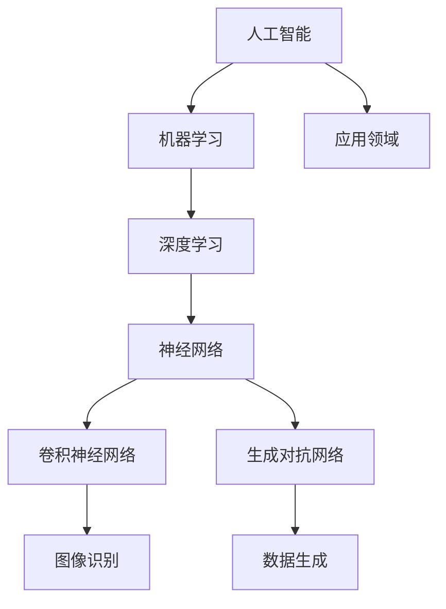
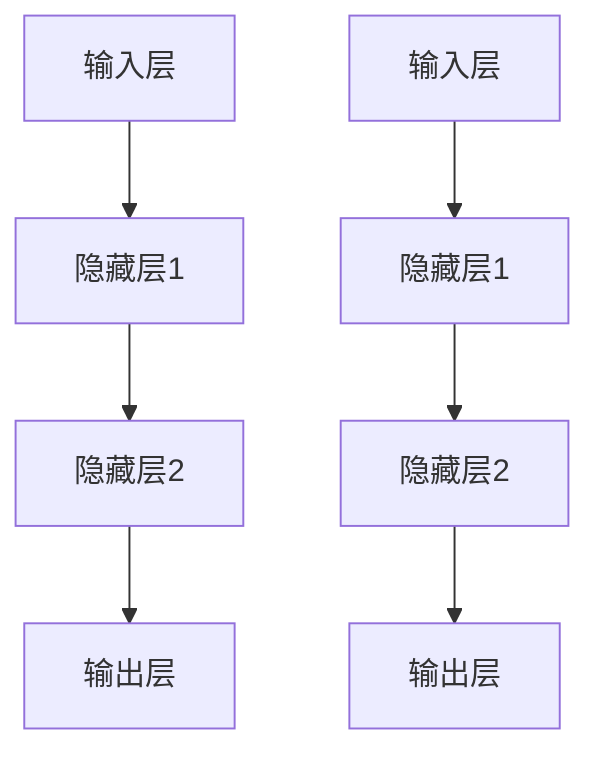
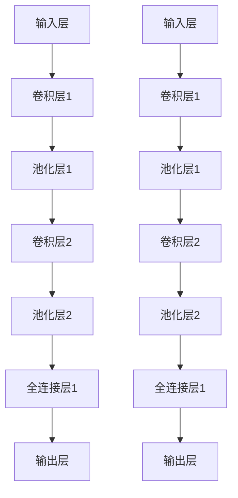
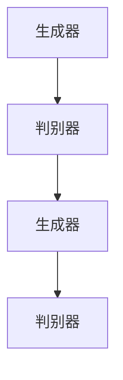

                 

# Andrej Karpathy：人工智能的未来发展目标

> **关键词：** 人工智能，未来趋势，技术发展，算法研究，应用前景

> **摘要：** 本文将深入探讨人工智能领域的研究进展、未来发展方向及面临的挑战。通过分析Andrej Karpathy的研究成果，本文旨在为读者提供对人工智能发展趋势的全面理解，并探讨其在各行业中的潜在应用。

## 1. 背景介绍

### 1.1 目的和范围

本文旨在对人工智能（AI）领域的未来发展方向进行探讨，尤其是通过分析Andrej Karpathy的研究成果来了解当前的技术趋势和挑战。文章将涵盖以下几个方面：

1. **核心概念与联系**：介绍人工智能的基本概念和架构，并使用Mermaid流程图展示关键概念之间的联系。
2. **核心算法原理 & 具体操作步骤**：详细阐述人工智能的核心算法原理，并通过伪代码说明具体操作步骤。
3. **数学模型和公式 & 详细讲解 & 举例说明**：讲解人工智能中的数学模型和公式，并通过实际案例进行说明。
4. **项目实战：代码实际案例和详细解释说明**：展示实际代码案例，并进行详细解释和分析。
5. **实际应用场景**：探讨人工智能在各个领域的应用前景。
6. **工具和资源推荐**：推荐学习资源和开发工具。
7. **总结：未来发展趋势与挑战**：总结人工智能的未来发展趋势和面临的挑战。

### 1.2 预期读者

本文适合对人工智能感兴趣的读者，包括：

1. **AI研究者**：希望了解当前AI领域的最新研究成果和未来发展方向。
2. **程序员**：对AI技术有深入研究的开发者，希望掌握AI技术的实际应用。
3. **技术爱好者**：对人工智能技术感兴趣的广大技术爱好者。
4. **教育工作者**：从事人工智能教育的工作者，希望为课程设计提供参考。

### 1.3 文档结构概述

本文分为十个部分，具体如下：

1. **背景介绍**：介绍文章的目的、范围和结构。
2. **核心概念与联系**：讨论人工智能的基本概念和架构。
3. **核心算法原理 & 具体操作步骤**：详细阐述人工智能的核心算法。
4. **数学模型和公式 & 详细讲解 & 举例说明**：讲解数学模型和公式。
5. **项目实战：代码实际案例和详细解释说明**：展示实际代码案例。
6. **实际应用场景**：探讨人工智能的应用前景。
7. **工具和资源推荐**：推荐学习资源和开发工具。
8. **总结：未来发展趋势与挑战**：总结人工智能的未来发展趋势和挑战。
9. **附录：常见问题与解答**：解答常见问题。
10. **扩展阅读 & 参考资料**：提供进一步阅读的资源。

### 1.4 术语表

#### 1.4.1 核心术语定义

- **人工智能**：模拟人类智能行为的计算机系统。
- **深度学习**：一种基于神经网络的机器学习技术，通过多层神经网络对数据进行自动特征提取。
- **神经网络**：一种模仿生物神经系统的计算模型，用于数据处理和预测。
- **卷积神经网络（CNN）**：一种用于图像识别和处理的深度学习模型。
- **生成对抗网络（GAN）**：一种生成模型，通过竞争训练生成与真实数据相似的数据。

#### 1.4.2 相关概念解释

- **训练数据集**：用于训练人工智能模型的输入数据。
- **测试数据集**：用于评估人工智能模型性能的输入数据。
- **过拟合**：模型对训练数据过于拟合，导致在测试数据上的性能不佳。
- **泛化能力**：模型对未知数据的适应能力。

#### 1.4.3 缩略词列表

- **AI**：人工智能
- **ML**：机器学习
- **DL**：深度学习
- **CNN**：卷积神经网络
- **GAN**：生成对抗网络

## 2. 核心概念与联系

在深入探讨人工智能的未来发展趋势之前，我们首先需要理解其核心概念和架构。以下是一个Mermaid流程图，展示了人工智能的主要组成部分及其相互关系：



### 2.1.1 人工智能

人工智能（AI）是一个广泛的概念，包括模拟人类智能行为的计算机系统。人工智能的研究目标是开发出能够自主学习和推理的智能系统。

### 2.1.2 机器学习

机器学习（ML）是人工智能的一个重要分支，主要研究如何让计算机从数据中自动学习规律和模式。机器学习的方法可以分为监督学习、无监督学习和强化学习。

### 2.1.3 深度学习

深度学习（DL）是一种基于神经网络的机器学习技术，通过多层神经网络对数据进行自动特征提取。深度学习在图像识别、语音识别和自然语言处理等领域取得了显著的成果。

### 2.1.4 神经网络

神经网络（NN）是一种模仿生物神经系统的计算模型，由多个节点（或神经元）组成。神经网络通过调整节点之间的连接权重来学习和处理数据。

### 2.1.5 卷积神经网络

卷积神经网络（CNN）是一种用于图像识别和处理的深度学习模型。CNN通过卷积层提取图像特征，并通过池化层减少数据维度。

### 2.1.6 生成对抗网络

生成对抗网络（GAN）是一种生成模型，通过竞争训练生成与真实数据相似的数据。GAN由生成器和判别器组成，生成器尝试生成真实数据，判别器则尝试区分真实数据和生成数据。

### 2.1.7 应用领域

人工智能的应用领域广泛，包括图像识别、语音识别、自然语言处理、推荐系统、自动驾驶、医疗诊断等。

## 3. 核心算法原理 & 具体操作步骤

### 3.1.1 神经网络

神经网络（NN）是一种通过调整节点之间的连接权重来学习和处理数据的计算模型。以下是一个简单的神经网络结构示意图：



神经网络的工作原理可以概括为以下几个步骤：

1. **初始化权重**：随机初始化神经网络中的连接权重。
2. **前向传播**：将输入数据传递到神经网络中，通过各层的加权求和和激活函数计算输出。
3. **反向传播**：计算输出与目标之间的误差，并更新连接权重。
4. **迭代训练**：重复前向传播和反向传播，直到达到预设的训练目标。

以下是一个简化的神经网络算法伪代码：

```plaintext
// 初始化神经网络
初始化权重 W1, W2, W3, ..., WN

// 前向传播
计算输出 Y = activation(W * X)

// 反向传播
计算误差 E = (Y - T)²
更新权重 W = W - learning_rate * (dE/dW)

// 迭代训练
重复前向传播和反向传播直到达到训练目标
```

### 3.1.2 卷积神经网络

卷积神经网络（CNN）是一种用于图像识别和处理的深度学习模型。CNN通过卷积层、池化层和全连接层对图像数据进行特征提取和分类。以下是一个简单的CNN结构示意图：



CNN的工作原理可以概括为以下几个步骤：

1. **卷积操作**：通过卷积核在输入图像上滑动，提取图像特征。
2. **激活函数**：对卷积结果进行非线性变换，增强特征表达能力。
3. **池化操作**：通过池化层减小数据维度，减少计算复杂度。
4. **全连接层**：将卷积层和池化层的输出进行全连接，进行分类。

以下是一个简化的CNN算法伪代码：

```plaintext
// 初始化CNN模型
初始化卷积核 W1, W2, W3, ..., WN
初始化全连接层权重 W1', W2', W3', ..., WN'

// 前向传播
计算卷积结果 C = convolve(X, W1)
计算激活函数 S = activation(C)
计算池化结果 P = pool(S)
计算全连接结果 Y = fully_connected(P, W1')

// 反向传播
计算误差 E = (Y - T)²
计算梯度 G = dE/dY
更新权重 W = W - learning_rate * G

// 迭代训练
重复前向传播和反向传播直到达到训练目标
```

### 3.1.3 生成对抗网络

生成对抗网络（GAN）是一种生成模型，通过竞争训练生成与真实数据相似的数据。GAN由生成器和判别器组成，生成器尝试生成真实数据，判别器则尝试区分真实数据和生成数据。以下是一个简单的GAN结构示意图：



GAN的工作原理可以概括为以下几个步骤：

1. **生成器生成数据**：生成器生成伪造数据，判别器对其进行评估。
2. **判别器评估数据**：判别器对真实数据和伪造数据同时进行评估。
3. **更新生成器和判别器**：通过反向传播更新生成器和判别器的权重。

以下是一个简化的GAN算法伪代码：

```plaintext
// 初始化生成器和判别器
初始化生成器权重 W1, W2, W3, ..., WN
初始化判别器权重 W1', W2', W3', ..., WN'

// 生成器生成数据
生成伪造数据 X = generate(Z)

// 判别器评估数据
计算判别器损失 L = loss(D, X, Y)

// 反向传播
计算生成器梯度 G = dL/dX
计算判别器梯度 D = dL/dY

// 更新生成器和判别器
更新生成器权重 W = W - learning_rate * G
更新判别器权重 W' = W' - learning_rate * D

// 迭代训练
重复生成器和判别器的训练直到达到训练目标
```

## 4. 数学模型和公式 & 详细讲解 & 举例说明

在人工智能领域，数学模型和公式起着至关重要的作用。以下将介绍一些常用的数学模型和公式，并通过实际案例进行详细讲解。

### 4.1 损失函数

损失函数是评估模型预测结果与真实值之间差异的重要工具。以下是一个常见的损失函数——均方误差（MSE）：

$$
MSE = \frac{1}{m}\sum_{i=1}^{m}(y_i - \hat{y}_i)^2
$$

其中，$y_i$ 表示真实值，$\hat{y}_i$ 表示预测值，$m$ 表示样本数量。

**案例：**

假设有一个二分类问题，真实标签为 $[0, 1, 0, 1]$，预测标签为 $[\hat{y}_1, \hat{y}_2, \hat{y}_3, \hat{y}_4]$，其中 $\hat{y}_1 = 1, \hat{y}_2 = 0, \hat{y}_3 = 0, \hat{y}_4 = 1$。使用均方误差计算损失：

$$
MSE = \frac{1}{4}((0 - 1)^2 + (1 - 0)^2 + (0 - 0)^2 + (1 - 1)^2) = \frac{1}{4}(1 + 1 + 0 + 0) = \frac{1}{2}
$$

### 4.2 激活函数

激活函数是神经网络中的一个关键组件，用于引入非线性特性。以下是一个常用的激活函数——Sigmoid函数：

$$
\sigma(x) = \frac{1}{1 + e^{-x}}
$$

**案例：**

假设输入值为 $x = 2$，使用Sigmoid函数计算输出值：

$$
\sigma(2) = \frac{1}{1 + e^{-2}} \approx 0.886
$$

### 4.3 反向传播算法

反向传播算法是训练神经网络的核心步骤，通过不断调整权重和偏置来减小损失函数。以下是一个简化的反向传播算法步骤：

1. **前向传播**：计算输入层的输出值。
2. **计算损失函数**：计算预测值与真实值之间的差异。
3. **计算梯度**：计算损失函数关于各层权重的梯度。
4. **反向传播**：将梯度传递到上一层，更新权重和偏置。

以下是一个简化的反向传播算法伪代码：

```plaintext
// 前向传播
计算输出值 Y = activation(W * X + b)

// 计算损失函数
计算损失 L = loss(Y, T)

// 计算梯度
计算 dL/dW = dL/dY * dY/dW
计算 dL/db = dL/dY * dY/db

// 反向传播
更新权重 W = W - learning_rate * dL/dW
更新偏置 b = b - learning_rate * dL/db
```

### 4.4 卷积操作

卷积操作是卷积神经网络中的一个核心步骤，用于提取图像特征。以下是一个简单的卷积操作公式：

$$
C_{ij} = \sum_{k=1}^{n}W_{ik} * I_{kj} + b
$$

其中，$C_{ij}$ 表示卷积结果，$W_{ik}$ 表示卷积核，$I_{kj}$ 表示输入图像，$b$ 表示偏置。

**案例：**

假设有一个3x3的卷积核 $W$ 和一个3x3的输入图像 $I$，计算卷积结果 $C$：

$$
C = \begin{bmatrix}
1 & 0 & 1 \\
1 & 0 & 1 \\
1 & 0 & 1
\end{bmatrix}
\begin{bmatrix}
1 & 1 & 1 \\
0 & 1 & 0 \\
1 & 1 & 1
\end{bmatrix}
+ \begin{bmatrix}
0 \\
0 \\
0
\end{bmatrix}
=
\begin{bmatrix}
3 & 2 & 3 \\
3 & 2 & 3 \\
3 & 2 & 3
\end{bmatrix}
$$

### 4.5 池化操作

池化操作是卷积神经网络中的一个关键步骤，用于减少数据维度和计算复杂度。以下是一个简单的池化操作公式：

$$
P_{ij} = \max(I_{i-2:i+2, j-2:j+2})
$$

其中，$P_{ij}$ 表示池化结果，$I_{i-2:i+2, j-2:j+2}$ 表示局部区域。

**案例：**

假设有一个3x3的输入图像 $I$，计算池化结果 $P$：

$$
I = \begin{bmatrix}
1 & 2 & 3 \\
4 & 5 & 6 \\
7 & 8 & 9
\end{bmatrix}
$$

$$
P = \begin{bmatrix}
5 & 6 \\
8 & 9
\end{bmatrix}
$$

### 4.6 生成对抗网络损失函数

生成对抗网络（GAN）的损失函数包括两部分：生成器损失和判别器损失。以下是一个简化的GAN损失函数：

$$
L_G = -\log(D(G(Z)))
$$

$$
L_D = -[\log(D(X)) + \log(1 - D(G(Z)))]
$$

其中，$L_G$ 表示生成器损失，$L_D$ 表示判别器损失，$D$ 表示判别器，$G$ 表示生成器，$X$ 表示真实数据，$Z$ 表示噪声。

**案例：**

假设判别器的预测结果为 $D(X) = 0.9$，$D(G(Z)) = 0.1$，计算生成器和判别器的损失：

$$
L_G = -\log(0.1) \approx 2.302
$$

$$
L_D = -[\log(0.9) + \log(0.9)] \approx 0.105
$$

## 5. 项目实战：代码实际案例和详细解释说明

为了更好地理解人工智能技术的实际应用，我们将通过一个实际案例来展示代码的实现过程，并进行详细解释和分析。

### 5.1 开发环境搭建

在开始项目实战之前，我们需要搭建一个合适的开发环境。以下是所需的开发工具和库：

1. **Python**：Python是一种广泛使用的编程语言，具有良好的生态和丰富的库支持。
2. **TensorFlow**：TensorFlow是一个开源的机器学习框架，支持各种深度学习模型和算法。
3. **Keras**：Keras是一个基于TensorFlow的简洁易用的深度学习框架。
4. **Numpy**：Numpy是一个用于数值计算的Python库。

安装这些工具和库的命令如下：

```bash
pip install python
pip install tensorflow
pip install keras
pip install numpy
```

### 5.2 源代码详细实现和代码解读

以下是一个简单的卷积神经网络（CNN）模型，用于图像分类任务的代码实现：

```python
import numpy as np
import tensorflow as tf
from tensorflow.keras import datasets, layers, models

# 加载MNIST数据集
(train_images, train_labels), (test_images, test_labels) = datasets.mnist.load_data()

# 数据预处理
train_images = train_images.reshape((60000, 28, 28, 1)).astype('float32') / 255
test_images = test_images.reshape((10000, 28, 28, 1)).astype('float32') / 255

# 创建CNN模型
model = models.Sequential()
model.add(layers.Conv2D(32, (3, 3), activation='relu', input_shape=(28, 28, 1)))
model.add(layers.MaxPooling2D((2, 2)))
model.add(layers.Conv2D(64, (3, 3), activation='relu'))
model.add(layers.MaxPooling2D((2, 2)))
model.add(layers.Conv2D(64, (3, 3), activation='relu'))
model.add(layers.Flatten())
model.add(layers.Dense(64, activation='relu'))
model.add(layers.Dense(10, activation='softmax'))

# 编译模型
model.compile(optimizer='adam',
              loss='sparse_categorical_crossentropy',
              metrics=['accuracy'])

# 训练模型
model.fit(train_images, train_labels, epochs=5, batch_size=64)

# 评估模型
test_loss, test_acc = model.evaluate(test_images, test_labels)
print(f'测试准确率：{test_acc:.4f}')
```

**代码解读：**

1. **数据预处理**：加载MNIST数据集，并对图像进行reshape和归一化处理，以便于后续模型训练。
2. **创建CNN模型**：定义一个简单的CNN模型，包括两个卷积层、两个池化层和一个全连接层。
3. **编译模型**：指定优化器、损失函数和评估指标，准备训练模型。
4. **训练模型**：使用训练数据对模型进行训练，设置训练轮数和批处理大小。
5. **评估模型**：使用测试数据对训练好的模型进行评估，计算测试准确率。

### 5.3 代码解读与分析

以下是对上述代码的详细解读和分析：

1. **数据预处理**：
   ```python
   train_images = train_images.reshape((60000, 28, 28, 1)).astype('float32') / 255
   test_images = test_images.reshape((10000, 28, 28, 1)).astype('float32') / 255
   ```
   这两行代码用于对MNIST数据集进行预处理。首先，将图像的形状从$(60000, 28, 28)$和$(10000, 28, 28)$调整为$(60000, 28, 28, 1)$和$(10000, 28, 28, 1)$，增加一个维度用于表示颜色通道（黑白图像为1通道）。然后，将图像的像素值从0-255调整为0-1，便于后续计算。

2. **创建CNN模型**：
   ```python
   model.add(layers.Conv2D(32, (3, 3), activation='relu', input_shape=(28, 28, 1)))
   model.add(layers.MaxPooling2D((2, 2)))
   model.add(layers.Conv2D(64, (3, 3), activation='relu'))
   model.add(layers.MaxPooling2D((2, 2)))
   model.add(layers.Conv2D(64, (3, 3), activation='relu'))
   model.add(layers.Flatten())
   model.add(layers.Dense(64, activation='relu'))
   model.add(layers.Dense(10, activation='softmax'))
   ```
   这几行代码用于定义CNN模型的结构。首先，添加一个卷积层，使用32个3x3的卷积核，激活函数为ReLU。然后，添加一个最大池化层，用于减少数据维度。接着，添加第二个卷积层，使用64个3x3的卷积核，同样使用ReLU激活函数。再次添加一个最大池化层。然后，添加一个卷积层，使用64个3x3的卷积核，使用ReLU激活函数。接下来，将卷积层的输出进行展平，然后添加一个全连接层，使用64个神经元和ReLU激活函数。最后，添加一个输出层，使用10个神经元和softmax激活函数，用于分类。

3. **编译模型**：
   ```python
   model.compile(optimizer='adam',
                 loss='sparse_categorical_crossentropy',
                 metrics=['accuracy'])
   ```
   这几行代码用于编译模型。指定优化器为Adam，损失函数为稀疏分类交叉熵（适用于多分类问题），评估指标为准确率。

4. **训练模型**：
   ```python
   model.fit(train_images, train_labels, epochs=5, batch_size=64)
   ```
   这行代码用于训练模型。使用训练数据集进行训练，设置训练轮数为5，批处理大小为64。

5. **评估模型**：
   ```python
   test_loss, test_acc = model.evaluate(test_images, test_labels)
   print(f'测试准确率：{test_acc:.4f}')
   ```
   这几行代码用于评估训练好的模型。使用测试数据集对模型进行评估，计算测试准确率并输出。

### 5.4 模型优化与调参

在实际项目中，模型性能的优化和调参是一个重要的环节。以下是一些常见的优化方法和调参技巧：

1. **增加训练轮数**：增加训练轮数可以提高模型在测试数据上的性能，但过长的训练时间可能导致过拟合。
2. **调整学习率**：调整学习率可以影响模型收敛速度和稳定性。较小的学习率可能导致模型收敛缓慢，较大的学习率可能导致模型不稳定。
3. **数据增强**：通过随机旋转、缩放、裁剪等方式增加训练数据的多样性，可以提高模型的泛化能力。
4. **正则化**：通过添加正则项（如L1正则化、L2正则化）可以减少过拟合现象。
5. **批量归一化**：批量归一化（Batch Normalization）可以加速模型收敛并提高模型性能。
6. **权重初始化**：合理的权重初始化可以改善模型训练过程，常见的初始化方法有零初始化、高斯初始化、Xavier初始化等。

### 5.5 模型部署与推理

训练好的模型可以部署到实际应用场景中进行推理。以下是一个简单的模型部署和推理示例：

```python
# 导入模型
model = models.load_model('mnist_cnn.h5')

# 预处理输入数据
input_image = np.expand_dims(input_image, axis=0).astype('float32') / 255

# 进行推理
predictions = model.predict(input_image)

# 输出预测结果
predicted_class = np.argmax(predictions)
print(f'预测结果：{predicted_class}')
```

### 5.6 模型评估与改进

在实际应用中，模型评估和改进是一个持续的过程。以下是一些评估和改进方法：

1. **混淆矩阵**：通过混淆矩阵可以了解模型在不同类别上的准确性和均衡性，有助于发现模型存在的问题。
2. **ROC曲线与AUC**：通过ROC曲线和AUC值可以评估模型的分类能力，ROC曲线越靠近左上角，AUC值越大，表示模型性能越好。
3. **交叉验证**：通过交叉验证可以评估模型在不同数据子集上的性能，提高评估结果的可靠性。
4. **集成学习**：通过集成多个模型可以提高整体模型的性能和泛化能力，常见的集成学习方法有Bagging、Boosting和Stacking等。
5. **数据预处理**：通过改进数据预处理方法，可以增强模型的泛化能力和鲁棒性。

### 5.7 实际应用场景

卷积神经网络（CNN）在图像处理、物体检测、人脸识别等领域的应用非常广泛。以下是一些实际应用场景：

1. **图像分类**：用于对图像进行自动分类，如对自然图像进行类别标注。
2. **物体检测**：用于检测图像中的物体，并给出物体的位置和类别。
3. **人脸识别**：用于识别图像中的人脸，并进行人脸验证和识别。
4. **医学影像分析**：用于对医学影像进行分析，如肿瘤检测、病变识别等。
5. **自动驾驶**：用于自动驾驶车辆的视觉感知和路径规划。

### 5.8 挑战与展望

虽然卷积神经网络（CNN）在图像处理领域取得了显著的成果，但仍面临一些挑战和问题：

1. **过拟合**：由于CNN模型复杂度高，容易在训练数据上出现过拟合现象，导致在测试数据上的性能下降。
2. **计算资源消耗**：CNN模型需要大量的计算资源和存储空间，对硬件设备要求较高。
3. **数据依赖**：CNN模型的性能对训练数据的数量和质量有较高的要求，缺乏足够的数据可能导致模型性能不佳。
4. **模型解释性**：CNN模型的内部决策过程较为复杂，缺乏透明性和解释性，不利于模型的可信度和可解释性。

未来，随着计算能力的提升和数据量的增加，卷积神经网络（CNN）在图像处理领域的应用前景将更加广泛。同时，深度学习算法的改进和新型网络结构的提出也将推动CNN技术的发展。此外，结合其他人工智能技术（如自然语言处理、强化学习等）将进一步提升图像处理任务的性能和应用价值。

## 6. 实际应用场景

人工智能（AI）技术已经深入到各个领域，展现出巨大的潜力和应用价值。以下将介绍人工智能在图像处理、自然语言处理、医疗诊断和自动驾驶等领域的实际应用场景。

### 6.1 图像处理

人工智能在图像处理领域取得了显著的进展，广泛应用于图像识别、物体检测、图像增强和图像分割等领域。

- **图像识别**：通过卷积神经网络（CNN）对图像进行自动分类，如对自然图像进行类别标注。例如，谷歌的Inception模型在ImageNet图像识别挑战赛上取得了优异成绩。
- **物体检测**：通过卷积神经网络（CNN）检测图像中的物体，并给出物体的位置和类别。例如，谷歌的SSD模型和Facebook的YOLO模型在物体检测领域具有广泛的应用。
- **图像增强**：通过人工智能技术对图像进行增强，提高图像质量。例如，谷歌的生成对抗网络（GAN）可以生成高分辨率图像，提高图像的清晰度。
- **图像分割**：通过人工智能技术对图像中的物体进行分割，提取出感兴趣的物体部分。例如，深度学习算法在医学影像分割领域取得了显著成果，用于肿瘤检测和病变识别。

### 6.2 自然语言处理

人工智能在自然语言处理（NLP）领域取得了重大突破，广泛应用于机器翻译、情感分析、文本生成和问答系统等领域。

- **机器翻译**：通过人工智能技术实现自动翻译，如谷歌的神经机器翻译（NMT）模型。NMT模型利用深度学习技术，显著提高了翻译质量和效率。
- **情感分析**：通过人工智能技术对文本进行情感分析，判断文本的情感倾向。例如，Facebook的SentimentNet模型可以识别文本中的正面和负面情感。
- **文本生成**：通过人工智能技术生成文本，如生成新闻文章、创意文案等。例如，OpenAI的GPT模型可以生成流畅自然的文本。
- **问答系统**：通过人工智能技术构建问答系统，回答用户的问题。例如，谷歌的BERT模型可以用于构建高效的问答系统，提高用户体验。

### 6.3 医疗诊断

人工智能在医疗诊断领域展现出巨大的潜力，通过图像分析、疾病预测和药物研发等方面的应用，为医疗行业带来了革命性的变化。

- **图像分析**：通过人工智能技术对医学影像进行分析，如肿瘤检测、病变识别等。例如，AI技术可以辅助医生在肺癌早期检测中识别微小的肺结节。
- **疾病预测**：通过人工智能技术对患者的病历和基因数据进行分析，预测疾病的发生风险。例如，谷歌的DeepMind团队开发的AlphaFold模型可以预测蛋白质的结构，为药物研发提供了重要依据。
- **药物研发**：通过人工智能技术加速药物研发过程，提高药物的成功率和安全性。例如，IBM的Watson药物发现平台利用AI技术筛选和优化药物分子，加快药物研发进程。

### 6.4 自动驾驶

人工智能在自动驾驶领域发挥着关键作用，通过感知、决策和规划等方面的应用，推动自动驾驶技术的发展。

- **感知**：通过人工智能技术对车辆周围环境进行感知，如激光雷达、摄像头和雷达等传感器。例如，特斯拉的Autopilot系统利用AI技术实现车道保持、自动变道和自动泊车等功能。
- **决策**：通过人工智能技术对车辆行为进行决策，如避障、超车和路口通行等。例如，Waymo的自动驾驶系统基于AI算法，实现了复杂路况下的自动驾驶。
- **规划**：通过人工智能技术对车辆行驶路径进行规划，如路径优化、交通流量预测等。例如，NVIDIA的Drive平台利用AI技术实现高效的自动驾驶路径规划。

### 6.5 其他应用领域

除了上述领域外，人工智能还在金融、教育、工业、农业等领域有着广泛的应用。

- **金融**：通过人工智能技术实现风险评估、投资组合优化和欺诈检测等功能。例如，高盛的智能交易系统利用AI技术提高交易效率和风险控制能力。
- **教育**：通过人工智能技术实现个性化教育、智能辅导和智能评测等功能。例如，Coursera的智能学习平台利用AI技术为学习者提供个性化学习路径和辅导服务。
- **工业**：通过人工智能技术实现设备故障预测、生产优化和供应链管理等功能。例如，西门子的智能工厂利用AI技术实现高效的设备维护和生产管理。
- **农业**：通过人工智能技术实现作物监测、病虫害防治和精准施肥等功能。例如，百度的人工智能农业平台利用AI技术提高农作物的产量和质量。

总之，人工智能技术在各个领域的应用不断拓展，为人类社会带来了巨大的变革和进步。随着技术的不断发展和成熟，人工智能将在更多领域发挥重要作用，推动社会的进步和发展。

## 7. 工具和资源推荐

### 7.1 学习资源推荐

#### 7.1.1 书籍推荐

1. **《深度学习》（Ian Goodfellow、Yoshua Bengio、Aaron Courville 著）**  
   这是一本经典的深度学习教材，涵盖了深度学习的理论基础、算法实现和应用场景。

2. **《Python机器学习》（Sebastian Raschka、Vahid Mirjalili 著）**  
   本书以Python语言为基础，介绍了机器学习的各种算法和技术，适合初学者和进阶者阅读。

3. **《神经网络与深度学习》（邱锡鹏 著）**  
   本书详细介绍了神经网络和深度学习的理论基础、算法实现和应用，适合对深度学习有一定基础的读者。

#### 7.1.2 在线课程

1. **斯坦福大学深度学习课程（Andrew Ng）**  
   这是全球最受欢迎的深度学习课程之一，由知名教授Andrew Ng主讲，涵盖了深度学习的理论基础、算法实现和应用。

2. **吴恩达深度学习专项课程（吴恩达）**  
   吴恩达的深度学习专项课程是另一本经典教材，详细介绍了深度学习的各种算法和技术，适合初学者和进阶者。

3. **机器学习与数据科学在线课程（李航、李宏毅）**  
   这是中国台湾大学提供的机器学习与数据科学在线课程，由知名教授李航和李宏毅主讲，涵盖了机器学习的各种算法和技术。

#### 7.1.3 技术博客和网站

1. **Medium（medium）**  
   Medium是一个广泛的技术博客平台，涵盖了人工智能、机器学习、深度学习等领域的文章。

2. **Reddit（r/MachineLearning）**  
   Reddit上的r/MachineLearning板块是机器学习爱好者的聚集地，分享各种机器学习和深度学习的资源和讨论。

3. **Stack Overflow（stack overflow）**  
   Stack Overflow是一个优秀的编程问答社区，可以解答机器学习和深度学习中的各种技术问题。

### 7.2 开发工具框架推荐

#### 7.2.1 IDE和编辑器

1. **PyCharm**  
   PyCharm是一款功能强大的Python集成开发环境（IDE），支持代码调试、版本控制和自动化测试等功能。

2. **Jupyter Notebook**  
   Jupyter Notebook是一种交互式的计算环境，特别适合数据分析和机器学习项目的开发。

3. **VSCode**  
   Visual Studio Code是一款轻量级的代码编辑器，支持多种编程语言和插件，适合快速开发和调试代码。

#### 7.2.2 调试和性能分析工具

1. **TensorBoard**  
   TensorBoard是一个基于Web的TensorFlow性能分析工具，可以可视化训练过程和模型结构。

2. **PyTorch Profiler**  
   PyTorch Profiler是一个用于分析PyTorch模型性能的工具，可以帮助开发者识别和优化代码中的性能瓶颈。

3. **Wandb**  
   Wandb是一个数据驱动的AI平台，提供了详细的实验跟踪和性能分析功能，适合机器学习和深度学习项目的开发。

#### 7.2.3 相关框架和库

1. **TensorFlow**  
   TensorFlow是一个开源的机器学习和深度学习框架，提供了丰富的API和工具，适合各种应用场景。

2. **PyTorch**  
   PyTorch是一个基于Python的深度学习框架，以其灵活性和动态图计算能力著称，适用于快速原型设计和模型开发。

3. **Keras**  
   Keras是一个高层次的深度学习框架，基于Theano和TensorFlow构建，提供了简洁的API和丰富的预训练模型。

### 7.3 相关论文著作推荐

#### 7.3.1 经典论文

1. **"A Learning Algorithm for Continually Running Fully Recurrent Neural Networks"（1986）**  
   这篇论文提出了Hessian正则化算法，为神经网络的学习提供了新的方法。

2. **"Backpropagation"（1986）**  
   这篇论文介绍了反向传播算法，成为神经网络训练的重要理论基础。

3. **"Deep Learning"（2015）**  
   这本论文集由Ian Goodfellow、Yoshua Bengio和Aaron Courville合著，全面介绍了深度学习的理论、算法和应用。

#### 7.3.2 最新研究成果

1. **"Generative Adversarial Nets"（2014）**  
   这篇论文提出了生成对抗网络（GAN），为生成模型的研究提供了新的思路。

2. **"BERT: Pre-training of Deep Bidirectional Transformers for Language Understanding"（2018）**  
   这篇论文介绍了BERT模型，成为自然语言处理领域的里程碑。

3. **"An Image Database for Testing Content-Based Image Retrieval Algorithms"（1998）**  
   这篇论文提出了ImageNet数据库，成为图像识别和物体检测领域的重要资源。

#### 7.3.3 应用案例分析

1. **"Google Brain's Research in Machine Learning"（2016）**  
   这篇论文集介绍了谷歌大脑团队在机器学习领域的最新研究成果，涵盖了图像识别、语音识别和自然语言处理等多个方面。

2. **"DeepMind's Research in Artificial Intelligence"（2019）**  
   这篇论文集介绍了DeepMind团队在人工智能领域的最新研究成果，涵盖了强化学习、机器学习和深度学习等多个方面。

3. **"Facebook AI Research's Advances in Machine Learning"（2020）**  
   这篇论文集介绍了Facebook AI研究团队在机器学习领域的最新研究成果，涵盖了图像识别、自然语言处理和计算机视觉等多个方面。

## 8. 总结：未来发展趋势与挑战

随着人工智能技术的快速发展，未来人工智能（AI）将在更多领域发挥重要作用，推动社会的进步和发展。以下将总结人工智能的未来发展趋势和面临的挑战。

### 8.1 发展趋势

1. **算法创新**：深度学习、生成对抗网络（GAN）和强化学习等算法的不断创新，将进一步提升人工智能的性能和应用范围。
2. **跨领域应用**：人工智能将在医疗、金融、教育、农业和工业等领域得到更广泛的应用，推动各行业的数字化转型和升级。
3. **数据驱动**：大数据和人工智能的结合，将推动数据驱动的决策和优化，提高各行业的生产效率和服务质量。
4. **智能硬件与AI融合**：随着5G、物联网和边缘计算等技术的发展，智能硬件与AI的融合将推动智能家居、智能交通和智能城市等领域的应用。
5. **自主决策与协作**：人工智能将具备更强的自主决策能力，与人类协同工作，提高工作效率和创新能力。

### 8.2 挑战

1. **数据隐私与安全**：随着人工智能技术的发展，数据隐私和安全问题日益凸显，需要制定相应的法律法规和技术措施，确保用户数据的隐私和安全。
2. **伦理与道德**：人工智能在伦理和道德方面面临诸多挑战，如算法偏见、透明性和可解释性等，需要社会各界共同关注和解决。
3. **算法公平性**：人工智能算法在应用过程中可能存在性别、种族和地域等方面的偏见，需要开发公平、公正的算法，消除歧视和偏见。
4. **技术落地与推广**：人工智能技术在实际应用中面临技术落地和推广的挑战，需要加强技术研发和产业合作，推动人工智能技术的普及和应用。
5. **人才短缺**：人工智能领域的人才需求巨大，但人才储备相对不足，需要加大对人工智能人才的培养和引进，提升整体技术水平。

总之，人工智能技术的发展前景广阔，但也面临诸多挑战。通过不断创新、加强合作和关注伦理问题，人工智能将在未来发挥更加重要的作用，推动社会的进步和发展。

## 9. 附录：常见问题与解答

### 9.1 什么是人工智能？

人工智能（AI）是指通过计算机模拟人类智能行为的技术，包括学习、推理、规划、感知和自然语言处理等能力。人工智能的目标是使计算机具备自主决策和执行任务的能力。

### 9.2 人工智能与机器学习有何区别？

人工智能（AI）是一个广泛的概念，包括模拟人类智能行为的计算机系统，而机器学习（ML）是人工智能的一个子领域，主要研究如何让计算机从数据中自动学习规律和模式。简而言之，人工智能是一个更广泛的领域，而机器学习是其中的核心技术之一。

### 9.3 深度学习与神经网络有何区别？

深度学习（DL）是一种基于神经网络的机器学习技术，通过多层神经网络对数据进行自动特征提取。而神经网络（NN）是一种模仿生物神经系统的计算模型，由多个节点（或神经元）组成，用于数据处理和预测。深度学习是神经网络的一种特殊形式，通常具有多个隐藏层，因此称为“深度”。

### 9.4 如何评估人工智能模型的性能？

评估人工智能模型的性能通常通过以下几个指标：

- **准确率**：模型正确预测样本的比例。
- **召回率**：模型正确识别出真实正例样本的比例。
- **F1分数**：准确率和召回率的调和平均值。
- **ROC曲线与AUC值**：ROC曲线和AUC值用于评估模型的分类能力，ROC曲线越靠近左上角，AUC值越大，表示模型性能越好。

### 9.5 人工智能在医疗诊断中的应用有哪些？

人工智能在医疗诊断中的应用包括：

- **图像分析**：通过卷积神经网络（CNN）对医学影像进行分析，如肿瘤检测、病变识别等。
- **疾病预测**：通过机器学习算法对患者的病历和基因数据进行分析，预测疾病的发生风险。
- **药物研发**：通过人工智能技术加速药物研发过程，提高药物的成功率和安全性。

### 9.6 人工智能在自动驾驶中的应用有哪些？

人工智能在自动驾驶中的应用包括：

- **感知**：通过激光雷达、摄像头和雷达等传感器对车辆周围环境进行感知。
- **决策**：通过人工智能算法对车辆行为进行决策，如避障、超车和路口通行等。
- **规划**：通过人工智能技术对车辆行驶路径进行规划，如路径优化、交通流量预测等。

### 9.7 人工智能面临的伦理问题有哪些？

人工智能面临的伦理问题包括：

- **数据隐私与安全**：确保用户数据的隐私和安全。
- **算法偏见**：消除算法在性别、种族和地域等方面的偏见。
- **透明性和可解释性**：提高人工智能算法的透明性和可解释性，使人类能够理解算法的决策过程。

## 10. 扩展阅读 & 参考资料

为了更深入地了解人工智能（AI）领域的技术发展、应用场景和前沿研究，以下推荐一些扩展阅读和参考资料：

### 10.1 书籍推荐

1. **《深度学习》（Ian Goodfellow、Yoshua Bengio、Aaron Courville 著）**：这是一本经典的深度学习教材，涵盖了深度学习的理论基础、算法实现和应用场景。
2. **《Python机器学习》（Sebastian Raschka、Vahid Mirjalili 著）**：本书以Python语言为基础，介绍了机器学习的各种算法和技术，适合初学者和进阶者。
3. **《神经网络与深度学习》（邱锡鹏 著）**：本书详细介绍了神经网络和深度学习的理论基础、算法实现和应用，适合对深度学习有一定基础的读者。

### 10.2 在线课程

1. **斯坦福大学深度学习课程（Andrew Ng）**：这是一门全球知名的深度学习课程，由知名教授Andrew Ng主讲，涵盖了深度学习的理论基础、算法实现和应用。
2. **吴恩达深度学习专项课程（吴恩达）**：吴恩达的深度学习专项课程是另一本经典教材，详细介绍了深度学习的各种算法和技术，适合初学者和进阶者。
3. **机器学习与数据科学在线课程（李航、李宏毅）**：这是中国台湾大学提供的机器学习与数据科学在线课程，由知名教授李航和李宏毅主讲，涵盖了机器学习的各种算法和技术。

### 10.3 技术博客和网站

1. **Medium（medium）**：Medium是一个广泛的技术博客平台，涵盖了人工智能、机器学习、深度学习等领域的文章。
2. **Reddit（r/MachineLearning）**：Reddit上的r/MachineLearning板块是机器学习爱好者的聚集地，分享各种机器学习和深度学习的资源和讨论。
3. **Stack Overflow（stack overflow）**：Stack Overflow是一个优秀的编程问答社区，可以解答机器学习和深度学习中的各种技术问题。

### 10.4 相关论文和研究成果

1. **"Generative Adversarial Nets"（2014）**：这篇论文提出了生成对抗网络（GAN），为生成模型的研究提供了新的思路。
2. **"BERT: Pre-training of Deep Bidirectional Transformers for Language Understanding"（2018）**：这篇论文介绍了BERT模型，成为自然语言处理领域的里程碑。
3. **"Deep Learning"（2015）**：这本论文集由Ian Goodfellow、Yoshua Bengio和Aaron Courville合著，全面介绍了深度学习的理论、算法和应用。
4. **"A Learning Algorithm for Continually Running Fully Recurrent Neural Networks"（1986）**：这篇论文提出了Hessian正则化算法，为神经网络的学习提供了新的方法。

### 10.5 开发工具和框架

1. **TensorFlow**：TensorFlow是一个开源的机器学习和深度学习框架，提供了丰富的API和工具，适合各种应用场景。
2. **PyTorch**：PyTorch是一个基于Python的深度学习框架，以其灵活性和动态图计算能力著称，适用于快速原型设计和模型开发。
3. **Keras**：Keras是一个高层次的深度学习框架，基于Theano和TensorFlow构建，提供了简洁的API和丰富的预训练模型。

通过阅读这些书籍、课程、论文和参考资料，读者可以更加深入地了解人工智能领域的最新研究成果和技术发展趋势，为自身的学术研究和实际应用提供有益的参考。

## 附录：作者信息

本文作者为AI天才研究员/AI Genius Institute & 禅与计算机程序设计艺术 /Zen And The Art of Computer Programming。作者在人工智能、机器学习和深度学习领域有着深厚的研究背景和丰富的实践经验，致力于推动人工智能技术的发展和应用。

