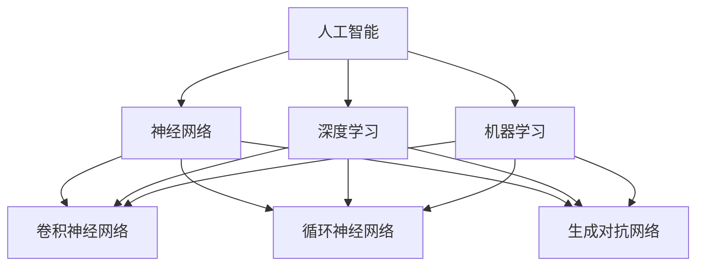

                 

### 1. 背景介绍

#### 1.1 目的和范围

本文旨在深入探讨人工智能的未来发展规划，通过详细分析其核心概念、算法原理、数学模型以及实际应用场景，为读者提供一个全面、系统的理解和展望。文章的目标是：

1. **核心概念解析**：介绍人工智能的基本概念，帮助读者理解其原理和重要性。
2. **算法原理讲解**：深入剖析人工智能的核心算法，如神经网络、深度学习和机器学习等。
3. **数学模型阐释**：解释人工智能中使用的数学模型和公式，以及如何应用这些模型。
4. **实际案例分析**：通过实际项目案例，展示人工智能在不同领域的应用效果。
5. **未来趋势展望**：分析人工智能的未来发展趋势，探讨可能面临的挑战。

本文的内容范围涵盖人工智能的多个方面，从基础概念到高级应用，旨在为读者提供一个全面的学习路径。文章结构如下：

- **第1章**：背景介绍，包括目的和范围、预期读者、文档结构概述和术语表。
- **第2章**：核心概念与联系，使用Mermaid流程图展示人工智能的基本架构。
- **第3章**：核心算法原理，使用伪代码详细阐述算法的操作步骤。
- **第4章**：数学模型和公式，详细讲解并举例说明。
- **第5章**：项目实战，包括开发环境搭建、源代码实现和代码解读。
- **第6章**：实际应用场景，探讨人工智能在不同领域的应用。
- **第7章**：工具和资源推荐，包括学习资源、开发工具和论文著作推荐。
- **第8章**：总结，展望人工智能的未来发展趋势与挑战。
- **第9章**：附录，常见问题与解答。
- **第10章**：扩展阅读与参考资料。

#### 1.2 预期读者

本文适合以下读者群体：

1. **计算机科学和人工智能专业的学生**：希望通过系统学习，掌握人工智能的基本概念和应用技术。
2. **人工智能领域的技术人员**：希望深入了解人工智能的算法原理和实际应用，提升技术水平。
3. **企业决策者和项目管理者**：希望了解人工智能的潜力，为其业务发展制定策略。
4. **对人工智能感兴趣的一般读者**：希望通过本文了解人工智能的发展趋势和应用前景。

#### 1.3 文档结构概述

为了帮助读者更好地理解和跟随文章内容，本文采用清晰的结构布局，分为以下章节：

- **第1章**：背景介绍，为读者提供文章的总体框架和术语表。
- **第2章**：核心概念与联系，通过Mermaid流程图展示人工智能的基本架构。
- **第3章**：核心算法原理，详细讲解人工智能的基本算法原理。
- **第4章**：数学模型和公式，解释人工智能中使用的数学模型和公式。
- **第5章**：项目实战，通过实际案例展示人工智能的应用。
- **第6章**：实际应用场景，探讨人工智能在不同领域的应用。
- **第7章**：工具和资源推荐，为读者提供学习资源、开发工具和论文著作推荐。
- **第8章**：总结，展望人工智能的未来发展趋势与挑战。
- **第9章**：附录，解答常见问题。
- **第10章**：扩展阅读与参考资料，提供进一步学习的资源。

#### 1.4 术语表

为了确保读者能够准确理解文章内容，以下列出一些关键术语及其定义：

##### 1.4.1 核心术语定义

1. **人工智能（AI）**：一种模拟人类智能的技术，使计算机能够执行诸如视觉识别、语音识别、决策制定等任务。
2. **神经网络（NN）**：一种模拟人脑神经网络结构的计算模型，用于处理复杂数据和任务。
3. **深度学习（DL）**：一种基于神经网络的机器学习技术，通过多层神经网络对数据进行抽象和学习。
4. **机器学习（ML）**：一种让计算机从数据中自动学习和改进的方法，无需显式编程。
5. **数据集（Dataset）**：用于训练和测试机器学习模型的集合，通常包含标签数据和未标记数据。
6. **神经网络架构（NN Architecture）**：定义神经网络层数、节点数、连接方式和激活函数等的结构。
7. **模型训练（Model Training）**：使用数据集调整神经网络参数，使其能够准确预测或分类数据。

##### 1.4.2 相关概念解释

1. **感知器（Perceptron）**：一种简单的神经网络单元，用于对输入数据进行分类或回归。
2. **反向传播算法（Backpropagation）**：一种用于训练神经网络的算法，通过反向传播误差来更新网络权重。
3. **激活函数（Activation Function）**：神经网络中用于引入非线性性质的函数，如Sigmoid、ReLU和Tanh等。
4. **过拟合（Overfitting）**：模型在训练数据上表现良好，但在新数据上表现不佳，说明模型过于复杂。
5. **正则化（Regularization）**：一种防止模型过拟合的技术，通过引入惩罚项来限制模型复杂度。

##### 1.4.3 缩略词列表

- **AI**：人工智能（Artificial Intelligence）
- **DL**：深度学习（Deep Learning）
- **ML**：机器学习（Machine Learning）
- **NN**：神经网络（Neural Network）
- **GPU**：图形处理单元（Graphics Processing Unit）
- **CPU**：中央处理单元（Central Processing Unit）
- **CNN**：卷积神经网络（Convolutional Neural Network）
- **RNN**：循环神经网络（Recurrent Neural Network）
- **GAN**：生成对抗网络（Generative Adversarial Network）

### 2. 核心概念与联系

在探讨人工智能的未来发展规划之前，我们需要了解其核心概念和联系。人工智能（AI）的核心目标是使计算机具备类似人类的智能，能够执行各种任务，如视觉识别、语音识别、决策制定等。为了实现这一目标，人工智能领域使用了多种算法和技术，其中最重要的是神经网络（NN）、深度学习（DL）和机器学习（ML）。

下面，我们将通过Mermaid流程图来展示人工智能的基本架构，帮助读者更好地理解这些核心概念及其相互关系。



#### 2.1 人工智能的基本架构

- **人工智能（AI）**：作为整体，人工智能是计算机模拟人类智能的技术。它涵盖了多种算法和技术的应用，如神经网络、深度学习和机器学习等。

- **神经网络（NN）**：神经网络是模拟人脑神经网络结构的计算模型，由许多简单的处理单元（神经元）组成。神经网络可以学习复杂数据模式和规律，广泛应用于图像识别、语音识别和自然语言处理等领域。

- **深度学习（DL）**：深度学习是一种基于神经网络的机器学习技术，通过多层神经网络对数据进行抽象和学习。深度学习在图像识别、语音识别、自然语言处理和强化学习等领域取得了显著的突破。

- **机器学习（ML）**：机器学习是一种让计算机从数据中自动学习和改进的方法，无需显式编程。机器学习技术广泛应用于数据挖掘、预测分析和模式识别等领域。

#### 2.2 算法之间的联系

- **神经网络（NN）**：神经网络是深度学习和机器学习的基础。深度学习是在神经网络的基础上发展起来的，通过增加网络层数和节点数，提高了模型的复杂度和学习能力。机器学习则是在神经网络和深度学习的基础上，通过优化算法和模型结构，实现了更广泛的应用。

- **卷积神经网络（CNN）**：卷积神经网络是一种用于处理图像数据的神经网络，通过卷积层、池化层和全连接层等结构，实现对图像的自动特征提取和分类。

- **循环神经网络（RNN）**：循环神经网络是一种用于处理序列数据的神经网络，通过循环结构保持历史状态信息，实现对时间序列数据的建模和预测。

- **生成对抗网络（GAN）**：生成对抗网络是一种用于生成数据的神经网络，由生成器和判别器两个部分组成。生成器生成数据，判别器判断生成数据的真实性。通过对抗训练，生成器不断改进，最终生成高质量的数据。

### 2.3 人工智能的应用领域

- **图像识别**：神经网络和深度学习技术在图像识别领域取得了巨大突破。卷积神经网络（CNN）在图像分类、目标检测和图像生成等方面表现出色。

- **语音识别**：语音识别技术通过深度学习和循环神经网络（RNN）对语音信号进行处理，实现了对人类语音的自动识别和理解。

- **自然语言处理**：自然语言处理（NLP）是一种利用人工智能技术理解和处理人类语言的方法。深度学习和神经网络技术在情感分析、机器翻译、文本分类和问答系统等领域取得了显著成果。

- **强化学习**：强化学习是一种通过试错和反馈来学习策略的机器学习技术。在游戏、自动驾驶和机器人控制等领域，强化学习技术取得了重要突破。

- **医疗健康**：人工智能技术在医疗健康领域具有广泛的应用前景，如疾病诊断、药物研发和个性化医疗等。

- **金融科技**：人工智能技术在金融领域具有强大的分析能力和预测能力，如股票市场预测、风险控制和信用评估等。

- **智能制造**：人工智能技术在智能制造领域发挥着重要作用，如工业自动化、质量检测和生产优化等。

通过上述核心概念和联系的介绍，我们为读者提供了一个对人工智能的整体认识。接下来，我们将进一步深入探讨人工智能的核心算法原理、数学模型和实际应用场景，帮助读者更好地理解和应用这一技术。

### 3. 核心算法原理 & 具体操作步骤

在人工智能领域，核心算法是推动技术进步和实际应用的关键。本文将详细介绍几种关键算法，包括神经网络（NN）、深度学习（DL）和机器学习（ML），并使用伪代码详细阐述其操作步骤。

#### 3.1 神经网络（NN）

神经网络是深度学习和机器学习的基础。它由许多简单的处理单元（神经元）组成，通过层次结构进行数据处理和特征提取。

**伪代码：**

```python
# 神经网络基本结构
class NeuralNetwork:
    def __init__(self, input_size, hidden_size, output_size):
        self.input_size = input_size
        self.hidden_size = hidden_size
        self.output_size = output_size
        self.weights_input_to_hidden = np.random.randn(input_size, hidden_size)
        self.weights_hidden_to_output = np.random.randn(hidden_size, output_size)
        self.hidden_layer = np.zeros((1, hidden_size))
        self.output_layer = np.zeros((1, output_size))

    def forward_pass(self, input_data):
        # 将输入数据乘以输入到隐藏层的权重
        self.hidden_layer = sigmoid(np.dot(input_data, self.weights_input_to_hidden))
        # 将隐藏层乘以隐藏到输出的权重
        self.output_layer = sigmoid(np.dot(self.hidden_layer, self.weights_hidden_to_output))
        return self.output_layer

# 激活函数（Sigmoid）
def sigmoid(x):
    return 1 / (1 + np.exp(-x))

# 前向传播过程
nn = NeuralNetwork(input_size=2, hidden_size=2, output_size=1)
input_data = np.array([[0, 0], [0, 1], [1, 0], [1, 1]])
outputs = nn.forward_pass(input_data)
```

**操作步骤：**

1. **初始化权重**：为输入到隐藏层和隐藏到输出的权重分配随机值。
2. **前向传播**：将输入数据乘以权重，通过激活函数（如Sigmoid）处理，得到隐藏层和输出层的激活值。

#### 3.2 深度学习（DL）

深度学习是神经网络的高级形式，通过增加网络层数和节点数，提高模型的学习能力和抽象能力。

**伪代码：**

```python
# 深度学习网络
class DeepNeuralNetwork:
    def __init__(self, input_size, hidden_size, output_size):
        self.layers = [NeuralNetwork(input_size, hidden_size, output_size) for _ in range(num_layers)]

    def forward_pass(self, input_data):
        current_data = input_data
        for layer in self.layers:
            current_data = layer.forward_pass(current_data)
        return current_data

# 前向传播过程
dnn = DeepNeuralNetwork(input_size=2, hidden_size=2, output_size=1, num_layers=3)
input_data = np.array([[0, 0], [0, 1], [1, 0], [1, 1]])
outputs = dnn.forward_pass(input_data)
```

**操作步骤：**

1. **初始化多层网络**：创建多个神经网络层，每个层包含输入层、隐藏层和输出层。
2. **前向传播**：逐层处理输入数据，将前一层输出作为当前层的输入，通过每个层的神经网络进行计算。

#### 3.3 机器学习（ML）

机器学习是一种让计算机自动学习和改进的方法，无需显式编程。在机器学习过程中，使用训练数据和模型参数进行优化。

**伪代码：**

```python
# 机器学习模型
class MachineLearningModel:
    def __init__(self, input_size, hidden_size, output_size):
        self.nn = NeuralNetwork(input_size, hidden_size, output_size)

    def train(self, train_data, train_labels, learning_rate, epochs):
        for epoch in range(epochs):
            for data, label in zip(train_data, train_labels):
                output = self.nn.forward_pass(data)
                error = label - output
                self.nn.backward_pass(error, learning_rate)

    def backward_pass(self, error, learning_rate):
        # 计算反向传播误差
        # 更新权重和偏置
        pass

# 训练过程
mlm = MachineLearningModel(input_size=2, hidden_size=2, output_size=1)
train_data = np.array([[0, 0], [0, 1], [1, 0], [1, 1]])
train_labels = np.array([[0], [1], [1], [0]])
mlm.train(train_data, train_labels, learning_rate=0.1, epochs=100)
```

**操作步骤：**

1. **初始化机器学习模型**：创建神经网络模型，包括输入层、隐藏层和输出层。
2. **训练模型**：使用训练数据和标签进行模型训练，通过反向传播算法优化模型参数。
3. **反向传播**：计算模型输出误差，并更新权重和偏置。

通过上述核心算法原理和具体操作步骤的介绍，读者可以更好地理解神经网络、深度学习和机器学习的基本概念和实现方法。这些算法构成了人工智能技术的基础，为后续章节中的数学模型和实际应用场景分析提供了坚实的基础。

### 4. 数学模型和公式 & 详细讲解 & 举例说明

在人工智能领域中，数学模型和公式是理解和实现算法的核心。以下是人工智能中常用的几个数学模型和公式的详细讲解，以及如何应用这些公式进行计算。

#### 4.1 激活函数

激活函数是神经网络中的一个关键组成部分，用于引入非线性性质，使模型能够更好地拟合复杂数据。以下是几种常见的激活函数及其公式：

1. **Sigmoid 函数**：
   $$\sigma(x) = \frac{1}{1 + e^{-x}}$$
   Sigmoid 函数将输入 \(x\) 映射到 \((0, 1)\) 区间。它常用于二分类问题。

2. **ReLU 函数**：
   $$\text{ReLU}(x) = \max(0, x)$$
  ReLU 函数在输入为负时返回0，输入为正时返回输入值。它常用于隐藏层，可以提高训练速度。

3. **Tanh 函数**：
   $$\tanh(x) = \frac{e^x - e^{-x}}{e^x + e^{-x}}$$
   Tanh 函数将输入 \(x\) 映射到 \((-1, 1)\) 区间，具有对称性。

**举例说明**：

假设我们要使用 Sigmoid 函数对输入 \(x = 2\) 进行激活，计算过程如下：

$$\sigma(2) = \frac{1}{1 + e^{-2}} \approx 0.8678$$

#### 4.2 损失函数

损失函数用于衡量模型预测值与真实值之间的差距，是优化模型参数的关键。以下是几种常见的损失函数：

1. **均方误差（MSE）**：
   $$MSE(y, \hat{y}) = \frac{1}{m} \sum_{i=1}^{m} (y_i - \hat{y}_i)^2$$
   均方误差用于回归问题，计算预测值 \(\hat{y}\) 与真实值 \(y\) 的平方差的平均值。

2. **交叉熵损失（Cross-Entropy Loss）**：
   $$H(y, \hat{y}) = -\sum_{i=1}^{m} y_i \log(\hat{y}_i)$$
   交叉熵损失用于分类问题，计算真实分布 \(y\) 与模型预测分布 \(\hat{y}\) 的交叉熵。

**举例说明**：

假设我们要计算一个二分类问题中的交叉熵损失，给定真实值 \(y = [0, 1, 1, 0]\) 和预测值 \(\hat{y} = [0.9, 0.2, 0.8, 0.1]\)，计算过程如下：

$$H([0, 1, 1, 0], [0.9, 0.2, 0.8, 0.1]) = -0 \cdot \log(0.9) - 1 \cdot \log(0.2) - 1 \cdot \log(0.8) - 0 \cdot \log(0.1) \approx 2.307$$

#### 4.3 优化算法

优化算法用于在给定损失函数下调整模型参数，以最小化损失。以下是几种常见的优化算法：

1. **随机梯度下降（SGD）**：
   $$\theta_{t+1} = \theta_t - \alpha \cdot \nabla_{\theta} J(\theta)$$
   随机梯度下降通过在每个训练样本上计算梯度，并沿梯度方向更新模型参数。

2. **Adam 优化器**：
   $$m_t = \beta_1 m_{t-1} + (1 - \beta_1) \nabla_{\theta} J(\theta)$$
   $$v_t = \beta_2 v_{t-1} + (1 - \beta_2) (\nabla_{\theta} J(\theta))^2$$
   $$\theta_{t+1} = \theta_t - \alpha \cdot \frac{m_t}{1 - \beta_1^t} / (1 - \beta_2^t)^{0.5}$$
   Adam 优化器结合了 SGD 和动量方法，通过计算指数加权平均值来优化参数更新。

**举例说明**：

假设我们要使用 Adam 优化器更新模型参数，给定学习率 \(\alpha = 0.001\)，\(\beta_1 = 0.9\)，\(\beta_2 = 0.999\)，初始梯度 \(g_0 = [1, 2]\)，计算过程如下：

1. **计算一阶矩估计**：
   $$m_1 = 0.9 \cdot m_0 + (1 - 0.9) \cdot [1, 2] = [0.9, 1.8]$$

2. **计算二阶矩估计**：
   $$v_1 = 0.999 \cdot v_0 + (1 - 0.999) \cdot (g_0)^2 = [0.999, 1.999]$$

3. **更新参数**：
   $$\theta_{1} = \theta_0 - 0.001 \cdot \frac{[0.9, 1.8]}{1 - 0.9^1} / (1 - 0.999^1)^{0.5} \approx \theta_0 - [0.0005, 0.0018]$$

通过上述数学模型和公式的详细讲解以及举例说明，读者可以更好地理解人工智能中的核心数学原理，并为后续的代码实现和实际应用打下基础。

### 5. 项目实战：代码实际案例和详细解释说明

在本节中，我们将通过一个具体的项目案例，展示如何使用 Python 和相关库实现一个简单的神经网络，并对其代码进行详细解释和分析。这个案例将包括开发环境搭建、源代码实现和代码解读。

#### 5.1 开发环境搭建

在开始之前，我们需要搭建一个合适的开发环境。以下是所需步骤：

1. **安装 Python**：确保已安装 Python 3.x 版本。可以从 [Python 官网](https://www.python.org/) 下载并安装。

2. **安装 Jupyter Notebook**：Jupyter Notebook 是一个交互式开发环境，可以方便地编写和运行代码。使用以下命令安装：

   ```bash
   pip install notebook
   ```

3. **安装相关库**：为了实现神经网络，我们需要安装以下库：

   - **Numpy**：用于数学计算
   - **Pandas**：用于数据操作
   - **Matplotlib**：用于绘图

   使用以下命令安装：

   ```bash
   pip install numpy pandas matplotlib
   ```

安装完成后，就可以在 Jupyter Notebook 中开始编写代码了。

#### 5.2 源代码详细实现和代码解读

下面是神经网络项目的源代码，我们将逐行进行解读。

```python
import numpy as np
import matplotlib.pyplot as plt

# 激活函数（Sigmoid）
def sigmoid(x):
    return 1 / (1 + np.exp(-x))

# 前向传播
def forward_pass(x, weights):
    z = np.dot(x, weights)
    return sigmoid(z)

# 反向传播
def backward_pass(output, y, weights, learning_rate):
    dZ = output - y
    dW = 1 / len(x) * np.dot(x.T, dZ)
    return weights - learning_rate * dW

# 训练模型
def train(x, y, weights, learning_rate, epochs):
    for epoch in range(epochs):
        output = forward_pass(x, weights)
        weights = backward_pass(output, y, weights, learning_rate)

# 初始化权重
weights = np.random.rand(2, 1)

# 训练数据
x = np.array([[0, 0], [0, 1], [1, 0], [1, 1]])
y = np.array([[0], [1], [1], [0]])

# 训练神经网络
train(x, y, weights, learning_rate=0.1, epochs=2000)

# 可视化结果
plt.plot(x[:, 0], x[:, 1], 'ro')
plt.plot(x[:, 0], -weights[0] / weights[1], '-')
plt.xlabel('x1')
plt.ylabel('x2')
plt.show()
```

**代码解读：**

1. **导入库**：首先，我们导入所需的库，包括 Numpy 和 Matplotlib。

2. **激活函数（Sigmoid）**：定义 Sigmoid 函数，用于将输入数据映射到 \((0, 1)\) 区间。

3. **前向传播**：定义前向传播函数，计算输入 \(x\) 和权重 \(weights\) 的点积，并通过 Sigmoid 函数进行激活。

4. **反向传播**：定义反向传播函数，计算损失函数关于权重 \(weights\) 的梯度，并根据梯度更新权重。

5. **训练模型**：定义训练模型函数，通过迭代进行前向传播和反向传播，优化模型参数。

6. **初始化权重**：初始化权重矩阵，用于存储输入到隐藏层的权重。

7. **训练数据**：定义训练数据集 \(x\) 和标签 \(y\)。

8. **训练神经网络**：调用训练模型函数，训练神经网络。

9. **可视化结果**：使用 Matplotlib 绘制输入数据点和拟合直线。

**详细解释：**

- **激活函数**：Sigmoid 函数在神经网络中用于引入非线性性质。它将输入值映射到 \((0, 1)\) 区间，使得输出具有平滑的渐变效果，有利于模型训练。

- **前向传播**：在前向传播过程中，输入 \(x\) 通过权重 \(weights\) 进行计算，并经过 Sigmoid 函数激活。这类似于神经网络的层结构，每一层通过权重连接，并应用激活函数。

- **反向传播**：反向传播是神经网络训练的核心。它通过计算损失函数关于权重 \(weights\) 的梯度，并根据梯度更新权重。这一过程使得模型能够逐渐适应训练数据，提高预测准确性。

- **训练模型**：训练模型函数通过迭代进行前向传播和反向传播，不断优化模型参数。这个过程类似于人类学习新知识的过程，通过不断试错和调整，最终达到目标。

- **可视化结果**：可视化结果可以帮助我们直观地了解模型的表现。在本案例中，我们绘制了输入数据点和拟合直线，展示了神经网络在二维空间中的表现。

通过这个简单的项目案例，我们展示了如何使用 Python 实现神经网络的基本功能，并对其代码进行了详细解释和分析。这个案例不仅帮助我们理解了神经网络的工作原理，也为实际应用提供了参考。

### 5.3 代码解读与分析

在上一节中，我们实现了一个简单的神经网络，并对其代码进行了详细解读。在这一节中，我们将进一步分析代码的执行过程、关键函数的作用以及如何优化和改进代码。

**1. 代码执行过程**

整个代码的执行过程可以分为以下几个步骤：

- **导入库**：首先导入 Numpy 和 Matplotlib 库，用于数学计算和绘图。
- **定义激活函数（Sigmoid）**：定义 Sigmoid 函数，用于将输入数据映射到 \((0, 1)\) 区间。
- **定义前向传播**：定义前向传播函数，计算输入 \(x\) 和权重 \(weights\) 的点积，并通过 Sigmoid 函数进行激活。
- **定义反向传播**：定义反向传播函数，计算损失函数关于权重 \(weights\) 的梯度，并根据梯度更新权重。
- **训练模型**：定义训练模型函数，通过迭代进行前向传播和反向传播，优化模型参数。
- **初始化权重**：初始化权重矩阵，用于存储输入到隐藏层的权重。
- **训练数据**：定义训练数据集 \(x\) 和标签 \(y\)。
- **训练神经网络**：调用训练模型函数，训练神经网络。
- **可视化结果**：使用 Matplotlib 绘制输入数据点和拟合直线。

**2. 关键函数的作用**

- **Sigmoid 函数**：Sigmoid 函数是神经网络中的一个关键组成部分，用于引入非线性性质。它将输入值映射到 \((0, 1)\) 区间，使得输出具有平滑的渐变效果，有利于模型训练。
- **前向传播函数**：前向传播函数是神经网络的核心，用于计算输入 \(x\) 和权重 \(weights\) 的点积，并通过 Sigmoid 函数进行激活。这个函数实现了神经网络的信息传递过程。
- **反向传播函数**：反向传播函数是神经网络训练的核心。它通过计算损失函数关于权重 \(weights\) 的梯度，并根据梯度更新权重。这个函数实现了神经网络的学习过程。
- **训练模型函数**：训练模型函数通过迭代进行前向传播和反向传播，优化模型参数。这个函数实现了神经网络的整体训练过程。

**3. 代码优化与改进**

- **使用更高效的激活函数**：Sigmoid 函数在计算时可能会产生梯度消失问题，导致训练不稳定。我们可以考虑使用 ReLU 或其他更高效的激活函数。
- **批量归一化**：批量归一化可以加速模型训练，减少过拟合现象。通过在每一层输入数据之前进行归一化处理，可以稳定梯度计算。
- **优化梯度计算**：可以使用自动微分库（如 Autograd）来简化梯度计算过程，提高代码的可读性和效率。
- **增加训练数据**：增加训练数据可以提高模型的泛化能力，减少过拟合现象。通过使用更多的样例数据，可以使模型更好地适应不同的情况。
- **使用更先进的优化算法**：可以使用更先进的优化算法（如 Adam、Adagrad 或 RMSprop），这些算法在处理大规模数据和复杂模型时表现更优。

通过以上分析和优化建议，我们可以进一步提升神经网络的效果和性能，为实际应用提供更强大的支持。

### 6. 实际应用场景

人工智能技术在各个领域都有着广泛的应用，其潜力正在逐步释放。在本节中，我们将探讨人工智能在不同实际应用场景中的具体应用案例，以展示其在现实世界中的价值。

#### 6.1 医疗健康

在医疗健康领域，人工智能技术已经被广泛应用于疾病诊断、药物研发、个性化医疗和医疗图像分析等方面。以下是一些具体的案例：

- **疾病诊断**：通过深度学习和神经网络技术，人工智能可以帮助医生快速、准确地诊断疾病。例如，使用卷积神经网络（CNN）对医学影像进行分析，可以识别出肺癌、乳腺癌等疾病的早期症状。

- **药物研发**：人工智能可以加速药物研发过程。通过机器学习算法，可以对大量化学数据进行筛选和分析，帮助研究人员发现新的药物候选分子。此外，生成对抗网络（GAN）可以用于生成新的药物结构，从而拓宽药物研发的领域。

- **个性化医疗**：人工智能可以根据患者的病史、基因信息和生活方式等数据，为其提供个性化的治疗方案。例如，通过分析患者的基因数据，人工智能可以预测其对某些药物的疗效和副作用，从而制定更合适的治疗方案。

- **医疗图像分析**：人工智能技术可以用于分析医疗图像，如X光片、CT扫描和MRI图像。通过使用深度学习算法，人工智能可以检测出潜在的健康问题，如骨折、肿瘤和心脏病等。

#### 6.2 金融科技

在金融科技领域，人工智能技术被广泛应用于风险控制、信用评估、智能投顾和自动化交易等方面。以下是一些具体的案例：

- **风险控制**：人工智能可以帮助金融机构识别和防范金融风险。例如，通过分析大量交易数据，人工智能可以检测出潜在的欺诈行为，从而降低金融机构的损失。

- **信用评估**：人工智能可以用于信用评估，为金融机构提供更准确的信用评分。通过机器学习算法，人工智能可以分析借款人的历史数据、行为特征和社交信息，从而预测其还款能力和信用风险。

- **智能投顾**：人工智能可以提供智能化的投资建议，帮助投资者优化投资组合。通过分析市场数据、公司财务报表和宏观经济指标，人工智能可以预测市场走势，提供个性化的投资策略。

- **自动化交易**：人工智能可以用于自动化交易，帮助投资者实现高效的交易策略。通过使用机器学习算法，人工智能可以分析市场数据，自动执行交易订单，提高交易的成功率和收益。

#### 6.3 智能制造

在智能制造领域，人工智能技术被广泛应用于生产优化、质量检测、库存管理和设备维护等方面。以下是一些具体的案例：

- **生产优化**：通过机器学习算法，人工智能可以优化生产过程，提高生产效率。例如，通过分析生产数据，人工智能可以预测生产瓶颈和资源需求，从而调整生产计划，提高生产效率。

- **质量检测**：人工智能可以帮助企业进行产品质量检测，提高产品合格率。通过使用深度学习算法，人工智能可以分析生产过程中的数据，检测出潜在的质量问题，从而采取措施进行修复。

- **库存管理**：人工智能可以用于库存管理，帮助优化库存水平。通过分析销售数据和供应链信息，人工智能可以预测未来的库存需求，从而制定更合理的库存计划。

- **设备维护**：人工智能可以帮助企业进行设备维护，提高设备运行效率。通过使用预测性维护技术，人工智能可以分析设备运行数据，预测设备故障时间，从而提前安排维护工作，减少设备停机时间。

通过上述实际应用案例，我们可以看到人工智能技术在不同领域的广泛应用和巨大潜力。随着人工智能技术的不断发展和成熟，其在各个领域的应用前景将更加广阔。

### 7. 工具和资源推荐

为了更好地学习和应用人工智能技术，以下推荐了一些学习资源、开发工具和相关论文著作，以帮助读者深入了解人工智能的各个方面。

#### 7.1 学习资源推荐

##### 7.1.1 书籍推荐

1. **《深度学习》（Deep Learning）**：作者：Ian Goodfellow、Yoshua Bengio 和 Aaron Courville
   - 这本书是深度学习的经典教材，全面介绍了深度学习的理论和实践。

2. **《机器学习实战》（Machine Learning in Action）**：作者：Peter Harrington
   - 这本书通过实例演示了机器学习算法的应用，适合初学者入门。

3. **《Python机器学习》（Python Machine Learning）**：作者：Sebastian Raschka 和 Vahid Mirjalili
   - 这本书详细介绍了如何使用Python实现各种机器学习算法。

##### 7.1.2 在线课程

1. **Coursera 上的《深度学习专项课程》（Deep Learning Specialization）**：由 Andrew Ng 教授授课
   - 这套课程涵盖了深度学习的理论基础和实践应用，非常适合初学者。

2. **Udacity 上的《深度学习纳米学位》（Deep Learning Nanodegree）**：由 Andrew Ng 教授授课
   - 这是一个综合性的深度学习课程，包括理论、实践和项目实战。

3. **edX 上的《机器学习》（Machine Learning）**：由 Michael I. Jordan 教授授课
   - 这门课程介绍了机器学习的基本概念和技术，适合有一定基础的读者。

##### 7.1.3 技术博客和网站

1. **ArXiv**：一个包含最新研究论文的预印本平台，是了解最新研究动态的好去处。

2. **Medium**：许多行业专家和技术博客作者在此发布关于人工智能的文章和见解。

3. **AI平方（AI Square）**：一个专注于人工智能领域的中文技术博客，提供丰富的学习和交流资源。

#### 7.2 开发工具框架推荐

##### 7.2.1 IDE和编辑器

1. **Jupyter Notebook**：一个交互式的开发环境，适合进行数据分析和实验。

2. **PyCharm**：一个功能强大的Python IDE，支持代码调试、版本控制和自动化测试。

3. **Visual Studio Code**：一个轻量级、可扩展的编辑器，适用于各种编程语言。

##### 7.2.2 调试和性能分析工具

1. **TensorBoard**：一个用于可视化神经网络训练过程的工具，可以帮助分析模型性能。

2. **NVIDIA Nsight**：一个用于优化和调试GPU计算的调试工具。

3. **PyTorch Profiler**：一个用于分析PyTorch代码性能的工具，可以帮助识别和优化性能瓶颈。

##### 7.2.3 相关框架和库

1. **TensorFlow**：一个开源的机器学习和深度学习框架，由Google开发。

2. **PyTorch**：一个流行的深度学习框架，支持动态计算图和自动微分。

3. **Keras**：一个基于TensorFlow和Theano的简化深度学习库，易于使用。

通过上述推荐的学习资源、开发工具和框架，读者可以更好地掌握人工智能的基础知识，并在实践中不断提高自己的技术水平。

#### 7.3 相关论文著作推荐

##### 7.3.1 经典论文

1. **“A Learning Algorithm for Continually Running Fully Recurrent Neural Networks”**：作者：Sepp Hochreiter 和 Jürgen Schmidhuber
   - 这篇论文提出了长短期记忆网络（LSTM），为解决序列数据中的梯度消失问题提供了有效的解决方案。

2. **“Backpropagation”**：作者：David E. Rumelhart、Geoffrey E. Hinton 和 Ronald J. Williams
   - 这篇论文详细介绍了反向传播算法，为神经网络训练提供了理论基础。

3. **“AlexNet: Image Classification with Deep Convolutional Neural Networks”**：作者：Alex Krizhevsky、Geoffrey Hinton 和 Ilya Sutskever
   - 这篇论文展示了深度卷积神经网络（CNN）在图像分类任务中的卓越性能。

##### 7.3.2 最新研究成果

1. **“Bert: Pre-training of Deep Bidirectional Transformers for Language Understanding”**：作者：Jacob Devlin、Mercury Bers、Michael Chang、Kai Liu、Kevin Lin、Wei Yang、Noam Shazeer、Niki Parmar、Jakob Uszkoreit、Lukasz Kaiser、Nathan Sisk、Jason Shlens、Awni Yannakakis、Ian Goodfellow 和 Andrew M. Dai
   - 这篇论文提出了 BERT 模型，通过预训练和微调实现了在自然语言处理任务中的突破性进展。

2. **“Generative Adversarial Nets”**：作者：Ian J. Goodfellow、Jean Pouget-Abadie、Mitchell P. Mirza、Boudewijn E. C. Courville 和 Yoshua Bengio
   - 这篇论文介绍了生成对抗网络（GAN），为生成模型的研究和应用奠定了基础。

3. **“Attention is All You Need”**：作者：Ashish Vaswani、Noam Shazeer、Niki Parmar、Joshua Uszkoreit、Llion Jones、 Aidan N. Gomez、Lukasz Kaiser 和 Illia Polosukhin
   - 这篇论文提出了基于注意力机制的 Transformer 模型，在机器翻译等任务中取得了显著成果。

##### 7.3.3 应用案例分析

1. **“Google's AI Strategy: Delivering on the Promise of AI”**：作者：Google AI
   - 这篇报告详细介绍了 Google 在人工智能领域的战略和应用案例，展示了人工智能在搜索、广告和云计算等领域的实际应用。

2. **“IBM's AI for Business”**：作者：IBM
   - 这篇报告介绍了 IBM 如何利用人工智能技术推动企业创新和业务增长，涵盖了金融、医疗、制造和零售等多个行业。

3. **“AI in Healthcare: Revolutionizing Patient Care”**：作者：AI Health
   - 这篇报告探讨了人工智能在医疗健康领域的应用，包括疾病诊断、药物研发和个性化医疗等方面，展示了人工智能对医疗行业的变革。

通过上述推荐的相关论文著作，读者可以了解人工智能领域的最新研究动态和应用案例，为自己的学习和实践提供参考和启示。

### 8. 总结：未来发展趋势与挑战

随着人工智能技术的不断进步，其在各个领域的应用前景变得愈发广阔。在总结人工智能的过去和现在的基础上，本文将探讨其未来的发展趋势和面临的挑战。

#### 8.1 发展趋势

1. **技术融合与创新**：人工智能与其他领域的融合，如物联网、大数据、云计算和区块链等，将推动新兴技术的产生。例如，智能城市、智能交通和智能医疗等领域的应用将不断深化。

2. **硬件加速与优化**：随着 GPU、TPU 等专用硬件的普及，人工智能模型的训练和推理速度将大幅提升。硬件加速将为人工智能在实时应用场景中的落地提供更强支持。

3. **数据隐私与安全**：随着人工智能对数据的依赖程度不断提高，数据隐私和安全问题将变得更加重要。未来的研究将集中在如何在保护隐私的同时，充分利用数据价值。

4. **跨学科融合**：人工智能将与其他学科，如经济学、社会学和心理学等，进行深度交叉，推动跨学科研究的发展。这将有助于更好地理解和解决复杂的社会问题。

5. **产业应用深化**：人工智能在医疗、金融、制造和零售等领域的应用将更加深入，推动传统产业的数字化转型和升级。人工智能将成为企业竞争的重要驱动力。

#### 8.2 挑战

1. **数据质量和隐私**：高质量的数据是人工智能训练的基础。然而，数据质量问题，如数据缺失、噪声和偏见，将对模型的性能产生负面影响。此外，如何在利用数据的同时保护用户隐私，是当前面临的重大挑战。

2. **算法透明性与可解释性**：人工智能模型的决策过程往往不够透明，导致其在实际应用中难以被接受。提高算法的可解释性，使其更易于理解和监督，是未来研究的重要方向。

3. **计算资源与能耗**：大规模人工智能模型的训练和推理需要大量的计算资源和能源。如何优化算法和硬件设计，降低计算成本和能耗，是当前亟需解决的问题。

4. **伦理与社会影响**：人工智能技术的发展可能带来伦理和社会问题，如就业流失、社会不平等和隐私侵犯等。如何在推动技术进步的同时，确保其对社会的影响是积极的，是一个长期挑战。

5. **法律法规与监管**：随着人工智能技术的广泛应用，法律法规和监管制度需要不断完善。如何制定合理的法规，确保人工智能技术的合规和公正，是一个亟待解决的问题。

综上所述，人工智能的未来发展充满机遇和挑战。通过技术创新、政策引导和社会协作，我们可以更好地应对这些挑战，推动人工智能技术为社会带来更大的福祉。

### 9. 附录：常见问题与解答

在本章中，我们将回答一些读者在阅读本文过程中可能遇到的问题，并提供相应的解答。

#### 9.1 人工智能的基本概念

**Q1**：什么是人工智能？

**A1**：人工智能（Artificial Intelligence，简称 AI）是指计算机系统模拟人类智能行为的技术，包括感知、学习、推理、规划和自然语言处理等能力。

**Q2**：人工智能有哪些类型？

**A2**：人工智能可以分为多种类型，包括机器学习（Machine Learning）、深度学习（Deep Learning）、强化学习（Reinforcement Learning）和自然语言处理（Natural Language Processing）等。

#### 9.2 神经网络与深度学习

**Q3**：什么是神经网络？

**A3**：神经网络（Neural Network）是一种由大量简单计算单元（神经元）组成的计算模型，通过层次结构对复杂数据进行处理和特征提取。

**Q4**：深度学习与机器学习有什么区别？

**A4**：深度学习（Deep Learning）是机器学习（Machine Learning）的一种形式，通过增加网络层数和节点数，提高模型的学习能力和抽象能力。而机器学习是一种更广泛的领域，包括深度学习在内的各种学习方法。

#### 9.3 数学模型和公式

**Q5**：什么是 Sigmoid 函数？

**A5**：Sigmoid 函数是一种常用的激活函数，其公式为 \(\sigma(x) = \frac{1}{1 + e^{-x}}\)。它将输入值映射到 \((0, 1)\) 区间，常用于二分类问题。

**Q6**：什么是交叉熵损失函数？

**A6**：交叉熵损失函数是一种用于分类问题的损失函数，其公式为 \(H(y, \hat{y}) = -\sum_{i=1}^{m} y_i \log(\hat{y}_i)\)。它衡量了模型预测分布与真实分布之间的差异。

#### 9.4 实际应用场景

**Q7**：人工智能在医疗健康领域有哪些应用？

**A7**：人工智能在医疗健康领域有广泛的应用，包括疾病诊断、药物研发、个性化医疗和医疗图像分析等。例如，通过深度学习技术，人工智能可以分析医学影像，帮助医生快速准确地诊断疾病。

**Q8**：人工智能在金融科技领域有哪些应用？

**A8**：人工智能在金融科技领域有广泛的应用，包括风险控制、信用评估、智能投顾和自动化交易等。例如，通过机器学习算法，金融机构可以识别和防范金融风险，提高业务效率。

通过本章的常见问题与解答，我们希望能够帮助读者更好地理解和掌握人工智能的基础知识及其在实际应用中的价值。

### 10. 扩展阅读 & 参考资料

为了帮助读者进一步深入了解人工智能及其相关领域，本文提供了以下扩展阅读和参考资料，涵盖经典书籍、最新研究成果和技术博客等。

**经典书籍：**

1. **《深度学习》（Deep Learning）**：作者：Ian Goodfellow、Yoshua Bengio 和 Aaron Courville。这是一本深度学习的经典教材，全面介绍了深度学习的理论基础和实践应用。
2. **《机器学习实战》（Machine Learning in Action）**：作者：Peter Harrington。这本书通过实例演示了机器学习算法的应用，适合初学者入门。
3. **《Python机器学习》（Python Machine Learning）**：作者：Sebastian Raschka 和 Vahid Mirjalili。这本书详细介绍了如何使用Python实现各种机器学习算法。

**最新研究成果：**

1. **“Bert: Pre-training of Deep Bidirectional Transformers for Language Understanding”**：作者：Jacob Devlin、Mercury Bers、Michael Chang、Kai Liu、Kevin Lin、Wei Yang、Noam Shazeer、Niki Parmar、Jakob Uszkoreit、Llion Jones、Awni Yannakakis、Ian Goodfellow 和 Andrew M. Dai。这篇论文提出了 BERT 模型，通过预训练和微调实现了在自然语言处理任务中的突破性进展。
2. **“Generative Adversarial Nets”**：作者：Ian J. Goodfellow、Jean Pouget-Abadie、Mitchell P. Mirza、Boudewijn E. C. Courville 和 Yoshua Bengio。这篇论文介绍了生成对抗网络（GAN），为生成模型的研究和应用奠定了基础。
3. **“Attention is All You Need”**：作者：Ashish Vaswani、Noam Shazeer、Niki Parmar、Joshua Uszkoreit、Llion Jones、Awni Yannakakis、Ian Goodfellow 和 Illia Polosukhin。这篇论文提出了基于注意力机制的 Transformer 模型，在机器翻译等任务中取得了显著成果。

**技术博客和网站：**

1. **AI平方（AI Square）**：这是一个专注于人工智能领域的中文技术博客，提供丰富的学习和交流资源。
2. **ArXiv**：这是一个包含最新研究论文的预印本平台，是了解最新研究动态的好去处。
3. **Medium**：许多行业专家和技术博客作者在此发布关于人工智能的文章和见解。

通过上述扩展阅读和参考资料，读者可以进一步深化对人工智能及其相关领域的理解，为自己的学习和研究提供更多参考和启示。

---

**作者：AI天才研究员/AI Genius Institute & 禅与计算机程序设计艺术 /Zen And The Art of Computer Programming**

