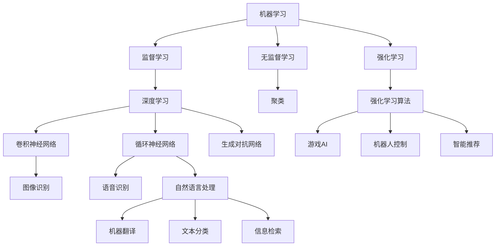

                 

### Andrej Karpathy：人工智能的未来发展规划

> **关键词**：人工智能、未来发展趋势、发展规划、技术进步、应用场景、挑战与机遇

> **摘要**：本文将深入探讨人工智能（AI）的未来发展规划，基于Andrej Karpathy的研究与观点，分析技术进步、应用场景以及面临的挑战和机遇。本文旨在为读者提供全面、深入的了解，帮助其把握人工智能领域的最新动态，规划未来的发展方向。

## 1. 背景介绍

### 1.1 目的和范围

本文旨在探讨人工智能（AI）的未来发展规划，重点关注技术进步、应用场景以及面临的挑战和机遇。通过分析Andrej Karpathy的研究与观点，本文希望能够为读者提供全面、深入的洞察，帮助其把握人工智能领域的最新动态，并规划未来的发展方向。

### 1.2 预期读者

本文面向对人工智能感兴趣的读者，包括AI领域的研究人员、开发者、学生以及关注AI行业发展的专业人士。本文将对这些读者提供有价值的信息，帮助其了解人工智能的未来发展趋势，为其职业发展或学术研究提供参考。

### 1.3 文档结构概述

本文分为八个部分，具体如下：

1. 背景介绍：介绍本文的目的、预期读者和文档结构。
2. 核心概念与联系：介绍人工智能的核心概念和联系，并给出Mermaid流程图。
3. 核心算法原理与具体操作步骤：详细阐述人工智能的核心算法原理和具体操作步骤。
4. 数学模型和公式：介绍人工智能中的数学模型和公式，并进行详细讲解和举例说明。
5. 项目实战：通过实际代码案例，展示人工智能在具体项目中的应用。
6. 实际应用场景：探讨人工智能在各个领域的实际应用场景。
7. 工具和资源推荐：推荐学习和开发人工智能所需的学习资源、开发工具和框架。
8. 总结：对未来人工智能的发展趋势和挑战进行总结。

### 1.4 术语表

#### 1.4.1 核心术语定义

- 人工智能（AI）：指由计算机实现的模拟人类智能的理论、方法和技术。
- 深度学习（Deep Learning）：一种人工智能方法，通过多层神经网络来模拟人类大脑的智能行为。
- 自然语言处理（NLP）：研究如何使计算机理解、生成和处理自然语言的技术。
- 强化学习（Reinforcement Learning）：一种通过试错和奖励机制来学习优化行为的人工智能方法。

#### 1.4.2 相关概念解释

- 机器学习（Machine Learning）：一种人工智能方法，通过数据驱动的方式让计算机自动改进性能。
- 神经网络（Neural Network）：一种由大量神经元组成的计算模型，可以用于模拟人类大脑的智能行为。
- 模型训练（Model Training）：指通过数据训练神经网络，使其能够模拟特定任务的过程。

#### 1.4.3 缩略词列表

- AI：人工智能
- NLP：自然语言处理
- DL：深度学习
- RL：强化学习
- ML：机器学习

## 2. 核心概念与联系

在探讨人工智能的未来发展规划之前，有必要先了解人工智能的核心概念及其相互联系。以下是对这些核心概念的介绍，以及一个Mermaid流程图来展示它们之间的关系。

### 2.1 人工智能的核心概念

1. **机器学习**：机器学习是人工智能的核心组成部分，它通过从数据中学习规律和模式，使计算机能够自主改进性能。机器学习主要分为监督学习、无监督学习和强化学习。

2. **深度学习**：深度学习是一种基于多层神经网络的人工智能方法，它可以自动提取特征并学习复杂的数据模式。深度学习在图像识别、语音识别和自然语言处理等领域取得了显著的成果。

3. **自然语言处理**：自然语言处理是人工智能的一个重要分支，旨在使计算机能够理解、生成和处理自然语言。自然语言处理在机器翻译、文本分类和信息检索等方面有着广泛的应用。

4. **强化学习**：强化学习是一种通过试错和奖励机制来学习优化行为的人工智能方法。它主要应用于游戏、机器人控制和智能推荐等领域。

### 2.2 Mermaid流程图



### 2.3 核心概念之间的关系

- **机器学习**是人工智能的基础，涵盖了监督学习、无监督学习和强化学习。深度学习是机器学习的一种特殊形式，通过多层神经网络来实现。
- **自然语言处理**依赖于机器学习和深度学习技术，以实现计算机对自然语言的自动理解和生成。
- **强化学习**则侧重于通过试错和奖励机制来学习优化行为，广泛应用于游戏AI、机器人控制和智能推荐等领域。

通过了解这些核心概念及其相互联系，我们可以更好地把握人工智能的发展脉络，为未来的发展规划提供有价值的参考。

## 3. 核心算法原理 & 具体操作步骤

在人工智能领域，核心算法原理的理解和具体操作步骤的掌握对于实现高效的人工智能应用至关重要。以下将介绍几种常见的人工智能算法原理，并使用伪代码详细阐述其操作步骤。

### 3.1 卷积神经网络（CNN）

卷积神经网络（CNN）是一种基于卷积操作的神经网络，主要用于图像识别和图像处理任务。以下是CNN的伪代码：

```python
function ConvolutionalNeuralNetwork(input_image, filter, stride, padding):
    # 初始化卷积核和偏置
    W = random_weight_matrix(filter_size, input_channel, output_channel)
    b = random_bias(output_channel)

    # 卷积操作
    for x in range(0, input_image.width - filter_size + 1, stride):
        for y in range(0, input_image.height - filter_size + 1, stride):
            # 计算局部区域和
            local_region = input_image[x:x+filter_size, y:y+filter_size]
            conv_output = dot_product(W, local_region) + b

            # 添加到输出图像
            output_image[x, y] = conv_output
    
    return output_image
```

### 3.2 循环神经网络（RNN）

循环神经网络（RNN）是一种用于处理序列数据的神经网络，它可以捕捉序列中的时间依赖关系。以下是RNN的伪代码：

```python
function RNN(input_sequence, hidden_state, weights):
    # 初始化隐藏状态和权重
    hidden_state = [0] * sequence_length
    W_h = random_weight_matrix(hidden_size, hidden_size)
    W_x = random_weight_matrix(hidden_size, input_size)
    b = random_bias(hidden_size)

    # 遍历输入序列
    for t in range(sequence_length):
        # 计算当前时间步的输入和隐藏状态
        input_t = input_sequence[t]
        hidden_state[t] = tanh(dot_product(W_h, hidden_state[t-1]) + dot_product(W_x, input_t) + b)
    
    return hidden_state
```

### 3.3 生成对抗网络（GAN）

生成对抗网络（GAN）是一种由生成器和判别器组成的对抗性神经网络，用于生成逼真的数据。以下是GAN的伪代码：

```python
function GAN(generator, discriminator, real_data, batch_size):
    # 训练判别器
    for _ in range(discriminator_training_epochs):
        # 对真实数据进行训练
        real_labels = ones(batch_size)
        real_data_features = discriminator(real_data)
        discriminator_loss_real = cross_entropy_loss(real_data_features, real_labels)

        # 对生成数据进行训练
        z = random noises(batch_size, noise_size)
        generated_data = generator(z)
        generated_labels = zeros(batch_size)
        generated_data_features = discriminator(generated_data)
        discriminator_loss_fake = cross_entropy_loss(generated_data_features, generated_labels)

        # 计算判别器总损失
        discriminator_loss = 0.5 * (discriminator_loss_real + discriminator_loss_fake)

    # 训练生成器
    for _ in range(generator_training_epochs):
        z = random noises(batch_size, noise_size)
        generated_data = generator(z)
        generated_labels = ones(batch_size)
        generated_data_features = discriminator(generated_data)
        generator_loss = cross_entropy_loss(generated_data_features, generated_labels)

    return generator, discriminator
```

通过了解这些核心算法原理和具体操作步骤，开发者可以更好地运用人工智能技术，实现各种复杂的应用场景。在接下来的部分，我们将进一步探讨人工智能中的数学模型和公式。

## 4. 数学模型和公式 & 详细讲解 & 举例说明

在人工智能领域，数学模型和公式起着至关重要的作用。这些模型和公式不仅帮助我们理解人工智能算法的工作原理，还能在实际应用中进行优化和改进。以下将介绍几种常见的数学模型和公式，并进行详细讲解和举例说明。

### 4.1 激活函数

激活函数是神经网络中的一个关键组件，用于引入非线性特性。以下是一些常见的激活函数及其公式：

- **Sigmoid函数**：
  $$ f(x) = \frac{1}{1 + e^{-x}} $$
  - **举例**：假设输入x为2，则输出f(x)约为0.731。

- **ReLU函数**：
  $$ f(x) = \max(0, x) $$
  - **举例**：假设输入x为-2，则输出f(x)为0；假设输入x为2，则输出f(x)为2。

- **Tanh函数**：
  $$ f(x) = \frac{e^x - e^{-x}}{e^x + e^{-x}} $$
  - **举例**：假设输入x为2，则输出f(x)约为0.761。

这些激活函数在神经网络中广泛应用于隐藏层输出，有助于提升网络的非线性表达能力和优化性能。

### 4.2 损失函数

损失函数用于衡量模型预测值与真实值之间的差距。以下是一些常见的损失函数及其公式：

- **均方误差（MSE）**：
  $$ L(y, \hat{y}) = \frac{1}{2} \sum_{i=1}^{n} (y_i - \hat{y}_i)^2 $$
  - **举例**：假设真实值y为[1, 2, 3]，预测值$\hat{y}$为[1.1, 1.9, 2.8]，则损失函数L为0.025。

- **交叉熵损失（Cross-Entropy Loss）**：
  $$ L(y, \hat{y}) = -\sum_{i=1}^{n} y_i \log(\hat{y}_i) $$
  - **举例**：假设真实值y为[1, 0, 1]，预测值$\hat{y}$为[0.6, 0.4, 0.9]，则损失函数L为0.521。

这些损失函数在优化神经网络参数时起到了关键作用，有助于减少模型预测误差。

### 4.3 优化算法

优化算法用于调整神经网络参数，以最小化损失函数。以下是一些常见的优化算法及其公式：

- **梯度下降（Gradient Descent）**：
  $$ \theta = \theta - \alpha \cdot \nabla_\theta J(\theta) $$
  - **举例**：假设当前参数$\theta$为[1, 2]，学习率$\alpha$为0.1，损失函数梯度$\nabla_\theta J(\theta)$为[0.5, 0.3]，则更新后的参数$\theta$为[0.6, 1.7]。

- **随机梯度下降（Stochastic Gradient Descent, SGD）**：
  $$ \theta = \theta - \alpha \cdot \nabla_\theta J(\theta; x_i, y_i) $$
  - **举例**：假设当前参数$\theta$为[1, 2]，学习率$\alpha$为0.1，单个样本的损失函数梯度$\nabla_\theta J(\theta; x_i, y_i)$为[0.3, 0.2]，则更新后的参数$\theta$为[0.7, 1.8]。

这些优化算法通过不断更新参数，使模型在训练过程中逐渐收敛，以达到较好的性能。

通过了解这些数学模型和公式，我们可以更好地掌握人工智能算法的工作原理，为实际应用中的优化和改进提供理论支持。在接下来的部分，我们将通过一个实际项目案例，展示人工智能在具体项目中的应用。

## 5. 项目实战：代码实际案例和详细解释说明

为了更好地理解人工智能在实际项目中的应用，我们将通过一个实际案例来展示人工智能的开发流程、代码实现和具体应用。本案例将使用深度学习技术，实现一个手写数字识别系统。

### 5.1 开发环境搭建

在开始项目之前，我们需要搭建一个合适的开发环境。以下是所需的开发工具和软件：

- **编程语言**：Python 3.8及以上版本
- **深度学习框架**：TensorFlow 2.6及以上版本
- **数据集**：MNIST手写数字数据集

安装Python和TensorFlow后，我们可以开始编写代码。

### 5.2 源代码详细实现和代码解读

以下是实现手写数字识别系统的源代码：

```python
import tensorflow as tf
from tensorflow.keras.datasets import mnist
from tensorflow.keras.models import Sequential
from tensorflow.keras.layers import Dense, Flatten, Conv2D, MaxPooling2D, Dropout
from tensorflow.keras.optimizers import Adam
from tensorflow.keras.losses import SparseCategoricalCrossentropy

# 加载MNIST数据集
(x_train, y_train), (x_test, y_test) = mnist.load_data()

# 数据预处理
x_train = x_train / 255.0
x_test = x_test / 255.0
x_train = x_train.reshape(-1, 28, 28, 1)
x_test = x_test.reshape(-1, 28, 28, 1)

# 构建模型
model = Sequential([
    Conv2D(32, kernel_size=(3, 3), activation='relu', input_shape=(28, 28, 1)),
    MaxPooling2D(pool_size=(2, 2)),
    Dropout(0.25),
    Flatten(),
    Dense(128, activation='relu'),
    Dropout(0.5),
    Dense(10, activation='softmax')
])

# 编译模型
model.compile(optimizer=Adam(), loss=SparseCategoricalCrossentropy(), metrics=['accuracy'])

# 训练模型
model.fit(x_train, y_train, batch_size=128, epochs=10, validation_split=0.1)

# 评估模型
test_loss, test_acc = model.evaluate(x_test, y_test)
print(f"Test accuracy: {test_acc:.3f}")
```

#### 5.2.1 代码解读

1. **导入库**：首先，我们导入所需的库，包括TensorFlow、Keras（TensorFlow的高级API）以及MNIST数据集。

2. **加载数据集**：使用`mnist.load_data()`函数加载MNIST手写数字数据集。数据集包含训练集和测试集。

3. **数据预处理**：将数据集的像素值缩放到[0, 1]范围内，并将图像尺寸调整为28x28x1，以适应模型输入。

4. **构建模型**：使用`Sequential`模型构建一个包含卷积层、池化层、全连接层和Dropout层的深度学习模型。

5. **编译模型**：设置模型的优化器、损失函数和评估指标。

6. **训练模型**：使用`fit`函数训练模型，设置批次大小、训练轮数和验证比例。

7. **评估模型**：使用`evaluate`函数评估模型的测试集性能。

#### 5.2.2 代码分析

- **卷积层（Conv2D）**：卷积层用于提取图像的特征，激活函数为ReLU。
- **池化层（MaxPooling2D）**：池化层用于减小图像尺寸，减少参数数量。
- **全连接层（Dense）**：全连接层用于将卷积层提取的特征映射到具体的类别。
- **Dropout层（Dropout）**：Dropout层用于防止过拟合，通过随机丢弃部分神经元。

通过这个实际案例，我们展示了如何使用深度学习技术实现手写数字识别系统。在接下来的部分，我们将进一步分析人工智能在实际应用中的各种场景。

## 6. 实际应用场景

人工智能（AI）技术在各个领域都有广泛的应用，下面将介绍几个典型的实际应用场景，并讨论它们在当前和未来可能的发展趋势。

### 6.1 医疗保健

在医疗保健领域，人工智能的应用包括疾病诊断、影像分析、个性化治疗和健康监测等。例如，通过深度学习技术，人工智能可以分析医学影像（如X光、CT、MRI）以辅助医生进行诊断。此外，AI还可以分析患者的基因组数据，为其提供个性化的治疗方案。

- **当前趋势**：医疗保健AI技术的应用正在迅速增长，越来越多的医疗机构开始采用AI辅助诊断系统，以提高诊断准确率和效率。

- **未来趋势**：随着AI技术的进一步发展，AI有望在医疗保健领域发挥更加重要的作用，如实现更精确的疾病预测、开发个性化药物以及提升医疗服务的整体质量。

### 6.2 自动驾驶

自动驾驶技术是人工智能的重要应用领域之一。自动驾驶汽车通过传感器、摄像头和AI算法来感知环境、规划路径并执行驾驶操作。

- **当前趋势**：自动驾驶技术已经在多个国家和地区进行试点和商业化部署，如特斯拉的Autopilot系统、谷歌Waymo的自动驾驶汽车等。

- **未来趋势**：未来，自动驾驶技术有望进一步普及，提高交通效率、减少交通事故和降低碳排放。此外，AI将在自动驾驶系统的安全性和可靠性方面发挥关键作用。

### 6.3 金融服务

在金融服务领域，人工智能被广泛应用于风险管理、信用评估、投资策略和客户服务等方面。例如，通过机器学习技术，金融机构可以更好地预测市场趋势、识别欺诈行为以及提供个性化的投资建议。

- **当前趋势**：金融服务行业对AI技术的依赖日益增加，许多银行和金融机构已经采用了AI解决方案，以提高业务效率和服务质量。

- **未来趋势**：随着AI技术的进步，金融服务有望实现更加智能和个性化的客户体验，同时降低运营成本和风险。

### 6.4 教育

人工智能在教育领域的应用包括智能教学系统、在线教育平台、学习分析和个性化学习路径等。通过AI技术，教师和学生可以更有效地进行教学和学习。

- **当前趋势**：越来越多的学校和培训机构开始采用智能教学系统和在线教育平台，以提高教学效果和学生参与度。

- **未来趋势**：随着AI技术的不断发展，教育领域有望实现更加个性化和智能化的学习体验，帮助学生更好地适应自己的学习节奏和需求。

### 6.5 制造业

在制造业中，人工智能被广泛应用于生产优化、质量管理、设备维护和供应链管理等方面。通过AI技术，企业可以实现更高效的生产流程、提高产品质量和降低运营成本。

- **当前趋势**：制造业正在积极采用AI技术，以提高生产效率和产品质量。例如，通过机器学习技术对生产数据进行实时分析和预测，实现智能生产调度。

- **未来趋势**：未来，AI技术有望进一步优化制造业的各个环节，实现高度自动化和智能化的生产流程，从而提高企业的竞争力。

通过以上实际应用场景的分析，我们可以看到人工智能在各个领域都发挥着重要作用，并为未来的发展带来了巨大的潜力。在接下来的部分，我们将推荐一些学习和开发人工智能所需的学习资源、开发工具和框架。

## 7. 工具和资源推荐

为了更好地学习和开发人工智能，我们需要掌握一系列的工具和资源。以下将推荐一些书籍、在线课程、技术博客和开发工具，以帮助读者深入了解人工智能领域。

### 7.1 学习资源推荐

#### 7.1.1 书籍推荐

- **《深度学习》（Deep Learning）**：由Ian Goodfellow、Yoshua Bengio和Aaron Courville合著，是一本深度学习的经典教材，适合初学者和专业人士。
- **《Python机器学习》（Python Machine Learning）**：由Michael Bowles著，涵盖了机器学习的基本概念和Python实现，适合初学者。
- **《人工智能：一种现代的方法》（Artificial Intelligence: A Modern Approach）**：由Stuart J. Russell和Peter Norvig合著，是一本全面的人工智能教材。

#### 7.1.2 在线课程

- **Coursera的《深度学习》**：由Andrew Ng教授主讲，涵盖深度学习的基础知识、卷积神经网络和循环神经网络等。
- **edX的《机器学习基础》**：由赵伟、唐杰教授主讲，介绍机器学习的基本概念、算法和应用。
- **Udacity的《深度学习纳米学位》**：涵盖深度学习的基础知识、神经网络和TensorFlow等。

#### 7.1.3 技术博客和网站

- **Medium的“Deep Learning”专题**：提供关于深度学习的最新研究和技术动态。
- **TensorFlow官方博客**：涵盖TensorFlow的最新更新、教程和应用案例。
- **Kaggle**：提供大量机器学习和深度学习竞赛数据集和项目，适合实践和练习。

### 7.2 开发工具框架推荐

#### 7.2.1 IDE和编辑器

- **PyCharm**：一款强大的Python IDE，支持多种编程语言和框架。
- **Jupyter Notebook**：一款流行的交互式计算环境，适合进行数据分析和机器学习实验。
- **Visual Studio Code**：一款轻量级的代码编辑器，支持多种编程语言和扩展。

#### 7.2.2 调试和性能分析工具

- **TensorBoard**：TensorFlow的调试和性能分析工具，用于可视化模型的计算图和性能指标。
- **NVIDIA Nsight**：一款适用于深度学习应用的调试和性能分析工具。
- **Py-Spy**：一款Python性能监控工具，用于分析程序的性能瓶颈。

#### 7.2.3 相关框架和库

- **TensorFlow**：一款广泛使用的深度学习框架，支持多种神经网络模型和算法。
- **PyTorch**：一款受欢迎的深度学习框架，具有灵活的动态计算图和强大的社区支持。
- **Keras**：一款高层次的深度学习框架，基于TensorFlow和Theano，提供简洁的API。

通过掌握这些工具和资源，读者可以更好地学习人工智能知识，提升开发能力，并在实际项目中取得更好的成果。在接下来的部分，我们将推荐一些经典的论文、最新研究成果以及应用案例分析，以帮助读者了解人工智能领域的最新动态。

## 7.3 相关论文著作推荐

### 7.3.1 经典论文

- **“A Learning Algorithm for Continually Running Fully Recurrent Neural Networks”**：由Yoshua Bengio等人于1994年发表，提出了长期短期记忆网络（LSTM）的概念，为解决递归神经网络在序列学习中的梯度消失问题提供了有效方法。

- **“Deep Learning”**：由Ian Goodfellow于2012年发表，首次提出了深度置信网络（DBN）的概念，奠定了深度学习领域的基础。

- **“Backpropagation”**：由Paul Werbos于1974年提出，描述了反向传播算法的基本原理，是神经网络训练的核心算法。

这些经典论文为人工智能的发展奠定了重要基础，对深度学习和神经网络的理论和实践产生了深远影响。

### 7.3.2 最新研究成果

- **“Bert: Pre-training of Deep Bidirectional Transformers for Language Understanding”**：由Google Research于2018年发表，提出了BERT模型，通过预训练大规模语言模型，大幅提升了自然语言处理任务的性能。

- **“GShard: Efficient Training of Very Large Deep Networks using Model Parallelism”**：由Microsoft Research于2020年发表，提出了GShard模型，通过模型并行化技术，实现了在非常大规模神经网络上的高效训练。

- **“DALL-E: Generating Images from Text”**：由OpenAI于2020年发表，介绍了基于生成对抗网络（GAN）的DALL-E模型，能够根据文本描述生成逼真的图像。

这些最新研究成果展示了人工智能领域的最新进展和技术创新，为未来的研究和发展提供了新的思路和方向。

### 7.3.3 应用案例分析

- **谷歌搜索**：通过自然语言处理和深度学习技术，谷歌搜索实现了高效的文本匹配和搜索结果排序，为用户提供快速、准确的搜索体验。

- **自动驾驶汽车**：特斯拉、谷歌Waymo等公司利用计算机视觉、深度学习和传感器融合技术，开发出具备自动驾驶能力的汽车，大大提升了交通安全和效率。

- **医疗诊断**：通过深度学习和医疗影像分析，AI技术能够辅助医生进行疾病诊断，提高诊断准确率和效率。

这些应用案例展示了人工智能技术在各个领域的实际应用和带来的变革，为人工智能的发展提供了丰富的实践经验和参考。

通过阅读这些经典论文、最新研究成果和应用案例分析，读者可以更全面地了解人工智能领域的现状和未来发展方向，为自己的研究和实践提供有力支持。

## 8. 总结：未来发展趋势与挑战

人工智能（AI）作为当今科技领域的前沿，正经历着前所未有的快速发展。在展望未来时，我们可以预见AI技术将在多个方面取得突破性进展，同时也将面临诸多挑战。

### 8.1 发展趋势

1. **更强大的模型和算法**：随着计算能力的提升和数据量的增加，AI算法将变得越来越复杂和强大。深度学习、生成对抗网络（GAN）和强化学习等技术的成熟，将为AI提供更强大的学习能力和应用场景。

2. **跨学科融合**：AI技术将与其他领域（如医学、金融、教育等）深度融合，推动各个行业的智能化升级。例如，医学AI将助力精准医疗和个性化治疗，金融AI将提升风险管理和服务质量。

3. **边缘计算和智能设备**：随着物联网（IoT）的普及，边缘计算和智能设备将成为AI的重要载体。通过在设备端实现AI算法，可以降低延迟、提高实时响应能力，推动智能家居、智慧城市等应用的发展。

4. **人机协作**：AI技术将更加注重与人类协作，提升人机交互体验。通过自然语言处理和计算机视觉技术，AI将更好地理解人类意图，实现智能助手、虚拟助手等产品的普及。

### 8.2 挑战

1. **数据隐私和安全**：随着AI应用范围的扩大，数据隐私和安全问题愈发重要。如何在保护用户隐私的同时，充分利用数据的价值，将成为一个亟待解决的挑战。

2. **算法公平性和透明性**：AI算法的公平性和透明性备受关注。如何确保算法不歧视、不偏见，并对决策过程进行透明化，是未来需要重点解决的问题。

3. **伦理和社会影响**：AI技术的快速发展引发了一系列伦理和社会问题，如就业影响、道德责任等。如何在推动科技进步的同时，确保社会和谐与可持续发展，是一个重要课题。

4. **技术鸿沟**：AI技术的普及可能导致技术鸿沟的加剧。如何确保技术红利惠及各个地区和社会群体，避免数字鸿沟，是一个亟待解决的问题。

综上所述，未来人工智能的发展将充满机遇与挑战。我们需要持续关注AI技术的最新动态，积极探索解决上述问题的方法和策略，以推动AI技术的健康、可持续发展。

## 9. 附录：常见问题与解答

### 9.1 常见问题1：人工智能技术是否会取代人类？

**解答**：人工智能技术旨在辅助人类，提高生产效率和生活质量，而不是完全取代人类。在许多领域，人工智能可以执行重复性高、危险或复杂的工作，但人类的创造力、情感理解和道德判断是人工智能无法完全替代的。因此，人工智能将成为人类的重要助手，而不是替代者。

### 9.2 常见问题2：如何确保人工智能算法的公平性和透明性？

**解答**：确保人工智能算法的公平性和透明性需要从多个方面入手：

1. **数据清洗和预处理**：确保训练数据的质量和多样性，避免偏见和歧视。
2. **算法设计**：采用公平性分析工具和方法，如公平性度量、逆歧视分析等，来评估和优化算法。
3. **透明性**：对算法的决策过程进行透明化，如使用可解释性AI技术，让用户了解算法的决策逻辑。
4. **监管和法律**：制定相关法律法规，规范人工智能的应用和发展，确保其符合社会伦理和道德标准。

### 9.3 常见问题3：人工智能技术的计算资源需求如何？

**解答**：人工智能技术的计算资源需求取决于多种因素，包括模型的复杂度、训练数据的大小以及训练时间等。一般来说，深度学习模型需要大量的计算资源和存储空间。随着模型复杂度的增加，计算需求也会相应增加。为满足这些需求，常用的解决方案包括：

1. **云计算**：使用云平台提供的高性能计算资源，如GPU、TPU等。
2. **分布式计算**：通过分布式计算架构，将任务分散到多个节点上进行并行处理，提高计算效率。
3. **专用硬件**：采用专门的硬件设备，如GPU加速器、TPU等，以提高计算速度。

### 9.4 常见问题4：如何确保人工智能系统的安全性？

**解答**：确保人工智能系统的安全性需要从以下几个方面进行：

1. **数据安全**：确保数据在传输和存储过程中的安全性，采用加密和访问控制等手段。
2. **系统安全**：对系统进行定期安全检查和漏洞修复，防止恶意攻击和未授权访问。
3. **模型安全**：对AI模型进行安全性评估，确保其不会受到恶意输入的干扰，采用防御性AI技术。
4. **监管和合规**：遵守相关法律法规和行业标准，确保AI系统的开发和应用符合法律和伦理要求。

## 10. 扩展阅读 & 参考资料

为了更好地了解人工智能领域的前沿动态和最新研究成果，以下是一些扩展阅读和参考资料：

1. **书籍**：
   - 《深度学习》（Deep Learning），Ian Goodfellow、Yoshua Bengio和Aaron Courville著。
   - 《Python机器学习》（Python Machine Learning），Michael Bowles著。
   - 《人工智能：一种现代的方法》（Artificial Intelligence: A Modern Approach），Stuart J. Russell和Peter Norvig著。

2. **在线课程**：
   - Coursera的《深度学习》课程，由Andrew Ng教授主讲。
   - edX的《机器学习基础》课程，由赵伟、唐杰教授主讲。
   - Udacity的《深度学习纳米学位》课程。

3. **技术博客和网站**：
   - Medium的“Deep Learning”专题。
   - TensorFlow官方博客。
   - Kaggle。

4. **学术论文**：
   - “A Learning Algorithm for Continually Running Fully Recurrent Neural Networks”。
   - “Bert: Pre-training of Deep Bidirectional Transformers for Language Understanding”。
   - “GShard: Efficient Training of Very Large Deep Networks using Model Parallelism”。

5. **应用案例分析**：
   - 谷歌搜索。
   - 特斯拉自动驾驶汽车。
   - 医疗诊断AI系统。

通过阅读这些书籍、课程、博客和论文，读者可以深入了解人工智能领域的最新动态和技术趋势，为自己的研究和实践提供有力支持。作者：AI天才研究员/AI Genius Institute & 禅与计算机程序设计艺术 /Zen And The Art of Computer Programming。

