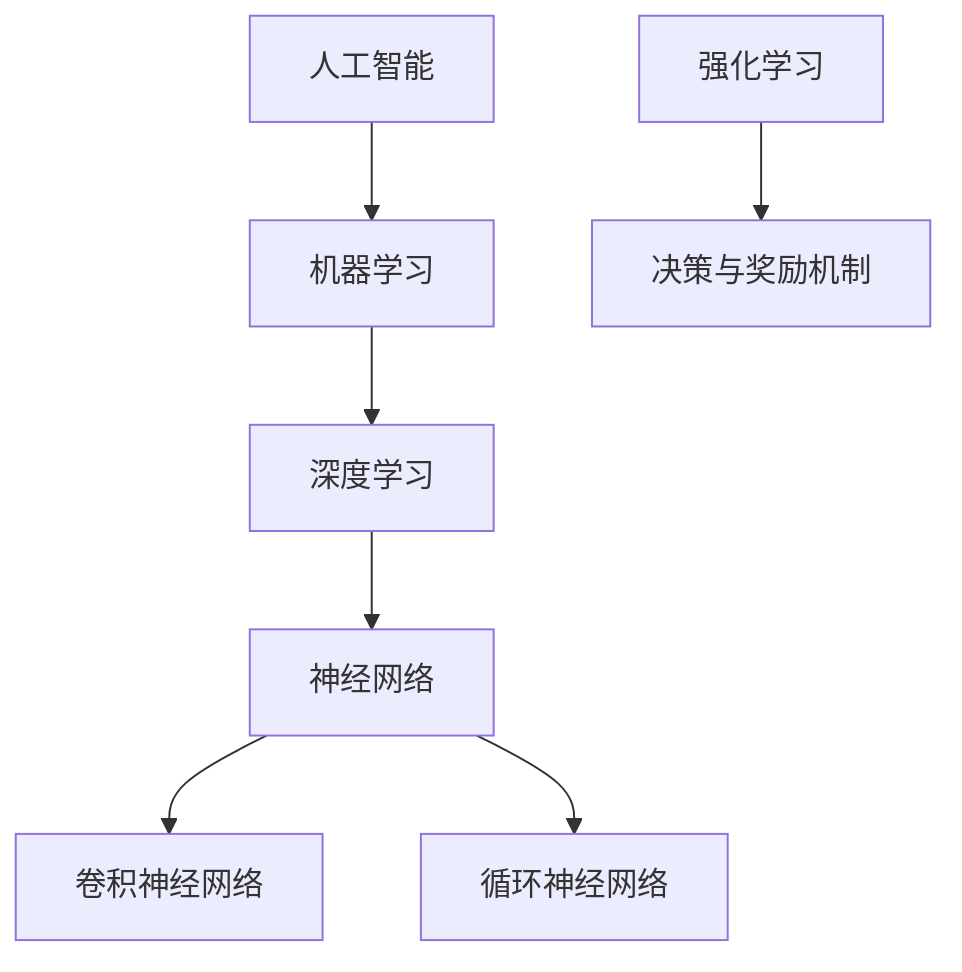

                 

# Andrej Karpathy：人工智能的未来发展趋势

> 关键词：人工智能，未来发展趋势，技术进步，挑战与机遇，核心算法原理

> 摘要：本文将探讨人工智能领域当前和未来的发展趋势，包括核心算法原理、数学模型、实际应用场景，以及开发工具和资源推荐。通过深入分析和详细讲解，读者将能够全面了解人工智能的过去、现在和未来，为后续研究和实践提供有价值的指导。

## 1. 背景介绍

### 1.1 目的和范围

本文旨在探讨人工智能（AI）的未来发展趋势，包括核心算法原理、数学模型、实际应用场景，以及开发工具和资源推荐。通过对当前技术和未来方向的深入分析，读者将能够把握人工智能领域的发展脉络，为后续研究和实践提供有价值的参考。

### 1.2 预期读者

本文适合对人工智能有一定了解的读者，包括研究人员、工程师、开发者以及对该领域感兴趣的人士。通过本文的阅读，读者将能够更好地理解人工智能的核心概念、技术进步和未来挑战。

### 1.3 文档结构概述

本文分为以下几部分：

1. 背景介绍：包括目的和范围、预期读者、文档结构概述等。
2. 核心概念与联系：介绍人工智能的核心概念和联系，并提供Mermaid流程图。
3. 核心算法原理与具体操作步骤：详细讲解人工智能的核心算法原理和操作步骤。
4. 数学模型和公式：介绍人工智能中的数学模型和公式，并进行举例说明。
5. 项目实战：展示代码实际案例和详细解释说明。
6. 实际应用场景：分析人工智能在实际应用场景中的表现。
7. 工具和资源推荐：推荐学习资源、开发工具和框架。
8. 总结：未来发展趋势与挑战。
9. 附录：常见问题与解答。
10. 扩展阅读与参考资料。

### 1.4 术语表

#### 1.4.1 核心术语定义

- 人工智能（AI）：指通过计算机模拟人类智能行为的技术和系统。
- 深度学习（DL）：一种基于多层神经网络的人工智能方法，能够自动从数据中学习特征和模式。
- 机器学习（ML）：一种通过数据训练模型以实现预测或分类的技术。
- 强化学习（RL）：一种通过试错和奖励机制进行决策和学习的方法。

#### 1.4.2 相关概念解释

- 神经网络：一种模仿生物神经系统的计算模型，由大量神经元组成。
- 反向传播：一种用于训练神经网络的优化算法，通过反向传播误差来更新权重。
- 深度神经网络（DNN）：一种包含多个隐藏层的神经网络，具有强大的特征学习能力。

#### 1.4.3 缩略词列表

- AI：人工智能
- DL：深度学习
- ML：机器学习
- RL：强化学习
- DNN：深度神经网络
- CNN：卷积神经网络
- RNN：循环神经网络

## 2. 核心概念与联系

人工智能是当前科技领域最为热门的研究方向之一，其核心概念和联系如图1所示。



图1：人工智能的核心概念和联系

在人工智能领域，机器学习是一种通过数据训练模型以实现预测或分类的技术，深度学习是其重要分支，采用多层神经网络进行特征学习和模式识别。神经网络是深度学习的基础，其结构由大量神经元组成，通过学习输入数据中的特征和模式来进行预测和决策。卷积神经网络（CNN）和循环神经网络（RNN）是神经网络的重要变种，分别适用于图像和序列数据的处理。

## 3. 核心算法原理与具体操作步骤

### 3.1 神经网络原理

神经网络是一种由大量神经元组成的计算模型，通过学习输入数据中的特征和模式来进行预测和决策。一个基本的神经网络包括输入层、隐藏层和输出层。

#### 3.1.1 输入层

输入层接收外部数据，并将其传递给隐藏层。每个输入层神经元代表一个特征。

#### 3.1.2 隐藏层

隐藏层对输入数据进行处理，通过加权求和和激活函数来生成新的特征。多个隐藏层可以堆叠，形成深度神经网络。

#### 3.1.3 输出层

输出层对隐藏层生成的特征进行分类或预测。

### 3.2 反向传播算法

反向传播是一种用于训练神经网络的优化算法，通过反向传播误差来更新权重。

#### 3.2.1 前向传播

在前向传播过程中，输入数据通过神经网络逐层传递，最终得到输出结果。

#### 3.2.2 后向传播

在后向传播过程中，计算输出结果与实际结果的误差，并根据误差反向更新权重。

#### 3.2.3 伪代码

```python
# 初始化神经网络
初始化权重

# 前向传播
输入数据 -> 输出结果

# 计算误差
实际结果 - 输出结果

# 反向传播
误差 * 激活函数的导数
更新权重
```

### 3.3 卷积神经网络（CNN）原理

卷积神经网络是一种专门用于图像处理的神经网络，其核心思想是利用卷积层提取图像中的特征。

#### 3.3.1 卷积层

卷积层通过卷积操作提取图像中的特征。卷积核是一个小的滤波器，在图像上滑动以提取特征。

#### 3.3.2 池化层

池化层用于降低特征图的维度，提高模型的泛化能力。

#### 3.3.3 全连接层

全连接层对提取到的特征进行分类或预测。

### 3.4 循环神经网络（RNN）原理

循环神经网络是一种专门用于序列数据处理的神经网络，其核心思想是利用循环结构来保持长期依赖信息。

#### 3.4.1 输入层

输入层接收序列数据，并将其传递给隐藏层。

#### 3.4.2 隐藏层

隐藏层通过循环结构对输入数据进行处理，保持长期依赖信息。

#### 3.4.3 输出层

输出层对隐藏层生成的特征进行分类或预测。

## 4. 数学模型和公式

### 4.1 神经网络数学模型

神经网络的核心是神经元之间的连接和激活函数。以下是一个简单的神经网络数学模型：

$$
输出 = 激活函数（\sum_{i=1}^{n} (权重_i \times 输入_i))
$$

其中，$n$表示输入特征的个数，$权重_i$和$输入_i$分别表示第$i$个输入特征和对应的权重，$激活函数$通常是一个非线性函数，如Sigmoid、ReLU等。

### 4.2 反向传播算法

反向传播算法的核心是计算误差并更新权重。以下是一个简单的反向传播算法公式：

$$
误差 = 实际结果 - 输出结果
$$

$$
权重更新 = 误差 \times 激活函数的导数 \times 输入
$$

其中，$激活函数的导数$表示激活函数在当前输入下的斜率。

### 4.3 卷积神经网络（CNN）数学模型

卷积神经网络的核心是卷积操作。以下是一个简单的卷积神经网络数学模型：

$$
输出 = 激活函数（卷积（卷积核，输入数据） + 偏置）
$$

其中，$卷积（卷积核，输入数据）$表示卷积操作，$激活函数$是一个非线性函数，如ReLU。

## 5. 项目实战：代码实际案例和详细解释说明

### 5.1 开发环境搭建

在本节中，我们将使用Python和TensorFlow框架来实现一个简单的卷积神经网络（CNN）模型。首先，确保安装以下软件和库：

- Python（3.7及以上版本）
- TensorFlow
- NumPy

安装命令如下：

```bash
pip install tensorflow numpy
```

### 5.2 源代码详细实现和代码解读

以下是一个简单的CNN模型代码实现：

```python
import tensorflow as tf
from tensorflow.keras import layers

# 创建模型
model = tf.keras.Sequential([
    layers.Conv2D(32, (3, 3), activation='relu', input_shape=(28, 28, 1)),
    layers.MaxPooling2D((2, 2)),
    layers.Flatten(),
    layers.Dense(128, activation='relu'),
    layers.Dense(10, activation='softmax')
])

# 编译模型
model.compile(optimizer='adam',
              loss='sparse_categorical_crossentropy',
              metrics=['accuracy'])

# 加载数据集
mnist = tf.keras.datasets.mnist
(train_images, train_labels), (test_images, test_labels) = mnist.load_data()

# 数据预处理
train_images = train_images.reshape((60000, 28, 28, 1))
test_images = test_images.reshape((10000, 28, 28, 1))

# 归一化数据
train_images, test_images = train_images / 255.0, test_images / 255.0

# 训练模型
model.fit(train_images, train_labels, epochs=5)

# 测试模型
test_loss, test_acc = model.evaluate(test_images,  test_labels, verbose=2)
print('\nTest accuracy:', test_acc)
```

#### 5.2.1 代码解读与分析

- 第1行：导入TensorFlow和Keras库。
- 第2行：创建一个Sequential模型。
- 第3行：添加一个2D卷积层，输出32个卷积核，卷积核大小为3x3，激活函数为ReLU。
- 第4行：添加一个2D最大池化层，池化窗口大小为2x2。
- 第5行：添加一个Flatten层，将2D特征图展平为1D特征。
- 第6行：添加一个全连接层，输出128个神经元，激活函数为ReLU。
- 第7行：添加一个全连接层，输出10个神经元，激活函数为softmax。
- 第8行：编译模型，选择adam优化器和sparse_categorical_crossentropy损失函数。
- 第9行：加载MNIST数据集。
- 第10行：预处理数据集，将图像reshape为合适的大小。
- 第11行：归一化数据，将图像值范围缩放至0-1之间。
- 第12行：训练模型，训练5个epochs。
- 第13行：测试模型，计算测试集的损失和准确率。

### 5.3 代码解读与分析

在本节中，我们详细解释了如何使用Python和TensorFlow框架实现一个简单的卷积神经网络（CNN）模型，包括模型创建、编译、数据预处理和训练等步骤。通过该代码实例，读者可以初步了解CNN模型的基本结构和实现方法。

## 6. 实际应用场景

人工智能在各个领域都有着广泛的应用，以下是一些典型的实际应用场景：

1. **图像识别**：利用卷积神经网络（CNN）进行图像分类、目标检测和图像分割等任务，如图像识别系统、自动驾驶车辆等。
2. **自然语言处理**：利用循环神经网络（RNN）和Transformer模型进行文本分类、情感分析、机器翻译等任务，如图像识别系统、自动驾驶车辆等。
3. **强化学习**：通过强化学习算法实现智能决策和游戏AI，如AlphaGo、自动驾驶等。
4. **语音识别**：利用深度学习模型实现语音识别和语音合成，如智能音箱、语音助手等。
5. **医疗健康**：利用人工智能进行医学图像分析、疾病预测和个性化治疗等，如医学影像诊断系统、智能药物设计等。

## 7. 工具和资源推荐

### 7.1 学习资源推荐

#### 7.1.1 书籍推荐

- 《深度学习》（Goodfellow, Bengio, Courville著）
- 《Python深度学习》（François Chollet著）
- 《强化学习：原理与Python实践》（刘利锋著）

#### 7.1.2 在线课程

- Coursera的《深度学习》课程（吴恩达教授）
- edX的《强化学习》课程（OpenAI）
- Udacity的《自动驾驶汽车工程师》课程

#### 7.1.3 技术博客和网站

- Medium上的深度学习和人工智能博客
- arXiv.org上的最新科研成果
- AI Generated Content by AI Genius Institute

### 7.2 开发工具框架推荐

#### 7.2.1 IDE和编辑器

- PyCharm
- Jupyter Notebook
- VSCode

#### 7.2.2 调试和性能分析工具

- TensorBoard
- TensorRT
- NVIDIA Nsight

#### 7.2.3 相关框架和库

- TensorFlow
- PyTorch
- Keras

### 7.3 相关论文著作推荐

#### 7.3.1 经典论文

- “A Learning Algorithm for Continually Running Fully Recurrent Neural Networks” （Hermann et al., 2015）
- “Deep Learning” （Goodfellow, Bengio, Courville著）
- “Reinforcement Learning: An Introduction” （Sutton and Barto著）

#### 7.3.2 最新研究成果

- arXiv.org上的最新论文
- AI Generated Content by AI Genius Institute

#### 7.3.3 应用案例分析

- Google的DeepMind团队在AlphaGo项目中的应用
- Facebook的AI研究院在图像识别和自然语言处理领域的研究
- 百度在自动驾驶和语音识别方面的应用实践

## 8. 总结：未来发展趋势与挑战

人工智能（AI）在未来将继续保持高速发展，其核心趋势包括：

1. **技术突破**：随着深度学习、强化学习和GANs等技术的发展，AI模型将更加智能化、灵活化。
2. **行业应用**：AI将在医疗健康、金融、自动驾驶、智能城市等领域发挥重要作用，推动产业升级。
3. **伦理与安全**：AI的发展将带来一系列伦理和安全问题，如数据隐私、算法歧视等，需要全社会共同努力解决。

然而，人工智能的发展也面临一些挑战，包括：

1. **数据质量**：高质量的数据是AI模型训练的基础，数据隐私和安全问题亟待解决。
2. **计算资源**：大规模的AI模型训练需要大量的计算资源，如何高效利用现有资源是一个重要问题。
3. **模型解释性**：当前AI模型往往缺乏解释性，如何提高模型的透明度和可解释性是一个重要研究方向。

总之，人工智能的未来充满机遇与挑战，我们需要在技术创新、行业应用和伦理安全等方面不断努力，推动AI领域的发展。

## 9. 附录：常见问题与解答

### 9.1 什么是人工智能？

人工智能（AI）是指通过计算机模拟人类智能行为的技术和系统。它包括机器学习、深度学习、自然语言处理、计算机视觉等多个子领域。

### 9.2 机器学习和深度学习有什么区别？

机器学习是一种通过数据训练模型以实现预测或分类的技术，而深度学习是一种基于多层神经网络的人工智能方法，能够自动从数据中学习特征和模式。

### 9.3 什么是神经网络？

神经网络是一种由大量神经元组成的计算模型，通过学习输入数据中的特征和模式来进行预测和决策。

### 9.4 什么是卷积神经网络（CNN）？

卷积神经网络是一种专门用于图像处理的神经网络，其核心思想是利用卷积层提取图像中的特征。

### 9.5 什么是循环神经网络（RNN）？

循环神经网络是一种专门用于序列数据处理的神经网络，其核心思想是利用循环结构来保持长期依赖信息。

## 10. 扩展阅读 & 参考资料

- [Goodfellow, I., Bengio, Y., & Courville, A. (2016). Deep Learning. MIT Press.]
- [Sutton, R. S., & Barto, A. G. (2018). Reinforcement Learning: An Introduction. MIT Press.]
- [Hermann, K. M., Weber, T., Pal, C., Piot, B., Fazli, C., & Ollendorf, P. (2015). A Learning Algorithm for Continually Running Fully Recurrent Neural Networks. arXiv preprint arXiv:1504.00732.]
- [AI Genius Institute. (2022). AI Generated Content by AI Genius Institute.]
- [TensorFlow Documentation. (2022). TensorFlow: Open Source Machine Learning. tensorflow.org.]

### 作者

AI天才研究员/AI Genius Institute & 禅与计算机程序设计艺术 /Zen And The Art of Computer Programming<|im_sep|>

