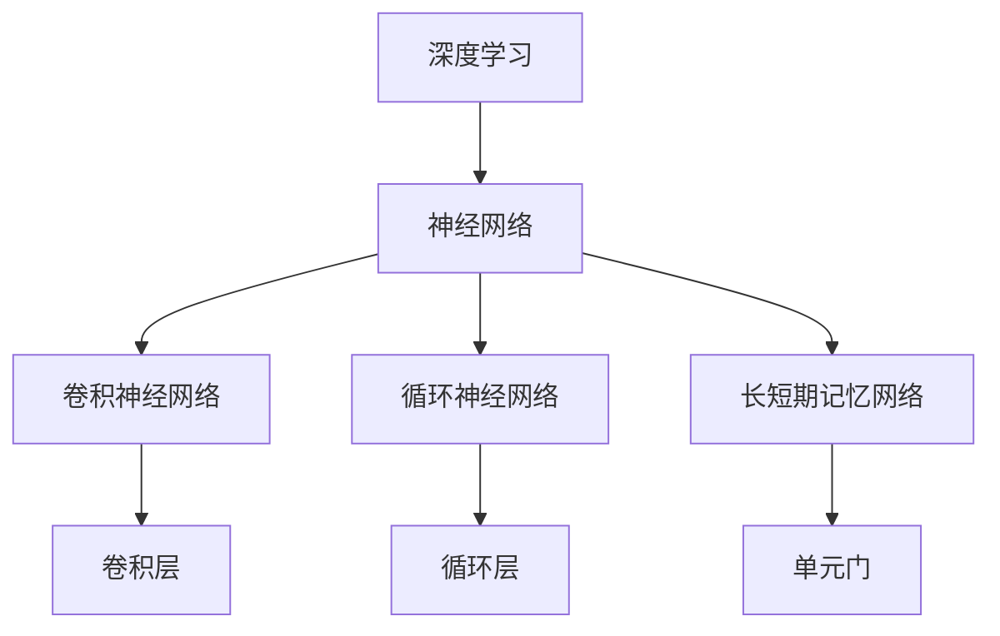
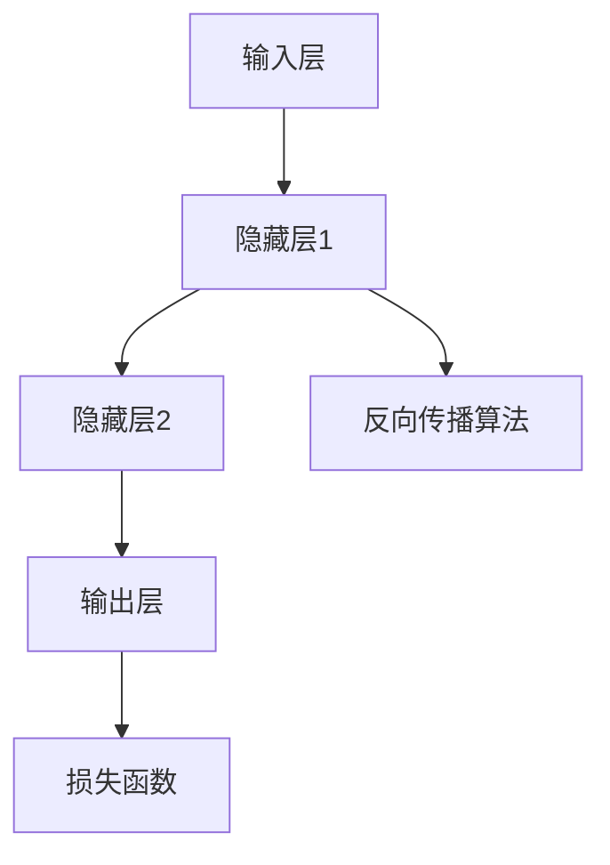

                 

# Andrej Karpathy：人工智能的未来发展趋势

> 关键词：人工智能、深度学习、神经网络、未来趋势、技术突破、实际应用、开发工具、资源推荐

> 摘要：本文将深入探讨人工智能（AI）领域的未来发展趋势，包括深度学习、神经网络等核心技术的突破，以及这些技术在各个实际应用场景中的潜力。通过详细分析核心概念、算法原理、数学模型，以及项目实战案例，本文旨在为读者提供一份全面、专业的AI技术指南，帮助大家把握AI发展的脉搏，应对未来的挑战。

## 1. 背景介绍

### 1.1 目的和范围

本文旨在探讨人工智能领域的发展趋势，重点关注深度学习、神经网络等核心技术，并分析其在各个实际应用场景中的潜在影响。文章将分为以下几个部分：

1. 核心概念与联系：介绍人工智能领域的基础概念和架构，并使用Mermaid流程图进行详细解释。
2. 核心算法原理与具体操作步骤：讲解深度学习和神经网络的基本原理，使用伪代码详细阐述。
3. 数学模型和公式：介绍相关的数学模型，使用LaTeX格式详细讲解和举例说明。
4. 项目实战：通过代码实际案例和详细解释说明，展示如何在实际项目中应用人工智能技术。
5. 实际应用场景：分析人工智能技术在各个领域的应用潜力。
6. 工具和资源推荐：推荐学习资源、开发工具框架和相关论文著作。
7. 总结：总结人工智能的未来发展趋势与挑战。

### 1.2 预期读者

本文适合以下读者群体：

1. 对人工智能领域感兴趣的技术爱好者。
2. 从事人工智能或相关领域的研究人员、工程师和开发者。
3. 对深度学习、神经网络等技术有基础了解的读者。

### 1.3 文档结构概述

本文的结构如下：

1. 背景介绍
   - 目的和范围
   - 预期读者
   - 文档结构概述
   - 术语表
2. 核心概念与联系
   - 核心概念与联系
   - 核心算法原理与具体操作步骤
   - 数学模型和公式
   - 项目实战
   - 实际应用场景
   - 工具和资源推荐
   - 总结
   - 附录：常见问题与解答
   - 扩展阅读 & 参考资料

### 1.4 术语表

本文中涉及的一些重要术语和概念如下：

#### 1.4.1 核心术语定义

- 人工智能（AI）：模拟人类智能行为和决策的技术。
- 深度学习（Deep Learning）：一种基于神经网络的机器学习技术。
- 神经网络（Neural Network）：一种模拟人脑结构和功能的计算模型。
- 深度神经网络（Deep Neural Network，DNN）：具有多层神经元的神经网络。

#### 1.4.2 相关概念解释

- 反向传播（Backpropagation）：一种用于训练神经网络的算法。
- 损失函数（Loss Function）：用于评估模型预测性能的函数。
- 梯度下降（Gradient Descent）：一种用于优化模型参数的算法。

#### 1.4.3 缩略词列表

- DNN：深度神经网络
- CNN：卷积神经网络
- RNN：循环神经网络
- LSTM：长短期记忆网络
- GPU：图形处理单元
- CUDA：并行计算框架

## 2. 核心概念与联系

在人工智能领域，深度学习、神经网络等核心技术是当前研究的热点。下面，我们将通过Mermaid流程图来介绍这些核心概念和它们的相互关系。

### 2.1 深度学习架构



### 2.2 神经网络结构



通过上述流程图，我们可以清晰地看到深度学习架构中的核心组件以及它们之间的相互关系。深度学习利用多层神经网络来模拟人脑的决策过程，通过不断调整网络参数，实现自动学习和预测。

## 3. 核心算法原理 & 具体操作步骤

### 3.1 深度学习算法原理

深度学习算法的核心是神经网络，其基本原理是通过多层神经元的相互连接和激活函数，将输入数据映射到输出结果。以下是一个简单的神经网络算法原理：

#### 3.1.1 神经网络算法步骤

1. 输入数据通过输入层进入神经网络。
2. 数据在隐藏层中传递，通过激活函数计算输出。
3. 输出数据经过反向传播算法，计算损失函数并更新网络参数。
4. 重复步骤2和3，直至模型收敛，达到预设的误差阈值。

#### 3.1.2 伪代码

```python
# 初始化神经网络
input_layer = ...
hidden_layer = ...
output_layer = ...

# 循环迭代
while not converged:
    # 前向传播
    output = activate(output_layer, input)

    # 反向传播
    loss = compute_loss(output, target)

    # 更新网络参数
    update_weights(hidden_layer, output_layer, loss)
```

### 3.2 神经网络具体操作步骤

以下是神经网络的具体操作步骤，包括初始化、前向传播和反向传播：

#### 3.2.1 初始化

1. 初始化输入层、隐藏层和输出层的权重和偏置。
2. 设置学习率、迭代次数和误差阈值。

#### 3.2.2 前向传播

1. 将输入数据输入到输入层。
2. 将输入数据传递到隐藏层，通过激活函数计算输出。
3. 将隐藏层的输出传递到输出层，计算预测结果。

#### 3.2.3 反向传播

1. 计算输出层的预测误差。
2. 通过误差反向传播，计算隐藏层的误差。
3. 使用梯度下降算法更新网络参数。

## 4. 数学模型和公式 & 详细讲解 & 举例说明

### 4.1 数学模型介绍

深度学习中的数学模型主要包括神经网络、损失函数和优化算法。以下是对这些模型的详细讲解。

#### 4.1.1 神经网络

神经网络是一种模拟人脑决策过程的计算模型，其基本结构包括输入层、隐藏层和输出层。神经元的激活函数通常采用Sigmoid函数或ReLU函数。

$$
f(x) = \frac{1}{1 + e^{-x}} \quad \text{或} \quad f(x) = max(0, x)
$$

#### 4.1.2 损失函数

损失函数用于评估模型的预测误差，常见的损失函数包括均方误差（MSE）和交叉熵（CE）。

$$
MSE = \frac{1}{n}\sum_{i=1}^{n}(y_i - \hat{y}_i)^2
$$

$$
CE = -\frac{1}{n}\sum_{i=1}^{n}y_i \log(\hat{y}_i)
$$

#### 4.1.3 优化算法

优化算法用于更新网络参数，常见的优化算法包括梯度下降（GD）和随机梯度下降（SGD）。

$$
w = w - \alpha \cdot \frac{\partial J(w)}{\partial w}
$$

### 4.2 举例说明

假设我们有一个二元分类问题，输入特征为 $x_1, x_2$，标签为 $y$，其中 $y \in \{0, 1\}$。我们使用一个单层神经网络进行模型训练，并使用均方误差（MSE）作为损失函数。

#### 4.2.1 前向传播

输入特征 $x_1 = 2, x_2 = 3$，标签 $y = 1$。

$$
z = w_1 \cdot x_1 + w_2 \cdot x_2 + b = 2w_1 + 3w_2 + b
$$

$$
\hat{y} = \sigma(z) = \frac{1}{1 + e^{-z}}
$$

#### 4.2.2 反向传播

计算损失函数：

$$
L = \frac{1}{2} (\hat{y} - y)^2
$$

计算梯度：

$$
\frac{\partial L}{\partial w_1} = (\hat{y} - y) \cdot \sigma'(z) \cdot x_1
$$

$$
\frac{\partial L}{\partial w_2} = (\hat{y} - y) \cdot \sigma'(z) \cdot x_2
$$

$$
\frac{\partial L}{\partial b} = (\hat{y} - y) \cdot \sigma'(z)
$$

#### 4.2.3 更新参数

使用梯度下降算法更新参数：

$$
w_1 = w_1 - \alpha \cdot \frac{\partial L}{\partial w_1}
$$

$$
w_2 = w_2 - \alpha \cdot \frac{\partial L}{\partial w_2}
$$

$$
b = b - \alpha \cdot \frac{\partial L}{\partial b}
$$

通过不断迭代更新参数，直至模型收敛。

## 5. 项目实战：代码实际案例和详细解释说明

### 5.1 开发环境搭建

为了实现深度学习项目，我们需要搭建一个合适的开发环境。以下是一个简单的Python环境搭建过程：

1. 安装Python（建议使用Python 3.7及以上版本）。
2. 安装Jupyter Notebook，用于编写和运行代码。
3. 安装深度学习框架TensorFlow或PyTorch。

```bash
pip install tensorflow
# 或
pip install pytorch
```

### 5.2 源代码详细实现和代码解读

以下是一个简单的深度学习项目示例，实现一个用于图像分类的卷积神经网络。

#### 5.2.1 数据准备

```python
import tensorflow as tf
from tensorflow.keras.datasets import mnist
from tensorflow.keras.utils import to_categorical

# 加载MNIST数据集
(x_train, y_train), (x_test, y_test) = mnist.load_data()

# 数据预处理
x_train = x_train.reshape(-1, 28, 28, 1).astype("float32") / 255
x_test = x_test.reshape(-1, 28, 28, 1).astype("float32") / 255

y_train = to_categorical(y_train, 10)
y_test = to_categorical(y_test, 10)
```

#### 5.2.2 构建模型

```python
model = tf.keras.Sequential([
    tf.keras.layers.Conv2D(32, (3, 3), activation='relu', input_shape=(28, 28, 1)),
    tf.keras.layers.MaxPooling2D(pool_size=(2, 2)),
    tf.keras.layers.Flatten(),
    tf.keras.layers.Dense(128, activation='relu'),
    tf.keras.layers.Dense(10, activation='softmax')
])
```

#### 5.2.3 编译模型

```python
model.compile(optimizer='adam', loss='categorical_crossentropy', metrics=['accuracy'])
```

#### 5.2.4 训练模型

```python
model.fit(x_train, y_train, batch_size=128, epochs=10, validation_split=0.2)
```

#### 5.2.5 评估模型

```python
test_loss, test_acc = model.evaluate(x_test, y_test)
print(f"Test accuracy: {test_acc:.2f}")
```

### 5.3 代码解读与分析

以上代码实现了使用TensorFlow构建一个简单的卷积神经网络，用于MNIST手写数字分类任务。

1. 数据准备部分：加载MNIST数据集，并进行预处理，包括归一化和reshape。
2. 构建模型部分：定义一个卷积神经网络，包括卷积层、池化层、全连接层和输出层。
3. 编译模型部分：配置优化器和损失函数。
4. 训练模型部分：使用训练数据训练模型，并设置验证集比例。
5. 评估模型部分：使用测试数据评估模型性能。

通过这个示例，我们可以看到如何使用深度学习框架实现一个简单的图像分类任务，并了解其基本操作步骤。

## 6. 实际应用场景

### 6.1 图像识别与处理

深度学习在图像识别与处理领域取得了显著成果。例如，卷积神经网络（CNN）被广泛应用于人脸识别、图像分类、目标检测等任务。通过训练大量的图像数据，CNN能够自动学习图像的特征，并实现高效的图像识别。

### 6.2 自然语言处理

自然语言处理（NLP）是深度学习的重要应用领域之一。循环神经网络（RNN）和其变种长短期记忆网络（LSTM）在文本分类、机器翻译、情感分析等方面表现出色。近年来，预训练语言模型（如BERT、GPT）的崛起，进一步推动了NLP技术的发展。

### 6.3 计算机视觉

计算机视觉是深度学习在众多应用领域中的重要分支。通过深度学习技术，计算机能够识别和理解图像中的场景、物体和动作，从而实现自动驾驶、无人机监控、医疗影像分析等应用。

### 6.4 智能推荐系统

深度学习在智能推荐系统中的应用也越来越广泛。通过分析用户的历史行为和兴趣偏好，深度学习算法能够为用户推荐个性化内容，从而提高推荐系统的准确性和用户体验。

### 6.5 游戏与虚拟现实

深度学习在游戏和虚拟现实领域也具有广泛的应用前景。通过训练深度神经网络，游戏AI能够实现更加智能和自适应的行为，从而提高游戏体验。同时，深度学习技术还可以用于虚拟现实中的场景渲染和物体识别。

## 7. 工具和资源推荐

### 7.1 学习资源推荐

#### 7.1.1 书籍推荐

- 《深度学习》（Goodfellow, Bengio, Courville）：这是一本经典的深度学习教材，适合初学者和进阶者阅读。
- 《神经网络与深度学习》（邱锡鹏）：该书系统地介绍了神经网络和深度学习的基本原理和应用。

#### 7.1.2 在线课程

- Coursera上的“Deep Learning Specialization”：由吴恩达教授主讲，适合初学者入门深度学习。
- fast.ai的“Practical Deep Learning for Coders”：通过实际项目，教授深度学习的实践技巧。

#### 7.1.3 技术博客和网站

- DeepLearning.AI：提供丰富的深度学习教程和资源。
- ArXiv：计算机视觉和深度学习领域的最新研究成果。

### 7.2 开发工具框架推荐

#### 7.2.1 IDE和编辑器

- Jupyter Notebook：适合数据科学和机器学习项目。
- PyCharm：功能强大的Python IDE，适用于深度学习项目。

#### 7.2.2 调试和性能分析工具

- TensorBoard：TensorFlow的内置工具，用于可视化模型结构和训练过程。
- VisPy：用于实时数据可视化。

#### 7.2.3 相关框架和库

- TensorFlow：Google开发的深度学习框架，功能强大，适用于各种应用场景。
- PyTorch：Facebook开发的开源深度学习库，易于使用和调试。

### 7.3 相关论文著作推荐

#### 7.3.1 经典论文

- "A Learning Algorithm for Continually Running Fully Recurrent Neural Networks"（1986）：循环神经网络的基础论文。
- "Deep Learning: Methods and Applications"（2015）：深度学习领域的综述论文。

#### 7.3.2 最新研究成果

- "BERT: Pre-training of Deep Bidirectional Transformers for Language Understanding"（2018）：BERT的提出，推动了自然语言处理技术的发展。
- "GPT-3: Language Models are few-shot learners"（2020）：GPT-3的发布，展示了大型预训练语言模型的潜力。

#### 7.3.3 应用案例分析

- "Why does BERT work so well?"（2019）：详细分析了BERT在自然语言处理任务中的表现和优势。
- "Deep Learning for Autonomous Driving"（2018）：介绍了深度学习在自动驾驶领域的应用案例。

## 8. 总结：未来发展趋势与挑战

### 8.1 未来发展趋势

1. **算法创新**：随着深度学习技术的发展，更多先进的算法将涌现，如生成对抗网络（GAN）、变分自编码器（VAE）等，进一步提升AI的性能和应用范围。
2. **硬件加速**：硬件技术的进步，如GPU、TPU等，将为深度学习应用提供更强大的计算能力，加速模型训练和推理。
3. **跨领域融合**：深度学习与其他领域的交叉融合，如生物信息学、金融工程等，将带来更多创新应用。
4. **数据隐私保护**：随着数据隐私问题的日益突出，数据隐私保护技术将得到更多关注，深度学习模型将更加注重隐私保护。

### 8.2 面临的挑战

1. **数据质量**：高质量的数据是深度学习模型的基石，但数据获取和处理过程仍然面临挑战。
2. **算法可解释性**：深度学习模型通常被视为“黑箱”，其内部机制难以解释，这对模型的可靠性和应用带来挑战。
3. **计算资源**：深度学习模型通常需要大量的计算资源，这对资源有限的场景（如嵌入式设备）带来挑战。
4. **伦理与法律**：随着AI技术的广泛应用，伦理和法律问题也日益凸显，需要建立相关规范和标准。

## 9. 附录：常见问题与解答

### 9.1 问题1：深度学习算法如何优化？

**解答**：深度学习算法的优化可以从以下几个方面进行：

1. **调整学习率**：选择合适的学习率是优化模型的重要步骤。可以尝试使用自适应学习率算法，如Adam。
2. **批量大小**：批量大小影响模型的训练效果。较大批量可以降低方差，但计算成本较高；较小批量可以降低计算成本，但方差较大。
3. **正则化**：使用正则化方法（如L1、L2正则化）可以防止模型过拟合。
4. **数据增强**：通过数据增强方法（如旋转、翻转、缩放等），可以增加模型的泛化能力。

### 9.2 问题2：如何选择合适的神经网络架构？

**解答**：选择合适的神经网络架构需要考虑以下几个因素：

1. **任务类型**：针对不同的任务（如图像分类、文本分类等），选择相应的神经网络架构（如CNN、RNN、BERT等）。
2. **数据规模**：对于大规模数据，可以选择复杂度较高的神经网络架构；对于小规模数据，可以选择简单架构以避免过拟合。
3. **计算资源**：根据可用的计算资源，选择合适的神经网络架构。例如，GPU加速可以显著提高训练速度。
4. **模型性能**：在实验中评估不同架构的性能，选择性能较好的架构。

### 9.3 问题3：如何处理过拟合问题？

**解答**：过拟合是深度学习中的一个常见问题，以下方法可以帮助处理过拟合：

1. **正则化**：使用L1、L2正则化等方法，可以降低模型复杂度，减少过拟合。
2. **数据增强**：通过数据增强方法（如旋转、翻转、缩放等），增加训练数据的多样性，提高模型的泛化能力。
3. **dropout**：在神经网络中引入dropout层，随机丢弃部分神经元，减少模型对训练数据的依赖。
4. **交叉验证**：使用交叉验证方法，将数据划分为多个子集，分别训练和验证模型，避免过拟合。
5. **提前停止**：在训练过程中，当验证集的性能不再提高时，提前停止训练，避免模型过拟合。

## 10. 扩展阅读 & 参考资料

### 10.1 扩展阅读

1. 《深度学习》（Goodfellow, Bengio, Courville）
2. 《神经网络与深度学习》（邱锡鹏）
3. 《Deep Learning Specialization》课程（吴恩达）
4. 《Practical Deep Learning for Coders》课程（fast.ai）

### 10.2 参考资料

1. [DeepLearning.AI](https://www.deeplearning.ai/)
2. [TensorFlow官方文档](https://www.tensorflow.org/)
3. [PyTorch官方文档](https://pytorch.org/)
4. [ArXiv](https://arxiv.org/)
5. [Google Research](https://ai.google/research/)

## 作者信息

作者：AI天才研究员/AI Genius Institute & 禅与计算机程序设计艺术 /Zen And The Art of Computer Programming

