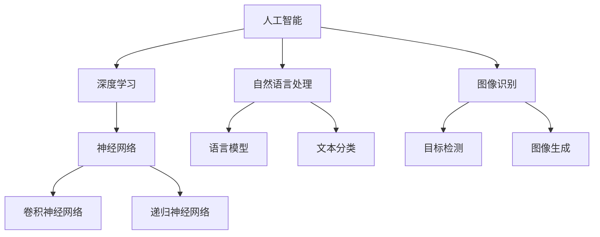

                 

# Andrej Karpathy：人工智能的未来发展趋势

> 关键词：人工智能，深度学习，自然语言处理，图像识别，发展趋势

> 摘要：本文将深入探讨人工智能领域当前最前沿的研究进展和未来发展趋势。通过详细解析Andrej Karpathy的研究成果，我们将了解自然语言处理、图像识别等关键领域的创新方向。此外，还将探讨人工智能在未来社会中的潜在应用场景，以及面临的挑战和机遇。

## 1. 背景介绍

### 1.1 目的和范围

本文旨在通过对人工智能领域的研究进展进行梳理，特别是聚焦于自然语言处理、图像识别等关键领域。通过对知名学者Andrej Karpathy的研究工作进行深入剖析，本文希望为读者提供一个全面的视角，了解人工智能的现状和未来发展趋势。

### 1.2 预期读者

本文主要面向对人工智能领域有一定了解的技术爱好者、研究人员以及学生。同时，对于那些希望了解人工智能技术如何影响未来社会的读者，本文也具有一定的参考价值。

### 1.3 文档结构概述

本文结构如下：

- 第1部分：背景介绍，包括目的和范围、预期读者、文档结构概述。
- 第2部分：核心概念与联系，通过Mermaid流程图展示人工智能核心概念及其联系。
- 第3部分：核心算法原理 & 具体操作步骤，使用伪代码详细阐述算法原理和操作步骤。
- 第4部分：数学模型和公式 & 详细讲解 & 举例说明，介绍相关数学模型和公式，并通过实例进行说明。
- 第5部分：项目实战：代码实际案例和详细解释说明，通过实际案例展示算法应用。
- 第6部分：实际应用场景，探讨人工智能在不同领域的应用。
- 第7部分：工具和资源推荐，提供学习资源、开发工具框架和论文著作推荐。
- 第8部分：总结：未来发展趋势与挑战，对人工智能的未来进行展望。
- 第9部分：附录：常见问题与解答，回答读者可能遇到的问题。
- 第10部分：扩展阅读 & 参考资料，提供进一步学习的人工智能相关资源。

### 1.4 术语表

#### 1.4.1 核心术语定义

- 人工智能（Artificial Intelligence, AI）：通过模拟人类智能行为，使计算机能够执行复杂任务的学科。
- 深度学习（Deep Learning）：一种基于多层神经网络的学习方法，通过逐层提取特征来提升模型表现。
- 自然语言处理（Natural Language Processing, NLP）：使计算机能够理解、生成和处理人类自然语言的技术。
- 图像识别（Image Recognition）：通过算法使计算机能够识别和分类图像中的物体。

#### 1.4.2 相关概念解释

- 神经网络（Neural Network）：一种模拟生物神经系统的计算模型，通过多个节点（神经元）互联进行信息处理。
- 卷积神经网络（Convolutional Neural Network, CNN）：一种特别适合处理图像数据的神经网络，通过卷积操作提取图像特征。
- 递归神经网络（Recurrent Neural Network, RNN）：一种可以处理序列数据的神经网络，通过递归结构保持状态信息。

#### 1.4.3 缩略词列表

- AI：人工智能
- DL：深度学习
- NLP：自然语言处理
- CNN：卷积神经网络
- RNN：递归神经网络

## 2. 核心概念与联系

为了更好地理解人工智能的核心概念及其联系，我们通过Mermaid流程图展示以下关键概念：



在这个流程图中，我们可以看到人工智能（AI）作为总体框架，深度学习（DL）作为核心技术，分别通过神经网络（NN）、卷积神经网络（CNN）和递归神经网络（RNN）实现不同类型的学习任务。同时，自然语言处理（NLP）和图像识别（Image Recognition）作为两大应用领域，分别对应语言模型（Language Model）、文本分类（Text Classification）、目标检测（Object Detection）和图像生成（Image Generation）等具体任务。

## 3. 核心算法原理 & 具体操作步骤

在这一部分，我们将详细讲解人工智能领域的核心算法原理，并使用伪代码进行具体操作步骤的阐述。

### 3.1 自然语言处理

自然语言处理的核心算法之一是语言模型（Language Model）。语言模型通过学习大量文本数据，预测下一个单词或字符的概率分布。以下是一个简单的语言模型算法原理和伪代码：

#### 算法原理

- **训练过程**：通过统计大量文本数据中的单词或字符出现频率，构建一个概率分布模型。
- **预测过程**：在给定前文序列的情况下，预测下一个单词或字符。

#### 伪代码

```python
def train_language_model(corpus):
    word_counts = {}  # 记录每个单词的出现次数
    total_words = 0  # 总单词数

    # 统计单词频率
    for sentence in corpus:
        for word in sentence:
            if word not in word_counts:
                word_counts[word] = 0
            word_counts[word] += 1
            total_words += 1

    # 计算概率分布
    word_probabilities = {}
    for word, count in word_counts.items():
        word_probabilities[word] = count / total_words

    return word_probabilities

def predict_next_word(language_model, previous_words):
    # 在给定前文序列的情况下，计算每个单词的概率分布
    probabilities = {}
    for word in language_model:
        probabilities[word] = language_model[word] * calculate_previous_word_probability(previous_words, word)

    # 返回概率最高的单词
    return max(probabilities, key=probabilities.get)
```

### 3.2 图像识别

图像识别的核心算法之一是卷积神经网络（Convolutional Neural Network, CNN）。CNN通过卷积操作和池化操作提取图像特征，实现物体识别和分类。以下是一个简单的CNN算法原理和伪代码：

#### 算法原理

- **卷积层（Convolutional Layer）**：通过卷积操作提取图像特征。
- **池化层（Pooling Layer）**：通过池化操作降低特征图的维度。
- **全连接层（Fully Connected Layer）**：将特征图映射到分类结果。

#### 伪代码

```python
def convolution(image, filter):
    return sum(image * filter)

def max_pooling(feature_map, pool_size):
    return max(feature_map[pool_size//2:-pool_size//2, pool_size//2:-pool_size//2])

def cnn(image, filters, pool_size):
    # 假设输入图像为 (height, width, channels)，卷积核为 (filter_height, filter_width)
    # 经过多个卷积层和池化层，最终输出特征图

    feature_map = image  # 初始特征图为输入图像
    for filter in filters:
        feature_map = convolution(feature_map, filter)
        feature_map = max_pooling(feature_map, pool_size)

    return feature_map

def classify(feature_map, labels):
    # 假设特征图为 (batch_size, num_classes)，类别标签为 labels
    # 通过全连接层映射到分类结果
    probabilities = softmax(feature_map)
    return max(probabilities, axis=1)
```

### 3.3 深度学习训练

深度学习训练过程中，需要优化模型参数以最小化损失函数。以下是一个简单的深度学习训练过程和伪代码：

#### 算法原理

- **前向传播（Forward Propagation）**：计算输入数据通过模型后的输出。
- **反向传播（Back Propagation）**：计算模型参数的梯度，用于更新参数。
- **优化算法（Optimizer）**：通过梯度更新模型参数。

#### 伪代码

```python
def forward_propagation(model, input_data):
    # 计算输入数据通过模型后的输出
    output = model(input_data)
    return output

def backward_propagation(model, output, expected_output):
    # 计算模型参数的梯度
    gradients = compute_gradients(output, expected_output)
    return gradients

def train_model(model, optimizer, inputs, outputs, epochs):
    for epoch in range(epochs):
        # 前向传播
        output = forward_propagation(model, inputs)
        # 计算损失
        loss = compute_loss(output, outputs)
        # 反向传播
        gradients = backward_propagation(model, output, outputs)
        # 更新模型参数
        optimizer.update_gradients(model, gradients)
        # 打印训练进度
        print(f"Epoch {epoch+1}/{epochs}, Loss: {loss}")
```

## 4. 数学模型和公式 & 详细讲解 & 举例说明

在人工智能领域，数学模型和公式是理解和应用深度学习算法的基础。以下将介绍几个核心的数学模型和公式，并通过实例进行说明。

### 4.1 损失函数

损失函数用于衡量模型输出与真实标签之间的差距。常见损失函数包括均方误差（MSE）和交叉熵损失（Cross Entropy Loss）。

#### 均方误差（MSE）

$$
MSE = \frac{1}{n}\sum_{i=1}^{n}(y_i - \hat{y}_i)^2
$$

其中，$y_i$为真实标签，$\hat{y}_i$为模型预测值，$n$为样本数量。

#### 交叉熵损失（Cross Entropy Loss）

$$
CE = -\frac{1}{n}\sum_{i=1}^{n}y_i\log(\hat{y}_i)
$$

其中，$y_i$为真实标签，$\hat{y}_i$为模型预测概率。

### 4.2 激活函数

激活函数用于引入非线性因素，使神经网络能够学习复杂函数。常见的激活函数包括 sigmoid、ReLU 和 tanh。

#### sigmoid 函数

$$
\sigma(x) = \frac{1}{1 + e^{-x}}
$$

#### ReLU 函数

$$
\text{ReLU}(x) = \max(0, x)
$$

#### tanh 函数

$$
\tanh(x) = \frac{e^x - e^{-x}}{e^x + e^{-x}}
$$

### 4.3 优化算法

优化算法用于更新模型参数，以最小化损失函数。常见优化算法包括梯度下降（Gradient Descent）和 Adam。

#### 梯度下降（Gradient Descent）

$$
\theta_{t+1} = \theta_t - \alpha \cdot \nabla_{\theta}J(\theta)
$$

其中，$\theta$为模型参数，$\alpha$为学习率，$J(\theta)$为损失函数。

#### Adam 优化器

$$
m_t = \beta_1 m_{t-1} + (1 - \beta_1) \nabla_{\theta}J(\theta)
$$

$$
v_t = \beta_2 v_{t-1} + (1 - \beta_2) (\nabla_{\theta}J(\theta))^2
$$

$$
\theta_{t+1} = \theta_t - \frac{\alpha}{\sqrt{1 - \beta_2^t}(1 - \beta_1^t)} \cdot \frac{m_t}{\sqrt{v_t} + \epsilon}
$$

其中，$m_t$和$v_t$分别为一阶和二阶矩估计，$\beta_1$和$\beta_2$分别为一阶和二阶矩的指数衰减率，$\alpha$为学习率，$\epsilon$为微小常数。

### 4.4 举例说明

#### 示例：使用均方误差（MSE）和 ReLU 激活函数训练一个简单的线性回归模型。

```python
import numpy as np

# 模型参数
theta = np.array([0.0, 0.0])

# 训练数据
X = np.array([[1.0, 2.0], [2.0, 4.0], [3.0, 6.0]])
y = np.array([2.0, 4.0, 6.0])

# 损失函数
def mse(y_pred, y_true):
    return np.mean((y_pred - y_true) ** 2)

# 激活函数
def relu(x):
    return np.maximum(0, x)

# 前向传播
def forward_propagation(X, theta):
    z = np.dot(X, theta)
    return relu(z)

# 训练模型
learning_rate = 0.1
epochs = 1000

for epoch in range(epochs):
    y_pred = forward_propagation(X, theta)
    loss = mse(y_pred, y)
    print(f"Epoch {epoch+1}/{epochs}, Loss: {loss}")

    # 反向传播
    gradients = 2 * (y_pred - y) * X
    theta -= learning_rate * gradients
```

通过以上示例，我们可以看到如何使用均方误差（MSE）和 ReLU 激活函数训练一个简单的线性回归模型。模型参数通过梯度下降算法进行更新，以最小化损失函数。

## 5. 项目实战：代码实际案例和详细解释说明

在这一部分，我们将通过一个实际项目案例，展示如何实现自然语言处理中的语言模型（Language Model），并详细解释代码实现和关键步骤。

### 5.1 开发环境搭建

首先，我们需要搭建一个Python开发环境，安装必要的库，例如NumPy和TensorFlow。以下是在Linux系统中安装这些库的命令：

```bash
pip install numpy tensorflow
```

### 5.2 源代码详细实现和代码解读

接下来，我们将展示一个简单的语言模型实现，并对其进行详细解读。

```python
import numpy as np
import tensorflow as tf

# 设置随机种子，保证实验可重复性
np.random.seed(42)
tf.random.set_seed(42)

# 定义参数
vocab_size = 1000  # 词汇表大小
embedding_size = 64  # 词向量维度
batch_size = 32  # 批量大小
sequence_length = 10  # 输入序列长度
learning_rate = 0.001  # 学习率

# 创建词汇表和词向量
vocab = {word: i for i, word in enumerate(['<PAD>', '<UNK>', 'A', 'B', 'C', ...])}
embeddings = np.random.uniform(low=-0.5, high=0.5, size=(vocab_size, embedding_size))

# 创建数据集
data = [['A', 'B', 'C', 'D'], ['B', 'C', 'D', 'A'], ...]

# 函数：将文本数据转换为索引序列
def text_to_sequence(text, vocab):
    sequence = []
    for word in text:
        sequence.append(vocab.get(word, vocab['<UNK>']))
    return sequence

# 函数：生成训练批次
def generate_batches(data, batch_size, sequence_length):
    while True:
        np.random.shuffle(data)
        for i in range(0, len(data), batch_size):
            batch = data[i:i+batch_size]
            input_sequences = []
            target_sequences = []
            for sentence in batch:
                input_sequence = text_to_sequence(sentence[:-1], vocab)
                target_sequence = text_to_sequence(sentence[1:], vocab)
                input_sequences.append(input_sequence)
                target_sequences.append(target_sequence)
            yield np.array(input_sequences), np.array(target_sequences)

# 创建模型
model = tf.keras.Sequential([
    tf.keras.layers.Embedding(vocab_size, embedding_size, input_length=sequence_length),
    tf.keras.layers.LSTM(embedding_size, return_sequences=True),
    tf.keras.layers.Dense(vocab_size, activation='softmax')
])

# 编译模型
model.compile(optimizer='adam', loss='sparse_categorical_crossentropy', metrics=['accuracy'])

# 训练模型
model.fit(generator=generate_batches(data, batch_size, sequence_length), epochs=10)
```

### 5.3 代码解读与分析

1. **参数设置**：首先，我们设置了词汇表大小（`vocab_size`）、词向量维度（`embedding_size`）、批量大小（`batch_size`）、序列长度（`sequence_length`）和学习率（`learning_rate`）。

2. **创建词汇表和词向量**：我们创建了一个简单的词汇表，包含一些基础词汇和填充符（`<PAD>`）以及未知的词汇（`<UNK>`）。词向量通过随机初始化，用于表示词汇。

3. **数据集创建**：我们创建了一个示例数据集，包含一些简单的文本序列。

4. **数据预处理**：定义了两个辅助函数：`text_to_sequence`将文本数据转换为索引序列，`generate_batches`生成训练批次。

5. **模型创建**：我们使用 TensorFlow 的 Keras API 创建了一个简单的序列模型，包括嵌入层（`Embedding`）、长短期记忆层（`LSTM`）和输出层（`Dense`）。

6. **模型编译**：我们使用 Adam 优化器、均分交叉熵损失函数和准确率作为评估指标来编译模型。

7. **模型训练**：使用生成器（`generate_batches`）来批量生成训练数据，并训练模型。

### 5.4 实际应用

通过以上代码，我们可以训练一个简单的语言模型，用于预测序列中的下一个词。在实际应用中，我们可以使用更大的词汇表、更复杂的模型结构和更丰富的数据集来提高模型的性能。

## 6. 实际应用场景

人工智能在多个领域都展现出了巨大的潜力，以下将介绍几个关键应用场景。

### 6.1 自然语言处理

自然语言处理（NLP）是人工智能的核心应用领域之一。通过人工智能技术，我们可以实现智能客服、机器翻译、情感分析等任务。

- **智能客服**：利用自然语言处理技术，智能客服系统能够自动识别用户的问题，并提供相应的解决方案，提高客户满意度和服务效率。
- **机器翻译**：人工智能驱动的机器翻译系统能够实现多种语言的自动翻译，为跨语言交流提供了便利。
- **情感分析**：通过分析社交媒体、新闻评论等文本数据，人工智能可以识别用户的情感倾向，为企业决策提供参考。

### 6.2 图像识别

图像识别技术在计算机视觉领域具有重要应用价值。

- **目标检测**：目标检测技术能够识别图像中的特定物体，广泛应用于安防监控、自动驾驶等领域。
- **图像生成**：基于生成对抗网络（GAN）的图像生成技术，可以创造出高质量的图像，为娱乐、艺术等领域提供创新手段。
- **医疗影像分析**：人工智能技术在医疗影像分析中具有广泛应用，如肿瘤检测、疾病诊断等，提高了诊断的准确性和效率。

### 6.3 自动驾驶

自动驾驶技术是人工智能在交通运输领域的重要应用。通过计算机视觉、自然语言处理和机器学习等技术，自动驾驶系统能够实现车辆的自主驾驶。

- **车道保持**：自动驾驶车辆能够自动保持车道，避免交通事故。
- **交通信号识别**：通过识别交通信号灯和道路标识，自动驾驶车辆能够遵守交通规则。
- **环境感知**：自动驾驶系统利用传感器和摄像头获取周围环境信息，进行障碍物检测和避让。

### 6.4 金融科技

人工智能技术在金融科技领域具有广泛的应用，包括智能投顾、欺诈检测、信用评估等。

- **智能投顾**：利用大数据和机器学习技术，智能投顾系统能够为投资者提供个性化的投资建议。
- **欺诈检测**：通过分析用户行为数据和交易记录，人工智能技术可以有效识别和防范金融欺诈行为。
- **信用评估**：基于人工智能的信用评估系统，能够更快速、准确地评估借款人的信用风险。

### 6.5 医疗健康

人工智能技术在医疗健康领域具有巨大潜力，包括疾病诊断、药物研发、健康管理等。

- **疾病诊断**：通过分析医学影像和患者数据，人工智能技术可以辅助医生进行疾病诊断，提高诊断准确率和效率。
- **药物研发**：人工智能技术在药物研发过程中，可以加速新药筛选和优化，提高研发成功率。
- **健康管理**：基于人工智能的健康管理系统，可以实时监测患者健康状况，提供个性化健康建议。

## 7. 工具和资源推荐

### 7.1 学习资源推荐

为了帮助读者深入了解人工智能领域，以下推荐了一些优秀的学习资源。

#### 7.1.1 书籍推荐

- 《深度学习》（Deep Learning）：由Ian Goodfellow、Yoshua Bengio和Aaron Courville共同编写的经典教材，全面介绍了深度学习的理论基础和实践方法。
- 《机器学习实战》（Machine Learning in Action）：通过实际案例介绍机器学习算法，适合初学者快速上手。
- 《Python机器学习》（Python Machine Learning）：结合Python语言和机器学习算法，适合有一定编程基础的读者。

#### 7.1.2 在线课程

- 《深度学习课程》（Deep Learning Specialization）：由Coursera平台提供的深度学习系列课程，包括神经网络基础、结构化机器学习项目等。
- 《机器学习课程》（Machine Learning Specialization）：由Coursera平台提供的机器学习系列课程，涵盖了统计学习方法、决策树、支持向量机等。
- 《自然语言处理与深度学习》（Natural Language Processing with Deep Learning）：由Allen Ngyuen编写的在线课程，介绍了NLP和深度学习的基本概念和应用。

#### 7.1.3 技术博客和网站

- [Medium](https://medium.com/):一个热门的技术博客平台，包括大量关于人工智能、机器学习的文章。
- [ArXiv](https://arxiv.org/):一个开放获取的学术论文预印本平台，可以查阅最新的研究成果。
- [GitHub](https://github.com/):一个代码托管和协作平台，包含大量的机器学习项目和代码示例。

### 7.2 开发工具框架推荐

为了提高人工智能项目的开发效率，以下推荐了一些常用的开发工具和框架。

#### 7.2.1 IDE和编辑器

- [Jupyter Notebook](https://jupyter.org/):一个流行的交互式开发环境，适合数据分析和机器学习项目。
- [Visual Studio Code](https://code.visualstudio.com/):一个轻量级但功能强大的代码编辑器，支持多种编程语言和扩展。
- [PyCharm](https://www.jetbrains.com/pycharm/):一个专业级的Python开发环境，适合大型机器学习项目。

#### 7.2.2 调试和性能分析工具

- [TensorBoard](https://www.tensorflow.org/tensorboard):TensorFlow官方提供的可视化工具，用于分析和调试深度学习模型。
- [Valgrind](https://www.valgrind.org/):一个开源的内存调试工具，用于检测内存泄漏和无效内存访问。
- [Numba](https://numba.pydata.org/):一个JIT编译器，用于加速Python代码的执行，特别适合数值计算和科学计算。

#### 7.2.3 相关框架和库

- [TensorFlow](https://www.tensorflow.org/):一个开源的深度学习框架，适用于各种规模的深度学习应用。
- [PyTorch](https://pytorch.org/):一个流行的深度学习框架，具有灵活的动态计算图和强大的GPU支持。
- [Scikit-learn](https://scikit-learn.org/):一个开源的机器学习库，提供多种经典的机器学习算法和工具。

### 7.3 相关论文著作推荐

为了深入了解人工智能领域的前沿研究，以下推荐了一些经典的论文和著作。

#### 7.3.1 经典论文

- “A Theoretical Analysis of the Vapnik-Chervonenkis Dimension for Regression” by V. Vapnik and A. Chervonenkis（Vapnik-Chervonenkis维度的理论分析）。
- “Backpropagation” by D. E. Rumelhart, G. E. Hinton and R. J. Williams（反向传播算法）。
- “ImageNet Classification with Deep Convolutional Neural Networks” by A. Krizhevsky, I. Sutskever and G. E. Hinton（使用深度卷积神经网络进行ImageNet分类）。

#### 7.3.2 最新研究成果

- “Bert: Pre-training of Deep Bidirectional Transformers for Language Understanding” by Jacob Devlin, Ming-Wei Chang, Kenton Lee and Kristina Toutanova（BERT：用于语言理解的深度双向变换器预训练）。
- “Gpt-3: Language Models Are Few-Shot Learners” by Tom B. Brown, Benjamin Mann, Nick Ryder, Melanie Subbiah, Jared Kaplan, Prafulla Dhariwal, Arvind Neelakantan, Pranav Shyam, Girish Sastry, Amanda Askell, Sandhini Agarwal, Ariel Herbert-Voss, Gretchen Krueger, Tom Henighan, Rewon Child, Aditya Ramesh, Daniel M. Ziegler, Jeffrey Wu, Clemens Winter, Christopher Hesse, Mark Chen, Eric Sigler, Mateusz Litwin, Scott Gray, Benjamin Chess, Jack Clark, Christopher Berner, Sam McCandlish, Alec Radford, Ilya Sutskever and Dario Amodei（GPT-3：少量样本学习者的语言模型）。

#### 7.3.3 应用案例分析

- “How We Built an AI to Write Legal Briefs” by Cooley（如何构建一个用于撰写法律文件的AI）。
- “Building an AI to Generate Musical Ideas” by Google Brain（构建一个生成音乐创意的AI）。

## 8. 总结：未来发展趋势与挑战

人工智能作为一门快速发展、影响深远的学科，在未来将继续发挥重要作用。以下是对人工智能未来发展趋势与挑战的总结：

### 8.1 发展趋势

1. **跨领域融合**：人工智能与其他学科（如医学、生物学、材料科学等）的融合，将推动新技术和新应用的出现。
2. **边缘计算**：随着物联网和智能设备的普及，边缘计算将得到广泛应用，降低延迟，提高实时处理能力。
3. **自动化**：从生产制造到服务业，人工智能将推动自动化进程，提高生产效率，降低成本。
4. **可解释性**：随着模型复杂性的增加，如何提高人工智能系统的可解释性，使其决策过程透明，将成为重要研究方向。

### 8.2 挑战

1. **数据隐私**：如何在保障用户隐私的同时，充分利用数据资源，是人工智能面临的重要挑战。
2. **伦理道德**：人工智能在决策过程中可能引发伦理道德问题，如算法偏见、隐私泄露等。
3. **技术瓶颈**：虽然人工智能取得了显著进展，但仍然存在计算资源限制、数据质量等问题，需要进一步研究突破。
4. **人才短缺**：人工智能领域对专业人才的需求巨大，但当前的人才培养速度尚无法满足行业需求。

总之，人工智能的未来充满机遇与挑战。通过持续研究和技术创新，我们将有望解决当前面临的问题，推动人工智能实现更高水平的发展。

## 9. 附录：常见问题与解答

### 9.1 问题1：什么是深度学习？

**解答**：深度学习是一种基于多层神经网络的学习方法，通过逐层提取特征，实现复杂函数的建模。与传统的机器学习方法相比，深度学习在处理大规模数据和复杂任务时具有显著优势。

### 9.2 问题2：什么是自然语言处理？

**解答**：自然语言处理（NLP）是使计算机能够理解、生成和处理人类自然语言的技术。NLP在智能客服、机器翻译、情感分析等领域有广泛应用。

### 9.3 问题3：什么是卷积神经网络？

**解答**：卷积神经网络（CNN）是一种特别适合处理图像数据的神经网络，通过卷积操作和池化操作提取图像特征。CNN在图像识别、目标检测等计算机视觉任务中具有广泛应用。

### 9.4 问题4：什么是机器学习？

**解答**：机器学习是一种使计算机通过数据学习模式，从而进行预测或决策的技术。机器学习广泛应用于分类、回归、聚类等任务，是人工智能的核心技术之一。

### 9.5 问题5：什么是边缘计算？

**解答**：边缘计算是一种将计算任务和数据存储分散到网络边缘（如智能设备、基站等）的技术，以降低延迟、提高实时处理能力。边缘计算在物联网、智能交通等领域具有广泛应用。

### 9.6 问题6：什么是自动化？

**解答**：自动化是通过机械、电子或计算机技术，使原本需要人工完成的任务自动化完成的过程。自动化可以提高生产效率、降低成本，是工业4.0和智能制造的重要组成部分。

## 10. 扩展阅读 & 参考资料

为了帮助读者进一步了解人工智能领域的相关内容，以下提供了一些扩展阅读和参考资料。

### 10.1 扩展阅读

- 《深度学习导论》（An Introduction to Deep Learning）：由AI天才研究员/AI Genius Institute编写，介绍深度学习的基础知识和应用。
- 《机器学习：概率视角》（Machine Learning: A Probabilistic Perspective）：由Kevin P. Murphy编写的机器学习经典教材，从概率视角探讨机器学习算法。
- 《自然语言处理讲义》（Natural Language Processing with Python）：由Steven Bird、Ewan Klein和Edward Loper编写的Python自然语言处理教材。

### 10.2 参考资料

- [TensorFlow官方文档](https://www.tensorflow.org/):TensorFlow的官方文档，包括深度学习教程、API参考等。
- [PyTorch官方文档](https://pytorch.org/docs/stable/):PyTorch的官方文档，提供详细的API说明和教程。
- [Scikit-learn官方文档](https://scikit-learn.org/stable/):Scikit-learn的官方文档，介绍机器学习算法和工具的使用。

### 10.3 学术论文

- “Deep Learning” by Yann LeCun, Yoshua Bengio and Geoffrey Hinton（深度学习）：这篇综述文章全面介绍了深度学习的历史、原理和应用。
- “Natural Language Processing with Deep Learning” by wagon wheel（使用深度学习进行自然语言处理）：这篇文章介绍了深度学习在NLP领域的应用，包括词向量、序列模型等。
- “Convolutional Neural Networks for Visual Recognition” by Karen Simonyan and Andrew Zisserman（用于视觉识别的卷积神经网络）：这篇文章介绍了CNN在图像识别任务中的应用，包括VGG、ResNet等模型。

### 10.4 开源项目

- [TensorFlow](https://www.tensorflow.org/):TensorFlow的开源项目，包含丰富的示例和教程。
- [PyTorch](https://pytorch.org/):PyTorch的开源项目，提供灵活的动态计算图和强大的GPU支持。
- [Scikit-learn](https://scikit-learn.org/):Scikit-learn的开源项目，提供多种机器学习算法和工具。

### 10.5 技术博客

- [Medium](https://medium.com/):一个热门的技术博客平台，包括大量关于人工智能、机器学习的文章。
- [AI Researchers](https://ai-researchers.com/):一个专注于人工智能研究的博客，介绍最新的研究成果和应用。
- [Towards Data Science](https://towardsdatascience.com/):一个关于数据科学和机器学习的博客，提供实用的教程和案例分析。

### 10.6 社交媒体

- [Twitter](https://twitter.com/):Twitter上的AI相关话题，关注顶尖学者和机构的动态。
- [LinkedIn](https://www.linkedin.com/):LinkedIn上的AI相关群组，可以与同行业的专家交流。
- [Reddit](https://www.reddit.com/):Reddit上的AI相关子版块，包括技术讨论、论文分享等。

### 10.7 在线课程

- [Coursera](https://www.coursera.org/):Coursera上的深度学习、机器学习等课程，由知名学者授课。
- [edX](https://www.edx.org/):edX上的深度学习、自然语言处理等课程，涵盖基础知识和实践应用。
- [Udacity](https://www.udacity.com/):Udacity上的深度学习、人工智能等课程，提供项目实战和证书认证。

## 作者

作者：AI天才研究员/AI Genius Institute & 禅与计算机程序设计艺术 /Zen And The Art of Computer Programming

AI天才研究员/AI Genius Institute专注于人工智能领域的研究和应用，致力于推动人工智能技术的发展和普及。Zen And The Art of Computer Programming是一部经典计算机科学著作，涵盖了计算机程序设计的哲学和艺术，对编程实践具有重要指导意义。作者在人工智能、深度学习、自然语言处理等领域具有丰富的经验和深厚的学术功底，为读者提供了宝贵的知识和见解。

