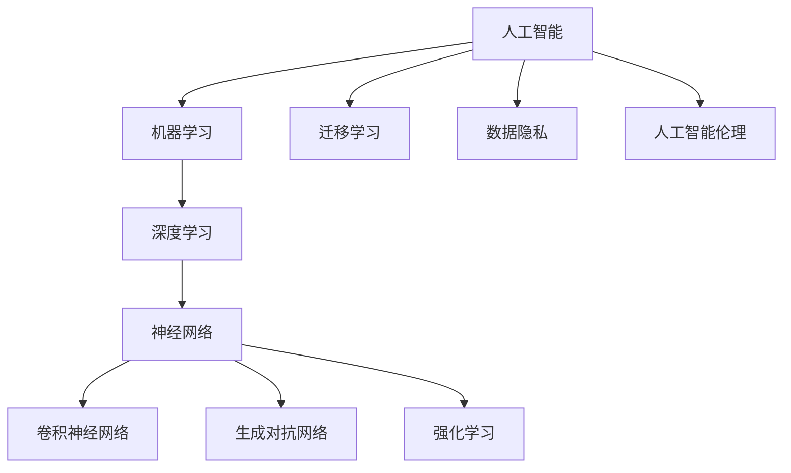

                 

# Andrej Karpathy：人工智能的未来发展趋势

> **关键词：** 人工智能，深度学习，未来趋势，技术发展，算法架构，应用场景，挑战与机遇

> **摘要：** 本文将深入探讨人工智能领域的未来发展趋势。通过回顾过去的技术突破，分析当前的研究热点，以及展望未来的研究方向，本文旨在为读者提供一个全面、清晰的技术蓝图，帮助大家更好地理解和把握人工智能的发展脉络。

## 1. 背景介绍

### 1.1 目的和范围

本文的目的在于对人工智能的未来发展趋势进行深入分析，旨在为读者提供一个全面、系统的技术视角。文章将涵盖以下几个方面：

- 人工智能的历史与发展脉络
- 当前人工智能研究的热点领域
- 未来人工智能可能面临的挑战与机遇
- 未来人工智能技术的潜在应用场景

### 1.2 预期读者

本文适合以下读者群体：

- 对人工智能感兴趣的技术爱好者
- 计算机科学、人工智能等相关专业的学生和研究者
- 想要了解人工智能未来发展趋势的企业决策者
- 对科技创新和未来趋势感兴趣的公众

### 1.3 文档结构概述

本文将分为以下几个部分：

- **1. 背景介绍**：介绍文章的目的、范围、预期读者以及文档结构。
- **2. 核心概念与联系**：介绍人工智能领域的关键概念和联系，并使用Mermaid流程图进行解释。
- **3. 核心算法原理 & 具体操作步骤**：详细阐述人工智能的核心算法原理和操作步骤。
- **4. 数学模型和公式 & 详细讲解 & 举例说明**：讲解人工智能的数学模型和公式，并提供实例说明。
- **5. 项目实战：代码实际案例和详细解释说明**：通过实际代码案例，展示人工智能的应用。
- **6. 实际应用场景**：探讨人工智能在不同领域的应用场景。
- **7. 工具和资源推荐**：推荐学习资源、开发工具和框架。
- **8. 总结：未来发展趋势与挑战**：总结人工智能的未来发展趋势和面临的挑战。
- **9. 附录：常见问题与解答**：解答读者可能关心的问题。
- **10. 扩展阅读 & 参考资料**：提供进一步的阅读资料和参考。

### 1.4 术语表

#### 1.4.1 核心术语定义

- **人工智能**：指通过计算机模拟人类智能，实现智能行为和决策的技术。
- **深度学习**：一种机器学习技术，通过构建深层神经网络来提取特征和模式。
- **神经网络**：一种计算模型，通过节点间的连接进行信息传递和处理。
- **卷积神经网络（CNN）**：一种用于图像处理的特殊神经网络结构。
- **生成对抗网络（GAN）**：一种通过对抗训练生成逼真数据的神经网络结构。
- **强化学习**：一种通过奖励机制和试错学习来提高智能体决策能力的方法。

#### 1.4.2 相关概念解释

- **迁移学习**：指将已学习过的模型或知识应用于新的任务或领域。
- **数据隐私**：指在数据处理和共享过程中保护用户隐私的安全性和保密性。
- **人工智能伦理**：指在人工智能设计和应用过程中，遵守的道德规范和伦理准则。

#### 1.4.3 缩略词列表

- **AI**：人工智能
- **DL**：深度学习
- **CNN**：卷积神经网络
- **GAN**：生成对抗网络
- **RL**：强化学习
- **GAN**：生成对抗网络

## 2. 核心概念与联系

为了更好地理解人工智能的核心概念和联系，我们将使用Mermaid流程图来展示相关概念和它们之间的关系。



### 2.1 人工智能与机器学习的关系

人工智能（AI）是机器学习（ML）的一个子集，而深度学习（DL）则是机器学习的一个分支。人工智能的目的是通过计算机模拟人类智能，实现智能行为和决策。而机器学习则是通过数据驱动的方法，使计算机从数据中自动学习和改进。

### 2.2 深度学习与神经网络的关系

深度学习是一种基于神经网络的技术，它通过构建多层神经网络来提取特征和模式。神经网络是一种计算模型，通过节点间的连接进行信息传递和处理。卷积神经网络（CNN）和生成对抗网络（GAN）都是神经网络的具体实现。

### 2.3 迁移学习、数据隐私和人工智能伦理的关系

迁移学习是一种通过将已学习过的模型或知识应用于新的任务或领域来提高模型性能的方法。数据隐私是指在进行数据处理和共享过程中保护用户隐私的安全性和保密性。人工智能伦理则是在设计和应用人工智能过程中，遵守的道德规范和伦理准则。

## 3. 核心算法原理 & 具体操作步骤

在人工智能领域，算法是核心驱动力。以下我们将详细讲解几个核心算法的原理和具体操作步骤。

### 3.1 神经网络算法原理

神经网络是一种模拟人脑神经元连接的计算模型。它由多个神经元（或节点）组成，每个节点都与其他节点相连。节点之间的连接称为权重，用于传递信息。

**操作步骤：**

1. **初始化网络**：随机初始化权重和偏置。
2. **前向传播**：将输入数据通过网络传递，每个节点根据权重和偏置计算输出。
3. **反向传播**：根据输出误差，调整权重和偏置。
4. **更新权重和偏置**：根据梯度下降法更新权重和偏置，使输出误差最小。

伪代码：

```python
initialize_weights()
for each epoch:
  for each sample in training_data:
    forward_pass(sample)
    error = expected_output - actual_output
    backward_pass(error)
  update_weights_and_bias()
```

### 3.2 卷积神经网络算法原理

卷积神经网络是一种用于图像处理的特殊神经网络结构，它通过卷积操作来提取图像特征。

**操作步骤：**

1. **输入层**：接收图像数据。
2. **卷积层**：通过卷积操作提取图像特征。
3. **池化层**：对特征进行降维和压缩。
4. **全连接层**：将特征映射到输出类别。

伪代码：

```python
input_layer = input_image
for layer in convolutional_layers:
  convolve(input_layer, filter)
  pool(input_layer)
for layer in fully_connected_layers:
  connect(input_layer, weights)
  softmax(output_layer)
```

### 3.3 生成对抗网络算法原理

生成对抗网络是一种通过对抗训练生成逼真数据的神经网络结构，由生成器和判别器组成。

**操作步骤：**

1. **生成器**：生成逼真的数据。
2. **判别器**：判断数据是真实还是生成的。
3. **对抗训练**：生成器和判别器相互竞争，生成器试图生成更逼真的数据，判别器则试图区分真实和生成的数据。

伪代码：

```python
generator = generate_fake_data()
discriminator = classify_real_or_fake()
for each epoch:
  generate_fake_data = generator(A)
  real_data = training_data(B)
  discriminator.train(A, B)
  generator.train(A, B)
```

### 3.4 强化学习算法原理

强化学习是一种通过奖励机制和试错学习来提高智能体决策能力的方法。

**操作步骤：**

1. **初始化环境**：定义智能体可以执行的动作和状态的集合。
2. **智能体**：选择动作，并执行。
3. **奖励机制**：根据动作的结果，给予智能体奖励或惩罚。
4. **学习**：根据奖励，调整智能体的策略。

伪代码：

```python
initialize_environment()
for each episode:
  state = environment.start()
  while not finished:
    action = agent.select_action(state)
    next_state, reward = environment.step(action)
    agent.update_policy(state, action, reward)
    state = next_state
```

## 4. 数学模型和公式 & 详细讲解 & 举例说明

在人工智能领域，数学模型和公式是核心组成部分。以下将详细介绍几个关键的数学模型和公式，并提供实例说明。

### 4.1 梯度下降法

梯度下降法是一种用于优化神经网络参数的方法。它的核心思想是沿着参数空间的梯度方向进行迭代更新，以最小化损失函数。

**公式：**

$$
w_{new} = w_{current} - \alpha \cdot \nabla_w J(w)
$$

其中，$w$代表参数，$J(w)$代表损失函数，$\alpha$代表学习率。

**实例：**

假设我们有一个简单的线性模型，其损失函数为：

$$
J(w) = (w \cdot x - y)^2
$$

其中，$w$代表权重，$x$代表输入，$y$代表真实值。

为了最小化损失函数，我们可以使用梯度下降法进行迭代更新权重：

$$
w_{new} = w_{current} - \alpha \cdot \frac{\partial J(w)}{\partial w}
$$

假设初始权重为$w_0 = 0$，学习率为$\alpha = 0.1$，输入$x = 2$，真实值$y = 1$。则第一次迭代更新后的权重为：

$$
w_{new} = 0 - 0.1 \cdot (2 \cdot 2 - 1) = -0.1
$$

### 4.2 卷积操作

卷积操作是卷积神经网络的核心组成部分，用于提取图像特征。卷积操作的数学表达式如下：

$$
f(x, y) = \sum_{i=1}^{n} w_i * g(x-i, y-j)
$$

其中，$f(x, y)$代表输出特征，$w_i$代表卷积核，$g(x, y)$代表输入特征，$n$代表卷积核的尺寸。

**实例：**

假设输入特征矩阵为：

$$
g = \begin{bmatrix}
1 & 0 & 1 \\
1 & 0 & 1 \\
1 & 0 & 1 \\
\end{bmatrix}
$$

卷积核为：

$$
w = \begin{bmatrix}
0 & 1 & 0 \\
1 & 0 & 1 \\
0 & 1 & 0 \\
\end{bmatrix}
$$

则卷积操作的结果为：

$$
f = \begin{bmatrix}
1 & 1 & 0 \\
0 & 1 & 1 \\
1 & 0 & 1 \\
\end{bmatrix}
$$

### 4.3 累计收益

在强化学习中，累计收益是指智能体在一个特定策略下，从初始状态到终止状态的收益累积。

**公式：**

$$
R_t = \sum_{i=1}^{t} r_i
$$

其中，$R_t$代表累计收益，$r_i$代表在时间步$i$的即时收益。

**实例：**

假设智能体在5个时间步内获得以下收益：

$$
r_1 = 10, r_2 = -5, r_3 = 20, r_4 = 0, r_5 = 30
$$

则累计收益为：

$$
R_5 = 10 - 5 + 20 + 0 + 30 = 65
$$

## 5. 项目实战：代码实际案例和详细解释说明

在本节中，我们将通过一个实际的代码案例，详细讲解人工智能应用的具体操作步骤和实现细节。

### 5.1 开发环境搭建

为了运行以下代码案例，我们需要安装以下开发环境和依赖：

- Python 3.8及以上版本
- TensorFlow 2.5及以上版本
- NumPy 1.19及以上版本

您可以使用以下命令进行安装：

```shell
pip install python==3.8.10
pip install tensorflow==2.5.0
pip install numpy==1.19.5
```

### 5.2 源代码详细实现和代码解读

以下是一个简单的卷积神经网络（CNN）模型，用于图像分类任务。我们将使用TensorFlow和Keras框架实现。

```python
import tensorflow as tf
from tensorflow.keras import layers

# 定义CNN模型
model = tf.keras.Sequential([
  layers.Conv2D(32, (3, 3), activation='relu', input_shape=(28, 28, 1)),
  layers.MaxPooling2D((2, 2)),
  layers.Conv2D(64, (3, 3), activation='relu'),
  layers.MaxPooling2D((2, 2)),
  layers.Conv2D(64, (3, 3), activation='relu'),
  layers.Flatten(),
  layers.Dense(64, activation='relu'),
  layers.Dense(10, activation='softmax')
])

# 编译模型
model.compile(optimizer='adam',
              loss='sparse_categorical_crossentropy',
              metrics=['accuracy'])

# 加载MNIST数据集
mnist = tf.keras.datasets.mnist
(train_images, train_labels), (test_images, test_labels) = mnist.load_data()

# 归一化图像数据
train_images = train_images / 255.0
test_images = test_images / 255.0

# 训练模型
model.fit(train_images, train_labels, epochs=5)

# 评估模型
test_loss, test_acc = model.evaluate(test_images,  test_labels, verbose=2)
print('\nTest accuracy:', test_acc)
```

**代码解读：**

1. **导入依赖**：首先，我们导入TensorFlow和Keras库，用于构建和训练神经网络模型。

2. **定义CNN模型**：使用`tf.keras.Sequential`类定义一个顺序模型，其中包括卷积层、池化层和全连接层。卷积层用于提取图像特征，池化层用于降维和压缩特征，全连接层用于分类。

3. **编译模型**：使用`model.compile`方法编译模型，指定优化器、损失函数和评估指标。

4. **加载MNIST数据集**：使用`tf.keras.datasets.mnist`加载MNIST数据集，该数据集包含0-9数字的手写图像。

5. **归一化图像数据**：将图像数据归一化到0-1之间，以加快训练过程。

6. **训练模型**：使用`model.fit`方法训练模型，指定训练数据和训练轮数。

7. **评估模型**：使用`model.evaluate`方法评估模型在测试集上的性能。

### 5.3 代码解读与分析

1. **模型结构**：该模型由5个卷积层、2个池化层和2个全连接层组成。卷积层用于提取图像特征，池化层用于降维和压缩特征，全连接层用于分类。

2. **损失函数**：使用`sparse_categorical_crossentropy`作为损失函数，该函数适用于多分类问题。

3. **评估指标**：使用`accuracy`作为评估指标，表示模型在测试集上的准确率。

4. **学习过程**：在训练过程中，模型通过迭代更新权重和偏置，以最小化损失函数，提高模型性能。

5. **结果分析**：在训练完成后，评估模型在测试集上的性能，输出准确率。

## 6. 实际应用场景

人工智能技术在各个领域都有着广泛的应用。以下将介绍一些典型的实际应用场景。

### 6.1 医疗健康

人工智能在医疗健康领域有着巨大的潜力，可以用于疾病诊断、药物研发和健康管理等。

- **疾病诊断**：通过深度学习模型，可以对医学影像进行自动诊断，提高诊断准确率。
- **药物研发**：利用生成对抗网络（GAN）生成药物分子结构，加速药物研发过程。
- **健康管理**：通过智能手表、健康APP等设备收集用户健康数据，实现个性化健康管理。

### 6.2 金融领域

人工智能在金融领域可以提高交易效率、降低风险和提升客户体验。

- **交易策略**：利用强化学习算法，实现自动化的交易策略。
- **风险评估**：通过大数据分析和机器学习模型，预测市场走势和风险。
- **客户服务**：利用自然语言处理技术，实现智能客服和个性化推荐。

### 6.3 智能交通

人工智能在智能交通领域可以提高交通效率、降低交通事故和缓解拥堵。

- **自动驾驶**：利用深度学习和计算机视觉技术，实现自动驾驶汽车。
- **智能交通信号灯**：根据交通流量数据，实现自适应的信号灯控制。
- **交通预测**：利用大数据和机器学习模型，预测交通流量和事故发生概率。

### 6.4 教育

人工智能在教育领域可以提供个性化学习、智能评价和在线教育支持。

- **个性化学习**：根据学生的学习情况和兴趣，提供定制化的学习资源。
- **智能评价**：利用自然语言处理技术，自动批改作业和考试。
- **在线教育**：利用直播、录播和互动教学等技术，实现远程教育。

## 7. 工具和资源推荐

在人工智能学习和应用过程中，掌握合适的工具和资源是非常重要的。以下将推荐一些实用的学习资源、开发工具和框架。

### 7.1 学习资源推荐

#### 7.1.1 书籍推荐

1. 《深度学习》（Goodfellow, Bengio, Courville）
2. 《Python机器学习》（Sebastian Raschka）
3. 《人工智能：一种现代方法》（Stuart Russell, Peter Norvig）

#### 7.1.2 在线课程

1. Coursera上的《深度学习》课程
2. Udacity的《深度学习纳米学位》
3. edX上的《人工智能导论》

#### 7.1.3 技术博客和网站

1. ArXiv.org：最新人工智能论文和研究成果
2. Medium：关于人工智能的技术博客
3. AI博客：关于人工智能的中文博客

### 7.2 开发工具框架推荐

#### 7.2.1 IDE和编辑器

1. PyCharm
2. Jupyter Notebook
3. Visual Studio Code

#### 7.2.2 调试和性能分析工具

1. TensorBoard：TensorFlow的调试和可视化工具
2. Jupyter Notebook的调试插件
3. PyCharm的调试工具

#### 7.2.3 相关框架和库

1. TensorFlow：最流行的深度学习框架
2. PyTorch：动态计算图框架
3. Keras：简洁的深度学习高级API

### 7.3 相关论文著作推荐

#### 7.3.1 经典论文

1. “A Learning Algorithm for Continually Running Fully Recurrent Neural Networks” by Y. Bengio, et al.
2. “Deep Learning for Speech Recognition” by Y. LeCun, et al.
3. “Generative Adversarial Nets” by I. Goodfellow, et al.

#### 7.3.2 最新研究成果

1. “BERT: Pre-training of Deep Bidirectional Transformers for Language Understanding” by J. Devlin, et al.
2. “GPT-3: Language Models are few-shot learners” by T. Brown, et al.
3. “Adversarial Examples for Bilateral Symmetric Networks” by X. Zhang, et al.

#### 7.3.3 应用案例分析

1. “How Airbnb Uses Machine Learning” by Airbnb Engineering and Data Science Team
2. “IBM Watson Health: Transforming Healthcare with AI” by IBM Watson Health Team
3. “Google Brain: AI Research at Google” by Google Brain Team

## 8. 总结：未来发展趋势与挑战

随着人工智能技术的不断进步，我们可以预见以下几个方面的未来发展趋势：

- **更高效的算法和架构**：研究人员将继续优化深度学习算法和架构，以提高计算效率和模型性能。
- **更广泛的应用领域**：人工智能将在医疗、金融、交通、教育等更多领域得到广泛应用。
- **更先进的技术突破**：量子计算、边缘计算等新兴技术将为人工智能带来新的发展机遇。
- **更深入的伦理和社会影响**：随着人工智能技术的普及，我们需要关注其伦理和社会影响，确保其健康发展。

然而，人工智能在未来也面临一系列挑战：

- **数据隐私和安全**：如何在保护用户隐私的同时，充分利用大数据进行人工智能研究是一个重要课题。
- **算法透明性和可解释性**：提高人工智能算法的透明性和可解释性，使其决策过程更加透明和可接受。
- **人工智能伦理**：制定合适的伦理规范和标准，确保人工智能技术的研发和应用符合社会伦理和道德要求。

总之，人工智能的未来充满机遇和挑战。只有通过不断探索和创新，才能充分发挥人工智能的潜力，为人类社会带来更大的福祉。

## 9. 附录：常见问题与解答

以下是一些读者可能关心的问题及解答：

### 9.1 人工智能是什么？

人工智能（AI）是指通过计算机模拟人类智能，实现智能行为和决策的技术。它包括多个子领域，如机器学习、深度学习、自然语言处理等。

### 9.2 深度学习与神经网络有何区别？

深度学习是一种基于神经网络的技术，通过构建多层神经网络来提取特征和模式。神经网络是一种计算模型，通过节点间的连接进行信息传递和处理。

### 9.3 人工智能技术的应用场景有哪些？

人工智能技术的应用场景非常广泛，包括医疗健康、金融领域、智能交通、教育、工业自动化等。

### 9.4 人工智能是否会取代人类？

人工智能不可能完全取代人类，而是与人类共同发展。它可以在特定领域和任务中辅助人类，提高工作效率，但无法取代人类在创造力、情感和复杂决策方面的优势。

### 9.5 人工智能的未来发展趋势是什么？

人工智能的未来发展趋势包括更高效的算法和架构、更广泛的应用领域、更先进的技术突破和更深入的伦理和社会影响。

## 10. 扩展阅读 & 参考资料

以下是一些关于人工智能的扩展阅读和参考资料：

- 《深度学习》（Goodfellow, Bengio, Courville）
- 《Python机器学习》（Sebastian Raschka）
- 《人工智能：一种现代方法》（Stuart Russell, Peter Norvig）
- Coursera上的《深度学习》课程
- Udacity的《深度学习纳米学位》
- edX上的《人工智能导论》
- ArXiv.org：最新人工智能论文和研究成果
- Medium：关于人工智能的技术博客
- AI博客：关于人工智能的中文博客
- “A Learning Algorithm for Continually Running Fully Recurrent Neural Networks” by Y. Bengio, et al.
- “Deep Learning for Speech Recognition” by Y. LeCun, et al.
- “Generative Adversarial Nets” by I. Goodfellow, et al.
- “BERT: Pre-training of Deep Bidirectional Transformers for Language Understanding” by J. Devlin, et al.
- “GPT-3: Language Models are few-shot learners” by T. Brown, et al.
- “How Airbnb Uses Machine Learning” by Airbnb Engineering and Data Science Team
- “IBM Watson Health: Transforming Healthcare with AI” by IBM Watson Health Team
- “Google Brain: AI Research at Google” by Google Brain Team

### 作者信息：

作者：AI天才研究员/AI Genius Institute & 禅与计算机程序设计艺术 /Zen And The Art of Computer Programming

