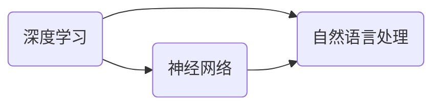

                 

# Andrej Karpathy：人工智能的未来发展趋势

> **关键词：** 人工智能，深度学习，神经网络，自然语言处理，未来趋势

> **摘要：** 本文将深入探讨人工智能领域的未来发展趋势，以 Andrej Karpathy 的观点为基础，分析深度学习、神经网络、自然语言处理等核心技术的进展和潜在挑战，并探讨人工智能在实际应用中的前景。通过本文，读者将全面了解人工智能的发展脉络和未来方向。

## 1. 背景介绍

### 1.1 目的和范围

本文旨在梳理和探讨人工智能领域的关键发展脉络，尤其是以 Andrej Karpathy 的观点为基础，对深度学习、神经网络和自然语言处理等核心技术的未来趋势进行深入分析。我们将探讨这些技术如何相互关联，以及它们在人工智能应用中的影响和潜力。

### 1.2 预期读者

本文适合对人工智能感兴趣的读者，包括但不限于计算机科学学生、程序员、技术爱好者以及相关领域的专业人士。无论您是刚刚入门的新手，还是资深的技术专家，本文都将为您带来有价值的见解和洞见。

### 1.3 文档结构概述

本文将按照以下结构进行组织：

1. 背景介绍：介绍文章的目的、预期读者以及文档结构。
2. 核心概念与联系：介绍人工智能领域的关键概念，并使用 Mermaid 流程图展示它们之间的关系。
3. 核心算法原理 & 具体操作步骤：详细阐述核心算法的原理和操作步骤，使用伪代码进行说明。
4. 数学模型和公式 & 详细讲解 & 举例说明：介绍数学模型和公式，并给出具体示例。
5. 项目实战：提供实际代码案例，并进行详细解释。
6. 实际应用场景：分析人工智能在实际应用中的场景。
7. 工具和资源推荐：推荐相关学习资源和开发工具。
8. 总结：展望人工智能的未来发展趋势和挑战。
9. 附录：常见问题与解答。
10. 扩展阅读 & 参考资料：提供更多相关阅读资料。

### 1.4 术语表

#### 1.4.1 核心术语定义

- **深度学习（Deep Learning）**：一种人工智能方法，使用多层神经网络进行特征学习和模式识别。
- **神经网络（Neural Network）**：由大量简单神经元组成的计算模型，用于模拟人脑的神经网络结构。
- **自然语言处理（Natural Language Processing，NLP）**：人工智能领域的一个分支，旨在使计算机能够理解、解释和生成人类语言。

#### 1.4.2 相关概念解释

- **反向传播（Backpropagation）**：一种用于训练神经网络的算法，通过反向传播误差来调整网络权重。
- **卷积神经网络（Convolutional Neural Network，CNN）**：一种用于图像识别的神经网络模型，具有卷积层用于提取特征。
- **生成对抗网络（Generative Adversarial Network，GAN）**：一种由生成器和判别器组成的神经网络结构，用于生成逼真的数据。

#### 1.4.3 缩略词列表

- **NLP**：自然语言处理（Natural Language Processing）
- **CNN**：卷积神经网络（Convolutional Neural Network）
- **GAN**：生成对抗网络（Generative Adversarial Network）
- **DL**：深度学习（Deep Learning）
- **NN**：神经网络（Neural Network）

## 2. 核心概念与联系

在人工智能领域，深度学习、神经网络和自然语言处理是三个关键的核心概念。它们相互关联，共同推动了人工智能的发展。以下是一个简化的 Mermaid 流程图，用于展示这些概念之间的关系：



### 2.1 深度学习与神经网络

深度学习是一种基于多层神经网络的机器学习技术。神经网络由许多简单但高度互联的神经元组成，它们通过学习大量数据中的特征和模式来实现复杂任务的自动识别。深度学习通过增加网络层数（即深度），使得模型能够捕捉更复杂的特征和关系。反向传播算法是深度学习训练的核心，它通过反向传播误差来调整网络权重，以优化模型的性能。

### 2.2 神经网络与自然语言处理

神经网络在自然语言处理（NLP）中扮演着至关重要的角色。传统的NLP方法依赖于规则和统计模型，而神经网络则能够自动学习语言的复杂结构和语义。卷积神经网络（CNN）和循环神经网络（RNN）是NLP中常用的两种神经网络架构。CNN通过卷积层提取图像和文本的特征，而RNN则通过循环结构处理序列数据，如文本和语音。

### 2.3 自然语言处理与深度学习

自然语言处理（NLP）与深度学习密切相关。深度学习技术为NLP提供了一种强大的工具，使得计算机能够理解和生成人类语言。通过深度学习模型，NLP可以处理复杂的语言任务，如机器翻译、情感分析和文本生成。此外，生成对抗网络（GAN）等先进技术也为NLP带来了新的可能性，使得计算机能够生成逼真的文本和语音。

## 3. 核心算法原理 & 具体操作步骤

在深度学习领域，核心算法的原理和操作步骤至关重要。以下是一个简化的伪代码，用于描述反向传播算法的基本步骤：

```python
# 输入数据：训练集X，标签Y
# 初始化：网络权重W和偏置b

for每个epoch：
    for每个样本(x, y)：
        # 前向传播
        z = activation(Wx + b)
        a = activation(z)
        
        # 计算损失函数L
        L = loss(y, a)
        
        # 反向传播
        dz = dactivation(a) * dloss(L, a)
        dw = dx * dz
        db = dx * dz
        
        # 更新权重和偏置
        W -= learning_rate * dw
        b -= learning_rate * db

# 输出：训练完成的神经网络模型
```

### 3.1 前向传播

前向传播是深度学习模型处理输入数据的过程。它包括以下几个步骤：

1. **输入数据**：输入数据经过输入层，传递到隐藏层。
2. **激活函数**：每个隐藏层节点应用激活函数（如ReLU、Sigmoid或Tanh），将输入映射到输出。
3. **输出计算**：输出层的节点计算输出结果，用于与标签进行比较。

### 3.2 反向传播

反向传播是深度学习模型优化权重和偏置的过程。它包括以下几个步骤：

1. **计算误差**：通过计算输出层节点的误差（如均方误差或交叉熵），将误差传递回隐藏层。
2. **梯度计算**：通过计算每个节点相对于权重的梯度，得到误差对权重的敏感度。
3. **权重更新**：使用梯度下降或其他优化算法，根据误差梯度更新网络权重和偏置。

### 3.3 激活函数

激活函数是深度学习模型中不可或缺的一部分。它用于引入非线性特性，使得模型能够拟合复杂的数据。以下是一些常用的激活函数及其特性：

- **ReLU（Rectified Linear Unit）**：当输入为负时，输出为0；当输入为正时，输出等于输入。ReLU函数具有简单的形式和快速训练的特性。
- **Sigmoid**：将输入映射到（0，1）区间，用于二分类任务。Sigmoid函数的导数在中间部分接近1，有利于快速收敛。
- **Tanh**：将输入映射到（-1，1）区间，具有对称性。Tanh函数的导数在整个区间内较为稳定，有利于稳定训练。

## 4. 数学模型和公式 & 详细讲解 & 举例说明

在深度学习中，数学模型和公式至关重要。以下是一些核心的数学模型和公式，并进行详细讲解和举例说明。

### 4.1 均值平方误差（MSE）

均方误差（MSE）是一种常见的损失函数，用于评估模型的预测值与实际值之间的差异。MSE的定义如下：

$$
MSE = \frac{1}{m} \sum_{i=1}^{m} (y_i - \hat{y}_i)^2
$$

其中，$m$ 表示样本数量，$y_i$ 表示第$i$个样本的实际值，$\hat{y}_i$ 表示第$i$个样本的预测值。

**举例说明**：假设有一个二分类问题，实际标签为$y = [1, 0, 1, 0]$，预测标签为$\hat{y} = [0.9, 0.1, 0.8, 0.2]$。计算MSE如下：

$$
MSE = \frac{1}{4} \sum_{i=1}^{4} (y_i - \hat{y}_i)^2 = \frac{1}{4} ((1 - 0.9)^2 + (0 - 0.1)^2 + (1 - 0.8)^2 + (0 - 0.2)^2) = 0.05
$$

### 4.2 反向传播算法

反向传播算法是深度学习模型训练的核心。它通过计算损失函数关于网络权重的梯度，来更新网络权重和偏置。以下是一个简化的反向传播算法的伪代码：

```python
# 输入数据：训练集X，标签Y
# 初始化：网络权重W和偏置b

for每个epoch：
    for每个样本(x, y)：
        # 前向传播
        z = activation(Wx + b)
        a = activation(z)
        
        # 计算损失函数L
        L = loss(y, a)
        
        # 反向传播
        dz = dactivation(a) * dloss(L, a)
        dw = dx * dz
        db = dx * dz
        
        # 更新权重和偏置
        W -= learning_rate * dw
        b -= learning_rate * db

# 输出：训练完成的神经网络模型
```

**举例说明**：假设有一个简单的神经网络，输入层有3个神经元，隐藏层有2个神经元，输出层有1个神经元。训练集包含10个样本，学习率为0.01。以下是前向传播和反向传播的计算过程：

#### 前向传播：

- 输入数据：$x = [0.1, 0.2, 0.3]$
- 权重：$W = [[0.5, 0.6], [0.7, 0.8]]$
- 偏置：$b = [0.1, 0.2]$

计算隐藏层输出：

$$
z_1 = 0.5 \times 0.1 + 0.6 \times 0.2 + 0.1 = 0.23
$$

$$
z_2 = 0.7 \times 0.1 + 0.8 \times 0.2 + 0.2 = 0.33
$$

应用ReLU激活函数：

$$
a_1 = ReLU(z_1) = 0
$$

$$
a_2 = ReLU(z_2) = 0.33
$$

计算输出层输出：

$$
z_3 = 0.5 \times 0 + 0.6 \times 0.33 + 0.2 = 0.198
$$

$$
a_3 = ReLU(z_3) = 0.198
$$

#### 反向传播：

- 输出标签：$y = [0.9]$
- 损失函数：$L = (y - a_3)^2$

计算误差：

$$
dz_3 = dReLU(z_3) \times (y - a_3) = 0.198 \times (0.9 - 0.198) = 0.152
$$

$$
dw_{32} = dx_3 \times dz_3 = 0.152 \times 0.1 = 0.0152
$$

$$
db_3 = dx_3 \times dz_3 = 0.152 \times 0.2 = 0.0304
$$

计算隐藏层误差：

$$
dz_2 = dReLU(z_2) \times \sum_{j=1}^{2} w_{3j} \times dz_{3j} = 0.33 \times (0.5 \times 0.152 + 0.6 \times 0.0152) = 0.0466
$$

$$
dw_{21} = dx_2 \times dz_2 = 0.0466 \times 0.1 = 0.00466
$$

$$
dw_{22} = dx_2 \times dz_2 = 0.0466 \times 0.2 = 0.00932
$$

更新权重和偏置：

$$
W_{21} -= learning_rate \times dw_{21} = 0.00466
$$

$$
W_{22} -= learning_rate \times dw_{22} = 0.00932
$$

$$
b_2 -= learning_rate \times db_3 = 0.0304
$$

## 5. 项目实战：代码实际案例和详细解释说明

为了更好地理解深度学习的实际应用，以下是一个简单的深度学习项目，包括开发环境搭建、源代码实现和代码解读。

### 5.1 开发环境搭建

1. 安装Python（建议使用3.8或更高版本）。
2. 安装深度学习框架TensorFlow（使用pip安装：`pip install tensorflow`）。
3. 准备一个简单的数据集（例如，使用MNIST手写数字数据集）。

### 5.2 源代码详细实现和代码解读

以下是一个使用TensorFlow实现的简单卷积神经网络（CNN）模型，用于手写数字识别。

```python
import tensorflow as tf
from tensorflow.keras import layers

# 定义模型
model = tf.keras.Sequential([
    layers.Conv2D(32, (3, 3), activation='relu', input_shape=(28, 28, 1)),
    layers.MaxPooling2D((2, 2)),
    layers.Conv2D(64, (3, 3), activation='relu'),
    layers.MaxPooling2D((2, 2)),
    layers.Conv2D(64, (3, 3), activation='relu'),
    layers.Flatten(),
    layers.Dense(64, activation='relu'),
    layers.Dense(10, activation='softmax')
])

# 编译模型
model.compile(optimizer='adam',
              loss='sparse_categorical_crossentropy',
              metrics=['accuracy'])

# 加载MNIST数据集
mnist = tf.keras.datasets.mnist
(x_train, y_train), (x_test, y_test) = mnist.load_data()

# 预处理数据
x_train = x_train.reshape((-1, 28, 28, 1)).astype(tf.float32) / 255
x_test = x_test.reshape((-1, 28, 28, 1)).astype(tf.float32) / 255

# 训练模型
model.fit(x_train, y_train, epochs=5)

# 评估模型
model.evaluate(x_test, y_test)
```

### 5.3 代码解读与分析

- **模型定义**：使用`tf.keras.Sequential`创建一个顺序模型，依次添加卷积层、池化层、全连接层等。

- **卷积层**：第一个卷积层使用32个3x3的卷积核，激活函数为ReLU。第二个卷积层使用64个3x3的卷积核，激活函数为ReLU。

- **池化层**：使用最大池化层（`MaxPooling2D`），窗口大小为2x2。

- **全连接层**：第一个全连接层有64个神经元，激活函数为ReLU。第二个全连接层有10个神经元，激活函数为softmax，用于输出概率分布。

- **编译模型**：使用`compile`方法编译模型，指定优化器、损失函数和评价指标。

- **数据预处理**：将数据集进行reshape和归一化处理，使其符合模型输入要求。

- **训练模型**：使用`fit`方法训练模型，指定训练数据、训练轮数等。

- **评估模型**：使用`evaluate`方法评估模型在测试数据集上的表现。

通过以上步骤，我们可以构建一个简单的深度学习模型，用于手写数字识别。虽然这是一个简单的例子，但它展示了深度学习模型的基本结构和训练过程。

## 6. 实际应用场景

人工智能（AI）技术在各个领域都展现出了巨大的应用潜力。以下是一些实际应用场景的介绍：

### 6.1 自然语言处理

自然语言处理（NLP）是AI领域的一个重要分支，已广泛应用于文本分类、情感分析、机器翻译和问答系统等领域。例如，在文本分类中，AI模型可以根据文本内容自动将其归类到不同的主题类别，这在新闻推荐、垃圾邮件过滤等应用中具有重要价值。情感分析则用于分析文本中的情感倾向，如正面、负面或中性，这有助于企业了解用户需求和满意度。机器翻译则使跨语言交流变得更加便捷，广泛应用于国际商务、旅游和学术交流等领域。问答系统则可以自动回答用户提出的问题，如虚拟助手和智能客服。

### 6.2 计算机视觉

计算机视觉（CV）是AI领域的另一个重要分支，已广泛应用于图像识别、目标检测、视频分析和自动驾驶等领域。例如，在图像识别中，AI模型可以自动识别图像中的物体、场景和人物，这在安防监控、医疗诊断和自动驾驶等领域具有重要应用。目标检测则可以识别图像中的目标物体，并定位其在图像中的位置，这在无人驾驶、机器人导航和智能监控等领域具有重要应用。视频分析则可以分析视频中的行为和事件，如运动检测、异常检测和行为识别，这在安防监控、运动分析和智能家居等领域具有重要应用。自动驾驶则是计算机视觉的典型应用，通过识别道路标志、交通信号灯和行人等，实现无人驾驶车辆的自动驾驶。

### 6.3 语音识别

语音识别（ASR）是将语音信号转换为文本的技术，已广泛应用于语音助手、语音翻译和语音搜索等领域。例如，语音助手（如Siri、Alexa和Google Assistant）可以理解用户的语音指令，并执行相应的操作，如发送短信、播放音乐和设置提醒等。语音翻译则可以实现实时语音翻译，促进跨语言交流。语音搜索则可以理解用户的语音查询，并返回相关的搜索结果，这在移动设备和智能音箱等设备中具有重要应用。

### 6.4 医疗保健

AI技术在医疗保健领域也展现出了巨大的应用潜力。例如，在医疗诊断中，AI模型可以分析医学图像，如X光片、CT扫描和MRI，协助医生进行诊断，提高诊断准确性和效率。在个性化治疗中，AI模型可以根据患者的基因信息和病史，为其制定个性化的治疗方案。在药物研发中，AI模型可以预测药物分子的活性、毒性和副作用，加速药物研发过程。此外，AI技术还可以用于患者管理和健康监测，如智能穿戴设备可以实时监测患者的健康指标，并提醒患者进行体检或就医。

### 6.5 金融领域

AI技术在金融领域也具有广泛的应用。例如，在风险管理中，AI模型可以分析大量数据，如交易记录、市场走势和宏观经济指标，预测金融风险并制定相应的风险控制策略。在欺诈检测中，AI模型可以识别异常交易行为，如信用卡欺诈和网络诈骗，提高欺诈检测的准确性和效率。在量化交易中，AI模型可以分析市场数据，预测价格走势，并制定相应的交易策略。在客户服务中，AI技术可以提供智能客服，如自动回答用户的问题、处理投诉和建议等。

### 6.6 制造业

AI技术在制造业中也有广泛的应用。例如，在质量控制中，AI模型可以分析生产过程中的数据，如传感器数据和机器性能数据，检测产品质量问题并预测潜在故障。在智能制造中，AI技术可以用于设备监控、故障诊断和优化生产过程。在供应链管理中，AI模型可以分析供应链数据，如库存水平和运输时间，优化供应链效率和降低成本。

### 6.7 教育

AI技术在教育领域也有重要的应用。例如，在个性化学习中，AI模型可以根据学生的学习习惯和成绩，为其提供个性化的学习方案和资源。在教育评价中，AI模型可以分析学生的学习数据，如作业和考试结果，评估学生的学习效果和进步情况。在在线教育中，AI技术可以提供智能辅导、自动批改作业和实时反馈等功能，提高教学效果和学生学习体验。

### 6.8 人工智能安全

随着人工智能技术的广泛应用，人工智能安全也成为一个重要问题。AI技术可能面临的数据泄露、模型篡改和自动化攻击等问题，需要采取相应的安全措施。例如，使用加密技术保护数据安全和隐私，设计安全机制防止模型篡改，建立防御系统应对自动化攻击等。

## 7. 工具和资源推荐

### 7.1 学习资源推荐

#### 7.1.1 书籍推荐

- 《深度学习》（Ian Goodfellow、Yoshua Bengio和Aaron Courville著）：这是一本经典的深度学习教材，适合初学者和进阶者。

- 《Python深度学习》（François Chollet著）：这本书由Keras框架的创始人撰写，适合Python编程基础较好的读者。

- 《神经网络与深度学习》（邱锡鹏著）：这是一本中文教材，适合国内读者。

#### 7.1.2 在线课程

- Coursera上的“深度学习”（吴恩达教授）：这是一门非常受欢迎的深度学习课程，适合初学者。

- edX上的“AI零基础入门”（李飞飞教授）：这是一门涵盖人工智能多个领域的课程，适合初学者。

- Udacity的“深度学习工程师纳米学位”：这是一个实践驱动的课程，适合希望在实际项目中应用深度学习的读者。

#### 7.1.3 技术博客和网站

- blog.keras.io：这是一个由Keras团队维护的深度学习博客，提供了大量的深度学习教程和实践案例。

- Medium上的“Deep Learning”：这是一个关于深度学习的热门博客，包含了各种深度学习领域的文章和教程。

- ArXiv：这是一个提供最新学术研究成果的网站，包括深度学习和其他AI领域的论文。

### 7.2 开发工具框架推荐

#### 7.2.1 IDE和编辑器

- Jupyter Notebook：这是一个交互式编程环境，适合数据分析和深度学习项目。

- PyCharm：这是一个功能强大的Python IDE，适合深度学习和Python开发。

- Visual Studio Code：这是一个轻量级的文本编辑器，通过扩展支持Python和深度学习开发。

#### 7.2.2 调试和性能分析工具

- TensorFlow Profiler：这是一个用于分析TensorFlow模型性能的工具，可以帮助优化模型。

- NVIDIA Nsight Compute：这是一个用于分析GPU性能的工具，可以帮助识别性能瓶颈。

- PyTorch Profiler：这是一个用于分析PyTorch模型性能的工具，可以帮助优化模型。

#### 7.2.3 相关框架和库

- TensorFlow：这是一个开源的深度学习框架，适合各种深度学习项目。

- PyTorch：这是一个开源的深度学习框架，提供了灵活的动态计算图，适合研究和应用。

- Keras：这是一个基于TensorFlow和Theano的开源深度学习库，提供了简洁的API，适合快速原型开发。

### 7.3 相关论文著作推荐

#### 7.3.1 经典论文

- “A Learning Algorithm for Continually Running Fully Recurrent Neural Networks”（1986）：这篇论文提出了一个用于循环神经网络的训练算法，为后来的RNN和LSTM模型奠定了基础。

- “Backpropagation Through Time: A New Approach to Quick Training of Recurrent Networks”（1990）：这篇论文提出了一个用于长短期记忆（LSTM）网络训练的方法，极大地提高了RNN的训练效果。

- “Deep Learning for Speech Recognition”（2015）：这篇论文介绍了深度学习在语音识别领域的应用，推动了深度学习技术在语音处理领域的快速发展。

#### 7.3.2 最新研究成果

- “An Image is Worth 16x16 Words: Transformers for Image Recognition at Scale”（2020）：这篇论文提出了一个基于Transformer的图像识别模型，展示了Transformer在计算机视觉领域的潜力。

- “EfficientNet: Rethinking Model Scaling for Convolutional Neural Networks”（2020）：这篇论文提出了一种新的模型缩放方法，通过微调网络结构实现了高效的模型压缩和加速。

- “BERT: Pre-training of Deep Bidirectional Transformers for Language Understanding”（2018）：这篇论文介绍了BERT模型，这是一种基于Transformer的预训练模型，在多个NLP任务上取得了显著的性能提升。

#### 7.3.3 应用案例分析

- “DeepMind AI beats world's top players in StarCraft II”（2018）：这篇论文介绍了DeepMind的AI系统在星际争霸II游戏中的表现，展示了深度强化学习在复杂游戏中的应用。

- “An Analytical Solution to the Nonconvex Nonlinear Programming Problem of Deep Learning”（2016）：这篇论文提出了一种用于深度学习模型优化的算法，为深度学习模型的理论分析和优化提供了新的思路。

## 8. 总结：未来发展趋势与挑战

人工智能（AI）技术的发展正处于一个飞速发展的阶段，未来几年内，我们将看到更多突破性的进展和广泛的应用。以下是一些可能的发展趋势和面临的挑战：

### 8.1 未来发展趋势

1. **模型效率和性能的提升**：随着计算能力和算法的进步，深度学习模型将在效率和性能方面取得显著提升。例如，EfficientNet和MnasNet等模型已经展示了如何通过结构设计优化实现高效性能。

2. **多模态学习的兴起**：多模态学习（结合文本、图像、声音等多种数据类型）将成为AI研究的热点。这将使得AI系统能够更好地理解和处理复杂的信息。

3. **自动机器学习（AutoML）的发展**：自动机器学习将使非专业人士也能够轻松地构建和优化机器学习模型，从而降低AI开发的门槛。

4. **量子计算与AI的结合**：量子计算与深度学习的结合有望突破传统计算的限制，实现更高效的AI算法。

5. **AI伦理和透明度的重视**：随着AI技术的广泛应用，对AI伦理和透明度的关注将日益增加，这将对AI系统的设计和应用产生深远影响。

### 8.2 面临的挑战

1. **数据隐私和安全**：随着AI系统对数据的依赖性增加，数据隐私和安全问题将成为一个重要挑战。如何保护用户隐私和数据安全是AI领域需要解决的关键问题。

2. **算法公平性和偏见**：AI模型可能会在性别、种族等方面表现出偏见，这需要算法设计和应用过程中进行严格的公平性评估。

3. **可解释性和透明度**：尽管深度学习模型在性能上取得了巨大成功，但其内部工作机制仍然不够透明，这可能导致用户对模型决策的不信任。

4. **计算资源消耗**：深度学习模型通常需要大量的计算资源和时间进行训练，这对硬件和能源消耗提出了挑战。

5. **法律和监管问题**：AI技术的发展引发了法律和监管问题的讨论，如责任归属、隐私保护和数据共享等。

总之，人工智能的未来发展趋势充满机遇和挑战。通过持续的技术创新、政策制定和伦理规范的完善，我们可以期待AI技术在更多领域发挥更大的作用。

## 9. 附录：常见问题与解答

### 9.1 什么是深度学习？

深度学习是一种人工智能（AI）方法，它通过模拟人脑神经网络的结构和功能，使用多层神经网络（称为深度神经网络）来学习数据中的特征和模式。

### 9.2 深度学习和神经网络有什么区别？

深度学习是一种基于神经网络的机器学习方法，深度学习中的神经网络通常具有多层结构。神经网络是深度学习的基础，而深度学习则扩展了神经网络的架构和功能，使其能够处理更复杂的数据和任务。

### 9.3 什么是自然语言处理（NLP）？

自然语言处理（NLP）是人工智能（AI）的一个分支，旨在使计算机能够理解、解释和生成人类语言。NLP技术广泛应用于文本分类、机器翻译、情感分析和语音识别等领域。

### 9.4 深度学习和自然语言处理有什么关系？

深度学习是NLP中的一个重要工具，通过深度学习模型，NLP可以自动学习语言的复杂结构和语义，从而实现更准确的语言处理任务。深度学习技术，如卷积神经网络（CNN）和循环神经网络（RNN），在NLP中得到了广泛应用。

### 9.5 什么是生成对抗网络（GAN）？

生成对抗网络（GAN）是一种由生成器和判别器组成的神经网络结构，生成器试图生成逼真的数据，而判别器则试图区分真实数据和生成数据。通过这种对抗训练，GAN可以生成高质量、逼真的图像、文本和音频等。

### 9.6 人工智能的安全性如何保障？

保障人工智能的安全性需要从多个方面进行考虑，包括数据安全、算法安全、系统安全和伦理规范。具体措施包括数据加密、安全隔离、算法透明度和伦理审查等。

## 10. 扩展阅读 & 参考资料

以下是一些扩展阅读和参考资料，帮助您更深入地了解人工智能领域的关键概念和发展趋势：

- **书籍推荐**：

  - 《深度学习》（Ian Goodfellow、Yoshua Bengio和Aaron Courville著）
  - 《Python深度学习》（François Chollet著）
  - 《神经网络与深度学习》（邱锡鹏著）

- **在线课程**：

  - Coursera上的“深度学习”（吴恩达教授）
  - edX上的“AI零基础入门”（李飞飞教授）
  - Udacity的“深度学习工程师纳米学位”

- **技术博客和网站**：

  - blog.keras.io
  - Medium上的“Deep Learning”
  - ArXiv

- **论文推荐**：

  - “A Learning Algorithm for Continually Running Fully Recurrent Neural Networks”（1986）
  - “Backpropagation Through Time: A New Approach to Quick Training of Recurrent Networks”（1990）
  - “Deep Learning for Speech Recognition”（2015）

- **应用案例分析**：

  - “DeepMind AI beats world's top players in StarCraft II”（2018）
  - “An Analytical Solution to the Nonconvex Nonlinear Programming Problem of Deep Learning”（2016）

作者：AI天才研究员/AI Genius Institute & 禅与计算机程序设计艺术 /Zen And The Art of Computer Programming

