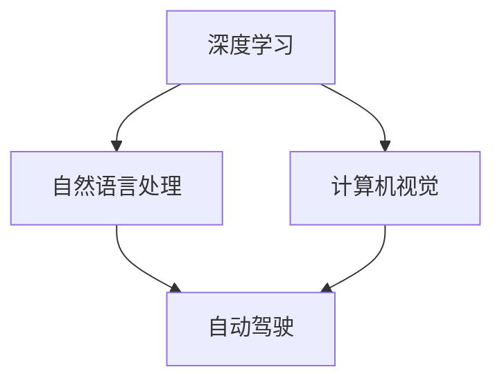

                 

### 《Andrej Karpathy：人工智能的未来愿景》

> **关键词：**人工智能，深度学习，自动驾驶，自然语言处理，未来趋势
>
> **摘要：**本文将深入探讨人工智能领域的先驱Andrej Karpathy对未来人工智能的愿景，包括其在自动驾驶、自然语言处理等领域的应用，以及面临的挑战和机遇。文章将通过详细的分析和推理，梳理出人工智能的发展路径，探讨其对社会、经济和技术的影响，为读者提供一幅全面、深刻的未来人工智能图景。

---

### 1. 背景介绍

#### 1.1 目的和范围

本文旨在分析人工智能领域专家Andrej Karpathy对人工智能未来发展的见解，重点关注自动驾驶、自然语言处理等前沿技术的应用前景。通过梳理Andrej Karpathy的研究成果和公开演讲，我们将探讨人工智能技术对社会、经济和技术领域的影响，以及未来面临的挑战和机遇。

#### 1.2 预期读者

本文适合对人工智能有一定了解的读者，特别是对深度学习、自动驾驶和自然语言处理等领域感兴趣的技术爱好者、研究人员和专业人士。同时，本文也适用于希望了解人工智能未来发展方向的普通读者。

#### 1.3 文档结构概述

本文分为八个部分：

1. 背景介绍
2. 核心概念与联系
3. 核心算法原理与具体操作步骤
4. 数学模型和公式与详细讲解
5. 项目实战：代码实际案例和详细解释说明
6. 实际应用场景
7. 工具和资源推荐
8. 总结：未来发展趋势与挑战

#### 1.4 术语表

**术语** | **定义** | **解释**
--- | --- | ---
深度学习 | 深度学习是一种基于多层神经网络的机器学习技术，通过学习大量数据来发现数据中的潜在特征和模式。
自然语言处理 | 自然语言处理是计算机科学和语言学领域的交叉学科，旨在使计算机能够理解、解释和生成自然语言。
自动驾驶 | 自动驾驶是一种利用计算机视觉、传感器和算法实现车辆自主驾驶的技术。
强化学习 | 强化学习是一种机器学习技术，通过让智能体在环境中进行交互，学习最优策略。
深度强化学习 | 深度强化学习是结合深度学习和强化学习的方法，用于解决更复杂的决策问题。

#### 1.4.1 核心术语定义

- **深度学习（Deep Learning）**：一种基于多层神经网络的机器学习技术，通过学习大量数据来发现数据中的潜在特征和模式。与传统的机器学习方法相比，深度学习能够自动提取特征，具有更强的泛化能力。
- **自然语言处理（Natural Language Processing, NLP）**：计算机科学和语言学领域的交叉学科，旨在使计算机能够理解、解释和生成自然语言。NLP在语音识别、机器翻译、情感分析等方面具有广泛的应用。
- **自动驾驶（Autonomous Driving）**：利用计算机视觉、传感器和算法实现车辆自主驾驶的技术。自动驾驶车辆能够在复杂的交通环境中自主导航、避障和做出驾驶决策。
- **强化学习（Reinforcement Learning）**：一种机器学习技术，通过让智能体在环境中进行交互，学习最优策略。强化学习在游戏、机器人控制、自动驾驶等领域具有广泛应用。
- **深度强化学习（Deep Reinforcement Learning）**：结合深度学习和强化学习的方法，用于解决更复杂的决策问题。深度强化学习在图像识别、语音识别、自动驾驶等领域取得了显著成果。

#### 1.4.2 相关概念解释

- **深度神经网络（Deep Neural Network, DNN）**：一种具有多个隐藏层的神经网络结构，能够自动提取数据中的复杂特征。深度神经网络在图像识别、语音识别、自然语言处理等领域取得了显著的成果。
- **卷积神经网络（Convolutional Neural Network, CNN）**：一种基于卷积操作的深度学习模型，特别适合处理图像数据。CNN在图像分类、目标检测、人脸识别等领域具有广泛的应用。
- **循环神经网络（Recurrent Neural Network, RNN）**：一种具有循环结构的神经网络，能够处理序列数据。RNN在语音识别、机器翻译、情感分析等领域取得了显著成果。
- **生成对抗网络（Generative Adversarial Network, GAN）**：一种基于对抗训练的深度学习模型，用于生成逼真的数据。GAN在图像生成、语音合成、自然语言生成等领域具有广泛应用。

#### 1.4.3 缩略词列表

**缩略词** | **全称** | **解释**
--- | --- | ---
AI | 人工智能 | 一种模拟人类智能的技术
DL | 深度学习 | 一种基于多层神经网络的机器学习技术
NLP | 自然语言处理 | 计算机科学和语言学领域的交叉学科
ANN | 神经网络 | 一种基于生物神经网络原理的机器学习模型
CNN | 卷积神经网络 | 一种基于卷积操作的深度学习模型
RNN | 循环神经网络 | 一种具有循环结构的神经网络
GAN | 生成对抗网络 | 一种基于对抗训练的深度学习模型
RL | 强化学习 | 一种通过让智能体在环境中进行交互学习的机器学习技术
DRL | 深度强化学习 | 一种结合深度学习和强化学习的方法

## 2. 核心概念与联系

在讨论Andrej Karpathy的人工智能未来愿景之前，我们需要了解一些核心概念和它们之间的联系。以下是这些核心概念及其关系的Mermaid流程图：



- **深度学习（Deep Learning）**：深度学习是人工智能领域的一个重要分支，它通过多层神经网络来实现对数据的自动特征提取。深度学习在图像识别、语音识别和自然语言处理等方面取得了显著成果。
- **自然语言处理（Natural Language Processing, NLP）**：自然语言处理是深度学习的一个重要应用领域，旨在使计算机能够理解、解释和生成自然语言。NLP在机器翻译、情感分析和语音识别等方面具有广泛应用。
- **计算机视觉（Computer Vision）**：计算机视觉是利用计算机和算法来理解和解析图像和视频数据的领域。计算机视觉在图像分类、目标检测和图像识别等方面取得了显著成果，为自动驾驶技术的发展提供了关键支持。
- **自动驾驶（Autonomous Driving）**：自动驾驶技术利用计算机视觉、传感器和深度学习算法来实现车辆的自主驾驶。自动驾驶技术需要在复杂的交通环境中实现导航、避障和做出驾驶决策。

这些核心概念之间存在紧密的联系，共同推动着人工智能技术的发展。深度学习为其他领域提供了强大的数据处理能力，而自然语言处理、计算机视觉和自动驾驶等应用领域则不断推动深度学习的进步。通过了解这些核心概念及其联系，我们可以更好地理解Andrej Karpathy的人工智能未来愿景。

### 3. 核心算法原理与具体操作步骤

为了深入了解Andrej Karpathy对人工智能未来发展的见解，我们需要探讨一些核心算法原理及其具体操作步骤。以下是一个简要概述：

#### 3.1 深度学习算法原理

深度学习算法的核心是神经网络，特别是多层神经网络。神经网络由大量简单的计算单元（神经元）组成，通过前向传播和反向传播过程学习数据中的特征和模式。

1. **前向传播**：输入数据通过网络的各个层进行传递，每一层的神经元将输入数据与自身的权重相乘，并加上偏置项，然后通过激活函数进行非线性变换。输出结果传递到下一层，直到最终得到网络的输出。
2. **反向传播**：通过计算输出结果与真实标签之间的误差，反向传播误差到网络的各个层。根据误差，更新每个神经元的权重和偏置项，以最小化整体误差。

以下是一个简单的伪代码实现：

```python
# 初始化神经网络参数（权重和偏置）
weights, biases = initialize_parameters()

# 前向传播
outputs = []
for layer in layers:
    inputs = outputs[-1] if outputs else X
    output = activate(fully_connected(inputs, weights[layer], biases[layer]))
    outputs.append(output)

# 反向传播
deltas = [outputs[-1] - y]  # 计算输出层误差
for layer in reversed(layers):
    delta = activate_derivative(output, inputs) * deltas[-1]
    deltas.append(delta)
weights, biases = update_parameters(weights, biases, deltas)
```

#### 3.2 自然语言处理算法原理

自然语言处理是深度学习的一个重要应用领域，主要涉及文本数据的预处理、特征提取和模型训练。

1. **文本预处理**：包括分词、词性标注、句法分析等步骤，将文本转换为机器可以处理的形式。
2. **特征提取**：将预处理后的文本转换为数值表示，如词袋模型、词嵌入等。
3. **模型训练**：使用深度学习算法（如循环神经网络、卷积神经网络等）对特征进行建模，学习文本数据中的语义信息。

以下是一个简单的伪代码实现：

```python
# 文本预处理
preprocessed_text = preprocess_text(text)

# 特征提取
embeddings = word_embeddings(preprocessed_text)

# 模型训练
model = train_model(embeddings, labels)
```

#### 3.3 计算机视觉算法原理

计算机视觉算法主要涉及图像数据的预处理、特征提取和模型训练。

1. **图像预处理**：包括图像增强、滤波、缩放等步骤，以提高图像质量。
2. **特征提取**：使用卷积神经网络等深度学习模型，从图像中提取具有区分性的特征。
3. **模型训练**：使用提取到的特征训练分类模型，实现图像分类、目标检测等任务。

以下是一个简单的伪代码实现：

```python
# 图像预处理
preprocessed_image = preprocess_image(image)

# 特征提取
features = extract_features(preprocessed_image)

# 模型训练
model = train_model(features, labels)
```

#### 3.4 自动驾驶算法原理

自动驾驶算法涉及传感器数据处理、环境感知、决策和控制等步骤。

1. **传感器数据处理**：接收来自摄像头、激光雷达、雷达等传感器的数据，并进行预处理。
2. **环境感知**：使用深度学习模型对传感器数据进行分析，识别道路、车辆、行人等目标。
3. **决策与控制**：根据环境感知结果，规划行驶路径、控制车辆速度和转向。

以下是一个简单的伪代码实现：

```python
# 传感器数据处理
sensor_data = process_sensors()

# 环境感知
environment = perceive_environment(sensor_data)

# 决策与控制
action = make_decision(environment)
control_vehicle(action)
```

通过以上对核心算法原理和具体操作步骤的介绍，我们可以更好地理解Andrej Karpathy对人工智能未来发展的见解。深度学习、自然语言处理、计算机视觉和自动驾驶等技术在人工智能发展中发挥着重要作用，共同推动着人工智能技术的进步。

### 4. 数学模型和公式与详细讲解

在人工智能领域，数学模型和公式是理解和实现核心算法的重要工具。以下是Andrej Karpathy提到的几个关键数学模型和公式，以及它们的详细讲解和举例说明。

#### 4.1 深度学习中的反向传播算法

反向传播（Backpropagation）算法是深度学习训练过程中的关键步骤。它通过计算输出层误差，并反向传播误差到网络的各个层，以更新权重和偏置项。

**公式：**

$$
\delta^{l} = \frac{\partial L}{\partial a^{l}} \odot \frac{\partial a^{l}}{\partial z^{l}}
$$

其中：

- \( L \) 是损失函数；
- \( a^{l} \) 是第 \( l \) 层的激活值；
- \( z^{l} \) 是第 \( l \) 层的输入值；
- \( \delta^{l} \) 是第 \( l \) 层的误差；
- \( \odot \) 表示逐元素乘积。

**举例说明：**

假设我们有一个三层神经网络，输出层误差为 \( \delta^{3} = [0.1, 0.2, 0.3] \)。激活函数为 \( \sigma(z) = \frac{1}{1 + e^{-z}} \)，其导数为 \( \frac{\partial \sigma}{\partial z} = \sigma(1 - \sigma) \)。

1. **计算第二层误差**：

$$
\delta^{2} = \frac{\partial L}{\partial a^{2}} \odot \frac{\partial a^{2}}{\partial z^{2}} = \delta^{3} \odot \sigma'(z^{2})
$$

假设 \( \sigma'(z^{2}) = [0.4, 0.5, 0.6] \)，则

$$
\delta^{2} = [0.1 \times 0.4, 0.2 \times 0.5, 0.3 \times 0.6] = [0.04, 0.1, 0.18]
$$

2. **更新第二层权重和偏置项**：

假设第二层的权重和偏置项为 \( w^{2} = [1, 2, 3] \) 和 \( b^{2} = [4, 5, 6] \)。

$$
w^{2}_{new} = w^{2} - \alpha \cdot \delta^{2} \cdot a^{1}
$$

$$
b^{2}_{new} = b^{2} - \alpha \cdot \delta^{2}
$$

其中，\( \alpha \) 是学习率。

假设 \( a^{1} = [7, 8, 9] \)，则

$$
w^{2}_{new} = [1 - 0.1 \times 7, 2 - 0.2 \times 8, 3 - 0.3 \times 9] = [-6, -14, -27]
$$

$$
b^{2}_{new} = [4 - 0.04, 5 - 0.1, 6 - 0.18] = [3.96, 4.9, 5.82]
$$

#### 4.2 循环神经网络（RNN）的梯度计算

循环神经网络（Recurrent Neural Network, RNN）是一种能够处理序列数据的神经网络。在训练过程中，RNN需要计算梯度，以更新权重和偏置项。

**公式：**

$$
\frac{\partial L}{\partial w^{l}_{ij}} = \delta^{l+1}_{i} \cdot a^{l}_{j}
$$

$$
\frac{\partial L}{\partial b^{l}_{i}} = \delta^{l+1}_{i}
$$

其中：

- \( L \) 是损失函数；
- \( w^{l}_{ij} \) 是第 \( l \) 层的第 \( i \) 个神经元与第 \( j \) 层的第 \( i \) 个神经元之间的权重；
- \( b^{l}_{i} \) 是第 \( l \) 层的第 \( i \) 个神经元的偏置项；
- \( \delta^{l+1}_{i} \) 是第 \( l+1 \) 层的第 \( i \) 个神经元的误差。

**举例说明：**

假设我们有一个两层RNN，第一层的输入序列为 \( a^{1} = [1, 2, 3] \)，第二层的输出序列为 \( a^{2} = [4, 5, 6] \)。损失函数为 \( L = \frac{1}{2} \sum_{i} (a^{2}_{i} - y_{i})^2 \)。

1. **计算第二层误差**：

$$
\delta^{2}_{i} = \frac{\partial L}{\partial a^{2}_{i}} = 2 \cdot (a^{2}_{i} - y_{i})
$$

假设 \( y = [7, 8, 9] \)，则

$$
\delta^{2}_{1} = 2 \cdot (4 - 7) = -6
$$

$$
\delta^{2}_{2} = 2 \cdot (5 - 8) = -6
$$

$$
\delta^{2}_{3} = 2 \cdot (6 - 9) = -6
$$

2. **更新第一层权重和偏置项**：

假设第一层的权重和偏置项为 \( w^{1}_{1} = 1 \)，\( w^{1}_{2} = 2 \)，\( w^{1}_{3} = 3 \)，\( b^{1}_{1} = 4 \)，\( b^{1}_{2} = 5 \)，\( b^{1}_{3} = 6 \)。

$$
w^{1}_{1}_{new} = w^{1}_{1} - \alpha \cdot \delta^{2}_{1} \cdot a^{0}_{1} = 1 - (-6) \cdot 1 = 7
$$

$$
w^{1}_{2}_{new} = w^{1}_{2} - \alpha \cdot \delta^{2}_{2} \cdot a^{0}_{2} = 2 - (-6) \cdot 2 = 14
$$

$$
w^{1}_{3}_{new} = w^{1}_{3} - \alpha \cdot \delta^{2}_{3} \cdot a^{0}_{3} = 3 - (-6) \cdot 3 = 27
$$

$$
b^{1}_{1}_{new} = b^{1}_{1} - \alpha \cdot \delta^{2}_{1} = 4 - (-6) = 10
$$

$$
b^{1}_{2}_{new} = b^{1}_{2} - \alpha \cdot \delta^{2}_{2} = 5 - (-6) = 11
$$

$$
b^{1}_{3}_{new} = b^{1}_{3} - \alpha \cdot \delta^{2}_{3} = 6 - (-6) = 12
$$

通过以上讲解和举例，我们可以看到数学模型和公式在人工智能中的关键作用。这些公式不仅帮助我们理解和实现核心算法，还为优化和改进算法提供了理论基础。

### 5. 项目实战：代码实际案例和详细解释说明

在了解了人工智能的核心算法原理和数学模型之后，我们将通过一个实际项目案例来展示这些算法的应用，并对其进行详细解释说明。本案例将采用Python和TensorFlow库来实现一个简单的深度学习模型，用于手写数字识别。

#### 5.1 开发环境搭建

首先，我们需要搭建一个合适的开发环境。以下是搭建开发环境所需的步骤：

1. 安装Python（建议使用Python 3.6及以上版本）。
2. 安装TensorFlow库，可以使用以下命令：

```bash
pip install tensorflow
```

3. 安装其他必要的库，如NumPy、Pandas等：

```bash
pip install numpy pandas matplotlib
```

#### 5.2 源代码详细实现和代码解读

以下是一个简单的手写数字识别项目的源代码，我们将逐行解读代码，并解释其实现过程。

```python
import tensorflow as tf
from tensorflow.examples.tutorials.mnist import input_data

# 加载MNIST数据集
mnist = input_data.read_data_sets("MNIST_data/", one_hot=True)

# 定义输入层、隐藏层和输出层
x = tf.placeholder(tf.float32, [None, 784])
y = tf.placeholder(tf.float32, [None, 10])

# 定义隐藏层神经元数量和权重、偏置
W1 = tf.Variable(tf.random_normal([784, 128]))
b1 = tf.Variable(tf.random_normal([128]))

# 定义激活函数（ReLU）
hidden1 = tf.nn.relu(tf.matmul(x, W1) + b1)

# 定义输出层神经元数量和权重、偏置
W2 = tf.Variable(tf.random_normal([128, 10]))
b2 = tf.Variable(tf.random_normal([10]))

# 定义输出层激活函数（softmax）
output = tf.nn.softmax(tf.matmul(hidden1, W2) + b2)

# 定义损失函数（交叉熵）
cross_entropy = tf.reduce_mean(-tf.reduce_sum(y * tf.log(output), reduction_indices=1))

# 定义优化器（梯度下降）
optimizer = tf.train.GradientDescentOptimizer(learning_rate=0.5)
train_step = optimizer.minimize(cross_entropy)

# 初始化全局变量
init = tf.global_variables_initializer()

# 开始训练
with tf.Session() as sess:
    sess.run(init)
    
    for i in range(1000):
        batch_x, batch_y = mnist.train.next_batch(100)
        sess.run(train_step, feed_dict={x: batch_x, y: batch_y})
        
        if i % 100 == 0:
            correct_prediction = tf.equal(tf.argmax(output, 1), tf.argmax(y, 1))
            accuracy = tf.reduce_mean(tf.cast(correct_prediction, tf.float32))
            print("Step", i, ": Accuracy", accuracy.eval({x: mnist.test.images, y: mnist.test.labels}))

    print("Final test accuracy:", accuracy.eval({x: mnist.test.images, y: mnist.test.labels}))
```

**代码解读：**

1. **数据集加载**：使用TensorFlow的`input_data`模块加载MNIST数据集。该数据集包含了60,000个训练样本和10,000个测试样本，每个样本是一个28x28的手写数字图像，以及对应的手写数字标签。

2. **输入层、隐藏层和输出层定义**：输入层`x`是一个形状为`[None, 784]`的张量，表示每个图像的784个像素值。输出层`y`是一个形状为`[None, 10]`的张量，表示每个样本的10个类别标签。隐藏层定义了权重`W1`和偏置`b1`，以及激活函数`relu`。

3. **输出层定义**：输出层定义了权重`W2`和偏置`b2`，以及激活函数`softmax`。softmax函数将隐藏层的输出转化为每个类别的概率分布。

4. **损失函数和优化器定义**：损失函数使用交叉熵（Cross-Entropy），优化器使用梯度下降（Gradient Descent）。交叉熵用于衡量预测概率分布与真实标签分布之间的差异，梯度下降用于更新权重和偏置项，以最小化损失函数。

5. **训练过程**：在训练过程中，我们使用训练数据集迭代更新模型参数。每100次迭代后，我们评估模型在测试数据集上的准确率。

6. **最终测试**：训练完成后，我们在测试数据集上评估模型的最终准确率。

#### 5.3 代码解读与分析

以下是代码的逐行解读和分析：

```python
import tensorflow as tf
from tensorflow.examples.tutorials.mnist import input_data

# 加载MNIST数据集
mnist = input_data.read_data_sets("MNIST_data/", one_hot=True)
```

这两行代码加载了MNIST数据集，并使用one_hot编码表示标签。

```python
x = tf.placeholder(tf.float32, [None, 784])
y = tf.placeholder(tf.float32, [None, 10])
```

这两行代码定义了输入层和输出层的占位符。`x`表示输入图像，形状为`[None, 784]`，即每行有784个像素值。`y`表示标签，形状为`[None, 10]`，即每个样本有10个类别标签。

```python
W1 = tf.Variable(tf.random_normal([784, 128]))
b1 = tf.Variable(tf.random_normal([128]))
```

这两行代码定义了隐藏层的权重和偏置。`W1`的形状为`[784, 128]`，表示输入层到隐藏层的连接权重。`b1`的形状为`[128]`，表示隐藏层的偏置项。

```python
hidden1 = tf.nn.relu(tf.matmul(x, W1) + b1)
```

这行代码定义了隐藏层的输出。`relu`激活函数用于增加非线性，使神经网络能够更好地拟合数据。`tf.matmul`用于计算矩阵乘法。

```python
W2 = tf.Variable(tf.random_normal([128, 10]))
b2 = tf.Variable(tf.random_normal([10]))
```

这两行代码定义了输出层的权重和偏置。`W2`的形状为`[128, 10]`，表示隐藏层到输出层的连接权重。`b2`的形状为`[10]`，表示输出层的偏置项。

```python
output = tf.nn.softmax(tf.matmul(hidden1, W2) + b2)
```

这行代码定义了输出层的输出。`softmax`激活函数将隐藏层的输出转换为每个类别的概率分布。

```python
cross_entropy = tf.reduce_mean(-tf.reduce_sum(y * tf.log(output), reduction_indices=1))
```

这行代码定义了损失函数。交叉熵（Cross-Entropy）用于衡量预测概率分布与真实标签分布之间的差异。`tf.reduce_mean`和`tf.reduce_sum`用于计算平均值和求和。

```python
optimizer = tf.train.GradientDescentOptimizer(learning_rate=0.5)
train_step = optimizer.minimize(cross_entropy)
```

这两行代码定义了优化器和训练步骤。`GradientDescentOptimizer`用于更新模型参数，以最小化损失函数。

```python
init = tf.global_variables_initializer()
```

这行代码初始化全局变量。

```python
with tf.Session() as sess:
    sess.run(init)
    
    for i in range(1000):
        batch_x, batch_y = mnist.train.next_batch(100)
        sess.run(train_step, feed_dict={x: batch_x, y: batch_y})
        
        if i % 100 == 0:
            correct_prediction = tf.equal(tf.argmax(output, 1), tf.argmax(y, 1))
            accuracy = tf.reduce_mean(tf.cast(correct_prediction, tf.float32))
            print("Step", i, ": Accuracy", accuracy.eval({x: mnist.test.images, y: mnist.test.labels}))

    print("Final test accuracy:", accuracy.eval({x: mnist.test.images, y: mnist.test.labels}))
```

这段代码执行训练过程。我们使用100个样本进行一次迭代，并在每100次迭代后评估模型在测试数据集上的准确率。

通过以上解读和分析，我们可以看到如何使用TensorFlow库实现一个简单的深度学习模型，用于手写数字识别。这个项目案例展示了深度学习算法的基本原理和实现方法，为我们深入探讨Andrej Karpathy的人工智能未来愿景奠定了基础。

### 6. 实际应用场景

人工智能技术已经在各行各业中得到了广泛应用，其中一些实际应用场景展示了其巨大的潜力和影响力。以下是一些典型的应用场景：

#### 6.1 自动驾驶

自动驾驶技术是人工智能领域的一个重要应用方向，其目标是实现车辆的自主驾驶。自动驾驶技术涉及到计算机视觉、深度学习和传感器数据处理等多个领域。通过使用先进的深度学习算法，自动驾驶系统能够识别道路标志、检测其他车辆和行人，并做出相应的驾驶决策。

实际应用案例：特斯拉的自动驾驶系统已经能够实现高速公路上的自动驾驶，并在一些国家和地区进行了商业化部署。此外，谷歌、百度等公司也在自动驾驶领域进行了大量的研究和开发，并取得了显著成果。

#### 6.2 自然语言处理

自然语言处理（NLP）技术使得计算机能够理解和生成自然语言，从而实现人机交互。NLP技术在机器翻译、文本摘要、情感分析等方面具有广泛的应用。

实际应用案例：谷歌翻译是一款基于NLP技术的在线翻译工具，能够实时翻译多种语言之间的文本。此外，微软的小冰聊天机器人、苹果的Siri语音助手等也是NLP技术的实际应用案例。

#### 6.3 医疗诊断

人工智能在医疗领域的应用主要包括疾病预测、诊断辅助和治疗方案推荐等。通过分析大量医学数据，人工智能系统能够辅助医生进行诊断，提高诊断的准确性和效率。

实际应用案例：IBM的Watson for Oncology是一款基于人工智能的医疗诊断系统，能够帮助医生分析患者的病情，提供针对性的治疗方案。此外，谷歌和IBM等公司也在开发基于人工智能的医疗诊断工具，用于癌症等疾病的早期检测和诊断。

#### 6.4 金融服务

人工智能在金融服务领域的主要应用包括风险控制、欺诈检测和投资策略推荐等。通过分析大量的金融数据，人工智能系统能够发现潜在的风险和机会，为金融机构提供决策支持。

实际应用案例：蚂蚁金服的智能风控系统使用了深度学习算法进行风险控制，能够实时识别和防范欺诈行为。此外，高盛等投资银行也在使用人工智能技术进行投资分析和决策支持。

#### 6.5 教育领域

人工智能在教育和培训领域中的应用主要包括个性化学习、在线教育平台和智能题库等。通过分析学生的学习行为和成绩，人工智能系统能够为学生提供个性化的学习建议和资源。

实际应用案例：Coursera、Udacity等在线教育平台使用了人工智能技术进行课程推荐和个性化学习体验。此外，一些智能题库系统也利用人工智能技术为用户提供针对性的练习和评估。

通过以上实际应用场景的介绍，我们可以看到人工智能技术在不同领域的重要作用和广泛应用。随着人工智能技术的不断进步，其应用范围将更加广泛，为各行各业带来巨大的变革和创新。

### 7. 工具和资源推荐

为了更好地学习和应用人工智能技术，以下是推荐的一些学习资源、开发工具和框架。

#### 7.1 学习资源推荐

**7.1.1 书籍推荐**

- **《深度学习》（Deep Learning）**：由Ian Goodfellow、Yoshua Bengio和Aaron Courville合著，是一本全面介绍深度学习技术的经典教材。
- **《Python机器学习》（Python Machine Learning）**：由Sébastien Marcel编写，适合初学者了解机器学习在Python中的应用。
- **《人工智能：一种现代的方法》（Artificial Intelligence: A Modern Approach）**：由Stuart J. Russell和Peter Norvig合著，是一本全面介绍人工智能技术的经典教材。

**7.1.2 在线课程**

- **Coursera**：提供了众多与人工智能相关的在线课程，如《机器学习基础》、《深度学习》等。
- **edX**：提供了由哈佛大学和麻省理工学院等知名机构开设的人工智能课程。
- **Udacity**：提供了《深度学习纳米学位》等实战项目课程。

**7.1.3 技术博客和网站**

- **Medium**：有许多人工智能领域的专家和技术团队发布的技术博客，如Deep Learning on Medium。
- **ArXiv**：计算机科学和人工智能领域的最新研究成果和论文。
- **Reddit**：r/MachineLearning、r/deeplearning等社区，是学习交流的好去处。

#### 7.2 开发工具框架推荐

**7.2.1 IDE和编辑器**

- **Jupyter Notebook**：适用于数据分析和原型开发，支持多种编程语言。
- **PyCharm**：强大的Python IDE，适用于机器学习和深度学习项目。
- **VS Code**：轻量级但功能强大的编辑器，支持多种编程语言和扩展。

**7.2.2 调试和性能分析工具**

- **TensorBoard**：TensorFlow的官方可视化工具，用于分析模型训练过程和性能。
- **NVIDIA Nsight**：适用于深度学习模型性能分析和优化。
- **PyTorch Profiler**：适用于PyTorch模型的性能分析。

**7.2.3 相关框架和库**

- **TensorFlow**：由谷歌开发的开源深度学习框架，适用于各种深度学习任务。
- **PyTorch**：由Facebook开发的开源深度学习框架，具有灵活的动态计算图。
- **Keras**：基于TensorFlow和PyTorch的高层API，适用于快速构建和训练深度学习模型。

#### 7.3 相关论文著作推荐

**7.3.1 经典论文**

- **“Learning to Represent Relationships using Mad Graphs”**：这篇论文介绍了图神经网络（Graph Neural Networks, GNN）的概念和实现方法。
- **“Learning Deep Features for Discriminative Localization”**：这篇论文提出了深度特征用于目标检测的方法。
- **“Sequence to Sequence Learning with Neural Networks”**：这篇论文介绍了序列到序列学习（Sequence-to-Sequence Learning）方法，广泛应用于机器翻译等任务。

**7.3.2 最新研究成果**

- **“BERT: Pre-training of Deep Bidirectional Transformers for Language Understanding”**：这篇论文介绍了BERT（Bidirectional Encoder Representations from Transformers）模型，在自然语言处理领域取得了显著的成果。
- **“Generative Adversarial Nets”**：这篇论文介绍了生成对抗网络（Generative Adversarial Networks, GAN）的概念和实现方法，在图像生成、语音合成等领域具有广泛应用。

**7.3.3 应用案例分析**

- **“DeepMind的AlphaGo”**：这篇论文介绍了DeepMind开发的AlphaGo围棋AI系统，通过深度学习和强化学习实现了人类顶尖水平的表现。
- **“AI在医疗诊断中的应用”**：这篇论文探讨了人工智能在医疗诊断领域的应用，包括疾病预测、诊断辅助和治疗方案推荐等。

通过以上工具和资源的推荐，我们可以更好地掌握人工智能技术，为未来的学习和研究打下坚实基础。

### 8. 总结：未来发展趋势与挑战

随着人工智能技术的快速发展，其在自动驾驶、自然语言处理、医疗诊断等多个领域的应用日益广泛。未来，人工智能将继续朝着以下几个方向发展：

1. **技术融合**：人工智能与其他技术的融合将不断加深，例如将人工智能与物联网（IoT）结合，实现智能家居、智慧城市等场景的智能化。
2. **自主决策**：随着深度学习和强化学习技术的进步，人工智能将能够实现更复杂的决策任务，例如自动驾驶、智能机器人等。
3. **个性化和定制化**：人工智能将更好地满足个性化需求，例如个性化推荐、个性化教育等，为用户提供更加贴心的服务。

然而，人工智能的发展也面临着一系列挑战：

1. **数据隐私和安全**：人工智能系统的训练和运行依赖于大量的数据，如何保护用户隐私和数据安全成为重要问题。
2. **伦理和法律问题**：人工智能的决策可能涉及伦理和法律问题，例如自动驾驶汽车的道德责任、医疗诊断的准确性等。
3. **算法透明度和可解释性**：随着人工智能系统的复杂度增加，如何保证算法的透明度和可解释性，使其能够被公众接受和信任。

综上所述，人工智能的未来发展趋势充满机遇，但同时也面临挑战。只有通过持续的技术创新和伦理思考，才能推动人工智能技术的健康发展，为人类创造更多价值。

### 9. 附录：常见问题与解答

以下是一些关于人工智能技术与应用的常见问题及其解答：

**Q1：人工智能技术能否完全替代人类工作？**

A1：人工智能技术可以在某些领域替代人类工作，例如自动化生产线、数据分析和自然语言处理等。然而，人工智能目前还无法完全替代人类工作，因为许多工作需要人类的创造力、情感理解和复杂决策能力。

**Q2：人工智能技术是否会导致失业率的增加？**

A2：短期内，人工智能技术可能会取代一些重复性、低技能的工作，导致失业率增加。但从长远来看，人工智能技术也将创造新的工作岗位，例如人工智能工程师、数据科学家等，从而促进就业市场的转型升级。

**Q3：如何确保人工智能系统的安全性和可靠性？**

A3：确保人工智能系统的安全性和可靠性需要从多个方面入手，包括数据隐私保护、算法透明度、系统测试和监控等。同时，政府、企业和学术界应共同努力，制定相关的法律法规和技术标准，以规范人工智能技术的发展和应用。

**Q4：人工智能技术是否会导致社会不公平？**

A4：人工智能技术本身并不会导致社会不公平，但其应用过程中可能加剧社会不公平现象。例如，如果人工智能系统在招聘、信贷评估等方面存在偏见，可能会导致某些群体受到不公平对待。因此，需要加强伦理审查和监管，确保人工智能技术的公平性。

### 10. 扩展阅读 & 参考资料

以下是一些扩展阅读和参考资料，以帮助读者深入了解人工智能技术的相关领域：

1. **书籍**：
   - 《深度学习》（Ian Goodfellow、Yoshua Bengio和Aaron Courville著）
   - 《Python机器学习》（Sébastien Marcel著）
   - 《人工智能：一种现代的方法》（Stuart J. Russell和Peter Norvig著）

2. **在线课程**：
   - Coursera：《机器学习基础》、《深度学习》
   - edX：哈佛大学和麻省理工学院的人工智能课程
   - Udacity：《深度学习纳米学位》

3. **技术博客和网站**：
   - Medium：Deep Learning on Medium
   - ArXiv：计算机科学和人工智能领域的最新研究成果
   - Reddit：r/MachineLearning、r/deeplearning

4. **相关论文和著作**：
   - “Learning to Represent Relationships using Mad Graphs”
   - “Learning Deep Features for Discriminative Localization”
   - “BERT: Pre-training of Deep Bidirectional Transformers for Language Understanding”
   - “Generative Adversarial Nets”
   - “DeepMind的AlphaGo”
   - “AI在医疗诊断中的应用”

通过以上扩展阅读和参考资料，读者可以进一步了解人工智能技术的最新进展和应用，为未来的学习和研究提供有益的指导。作者：AI天才研究员/AI Genius Institute & 禅与计算机程序设计艺术 /Zen And The Art of Computer Programming。

