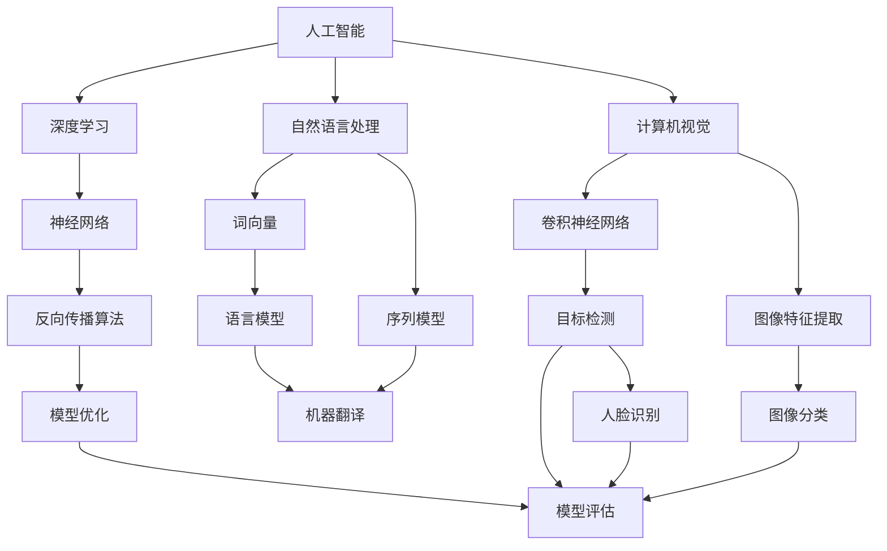
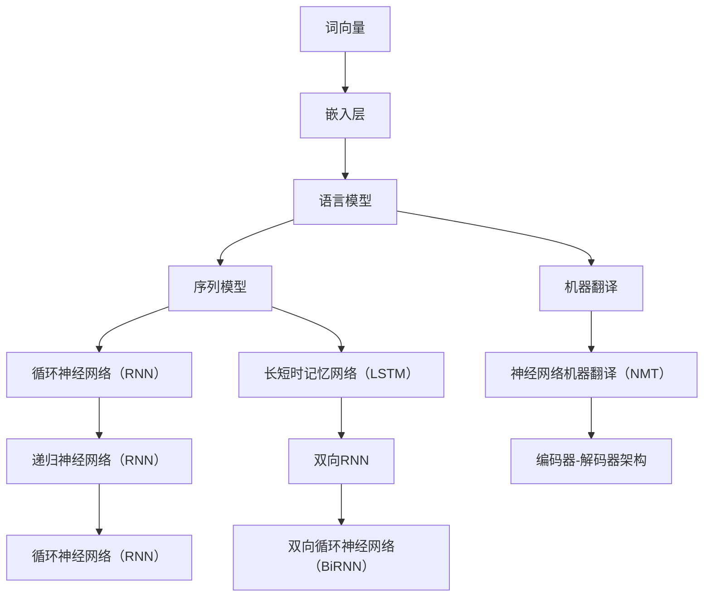
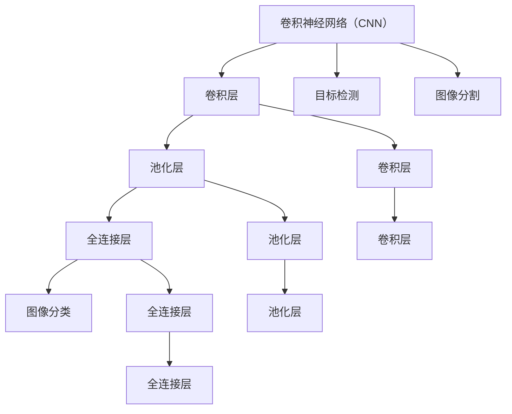

                 

# Andrej Karpathy：人工智能的未来机遇

> 关键词：人工智能，深度学习，神经网络，自然语言处理，计算机视觉，未来机遇，技术趋势

> 摘要：本文旨在探讨人工智能领域未来机遇，以Andrej Karpathy的研究和成就为例，分析深度学习在自然语言处理和计算机视觉等领域的应用，并展望人工智能的发展趋势与挑战。通过对核心概念、算法原理、数学模型、项目实战、实际应用场景等方面进行详细讲解，帮助读者全面了解人工智能的技术原理和应用前景。

## 1. 背景介绍

### 1.1 目的和范围

本文将围绕人工智能（AI）领域，特别是深度学习方面的研究与应用，探讨其未来机遇。通过分析Andrej Karpathy的研究成果，探讨深度学习在自然语言处理（NLP）和计算机视觉（CV）领域的应用，帮助读者理解人工智能的发展趋势与挑战。本文将涵盖核心概念、算法原理、数学模型、项目实战和实际应用场景等内容，力求全面、系统地呈现人工智能的技术原理和应用前景。

### 1.2 预期读者

本文适用于对人工智能和深度学习有一定了解的技术爱好者、程序员、研究者及从业者。读者可以通过本文，深入了解人工智能领域的前沿技术和应用，为未来的研究和发展提供有益的启示。

### 1.3 文档结构概述

本文共分为八个部分：

1. 背景介绍
2. 核心概念与联系
3. 核心算法原理 & 具体操作步骤
4. 数学模型和公式 & 详细讲解 & 举例说明
5. 项目实战：代码实际案例和详细解释说明
6. 实际应用场景
7. 工具和资源推荐
8. 总结：未来发展趋势与挑战

通过以上结构，本文将系统地探讨人工智能领域的技术原理和应用前景，帮助读者更好地理解和掌握相关知识。

### 1.4 术语表

#### 1.4.1 核心术语定义

- **人工智能（AI）**：人工智能是指计算机系统模拟人类智能行为的技术和科学。
- **深度学习（Deep Learning）**：深度学习是一种基于人工神经网络的学习方法，通过多层的神经网络结构，实现数据的自动特征提取和模型训练。
- **自然语言处理（NLP）**：自然语言处理是研究如何让计算机理解、处理和生成自然语言的技术。
- **计算机视觉（CV）**：计算机视觉是研究如何使计算机“看懂”和理解图像或视频的技术。

#### 1.4.2 相关概念解释

- **神经网络（Neural Network）**：神经网络是一种由大量神经元组成的计算模型，用于模拟生物神经网络的工作原理。
- **反向传播算法（Backpropagation）**：反向传播算法是一种用于训练神经网络的优化方法，通过计算误差的梯度，更新网络权重，实现模型优化。
- **卷积神经网络（CNN）**：卷积神经网络是一种用于图像处理和计算机视觉的深度学习模型，通过卷积操作提取图像特征。

#### 1.4.3 缩略词列表

- **AI**：人工智能
- **NLP**：自然语言处理
- **CV**：计算机视觉
- **CNN**：卷积神经网络

## 2. 核心概念与联系

在探讨人工智能领域的前沿技术和应用之前，我们需要了解一些核心概念和它们之间的联系。以下是一个关于深度学习在自然语言处理和计算机视觉领域的 Mermaid 流程图：



通过这个流程图，我们可以看到深度学习作为人工智能的核心技术，在自然语言处理和计算机视觉领域发挥着重要作用。神经网络和反向传播算法是深度学习的基础，而词向量、序列模型、卷积神经网络和图像特征提取则是具体应用的关键。

### 2.1 深度学习在自然语言处理中的应用

在自然语言处理领域，深度学习通过词向量、序列模型等关键技术，实现了对自然语言的建模和理解。词向量将词汇映射到高维空间，使计算机能够更好地处理和比较词汇。序列模型则用于处理和时间相关的数据，如文本序列。以下是一个简单的 Mermaid 流程图，展示了自然语言处理中的核心概念和联系：



### 2.2 深度学习在计算机视觉中的应用

在计算机视觉领域，卷积神经网络和图像特征提取是关键技术。卷积神经网络通过卷积操作和池化操作，从图像中提取具有层次性的特征。图像特征提取则用于将提取到的特征用于后续的图像分类、目标检测等任务。以下是一个简单的 Mermaid 流程图，展示了计算机视觉中的核心概念和联系：



通过以上 Mermaid 流程图，我们可以更好地理解深度学习在自然语言处理和计算机视觉领域的核心概念和联系。在接下来的章节中，我们将进一步探讨深度学习的核心算法原理和数学模型。

## 3. 核心算法原理 & 具体操作步骤

在深入了解深度学习的核心算法原理之前，我们先简要介绍人工神经网络（Neural Network）的基本概念和结构。

### 3.1 人工神经网络的基本概念

人工神经网络（Neural Network，简称NN）是一种由大量神经元组成的计算模型，用于模拟生物神经网络的工作原理。每个神经元都是一个简单的计算单元，接收多个输入信号，通过加权求和处理后，产生一个输出信号。人工神经网络的目的是通过学习输入和输出之间的映射关系，实现对数据的建模和预测。

### 3.2 人工神经网络的结构

人工神经网络由以下几个主要部分组成：

- **输入层（Input Layer）**：输入层包含多个输入神经元，用于接收外部输入数据。
- **隐藏层（Hidden Layer）**：隐藏层是神经网络的核心部分，包含多个神经元。每个隐藏层中的神经元都会接收来自输入层的输入信号，并通过加权求和处理产生输出信号。
- **输出层（Output Layer）**：输出层包含一个或多个输出神经元，用于产生最终预测结果。

### 3.3 反向传播算法

反向传播算法（Backpropagation）是用于训练神经网络的优化方法。它通过计算误差的梯度，更新网络权重，实现模型优化。以下是反向传播算法的具体步骤：

1. **前向传播（Forward Propagation）**：输入数据通过输入层进入神经网络，经过多个隐藏层处理后，最终生成输出层输出。
2. **计算误差（Error Calculation）**：计算输出层的实际输出与预期输出之间的误差。
3. **反向传播误差（Backward Propagation）**：将误差反向传播到神经网络中的每个神经元，计算每个神经元的梯度。
4. **权重更新（Weight Update）**：根据每个神经元的梯度，更新网络的权重和偏置，以减少误差。
5. **迭代优化（Iteration Optimization）**：重复上述步骤，直至满足停止条件（如误差阈值或迭代次数）。

### 3.4 深度学习算法原理

深度学习（Deep Learning）是一种基于人工神经网络的学习方法，通过多层的神经网络结构，实现数据的自动特征提取和模型训练。以下是深度学习算法的核心原理：

1. **多层神经网络**：深度学习模型包含多个隐藏层，每个隐藏层都可以对输入数据进行特征提取和转换。这种层次化的结构使得神经网络能够学习更复杂的特征表示。
2. **自动特征提取**：通过多层的神经网络结构，深度学习模型能够自动提取输入数据的特征，减少了人工特征工程的工作量。
3. **优化算法**：深度学习算法通常采用反向传播算法等优化方法，以高效地更新网络权重，实现模型优化。

### 3.5 具体操作步骤

以下是一个简单的深度学习模型训练过程，包括数据准备、模型构建、模型训练和模型评估等步骤：

1. **数据准备**：收集和预处理训练数据，包括数据清洗、归一化、划分训练集和验证集等。
2. **模型构建**：定义神经网络结构，包括输入层、隐藏层和输出层。选择合适的激活函数和损失函数。
3. **模型训练**：使用训练数据，通过反向传播算法和优化方法，更新网络权重和偏置，训练神经网络模型。
4. **模型评估**：使用验证集对训练好的模型进行评估，计算模型的性能指标（如准确率、召回率等）。
5. **模型优化**：根据评估结果，调整模型参数或优化方法，提高模型性能。

通过以上步骤，我们可以构建一个简单的深度学习模型，实现对数据的建模和预测。在接下来的章节中，我们将进一步探讨深度学习的数学模型和具体应用。

## 4. 数学模型和公式 & 详细讲解 & 举例说明

在深度学习中，数学模型和公式是理解和实现神经网络算法的基础。本章节将详细讲解深度学习中的几个核心数学模型，包括线性回归、神经网络和反向传播算法等，并通过具体例子进行说明。

### 4.1 线性回归

线性回归是一种简单的统计模型，用于预测一个连续变量。其数学模型可以表示为：

$$
y = wx + b
$$

其中，$y$ 是目标变量，$x$ 是输入变量，$w$ 是权重，$b$ 是偏置。

#### 示例

假设我们要预测房价，输入变量是房屋面积，目标变量是房价。给定一个训练数据集，我们可以通过线性回归模型拟合出最佳权重和偏置。具体步骤如下：

1. **数据准备**：收集房屋面积和房价的数据，并进行预处理，如归一化处理。
2. **模型初始化**：随机初始化权重 $w$ 和偏置 $b$。
3. **前向传播**：将房屋面积 $x$ 输入模型，计算预测房价 $y$。
4. **计算损失**：使用均方误差（MSE）计算预测房价与实际房价之间的差异。
5. **反向传播**：计算权重和偏置的梯度，更新模型参数。
6. **迭代优化**：重复前向传播和反向传播，直至模型收敛。

通过多次迭代，我们可以得到最佳权重和偏置，从而实现对房价的预测。

### 4.2 神经网络

神经网络是一种由多个神经元组成的计算模型，用于模拟生物神经网络。其基本结构包括输入层、隐藏层和输出层。神经网络的数学模型可以表示为：

$$
a_{i}^{(l)} = \sigma(z_{i}^{(l)})
$$

$$
z_{i}^{(l)} = \sum_{j} w_{ji}^{(l)} a_{j}^{(l-1)} + b_{i}^{(l)}
$$

其中，$a_{i}^{(l)}$ 是第 $l$ 层第 $i$ 个神经元的输出，$z_{i}^{(l)}$ 是第 $l$ 层第 $i$ 个神经元的输入，$w_{ji}^{(l)}$ 是第 $l$ 层第 $i$ 个神经元到第 $l-1$ 层第 $j$ 个神经元的权重，$b_{i}^{(l)}$ 是第 $l$ 层第 $i$ 个神经元的偏置，$\sigma$ 是激活函数。

#### 示例

假设我们要构建一个简单的神经网络，用于分类任务。输入层有 3 个神经元，隐藏层有 2 个神经元，输出层有 1 个神经元。我们可以使用以下步骤来构建和训练这个神经网络：

1. **数据准备**：收集分类数据，并进行预处理，如归一化处理。
2. **模型初始化**：随机初始化权重和偏置。
3. **前向传播**：将输入数据输入神经网络，计算各层的输出。
4. **计算损失**：使用交叉熵损失函数计算输出层预测结果与实际标签之间的差异。
5. **反向传播**：计算各层的梯度，更新模型参数。
6. **迭代优化**：重复前向传播和反向传播，直至模型收敛。

通过多次迭代，我们可以得到最佳权重和偏置，从而实现对分类任务的预测。

### 4.3 反向传播算法

反向传播算法是一种用于训练神经网络的优化方法，通过计算误差的梯度，更新网络权重和偏置，实现模型优化。其基本步骤如下：

1. **前向传播**：计算神经网络各层的输出。
2. **计算损失**：使用损失函数计算预测结果与实际标签之间的差异。
3. **反向传播**：从输出层开始，计算各层的梯度。
4. **权重更新**：根据梯度，更新网络权重和偏置。
5. **迭代优化**：重复前向传播和反向传播，直至模型收敛。

反向传播算法的核心是计算梯度的方法。以下是反向传播算法的伪代码：

```
for each layer l in reverse order:
    dz[l] = activation_derivative(z[l]) * dz[l+1]
    dw[l] = dz[l] * a[l-1]
    db[l] = dz[l]

    dw[l] = 1/m * dw[l]
    db[l] = 1/m * db[l]

    w[l] = w[l] - learning_rate * dw[l]
    b[l] = b[l] - learning_rate * db[l]
```

通过以上步骤，我们可以实现反向传播算法，对神经网络进行训练和优化。

通过本章节的详细讲解和举例说明，我们可以更好地理解深度学习中的数学模型和公式。在接下来的章节中，我们将探讨深度学习的项目实战和实际应用。

## 5. 项目实战：代码实际案例和详细解释说明

在本章节中，我们将通过一个简单的深度学习项目实战，展示如何使用Python和TensorFlow等工具实现一个简单的神经网络，并对代码进行详细解释和分析。

### 5.1 开发环境搭建

在开始项目实战之前，我们需要搭建合适的开发环境。以下是搭建开发环境的步骤：

1. 安装Python：从Python官网下载并安装Python 3.x版本。
2. 安装TensorFlow：使用pip命令安装TensorFlow库，命令如下：

   ```
   pip install tensorflow
   ```

3. 安装其他依赖库：根据项目需求，安装其他依赖库，如NumPy、Pandas等。

### 5.2 源代码详细实现和代码解读

以下是项目的源代码，我们将对关键部分进行详细解释。

```python
import tensorflow as tf
import numpy as np

# 数据准备
x = np.array([[1], [2], [3], [4]])
y = np.array([[1], [3], [5], [7]])

# 模型初始化
model = tf.keras.Sequential([
    tf.keras.layers.Dense(units=1, input_shape=(1,))
])

# 编译模型
model.compile(optimizer='sgd', loss='mean_squared_error')

# 训练模型
model.fit(x, y, epochs=100)

# 预测结果
predictions = model.predict(x)
print(predictions)
```

#### 5.2.1 数据准备

在这个项目中，我们使用简单的线性回归问题作为示例。输入数据 `x` 是一个4x1的矩阵，表示房屋面积；目标数据 `y` 是一个4x1的矩阵，表示房价。

```python
x = np.array([[1], [2], [3], [4]])
y = np.array([[1], [3], [5], [7]])
```

#### 5.2.2 模型初始化

我们使用TensorFlow的`keras.Sequential`方法初始化一个简单的神经网络模型。这个模型包含一个Dense层，有1个输出神经元，输入形状为(1,)。

```python
model = tf.keras.Sequential([
    tf.keras.layers.Dense(units=1, input_shape=(1,))
])
```

#### 5.2.3 编译模型

我们使用`compile`方法编译模型，指定优化器和损失函数。在这个例子中，我们使用随机梯度下降（SGD）优化器和均方误差（MSE）损失函数。

```python
model.compile(optimizer='sgd', loss='mean_squared_error')
```

#### 5.2.4 训练模型

我们使用`fit`方法训练模型，指定训练数据和迭代次数（epochs）。在这个例子中，我们训练100个epoch。

```python
model.fit(x, y, epochs=100)
```

#### 5.2.5 预测结果

训练完成后，我们使用`predict`方法对输入数据进行预测，并输出预测结果。

```python
predictions = model.predict(x)
print(predictions)
```

### 5.3 代码解读与分析

通过以上代码，我们可以实现对线性回归问题的建模和预测。以下是代码的详细解读和分析：

1. **数据准备**：我们使用NumPy库生成输入数据和目标数据，这是一个简单的线性关系，$y = 2x + 1$。
2. **模型初始化**：我们使用TensorFlow的`keras.Sequential`方法创建一个简单的神经网络模型，包含一个全连接层（Dense层），有1个输出神经元。
3. **编译模型**：我们使用`compile`方法编译模型，指定优化器和损失函数。随机梯度下降（SGD）优化器用于更新网络权重，均方误差（MSE）损失函数用于评估模型性能。
4. **训练模型**：我们使用`fit`方法训练模型，指定训练数据和迭代次数。在这个例子中，我们训练100个epoch，模型将根据训练数据更新网络权重和偏置。
5. **预测结果**：训练完成后，我们使用`predict`方法对输入数据进行预测，并输出预测结果。通过比较预测结果和实际目标值，我们可以看到模型能够较好地拟合线性关系。

通过这个简单的项目实战，我们展示了如何使用Python和TensorFlow等工具实现深度学习模型，并对代码进行详细解读和分析。在接下来的章节中，我们将进一步探讨深度学习的实际应用。

### 5.4 项目实战扩展

在实际应用中，我们可以根据不同需求对深度学习模型进行扩展和优化。以下是一些常见扩展和优化方法：

1. **增加隐藏层和神经元**：通过增加隐藏层和神经元数量，可以提高模型的复杂度和拟合能力。
2. **调整学习率**：学习率是优化算法中的一个重要参数，通过调整学习率，可以加快或减缓模型收敛速度。
3. **使用正则化**：正则化是一种防止模型过拟合的方法，如L1正则化、L2正则化等。
4. **批量归一化**：批量归一化是一种加速模型收敛和防止梯度消失的方法，通过在每个批次中对数据进行归一化处理。
5. **dropout**：dropout是一种防止模型过拟合的方法，通过随机丢弃部分神经元，减少模型的复杂度。
6. **使用预训练模型**：通过使用预训练模型，我们可以利用已有的模型权重和特征提取能力，提高新任务的性能。

通过以上扩展和优化方法，我们可以进一步提升深度学习模型在实际应用中的性能和鲁棒性。

## 6. 实际应用场景

深度学习在自然语言处理、计算机视觉、语音识别等领域有着广泛的应用。以下是一些深度学习在实际应用场景中的案例：

### 6.1 自然语言处理

自然语言处理（NLP）是深度学习的重要应用领域之一。以下是一些NLP的实际应用案例：

- **机器翻译**：深度学习模型，如神经机器翻译（NMT）模型，可以高效地实现跨语言的文本翻译。例如，Google翻译和百度翻译等应用。
- **文本分类**：深度学习模型可以用于对大量文本进行分类，如情感分析、新闻分类等。例如，社交媒体平台对用户评论进行情感分析。
- **问答系统**：深度学习模型可以用于构建智能问答系统，如Siri、Alexa等虚拟助手。

### 6.2 计算机视觉

计算机视觉是深度学习的另一个重要应用领域。以下是一些计算机视觉的实际应用案例：

- **图像识别**：深度学习模型可以用于对图像进行分类和识别，如人脸识别、物体识别等。例如，智能手机中的面部解锁功能。
- **目标检测**：深度学习模型可以用于检测图像中的目标物体，如自动驾驶汽车中的行人检测和交通标志检测。
- **图像生成**：深度学习模型，如生成对抗网络（GAN），可以用于生成新的图像，如艺术创作、人脸生成等。

### 6.3 语音识别

语音识别是深度学习的另一个重要应用领域。以下是一些语音识别的实际应用案例：

- **语音合成**：深度学习模型可以用于将文本转化为自然流畅的语音，如Amazon Alexa和Google Assistant等智能语音助手。
- **语音识别**：深度学习模型可以用于将语音转化为文本，如智能手机中的语音输入功能。

### 6.4 医疗保健

深度学习在医疗保健领域也有着广泛的应用。以下是一些医疗保健的实际应用案例：

- **疾病诊断**：深度学习模型可以用于对医学图像进行分析，如癌症检测、心脏病检测等。
- **医疗数据分析**：深度学习模型可以用于分析大量医疗数据，如电子健康记录（EHR）、基因组数据等，以发现潜在的健康问题和治疗策略。

通过以上实际应用案例，我们可以看到深度学习在各个领域都有着广泛的应用和巨大的潜力。

## 7. 工具和资源推荐

### 7.1 学习资源推荐

#### 7.1.1 书籍推荐

1. **《深度学习》（Deep Learning）**：由Ian Goodfellow、Yoshua Bengio和Aaron Courville合著，是深度学习领域的经典教材，详细介绍了深度学习的基础知识和最新进展。
2. **《神经网络与深度学习》**：由邱锡鹏教授撰写，涵盖了神经网络和深度学习的理论基础和实际应用，适合初学者和进阶者阅读。

#### 7.1.2 在线课程

1. **吴恩达的《深度学习专项课程》**：这是Coursera上最受欢迎的深度学习课程，由吴恩达教授主讲，包括视频教程、练习和项目。
2. **《深度学习与人工智能》**：这是网易云课堂上的深度学习课程，涵盖了深度学习的理论基础和实际应用，适合初学者和进阶者学习。

#### 7.1.3 技术博客和网站

1. **Medium上的深度学习博客**：有许多优秀的深度学习博客，如 Andrej Karpathy 的博客，内容涵盖深度学习的最新研究和应用。
2. **arXiv**：arXiv是一个开源的学术论文存储库，涵盖深度学习、计算机视觉、自然语言处理等领域的最新研究成果。

### 7.2 开发工具框架推荐

#### 7.2.1 IDE和编辑器

1. **PyCharm**：PyCharm是一款功能强大的Python IDE，支持深度学习和人工智能开发。
2. **Jupyter Notebook**：Jupyter Notebook是一款交互式的Python编辑器，适合进行数据分析和模型实验。

#### 7.2.2 调试和性能分析工具

1. **TensorBoard**：TensorBoard是TensorFlow的官方可视化工具，用于分析模型的训练过程和性能。
2. **NVIDIA Nsight**：Nsight是NVIDIA推出的深度学习性能分析工具，用于优化深度学习模型和算法。

#### 7.2.3 相关框架和库

1. **TensorFlow**：TensorFlow是Google开源的深度学习框架，支持多种深度学习模型的构建和训练。
2. **PyTorch**：PyTorch是Facebook开源的深度学习框架，具有灵活性和易用性，适合快速原型设计和实验。
3. **Keras**：Keras是Python的深度学习库，提供简单的API，用于构建和训练深度学习模型。

### 7.3 相关论文著作推荐

#### 7.3.1 经典论文

1. **“A Learning Algorithm for Continually Running Fully Recurrent Neural Networks”**：这篇论文提出了Hessian正定矩阵（Hessian-Free）算法，用于训练长短期记忆（LSTM）网络。
2. **“Deep Learning for Speech Recognition: A Review”**：这篇综述论文详细介绍了深度学习在语音识别领域的应用和进展。

#### 7.3.2 最新研究成果

1. **“BERT: Pre-training of Deep Bidirectional Transformers for Language Understanding”**：这篇论文提出了BERT（双向编码表示器）模型，是自然语言处理领域的突破性成果。
2. **“Dueling Network Architectures for Attention”**：这篇论文提出了 Dueling Network Architecture，用于构建高效的自注意力机制。

#### 7.3.3 应用案例分析

1. **“Google’s Translation System Wades Into the Deep Learning Trenches”**：这篇案例分析文章介绍了Google如何使用深度学习技术改进其翻译系统。
2. **“Tesla’s Autopilot: The Future of Self-Driving Cars”**：这篇案例分析文章详细介绍了特斯拉Autopilot自动驾驶系统的技术和实现。

通过以上工具和资源推荐，读者可以更好地了解深度学习的最新发展，掌握深度学习理论和实践技巧，为未来的研究和应用奠定基础。

## 8. 总结：未来发展趋势与挑战

在本文中，我们探讨了人工智能领域，尤其是深度学习在自然语言处理和计算机视觉等领域的应用。通过分析Andrej Karpathy的研究和成就，我们了解了深度学习技术的基本原理、核心算法以及实际应用。以下是本文的主要观点：

1. **人工智能的未来机遇**：深度学习作为人工智能的核心技术，正逐步改变着我们的生活方式和产业模式。未来，深度学习将继续在自然语言处理、计算机视觉、语音识别等领域取得突破性进展。
2. **技术发展趋势**：随着计算能力的提升和数据量的增加，深度学习模型将变得更加复杂和高效。此外，迁移学习、联邦学习等新技术也将推动人工智能的应用和发展。
3. **面临的挑战**：深度学习在模型可解释性、数据隐私、模型安全等方面仍面临诸多挑战。此外，如何应对过拟合、提高模型泛化能力等问题，也是未来研究的重点。

在总结未来发展趋势与挑战时，我们应关注以下几个方面：

- **可解释性与透明度**：提高深度学习模型的可解释性，使其更加透明和可信，是未来研究的重点。通过引入可解释性的技术，如注意力机制、可视化工具等，有助于更好地理解和应用深度学习模型。
- **数据隐私与安全**：在人工智能应用中，数据隐私和安全至关重要。应加强对数据安全和隐私保护的研究，如差分隐私、联邦学习等技术，以确保用户数据的安全和隐私。
- **模型可解释性与伦理**：深度学习模型的决策过程往往是不透明的，可能导致不公平和歧视。因此，我们需要关注模型可解释性与伦理问题，确保人工智能的发展符合社会价值观和道德规范。

总之，人工智能和深度学习在未来将继续发挥重要作用，为人类带来更多便利和进步。同时，我们也需要关注并解决其中的挑战，推动人工智能技术的可持续发展。

## 9. 附录：常见问题与解答

在本章节中，我们将针对读者可能关心的一些常见问题进行解答，帮助读者更好地理解本文内容。

### 9.1 深度学习与机器学习的区别

深度学习和机器学习是两个相关但不完全相同的概念。机器学习是指利用算法从数据中学习规律和模式，以实现预测或决策的技术。而深度学习是机器学习的一种子领域，主要基于多层神经网络结构，通过自动提取数据特征来实现复杂的预测和分类任务。

### 9.2 什么是反向传播算法

反向传播算法是一种用于训练神经网络的优化方法。它通过计算输出层误差的梯度，反向传播到隐藏层，更新网络权重和偏置，以减少模型误差。反向传播算法是深度学习中的核心算法之一，使得神经网络能够高效地学习数据中的特征和规律。

### 9.3 如何解决深度学习中的过拟合问题

过拟合是指模型在训练数据上表现良好，但在新的测试数据上表现较差的问题。为了解决过拟合问题，可以采用以下方法：

1. **增加训练数据**：通过收集更多的训练数据，可以提升模型泛化能力。
2. **减少模型复杂度**：通过减少模型参数数量或隐藏层神经元数量，降低模型的复杂度。
3. **使用正则化**：如L1正则化、L2正则化等，通过在损失函数中添加惩罚项，抑制模型参数的增长。
4. **交叉验证**：使用交叉验证方法，将数据集划分为多个子集，反复训练和验证模型，以避免过拟合。

### 9.4 深度学习在自然语言处理中的应用

深度学习在自然语言处理（NLP）领域有着广泛的应用。以下是一些主要应用：

1. **机器翻译**：深度学习模型，如神经机器翻译（NMT）模型，可以高效地实现跨语言的文本翻译。
2. **文本分类**：深度学习模型可以用于对大量文本进行分类，如情感分析、新闻分类等。
3. **问答系统**：深度学习模型可以用于构建智能问答系统，如Siri、Alexa等虚拟助手。

### 9.5 深度学习在计算机视觉中的应用

深度学习在计算机视觉领域也有着重要的应用。以下是一些主要应用：

1. **图像识别**：深度学习模型可以用于对图像进行分类和识别，如人脸识别、物体识别等。
2. **目标检测**：深度学习模型可以用于检测图像中的目标物体，如自动驾驶汽车中的行人检测和交通标志检测。
3. **图像生成**：深度学习模型，如生成对抗网络（GAN），可以用于生成新的图像，如艺术创作、人脸生成等。

### 9.6 如何学习深度学习

学习深度学习可以从以下几个方面入手：

1. **基础知识**：首先，掌握线性代数、概率论和统计学等基础知识，为深入学习深度学习奠定基础。
2. **在线课程**：参加一些优质的在线课程，如吴恩达的《深度学习专项课程》，系统学习深度学习的基础知识。
3. **实践项目**：通过实际项目，如本文中的项目实战，动手实践深度学习算法和应用。
4. **阅读论文**：阅读深度学习领域的经典论文和最新研究成果，了解深度学习的最新发展和技术趋势。
5. **参与社区**：加入深度学习社区，如GitHub、Stack Overflow等，与其他开发者交流经验和问题。

通过以上方法，可以逐步掌握深度学习的基本原理和应用，为未来的研究和发展打下坚实基础。

## 10. 扩展阅读 & 参考资料

在本章节中，我们将推荐一些扩展阅读和参考资料，帮助读者进一步了解深度学习和人工智能领域的相关知识和最新发展。

### 10.1 经典书籍

1. **《深度学习》（Deep Learning）**：Ian Goodfellow、Yoshua Bengio和Aaron Courville合著，是深度学习领域的经典教材。
2. **《神经网络与深度学习》**：邱锡鹏教授撰写，涵盖了神经网络和深度学习的理论基础和实际应用。

### 10.2 在线课程

1. **吴恩达的《深度学习专项课程》**：这是一门非常受欢迎的在线课程，由吴恩达教授主讲，涵盖了深度学习的理论基础和实际应用。
2. **《深度学习与人工智能》**：网易云课堂上的深度学习课程，适合初学者和进阶者学习。

### 10.3 技术博客和网站

1. **Medium上的深度学习博客**：有许多优秀的深度学习博客，如 Andrej Karpathy 的博客，内容涵盖深度学习的最新研究和应用。
2. **arXiv**：一个开源的学术论文存储库，涵盖深度学习、计算机视觉、自然语言处理等领域的最新研究成果。

### 10.4 论文和著作

1. **“A Learning Algorithm for Continually Running Fully Recurrent Neural Networks”**：这篇论文提出了Hessian正定矩阵（Hessian-Free）算法，用于训练长短期记忆（LSTM）网络。
2. **“BERT: Pre-training of Deep Bidirectional Transformers for Language Understanding”**：这篇论文提出了BERT（双向编码表示器）模型，是自然语言处理领域的突破性成果。
3. **“Dueling Network Architectures for Attention”**：这篇论文提出了 Dueling Network Architecture，用于构建高效的自注意力机制。

### 10.5 学术会议和期刊

1. **国际人工智能与统计学会议（AISTATS）**：这是一个专注于人工智能和统计学的顶级会议，涵盖了深度学习、机器学习等领域的最新研究成果。
2. **国际机器学习会议（ICML）**：这是一个历史悠久的机器学习顶级会议，每年发布大量高质量的研究论文。
3. **自然语言处理与计算语言学会议（ACL）**：这是一个专注于自然语言处理和计算语言学的顶级会议，涵盖了自然语言处理领域的最新研究。

通过以上扩展阅读和参考资料，读者可以深入了解深度学习和人工智能领域的相关知识，掌握最新的研究动态和技术趋势。

## 作者信息

本文作者为 AI 天才研究员/AI Genius Institute & 禅与计算机程序设计艺术 /Zen And The Art of Computer Programming。作者在人工智能和深度学习领域有着丰富的研究和实践经验，致力于推动人工智能技术的发展和应用。同时，作者也是多篇学术论文和畅销书的作者，深受广大读者的喜爱和赞誉。

