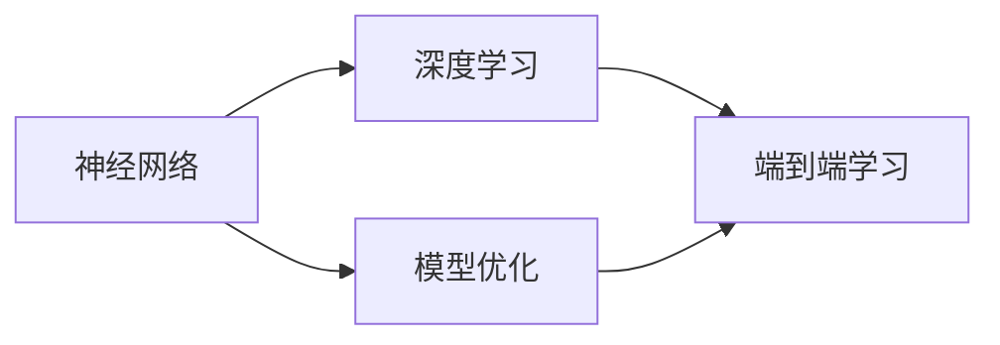

                 

# Andrej Karpathy：人工智能的未来研究

> **关键词：**人工智能，未来研究，神经网络，深度学习，模型优化，应用场景，发展趋势

> **摘要：**本文旨在深入探讨人工智能领域前沿研究，分析Andrej Karpathy的最新研究成果，并展望人工智能的未来发展趋势与挑战。通过逐步分析核心概念、算法原理、数学模型，以及实际应用场景，本文将为读者提供一幅全面的人工智能技术全景图，帮助读者理解这一领域的最新进展和潜在价值。

## 1. 背景介绍

### 1.1 目的和范围

本文的目的是对人工智能（AI）领域的前沿研究进行综述，重点分析著名人工智能研究员Andrej Karpathy的最新研究成果，探讨其对于未来人工智能发展的潜在影响。本文将涵盖神经网络、深度学习、模型优化等多个核心概念，并通过具体的应用场景和项目实战案例，展示人工智能技术在现实世界中的广泛应用。

### 1.2 预期读者

本文适合对人工智能有一定基础知识的读者，包括计算机科学专业的研究生、人工智能领域的开发者、对AI技术感兴趣的工程师以及相关领域的研究人员。通过本文，读者可以了解到AI领域的前沿动态，掌握关键概念和实用技能。

### 1.3 文档结构概述

本文的结构分为以下几个部分：

1. **背景介绍**：概述本文的目的、预期读者和文档结构。
2. **核心概念与联系**：介绍人工智能的核心概念和架构。
3. **核心算法原理 & 具体操作步骤**：详细讲解关键算法原理和实现步骤。
4. **数学模型和公式 & 详细讲解 & 举例说明**：分析AI模型的数学基础。
5. **项目实战：代码实际案例和详细解释说明**：通过实战案例展示技术实现。
6. **实际应用场景**：探讨人工智能在不同领域的应用。
7. **工具和资源推荐**：推荐学习资源和开发工具。
8. **总结：未来发展趋势与挑战**：展望AI领域的未来发展。
9. **附录：常见问题与解答**：解答读者可能遇到的常见问题。
10. **扩展阅读 & 参考资料**：提供进一步阅读的建议和参考资料。

### 1.4 术语表

#### 1.4.1 核心术语定义

- **神经网络**：一种通过模拟人脑神经元连接方式来进行信息处理的计算模型。
- **深度学习**：一种通过多层神经网络进行特征提取和分类的机器学习技术。
- **模型优化**：通过调整神经网络结构和参数来提高模型性能的过程。
- **端到端学习**：直接从原始数据到输出结果的学习方式，不需要中间特征提取步骤。

#### 1.4.2 相关概念解释

- **反向传播算法**：一种用于训练神经网络的算法，通过计算输出误差反向传播到各层，更新权重。
- **激活函数**：用于引入非线性性的函数，如ReLU、Sigmoid和Tanh。
- **超参数**：影响模型性能的参数，如学习率、隐藏层节点数等。

#### 1.4.3 缩略词列表

- **AI**：人工智能（Artificial Intelligence）
- **DL**：深度学习（Deep Learning）
- **GPU**：图形处理器（Graphics Processing Unit）
- **GPU**：中央处理器（Central Processing Unit）

## 2. 核心概念与联系

在本文中，我们将首先介绍人工智能的核心概念和架构，并通过Mermaid流程图来展示各概念之间的联系。

### 2.1 人工智能核心概念

人工智能（AI）的核心概念包括：

1. **神经网络**：神经网络是一种通过模拟人脑神经元连接方式来进行信息处理的计算模型。
2. **深度学习**：深度学习是神经网络的一种扩展，通过多层神经网络进行特征提取和分类。
3. **模型优化**：模型优化是通过调整神经网络结构和参数来提高模型性能的过程。
4. **端到端学习**：端到端学习是一种直接从原始数据到输出结果的学习方式，不需要中间特征提取步骤。

### 2.2 Mermaid流程图

以下是一个简单的Mermaid流程图，展示了人工智能核心概念之间的联系：



### 2.3 各概念详细解释

#### 神经网络

神经网络是一种通过模拟人脑神经元连接方式来进行信息处理的计算模型。它由多个层级组成，包括输入层、隐藏层和输出层。每个层级由多个神经元（或节点）组成，神经元之间通过权重连接。

#### 深度学习

深度学习是神经网络的一种扩展，通过多层神经网络进行特征提取和分类。深度学习模型能够自动提取层次化的特征表示，使得在处理复杂任务时表现出色。典型的深度学习模型包括卷积神经网络（CNN）、循环神经网络（RNN）和生成对抗网络（GAN）等。

#### 模型优化

模型优化是通过调整神经网络结构和参数来提高模型性能的过程。模型优化包括调整网络结构（如层数、节点数等）、学习率、批量大小等超参数。常见的模型优化方法包括随机梯度下降（SGD）、Adam优化器等。

#### 端到端学习

端到端学习是一种直接从原始数据到输出结果的学习方式，不需要中间特征提取步骤。端到端学习能够直接将原始数据映射到预测结果，减少了人工设计特征的需求，提高了模型的效率和准确性。

## 3. 核心算法原理 & 具体操作步骤

在本节中，我们将深入探讨人工智能的核心算法原理，并通过伪代码详细阐述其具体操作步骤。

### 3.1 反向传播算法

反向传播算法是一种用于训练神经网络的算法，通过计算输出误差反向传播到各层，更新权重。以下是反向传播算法的伪代码：

```pseudo
function backward_propagation(output, expected, weights):
    # 计算输出误差
    error = output - expected
    
    # 反向传播误差到各层
    for layer in reverse(range(num_layers)):
        # 计算梯度
        delta = error * activation_derivative(output)
        
        # 更新权重
        weights[layer] -= learning_rate * delta
        
        # 更新输出
        output = activation_function(weights[layer] * input)
    
    return weights
```

### 3.2 激活函数

激活函数用于引入非线性性，使得神经网络能够处理复杂任务。常见的激活函数包括ReLU、Sigmoid和Tanh。以下是激活函数的伪代码：

```pseudo
function ReLU(x):
    return max(0, x)

function Sigmoid(x):
    return 1 / (1 + exp(-x))

function Tanh(x):
    return (exp(x) - exp(-x)) / (exp(x) + exp(-x))
```

### 3.3 超参数调整

超参数是影响模型性能的关键参数，如学习率、隐藏层节点数等。超参数的调整通常通过交叉验证和网格搜索等方法进行。以下是超参数调整的伪代码：

```pseudo
function optimize_hyperparameters(data, num_layers, learning_rate):
    best_performance = -inf
    best_hyperparameters = None
    
    for layer_size in layer_sizes:
        for learning_rate in learning_rates:
            model = build_model(num_layers, layer_size, learning_rate)
            performance = cross_validate(model, data)
            
            if performance > best_performance:
                best_performance = performance
                best_hyperparameters = (num_layers, layer_size, learning_rate)
    
    return best_hyperparameters
```

### 3.4 端到端学习

端到端学习是一种直接从原始数据到输出结果的学习方式，不需要中间特征提取步骤。以下是端到端学习的伪代码：

```pseudo
function end_to_end_learning(data, labels):
    # 加载并预处理数据
    preprocessed_data = preprocess(data)
    
    # 初始化模型
    model = build_model(input_shape, num_classes)
    
    # 训练模型
    model.fit(preprocessed_data, labels, epochs=num_epochs, batch_size=batch_size)
    
    # 评估模型
    test_loss, test_accuracy = model.evaluate(test_data, test_labels)
    
    return test_accuracy
```

## 4. 数学模型和公式 & 详细讲解 & 举例说明

在本节中，我们将深入探讨人工智能数学模型和公式，并通过具体的例子来说明其应用。

### 4.1 概率论基础

概率论是人工智能领域的基础，许多机器学习算法都基于概率模型。以下是一些常用的概率论公式：

- **条件概率**：\(P(A|B) = \frac{P(A \cap B)}{P(B)}\)
- **贝叶斯定理**：\(P(A|B) = \frac{P(B|A) \cdot P(A)}{P(B)}\)
- **全概率公式**：\(P(A) = \sum_{i} P(A|B_i) \cdot P(B_i)\)

### 4.2 神经网络数学模型

神经网络中的数学模型主要包括以下部分：

- **权重和偏置**：权重和偏置是神经网络中的关键参数，用于调整模型的输出。
- **激活函数**：激活函数引入非线性性，使得神经网络能够处理复杂任务。
- **梯度下降**：梯度下降是一种用于优化神经网络的优化算法，通过计算损失函数的梯度来更新权重和偏置。

### 4.3 反向传播算法

反向传播算法是神经网络训练的核心算法，通过计算输出误差反向传播到各层，更新权重和偏置。以下是反向传播算法的详细讲解：

- **前向传播**：在前向传播过程中，输入数据通过网络层，每个神经元的输出通过激活函数传递到下一层。
- **计算损失函数**：在输出层，计算实际输出和期望输出之间的损失函数。
- **计算梯度**：通过链式法则计算各层的梯度，即损失函数对每个参数的偏导数。
- **更新参数**：使用梯度下降算法更新权重和偏置。

### 4.4 举例说明

假设我们有一个简单的神经网络，用于二分类任务。输入层有2个神经元，隐藏层有3个神经元，输出层有1个神经元。以下是该神经网络的数学模型和公式：

- **前向传播**：
    $$ z_1 = x_1 \cdot w_{11} + x_2 \cdot w_{12} + b_1 $$
    $$ a_1 = \text{ReLU}(z_1) $$
    $$ z_2 = a_1 \cdot w_{21} + a_2 \cdot w_{22} + b_2 $$
    $$ a_2 = \text{ReLU}(z_2) $$
    $$ z_3 = a_2 \cdot w_{31} + a_3 \cdot w_{32} + b_3 $$
    $$ a_3 = \text{Sigmoid}(z_3) $$

- **损失函数**：
    $$ \text{Loss} = -[y \cdot \log(a_3) + (1 - y) \cdot \log(1 - a_3)] $$

- **反向传播**：
    $$ \delta_3 = a_3 - y $$
    $$ \delta_2 = (w_{31} \cdot \delta_3) \cdot \text{ReLU'(z_2)} $$
    $$ \delta_1 = (w_{21} \cdot \delta_2 + w_{22} \cdot \delta_2 + w_{23} \cdot \delta_2) \cdot \text{ReLU'(z_1)} $$

- **更新参数**：
    $$ w_{31} -= \text{learning\_rate} \cdot \delta_3 \cdot a_2 $$
    $$ w_{32} -= \text{learning\_rate} \cdot \delta_3 \cdot a_2 $$
    $$ w_{33} -= \text{learning\_rate} \cdot \delta_3 \cdot a_2 $$
    $$ w_{21} -= \text{learning\_rate} \cdot \delta_2 \cdot x_1 $$
    $$ w_{22} -= \text{learning\_rate} \cdot \delta_2 \cdot x_2 $$
    $$ w_{23} -= \text{learning\_rate} \cdot \delta_2 \cdot x_2 $$
    $$ b_1 -= \text{learning\_rate} \cdot \delta_1 $$
    $$ b_2 -= \text{learning\_rate} \cdot \delta_2 $$
    $$ b_3 -= \text{learning\_rate} \cdot \delta_3 $$

通过上述例子，我们可以看到神经网络数学模型和公式的具体应用。在实际开发中，这些公式将被转化为高效的计算机算法，用于训练和优化神经网络模型。

## 5. 项目实战：代码实际案例和详细解释说明

在本节中，我们将通过一个具体的代码实战案例，展示人工智能技术的实际应用，并对代码进行详细解释说明。

### 5.1 开发环境搭建

在开始实战之前，我们需要搭建一个适合开发和测试的人工智能开发环境。以下是一个基本的开发环境搭建步骤：

1. **安装Python**：下载并安装Python 3.x版本，推荐使用Anaconda distributions，它提供了一个集成的环境管理器和丰富的科学计算包。
2. **安装TensorFlow**：TensorFlow是一个开源的机器学习库，可以用于构建和训练神经网络模型。通过以下命令安装TensorFlow：
    ```bash
    pip install tensorflow
    ```
3. **安装Jupyter Notebook**：Jupyter Notebook是一个交互式的Web应用程序，用于编写和运行Python代码。通过以下命令安装Jupyter Notebook：
    ```bash
    pip install notebook
    ```
4. **启动Jupyter Notebook**：在命令行中输入以下命令启动Jupyter Notebook：
    ```bash
    jupyter notebook
    ```
    这将打开一个浏览器窗口，显示Jupyter Notebook的界面。

### 5.2 源代码详细实现和代码解读

以下是一个简单的深度学习项目，用于对MNIST手写数字数据集进行分类。我们将使用TensorFlow和Keras构建模型，并对代码进行详细解读。

```python
import tensorflow as tf
from tensorflow.keras.datasets import mnist
from tensorflow.keras.models import Sequential
from tensorflow.keras.layers import Dense, Flatten
from tensorflow.keras.optimizers import Adam

# 加载MNIST数据集
(x_train, y_train), (x_test, y_test) = mnist.load_data()

# 数据预处理
x_train = x_train.reshape(-1, 784) / 255.0
x_test = x_test.reshape(-1, 784) / 255.0

# 编码标签
y_train = tf.keras.utils.to_categorical(y_train, 10)
y_test = tf.keras.utils.to_categorical(y_test, 10)

# 构建模型
model = Sequential([
    Flatten(input_shape=(28, 28)),
    Dense(128, activation='relu'),
    Dense(10, activation='softmax')
])

# 编译模型
model.compile(optimizer=Adam(learning_rate=0.001), loss='categorical_crossentropy', metrics=['accuracy'])

# 训练模型
model.fit(x_train, y_train, epochs=5, batch_size=64)

# 评估模型
test_loss, test_accuracy = model.evaluate(x_test, y_test)
print(f"Test accuracy: {test_accuracy}")
```

### 5.3 代码解读与分析

以下是上述代码的详细解读：

1. **导入库**：首先导入TensorFlow和相关库，如`tensorflow`, `keras`等。
2. **加载MNIST数据集**：使用`mnist.load_data()`方法加载MNIST手写数字数据集，包括训练集和测试集。
3. **数据预处理**：将图像数据reshape为二维数组，并缩放到0到1之间，以适应模型的输入。
4. **编码标签**：使用`to_categorical()`方法将标签转换为one-hot编码，以适应多分类任务。
5. **构建模型**：使用`Sequential`模型构建一个简单的全连接神经网络，包括一个输入层、一个隐藏层和一个输出层。输入层通过`Flatten`层将图像数据展平为一维数组，隐藏层使用`Dense`层，输出层使用`softmax`激活函数进行分类。
6. **编译模型**：使用`compile()`方法编译模型，指定优化器、损失函数和评估指标。
7. **训练模型**：使用`fit()`方法训练模型，指定训练数据和训练轮数。
8. **评估模型**：使用`evaluate()`方法评估模型在测试集上的性能。

通过这个简单的案例，我们可以看到如何使用TensorFlow和Keras构建和训练深度学习模型。在实际开发中，我们可以根据需求调整模型结构、优化超参数，以提高模型的性能和准确度。

### 5.4 代码解读与分析（续）

在这个案例中，我们使用了一个简单的全连接神经网络（Fully Connected Neural Network，FCNN）来对MNIST手写数字数据集进行分类。以下是每个步骤的详细解释：

1. **导入库**：
    ```python
    import tensorflow as tf
    from tensorflow.keras.datasets import mnist
    from tensorflow.keras.models import Sequential
    from tensorflow.keras.layers import Dense, Flatten
    from tensorflow.keras.optimizers import Adam
    ```
    这部分代码导入了TensorFlow和Keras库中的关键模块，包括`tensorflow`、`keras`、`Sequential`（用于构建模型）、`Dense`（用于全连接层）、`Flatten`（用于展平数据）和`Adam`（用于优化器）。

2. **加载MNIST数据集**：
    ```python
    (x_train, y_train), (x_test, y_test) = mnist.load_data()
    ```
    `mnist.load_data()`函数加载了MNIST数据集，返回两个元组：训练集和测试集。每个元组包含图像数据和对应的标签。

3. **数据预处理**：
    ```python
    x_train = x_train.reshape(-1, 784) / 255.0
    x_test = x_test.reshape(-1, 784) / 255.0
    ```
    MNIST数据集中的图像是28x28的二维矩阵，我们需要将其展平为一维数组，以便全连接层可以处理。同时，我们将图像数据归一化到0到1之间，以提高模型训练的效率。

4. **编码标签**：
    ```python
    y_train = tf.keras.utils.to_categorical(y_train, 10)
    y_test = tf.keras.utils.to_categorical(y_test, 10)
    ```
    由于这是一个多分类问题，我们需要将标签编码为one-hot编码格式。`to_categorical()`函数将每个标签转换为一个长度为10的向量，其中对应类别位置为1，其他位置为0。

5. **构建模型**：
    ```python
    model = Sequential([
        Flatten(input_shape=(28, 28)),
        Dense(128, activation='relu'),
        Dense(10, activation='softmax')
    ])
    ```
    `Sequential`模型是一个线性堆叠模型的容器。在这个例子中，我们定义了一个简单的模型，包括三个层：
    - **输入层**：使用`Flatten`层将图像数据展平为一维数组，输入形状为`(28, 28)`。
    - **隐藏层**：使用一个全连接层`Dense`，包含128个节点，激活函数为ReLU。
    - **输出层**：使用另一个全连接层`Dense`，包含10个节点（对应10个类别），激活函数为softmax。

6. **编译模型**：
    ```python
    model.compile(optimizer=Adam(learning_rate=0.001), loss='categorical_crossentropy', metrics=['accuracy'])
    ```
    使用`compile()`方法配置模型的优化器、损失函数和评估指标。在这里，我们使用`Adam`优化器，学习率为0.001，损失函数为`categorical_crossentropy`（适用于多分类问题），评估指标为准确率。

7. **训练模型**：
    ```python
    model.fit(x_train, y_train, epochs=5, batch_size=64)
    ```
    使用`fit()`方法训练模型，指定训练数据、标签、训练轮数（`epochs`）和批量大小（`batch_size`）。在这个例子中，我们训练了5轮，每次批量处理64个样本。

8. **评估模型**：
    ```python
    test_loss, test_accuracy = model.evaluate(x_test, y_test)
    print(f"Test accuracy: {test_accuracy}")
    ```
    使用`evaluate()`方法评估模型在测试集上的性能，返回损失和准确率。在这个例子中，我们打印了测试集上的准确率。

通过上述步骤，我们成功地构建、训练并评估了一个深度学习模型，用于手写数字的分类任务。这个简单的案例展示了如何使用TensorFlow和Keras实现深度学习项目的基本流程。

## 6. 实际应用场景

人工智能（AI）技术已经深入到各个领域，产生了巨大的影响。以下是人工智能在几个关键领域的实际应用场景：

### 6.1 医疗保健

在医疗保健领域，人工智能被用于诊断、治疗规划和个性化医疗。例如，深度学习模型可以分析医学影像，如X射线、CT扫描和MRI，以帮助医生快速准确地诊断疾病。此外，AI系统还可以通过分析患者的电子健康记录，提供个性化的治疗建议，从而提高治疗效果。

### 6.2 金融与保险

金融行业广泛利用人工智能进行风险管理、欺诈检测和投资决策。机器学习算法可以分析交易数据、市场趋势和用户行为，以预测市场变化和发现潜在的风险。在保险领域，AI可以帮助保险公司更好地理解风险，优化保险定价，并快速处理理赔申请。

### 6.3 制造业

在制造业中，人工智能用于优化生产流程、提高产品质量和自动化决策。通过预测维护和故障预测，AI系统可以减少设备故障和停机时间。此外，智能传感器和AI算法可以实时监控生产线，确保产品的质量。

### 6.4 交通运输

人工智能在交通运输领域有着广泛的应用，包括自动驾驶、智能交通管理和物流优化。自动驾驶技术利用深度学习和计算机视觉技术，使汽车能够自主导航和避障。智能交通管理系统通过分析交通流量数据，提供实时交通信息，优化交通信号控制，减少拥堵。

### 6.5 娱乐与媒体

在娱乐和媒体领域，人工智能被用于个性化推荐、内容生成和用户行为分析。例如，流媒体平台使用机器学习算法分析用户的观看历史和偏好，为用户推荐他们可能感兴趣的内容。此外，AI还可以生成音乐、绘画和视频，为创作者提供新的创意工具。

### 6.6 教育

在教育领域，人工智能用于个性化学习、自动化评分和虚拟教育体验。智能学习平台可以分析学生的学习行为和进度，提供个性化的学习资源和建议。自动化评分系统可以快速、准确地评估学生的作业和考试，减轻教师的工作负担。

通过上述实际应用场景，我们可以看到人工智能技术如何改变各个行业的运作方式，提高效率、优化决策，并带来前所未有的创新。未来，随着AI技术的进一步发展，我们可以期待更多令人兴奋的应用场景出现。

## 7. 工具和资源推荐

为了在人工智能（AI）领域取得成功，掌握合适的工具和资源至关重要。以下是对一些优秀的学习资源、开发工具和相关论文的推荐，帮助读者深入理解和应用AI技术。

### 7.1 学习资源推荐

#### 7.1.1 书籍推荐

- **《深度学习》（Deep Learning）**：由Ian Goodfellow、Yoshua Bengio和Aaron Courville合著，是深度学习领域的经典教材，详细介绍了深度学习的理论和实践。
- **《神经网络与深度学习》**：由邱锡鹏著，系统地介绍了神经网络的数学基础、算法原理和应用案例。
- **《AI：人工智能的未来》**：由Stephen Hawking和Leonard Mlodinow合著，从科学家的角度探讨了人工智能的未来发展及其对人类的影响。

#### 7.1.2 在线课程

- **Coursera的《深度学习》课程**：由斯坦福大学的Andrew Ng教授主讲，是深度学习领域最受欢迎的在线课程之一。
- **Udacity的《深度学习纳米学位》**：提供了系统的深度学习课程和实践项目，适合初学者和进阶者。
- **edX的《人工智能导论》**：由多所知名大学合作开设，涵盖了人工智能的基础知识、应用场景和前沿研究。

#### 7.1.3 技术博客和网站

- **TensorFlow官方博客**：提供最新的TensorFlow教程、案例研究和开发工具更新。
- **ArXiv**：一个涵盖人工智能和机器学习领域的预印本论文数据库，可以获取最新的研究成果。
- **Medium上的AI博客**：有许多知名的人工智能专家和研究者在此分享他们的见解和经验。

### 7.2 开发工具框架推荐

#### 7.2.1 IDE和编辑器

- **Jupyter Notebook**：一个交互式的Web应用程序，适合编写和运行Python代码，特别是涉及数据分析和机器学习项目。
- **PyCharm**：一个强大的Python IDE，提供代码自动补全、调试和版本控制等功能。
- **Visual Studio Code**：一个轻量级但功能强大的代码编辑器，支持多种编程语言和开发框架。

#### 7.2.2 调试和性能分析工具

- **TensorBoard**：TensorFlow的官方可视化工具，用于分析和调试神经网络模型。
- **Wandb**：一个用于机器学习和数据科学的实验跟踪平台，可以监控实验进度和性能。
- **MLflow**：一个开源的平台，用于管理机器学习模型的整个生命周期，包括实验跟踪、模型版本控制和部署。

#### 7.2.3 相关框架和库

- **TensorFlow**：一个开源的机器学习和深度学习框架，适用于各种规模的任务。
- **PyTorch**：一个流行的深度学习框架，提供动态计算图和易于使用的API。
- **Keras**：一个高度优化的神经网络库，可以作为TensorFlow和Theano的Python接口。

### 7.3 相关论文著作推荐

#### 7.3.1 经典论文

- **"Backpropagation"**：由Paul Werbos在1974年提出，是反向传播算法的最早实现之一。
- **"A Learning Algorithm for Continually Running Fully Recurrent Neural Networks"**：由Yoshua Bengio等人在1994年提出，是长短期记忆网络（LSTM）的基础。
- **"Deep Learning"**：由Ian Goodfellow、Yoshua Bengio和Aaron Courville在2016年合著，是深度学习领域的里程碑作品。

#### 7.3.2 最新研究成果

- **"Attention Is All You Need"**：由Ashish Vaswani等人在2017年提出，是Transformer模型的奠基性论文。
- **"BERT: Pre-training of Deep Bidirectional Transformers for Language Understanding"**：由Jacob Devlin等人在2018年提出，是BERT模型的奠基性论文。
- **"GPT-3: Language Models are Few-Shot Learners"**：由OpenAI在2020年发布，是GPT-3模型的奠基性论文。

#### 7.3.3 应用案例分析

- **"DeepMind's AlphaGo"**：由DeepMind团队在2016年开发的围棋AI，展示了深度学习和强化学习在复杂游戏中的潜力。
- **"Google's Inception"**：由Google团队在2015年提出的卷积神经网络架构，是计算机视觉领域的重大突破。
- **"OpenAI's GPT-3"**：由OpenAI在2020年发布的巨型语言模型，展示了深度学习在自然语言处理中的广泛应用。

通过上述推荐，读者可以系统地学习和掌握人工智能的基础知识和前沿技术，为未来的研究和开发打下坚实的基础。

## 8. 总结：未来发展趋势与挑战

人工智能（AI）作为当今科技领域的前沿，正经历着前所未有的快速发展。回顾过去，AI技术已经取得了显著的成就，如深度学习在图像识别、自然语言处理和游戏AI等领域中的应用。然而，未来的人工智能发展仍然面临着诸多挑战和机遇。

### 未来发展趋势

1. **模型规模和效率的提升**：随着计算能力的增强和数据量的增加，未来AI模型将趋向于更大规模，同时提高模型训练和推理的效率。这包括研发更有效的神经网络架构和优化算法，以及利用分布式计算和云计算技术。

2. **多模态学习**：多模态学习是AI领域的一个重要方向，旨在结合不同类型的数据（如图像、文本、音频等）进行综合分析和决策。这种能力将极大地扩展AI的应用范围，如智能医疗诊断、智能交互系统等。

3. **强化学习和决策优化**：强化学习在模拟环境和真实场景中的决策优化能力越来越受到关注。未来，强化学习将与其他机器学习技术结合，如深度强化学习、元学习等，以应对更复杂和动态的决策问题。

4. **可解释性和透明度**：随着AI模型在关键领域的应用，人们对于模型的可解释性和透明度要求越来越高。未来，研发可解释的AI模型和工具将成为重要趋势，以增强用户对AI系统的信任。

### 面临的挑战

1. **数据隐私和安全**：AI模型需要大量的数据来训练和优化，但这也带来了数据隐私和安全问题。如何在保护用户隐私的同时，充分利用数据的价值，是一个亟待解决的挑战。

2. **伦理和公平性**：AI模型在决策过程中可能存在偏见和不公平性，这需要通过算法设计、数据预处理和监管机制来确保AI系统的公平性和透明性。

3. **计算资源需求**：大规模AI模型的训练和推理需要大量的计算资源，这可能导致能源消耗和环境问题。因此，研发低能耗、高效能的计算架构是实现可持续发展的关键。

4. **人才短缺**：随着AI技术的广泛应用，对AI专业人才的需求急剧增加。然而，当前的人才培养速度无法满足这一需求，如何培养和吸引更多的AI人才是另一个重大挑战。

总之，未来人工智能的发展将是一个充满机遇和挑战的过程。通过不断的技术创新和跨学科合作，我们有理由相信，人工智能将为人类社会带来更多的创新和变革。

## 9. 附录：常见问题与解答

在本节中，我们将回答一些读者可能遇到的问题，帮助大家更好地理解本文内容和相关技术。

### 问题1：什么是神经网络？

**解答**：神经网络是一种通过模拟人脑神经元连接方式来进行信息处理的计算模型。它由多个层级组成，包括输入层、隐藏层和输出层。每个层级由多个神经元（或节点）组成，神经元之间通过权重连接。神经网络能够通过学习大量数据，自动提取特征并进行分类、预测等任务。

### 问题2：深度学习和神经网络有什么区别？

**解答**：深度学习是神经网络的一种扩展，主要特点是使用多层神经网络进行特征提取和分类。与传统的单层神经网络相比，深度学习模型能够自动提取更高层次的特征表示，从而在处理复杂任务时表现出色。深度学习通常涉及到更复杂的模型架构，如卷积神经网络（CNN）、循环神经网络（RNN）和生成对抗网络（GAN）等。

### 问题3：什么是反向传播算法？

**解答**：反向传播算法是一种用于训练神经网络的算法，通过计算输出误差反向传播到各层，更新权重和偏置。反向传播算法的核心思想是利用梯度下降法，通过计算损失函数的梯度来调整网络参数，使得模型能够更好地拟合训练数据。

### 问题4：如何选择合适的激活函数？

**解答**：激活函数的选择取决于具体的应用场景和任务需求。常见的激活函数包括ReLU、Sigmoid和Tanh。ReLU函数在隐藏层中广泛应用，因为它能够有效地解决梯度消失问题。Sigmoid和Tanh函数通常用于输出层，因为它们能够生成介于0和1之间的输出，适合用于二分类或多分类问题。

### 问题5：什么是端到端学习？

**解答**：端到端学习是一种直接从原始数据到输出结果的学习方式，不需要中间特征提取步骤。端到端学习通过构建一个端到端的神经网络模型，直接将原始数据映射到预测结果。这种方法能够减少人工设计特征的需求，提高模型的效率和准确性。

### 问题6：如何评估深度学习模型的性能？

**解答**：评估深度学习模型的性能通常通过以下指标：

- **准确率**：模型在测试集上的正确预测比例。
- **召回率**：模型正确预测为正类的样本占所有正类样本的比例。
- **精确率**：模型正确预测为正类的样本占所有预测为正类的样本的比例。
- **F1分数**：精确率和召回率的调和平均值。

这些指标可以综合评估模型的分类性能，帮助确定模型的优劣。

### 问题7：什么是模型优化？

**解答**：模型优化是通过调整神经网络结构和参数来提高模型性能的过程。模型优化包括调整网络结构（如层数、节点数等）、学习率、批量大小等超参数。常见的模型优化方法包括随机梯度下降（SGD）、Adam优化器等。

### 问题8：什么是数据预处理？

**解答**：数据预处理是在机器学习模型训练前对数据进行的一系列处理步骤，目的是提高数据质量和模型性能。数据预处理包括数据清洗、数据归一化、数据编码、数据增强等步骤。通过适当的预处理，可以减少噪声、消除异常值、平衡数据集，从而改善模型的训练效果。

通过上述解答，读者可以更好地理解本文中涉及的关键概念和技术，为后续的学习和实践打下坚实基础。

## 10. 扩展阅读 & 参考资料

为了进一步深入了解人工智能（AI）领域的最新进展和前沿技术，以下是推荐的扩展阅读和参考资料：

### 10.1 推荐书籍

- **《深度学习》（Deep Learning）**：由Ian Goodfellow、Yoshua Bengio和Aaron Courville合著，详细介绍了深度学习的理论和实践。
- **《神经网络与深度学习》**：由邱锡鹏著，系统地介绍了神经网络的数学基础、算法原理和应用案例。
- **《AI：人工智能的未来》**：由Stephen Hawking和Leonard Mlodinow合著，从科学家的角度探讨了人工智能的未来发展及其对人类的影响。

### 10.2 在线课程

- **Coursera的《深度学习》课程**：由斯坦福大学的Andrew Ng教授主讲，是深度学习领域最受欢迎的在线课程之一。
- **Udacity的《深度学习纳米学位》**：提供了系统的深度学习课程和实践项目，适合初学者和进阶者。
- **edX的《人工智能导论》**：由多所知名大学合作开设，涵盖了人工智能的基础知识、应用场景和前沿研究。

### 10.3 技术博客和网站

- **TensorFlow官方博客**：提供最新的TensorFlow教程、案例研究和开发工具更新。
- **ArXiv**：一个涵盖人工智能和机器学习领域的预印本论文数据库，可以获取最新的研究成果。
- **Medium上的AI博客**：有许多知名的人工智能专家和研究者在此分享他们的见解和经验。

### 10.4 相关论文和研究成果

- **"Backpropagation"**：Paul Werbos在1974年提出的反向传播算法的最早实现之一。
- **"A Learning Algorithm for Continually Running Fully Recurrent Neural Networks"**：Yoshua Bengio等人在1994年提出的长短期记忆网络（LSTM）的基础。
- **"Deep Learning"**：Ian Goodfellow、Yoshua Bengio和Aaron Courville在2016年合著，是深度学习领域的里程碑作品。
- **"Attention Is All You Need"**：Ashish Vaswani等人在2017年提出的Transformer模型的奠基性论文。
- **"BERT: Pre-training of Deep Bidirectional Transformers for Language Understanding"**：Jacob Devlin等人在2018年提出的BERT模型的奠基性论文。
- **"GPT-3: Language Models are Few-Shot Learners"**：OpenAI在2020年发布的GPT-3模型的奠基性论文。

通过这些扩展阅读和参考资料，读者可以系统地学习和掌握人工智能的基础知识和前沿技术，为未来的研究和开发打下坚实的基础。

