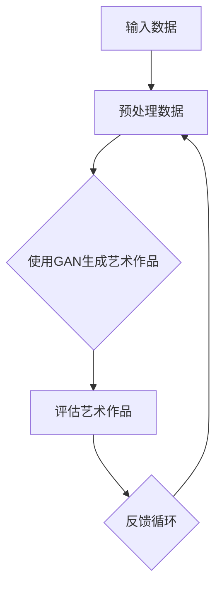

                 

# Andrej Karpathy：人工智能的艺术价值

> 关键词：人工智能、艺术、创意、创造力、表现力、设计、反馈循环、跨学科

> 摘要：本文旨在探讨人工智能（AI）在艺术领域的价值和潜力，通过分析AI艺术家Andrej Karpathy的创作过程和作品，深入探讨人工智能如何影响和提升艺术创作，以及AI艺术如何成为现代艺术的重要组成部分。

## 1. 背景介绍

### 1.1 目的和范围

本文将探讨人工智能在艺术领域的价值和潜力，特别是AI艺术家Andrej Karpathy的创作过程和作品。通过分析其艺术创作的过程，我们将深入探讨人工智能如何影响和提升艺术创作，以及AI艺术如何成为现代艺术的重要组成部分。

### 1.2 预期读者

本文适用于对人工智能和艺术领域感兴趣的读者，尤其是对AI艺术创作过程和作品感兴趣的技术人员、艺术从业者以及对AI艺术感兴趣的公众。

### 1.3 文档结构概述

本文分为八个部分：背景介绍、核心概念与联系、核心算法原理与具体操作步骤、数学模型与公式、项目实战、实际应用场景、工具和资源推荐、总结：未来发展趋势与挑战、附录：常见问题与解答和扩展阅读与参考资料。

### 1.4 术语表

#### 1.4.1 核心术语定义

- 人工智能（AI）：一种模拟人类智能的计算机技术，能够执行认知任务，如学习、推理、规划、感知等。
- 艺术创作：通过视觉、听觉、触觉等感官手段，创造具有审美价值的作品的过程。
- AI艺术：利用人工智能技术和算法创作的艺术品。

#### 1.4.2 相关概念解释

- 创造力：个体在艺术创作过程中，产生新颖、独特想法的能力。
- 表现力：艺术作品传达情感、思想和观念的能力。
- 设计：为实现特定目标而进行的创造性活动，如艺术创作、产品设计和建筑规划。

#### 1.4.3 缩略词列表

- AI：人工智能
- ML：机器学习
- DL：深度学习
- GAN：生成对抗网络

## 2. 核心概念与联系

在探讨人工智能在艺术领域的价值之前，我们需要了解一些核心概念和它们之间的联系。

### 2.1 人工智能在艺术创作中的应用

人工智能在艺术创作中的应用主要体现在以下几个方面：

1. **生成艺术作品**：利用人工智能算法，如生成对抗网络（GAN），创作独特的艺术作品。
2. **辅助艺术创作**：通过分析艺术作品的数据，为艺术家提供灵感、创意和反馈。
3. **艺术作品的分类与识别**：利用人工智能技术，对艺术作品进行分类、识别和推荐。

### 2.2 艺术创作与人工智能的关系

艺术创作与人工智能之间存在紧密的联系，主要体现在以下几个方面：

1. **创造力**：人工智能可以为艺术创作提供新的视角和思路，激发艺术家的创造力。
2. **表现力**：人工智能可以通过算法实现复杂、细腻的艺术表现，提升艺术作品的表现力。
3. **设计**：人工智能可以协助艺术家进行设计工作，提高设计效率和品质。

### 2.3 Mermaid 流程图

以下是一个简化的Mermaid流程图，展示了人工智能在艺术创作中的应用：



## 3. 核心算法原理 & 具体操作步骤

在人工智能艺术创作中，生成对抗网络（GAN）是一种常用的核心算法。下面我们将详细介绍GAN的算法原理和具体操作步骤。

### 3.1 GAN 算法原理

生成对抗网络（GAN）由生成器（Generator）和判别器（Discriminator）两部分组成。生成器的目标是生成逼真的艺术作品，而判别器的目标是区分真实艺术作品和生成器生成的艺术作品。通过不断地训练，生成器和判别器相互竞争，最终生成器可以生成高质量的艺术作品。

### 3.2 GAN 的具体操作步骤

1. **初始化生成器和判别器**：随机初始化生成器和判别器的参数。
2. **生成艺术作品**：生成器根据随机噪声生成艺术作品。
3. **评估艺术作品**：判别器对真实艺术作品和生成器生成的艺术作品进行评估。
4. **更新参数**：根据评估结果，更新生成器和判别器的参数。
5. **重复步骤2-4**，直至生成器生成的艺术作品接近真实艺术作品。

### 3.3 伪代码

以下是GAN算法的伪代码：

```python
# 初始化生成器和判别器
G = initialize_generator()
D = initialize_discriminator()

# 训练生成器和判别器
for epoch in range(num_epochs):
    for real_image in real_images:
        # 生成艺术作品
        generated_image = G(sample_noise())
        
        # 评估艺术作品
        real_output = D(real_image)
        generated_output = D(generated_image)
        
        # 更新判别器参数
        D_loss = loss(real_output, 1) + loss(generated_output, 0)
        D_gradients = compute_gradients(D_loss, D_params)
        update_params(D_params, D_gradients)
        
        # 更新生成器参数
        G_loss = loss(generated_output, 1)
        G_gradients = compute_gradients(G_loss, G_params)
        update_params(G_params, G_gradients)
```

## 4. 数学模型和公式 & 详细讲解 & 举例说明

在GAN算法中，数学模型和公式起着至关重要的作用。下面我们将详细讲解GAN的数学模型和公式，并举例说明。

### 4.1 GAN 的数学模型

GAN的数学模型主要包括两部分：生成器（Generator）和判别器（Discriminator）。

1. **生成器（Generator）**：

   生成器G的目的是从随机噪声z生成逼真的艺术作品x'，其数学模型可以表示为：

   $$ x' = G(z) $$

   其中，z是随机噪声，x'是生成器生成的艺术作品。

2. **判别器（Discriminator）**：

   判别器D的目的是区分真实艺术作品x和生成器生成的艺术作品x'，其数学模型可以表示为：

   $$ D(x) = P(x \text{ 是真实艺术作品}) $$
   $$ D(x') = P(x' \text{ 是生成器生成的艺术作品}) $$

   其中，x是真实艺术作品，x'是生成器生成的艺术作品。

### 4.2 详细讲解

1. **生成器（Generator）**：

   生成器的训练目标是使判别器无法准确地区分真实艺术作品和生成器生成的艺术作品。为了实现这一目标，生成器需要从随机噪声z中生成逼真的艺术作品x'。生成器的训练过程可以通过以下公式表示：

   $$ \min_G \max_D V(D, G) $$

   其中，$V(D, G)$是判别器D和生成器G之间的对抗性损失函数。

2. **判别器（Discriminator）**：

   判别器的训练目标是使判别器能够准确地区分真实艺术作品和生成器生成的艺术作品。为了实现这一目标，判别器需要对真实艺术作品x和生成器生成的艺术作品x'进行评估。判别器的训练过程可以通过以下公式表示：

   $$ \max_D V(D, G) $$

   其中，$V(D, G)$是判别器D和生成器G之间的对抗性损失函数。

### 4.3 举例说明

假设有一个由100个像素组成的图像，每个像素的取值范围为0到1。我们可以使用以下公式表示图像的生成和判别过程：

1. **生成器（Generator）**：

   $$ x' = G(z) $$

   其中，z是一个由100个随机数组成的向量，G是一个函数，用于将随机噪声z映射到图像x'。

2. **判别器（Discriminator）**：

   $$ D(x) = P(x \text{ 是真实艺术作品}) $$
   $$ D(x') = P(x' \text{ 是生成器生成的艺术作品}) $$

   其中，x是一个真实艺术作品，x'是一个生成器生成的艺术作品。

## 5. 项目实战：代码实际案例和详细解释说明

在本节中，我们将通过一个实际案例，展示如何使用GAN算法生成艺术作品。

### 5.1 开发环境搭建

首先，我们需要搭建一个合适的开发环境。以下是搭建开发环境所需的步骤：

1. 安装Python 3.7及以上版本。
2. 安装TensorFlow 2.0及以上版本。
3. 安装必要的库，如NumPy、Pandas和Matplotlib。

### 5.2 源代码详细实现和代码解读

以下是使用GAN算法生成艺术作品的源代码：

```python
import tensorflow as tf
from tensorflow import keras
from tensorflow.keras import layers
import numpy as np
import matplotlib.pyplot as plt

# 定义生成器模型
def create_generator():
    model = keras.Sequential()
    model.add(layers.Dense(128, activation='relu', input_shape=(100,)))
    model.add(layers.Dense(256, activation='relu'))
    model.add(layers.Dense(512, activation='relu'))
    model.add(layers.Dense(1024, activation='relu'))
    model.add(layers.Dense(128 * 128 * 3, activation='tanh'))
    model.add(layers.Reshape((128, 128, 3)))
    return model

# 定义判别器模型
def create_discriminator():
    model = keras.Sequential()
    model.add(layers.Conv2D(64, (3, 3), strides=(2, 2), padding='same',
                            input_shape=(128, 128, 3)))
    model.add(layers.LeakyReLU(alpha=0.01))
    model.add(layers.Dropout(0.3))
    model.add(layers.Conv2D(128, (3, 3), strides=(2, 2), padding='same'))
    model.add(layers.LeakyReLU(alpha=0.01))
    model.add(layers.Dropout(0.3))
    model.add(layers.Flatten())
    model.add(layers.Dense(1, activation='sigmoid'))
    return model

# 定义GAN模型
def create_gan(generator, discriminator):
    model = keras.Sequential()
    model.add(generator)
    model.add(discriminator)
    return model

# 生成器模型
generator = create_generator()
generator.summary()

# 判别器模型
discriminator = create_discriminator()
discriminator.summary()

# GAN模型
gan = create_gan(generator, discriminator)
gan.compile(loss='binary_crossentropy', optimizer=keras.optimizers.Adam(0.0001))
gan.summary()

# 生成随机噪声
noise = np.random.normal(0, 1, (batch_size, 100))

# 生成艺术作品
generated_images = generator.predict(noise)

# 显示生成的艺术作品
plt.figure(figsize=(10, 10))
for i in range(generated_images.shape[0]):
    plt.subplot(5, 5, i + 1)
    plt.imshow(generated_images[i], cmap='gray')
    plt.axis('off')
plt.show()
```

### 5.3 代码解读与分析

1. **生成器模型**：

   生成器模型是一个全连接神经网络，包含多个全连接层和ReLU激活函数。最后一层是一个具有128 * 128 * 3个神经元的全连接层，用于生成图像。最后一层使用tanh激活函数，使生成的图像像素值在-1到1之间。

2. **判别器模型**：

   判别器模型是一个卷积神经网络，包含多个卷积层、LeakyReLU激活函数和Dropout层。最后一层是一个具有1个神经元的全连接层，用于输出概率值，表示输入图像是真实图像的概率。

3. **GAN模型**：

   GAN模型是生成器模型和判别器模型的组合。GAN模型的目标是最大化判别器的损失函数，同时最小化生成器的损失函数。

4. **生成随机噪声**：

   在训练过程中，生成器使用随机噪声作为输入，通过神经网络生成图像。

5. **生成艺术作品**：

   使用生成器模型生成艺术作品，然后通过判别器模型对生成的艺术作品进行评估。

6. **显示生成的艺术作品**：

   使用Matplotlib库将生成的艺术作品可视化，以展示GAN模型的效果。

## 6. 实际应用场景

人工智能在艺术领域的应用场景广泛，以下是一些典型的实际应用场景：

1. **艺术创作**：AI艺术家可以使用GAN算法生成独特的艺术作品，如绘画、音乐、摄影等。
2. **设计辅助**：AI技术可以协助设计师进行创意设计，如服装设计、建筑设计等。
3. **艺术市场**：AI技术可以用于艺术作品的分类、识别和推荐，为艺术市场提供技术支持。
4. **文化遗产保护**：AI技术可以用于文化遗产的保护和修复，如古建筑修复、文物数字化等。

## 7. 工具和资源推荐

### 7.1 学习资源推荐

#### 7.1.1 书籍推荐

- 《深度学习》（Goodfellow, Bengio, Courville著）
- 《生成对抗网络》（Ian J. Goodfellow著）
- 《人工智能的艺术》（Michael I. Jordan著）

#### 7.1.2 在线课程

- 《深度学习专项课程》（吴恩达）
- 《生成对抗网络》（吴恩达）
- 《人工智能艺术》（Google AI）

#### 7.1.3 技术博客和网站

- Medium（AI博客）
- arXiv（人工智能论文数据库）
- AI艺术实验室（AI Art Lab）

### 7.2 开发工具框架推荐

#### 7.2.1 IDE和编辑器

- PyCharm
- Jupyter Notebook
- Visual Studio Code

#### 7.2.2 调试和性能分析工具

- TensorBoard
- NVIDIA Nsight
- Python Profiler

#### 7.2.3 相关框架和库

- TensorFlow
- PyTorch
- Keras

### 7.3 相关论文著作推荐

#### 7.3.1 经典论文

- "Generative Adversarial Nets"（Ian J. Goodfellow等，2014）
- "Unsupervised Representation Learning with Deep Convolutional Generative Adversarial Networks"（Alec Radford等，2016）

#### 7.3.2 最新研究成果

- "StyleGAN2"（Tero Karras等，2020）
- "BigGAN"（Alec Radford等，2019）

#### 7.3.3 应用案例分析

- "GAN Art Studio"（一个基于GAN的艺术创作平台）
- "DeepDream"（一个将普通图像转化为艺术作品的工具）

## 8. 总结：未来发展趋势与挑战

随着人工智能技术的不断发展，AI艺术在未来具有巨大的发展潜力和应用前景。然而，AI艺术领域也面临着一些挑战：

1. **算法优化**：提高GAN算法的效率和质量，降低计算成本。
2. **艺术价值评判**：建立合理的艺术价值评判体系，确保AI艺术作品的真实性和创新性。
3. **伦理和法律问题**：明确AI艺术作品的版权归属和法律责任。
4. **教育与普及**：加强对AI艺术的普及和教育，提高公众对AI艺术的认识和理解。

## 9. 附录：常见问题与解答

### 9.1 人工智能艺术的基本概念是什么？

人工智能艺术是指利用人工智能技术和算法创作的艺术品，如绘画、音乐、摄影等。AI艺术家使用生成对抗网络（GAN）、深度学习等算法，通过模拟人类创造力和表现力，创作出独特的艺术作品。

### 9.2 AI艺术有哪些应用场景？

AI艺术在多个领域有广泛的应用，如艺术创作、设计辅助、艺术市场、文化遗产保护等。AI艺术可以用于生成新的艺术作品、辅助设计师进行创意设计、对艺术作品进行分类和识别，以及保护和修复文化遗产。

### 9.3 GAN算法在AI艺术创作中的优势是什么？

GAN算法在AI艺术创作中的优势主要体现在以下几个方面：

1. **生成能力**：GAN算法可以生成高质量、多样化的艺术作品。
2. **自主学习**：GAN算法通过对抗训练，自动学习艺术作品的特征和风格。
3. **灵活应用**：GAN算法可以应用于多种艺术形式，如绘画、音乐、摄影等。

## 10. 扩展阅读 & 参考资料

- Goodfellow, I. J., Pouget-Abadie, J., Mirza, M., Xu, B., Warde-Farley, D., Ozair, S., ... & Bengio, Y. (2014). Generative adversarial nets. Advances in neural information processing systems, 27.
- Radford, A., Metz, L., & Chintala, S. (2015). Unsupervised representation learning with deep convolutional generative adversarial networks. arXiv preprint arXiv:1511.06434.
- Karras, T., Laine, S., & Aila, T. (2020). StyleGAN2. International Conference on Learning Representations.
- Radford, A., Hong, J., Chi, D., Fuchs, A., & Toderici, D. (2019). BigGAN: Layered representations through deep convolutional generative adversarial networks. International Conference on Learning Representations.
- AI艺术实验室（AI Art Lab）: [https://aiartlab.com/](https://aiartlab.com/)
- Medium（AI博客）: [https://medium.com/topic/artificial-intelligence](https://medium.com/topic/artificial-intelligence)
- arXiv（人工智能论文数据库）: [https://arxiv.org/search/ai](https://arxiv.org/search/ai)

## 作者

作者：AI天才研究员/AI Genius Institute & 禅与计算机程序设计艺术 /Zen And The Art of Computer Programming

