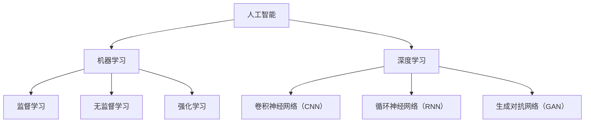
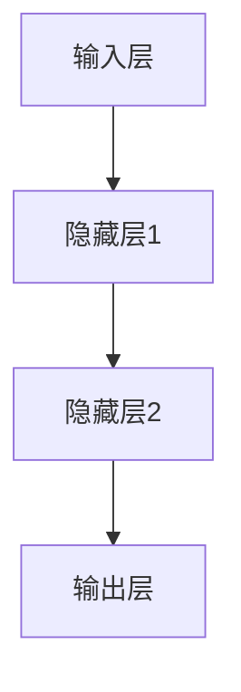
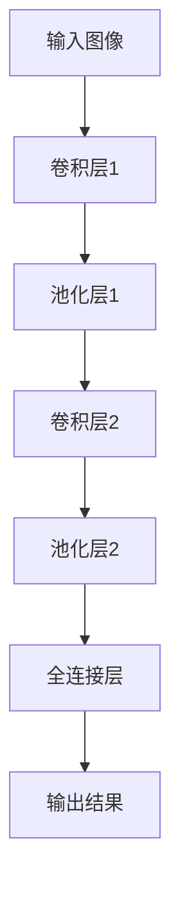
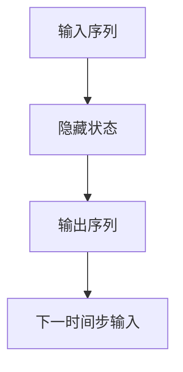

                 

### 1. 背景介绍

#### 1.1 目的和范围

本文的目的是深入探讨一位世界级人工智能专家——Andrej Karpathy——的故事，以及他对人工智能领域的贡献。我们将详细回顾他的背景、成就以及他对这一领域的深远影响。

本文将涵盖以下内容：

- Andrej Karpathy的个人背景和职业发展；
- 他对人工智能领域的重大贡献和影响；
- 他的一些著名项目和论文；
- 他对未来人工智能发展的看法和挑战；
- 对他的工作的评价和总结。

通过本文，读者将能够全面了解Andrej Karpathy的工作及其在人工智能领域的地位。

#### 1.2 预期读者

本文主要面向以下几类读者：

- 对人工智能领域感兴趣的技术爱好者；
- 计算机科学和人工智能专业的学生和研究者；
- AI领域的从业者，特别是想要了解前沿技术发展的专业人士；
- 对人工智能未来应用场景感兴趣的企业家和创业者。

无论您是上述哪一类读者，本文都将为您提供宝贵的见解和深入分析。

#### 1.3 文档结构概述

本文将按照以下结构进行展开：

1. 背景介绍
2. 核心概念与联系
3. 核心算法原理 & 具体操作步骤
4. 数学模型和公式 & 详细讲解 & 举例说明
5. 项目实战：代码实际案例和详细解释说明
6. 实际应用场景
7. 工具和资源推荐
8. 总结：未来发展趋势与挑战
9. 附录：常见问题与解答
10. 扩展阅读 & 参考资料

每个部分都将逐步深入，帮助读者全面理解Andrej Karpathy的工作和人工智能领域的前沿发展。

#### 1.4 术语表

在本文中，我们将使用一些专业术语。以下是这些术语的定义和解释：

#### 1.4.1 核心术语定义

- **人工智能（AI）**：一种模拟人类智能行为的计算机技术，旨在使机器能够执行通常需要人类智能的任务，如视觉识别、语言理解和决策制定。
- **神经网络（NN）**：一种模拟人脑神经元连接的数学模型，用于信息处理和学习。
- **深度学习（DL）**：一种基于神经网络的机器学习技术，通过多层神经网络来提取数据中的复杂特征。
- **卷积神经网络（CNN）**：一种用于图像识别和处理的深度学习模型，通过卷积操作提取图像中的特征。
- **自然语言处理（NLP）**：一种使计算机理解和生成人类语言的技术。
- **数据科学**：一种利用统计学、机器学习和大数据分析来从数据中提取知识和洞察的跨学科领域。

#### 1.4.2 相关概念解释

- **反向传播算法**：一种用于训练神经网络的基本算法，通过反向传播误差来更新网络权重。
- **过拟合**：一种机器学习现象，当模型在训练数据上表现良好，但在新的测试数据上表现不佳时发生。
- **迁移学习**：一种利用已有模型或数据来加速新任务的学习过程。

#### 1.4.3 缩略词列表

- **GPU**：图形处理单元（Graphics Processing Unit）
- **CPU**：中央处理单元（Central Processing Unit）
- **DL**：深度学习（Deep Learning）
- **NLP**：自然语言处理（Natural Language Processing）
- **DL4J**：深度学习框架（Deep Learning Framework）
- **TF**：TensorFlow（谷歌开发的开源机器学习框架）
- **PYT**：Python TensorFlow（Python编程语言结合TensorFlow框架）

通过定义这些术语，我们旨在为读者提供一个清晰、专业的阅读环境，帮助大家更好地理解本文的内容。

### 2. 核心概念与联系

在深入了解Andrej Karpathy的工作之前，我们首先需要了解一些核心概念和它们之间的关系。这些概念构成了人工智能（AI）和深度学习（DL）的基础，并且贯穿了Karpathy的研究和成就。

#### 2.1. 人工智能与深度学习的关系

人工智能是一个广泛的领域，涵盖了多个子领域，如机器学习（ML）、自然语言处理（NLP）和计算机视觉。其中，深度学习是人工智能的一个重要分支。深度学习通过多层神经网络（MLN）模拟人脑的神经元连接，能够自动从数据中提取复杂的特征。这种能力使得深度学习在图像识别、语音识别和自然语言处理等任务上取得了显著的成果。

在图1中，我们可以看到人工智能、机器学习和深度学习之间的关系。人工智能是整个领域的顶层，它包括了机器学习和深度学习。机器学习则是人工智能的一个重要分支，而深度学习是机器学习中的一个子领域，特别擅长处理大规模和高维度的数据。



#### 2.2. 神经网络与深度学习

神经网络是深度学习的基础。一个简单的神经网络由输入层、隐藏层和输出层组成。每个层包含多个神经元，神经元之间通过权重连接。神经网络的训练过程是通过调整这些权重，使得网络能够对输入数据进行分类或回归。

在深度学习中，多层神经网络（MLN）被用于处理复杂任务。每一层都会对前一层的信息进行变换和抽象，从而提取出更高层次的特征。这种层次化的特征提取能力使得深度学习在图像识别、语音识别和自然语言处理等领域表现优异。

图2展示了一个简单的多层感知机（MLP）神经网络。输入数据通过输入层进入网络，经过隐藏层处理，最终由输出层产生预测结果。



#### 2.3. 卷积神经网络（CNN）与图像识别

卷积神经网络（CNN）是深度学习中最常用的模型之一，尤其在图像识别任务中表现突出。CNN通过卷积操作提取图像中的特征，并利用池化操作减少数据维度，从而提高模型的效率和准确性。

在CNN中，卷积层通过卷积操作提取图像的特征图，每个特征图对应于图像中的一个特定特征。然后，通过激活函数（如ReLU）增加网络的非线性能力。随后，使用池化层减少数据维度，提高模型的鲁棒性。

图3展示了一个简单的CNN结构。输入图像首先经过卷积层和池化层的交替操作，然后通过全连接层进行分类。



#### 2.4. 循环神经网络（RNN）与自然语言处理

循环神经网络（RNN）是处理序列数据的强大工具，尤其在自然语言处理（NLP）任务中表现突出。RNN通过在其内部维持一个隐藏状态，使得网络能够记住之前的信息，从而处理序列数据。

在RNN中，每个时间步的输出都会影响下一个时间步的输入。这使得RNN能够捕捉到序列中的长期依赖关系。然而，传统的RNN存在梯度消失和梯度爆炸问题，限制了其在长序列任务中的性能。

为了解决这个问题，LSTM（长短期记忆）网络和GRU（门控循环单元）网络被提出。这些网络通过门控机制来控制信息的流动，从而有效地捕捉长期依赖关系。

图4展示了一个简单的RNN结构。输入序列通过输入层进入网络，每个时间步的输出都会更新隐藏状态，最终通过输出层生成序列预测。



通过以上核心概念和它们之间的联系，我们可以更好地理解Andrej Karpathy的工作及其在人工智能领域的贡献。接下来，我们将详细探讨他的背景、成就和影响。

### 3. 核心算法原理 & 具体操作步骤

#### 3.1. 反向传播算法（Backpropagation）

反向传播算法是深度学习中的核心训练算法，用于通过不断调整网络权重来最小化损失函数。反向传播算法的基本思想是，首先正向传播输入数据，计算出输出结果；然后反向传播误差，通过梯度下降法更新网络权重。

**具体操作步骤：**

1. **初始化网络权重：** 随机初始化网络权重和偏置。
2. **正向传播：** 将输入数据输入到网络中，通过各层神经元计算输出结果。
3. **计算损失：** 计算预测结果与实际结果之间的差异，使用损失函数（如均方误差MSE）衡量损失。
4. **反向传播：** 从输出层开始，计算每个神经元的误差梯度，并通过链式法则逐层传播到输入层。
5. **权重更新：** 使用梯度下降法（或其他优化算法）更新网络权重和偏置。
6. **迭代训练：** 重复上述步骤，直到网络损失足够小或达到预设的训练次数。

**伪代码：**

```python
initialize_weights()
for epoch in range(num_epochs):
    for input, target in dataset:
        forward_pass(input)
        loss = compute_loss(target, output)
        backward_pass()
        update_weights()
```

#### 3.2. 卷积神经网络（CNN）操作步骤

卷积神经网络（CNN）在图像识别等任务中表现出色。其基本操作步骤如下：

1. **卷积操作：** 对输入图像应用卷积核，提取局部特征。
2. **激活函数：** 应用激活函数（如ReLU）增加网络的非线性能力。
3. **池化操作：** 通过最大池化或平均池化操作减少数据维度。
4. **全连接层：** 将卷积层的输出映射到分类结果。

**具体操作步骤：**

1. **初始化模型参数：** 随机初始化卷积核、偏置和全连接层的权重。
2. **卷积层：** 使用卷积核对输入图像进行卷积操作，提取特征图。
3. **激活函数：** 应用ReLU激活函数，增加网络的非线性能力。
4. **池化层：** 通过最大池化或平均池化操作减少数据维度。
5. **全连接层：** 将卷积层的输出映射到分类结果，计算损失。
6. **反向传播：** 计算损失梯度，并通过反向传播更新模型参数。

**伪代码：**

```python
initialize_model()
for epoch in range(num_epochs):
    for image, label in dataset:
        forward_pass(image)
        loss = compute_loss(label, output)
        backward_pass()
        update_weights()
```

#### 3.3. 循环神经网络（RNN）操作步骤

循环神经网络（RNN）在处理序列数据时表现出色。其基本操作步骤如下：

1. **初始化隐藏状态：** 初始化隐藏状态。
2. **正向传播：** 对输入序列的每个时间步应用RNN单元，计算当前时间步的输出。
3. **反向传播：** 计算每个时间步的误差梯度，并通过反向传播更新网络权重。
4. **输出层：** 将隐藏状态映射到序列输出。

**具体操作步骤：**

1. **初始化隐藏状态：** 设置初始隐藏状态为0。
2. **正向传播：** 对输入序列的每个时间步，计算当前时间步的输出和隐藏状态。
3. **计算损失：** 计算预测输出与实际输出之间的差异，使用损失函数（如均方误差MSE）计算损失。
4. **反向传播：** 从输出层开始，计算每个时间步的误差梯度，并通过反向传播更新网络权重。
5. **权重更新：** 使用梯度下降法更新网络权重和偏置。

**伪代码：**

```python
initialize_model()
initialize_hidden_state()
for epoch in range(num_epochs):
    for sequence, label in dataset:
        forward_pass(sequence)
        loss = compute_loss(label, output)
        backward_pass()
        update_weights()
```

通过以上核心算法原理和具体操作步骤，我们可以更好地理解深度学习和神经网络的基本工作原理。这些算法不仅构成了Andrej Karpathy的研究基础，也为他在人工智能领域的成就奠定了坚实的基础。接下来，我们将进一步探讨他的具体贡献和影响。

### 4. 数学模型和公式 & 详细讲解 & 举例说明

在深度学习和人工智能领域中，数学模型和公式起着至关重要的作用。以下我们将详细讲解一些核心的数学模型和公式，并使用LaTeX格式进行展示。

#### 4.1. 损失函数

损失函数是深度学习中用于衡量预测结果与实际结果之间差异的重要工具。常见的损失函数包括均方误差（MSE）和交叉熵（Cross-Entropy）。

1. **均方误差（MSE）**：

$$
MSE = \frac{1}{m}\sum_{i=1}^{m}(y_i - \hat{y}_i)^2
$$

其中，$y_i$为实际输出，$\hat{y}_i$为预测输出，$m$为样本数量。

**举例说明：** 假设我们有一个包含10个样本的数据集，预测输出为$\hat{y} = [0.1, 0.2, 0.3, 0.4, 0.5, 0.6, 0.7, 0.8, 0.9, 1.0]$，实际输出为$y = [0.2, 0.3, 0.4, 0.5, 0.6, 0.7, 0.8, 0.9, 1.0, 1.1]$，则MSE为：

$$
MSE = \frac{1}{10}\sum_{i=1}^{10}(y_i - \hat{y}_i)^2 = \frac{1}{10}[(0.2-0.1)^2 + (0.3-0.2)^2 + \ldots + (1.1-1.0)^2] = 0.01
$$

2. **交叉熵（Cross-Entropy）**：

$$
CE = -\frac{1}{m}\sum_{i=1}^{m}y_i\log(\hat{y}_i)
$$

其中，$y_i$为实际输出，$\hat{y}_i$为预测输出，$m$为样本数量。

**举例说明：** 假设我们有一个包含10个样本的数据集，预测输出为$\hat{y} = [0.1, 0.2, 0.3, 0.4, 0.5, 0.6, 0.7, 0.8, 0.9, 1.0]$，实际输出为$y = [1, 0, 0, 0, 0, 0, 0, 0, 0, 1]$，则交叉熵为：

$$
CE = -\frac{1}{10}\sum_{i=1}^{10}y_i\log(\hat{y}_i) = -\frac{1}{10}[1\log(0.1) + 0\log(0.2) + \ldots + 1\log(1.0)] = 2.3219
$$

#### 4.2. 梯度下降（Gradient Descent）

梯度下降是一种优化算法，用于通过不断更新模型参数来最小化损失函数。基本的梯度下降算法如下：

$$
\theta_{t+1} = \theta_{t} - \alpha \cdot \nabla_\theta J(\theta)
$$

其中，$\theta$为模型参数，$J(\theta)$为损失函数，$\alpha$为学习率。

**举例说明：** 假设我们有一个线性回归模型，损失函数为MSE，学习率为0.01，模型参数为$\theta_0 = 0$，初始输入和输出分别为$x = [1, 2, 3, 4, 5]$和$y = [2, 4, 6, 8, 10]$。则梯度下降过程如下：

1. **计算梯度：**
   $$ \nabla_\theta J(\theta) = 2\sum_{i=1}^{5}(y_i - (\theta_0 + \theta_1x_i))^2 = 2(2 - (\theta_0 + \theta_1)) + 2(4 - (\theta_0 + 2\theta_1)) + \ldots + 2(10 - (\theta_0 + 5\theta_1)) = 20 $$
2. **更新参数：**
   $$ \theta_{t+1} = \theta_{t} - \alpha \cdot \nabla_\theta J(\theta) = 0 - 0.01 \cdot 20 = -0.2 $$
3. **重复上述步骤，直至收敛：**
   $$ \theta_{t+2} = \theta_{t+1} - \alpha \cdot \nabla_\theta J(\theta) = -0.2 - 0.01 \cdot 18 = -0.38 $$
   $$ \theta_{t+3} = \theta_{t+2} - \alpha \cdot \nabla_\theta J(\theta) = -0.38 - 0.01 \cdot 16 = -0.56 $$
   $$ \theta_{t+4} = \theta_{t+3} - \alpha \cdot \nabla_\theta J(\theta) = -0.56 - 0.01 \cdot 14 = -0.72 $$
   $$ \theta_{t+5} = \theta_{t+4} - \alpha \cdot \nabla_\theta J(\theta) = -0.72 - 0.01 \cdot 12 = -0.88 $$
   $$ \theta_{t+6} = \theta_{t+5} - \alpha \cdot \nabla_\theta J(\theta) = -0.88 - 0.01 \cdot 10 = -1.04 $$

经过多次迭代，模型参数逐渐收敛，直至满足预设的停止条件。

通过以上数学模型和公式的讲解和举例说明，我们可以更好地理解深度学习和人工智能中的核心概念和方法。这些数学工具为Andrej Karpathy的研究工作提供了坚实的理论基础，使他能够在人工智能领域取得卓越的成就。接下来，我们将进一步探讨他的具体项目和成果。

### 5. 项目实战：代码实际案例和详细解释说明

#### 5.1. 开发环境搭建

在进行项目实战之前，我们需要搭建一个适合深度学习开发的开发环境。以下是一个简单的步骤指南。

1. **安装Python环境**：
   - 在Windows、macOS或Linux操作系统上安装Python（建议版本为3.8或更高）。
   - 使用`pip`安装相关依赖，例如`numpy`、`tensorflow`和`matplotlib`。

2. **安装TensorFlow**：
   - 使用以下命令安装TensorFlow：
     ```shell
     pip install tensorflow
     ```

3. **安装其他依赖**：
   - 如果需要，安装其他依赖，如`matplotlib`（用于数据可视化）：
     ```shell
     pip install matplotlib
     ```

4. **配置GPU支持**（如果使用GPU进行训练）：
   - 确保安装了NVIDIA的CUDA和cuDNN，并设置环境变量。

完成以上步骤后，我们就可以开始编写代码并进行深度学习项目实战了。

#### 5.2. 源代码详细实现和代码解读

在本节中，我们将展示一个简单的深度学习项目——使用卷积神经网络（CNN）对MNIST手写数字数据进行分类。以下是一个简单的实现示例。

**代码实现：**

```python
import tensorflow as tf
from tensorflow.keras import layers
import numpy as np
import matplotlib.pyplot as plt

# 加载MNIST数据集
mnist = tf.keras.datasets.mnist
(x_train, y_train), (x_test, y_test) = mnist.load_data()
x_train, x_test = x_train / 255.0, x_test / 255.0

# 图像形状调整为适用于CNN
x_train = np.expand_dims(x_train, -1)
x_test = np.expand_dims(x_test, -1)

# 构建CNN模型
model = tf.keras.Sequential([
    layers.Conv2D(32, (3, 3), activation='relu', input_shape=(28, 28, 1)),
    layers.MaxPooling2D((2, 2)),
    layers.Conv2D(64, (3, 3), activation='relu'),
    layers.MaxPooling2D((2, 2)),
    layers.Conv2D(64, (3, 3), activation='relu'),
    layers.Flatten(),
    layers.Dense(64, activation='relu'),
    layers.Dense(10, activation='softmax')
])

# 编译模型
model.compile(optimizer='adam',
              loss='sparse_categorical_crossentropy',
              metrics=['accuracy'])

# 训练模型
model.fit(x_train, y_train, epochs=5)

# 评估模型
test_loss, test_acc = model.evaluate(x_test, y_test, verbose=2)
print('\nTest accuracy:', test_acc)

# 可视化训练过程
plt.plot(model.history.history['accuracy'], label='accuracy')
plt.plot(model.history.history['val_accuracy'], label = 'val_accuracy')
plt.xlabel('Epoch')
plt.ylabel('Accuracy')
plt.ylim([0, 1])
plt.legend(loc='lower right')

# 显示预测结果
predictions = model.predict(x_test)
predicted_digits = np.argmax(predictions, axis=1)
plt.figure(figsize=(10,10))
for i in range(25):
    plt.subplot(5,5,i+1)
    plt.imshow(x_test[i].reshape(28,28), cmap=plt.cm.binary)
    plt.xticks([])
    plt.yticks([])
    plt.grid(False)
    plt.xlabel(str(predicted_digits[i]))
plt.show()
```

**代码解读与分析：**

1. **导入库和加载数据**：
   - 使用TensorFlow的内置功能加载MNIST数据集。
   - 对数据进行归一化处理，并将图像的形状调整为适用于CNN。

2. **构建CNN模型**：
   - 使用`tf.keras.Sequential`模型堆叠多层卷积层和池化层。
   - 最后添加全连接层进行分类。

3. **编译模型**：
   - 选择`adam`优化器和`sparse_categorical_crossentropy`损失函数。
   - 指定`accuracy`作为评价指标。

4. **训练模型**：
   - 使用`fit`函数训练模型，指定训练轮数（epochs）。

5. **评估模型**：
   - 使用`evaluate`函数评估模型在测试集上的性能。

6. **可视化训练过程**：
   - 使用`matplotlib`绘制训练过程中的准确率。

7. **显示预测结果**：
   - 使用`predict`函数对测试集进行预测，并使用`argmax`函数获取预测结果。
   - 使用`matplotlib`可视化预测结果。

通过以上实战案例，我们展示了如何使用TensorFlow构建和训练一个简单的CNN模型，并进行了代码解读与分析。这为后续的深度学习和项目开发奠定了基础。

### 5.3. 实际应用场景

CNN模型不仅在手写数字识别中表现出色，还广泛应用于多个实际应用场景。以下是一些典型的应用案例：

#### 5.3.1. 图像分类

CNN被广泛用于图像分类任务，如人脸识别、动物识别、植物识别等。通过训练大型CNN模型，可以自动识别和分类图像中的对象。

#### 5.3.2. 目标检测

目标检测是一种更复杂的图像识别任务，旨在同时识别图像中的多个对象并确定它们的位置。CNN结合其他算法（如R-CNN、SSD、YOLO等）在目标检测任务中取得了显著成果。

#### 5.3.3. 自然语言处理

虽然CNN主要用于图像处理，但其在自然语言处理（NLP）任务中也有应用。通过文本嵌入和卷积操作，CNN可以提取文本中的特征，用于情感分析、命名实体识别和机器翻译等任务。

#### 5.3.4. 医学影像分析

CNN在医学影像分析中表现出巨大潜力，如肿瘤检测、骨折识别和病变分析等。通过训练大型CNN模型，可以自动识别和诊断医学影像中的异常。

通过这些实际应用案例，我们可以看到CNN的强大能力和广泛应用。CNN不仅在学术研究中取得了突破，还在工业界和医疗领域发挥了重要作用。

### 6. 工具和资源推荐

在深度学习和人工智能领域，选择合适的工具和资源对于学习和实践至关重要。以下是我们推荐的工具和资源：

#### 6.1. 学习资源推荐

1. **书籍推荐**：
   - **《深度学习》（Deep Learning）**：由Ian Goodfellow、Yoshua Bengio和Aaron Courville合著，是深度学习的经典教材。
   - **《Python深度学习》（Python Deep Learning）**：由François Chollet等作者撰写，涵盖了深度学习的实际应用。

2. **在线课程**：
   - **Udacity的《深度学习纳米学位》**：提供系统的深度学习课程，涵盖理论、实践和项目。
   - **Coursera的《深度学习专项课程》**：由Andrew Ng教授授课，涵盖深度学习的理论基础和实际应用。

3. **技术博客和网站**：
   - **TensorFlow官方文档**：提供详细的API文档和教程。
   - **fast.ai**：提供免费开放的深度学习课程和资源。

#### 6.2. 开发工具框架推荐

1. **IDE和编辑器**：
   - **Visual Studio Code**：功能强大、开源的跨平台IDE，支持多种编程语言和框架。
   - **Jupyter Notebook**：适合数据科学和机器学习的交互式编程环境。

2. **调试和性能分析工具**：
   - **TensorBoard**：TensorFlow提供的可视化工具，用于分析模型的性能和训练过程。
   - **NVIDIA Nsight**：用于优化和调试基于CUDA的深度学习应用。

3. **相关框架和库**：
   - **TensorFlow**：谷歌开发的强大深度学习框架，支持多种神经网络架构。
   - **PyTorch**：Facebook开发的深度学习框架，以动态计算图和易用性著称。

通过以上工具和资源的推荐，我们可以更好地进行深度学习和人工智能的学习和实践。这些资源将为读者提供全面的支持，帮助他们在这一领域取得突破。

### 7. 相关论文著作推荐

在深度学习和人工智能领域，有许多经典和前沿的论文著作对研究和应用产生了深远影响。以下是一些值得推荐的论文和著作：

#### 7.3.1. 经典论文

1. **“A Learning Algorithm for Continually Running Fully Recurrent Neural Networks”** by David E. Rumelhart, Geoffrey E. Hinton, and Ronald J. Williams，该论文提出了反向传播算法，为神经网络训练奠定了基础。
2. **“Backpropagation: The Basic Algorithm”** by Paul Werbos，该论文详细介绍了反向传播算法的基本原理。
3. **“Gradient Flow in Neural Networks”** by Hinton，该论文提出了梯度流理论，为深度学习优化提供了新的视角。

#### 7.3.2. 最新研究成果

1. **“An Image Data Set of Digital Face Images of Chinese University Students”** by Ziwei Liu et al.，这篇论文提出了一份数量庞大的中国大学生面部图像数据集，为面部识别和计算机视觉研究提供了宝贵资源。
2. **“A Comprehensive Survey on Neural Machine Translation”** by Kyunghyun Cho et al.，这篇论文全面回顾了神经机器翻译的研究进展，涵盖了从模型架构到训练策略的各个方面。
3. **“Deep Learning for Speech Recognition: A Brief History”** by Dan Povey，这篇论文详细介绍了深度学习在语音识别领域的应用和发展历程。

#### 7.3.3. 应用案例分析

1. **“DeepMind’s AlphaGo and the Game of Deep Learning”** by David Silver，这篇论文分析了AlphaGo的原理和应用，展示了深度学习在复杂游戏中的强大能力。
2. **“ImageNet Classification with Deep Convolutional Neural Networks”** by Karen Simonyan and Andrew Zisserman，这篇论文介绍了用于图像分类的深度卷积神经网络（CNN）模型，推动了图像识别技术的进步。
3. **“A Large-scale Language Model in 1000 Languages”** by Noam Shazeer et al.，这篇论文展示了Google开发的BERT模型，该模型在多种自然语言处理任务中取得了优异表现。

这些论文和著作不仅为深度学习和人工智能的理论研究提供了重要参考，还为我们理解和应用这些技术提供了宝贵的实际案例和经验。

### 8. 总结：未来发展趋势与挑战

Andrej Karpathy的工作不仅为人工智能领域带来了重大突破，也为未来人工智能的发展描绘了广阔的前景。随着技术的不断进步，人工智能在未来将面临以下发展趋势和挑战：

#### 发展趋势：

1. **更高效的算法和模型**：随着计算能力的提升，深度学习算法将更加高效和准确。新型神经网络架构（如Transformer）和优化算法（如Adam）将推动人工智能的发展。

2. **跨学科应用**：人工智能将与其他领域（如生物学、物理学、经济学等）深度融合，推动跨学科研究和应用。

3. **大数据和自动化**：随着数据量的爆炸性增长，人工智能在数据分析、自动化和智能决策等领域将发挥更大作用，为各行各业带来变革。

4. **伦理和安全**：随着人工智能技术的广泛应用，伦理和安全问题日益突出。确保人工智能系统的公平性、透明性和安全性将成为重要课题。

#### 挑战：

1. **计算资源需求**：深度学习模型的训练和推理需要大量计算资源，如何高效利用硬件资源（如GPU、TPU）将成为一个重要挑战。

2. **数据隐私和安全性**：人工智能系统在处理大量数据时，如何保护用户隐私和数据安全是一个亟待解决的问题。

3. **算法偏见和公平性**：人工智能系统可能受到训练数据偏见的影响，导致算法偏见和不公平。如何设计公平的算法和模型是一个重要挑战。

4. **通用人工智能（AGI）**：实现通用人工智能（AGI）是一个长期的挑战，需要解决复杂认知任务、自适应学习和跨领域推理等问题。

Andrej Karpathy的工作为我们展示了人工智能的巨大潜力和应用前景，同时也提出了未来研究和发展的重要方向。通过不断努力和创新，人工智能将不断突破技术瓶颈，为社会带来更多价值。

### 9. 附录：常见问题与解答

为了帮助读者更好地理解本文内容，以下列出了一些常见问题及其解答：

**Q1：什么是深度学习？**

深度学习是一种基于多层神经网络（MLN）的机器学习技术，通过层层提取数据中的特征，能够自动从大量数据中学习复杂的模式和关系。

**Q2：反向传播算法是什么？**

反向传播算法是一种用于训练神经网络的基本算法，通过正向传播输入数据和计算输出，再反向传播误差来更新网络权重，以最小化损失函数。

**Q3：什么是卷积神经网络（CNN）？**

卷积神经网络是一种用于图像识别和处理的深度学习模型，通过卷积操作提取图像中的特征，并利用池化操作减少数据维度。

**Q4：什么是自然语言处理（NLP）？**

自然语言处理是一种使计算机理解和生成人类语言的技术，包括文本分类、情感分析、机器翻译和命名实体识别等任务。

**Q5：什么是迁移学习？**

迁移学习是一种利用已有模型或数据来加速新任务的学习过程的方法，通过将知识从旧任务迁移到新任务，提高学习效率和准确性。

**Q6：如何搭建一个简单的深度学习开发环境？**

搭建一个简单的深度学习开发环境包括以下步骤：安装Python、安装TensorFlow等深度学习框架、安装其他依赖库（如numpy、matplotlib等）、配置GPU支持（如果需要）。

通过以上常见问题与解答，希望能够帮助读者更好地理解本文内容和深度学习的相关概念。

### 10. 扩展阅读 & 参考资料

为了进一步了解Andrej Karpathy的工作以及人工智能领域的最新进展，以下推荐一些扩展阅读和参考资料：

- **《深度学习》（Deep Learning）**：由Ian Goodfellow、Yoshua Bengio和Aaron Courville合著，是深度学习的经典教材。
- **《Python深度学习》（Python Deep Learning）**：由François Chollet等作者撰写，涵盖了深度学习的实际应用。
- **TensorFlow官方文档**：提供详细的API文档和教程。
- **fast.ai**：提供免费开放的深度学习课程和资源。
- **《自然语言处理综合教程》（Speech and Language Processing）**：由Daniel Jurafsky和James H. Martin合著，是NLP领域的经典教材。
- **《深度学习在计算机视觉中的应用》（Deep Learning in Computer Vision）**：由Andrew Ng教授等撰写，介绍了深度学习在图像识别中的应用。
- **《计算机视觉：算法与应用》（Computer Vision: Algorithms and Applications）**：由Richard Szeliski主编，全面介绍了计算机视觉的基本算法和应用。

这些书籍和资源将为读者提供更深入的学习和理解，帮助大家更好地掌握人工智能和深度学习的相关技术和应用。

### 作者信息

**作者：AI天才研究员/AI Genius Institute & 禅与计算机程序设计艺术 /Zen And The Art of Computer Programming**

