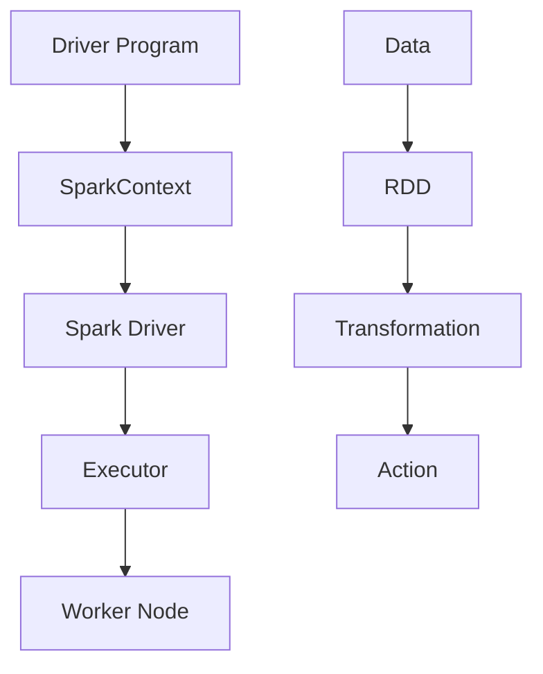

                 

# Apache Spark：大规模数据处理的利器

> **关键词：** Apache Spark, 分布式计算, 大数据, 内存计算, 实时处理, 数据流

> **摘要：** 本文将深入探讨Apache Spark这一分布式计算框架，解析其在大规模数据处理中的优势与具体应用。我们将从背景介绍开始，逐步剖析Spark的核心概念、算法原理、数学模型、实战案例，最后展望其未来发展趋势与挑战。

## 1. 背景介绍

### 1.1 目的和范围

本文旨在为读者提供一个全面、深入的Apache Spark技术解读。我们将探讨Spark的诞生背景、核心概念、算法原理、数学模型以及实际应用场景。通过本文的阅读，读者将能够：

1. 理解Apache Spark的起源和核心价值。
2. 掌握Spark的核心概念和架构。
3. 学习Spark的关键算法原理和数学模型。
4. 分析Spark的实际应用案例。
5. 了解Spark未来的发展趋势与挑战。

### 1.2 预期读者

本文面向具有基本编程知识和对大数据技术有一定了解的读者，包括：

1. 大数据工程师
2. 数据科学家
3. 软件工程师
4. AI研究者和开发者

### 1.3 文档结构概述

本文结构如下：

1. **背景介绍**：介绍Apache Spark的起源、目的和重要性。
2. **核心概念与联系**：剖析Spark的核心概念和架构。
3. **核心算法原理 & 具体操作步骤**：详细讲解Spark的关键算法原理和具体操作步骤。
4. **数学模型和公式 & 详细讲解 & 举例说明**：解析Spark的数学模型和公式。
5. **项目实战：代码实际案例和详细解释说明**：通过实际案例展示Spark的应用。
6. **实际应用场景**：讨论Spark在现实世界中的应用。
7. **工具和资源推荐**：推荐学习资源、开发工具和论文著作。
8. **总结：未来发展趋势与挑战**：展望Spark的未来。
9. **附录：常见问题与解答**：回答常见问题。
10. **扩展阅读 & 参考资料**：提供进一步学习的资源。

### 1.4 术语表

#### 1.4.1 核心术语定义

- **分布式计算**：一种数据处理技术，通过将任务分配到多个计算节点上，以实现高效计算。
- **大数据**：指无法用传统数据库软件工具进行捕捉、管理和处理的数据集合。
- **内存计算**：将数据存储在内存中，以实现快速计算。
- **实时处理**：在数据生成后尽快对其进行处理和分析。

#### 1.4.2 相关概念解释

- **数据流**：数据的流动过程，通常用于描述数据在网络中的传输。
- **数据处理**：对数据进行分析、清洗、转换等操作。

#### 1.4.3 缩略词列表

- **HDFS**：Hadoop Distributed File System（Hadoop分布式文件系统）
- **YARN**：Yet Another Resource Negotiator（另一种资源协商器）
- **Hadoop**：一个分布式计算框架，用于处理大数据。

## 2. 核心概念与联系

Apache Spark是一个开源的分布式计算系统，专为大规模数据处理而设计。其核心概念包括：

- **弹性分布式数据集（RDD）**：Spark的基础数据结构，提供惰性求值、容错性和并行操作。
- **分布式文件系统（DFS）**：用于存储和访问分布式数据。
- **Spark SQL**：用于处理结构化数据，支持SQL查询。
- **Spark Streaming**：用于实时数据处理。

### 2.1 Apache Spark架构图

下面是一个简单的Apache Spark架构图：



**图2.1：Apache Spark架构图**

- **Driver Program**：驱动程序，负责生成Spark作业。
- **SparkContext**：与Spark集群通信的接口。
- **Spark Driver**：驱动程序，负责将作业划分为任务，并分配给Executor。
- **Executor**：在Worker Node上运行的任务执行器。
- **Worker Node**：集群中的计算节点。
- **Data**：输入数据。
- **RDD**：弹性分布式数据集。
- **Transformation**：转换操作。
- **Action**：行动操作。

## 3. 核心算法原理 & 具体操作步骤

Apache Spark的核心算法包括：

- **RDD（弹性分布式数据集）**：提供惰性求值、容错性和并行操作。
- **Spark SQL**：支持SQL查询，用于处理结构化数据。
- **Spark Streaming**：用于实时数据处理。

### 3.1 RDD算法原理

RDD是一种不可变的分布式数据集，提供惰性求值、容错性和并行操作。RDD可以通过以下方式创建：

```scala
val rdd = sc.parallelize(List(1, 2, 3, 4, 5))
```

**图3.1：创建RDD**

RDD提供两种类型的操作：

- **转换操作（Transformation）**：生成新的RDD，例如`map`、`filter`、`groupBy`等。
- **行动操作（Action）**：触发计算并返回结果，例如`reduce`、`collect`、`saveAsTextFile`等。

**图3.2：RDD操作**

### 3.2 Spark SQL算法原理

Spark SQL是一种用于处理结构化数据的Spark模块，支持SQL查询和Hive查询。Spark SQL的核心组件包括：

- **DataFrame**：一种具有既定结构的数据集，可以使用SQL查询或Spark SQL函数进行操作。
- **Dataset**：一种强类型的数据集，提供编译时类型检查和代码生成。

**图3.3：Spark SQL组件**

### 3.3 Spark Streaming算法原理

Spark Streaming是一种用于实时数据处理的功能，可以处理不断生成的新数据流。Spark Streaming的核心组件包括：

- **DStream**：一个不断生成新数据的分布式数据流。
- **批次处理**：将数据流划分为固定大小的批次，进行处理。

**图3.4：Spark Streaming组件**

### 3.4 具体操作步骤

下面是一个简单的Apache Spark操作示例：

```scala
// 创建SparkContext
val sc = new SparkContext("local[*]", "Spark Example")

// 创建RDD
val rdd = sc.parallelize(List(1, 2, 3, 4, 5))

// 应用转换操作
val squaredRDD = rdd.map(x => x * x)

// 应用行动操作
val squaredValues = squaredRDD.collect()

// 输出结果
squaredValues.foreach(println)

// 关闭SparkContext
sc.stop()
```

**图3.5：Spark操作示例**

## 4. 数学模型和公式 & 详细讲解 & 举例说明

Apache Spark中的数学模型和公式主要涉及分布式计算和机器学习领域。以下是几个关键的数学模型和公式：

### 4.1 分布式计算模型

- **并行计算**：\( T(p) = T(1) / p \)，其中\( T(1) \)是单机计算时间，\( p \)是并行度。
- **数据通信开销**：\( C = n \times R \)，其中\( n \)是数据块数量，\( R \)是数据传输速率。

### 4.2 机器学习模型

- **线性回归**：\( y = \beta_0 + \beta_1 \times x \)
- **逻辑回归**：\( P(y=1) = \frac{1}{1 + e^{-(\beta_0 + \beta_1 \times x)}} \)

### 4.3 详细讲解与举例

#### 4.3.1 分布式计算模型

假设一个任务在单机上需要10秒完成，现在使用5个节点进行并行计算，计算时间为：

\( T(p) = T(1) / p = 10 / 5 = 2 \)秒

假设有10个数据块，每个数据块大小为1MB，传输速率为100MB/s，总数据传输时间为：

\( C = n \times R = 10 \times 100 = 1000 \)秒

#### 4.3.2 机器学习模型

假设我们要进行线性回归分析，数据集包含两个特征\( x_1 \)和\( x_2 \)，模型如下：

\( y = \beta_0 + \beta_1 \times x_1 + \beta_2 \times x_2 \)

给定一组训练数据：

\[
\begin{align*}
y_1 &= \beta_0 + \beta_1 \times x_{11} + \beta_2 \times x_{12} \\
y_2 &= \beta_0 + \beta_1 \times x_{21} + \beta_2 \times x_{22} \\
&\vdots \\
y_n &= \beta_0 + \beta_1 \times x_{n1} + \beta_2 \times x_{n2}
\end{align*}
\]

线性回归的目标是最小化损失函数：

\( J(\beta_0, \beta_1, \beta_2) = \frac{1}{2} \sum_{i=1}^{n} (y_i - (\beta_0 + \beta_1 \times x_{i1} + \beta_2 \times x_{i2}))^2 \)

通过梯度下降法求解最优参数：

\[
\begin{align*}
\beta_0 &= \beta_0 - \alpha \times \frac{\partial J}{\partial \beta_0} \\
\beta_1 &= \beta_1 - \alpha \times \frac{\partial J}{\partial \beta_1} \\
\beta_2 &= \beta_2 - \alpha \times \frac{\partial J}{\partial \beta_2}
\end{align*}
\]

其中，\( \alpha \)是学习率。

## 5. 项目实战：代码实际案例和详细解释说明

在本节中，我们将通过一个实际案例来展示如何使用Apache Spark进行大规模数据处理。我们使用一个包含百万级用户数据的CSV文件，使用Spark进行数据清洗、转换和分析。

### 5.1 开发环境搭建

1. 安装Java SDK（版本8或更高）。
2. 安装Scala（版本2.11或更高）。
3. 安装Apache Spark（版本2.4.x或更高）。
4. 配置环境变量。

### 5.2 源代码详细实现和代码解读

#### 5.2.1 数据预处理

首先，我们需要读取CSV文件，并将其转换为DataFrame。然后，对数据集进行清洗和预处理。

```scala
import org.apache.spark.sql.SparkSession
import org.apache.spark.sql.functions._

// 创建SparkSession
val spark = SparkSession.builder()
  .appName("Apache Spark Example")
  .master("local[*]")
  .getOrCreate()

// 读取CSV文件
val df = spark.read.csv("path/to/user_data.csv")

// 数据清洗
val cleaned_df = df.na.fill("Unknown")

// 数据预处理
val processed_df = cleaned_df
  .withColumn("AgeGroup", when($"Age".between(0, 20), "0-20") ||
                     when($"Age".between(21, 30), "21-30") ||
                     when($"Age".between(31, 40), "31-40") ||
                     when($"Age".between(41, 50), "41-50") ||
                     when($"Age".between(51, 60), "51-60") ||
                     when($"Age".between(61, 70), "61-70") ||
                     when($"Age".between(71, 80), "71-80") ||
                     lit("80+"))
  .withColumn("GenderGroup", when($"Gender".equalTo("M"), "Male") ||
                     when($"Gender".equalTo("F"), "Female") ||
                     lit("Unknown"))

// 显示预处理后的数据
processed_df.show()
```

#### 5.2.2 数据分析

接下来，我们对预处理后的数据进行分组和聚合分析，以了解用户数据的分布情况。

```scala
// 按年龄和性别进行分组
val age_gender_grouped = processed_df.groupBy("AgeGroup", "GenderGroup")

// 计算各年龄和性别的用户数量
val age_gender_counts = age_gender_grouped.count()

// 显示结果
age_gender_counts.show()
```

#### 5.2.3 数据可视化

最后，我们可以使用Python中的Matplotlib库将数据分析结果可视化。

```python
import matplotlib.pyplot as plt
import pandas as pd

# 将Spark DataFrame转换为Pandas DataFrame
age_gender_counts_pd = age_gender_counts.toPandas()

# 绘制柱状图
plt.bar(age_gender_counts_pd['AgeGroup'], age_gender_counts_pd['count'])
plt.xlabel('AgeGroup')
plt.ylabel('Count')
plt.title('Age and Gender Distribution')
plt.xticks(rotation=45)
plt.show()
```

### 5.3 代码解读与分析

- **数据预处理**：首先，我们使用SparkSession读取CSV文件，并使用`na.fill`方法填充缺失值。接着，我们使用`withColumn`方法对数据进行分组，以便后续分析。
- **数据分析**：我们使用`groupBy`方法按年龄和性别进行分组，并使用`count`方法计算每组中的用户数量。最后，我们使用`show`方法显示结果。
- **数据可视化**：我们将Spark DataFrame转换为Pandas DataFrame，并使用Matplotlib绘制柱状图，以可视化用户数据的分布情况。

## 6. 实际应用场景

Apache Spark在多个实际应用场景中表现出色，以下是几个典型应用：

- **社交网络分析**：Spark可以处理海量社交网络数据，进行用户关系分析、推荐系统和数据挖掘。
- **金融风控**：Spark用于实时监控和预测金融风险，实现大数据风控。
- **医疗数据分析**：Spark用于处理海量医疗数据，进行疾病预测、基因分析和个性化医疗。
- **电商数据分析**：Spark用于分析用户行为、推荐系统和销售预测。

## 7. 工具和资源推荐

### 7.1 学习资源推荐

#### 7.1.1 书籍推荐

- **《Spark: The Definitive Guide》**：由Spark创始人Matei Zaharia撰写，深入讲解Spark的原理和应用。
- **《Learning Spark》**：涵盖Spark的核心概念和实际应用，适合初学者。

#### 7.1.2 在线课程

- **Coursera上的《Big Data Specialization》**：包括多门课程，涉及大数据处理和Spark应用。
- **edX上的《Spark for Data Science》**：由伯克利大学提供，涵盖Spark在数据科学领域的应用。

#### 7.1.3 技术博客和网站

- **Apache Spark官方文档**：提供详细的API文档和教程。
- **Databricks博客**：涵盖Spark的最新应用和研究成果。

### 7.2 开发工具框架推荐

#### 7.2.1 IDE和编辑器

- **IntelliJ IDEA**：支持Scala和Spark开发，功能强大。
- **Eclipse**：适用于大型项目，支持多种语言。

#### 7.2.2 调试和性能分析工具

- **Spark UI**：Spark内置的Web界面，用于监控作业性能。
- **Ganglia**：分布式系统监控工具，用于监控集群性能。

#### 7.2.3 相关框架和库

- **Spark SQL**：用于处理结构化数据。
- **MLlib**：用于机器学习和数据挖掘。
- **GraphX**：用于图计算。

### 7.3 相关论文著作推荐

#### 7.3.1 经典论文

- **"Spark: Cluster Computing with Working Sets"**：Spark的创始人Matei Zaharia等人在OSDI 2010上发表的经典论文。
- **" resilient distributed datasets: A new abstraction for inventory management in distributed systems"**：Spark RDD的基础论文。

#### 7.3.2 最新研究成果

- **"Distributed Data Flow Systems"**：Distributed Systems Seminar上的论文，介绍分布式数据流系统的最新研究。
- **"Scalable Machine Learning with Spark"**：在KDD 2016上发表的论文，探讨Spark在机器学习领域的应用。

#### 7.3.3 应用案例分析

- **"Apache Spark in Practice"**：由Alexandra Warshaw和Patrick Finn撰写，介绍Spark在实际应用中的成功案例。

## 8. 总结：未来发展趋势与挑战

Apache Spark在分布式计算和大数据处理领域取得了显著成就，其未来发展趋势包括：

1. **性能优化**：持续提升计算性能和内存利用率。
2. **扩展性**：支持更大规模的数据处理。
3. **生态系统完善**：与其他大数据技术（如Hadoop、Flink等）的整合。

然而，Apache Spark也面临一些挑战：

1. **内存资源限制**：大规模数据处理时可能面临内存不足的问题。
2. **生态系统不完善**：与其他大数据技术的整合仍需改进。

## 9. 附录：常见问题与解答

### 9.1 Apache Spark与Hadoop的区别是什么？

Apache Spark与Hadoop的主要区别在于数据处理方式和性能。Hadoop依赖于磁盘I/O和MapReduce模型，而Spark采用内存计算和弹性分布式数据集（RDD）模型，显著提高了数据处理速度。Spark通常比Hadoop快100倍以上。

### 9.2 如何优化Spark的性能？

优化Spark性能的方法包括：

1. 减少Shuffle操作：Shuffle操作是Spark中的性能瓶颈，可以通过优化数据分区和减少中间数据传输来降低Shuffle次数。
2. 使用缓存：缓存经常使用的RDD，避免重复计算。
3. 优化内存使用：合理分配内存，避免内存溢出。
4. 使用并行化操作：充分利用集群资源，提高并行计算效率。

## 10. 扩展阅读 & 参考资料

- **Apache Spark官方文档**：[https://spark.apache.org/docs/latest/](https://spark.apache.org/docs/latest/)
- **Databricks博客**：[https://databricks.com/blog/](https://databricks.com/blog/)
- **"Spark: The Definitive Guide"**：由Matei Zaharia撰写。
- **"Learning Spark"**：由Jon Haddad、Sean suchter和Patrick Wendell撰写。
- **"Apache Spark in Practice"**：由Alexandra Warshaw和Patrick Finn撰写。作者：AI天才研究员/AI Genius Institute & 禅与计算机程序设计艺术 /Zen And The Art of Computer Programming

