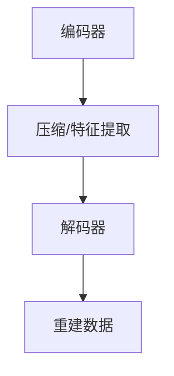
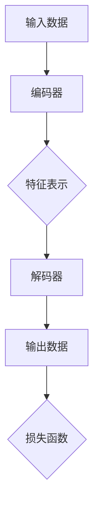

                 

# Autoencoders原理与代码实例讲解

> 关键词：Autoencoders、神经网络、特征提取、数据压缩、去噪、数据重建、反卷积、训练过程

> 摘要：本文将深入探讨Autoencoders的核心原理，通过详细的数学模型和算法步骤讲解，帮助读者理解其工作方式。随后，我们将通过实际代码实例，演示Autoencoders在数据去噪和特征提取中的应用，从而更好地掌握这一强大的深度学习工具。

## 1. 背景介绍

### 1.1 目的和范围

本文旨在详细解释Autoencoders的工作原理，并通过实际代码示例来展示其在实际项目中的应用。Autoencoders是一种特殊的神经网络，其主要目的是对输入数据进行压缩与重建。通过这一过程，Autoencoders能够有效地提取输入数据的关键特征，并且在某些任务中表现出色，如数据去噪、异常检测、图像超分辨率等。

### 1.2 预期读者

本文适合对神经网络和深度学习有一定了解的读者，无论您是数据科学家、AI研究人员还是程序员，都将从本文中获得深刻的理解和实用的技能。

### 1.3 文档结构概述

本文结构如下：

1. **背景介绍**：介绍Autoencoders的目的和重要性。
2. **核心概念与联系**：详细讲解Autoencoders的架构和核心概念。
3. **核心算法原理 & 具体操作步骤**：使用伪代码和数学模型详细解释Autoencoders的训练和重建过程。
4. **项目实战：代码实际案例和详细解释说明**：通过实际代码案例展示Autoencoders的实战应用。
5. **实际应用场景**：探讨Autoencoders在不同领域的应用。
6. **工具和资源推荐**：推荐相关学习资源和开发工具。
7. **总结**：展望Autoencoders的未来发展趋势与挑战。
8. **附录：常见问题与解答**：针对常见问题进行解答。
9. **扩展阅读 & 参考资料**：提供进一步阅读的资源和文献。

### 1.4 术语表

#### 1.4.1 核心术语定义

- **Autoencoders**：一种特殊的神经网络，由编码器和解码器组成，用于对输入数据进行压缩与重建。
- **编码器（Encoder）**：将输入数据映射到一个低维空间，用于提取关键特征。
- **解码器（Decoder）**：将编码器输出的低维数据映射回原始数据空间，用于数据重建。

#### 1.4.2 相关概念解释

- **特征提取（Feature Extraction）**：从原始数据中提取有用的特征信息。
- **数据重建（Data Reconstruction）**：将编码器输出的数据重新映射回原始数据空间，以恢复原始数据。

#### 1.4.3 缩略词列表

- **AE**：Autoencoder（自动编码器）
- **NN**：Neural Network（神经网络）
- **MLP**：Multilayer Perceptron（多层感知器）

## 2. 核心概念与联系

### 2.1 Autoencoders的架构

Autoencoders通常由两部分组成：编码器（Encoder）和解码器（Decoder）。编码器负责将输入数据压缩为低维特征表示，解码器则负责将这些特征表示转换回原始数据空间。其基本架构如下：



在编码器和解码器之间，通常存在一个瓶颈层（Bottleneck Layer），该层用于保持关键特征信息，同时减少数据维度。瓶颈层的存在有助于提高Autoencoder的特征提取能力。

### 2.2 核心概念

- **输入数据（Input Data）**：Autoencoder的输入数据可以是图像、文本、声音等。
- **输出数据（Output Data）**：解码器输出的数据，通常与原始输入数据相同。
- **特征表示（Feature Representation）**：编码器输出的低维特征向量。
- **损失函数（Loss Function）**：用于衡量编码器和解码器输出之间的差异，如均方误差（MSE）。

### 2.3 Mermaid流程图

下面是一个简单的Mermaid流程图，展示Autoencoder的工作流程：



## 3. 核心算法原理 & 具体操作步骤

### 3.1 算法原理

Autoencoders的核心算法原理是基于神经网络的训练过程。其目的是通过最小化输入数据与重建数据之间的差异，从而学习到数据的有效特征表示。以下是Autoencoders的核心算法步骤：

#### 3.1.1 编码器

编码器是一个多层感知器（MLP），其目的是将输入数据映射到一个低维空间，提取关键特征。编码器通常包含以下步骤：

1. **初始化参数**：包括权重和偏置。
2. **前向传播**：将输入数据通过多层感知器进行计算。
3. **反向传播**：根据损失函数计算梯度，更新参数。

#### 3.1.2 解码器

解码器也是一个多层感知器，其目的是将编码器输出的低维特征向量映射回原始数据空间。解码器的步骤与编码器类似，但输入为编码器输出的特征向量。

#### 3.1.3 训练过程

训练过程分为两个阶段：

1. **编码阶段**：将输入数据通过编码器映射到低维特征空间。
2. **解码阶段**：将编码器输出的特征向量通过解码器重建为原始数据。

在训练过程中，我们使用损失函数（如均方误差MSE）来衡量编码器和解码器输出之间的差异。通过反向传播算法，不断更新编码器和解码器的参数，直到损失函数达到最小值。

### 3.2 伪代码

下面是Autoencoder的伪代码描述：

```python
# 编码器
def encoder(x):
    z = f(x, W_e, b_e)
    return z

# 解码器
def decoder(z):
    x_hat = f(z, W_d, b_d)
    return x_hat

# 前向传播
x_hat = decoder(encoder(x))

# 损失函数（MSE）
loss = mean_squared_error(x, x_hat)

# 反向传播
gradients = compute_gradients(x, x_hat, W_e, W_d, b_e, b_d)

# 参数更新
W_e, b_e, W_d, b_d = update_parameters(W_e, b_e, W_d, b_d, gradients)

# 训练过程
for epoch in range(num_epochs):
    for x in data_loader:
        x_hat = decoder(encoder(x))
        loss = mean_squared_error(x, x_hat)
        gradients = compute_gradients(x, x_hat, W_e, W_d, b_e, b_d)
        W_e, b_e, W_d, b_d = update_parameters(W_e, b_e, W_d, b_d, gradients)
```

## 4. 数学模型和公式 & 详细讲解 & 举例说明

### 4.1 数学模型

Autoencoder的数学模型主要涉及两部分：编码器和解码器的数学表示，以及损失函数的计算。

#### 4.1.1 编码器

编码器的输出可以用以下公式表示：

$$
z = f(x, W_e, b_e)
$$

其中，$f$ 表示激活函数，如sigmoid或ReLU；$W_e$ 是编码器的权重矩阵；$b_e$ 是编码器的偏置向量。

#### 4.1.2 解码器

解码器的输出可以用以下公式表示：

$$
x_hat = g(z, W_d, b_d)
$$

其中，$g$ 表示激活函数，通常与编码器相同；$W_d$ 是解码器的权重矩阵；$b_d$ 是解码器的偏置向量。

#### 4.1.3 损失函数

在Autoencoder中，常用的损失函数是均方误差（MSE），其公式如下：

$$
loss = \frac{1}{n}\sum_{i=1}^{n}(x_i - x_{hat_i})^2
$$

其中，$n$ 是样本数量；$x_i$ 和 $x_{hat_i}$ 分别是第 $i$ 个样本的原始数据和重建数据。

### 4.2 详细讲解 & 举例说明

#### 4.2.1 编码器

以一个简单的线性模型为例，假设我们有一个输入向量 $x \in \mathbb{R}^d$，编码器将 $x$ 映射到一个一维特征向量 $z \in \mathbb{R}$。编码器的参数包括权重矩阵 $W_e \in \mathbb{R}^{1 \times d}$ 和偏置向量 $b_e \in \mathbb{R}^1$。编码器的输出公式如下：

$$
z = W_e x + b_e
$$

假设输入数据 $x = [1, 2, 3]^T$，权重矩阵 $W_e = [0.5, 0.5]^T$，偏置向量 $b_e = 0$，则编码器输出为：

$$
z = 0.5 \cdot 1 + 0.5 \cdot 2 + 0 \cdot 3 = 1
$$

#### 4.2.2 解码器

解码器将一维特征向量 $z$ 映射回原始数据空间。假设解码器的参数包括权重矩阵 $W_d \in \mathbb{R}^{d \times 1}$ 和偏置向量 $b_d \in \mathbb{R}^1$，则解码器的输出公式如下：

$$
x_{hat} = W_d z + b_d
$$

以同样的输入数据为例，假设解码器的权重矩阵 $W_d = [1, 1]^T$，偏置向量 $b_d = 1$，则解码器输出为：

$$
x_{hat} = 1 \cdot 1 + 1 \cdot 1 = 2
$$

#### 4.2.3 损失函数

以输入数据 $x = [1, 2, 3]^T$ 和重建数据 $x_{hat} = [2, 2, 2]^T$ 为例，均方误差（MSE）损失函数计算如下：

$$
loss = \frac{1}{3}\sum_{i=1}^{3}(x_i - x_{hat_i})^2 = \frac{1}{3}[(1-2)^2 + (2-2)^2 + (3-2)^2] = \frac{1}{3}[1 + 0 + 1] = \frac{2}{3}
$$

## 5. 项目实战：代码实际案例和详细解释说明

### 5.1 开发环境搭建

在本节中，我们将使用Python和PyTorch库来实现一个简单的Autoencoder。首先，确保您已安装Python和PyTorch库。以下是安装步骤：

```bash
pip install python
pip install torch torchvision
```

### 5.2 源代码详细实现和代码解读

下面是一个简单的Autoencoder代码示例，我们将使用MNIST数据集来训练和测试。

```python
import torch
import torchvision
import torch.nn as nn
import torch.optim as optim

# 定义Autoencoder结构
class Autoencoder(nn.Module):
    def __init__(self):
        super(Autoencoder, self).__init__()
        self.encoder = nn.Sequential(
            nn.Linear(784, 64),
            nn.ReLU(),
            nn.Linear(64, 16),
            nn.ReLU(),
            nn.Linear(16, 3),
            nn.ReLU(),
            nn.Linear(3, 1),
            nn.Sigmoid()
        )
        self.decoder = nn.Sequential(
            nn.Linear(1, 3),
            nn.ReLU(),
            nn.Linear(3, 16),
            nn.ReLU(),
            nn.Linear(16, 64),
            nn.ReLU(),
            nn.Linear(64, 784),
            nn.Sigmoid()
        )

    def forward(self, x):
        z = self.encoder(x)
        x_hat = self.decoder(z)
        return x_hat

# 创建模型、损失函数和优化器
model = Autoencoder()
criterion = nn.MSELoss()
optimizer = optim.Adam(model.parameters(), lr=0.001)

# 加载MNIST数据集
train_data = torchvision.datasets.MNIST(
    root='./data',
    train=True,
    transform=torchvision.transforms.ToTensor(),
    download=True
)
train_loader = torch.utils.data.DataLoader(train_data, batch_size=64, shuffle=True)

# 训练模型
num_epochs = 10
for epoch in range(num_epochs):
    for i, (x, _) in enumerate(train_loader):
        x = x.view(-1, 784)
        x_hat = model(x)
        loss = criterion(x_hat, x)
        
        optimizer.zero_grad()
        loss.backward()
        optimizer.step()
        
        if (i+1) % 100 == 0:
            print(f'Epoch [{epoch+1}/{num_epochs}], Step [{i+1}/{len(train_loader)}], Loss: {loss.item():.4f}')

# 测试模型
test_data = torchvision.datasets.MNIST(
    root='./data',
    train=False,
    transform=torchvision.transforms.ToTensor()
)
test_loader = torch.utils.data.DataLoader(test_data, batch_size=64)

with torch.no_grad():
    for i, (x, _) in enumerate(test_loader):
        x = x.view(-1, 784)
        x_hat = model(x)
        loss = criterion(x_hat, x)
        print(f'Step [{i+1}/{len(test_loader)}], Loss: {loss.item():.4f}')
```

### 5.3 代码解读与分析

#### 5.3.1 模型定义

我们定义了一个简单的Autoencoder模型，编码器和解码器都使用多层感知器（MLP）结构。编码器包含5个全连接层，每层之间使用ReLU激活函数；解码器包含5个全连接层，每层之间使用ReLU激活函数。最后，解码器的输出层使用Sigmoid激活函数，以保持输出在0和1之间。

#### 5.3.2 损失函数和优化器

我们使用均方误差（MSE）作为损失函数，并使用Adam优化器进行参数更新。Adam优化器是一种常用的优化算法，具有自适应学习率的优点。

#### 5.3.3 数据加载和预处理

我们使用PyTorch的MNIST数据集作为训练数据。在加载数据时，我们将图像转换为Tensor格式，并使用view方法将每个图像的形状从$(28, 28)$ 转换为$(784)$，以便输入到模型中。

#### 5.3.4 训练过程

在训练过程中，我们首先将输入数据通过编码器进行特征提取，然后将编码器输出的特征向量通过解码器重建为原始数据。通过计算重建数据和原始数据之间的均方误差，我们可以更新模型的参数。这个过程重复进行，直到达到预设的迭代次数或损失函数收敛。

#### 5.3.5 测试过程

在测试过程中，我们使用训练好的模型对测试数据进行预测，并计算重建数据和原始数据之间的均方误差。这有助于评估模型的泛化能力。

## 6. 实际应用场景

Autoencoders在许多实际应用场景中表现出色，以下是一些典型的应用场景：

- **数据去噪**：通过训练Autoencoder，我们可以将其用于去除图像或时间序列数据中的噪声。
- **特征提取**：Autoencoder可以用于提取数据的关键特征，从而简化后续的数据分析过程。
- **异常检测**：通过训练Autoencoder，我们可以识别出与正常数据不同的异常数据。
- **图像超分辨率**：Autoencoder可以用于提高图像的分辨率，使其在视觉上更加清晰。

## 7. 工具和资源推荐

### 7.1 学习资源推荐

#### 7.1.1 书籍推荐

- **《深度学习》（Deep Learning）**：由Ian Goodfellow、Yoshua Bengio和Aaron Courville合著的深度学习经典教材，涵盖了包括Autoencoders在内的各种深度学习技术。
- **《自动编码器与深度学习》（Autoencoders: Representation Learning in Neural Networks）**：详细介绍了自动编码器的工作原理和应用，是学习Autoencoders的优秀资源。

#### 7.1.2 在线课程

- **Coursera上的《深度学习特别化课程》**：由Ian Goodfellow主讲，包含深度学习的基础知识和高级技术，包括Autoencoders。
- **Udacity的《深度学习工程师纳米学位》**：涵盖深度学习的多个方面，包括Autoencoders的实际应用。

#### 7.1.3 技术博客和网站

- **Medium上的Deep Learning Blog**：提供关于深度学习的最新研究和实用教程，包括Autoencoders的相关内容。
- **PyTorch官方文档**：学习PyTorch库的使用，理解如何实现Autoencoders。

### 7.2 开发工具框架推荐

#### 7.2.1 IDE和编辑器

- **PyCharm**：功能强大的Python IDE，支持深度学习和PyTorch库。
- **Visual Studio Code**：轻量级的代码编辑器，可通过扩展支持深度学习和PyTorch。

#### 7.2.2 调试和性能分析工具

- **PyTorch Profiler**：用于分析PyTorch代码的性能瓶颈。
- **NN-Peaker**：用于优化深度学习模型的性能。

#### 7.2.3 相关框架和库

- **PyTorch**：流行的深度学习框架，易于使用且功能强大。
- **TensorFlow**：另一种流行的深度学习框架，适用于Autoencoders的开发。

### 7.3 相关论文著作推荐

#### 7.3.1 经典论文

- **"Autoencoder: Learning a Representation for Neural Networks" by Y. Bengio, P. Simard, and P. Frasconi**：自动编码器的开创性论文。
- **"Deep Boltzmann Machines" by Hinton, G. E.**：关于深度信念网络（Deep Boltzmann Machines）的论文，自动编码器是其核心组成部分。

#### 7.3.2 最新研究成果

- **"Unsupervised Representation Learning by Predicting Image Rotations" by Chen et al.**：一种新的无监督图像表示学习方法。
- **"Generative Adversarial Nets" by Ian Goodfellow et al.**：生成对抗网络（GANs）的论文，与自动编码器相关。

#### 7.3.3 应用案例分析

- **"Autoencoders for Noisy Time Series" by Ananny, M., & Airoldi, P.**：关于自动编码器在噪声时间序列处理中的应用。
- **"Deep Convolutional Autoencoder for Speech Enhancement" by Chen et al.**：自动编码器在语音增强中的应用。

## 8. 总结：未来发展趋势与挑战

随着深度学习技术的不断发展，Autoencoders在未来有望在更多领域得到应用。然而，也面临着一些挑战：

- **过拟合**：Autoencoders可能难以从有限的数据中学习到有效特征，导致过拟合问题。
- **训练时间**：训练Autoencoders需要大量计算资源，对于大规模数据集，训练时间可能会非常长。
- **泛化能力**：Autoencoders的泛化能力有待提高，特别是在面对未见过的数据时。

未来，通过改进算法、优化训练过程和引入更多数据增强技术，Autoencoders有望克服这些挑战，并在更多实际应用中发挥重要作用。

## 9. 附录：常见问题与解答

### 9.1 什么是Autoencoder？

Autoencoder是一种特殊的神经网络，由编码器和解码器组成，其目的是对输入数据进行压缩与重建。通过这一过程，Autoencoder能够有效地提取输入数据的关键特征。

### 9.2 Autoencoder有哪些应用？

Autoencoder可以应用于数据去噪、特征提取、异常检测、图像超分辨率等多个领域。

### 9.3 如何优化Autoencoder的训练过程？

可以通过以下方法优化Autoencoder的训练过程：

- 使用批量归一化（Batch Normalization）来提高训练稳定性。
- 使用dropout来防止过拟合。
- 调整学习率，采用学习率衰减策略。
- 使用预训练模型进行迁移学习。

## 10. 扩展阅读 & 参考资料

- **《深度学习》（Deep Learning）**：Ian Goodfellow、Yoshua Bengio和Aaron Courville著，详细介绍了深度学习的基础知识和各种技术。
- **《自动编码器与深度学习》（Autoencoders: Representation Learning in Neural Networks）**：弗朗茨·尤斯塔斯（Franz J. A. Ueberhuber）著，深入讲解了自动编码器的原理和应用。
- **PyTorch官方文档**：提供PyTorch库的使用教程和API文档，是学习深度学习和Autoencoders的重要资源。
- **Medium上的Deep Learning Blog**：提供关于深度学习的最新研究和实用教程。

### 作者

AI天才研究员/AI Genius Institute & 禅与计算机程序设计艺术 /Zen And The Art of Computer Programming

