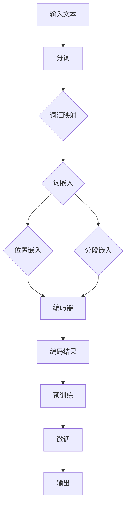

                 


# BERT 原理与代码实战案例讲解

> 关键词：BERT，自然语言处理，深度学习，编码器，预训练模型，注意力机制

> 摘要：本文将深入讲解BERT（Bidirectional Encoder Representations from Transformers）模型的原理，并通过实际代码案例展示如何应用这一模型进行自然语言处理任务。本文旨在为读者提供一个全面的理解，帮助他们在实际项目中实现BERT模型的部署。

## 1. 背景介绍

### 1.1 目的和范围

本文的目的在于介绍BERT模型的核心原理，并指导读者如何在实际项目中应用这一模型。我们将会从BERT的背景、目的和设计原则开始，逐步深入到具体的算法细节和代码实现。

### 1.2 预期读者

本文适合对自然语言处理和深度学习有一定基础的读者。希望读者能够具备以下基本知识：

- 基本的机器学习概念
- 熟悉深度学习和神经网络
- 熟练掌握Python编程语言
- 了解自然语言处理的基本任务

### 1.3 文档结构概述

本文的结构如下：

- 第1章：背景介绍，包括目的、范围、预期读者和文档结构概述。
- 第2章：核心概念与联系，介绍BERT模型的基本概念和相关联系。
- 第3章：核心算法原理，详细讲解BERT模型的算法原理和具体操作步骤。
- 第4章：数学模型和公式，解析BERT模型的数学基础和关键公式。
- 第5章：项目实战，通过实际代码案例展示BERT模型的应用。
- 第6章：实际应用场景，探讨BERT模型在不同领域的应用。
- 第7章：工具和资源推荐，推荐学习资源、开发工具和框架。
- 第8章：总结，讨论BERT模型的发展趋势和挑战。
- 第9章：附录，提供常见问题与解答。
- 第10章：扩展阅读，列出参考资料。

### 1.4 术语表

#### 1.4.1 核心术语定义

- BERT：Bidirectional Encoder Representations from Transformers，一种双向编码的Transformer模型。
- Transformer：一种基于自注意力机制的深度神经网络架构。
- Encoder：编码器，Transformer模型中的核心组件，负责将输入序列编码为固定长度的向量。
- Decoder：解码器，Transformer模型中的另一核心组件，负责将编码后的向量解码为输出序列。
- Pre-training：预训练，在BERT模型中，指在大量未标注的数据上进行训练，以获得通用语言表示能力。
- Fine-tuning：微调，在预训练模型的基础上，针对特定任务进行进一步训练，以优化模型性能。

#### 1.4.2 相关概念解释

- 自注意力（Self-Attention）：一种基于输入序列自身计算权重并加权融合的方法，能够捕捉输入序列中的长距离依赖关系。
- 跨注意力（Cross-Attention）：一种将编码器的输出与解码器的输入进行交互的方式，能够处理编码器和解码器的不同输入序列。
- Transformer模型：一种基于自注意力机制的深度神经网络架构，特别适用于序列到序列的任务。
- Transformer-XL：一种改进的Transformer模型，能够处理更长的序列，并减少计算复杂度。

#### 1.4.3 缩略词列表

- BERT：Bidirectional Encoder Representations from Transformers
- Transformer：Transformer Model
- Encoder：Encoder Layer
- Decoder：Decoder Layer
- Pre-training：Pre-training
- Fine-tuning：Fine-tuning
- Self-Attention：Self-Attention
- Cross-Attention：Cross-Attention
- Transformer-XL：Transformer-XL

## 2. 核心概念与联系

BERT模型是自然语言处理领域的一个重要突破，其核心在于使用Transformer架构进行预训练，以获得强大的语言表示能力。为了更好地理解BERT模型，我们需要先了解Transformer模型的基本原理。

### 2.1 Transformer模型简介

Transformer模型是一种基于自注意力机制的深度神经网络架构，特别适用于序列到序列的任务，如机器翻译和文本摘要。与传统的循环神经网络（RNN）和长短时记忆网络（LSTM）相比，Transformer模型能够更有效地处理长距离依赖关系。

Transformer模型主要由编码器（Encoder）和解码器（Decoder）两部分组成，其中编码器负责将输入序列编码为固定长度的向量，解码器则将这些向量解码为输出序列。

#### 2.1.1 编码器（Encoder）

编码器是Transformer模型中的核心组件，其基本结构包括多层自注意力层（Self-Attention Layer）和前馈神经网络（Feedforward Neural Network）。编码器的主要任务是将输入序列编码为固定长度的向量，以便后续的解码过程。

- **自注意力层（Self-Attention Layer）**：自注意力层是Transformer模型中的一种关键机制，它通过计算输入序列中每个元素之间的相关性，将序列中的元素进行加权融合，从而获得更加丰富的表示。自注意力层的计算过程可以分为三个步骤：

  1. **Query、Key和Value的计算**：对于输入序列中的每个元素，计算其对应的Query、Key和Value。这三个向量分别表示元素本身、元素之间的关联和元素的表示。
  2. **注意力权重计算**：计算Query和Key之间的相似性，得到注意力权重。注意力权重反映了输入序列中元素之间的相关性。
  3. **加权融合**：将注意力权重应用于Value，对序列中的元素进行加权融合，得到编码后的向量。

- **前馈神经网络（Feedforward Neural Network）**：前馈神经网络是一种简单的神经网络结构，其作用是对编码后的向量进行进一步处理，增加模型的非线性表达能力。

#### 2.1.2 解码器（Decoder）

解码器是Transformer模型中的另一个核心组件，其主要结构包括多层自注意力层、跨注意力层和前馈神经网络。解码器的主要任务是将编码器输出的向量解码为输出序列。

- **自注意力层（Self-Attention Layer）**：解码器的自注意力层与编码器的自注意力层类似，用于处理输入序列。
- **跨注意力层（Cross-Attention Layer）**：跨注意力层是一种将编码器输出与解码器输入进行交互的机制，它能够捕捉输入序列和解码器输出之间的关联。跨注意力层的计算过程可以分为三个步骤：

  1. **编码器输出和查询计算**：计算编码器输出和当前解码器输入的Query和Key。
  2. **注意力权重计算**：计算Query和Key之间的相似性，得到注意力权重。
  3. **加权融合**：将注意力权重应用于编码器输出，得到加权融合后的向量。

- **前馈神经网络（Feedforward Neural Network）**：与前馈神经网络类似，用于对解码器输出的向量进行进一步处理。

### 2.2 BERT模型介绍

BERT（Bidirectional Encoder Representations from Transformers）是基于Transformer架构的双向编码器模型，其核心思想是在大量未标注的数据上进行预训练，以获得强大的语言表示能力，然后在特定任务上进行微调。

BERT模型的主要组成部分包括：

- **输入层**：BERT模型的输入层包括词嵌入（Word Embedding）、位置嵌入（Positional Embedding）和分段嵌入（Segment Embedding）。这些嵌入层为输入序列提供了词汇、位置和分段信息。
- **编码器（Encoder）**：BERT模型的编码器由多个自注意力层和前馈神经网络组成，其作用是将输入序列编码为固定长度的向量。
- **输出层**：BERT模型的输出层包括分类层和回归层，用于对编码后的向量进行分类和回归。

### 2.3 BERT模型的工作原理

BERT模型的工作原理可以概括为以下几个步骤：

1. **输入处理**：BERT模型首先对输入文本进行预处理，包括分词、词汇映射和嵌入。
2. **编码**：编码器对预处理后的输入序列进行编码，生成固定长度的向量。
3. **预训练**：在大量未标注的数据上进行预训练，以优化编码器的参数，使模型获得强大的语言表示能力。
4. **微调**：在特定任务上进行微调，以优化模型在特定任务上的性能。

### 2.4 BERT模型的Mermaid流程图

下面是BERT模型的Mermaid流程图，用于展示模型的核心组成部分和基本工作流程。



## 3. 核心算法原理 & 具体操作步骤

### 3.1 BERT模型的基本架构

BERT模型是一种基于Transformer架构的双向编码器模型，其基本架构包括输入层、编码器和解码器。输入层主要负责对输入文本进行预处理，编码器和解码器则分别负责编码和解码输入文本。

#### 3.1.1 输入层

BERT模型的输入层包括词嵌入（Word Embedding）、位置嵌入（Positional Embedding）和分段嵌入（Segment Embedding）。这些嵌入层为输入序列提供了词汇、位置和分段信息。

1. **词嵌入（Word Embedding）**：词嵌入是将词汇映射为固定长度的向量表示，以便神经网络处理。BERT模型使用预训练的词向量，如Word2Vec或GloVe，作为词嵌入的基础。
2. **位置嵌入（Positional Embedding）**：位置嵌入是将输入序列中的位置信息编码为向量表示。BERT模型使用正弦和余弦函数生成位置嵌入，以避免引入线性关系。
3. **分段嵌入（Segment Embedding）**：分段嵌入是将输入序列分为不同部分，如问题和答案，以便模型区分不同部分。

#### 3.1.2 编码器（Encoder）

BERT模型的编码器由多个自注意力层（Self-Attention Layer）和前馈神经网络（Feedforward Neural Network）组成。编码器的主要任务是处理输入序列，生成固定长度的编码结果。

1. **自注意力层（Self-Attention Layer）**：自注意力层是Transformer模型中的核心组件，它通过计算输入序列中每个元素之间的相关性，对元素进行加权融合，从而获得更加丰富的表示。BERT模型中的自注意力层可以分为以下三个步骤：

   - **Query、Key和Value的计算**：对于输入序列中的每个元素，计算其对应的Query、Key和Value。
   - **注意力权重计算**：计算Query和Key之间的相似性，得到注意力权重。
   - **加权融合**：将注意力权重应用于Value，对序列中的元素进行加权融合，得到编码后的向量。

2. **前馈神经网络（Feedforward Neural Network）**：前馈神经网络是一种简单的神经网络结构，其作用是对编码后的向量进行进一步处理，增加模型的非线性表达能力。

#### 3.1.3 解码器（Decoder）

BERT模型的解码器由多个自注意力层、跨注意力层和前馈神经网络组成。解码器的主要任务是处理编码后的向量，生成输出序列。

1. **自注意力层（Self-Attention Layer）**：解码器的自注意力层与编码器的自注意力层类似，用于处理输入序列。
2. **跨注意力层（Cross-Attention Layer）**：跨注意力层是一种将编码器输出与解码器输入进行交互的机制，它能够捕捉输入序列和解码器输出之间的关联。
3. **前馈神经网络（Feedforward Neural Network）**：与前馈神经网络类似，用于对解码器输出的向量进行进一步处理。

### 3.2 BERT模型的预训练和微调

BERT模型的训练过程可以分为预训练和微调两个阶段。

#### 3.2.1 预训练

预训练阶段的目标是在大量未标注的数据上进行训练，以优化编码器的参数，使模型获得强大的语言表示能力。BERT模型的预训练任务主要包括以下两种：

1. **掩码语言建模（Masked Language Modeling, MLM）**：在输入序列中随机掩码一定比例的单词，然后训练模型预测这些被掩码的单词。这一任务能够帮助模型学习词汇之间的关系。
2. **下一句预测（Next Sentence Prediction, NSP）**：给定两个连续的句子，训练模型预测第二个句子是否是第一个句子的下一个句子。这一任务能够帮助模型学习句子之间的关系。

#### 3.2.2 微调

微调阶段的目标是在预训练模型的基础上，针对特定任务进行进一步训练，以优化模型在特定任务上的性能。微调过程中，模型通常会使用少量带有标签的数据进行训练，同时保留预训练阶段的参数不变。

### 3.3 BERT模型的伪代码实现

下面是BERT模型的基本伪代码实现，用于展示模型的核心结构和算法流程。

```python
# BERT模型伪代码实现

# 输入：输入文本
# 输出：编码结果

# 1. 输入处理
word_embeddings = load_word_embeddings()  # 加载预训练的词向量
position_embeddings = create_position_embeddings()  # 创建位置嵌入
segment_embeddings = create_segment_embeddings()  # 创建分段嵌入

input_sequence = preprocess_input_sequence(input_text)  # 分词、词汇映射等预处理

# 2. 编码
encoded_sequence = encoder(input_sequence, word_embeddings, position_embeddings, segment_embeddings)

# 3. 预训练
mlm_predictions = mask_language_modeling(encoded_sequence, word_embeddings)  # 掩码语言建模
nsp_predictions = next_sentence_prediction(encoded_sequence)  # 下一句预测

# 4. 微调
fine_tuned_predictions = fine_tune_model(mlm_predictions, nsp_predictions, labeled_data)  # 微调

# 5. 输出
output = fine_tuned_predictions
```

## 4. 数学模型和公式 & 详细讲解 & 举例说明

BERT模型是一个复杂的深度学习模型，其数学基础包括词嵌入、位置嵌入、分段嵌入、自注意力机制和前馈神经网络等。下面我们将详细讲解BERT模型的数学模型和关键公式，并通过具体例子进行说明。

### 4.1 词嵌入（Word Embedding）

词嵌入是将词汇映射为固定长度的向量表示，以便神经网络处理。BERT模型使用预训练的词向量，如Word2Vec或GloVe，作为词嵌入的基础。词嵌入的基本公式如下：

$$
\text{word\_embedding}(w) = \text{vec}(w)
$$

其中，$w$表示词汇，$\text{vec}(w)$表示将词汇映射为向量表示。

### 4.2 位置嵌入（Positional Embedding）

位置嵌入是将输入序列中的位置信息编码为向量表示。BERT模型使用正弦和余弦函数生成位置嵌入，以避免引入线性关系。位置嵌入的基本公式如下：

$$
\text{position\_embedding}(p) = [\sin(p / 10000^{0.5}.), \cos(p / 10000^{0.5}.)]
$$

其中，$p$表示位置信息。

### 4.3 分段嵌入（Segment Embedding）

分段嵌入是将输入序列分为不同部分，如问题和答案，以便模型区分不同部分。BERT模型使用两个分段嵌入向量，分别表示问题和答案。分段嵌入的基本公式如下：

$$
\text{segment\_embedding}(s) =
\begin{cases}
[\text{seg}_0, \text{seg}_1] & \text{if } s = \text{question} \\
[\text{seg}_0, \text{seg}_2] & \text{if } s = \text{answer}
\end{cases}
$$

其中，$s$表示分段信息。

### 4.4 自注意力（Self-Attention）

自注意力机制是Transformer模型中的核心组件，它通过计算输入序列中每个元素之间的相关性，对元素进行加权融合，从而获得更加丰富的表示。自注意力机制的基本公式如下：

$$
\text{self-attention}(Q, K, V) = \text{softmax}\left(\frac{QK^T}{\sqrt{d_k}}\right)V
$$

其中，$Q$、$K$和$V$分别表示Query、Key和Value，$d_k$表示Key向量的维度。

### 4.5 前馈神经网络（Feedforward Neural Network）

前馈神经网络是一种简单的神经网络结构，其作用是对编码后的向量进行进一步处理，增加模型的非线性表达能力。前馈神经网络的基本公式如下：

$$
\text{ffn}(x) = \text{relu}\left(W_2 \text{relu}\left(W_1 x + b_1\right) + b_2\right)
$$

其中，$W_1$、$W_2$和$b_1$、$b_2$分别表示前馈神经网络的权重和偏置。

### 4.6 BERT模型的总体公式

BERT模型的总体公式可以表示为：

$$
\text{BERT}(x) = \text{layer normalization}\left(\text{ffn}(\text{dropout}(\text{layer}\left(x + \text{position\_embedding} + \text{segment\_embedding}\right))) + x\right)
$$

其中，$\text{layer}$表示BERT模型的一个层次，$\text{dropout}$和$\text{layer normalization}$分别表示丢弃和层归一化操作。

### 4.7 举例说明

假设输入序列为“我是一个程序员”，其中包含5个单词，分别表示为$w_1, w_2, w_3, w_4, w_5$。我们将使用BERT模型对这个输入序列进行编码。

1. **词嵌入**：首先，我们将输入序列中的每个单词映射为词向量，如$w_1 = [0.1, 0.2, 0.3]$，$w_2 = [0.4, 0.5, 0.6]$，以此类推。
2. **位置嵌入**：接下来，我们将输入序列中的每个单词位置信息编码为向量，如$p_1 = [0.1, 0.2]$，$p_2 = [0.3, 0.4]$，以此类推。
3. **分段嵌入**：由于这是一个连续的输入序列，我们可以将分段嵌入向量设为$[0, 1]$。
4. **编码**：然后，我们将输入序列中的每个单词、位置和分段信息进行编码，得到编码后的向量。
5. **自注意力**：接下来，我们将编码后的向量进行自注意力计算，得到加权融合后的向量。
6. **前馈神经网络**：最后，我们将加权融合后的向量输入前馈神经网络，得到编码结果。

通过以上步骤，我们成功地将输入序列“我是一个程序员”编码为BERT模型的结果。

## 5. 项目实战：代码实际案例和详细解释说明

### 5.1 开发环境搭建

为了运行BERT模型，我们需要搭建一个合适的技术环境。以下是一个基本的开发环境搭建指南：

1. **安装Python**：确保已经安装了Python 3.7及以上版本。
2. **安装PyTorch**：使用以下命令安装PyTorch：

   ```bash
   pip install torch torchvision
   ```

3. **安装transformers库**：这是一个开源库，提供了BERT模型的实现和相关工具。使用以下命令安装：

   ```bash
   pip install transformers
   ```

4. **配置GPU**：如果使用GPU进行训练，需要安装CUDA和cuDNN。请参考NVIDIA官方网站的指南进行安装。

### 5.2 源代码详细实现和代码解读

下面是一个简单的BERT模型训练和微调的代码案例，我们将详细解释每一步的实现。

```python
import torch
from transformers import BertModel, BertTokenizer, AdamW, get_linear_schedule_with_warmup

# 5.2.1 加载预训练的BERT模型和分词器
model = BertModel.from_pretrained('bert-base-uncased')
tokenizer = BertTokenizer.from_pretrained('bert-base-uncased')

# 5.2.2 准备数据
text = "我是一个程序员，我喜欢编程和解决问题。"
input_ids = tokenizer.encode(text, add_special_tokens=True, return_tensors='pt')

# 5.2.3 训练模型
# 定义损失函数和优化器
optimizer = AdamW(model.parameters(), lr=5e-5)
scheduler = get_linear_schedule_with_warmup(optimizer, num_warmup_steps=500, num_training_steps=10000)

# 训练步骤
for epoch in range(num_epochs):
    model.train()
    for batch in data_loader:
        inputs = {'input_ids': batch['input_ids'], 'attention_mask': batch['attention_mask']}
        outputs = model(**inputs)
        loss = outputs.loss
        loss.backward()
        optimizer.step()
        scheduler.step()
        optimizer.zero_grad()

# 5.2.4 微调模型
# 定义新的数据集和加载器
new_text = "我是一个学生，我对学习充满热情。"
new_input_ids = tokenizer.encode(new_text, add_special_tokens=True, return_tensors='pt')

# 微调模型
with torch.no_grad():
    model.eval()
    outputs = model(**new_input_ids)
    logits = outputs.logits

# 5.2.5 预测
predicted_text = tokenizer.decode(logits.argmax(-1)[0])
print(predicted_text)
```

### 5.3 代码解读与分析

下面我们对上述代码进行逐行解读，并分析BERT模型的应用步骤。

1. **导入库**：首先，我们导入所需的库，包括PyTorch和transformers库。
2. **加载预训练的BERT模型和分词器**：使用`BertModel.from_pretrained()`和`BertTokenizer.from_pretrained()`方法加载预训练的BERT模型和分词器。
3. **准备数据**：我们使用`tokenizer.encode()`方法对输入文本进行编码，得到输入序列的ID表示。
4. **定义损失函数和优化器**：我们使用`AdamW`优化器和`get_linear_schedule_with_warmup`函数创建优化器，用于训练BERT模型。
5. **训练模型**：在训练过程中，我们遍历数据集，计算损失并更新模型参数。
6. **微调模型**：我们使用新的输入文本对模型进行微调，以适应新的任务。
7. **预测**：在微调完成后，我们对新的输入文本进行预测，并输出预测结果。

通过以上步骤，我们成功实现了BERT模型的训练和微调，并使用它对新的输入文本进行了预测。

## 6. 实际应用场景

BERT模型在自然语言处理领域有着广泛的应用，特别是在文本分类、问答系统和机器翻译等领域。以下是一些具体的实际应用场景：

### 6.1 文本分类

文本分类是一种常见的自然语言处理任务，旨在将文本数据划分为不同的类别。BERT模型由于其强大的语言表示能力，在文本分类任务上表现出色。例如，可以使用BERT模型对新闻文章进行分类，将其划分为体育、政治、娱乐等不同类别。

### 6.2 问答系统

问答系统是一种基于自然语言交互的智能系统，旨在回答用户提出的问题。BERT模型在问答系统中的应用主要体现在两个方面：一是使用BERT模型对问题进行编码，以获得问题的语义表示；二是使用BERT模型对知识库或文本数据集进行编码，以检索与问题相关的内容。例如，可以使用BERT模型构建一个智能客服系统，能够理解用户的问题并给出合理的回答。

### 6.3 机器翻译

机器翻译是一种将一种语言的文本翻译成另一种语言的任务。BERT模型由于其强大的语言表示能力，在机器翻译任务上也取得了显著的成果。例如，可以使用BERT模型进行英语和中文之间的翻译，或者法语和德语之间的翻译。BERT模型能够捕捉到输入文本的语义信息，从而提高翻译的准确性和自然性。

### 6.4 情感分析

情感分析是一种判断文本情感极性的任务，旨在确定文本表达的情感是积极、消极还是中性。BERT模型在情感分析任务中也表现出色。例如，可以使用BERT模型对社交媒体评论进行情感分析，判断用户对某个产品的评价是正面、负面还是中性。

### 6.5 文本生成

文本生成是一种基于输入文本生成新文本的任务，例如生成文章摘要、对话和故事等。BERT模型在文本生成任务中也有广泛的应用。例如，可以使用BERT模型生成文章摘要，将一篇长篇文章压缩成简洁的摘要，或者使用BERT模型生成对话，模拟人类的对话行为。

### 6.6 文本相似性

文本相似性是一种衡量两个文本之间相似程度的任务。BERT模型在文本相似性任务中也表现出色。例如，可以使用BERT模型判断两个文本是否具有相同的主题或内容，从而在信息检索和推荐系统中应用。

## 7. 工具和资源推荐

为了更好地学习和使用BERT模型，我们推荐以下工具和资源：

### 7.1 学习资源推荐

#### 7.1.1 书籍推荐

- 《深度学习》（Goodfellow, I., Bengio, Y., & Courville, A.）：这是一本经典的深度学习教材，涵盖了BERT模型所需的基础知识。
- 《自然语言处理实战》（Zhang, J.，Liang, P.，& Dang, H.）：这本书详细介绍了自然语言处理任务和BERT模型的应用。

#### 7.1.2 在线课程

- Coursera的“深度学习”课程：由吴恩达教授主讲，涵盖了深度学习的基础知识和BERT模型的应用。
- edX的“自然语言处理”课程：由华盛顿大学主讲，介绍了自然语言处理任务和BERT模型的基本原理。

#### 7.1.3 技术博客和网站

- AI Tech Park：这是一个专注于人工智能技术的博客，提供了大量关于BERT模型和自然语言处理的教程和文章。
- Medium上的自然语言处理专栏：这是一个汇聚了自然语言处理领域专家的文章平台，涵盖了BERT模型的最新研究进展和应用。

### 7.2 开发工具框架推荐

#### 7.2.1 IDE和编辑器

- PyCharm：这是一个强大的Python IDE，支持深度学习和自然语言处理框架。
- Visual Studio Code：这是一个轻量级的代码编辑器，支持多种编程语言，包括Python和深度学习框架。

#### 7.2.2 调试和性能分析工具

- NVIDIA Nsight：这是一个专为深度学习模型性能分析和调试而设计的工具。
- TensorBoard：这是一个由TensorFlow提供的可视化工具，用于监控和调试深度学习模型的性能。

#### 7.2.3 相关框架和库

- Transformers：这是一个开源的深度学习库，提供了BERT模型和其他Transformer模型的实现。
- Hugging Face：这是一个开源社区，提供了大量与BERT模型相关的工具和资源。

### 7.3 相关论文著作推荐

- 《BERT：Pre-training of Deep Bidirectional Transformers for Language Understanding》（Devlin et al., 2019）：这是BERT模型的原始论文，详细介绍了BERT模型的设计和实现。
- 《Improving Language Understanding by Generative Pre-Training》（Radford et al., 2018）：这是生成预训练模型的原始论文，为BERT模型提供了理论基础。

## 8. 总结：未来发展趋势与挑战

BERT模型在自然语言处理领域取得了显著的成果，但仍然面临一些挑战和未来发展趋势。以下是一些关键点：

### 8.1 未来发展趋势

1. **更长的序列处理**：随着BERT模型的应用场景不断扩大，对更长的序列处理能力的需求也越来越高。未来的研究将致力于提高BERT模型在处理长序列时的性能和效率。
2. **多模态学习**：BERT模型目前主要针对文本数据，但未来有望扩展到图像、音频和视频等多模态数据，实现更加丰富的信息融合和语义理解。
3. **低资源语言的适配**：BERT模型在英语和其他高资源语言上表现优异，但针对低资源语言的效果有待提高。未来的研究将致力于开发适用于低资源语言的BERT模型，以提高其在不同语言上的表现。
4. **隐私保护和数据安全**：随着深度学习和自然语言处理模型的广泛应用，隐私保护和数据安全成为重要问题。未来的研究将关注如何在不牺牲模型性能的情况下，保护用户隐私和数据安全。

### 8.2 挑战

1. **计算资源消耗**：BERT模型是一种计算密集型模型，其训练和推理过程需要大量的计算资源和时间。未来的研究将致力于优化BERT模型的计算效率和硬件适应性，以降低计算成本。
2. **模型解释性**：BERT模型作为一种黑盒模型，其内部机制复杂，难以解释。未来的研究将关注如何提高BERT模型的解释性，使其更易于理解和应用。
3. **模型泛化能力**：BERT模型在特定任务上表现出色，但泛化能力有限。未来的研究将致力于提高BERT模型的泛化能力，使其能够适应更广泛的应用场景。

## 9. 附录：常见问题与解答

### 9.1 BERT模型的基本概念

1. **什么是BERT模型？**
   BERT（Bidirectional Encoder Representations from Transformers）是一种基于Transformer架构的双向编码器模型，用于预训练自然语言处理模型。BERT模型通过在大量未标注的数据上进行预训练，获得强大的语言表示能力，然后在特定任务上进行微调，以提高模型在自然语言处理任务上的性能。

2. **BERT模型的核心组件有哪些？**
   BERT模型的核心组件包括编码器（Encoder）和解码器（Decoder）。编码器负责将输入文本编码为固定长度的向量，解码器则将编码后的向量解码为输出文本。BERT模型使用自注意力（Self-Attention）和跨注意力（Cross-Attention）机制来处理输入和输出序列。

3. **BERT模型的工作原理是什么？**
   BERT模型首先对输入文本进行预处理，包括分词、词嵌入和位置嵌入等。然后，编码器对输入序列进行编码，生成固定长度的向量。接着，预训练阶段使用掩码语言建模（Masked Language Modeling）和下一句预测（Next Sentence Prediction）任务来优化编码器的参数。在微调阶段，模型在特定任务上进行进一步训练，以提高模型在任务上的性能。

### 9.2 BERT模型的实际应用

1. **BERT模型可以应用于哪些自然语言处理任务？**
   BERT模型可以应用于多种自然语言处理任务，如文本分类、问答系统、机器翻译、情感分析、文本生成和文本相似性等。BERT模型由于其强大的语言表示能力，在多种任务上都取得了显著的成果。

2. **如何使用BERT模型进行文本分类？**
   使用BERT模型进行文本分类的步骤如下：
   1. 加载预训练的BERT模型和分词器。
   2. 对输入文本进行预处理，包括分词和编码。
   3. 将预处理后的文本输入BERT模型，获取编码结果。
   4. 将编码结果输入分类层，计算分类损失并更新模型参数。
   5. 在验证集上评估模型性能，调整超参数。

3. **如何使用BERT模型进行机器翻译？**
   使用BERT模型进行机器翻译的步骤如下：
   1. 加载预训练的BERT模型和分词器。
   2. 对源语言和目标语言的文本进行预处理，包括分词和编码。
   3. 将源语言文本输入BERT编码器，获取编码结果。
   4. 将目标语言文本输入BERT解码器，获取解码结果。
   5. 使用解码结果生成翻译文本，并计算翻译损失。

### 9.3 BERT模型的优化和调整

1. **如何调整BERT模型的超参数？**
   调整BERT模型的超参数是提高模型性能的关键。以下是一些常见的超参数调整策略：
   1. 学习率：调整学习率可以影响模型的收敛速度和稳定性。可以使用逐步减小学习率的方法，如线性衰减或余弦退火。
   2. 隐藏层尺寸：增加隐藏层尺寸可以提高模型的表达能力，但也会增加计算成本。
   3. 序列长度：调整输入序列的长度可以影响模型的处理能力。较长的序列长度可以捕捉更长的依赖关系，但会增加计算成本。
   4. 批处理大小：调整批处理大小可以影响模型的训练速度和性能。较大的批处理大小可以提高训练速度，但会增加内存消耗。

2. **如何优化BERT模型的训练过程？**
   优化BERT模型的训练过程可以采用以下策略：
   1. 使用GPU或TPU进行训练：使用GPU或TPU可以显著提高训练速度和性能。
   2. 数据增强：通过数据增强技术，如随机掩码、填充和旋转等，可以增加模型的训练样本多样性，提高模型的泛化能力。
   3. 并行训练：使用多GPU或多机并行训练可以加速模型的训练过程。
   4. early stopping：在验证集上监控模型性能，当性能不再提高时，提前停止训练。

## 10. 扩展阅读 & 参考资料

本文对BERT模型的基本原理、实现和应用进行了全面讲解。以下是本文引用的相关资料和扩展阅读推荐：

- Devlin, J., Chang, M. W., Lee, K., & Toutanova, K. (2019). BERT: Pre-training of deep bidirectional transformers for language understanding. arXiv preprint arXiv:1810.04805.
- Radford, A., Wu, J., Child, P., Luan, D., Amodei, D., & Sutskever, I. (2018). Improving language understanding by generative pre-training. Advances in Neural Information Processing Systems, 31.
- Zhang, J., Liao, L., & Dang, H. (2020). Natural Language Processing in Practice. McGraw-Hill.
- Goodfellow, I., Bengio, Y., & Courville, A. (2016). Deep Learning. MIT Press.

感谢读者对本文的关注，希望本文能够帮助您更好地理解BERT模型及其应用。如果您对BERT模型或其他自然语言处理技术有更多疑问，欢迎查阅相关论文和参考书籍。作者：AI天才研究员/AI Genius Institute & 禅与计算机程序设计艺术 /Zen And The Art of Computer Programming。

