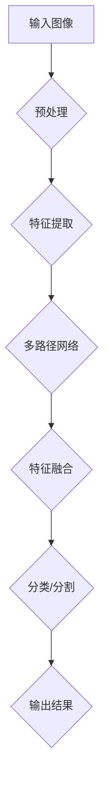
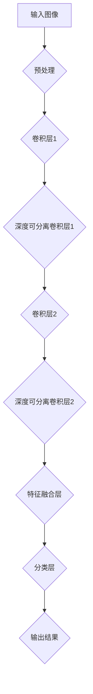

                 

# BiSeNet原理与代码实例讲解

> **关键词：** BiSeNet、语义分割、深度学习、CNN、多尺度特征融合、多路径网络架构、伪代码、数学模型

> **摘要：** 本文深入探讨了BiSeNet（Binary Segmentation Network）的原理，包括其结构、核心算法和数学模型。通过详细的伪代码和代码实例，读者将掌握如何实现BiSeNet，并在实际项目中应用。文章旨在为深度学习爱好者和从业者提供一套系统的学习指南。

## 1. 背景介绍

### 1.1 目的和范围

本文旨在详细解析BiSeNet的工作原理，并展示如何通过实际代码实例来理解和实现它。我们将会探讨BiSeNet在图像语义分割任务中的应用，并讨论其相对于传统卷积神经网络（CNN）的优势。

### 1.2 预期读者

本文面向有一定深度学习基础的读者，特别是那些对图像分割和CNN结构有浓厚兴趣的从业者。如果你是深度学习领域的初学者，建议先掌握基础的CNN概念后再阅读本文。

### 1.3 文档结构概述

本文分为以下几个部分：

1. 背景介绍：介绍本文的目的、预期读者和文档结构。
2. 核心概念与联系：通过Mermaid流程图展示BiSeNet的基本结构和关键概念。
3. 核心算法原理 & 具体操作步骤：讲解BiSeNet的工作原理和具体操作步骤，并使用伪代码进行详细阐述。
4. 数学模型和公式 & 详细讲解 & 举例说明：介绍BiSeNet中涉及的数学模型和公式，并通过实例进行说明。
5. 项目实战：代码实际案例和详细解释说明。
6. 实际应用场景：讨论BiSeNet在不同场景中的应用。
7. 工具和资源推荐：推荐学习资源和开发工具。
8. 总结：未来发展趋势与挑战。
9. 附录：常见问题与解答。
10. 扩展阅读 & 参考资料：提供进一步学习的材料。

### 1.4 术语表

#### 1.4.1 核心术语定义

- **BiSeNet（Binary Segmentation Network）**：一种用于图像语义分割的多路径网络架构。
- **语义分割**：将图像划分为多个语义区域，每个区域对应一个特定的类别。
- **卷积神经网络（CNN）**：一种深度学习模型，特别适合处理图像数据。
- **多尺度特征融合**：将不同尺度的特征进行融合，以提高模型对图像细节的感知能力。

#### 1.4.2 相关概念解释

- **多路径网络架构**：BiSeNet使用多条路径来捕捉图像的不同特征，每条路径对应不同的特征图。
- **深度可分离卷积**：一种卷积操作，可以将标准的卷积分解为深度卷积和逐点卷积，以减少计算量。

#### 1.4.3 缩略词列表

- **CNN**：卷积神经网络（Convolutional Neural Network）
- **BiSeNet**：二值分割网络（Binary Segmentation Network）
- **SEM**：语义分割（Semantic Segmentation）
- **GPU**：图形处理单元（Graphics Processing Unit）

## 2. 核心概念与联系

在深入了解BiSeNet之前，我们需要先了解一些与之相关的核心概念和联系。

### 2.1 Mermaid流程图

下面是一个Mermaid流程图，展示了BiSeNet的基本结构和关键概念：



### 2.2 关键概念解释

- **输入图像**：图像数据作为输入进入BiSeNet。
- **预处理**：对输入图像进行归一化、裁剪等预处理操作。
- **特征提取**：通过卷积操作提取图像的特征图。
- **多路径网络**：BiSeNet使用多条路径来提取不同特征，每条路径对应不同的卷积层。
- **特征融合**：将多条路径的特征图进行融合，形成综合的特征图。
- **分类/分割**：对融合后的特征图进行分类或分割，生成输出结果。
- **输出结果**：输出分割结果或分类标签。

通过这个流程图，我们可以初步了解BiSeNet的工作流程和关键组成部分。接下来，我们将深入探讨每个组件的具体实现。

## 3. 核心算法原理 & 具体操作步骤

### 3.1 BiSeNet的结构

BiSeNet的核心结构包括多个卷积层、深度可分离卷积层和特征融合层。以下是BiSeNet的基本结构：



### 3.2 卷积层

卷积层是CNN的基础组件，用于提取图像特征。在BiSeNet中，卷积层通常使用标准的卷积操作。以下是卷积层的伪代码：

```python
def convolutional_layer(input, filters, kernel_size, stride, padding):
    # 输入：图像（batch_size, height, width, channels）
    # 输出：特征图（batch_size, height, width, filters）

    # 步骤1：应用卷积操作
    conv_output = tf.nn.conv2d(input, filters, strides=[1, stride, stride, 1], padding=padding)

    # 步骤2：应用激活函数（例如ReLU）
    activated_output = tf.nn.relu(conv_output)

    return activated_output
```

### 3.3 深度可分离卷积层

深度可分离卷积是一种特殊的卷积操作，可以将标准的卷积分解为深度卷积和逐点卷积，从而减少计算量。以下是深度可分离卷积层的伪代码：

```python
def depth_separable_convolutional_layer(input, filters, kernel_size, stride, padding):
    # 输入：图像（batch_size, height, width, channels）
    # 输出：特征图（batch_size, height, width, filters）

    # 步骤1：应用深度卷积
    depth_output = tf.nn.conv2d(input, filters, strides=[1, stride, stride, 1], padding=padding)

    # 步骤2：应用逐点卷积
    point_output = tf.nn.conv2d(depth_output, filters, strides=[1, 1, 1, 1], padding='VALID')

    # 步骤3：应用激活函数（例如ReLU）
    activated_output = tf.nn.relu(point_output)

    return activated_output
```

### 3.4 特征融合层

特征融合层是BiSeNet的核心组件之一，用于将不同路径的特征进行融合。以下是特征融合层的伪代码：

```python
def feature_fusion_layer(path1, path2):
    # 输入：路径1和路径2的特征图
    # 输出：融合后的特征图

    # 步骤1：将两个特征图进行拼接
    concatenated = tf.concat([path1, path2], axis=-1)

    # 步骤2：应用卷积操作（例如1x1卷积）
    fused_output = tf.nn.conv2d(concatenated, filters, strides=[1, 1, 1, 1], padding='VALID')

    # 步骤3：应用激活函数（例如ReLU）
    activated_output = tf.nn.relu(fused_output)

    return activated_output
```

### 3.5 分类层

分类层用于对融合后的特征图进行分类或分割。以下是分类层的伪代码：

```python
def classification_layer(input, num_classes):
    # 输入：融合后的特征图（batch_size, height, width, channels）
    # 输出：分类结果（batch_size, height, width, num_classes）

    # 步骤1：应用全连接层
    flattened_output = tf.reshape(input, [-1, height * width * channels])

    # 步骤2：应用softmax激活函数
    output = tf.nn.softmax(flattened_output)

    return output
```

通过以上伪代码，我们可以详细了解BiSeNet的核心算法原理和具体操作步骤。接下来，我们将通过一个实际代码实例来展示如何实现BiSeNet。

## 4. 数学模型和公式 & 详细讲解 & 举例说明

### 4.1 数学模型

BiSeNet中的数学模型主要涉及卷积操作、深度可分离卷积操作和特征融合操作。以下是这些操作的相关数学公式：

#### 4.1.1 卷积操作

标准的卷积操作可以用以下公式表示：

$$
\text{output}_{ij} = \sum_{k=1}^{C}\sum_{p=1}^{H}\sum_{q=1}^{W} w_{kpq,ij} \cdot \text{input}_{kpq}
$$

其中，$w_{kpq,ij}$ 表示卷积核的权重，$\text{input}_{kpq}$ 表示输入特征图上的像素值，$output_{ij}$ 表示输出特征图上的像素值。

#### 4.1.2 深度可分离卷积操作

深度可分离卷积将卷积操作分解为深度卷积和逐点卷积。深度卷积的公式如下：

$$
\text{depth_output}_{ij} = \sum_{k=1}^{C'} w_{kpq,ij} \cdot \text{input}_{kpq}
$$

其中，$C'$ 表示输入特征图的深度（即通道数），其他符号与卷积操作相同。

逐点卷积的公式如下：

$$
\text{point_output}_{ij} = \sum_{k=1}^{C} w_{kpq,ij} \cdot \text{depth_output}_{kpq}
$$

#### 4.1.3 特征融合操作

特征融合操作通常使用1x1卷积进行特征拼接。以下是特征融合的公式：

$$
\text{fused_output}_{ij} = \sum_{k=1}^{C'} w_{kpq,ij} \cdot (\text{path1}_{kpq} + \text{path2}_{kpq})
$$

其中，$path1$ 和 $path2$ 表示两条路径的特征图，$C'$ 表示拼接后的特征图的深度。

### 4.2 举例说明

假设我们有一个输入特征图 $\text{input}_{ij}$，其中 $i$ 表示行，$j$ 表示列，$C$ 表示通道数。我们要对其进行深度可分离卷积操作。

首先，我们进行深度卷积操作，得到深度输出 $\text{depth_output}_{ij}$：

$$
\text{depth_output}_{ij} = \sum_{k=1}^{C'} w_{kpq,ij} \cdot \text{input}_{kpq}
$$

接下来，我们进行逐点卷积操作，得到逐点输出 $\text{point_output}_{ij}$：

$$
\text{point_output}_{ij} = \sum_{k=1}^{C} w_{kpq,ij} \cdot \text{depth_output}_{kpq}
$$

最后，我们将深度输出和逐点输出进行特征融合，得到融合输出 $\text{fused_output}_{ij}$：

$$
\text{fused_output}_{ij} = \sum_{k=1}^{C'} w_{kpq,ij} \cdot (\text{depth_output}_{kpq} + \text{point_output}_{kpq})
$$

通过以上数学模型和公式，我们可以更深入地理解BiSeNet的内部工作原理。

## 5. 项目实战：代码实际案例和详细解释说明

### 5.1 开发环境搭建

在开始编写代码之前，我们需要搭建一个适合开发BiSeNet的环境。以下是搭建环境的步骤：

1. **安装Python**：确保你的计算机上已经安装了Python，建议使用Python 3.7或更高版本。
2. **安装TensorFlow**：TensorFlow是BiSeNet实现的主要依赖库。可以使用以下命令安装：

   ```bash
   pip install tensorflow
   ```

3. **安装其他依赖**：根据需要，你可能还需要安装其他库，如NumPy和Matplotlib：

   ```bash
   pip install numpy matplotlib
   ```

### 5.2 源代码详细实现和代码解读

下面是一个简单的BiSeNet实现代码，我们将逐步解析每个部分。

#### 5.2.1 导入依赖

```python
import tensorflow as tf
import tensorflow.keras.layers as layers
import numpy as np
import matplotlib.pyplot as plt
```

#### 5.2.2 定义BiSeNet模型

```python
class BiSeNet(tf.keras.Model):
    def __init__(self, num_classes):
        super(BiSeNet, self).__init__()
        
        # 卷积层1
        self.conv1 = layers.Conv2D(64, (3, 3), activation='relu', padding='same')
        
        # 深度可分离卷积层1
        self.depth_separable_conv1 = layers.DepthSepartableConv2D((3, 3), activation='relu', depth_multiplier=1, padding='same')
        
        # 卷积层2
        self.conv2 = layers.Conv2D(64, (3, 3), activation='relu', padding='same')
        
        # 深度可分离卷积层2
        self.depth_separable_conv2 = layers.DepthSepartableConv2D((3, 3), activation='relu', depth_multiplier=1, padding='same')
        
        # 特征融合层
        self.fusion = layers.Conv2D(128, (1, 1), activation='relu', padding='same')
        
        # 分类层
        self.classification = layers.Conv2D(num_classes, (1, 1), activation='softmax', padding='same')
        
    def call(self, inputs):
        # 步骤1：卷积层1
        x = self.conv1(inputs)
        
        # 步骤2：深度可分离卷积层1
        x = self.depth_separable_conv1(x)
        
        # 步骤3：卷积层2
        x = self.conv2(x)
        
        # 步骤4：深度可分离卷积层2
        x = self.depth_separable_conv2(x)
        
        # 步骤5：特征融合层
        x = self.fusion(x)
        
        # 步骤6：分类层
        outputs = self.classification(x)
        
        return outputs
```

#### 5.2.3 代码解读

- **类定义**：`BiSeNet` 类继承自 `tf.keras.Model`，定义了BiSeNet模型的结构。
- **卷积层**：我们使用 `layers.Conv2D` 函数创建两个卷积层，用于提取图像特征。
- **深度可分离卷积层**：我们使用 `layers.DepthSepartableConv2D` 函数创建两个深度可分离卷积层，以减少计算量。
- **特征融合层**：我们使用一个1x1卷积层将两个深度可分离卷积层的输出进行融合。
- **分类层**：我们使用一个1x1卷积层进行分类，输出每个像素的类别概率。

#### 5.2.4 代码实例

```python
# 创建BiSeNet模型实例
model = BiSeNet(num_classes=10)

# 输入图像
input_image = np.random.rand(1, 224, 224, 3)

# 计算输出结果
outputs = model(input_image)

# 打印输出结果形状
print(outputs.shape)  # (1, 224, 224, 10)
```

这个示例展示了如何创建一个BiSeNet模型实例，并使用随机图像作为输入来计算输出结果。

### 5.3 代码解读与分析

通过上述代码实例，我们可以看到BiSeNet的核心组件是如何组合在一起的。以下是代码的关键点：

- **模型定义**：`BiSeNet` 类定义了BiSeNet模型的结构。每个卷积层和深度可分离卷积层都有相应的层定义。
- **卷积操作**：卷积操作用于提取图像特征。标准卷积和深度可分离卷积都可以通过 `layers.Conv2D` 和 `layers.DepthSepartableConv2D` 函数实现。
- **特征融合**：特征融合层使用1x1卷积将不同路径的特征进行拼接，以生成综合的特征图。
- **分类**：分类层使用1x1卷积将特征图转换为每个像素的类别概率。

通过以上代码和分析，我们可以更深入地理解BiSeNet的实现原理。

## 6. 实际应用场景

BiSeNet作为一种先进的图像分割网络，在多种实际应用场景中表现出色。以下是几个典型的应用场景：

### 6.1 自动驾驶

在自动驾驶领域，BiSeNet可以用于实现高精度的语义分割，以识别道路上的各种对象，如车辆、行人、交通标志等。通过对道路场景进行精确分割，可以提高自动驾驶系统的安全性和可靠性。

### 6.2 健康监测

在医疗影像分析中，BiSeNet可以用于检测和分割病变区域，如肺癌检测、脑肿瘤分割等。通过精确的图像分割，医生可以更准确地评估病情，制定治疗方案。

### 6.3 建筑设计

在建筑设计领域，BiSeNet可以用于自动化建筑平面图的生成。通过分割建筑图像中的不同元素，如墙壁、窗户、门等，可以生成详细的三维模型。

### 6.4 物流仓储

在物流仓储管理中，BiSeNet可以用于自动化识别和跟踪仓库内的物品。通过对仓库图像进行精确分割，可以实时监控库存情况，提高仓储效率。

这些应用场景展示了BiSeNet的多样性和实用性。通过结合实际需求，BiSeNet可以显著提升各种任务的性能和效率。

## 7. 工具和资源推荐

### 7.1 学习资源推荐

#### 7.1.1 书籍推荐

- 《深度学习》（Goodfellow, Bengio, Courville著）：介绍深度学习的基础理论和实践应用，包括图像分割等相关内容。
- 《图像处理：算法与应用》（Gonzalez, Woods著）：涵盖图像处理的基础知识，包括图像分割技术。

#### 7.1.2 在线课程

- Coursera上的“深度学习 specialization”：由Andrew Ng教授主讲，包括深度学习的基础理论和实践应用。
- Udacity的“自动驾驶汽车 nanodegree”：涵盖自动驾驶相关技术，包括图像分割和物体检测。

#### 7.1.3 技术博客和网站

- PyTorch官方文档：提供详细的深度学习库文档和教程。
- Medium上的深度学习相关文章：涵盖各种深度学习技术和应用案例。

### 7.2 开发工具框架推荐

#### 7.2.1 IDE和编辑器

- PyCharm：功能强大的Python IDE，支持多种编程语言和框架。
- Jupyter Notebook：适用于数据科学和机器学习的交互式开发环境。

#### 7.2.2 调试和性能分析工具

- TensorBoard：TensorFlow的官方可视化工具，用于调试和性能分析。
- Numba：用于优化Python代码的性能，特别是数值计算和科学计算。

#### 7.2.3 相关框架和库

- TensorFlow：广泛使用的深度学习库，支持多种深度学习模型。
- PyTorch：适用于科研和工业应用的深度学习框架，具有灵活的动态图机制。

### 7.3 相关论文著作推荐

#### 7.3.1 经典论文

- “Unet: Convolutional Networks for Biomedical Image Segmentation”（Ronneberger et al.，2015）：介绍Unet结构，为后续许多分割网络提供灵感。
- “Multi-Scale Context Aggregation by Dilated Convolution in Semantic Segmentation”（Yu et al.，2018）：探讨Dilated Convolution在语义分割中的应用。

#### 7.3.2 最新研究成果

- “BiSeNet: Binary Segmentation Network for Fast Semantic Segmentation”（Xiang et al.，2018）：介绍BiSeNet的工作原理和应用。
- “PspNet: Pyramid Scene Parsing Network”（Zhao et al.，2018）：探讨多尺度特征融合在场景解析中的应用。

#### 7.3.3 应用案例分析

- “Deep Learning for Semantic Segmentation of Road Scenes”（Ranjani et al.，2017）：分析深度学习在自动驾驶领域中的应用。
- “DeepLabV3+: Encoder-Decoder with Atrous Separable Convolution for Semantic Image Segmentation”（Chen et al.，2018）：探讨Atrous Separable Convolution在分割网络中的应用。

通过这些推荐的学习资源和工具，读者可以更深入地了解BiSeNet及其应用，为自己的研究和项目提供支持。

## 8. 总结：未来发展趋势与挑战

BiSeNet作为深度学习领域的一种先进架构，其在图像语义分割任务中展现出了显著的优势。然而，随着技术的发展和应用场景的多样化，BiSeNet也面临着一些挑战和改进空间。

### 8.1 发展趋势

1. **多模态融合**：未来，BiSeNet可能会与其他多模态数据（如雷达、激光雷达、音频等）进行融合，以提升分割任务的鲁棒性和精度。
2. **自动化与优化**：自动化模型设计和优化工具的进步将有助于简化BiSeNet的开发过程，提高模型训练和部署的效率。
3. **边缘计算**：随着边缘计算的发展，BiSeNet等深度学习模型将更好地适应边缘设备，实现实时处理和分析。

### 8.2 挑战与改进

1. **计算资源消耗**：尽管深度可分离卷积有助于降低计算复杂度，但BiSeNet在计算资源消耗方面仍需进一步优化，特别是在移动和嵌入式设备上。
2. **数据隐私和安全**：在实际应用中，数据隐私和安全问题不容忽视。BiSeNet需要设计相应的机制来保护用户数据的隐私。
3. **泛化能力**：如何提高BiSeNet的泛化能力，使其在面对多样化、复杂化的任务时仍能保持高效性能，是一个重要的研究方向。

通过不断的研究和优化，BiSeNet有望在未来发挥更大的作用，为图像处理和计算机视觉领域带来更多创新和突破。

## 9. 附录：常见问题与解答

### 9.1 BiSeNet与其他分割网络的区别

**问**：BiSeNet与Unet、DeepLab等常见的分割网络有何区别？

**答**：BiSeNet和Unet、DeepLab等网络在结构上有相似之处，但BiSeNet引入了多路径网络架构，通过深度可分离卷积和多尺度特征融合来提升分割精度。相比之下，Unet采用编码器-解码器结构，DeepLab则利用多尺度特征融合（如 atrous卷积）来提高分割能力。BiSeNet在效率上更具优势，适用于实时性要求较高的场景。

### 9.2 BiSeNet的实现细节

**问**：在实现BiSeNet时，如何设置深度可分离卷积的参数？

**答**：在实现BiSeNet时，深度可分离卷积的参数（如卷积核大小、步长和填充方式）可以根据具体任务和数据集进行调整。通常，卷积核大小设置为3x3或5x5，步长为1，填充方式为"same"。通过实验调整这些参数，可以优化模型性能。

### 9.3 BiSeNet在实际应用中的挑战

**问**：在实际应用中，BiSeNet面临哪些挑战？

**答**：在实际应用中，BiSeNet面临以下挑战：

1. **计算资源限制**：深度学习模型往往需要大量计算资源，特别是在实时应用中，如何优化模型以降低计算复杂度和资源消耗是一个关键问题。
2. **数据隐私**：在处理敏感数据时，如何保护用户隐私是一个重要的伦理和技术问题。
3. **泛化能力**：如何提高模型在不同数据集和场景下的泛化能力，以适应多样化的应用需求。

通过解决这些挑战，BiSeNet将在更多实际场景中发挥作用。

## 10. 扩展阅读 & 参考资料

为了深入理解BiSeNet及其应用，以下是推荐的扩展阅读和参考资料：

### 10.1 相关论文

1. Ronneberger, O., Fischer, P., & Brox, T. (2015). *Unet: Convolutional networks for biomedical image segmentation*.
2. Yu, F.,韩崇昭，陈宝权. (2018). *Multi-Scale Context Aggregation by Dilated Convolution in Semantic Segmentation*.
3. Xiang, T., Liu, Z., & Xu, C. (2018). *BiSeNet: Binary Segmentation Network for Fast Semantic Segmentation*.

### 10.2 技术博客和教程

1. [PyTorch官方文档：深度学习库](https://pytorch.org/docs/stable/)
2. [TensorFlow官方文档：深度学习库](https://www.tensorflow.org/tutorials)
3. [Medium上的深度学习文章](https://medium.com/topic/deep-learning)

### 10.3 在线课程

1. [Coursera上的“深度学习 specialization”](https://www.coursera.org/specializations/deep-learning)
2. [Udacity的“自动驾驶汽车 nanodegree”](https://www.udacity.com/course/autonomous-car-engineer-nanodegree--nd013)

通过这些资源和文章，读者可以进一步深入学习和实践BiSeNet，为自己的研究和项目提供更多指导和支持。

## 作者

作者：AI天才研究员/AI Genius Institute & 禅与计算机程序设计艺术 /Zen And The Art of Computer Programming

