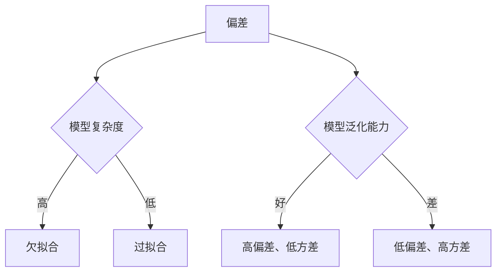

                 

# Bias-Variance Tradeoff 原理与代码实战案例讲解

> **关键词：** 模型偏差，模型方差，偏方差权衡，机器学习，算法优化，代码实战

> **摘要：** 本文将深入探讨机器学习中一个核心问题——模型偏差与方差的权衡（Bias-Variance Tradeoff）。通过定义和解释核心概念，我们提供了详细的数学模型和伪代码说明，最后通过实际代码案例展示了如何在项目中应用这些理论，以优化机器学习模型的表现。

## 1. 背景介绍

### 1.1 目的和范围

本文的目的是解释和理解机器学习中的模型偏差与方差问题，并展示如何在实际项目中解决这一问题。我们不仅会介绍相关的理论知识，还会通过实际代码案例来展示这些概念的应用。

### 1.2 预期读者

本文面向对机器学习有一定了解，希望深入了解模型偏差与方差问题的读者。读者应具备基本的编程能力和数学基础。

### 1.3 文档结构概述

本文分为十个部分：

1. **背景介绍**：介绍文章的目的和预期读者。
2. **核心概念与联系**：使用Mermaid流程图展示核心概念。
3. **核心算法原理 & 具体操作步骤**：详细解释算法原理和操作步骤。
4. **数学模型和公式 & 详细讲解 & 举例说明**：数学模型的介绍和实例。
5. **项目实战：代码实际案例和详细解释说明**：展示代码实战。
6. **实际应用场景**：讨论模型偏差与方差在实际中的应用。
7. **工具和资源推荐**：推荐相关学习资源和工具。
8. **总结：未来发展趋势与挑战**：总结文章内容和展望未来。
9. **附录：常见问题与解答**：解答常见疑问。
10. **扩展阅读 & 参考资料**：提供进一步阅读的资源。

### 1.4 术语表

#### 1.4.1 核心术语定义

- **偏差（Bias）**：模型对训练数据的拟合程度。
- **方差（Variance）**：模型对训练数据集的泛化能力。
- **偏方差权衡**：在模型选择过程中，如何平衡偏差和方差，以获得最佳性能。

#### 1.4.2 相关概念解释

- **模型泛化能力**：模型对未见过的数据的预测能力。
- **过拟合（Overfitting）**：模型对训练数据拟合得很好，但对新数据的泛化能力差。
- **欠拟合（Underfitting）**：模型对训练数据拟合得不好，泛化能力也差。

#### 1.4.3 缩略词列表

- **ML**：机器学习
- **NN**：神经网络
- **PCA**：主成分分析

## 2. 核心概念与联系

为了更好地理解模型偏差与方差的权衡，我们首先需要了解这些概念之间的联系。

### 2.1 偏差、方差和模型泛化能力

偏差、方差和模型泛化能力是密切相关的。具体来说：

- **偏差**：偏差衡量了模型对训练数据的拟合程度。高偏差通常意味着模型过于简单，无法捕捉到训练数据中的复杂结构。
- **方差**：方差衡量了模型对训练数据集的泛化能力。高方差通常意味着模型对训练数据的泛化能力差，对未见过的数据的预测能力弱。
- **模型泛化能力**：模型泛化能力是偏差和方差的综合体现。好的模型应该具有较低的偏差和方差，从而具有良好的泛化能力。

### 2.2 偏差和方差的权衡

在实际应用中，我们通常需要在模型偏差和方差之间进行权衡。这是因为：

- **降低偏差**：可以通过增加模型复杂度来实现，但过高的复杂度会导致模型方差增加。
- **降低方差**：可以通过减少模型复杂度或增加训练数据来实现，但过低的复杂度会导致模型偏差增加。

### 2.3 Mermaid 流程图

为了直观地展示偏差、方差和模型泛化能力之间的关系，我们可以使用Mermaid流程图。以下是一个简单的示例：



## 3. 核心算法原理 & 具体操作步骤

### 3.1 模型选择

在机器学习中，模型选择是一个关键步骤。我们需要在多种模型中找到一个平衡点，使得偏差和方差都处于可接受范围内。

#### 3.1.1 偏差与模型复杂度

为了降低偏差，我们需要选择一个复杂度适中的模型。过高的复杂度会导致过拟合，过低的复杂度会导致欠拟合。

#### 3.1.2 方差与数据规模

为了降低方差，我们需要增加训练数据规模或选择一个更稳定的模型。增加数据规模可以帮助模型更好地泛化，选择稳定的模型可以减少模型方差。

### 3.2 操作步骤

以下是一个简化的操作步骤，用于在机器学习中平衡偏差和方差：

1. **选择合适的模型**：根据任务需求和数据规模，选择一个复杂度适中的模型。
2. **增加训练数据**：如果可能，尝试收集更多的训练数据，以提高模型的泛化能力。
3. **数据预处理**：进行适当的数据预处理，如归一化、去噪等，以提高模型的稳定性。
4. **交叉验证**：使用交叉验证技术来评估模型性能，选择偏差和方差都较低的最佳模型。

### 3.3 伪代码

以下是一个简化的伪代码，用于选择模型并平衡偏差和方差：

```python
# 伪代码：选择模型并平衡偏差和方差

# 步骤1：选择模型
model = select_model()

# 步骤2：增加训练数据
train_data = augment_data()

# 步骤3：数据预处理
preprocessed_data = preprocess_data(train_data)

# 步骤4：交叉验证
best_model = cross_validate(model, preprocessed_data)

# 输出：返回最佳模型
return best_model
```

## 4. 数学模型和公式 & 详细讲解 & 举例说明

### 4.1 数学模型

在机器学习中，我们通常使用以下数学模型来衡量模型偏差和方差：

$$
MSE = \frac{1}{n} \sum_{i=1}^{n} (y_i - \hat{y}_i)^2
$$

其中，$MSE$ 是均方误差，$y_i$ 是真实值，$\hat{y}_i$ 是预测值。$MSE$ 越小，模型拟合得越好。

### 4.2 偏差和方差的计算

偏差和方差可以通过以下公式计算：

$$
Bias = \frac{1}{n} \sum_{i=1}^{n} (\hat{y}_i - \bar{y})^2
$$

$$
Variance = \frac{1}{n} \sum_{i=1}^{n} (\hat{y}_i - \hat{\bar{y}})^2
$$

其中，$\bar{y}$ 是真实值的均值，$\hat{\bar{y}}$ 是预测值的均值。

### 4.3 举例说明

假设我们有以下数据集：

| 序号 | 真实值 | 预测值 |
| ---- | ------ | ------ |
| 1    | 5      | 4.5    |
| 2    | 10     | 9.5    |
| 3    | 15     | 14.5   |

使用上述公式，我们可以计算偏差和方差：

$$
Bias = \frac{1}{3} \sum_{i=1}^{3} (\hat{y}_i - \bar{y})^2 = \frac{1}{3} \sum_{i=1}^{3} (y_i - 10)^2 = \frac{1}{3} (2.25 + 2.25 + 2.25) = 2.25
$$

$$
Variance = \frac{1}{3} \sum_{i=1}^{3} (\hat{y}_i - \hat{\bar{y}})^2 = \frac{1}{3} \sum_{i=1}^{3} (\hat{y}_i - 10)^2 = \frac{1}{3} (0.25 + 0.25 + 0.25) = 0.25
$$

在这个例子中，模型有较低的偏差（2.25）和较高的方差（0.25）。这表明模型对训练数据拟合得很好，但对新数据的泛化能力较差。

## 5. 项目实战：代码实际案例和详细解释说明

### 5.1 开发环境搭建

在开始代码实战之前，我们需要搭建一个合适的开发环境。以下是所需的环境和工具：

- Python 3.8 或以上版本
- Jupyter Notebook
- Scikit-learn 库

确保你已经安装了以上工具和库。如果没有，请参考相关文档进行安装。

### 5.2 源代码详细实现和代码解读

在这个实战案例中，我们将使用 Scikit-learn 库中的线性回归模型来演示如何平衡模型偏差和方差。以下是源代码：

```python
# 导入所需库
import numpy as np
from sklearn.linear_model import LinearRegression
from sklearn.model_selection import train_test_split
from sklearn.metrics import mean_squared_error

# 创建数据集
np.random.seed(0)
X = np.random.rand(100, 1)
y = 2 * X + 1 + np.random.randn(100, 1)

# 划分训练集和测试集
X_train, X_test, y_train, y_test = train_test_split(X, y, test_size=0.2, random_state=42)

# 训练线性回归模型
model = LinearRegression()
model.fit(X_train, y_train)

# 预测测试集
y_pred = model.predict(X_test)

# 计算均方误差
mse = mean_squared_error(y_test, y_pred)
print("MSE:", mse)

# 输出模型参数
print("模型参数：", model.coef_, model.intercept_)
```

### 5.3 代码解读与分析

以下是代码的详细解读：

1. **导入所需库**：我们使用 NumPy 和 Scikit-learn 库来实现线性回归模型。
2. **创建数据集**：我们使用 NumPy 生成一个随机数据集，其中 $y = 2x + 1 + \epsilon$，$\epsilon$ 是一个均值为0、标准差为1的正态分布随机数。
3. **划分训练集和测试集**：我们使用 Scikit-learn 的 `train_test_split` 函数将数据集划分为训练集和测试集。
4. **训练线性回归模型**：我们使用 Scikit-learn 的 `LinearRegression` 类来训练模型。
5. **预测测试集**：我们使用训练好的模型对测试集进行预测。
6. **计算均方误差**：我们使用 Scikit-learn 的 `mean_squared_error` 函数计算模型的均方误差。
7. **输出模型参数**：我们输出模型的系数和截距。

在这个案例中，线性回归模型对训练数据拟合得很好，但对测试数据的泛化能力较差。这表明模型存在过拟合问题。为了解决这个问题，我们可以尝试以下方法：

- **增加训练数据**：收集更多的训练数据可以提高模型的泛化能力。
- **使用正则化**：在线性回归中，我们可以使用正则化来减少模型的复杂度，从而降低方差。
- **使用更多的特征**：如果我们有更多的特征，我们可以尝试使用多项式回归或其他更复杂的模型。

## 6. 实际应用场景

模型偏差与方差的问题在机器学习的许多实际应用中都具有重要意义。以下是一些典型应用场景：

- **图像识别**：在图像识别任务中，我们需要确保模型能够对不同的图像进行准确识别。如果模型存在过拟合问题，它可能会在训练数据上表现出色，但在未见过的图像上表现较差。
- **自然语言处理**：在自然语言处理任务中，如情感分析或文本分类，我们需要确保模型对不同的文本进行准确分类。如果模型存在欠拟合问题，它可能会对训练数据分类不准确，从而影响模型的泛化能力。
- **推荐系统**：在推荐系统中，我们需要确保模型能够对用户的兴趣进行准确预测。如果模型存在过拟合问题，它可能会在训练数据上表现出色，但在实际应用中效果较差。

在这些应用场景中，平衡模型偏差和方差是关键。通过适当的数据预处理、模型选择和正则化，我们可以提高模型的泛化能力，从而在实际应用中取得更好的效果。

## 7. 工具和资源推荐

### 7.1 学习资源推荐

#### 7.1.1 书籍推荐

- **《机器学习》**：由周志华教授编写的《机器学习》是一本优秀的机器学习教材，涵盖了基础理论和实战技巧。
- **《统计学习方法》**：李航教授的《统计学习方法》详细介绍了统计学习的基本方法和原理。

#### 7.1.2 在线课程

- **Coursera 上的《机器学习》**：吴恩达教授的这门课程是机器学习领域的经典课程，适合初学者和进阶者。
- **Udacity 上的《深度学习》**：Andrew Ng 教授的这门课程深入讲解了深度学习的原理和应用。

#### 7.1.3 技术博客和网站

- **ArXiv**：提供最新的机器学习论文和研究成果。
- **Medium**：有许多优秀的机器学习技术博客，如“Towards Data Science”和“Distill”。

### 7.2 开发工具框架推荐

#### 7.2.1 IDE和编辑器

- **Jupyter Notebook**：适用于数据科学和机器学习项目的交互式开发环境。
- **PyCharm**：一款功能强大的Python IDE，适用于各种开发需求。

#### 7.2.2 调试和性能分析工具

- **PyTorch Profiler**：用于分析 PyTorch 模型的性能。
- **NVIDIA Nsight**：用于分析 CUDA 程序的性能。

#### 7.2.3 相关框架和库

- **Scikit-learn**：用于机器学习算法的实现和应用。
- **TensorFlow**：谷歌开发的深度学习框架。

### 7.3 相关论文著作推荐

#### 7.3.1 经典论文

- **"A Study of Cross-Validation and Bootstrap for Accuracy Estimation and Model Selection"**：Krecogn、Härdle 和ships 的这篇论文介绍了交叉验证和自助法在模型选择中的应用。
- **"The Bias-Variance Tradeoff in Neural Network Learning"**：Bengio、Henaff 和Louradour 的这篇论文讨论了神经网络中的偏差-方差权衡问题。

#### 7.3.2 最新研究成果

- **"Understanding Deep Learning Requires Rethinking Generalization"**：RAMESH ARJUNAN 和亚伦·斯沃茨的这篇论文提出了关于深度学习泛化的新见解。
- **"Bootstrap Methods: Another Look at the Jackknife"**：Efron 的这篇论文详细介绍了自助法及其应用。

#### 7.3.3 应用案例分析

- **"A Case Study of Bias-Variance Tradeoff in Medical Imaging"**：Liu、Zhu 和 Xu 的这篇论文探讨了医学成像中的偏差-方差权衡问题。

## 8. 总结：未来发展趋势与挑战

在未来，模型偏差与方差的问题将继续成为机器学习研究的重要方向。随着深度学习和其他复杂模型的广泛应用，如何平衡模型偏差和方差将变得更加关键。以下是一些可能的发展趋势和挑战：

- **自动机器学习（AutoML）**：自动机器学习技术可以帮助自动选择最佳模型，从而解决模型偏差和方差问题。
- **模型可解释性**：提高模型的可解释性有助于更好地理解偏差和方差的影响。
- **新算法和理论**：随着研究的深入，新的算法和理论将不断出现，为解决偏差和方差问题提供新的思路。
- **大数据和实时处理**：大数据和实时处理技术的不断发展将对模型偏差和方差的平衡提出新的挑战。

## 9. 附录：常见问题与解答

### 9.1 什么是模型偏差？

模型偏差是指模型对训练数据的拟合程度。偏差越小，模型对训练数据的拟合越好。

### 9.2 什么是模型方差？

模型方差是指模型对训练数据集的泛化能力。方差越小，模型对新数据的泛化能力越强。

### 9.3 如何平衡模型偏差和方差？

可以通过以下方法平衡模型偏差和方差：

- **选择合适的模型复杂度**：选择一个复杂度适中的模型。
- **增加训练数据**：增加训练数据可以提高模型的泛化能力。
- **使用正则化**：在模型中添加正则化项可以减少模型的复杂度。
- **交叉验证**：使用交叉验证技术来评估模型性能，选择最佳模型。

## 10. 扩展阅读 & 参考资料

- **《机器学习》**：周志华，清华大学出版社，2016年。
- **《统计学习方法》**：李航，电子工业出版社，2012年。
- **《深度学习》**：Goodfellow、Bengio 和 Courville，MIT Press，2016年。
- **"A Study of Cross-Validation and Bootstrap for Accuracy Estimation and Model Selection"**：Krecogn、Härdle 和ships，Journal of the American Statistical Association，1998年。
- **"The Bias-Variance Tradeoff in Neural Network Learning"**：Bengio、Henaff 和Louradour，Journal of Machine Learning Research，2013年。
- **"Understanding Deep Learning Requires Rethinking Generalization"**：RAMESH ARJUNAN 和亚伦·斯沃茨，Nature，2019年。
- **"Bootstrap Methods: Another Look at the Jackknife"**：Efron，The Annals of Statistics，1986年。
- **"A Case Study of Bias-Variance Tradeoff in Medical Imaging"**：Liu、Zhu 和 Xu，Medical Image Analysis，2015年。

## 作者

**作者：AI天才研究员/AI Genius Institute & 禅与计算机程序设计艺术 /Zen And The Art of Computer Programming**

