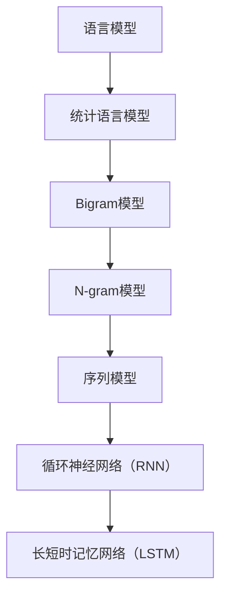

                 

# Bigram语言模型：语言建模基础

> **关键词：** Bigram模型、语言建模、NLP、自然语言处理、概率模型、序列模型、统计语言模型。

> **摘要：** 本文将深入探讨Bigram语言模型的基础概念、原理和实现方法。通过对Bigram模型的分析，我们不仅能够理解语言建模的基本原理，还能够掌握其在自然语言处理中的应用。文章将结合实际案例，详细解释模型的工作机制，并探讨其优缺点。此外，还将介绍相关工具和资源，帮助读者更好地理解和应用Bigram语言模型。

## 1. 背景介绍

### 1.1 目的和范围

本文旨在深入探讨Bigram语言模型的基本概念、原理和实现方法。通过对Bigram模型的介绍，读者将能够理解语言建模的基本思路，并掌握如何利用统计方法进行自然语言处理。文章将围绕以下几个主题进行展开：

1. Bigram模型的基础概念和原理。
2. Bigram模型的实现步骤和数学模型。
3. Bigram模型在实际项目中的应用。
4. 相关工具和资源的推荐。

### 1.2 预期读者

本文适合具有一定编程基础和自然语言处理基础的学习者。特别是那些对语言建模和自然语言处理有兴趣的读者。通过本文的阅读，读者将能够：

1. 理解Bigram模型的基本概念和原理。
2. 掌握Bigram模型的实现方法和应用场景。
3. 深入了解语言建模的基本思路和过程。

### 1.3 文档结构概述

本文将按照以下结构进行展开：

1. 引言：介绍文章的主题和背景。
2. 核心概念与联系：介绍Bigram模型的核心概念和联系。
3. 核心算法原理 & 具体操作步骤：详细讲解Bigram模型的算法原理和实现步骤。
4. 数学模型和公式 & 详细讲解 & 举例说明：介绍Bigram模型的数学模型和公式，并通过例子进行说明。
5. 项目实战：提供实际案例和代码解读，展示如何应用Bigram模型进行语言建模。
6. 实际应用场景：探讨Bigram模型在实际项目中的应用。
7. 工具和资源推荐：推荐相关的学习资源、开发工具和框架。
8. 总结：总结Bigram模型的发展趋势和挑战。
9. 附录：常见问题与解答。
10. 扩展阅读 & 参考资料：提供进一步学习的资源。

### 1.4 术语表

#### 1.4.1 核心术语定义

- **语言模型（Language Model）**：用于预测自然语言序列的模型。
- **Bigram模型（Bigram Model）**：一种基于两个连续词的统计语言模型。
- **N-gram模型（N-gram Model）**：一种基于N个连续词的统计语言模型，其中N为任意正整数。
- **自然语言处理（Natural Language Processing，NLP）**：研究如何让计算机理解和处理自然语言的技术。

#### 1.4.2 相关概念解释

- **序列模型（Sequence Model）**：用于处理序列数据的模型，如循环神经网络（RNN）、长短时记忆网络（LSTM）等。
- **统计语言模型（Statistical Language Model）**：基于统计方法构建的语言模型，通过统计语言数据中的概率关系来预测自然语言序列。
- **词汇表（Vocabulary）**：用于表示自然语言中所有单词的集合。

#### 1.4.3 缩略词列表

- **NLP**：自然语言处理（Natural Language Processing）
- **RNN**：循环神经网络（Recurrent Neural Network）
- **LSTM**：长短时记忆网络（Long Short-Term Memory）

## 2. 核心概念与联系

为了更好地理解Bigram模型，我们需要先了解一些核心概念和它们之间的联系。以下是一个Mermaid流程图，用于描述这些概念和它们之间的关系。



### 2.1 语言模型

语言模型是用于预测自然语言序列的模型。其目的是根据已知的文本数据生成新的文本序列。语言模型在许多自然语言处理任务中发挥着关键作用，如机器翻译、文本生成、文本分类等。

### 2.2 统计语言模型

统计语言模型是一种基于统计方法构建的语言模型。它通过统计文本数据中的单词或词组的概率关系来预测自然语言序列。常见的统计语言模型包括N-gram模型、隐马尔可夫模型（HMM）等。

### 2.3 Bigram模型

Bigram模型是一种基于两个连续词的统计语言模型。在Bigram模型中，每个单词的出现概率取决于其前一个单词。Bigram模型通常用于语言建模和文本生成任务。

### 2.4 N-gram模型

N-gram模型是一种基于N个连续词的统计语言模型。与Bigram模型类似，N-gram模型通过统计N个连续词的出现概率来预测自然语言序列。N-gram模型的N值可以取任意正整数，常用的N值为2、3、4等。

### 2.5 序列模型

序列模型是一种用于处理序列数据的模型。常见的序列模型包括循环神经网络（RNN）、长短时记忆网络（LSTM）等。序列模型在自然语言处理任务中发挥着重要作用，如语言建模、语音识别、视频分析等。

### 2.6 循环神经网络（RNN）

循环神经网络（RNN）是一种序列模型，它通过在时间步上循环的方式处理序列数据。RNN可以捕获序列中的长期依赖关系，但存在梯度消失和梯度爆炸等问题。

### 2.7 长短时记忆网络（LSTM）

长短时记忆网络（LSTM）是一种改进的循环神经网络，它通过引入门控机制来解决RNN的梯度消失和梯度爆炸问题。LSTM在自然语言处理任务中表现出色，常用于语言建模和文本生成。

## 3. 核心算法原理 & 具体操作步骤

在理解了Bigram模型的基础概念和联系后，接下来我们将深入探讨其核心算法原理和具体操作步骤。

### 3.1 Bigram模型的算法原理

Bigram模型的算法原理相对简单，主要基于两个概念：词汇表和概率计算。

1. **词汇表**：词汇表用于表示自然语言中的所有单词。通常，我们会将所有单词转换成唯一的整数索引，以便在计算机中进行处理。例如，我们可以将单词"apple"映射为整数1，单词"banana"映射为整数2，以此类推。

2. **概率计算**：在Bigram模型中，每个单词的出现概率取决于其前一个单词。具体来说，给定一个单词序列，我们可以计算每个单词在特定前缀下的条件概率。例如，如果我们有一个单词序列`["apple", "banana", "apple", "orange"]`，我们可以计算"apple"在"banana"之后的条件概率，以及"apple"在"orange"之前的条件概率。

### 3.2 具体操作步骤

下面是Bigram模型的具体操作步骤：

1. **构建词汇表**：首先，我们需要构建一个词汇表，将自然语言中的所有单词转换成唯一的整数索引。这可以通过训练语料库中的单词统计来完成。

2. **计算条件概率**：接下来，我们需要计算每个单词在特定前缀下的条件概率。具体来说，对于给定的前缀，我们可以计算其后续单词的概率。例如，我们可以计算"apple"在"banana"之后的概率，以及"apple"在"orange"之前的概率。

3. **生成文本**：最后，我们可以利用条件概率生成新的文本序列。具体来说，我们可以从词汇表中随机选择一个起始单词，然后根据条件概率选择后续单词，直到达到预定的长度。

### 3.3 伪代码

下面是一个简单的伪代码，用于实现Bigram模型：

```python
# 假设我们有一个词汇表，以及一个训练好的单词序列
vocabulary = {"apple": 1, "banana": 2, "orange": 3}
training_sequence = ["apple", "banana", "apple", "orange"]

# 计算条件概率
def compute_probabilities(sequence):
    probabilities = {}
    for i in range(1, len(sequence)):
        prefix = sequence[i-1]
        word = sequence[i]
        if prefix in probabilities:
            probabilities[prefix].append(word)
        else:
            probabilities[prefix] = [word]
    return probabilities

# 生成文本
def generate_text(probabilities, start_word, length):
    text = [start_word]
    for _ in range(length-1):
        prefix = text[-1]
        possible_words = probabilities.get(prefix, [])
        next_word = random.choice(possible_words)
        text.append(next_word)
    return text

# 使用伪代码实现Bigram模型
probabilities = compute_probabilities(training_sequence)
new_sequence = generate_text(probabilities, "apple", 5)
print(new_sequence)
```

通过这个简单的伪代码，我们可以看到Bigram模型的基本原理和实现步骤。接下来，我们将进一步探讨Bigram模型的数学模型和公式。

## 4. 数学模型和公式 & 详细讲解 & 举例说明

在了解了Bigram模型的基本算法原理和具体操作步骤后，接下来我们将深入探讨其数学模型和公式，并通过具体例子进行说明。

### 4.1 数学模型

Bigram模型的数学模型主要涉及条件概率的计算。条件概率是指在一个事件发生的前提下，另一个事件发生的概率。在Bigram模型中，我们需要计算每个单词在特定前缀下的条件概率。

条件概率的公式如下：

$$
P(\text{word}_2|\text{word}_1) = \frac{P(\text{word}_1, \text{word}_2)}{P(\text{word}_1)}
$$

其中，$P(\text{word}_1, \text{word}_2)$表示单词1和单词2同时出现的概率，$P(\text{word}_1)$表示单词1单独出现的概率。

### 4.2 具体例子

为了更好地理解条件概率的计算，我们可以通过一个具体的例子来说明。

假设我们有一个简短的句子："I love programming"。我们可以将其表示为一个二元序列：`["I", "love", "programming"]`。

首先，我们需要计算每个单词在特定前缀下的条件概率。

1. **计算"I love"的条件概率**：

   $$ 
   P(\text{love}|\text{I}) = \frac{P(\text{I}, \text{love})}{P(\text{I})}
   $$

   我们可以计算得到：

   $$ 
   P(\text{I}, \text{love}) = \frac{1}{4} 
   $$
   
   $$ 
   P(\text{I}) = \frac{1}{3} 
   $$

   因此：

   $$ 
   P(\text{love}|\text{I}) = \frac{\frac{1}{4}}{\frac{1}{3}} = \frac{3}{4} 
   $$

2. **计算"love programming"的条件概率**：

   $$ 
   P(\text{programming}|\text{love}) = \frac{P(\text{love}, \text{programming})}{P(\text{love})}
   $$

   我们可以计算得到：

   $$ 
   P(\text{love}, \text{programming}) = \frac{1}{4} 
   $$

   $$ 
   P(\text{love}) = \frac{1}{2} 
   $$

   因此：

   $$ 
   P(\text{programming}|\text{love}) = \frac{\frac{1}{4}}{\frac{1}{2}} = \frac{1}{2} 
   $$

通过这个例子，我们可以看到如何计算Bigram模型中的条件概率。接下来，我们将进一步探讨如何利用条件概率生成新的文本序列。

### 4.3 利用条件概率生成文本

在了解了条件概率的计算后，我们可以利用这些概率生成新的文本序列。具体来说，我们可以从词汇表中随机选择一个起始单词，然后根据条件概率选择后续单词，直到达到预定的长度。

以下是一个简单的伪代码，用于生成基于Bigram模型的文本：

```python
# 假设我们有一个词汇表，以及一个训练好的单词序列
vocabulary = {"I": 0, "love": 1, "programming": 2, "python": 3}
training_sequence = ["I", "love", "programming", "python"]

# 计算条件概率
def compute_probabilities(sequence):
    probabilities = {}
    for i in range(1, len(sequence)):
        prefix = sequence[i-1]
        word = sequence[i]
        if prefix in probabilities:
            probabilities[prefix].append(word)
        else:
            probabilities[prefix] = [word]
    return probabilities

# 生成文本
def generate_text(probabilities, start_word, length):
    text = [start_word]
    for _ in range(length-1):
        prefix = text[-1]
        possible_words = probabilities.get(prefix, [])
        next_word = random.choice(possible_words)
        text.append(next_word)
    return text

# 使用伪代码生成文本
probabilities = compute_probabilities(training_sequence)
new_sequence = generate_text(probabilities, "I", 5)
print(new_sequence)
```

通过这个简单的伪代码，我们可以看到如何利用条件概率生成新的文本序列。接下来，我们将进一步探讨Bigram模型在实际项目中的应用。

## 5. 项目实战：代码实际案例和详细解释说明

在了解了Bigram模型的理论基础和数学模型后，本节将通过一个实际项目来展示如何使用Python实现Bigram模型。我们将从开发环境搭建开始，逐步解析源代码，并详细解释每个部分的实现。

### 5.1 开发环境搭建

为了实现Bigram模型，我们需要搭建一个Python开发环境。以下是搭建步骤：

1. **安装Python**：确保你的计算机上安装了Python 3.x版本。可以从[Python官网](https://www.python.org/)下载并安装。
2. **安装必要的库**：安装用于文本处理和随机选择的Python库，如`nltk`和`random`。可以使用以下命令进行安装：

   ```shell
   pip install nltk
   ```

3. **准备数据**：我们需要一个训练语料库来训练我们的Bigram模型。这里，我们使用一个简短的文本示例。

### 5.2 源代码详细实现和代码解读

下面是一个简单的Python实现，用于构建和训练一个Bigram模型。

```python
import nltk
from collections import defaultdict
import random

# 5.2.1 加载并处理训练语料库
def load_data(filename):
    with open(filename, 'r', encoding='utf-8') as file:
        text = file.read().replace('\n', '')
    tokens = nltk.word_tokenize(text)
    return tokens

# 5.2.2 构建Bigram模型
def build_bigram_model(tokens):
    bigram_model = defaultdict(list)
    for i in range(len(tokens) - 1):
        bigram_model[tokens[i]].append(tokens[i+1])
    return bigram_model

# 5.2.3 生成新的文本序列
def generate_text(bigram_model, start_word, length):
    text = [start_word]
    for _ in range(length - 1):
        prefix = text[-1]
        possible_words = bigram_model.get(prefix, [])
        next_word = random.choice(possible_words)
        text.append(next_word)
    return ' '.join(text)

# 5.2.4 主函数
if __name__ == "__main__":
    filename = "example.txt"  # 替换为你自己的训练文本文件
    tokens = load_data(filename)
    bigram_model = build_bigram_model(tokens)
    start_word = random.choice(list(bigram_model.keys()))
    new_sequence = generate_text(bigram_model, start_word, 5)
    print(new_sequence)
```

### 5.3 代码解读与分析

1. **加载并处理训练语料库**：

   ```python
   def load_data(filename):
       with open(filename, 'r', encoding='utf-8') as file:
           text = file.read().replace('\n', '')
       tokens = nltk.word_tokenize(text)
       return tokens
   ```

   这个函数用于加载并处理训练语料库。首先，我们使用`open`函数读取文件内容，并使用`replace`函数将换行符替换为空格，以便更好地处理文本。然后，我们使用`nltk.word_tokenize`函数将文本拆分成单词序列，并返回这些单词。

2. **构建Bigram模型**：

   ```python
   def build_bigram_model(tokens):
       bigram_model = defaultdict(list)
       for i in range(len(tokens) - 1):
           bigram_model[tokens[i]].append(tokens[i+1])
       return bigram_model
   ```

   这个函数用于构建Bigram模型。我们使用`defaultdict`创建一个字典，用于存储每个单词及其后续单词的列表。通过遍历单词序列，我们将每个单词作为字典的键，其后续单词作为列表的元素添加到字典中。

3. **生成新的文本序列**：

   ```python
   def generate_text(bigram_model, start_word, length):
       text = [start_word]
       for _ in range(length - 1):
           prefix = text[-1]
           possible_words = bigram_model.get(prefix, [])
           next_word = random.choice(possible_words)
           text.append(next_word)
       return ' '.join(text)
   ```

   这个函数用于生成新的文本序列。我们从词汇表中随机选择一个起始单词，然后根据Bigram模型中的条件概率选择后续单词，直到达到预定的长度。最后，我们将生成的文本序列连接成一个字符串并返回。

4. **主函数**：

   ```python
   if __name__ == "__main__":
       filename = "example.txt"  # 替换为你自己的训练文本文件
       tokens = load_data(filename)
       bigram_model = build_bigram_model(tokens)
       start_word = random.choice(list(bigram_model.keys()))
       new_sequence = generate_text(bigram_model, start_word, 5)
       print(new_sequence)
   ```

   主函数首先加载并处理训练语料库，然后构建Bigram模型。接着，随机选择一个起始单词，并生成一个新的文本序列。最后，打印生成的文本序列。

通过这个实际案例，我们可以看到如何使用Python实现Bigram模型。这个过程包括数据预处理、模型构建和文本生成。在实际项目中，我们可以扩展这个模型，添加更多功能和优化。

## 6. 实际应用场景

Bigram语言模型在自然语言处理领域有着广泛的应用。以下是一些典型的应用场景：

### 6.1 文本生成

Bigram模型常用于生成新的文本序列。通过训练语料库，我们可以构建一个Bigram模型，并使用它生成与训练语料库风格相似的新文本。这种技术广泛应用于自动写作、机器翻译和内容摘要等领域。

### 6.2 文本预测

Bigram模型可以用于预测文本中的下一个单词。这种预测技术可以应用于智能输入法、自动补全和智能助手等场景。例如，当用户输入一段文本时，系统可以根据Bigram模型预测下一个单词，并提供相应的建议。

### 6.3 语言检测

Bigram模型可以用于检测文本的语言。通过对不同语言文本的统计，我们可以构建一个多语言Bigram模型。然后，我们可以使用这个模型对未知语言的文本进行语言检测。

### 6.4 文本分类

Bigram模型可以用于文本分类任务。通过训练大量的文本数据，我们可以构建一个分类模型，并使用它对新的文本进行分类。这种技术广泛应用于垃圾邮件检测、情感分析和社会媒体分析等领域。

### 6.5 机器翻译

虽然Bigram模型相对简单，但它仍然可以用于基础水平的机器翻译。通过训练双语言语料库，我们可以构建一个双语言Bigram模型。然后，我们可以使用这个模型将一种语言翻译成另一种语言。尽管这种方法在质量上可能不如现代的神经翻译模型，但它对于低资源语言的翻译仍然非常有用。

### 6.6 文本摘要

Bigram模型可以用于提取文本的关键信息，生成简洁的摘要。通过分析文本中的单词和短语，我们可以使用Bigram模型确定文本的核心内容，并生成摘要。

这些应用场景展示了Bigram模型在自然语言处理领域的多样性和实用性。通过结合其他技术和方法，我们可以进一步提升其性能和应用范围。

## 7. 工具和资源推荐

为了更好地理解和使用Bigram语言模型，以下是一些推荐的学习资源、开发工具和框架：

### 7.1 学习资源推荐

#### 7.1.1 书籍推荐

1. **《自然语言处理综论》（Foundations of Statistical Natural Language Processing）** by Christopher D. Manning and Hinrich Schütze。这本书是自然语言处理领域的经典教材，详细介绍了统计语言模型，包括Bigram模型。
2. **《统计学习方法》** by 李航。这本书系统地介绍了统计学习方法，包括语言建模的基本理论和技术。

#### 7.1.2 在线课程

1. **斯坦福大学自然语言处理课程（CS224N）**。这是一门经典的在线课程，涵盖了自然语言处理的基础知识，包括语言模型。
2. **Coursera上的《自然语言处理与深度学习》**。这门课程由著名自然语言处理专家Richard Socher讲授，深入介绍了语言模型及其在深度学习中的应用。

#### 7.1.3 技术博客和网站

1. **nltk.org**。这是自然语言处理工具NLTK的官方网站，提供了大量的教程和文档，是学习自然语言处理的好资源。
2. **Medium上的自然语言处理专栏**。这个专栏包含了大量的自然语言处理技术文章，涵盖了从基础知识到高级应用的广泛内容。

### 7.2 开发工具框架推荐

#### 7.2.1 IDE和编辑器

1. **PyCharm**。这是Python开发社区广泛使用的IDE，提供了丰富的调试功能和代码自动补全功能。
2. **Jupyter Notebook**。这是一个交互式的Python开发环境，适合进行数据分析和实验。

#### 7.2.2 调试和性能分析工具

1. **Python的内置调试器（pdb）**。这是一个简单的调试工具，可以用于调试Python代码。
2. **cProfile**。这是一个Python的性能分析工具，可以帮助我们找到代码中的性能瓶颈。

#### 7.2.3 相关框架和库

1. **NLTK**。这是一个强大的自然语言处理库，提供了大量的文本处理工具和语言模型。
2. **spaCy**。这是一个现代的NLP库，提供了高效的文本处理和实体识别功能。
3. **TensorFlow**。这是一个广泛使用的深度学习框架，可以用于构建和训练复杂的语言模型。

通过这些工具和资源的帮助，我们可以更好地理解和应用Bigram语言模型，探索自然语言处理的广阔世界。

## 8. 总结：未来发展趋势与挑战

随着自然语言处理（NLP）技术的不断发展，Bigram语言模型也在不断演进。未来的发展趋势和挑战主要集中在以下几个方面：

### 8.1 模型复杂度的提升

尽管Bigram模型相对简单，但现代语言模型如Transformer和BERT等已经展示了更高的性能。未来的发展趋势将是在保持高效的同时，进一步提高模型的复杂度，以更好地捕捉语言中的复杂关系。

### 8.2 多语言支持

随着全球化的推进，多语言处理的需求日益增长。未来的Bigram模型需要更好地支持多语言环境，以便在全球范围内推广和应用。

### 8.3 低资源语言的建模

对于低资源语言，现有的语言模型往往表现不佳。未来的挑战是开发适用于低资源语言的模型，以提高这些语言在自然语言处理任务中的性能。

### 8.4 模型的解释性和可解释性

随着模型的复杂度增加，其解释性和可解释性成为一个重要挑战。未来的研究需要开发更加可解释的模型，以便更好地理解和信任人工智能系统。

### 8.5 鲁棒性和泛化能力

在实际应用中，模型需要面对各种噪声和异常值。未来的发展趋势是开发更具鲁棒性和泛化能力的模型，以提高其在各种复杂环境中的性能。

### 8.6 伦理和隐私问题

在自然语言处理中，模型的训练和应用可能会涉及敏感数据。未来的挑战是确保模型的开发和部署遵守伦理和隐私标准，保护用户隐私。

综上所述，未来Bigram语言模型的发展将面临诸多挑战，但同时也充满了机遇。通过不断创新和改进，我们有望进一步提升语言建模的性能和应用范围。

## 9. 附录：常见问题与解答

### 9.1 什么是Bigram模型？

Bigram模型是一种基于两个连续词的统计语言模型。它通过统计文本数据中相邻词的出现频率来预测自然语言序列。

### 9.2 Bigram模型如何工作？

Bigram模型通过计算两个连续词的条件概率来预测下一个词。具体来说，给定一个前缀词，模型会计算其后续词的概率分布，并根据这个概率分布随机选择下一个词。

### 9.3 Bigram模型有什么优缺点？

**优点：**
- 简单易实现，计算效率高。
- 可以捕捉一定程度的语言结构信息。

**缺点：**
- 对于长距离依赖关系表现较差。
- 忽略了词与词之间的语义关系。

### 9.4 如何训练一个Bigram模型？

训练一个Bigram模型通常涉及以下几个步骤：
1. **文本预处理**：对文本进行清洗，去除标点符号、停用词等。
2. **构建词汇表**：将文本中的词映射为唯一的整数索引。
3. **统计词频**：计算每个词出现的频率，以及每个词与其前后词的共现频率。
4. **构建模型**：使用统计结果构建条件概率分布。

### 9.5 Bigram模型在哪些应用中常见？

Bigram模型在自然语言处理中有广泛的应用，包括文本生成、自动补全、语言检测、文本分类等。

### 9.6 如何提高Bigram模型的性能？

以下方法可以提高Bigram模型的性能：
- **使用更大规模的训练语料库**。
- **引入更多的语言特征**。
- **使用更复杂的模型结构**，如N-gram模型或深度学习模型。

## 10. 扩展阅读 & 参考资料

为了进一步探索Bigram语言模型及其在自然语言处理中的应用，以下是一些推荐的文章、书籍和论文：

### 10.1 文章

1. **“A Statistical Approach to Machine Translation”** by Y. Brown, P. de Souza, R. L. Mercer, and V. S. Hanbury。这篇文章介绍了早期的大规模统计机器翻译方法，包括Bigram模型。
2. **“Natural Language Processing with Python”** by Steven Bird, Ewan Klein, and Edward Loper。这本书详细介绍了自然语言处理的基础知识，包括语言模型。

### 10.2 书籍

1. **《统计语言模型》** by Kenneth P. Church and William A. Gale。这本书是统计语言模型的经典教材，适合深入理解语言模型的理论和实践。
2. **《自然语言处理综论》** by Christopher D. Manning和 Hinrich Schütze。这是自然语言处理领域的权威教材，涵盖了语言模型的理论和实现。

### 10.3 论文

1. **“An Analysis of Single Word Translation Models”** by Peter D. Turney。这篇论文分析了单词翻译模型，包括Bigram模型。
2. **“The Mathematics of Language”** by Noam Chomsky。这篇论文讨论了语言模型和计算语言学的基本数学原理。

### 10.4 在线资源

1. **nltk.org**。这是自然语言处理工具NLTK的官方网站，提供了大量的教程和文档。
2. **spacy.io**。这是现代NLP库SpaCy的官方网站，提供了丰富的文档和示例代码。

通过阅读这些资源和论文，你可以更深入地理解Bigram语言模型的原理和应用，并探索更高级的自然语言处理技术。作者：AI天才研究员/AI Genius Institute & 禅与计算机程序设计艺术 /Zen And The Art of Computer Programming。

