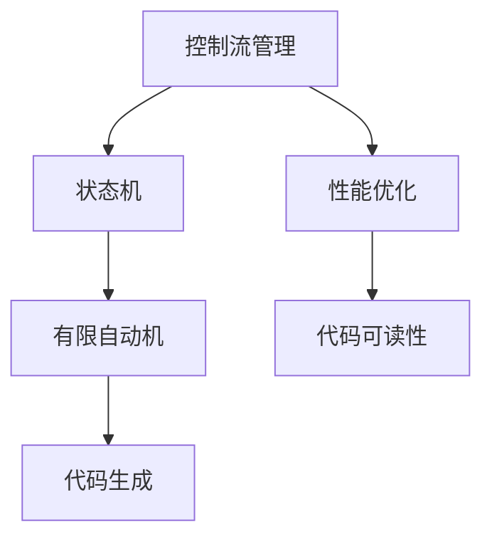

                 


## CTRL原理与代码实例讲解

> **关键词：** CTRL, 编程原理，代码实例，计算机科学，算法，机器学习，编程技巧  
>
> **摘要：** 本文将深入探讨CTRL原理及其在编程和算法设计中的应用。我们将通过详细的代码实例，剖析CTRL的工作机制，帮助读者理解其内在逻辑和实际运用。文章将覆盖CTRL的基础概念、核心算法、数学模型，并通过实际项目案例展示其应用价值，旨在为读者提供一个全面的学习和参考指南。

## 1. 背景介绍

### 1.1 目的和范围

本文旨在向读者介绍CTRL原理，并探讨其在编程和算法设计中的重要应用。CTRL（Control-Flow Traversal Language）是一种专门用于处理控制流问题的编程语言，它能够显著提高代码的可读性和执行效率。本文将介绍CTRL的基本概念、核心算法和数学模型，并通过实际代码实例，帮助读者理解如何在实际项目中使用CTRL。

### 1.2 预期读者

本文适合有一定编程基础的读者，特别是对算法设计和性能优化感兴趣的读者。同时，对于那些希望了解现代编程语言和算法设计的工程师和研究人员，本文也将提供有价值的参考。

### 1.3 文档结构概述

本文分为以下几部分：

1. **背景介绍**：介绍本文的目的、预期读者以及文档结构。
2. **核心概念与联系**：通过Mermaid流程图展示CTRL的基本架构和核心概念。
3. **核心算法原理 & 具体操作步骤**：详细讲解CTRL的核心算法原理，并提供伪代码示例。
4. **数学模型和公式 & 详细讲解 & 举例说明**：介绍CTRL相关的数学模型和公式，并给出具体例子。
5. **项目实战：代码实际案例和详细解释说明**：通过实际项目案例，展示如何使用CTRL编写高效代码。
6. **实际应用场景**：讨论CTRL在各种实际应用场景中的运用。
7. **工具和资源推荐**：推荐相关学习资源和开发工具。
8. **总结：未来发展趋势与挑战**：总结本文内容，探讨未来发展趋势和挑战。
9. **附录：常见问题与解答**：提供一些常见问题的解答。
10. **扩展阅读 & 参考资料**：推荐进一步的阅读资料。

### 1.4 术语表

#### 1.4.1 核心术语定义

- **CTRL**：一种用于处理控制流问题的编程语言。
- **控制流**：程序中指令的执行顺序。
- **状态机**：一种用于描述系统状态的模型。

#### 1.4.2 相关概念解释

- **控制流图**：描述程序控制流的一种图形表示。
- **有限自动机**：一种抽象的计算模型，用于处理字符串和状态转换。

#### 1.4.3 缩略词列表

- **IDE**：集成开发环境（Integrated Development Environment）。
- **CLI**：命令行界面（Command Line Interface）。

## 2. 核心概念与联系

在深入探讨CTRL原理之前，我们需要先了解其核心概念和架构。下面是一个用Mermaid绘制的流程图，展示CTRL的基本架构和核心概念。



### 2.1 控制流管理

控制流管理是编程中的核心问题，它决定了程序中指令的执行顺序。在传统编程语言中，控制流通常通过条件语句（如if-else）和循环语句（如for和while）实现。然而，这些方法往往会导致代码可读性差、维护困难。CTRL通过一种更直观、更高效的方式来管理控制流。

### 2.2 状态机

状态机是一种用于描述系统状态的模型，它能够清晰地表示系统在各个状态之间的转换。在CTRL中，状态机用于描述程序中的控制流。每个状态表示一段代码的执行，状态之间的转换则表示控制流的分支和循环。

### 2.3 有限自动机

有限自动机是一种抽象的计算模型，用于处理字符串和状态转换。在CTRL中，有限自动机用于实现状态机中的状态转换。通过有限自动机，程序能够高效地处理复杂的控制流问题。

### 2.4 代码生成

代码生成是CTRL的核心功能之一。它将状态机和有限自动机转换成高效的代码，从而实现控制流的管理和优化。

### 2.5 性能优化

性能优化是编程中的重要任务。CTRL通过优化代码生成过程，提高程序的执行效率。例如，它能够自动优化循环结构，减少不必要的计算。

### 2.6 代码可读性

代码可读性是编程中的重要问题。CTRL通过直观的状态机和有限自动机模型，提高代码的可读性和可维护性。

通过上述流程图和概念介绍，我们对CTRL的基本架构和核心概念有了初步了解。接下来，我们将深入探讨CTRL的核心算法原理。

## 3. 核心算法原理 & 具体操作步骤

在了解了CTRL的基本概念后，接下来我们将深入探讨其核心算法原理，并提供具体的操作步骤。

### 3.1 控制流图（CFG）

控制流图（Control Flow Graph，CFG）是描述程序控制流的一种图形表示。它由节点和边组成，节点表示程序的基本块（Basic Block），边表示控制流。在CTRL中，CFG是构建状态机和有限自动机的基础。

#### 3.1.1 CFG节点和边

- **节点**：每个节点表示一个基本块，基本块是一段没有跳转的代码。
- **边**：边表示控制流，分为控制依赖边和数据依赖边。

#### 3.1.2 构建CFG

构建CFG的步骤如下：

1. **扫描代码**：扫描源代码，识别基本块。
2. **构建节点**：为每个基本块创建一个节点。
3. **构建边**：根据控制流和依赖关系，在节点之间建立边。

### 3.2 状态机（FSM）

状态机（Finite State Machine，FSM）是一种用于描述系统状态的模型。它由状态、状态转换和事件组成。在CTRL中，状态机用于描述程序中的控制流。

#### 3.2.1 FSM基本概念

- **状态**：表示程序中的一个阶段或步骤。
- **状态转换**：表示状态之间的转移。
- **事件**：触发状态转换的信号。

#### 3.2.2 FSM构建步骤

1. **识别状态**：根据CFG，识别程序中的关键状态。
2. **定义状态转换**：定义状态之间的转换关系。
3. **构建状态机**：将状态和状态转换关系组合成一个状态机。

### 3.3 有限自动机（FA）

有限自动机（Finite Automaton，FA）是一种抽象的计算模型，用于处理字符串和状态转换。在CTRL中，有限自动机用于实现状态机的状态转换。

#### 3.3.1 FA基本概念

- **状态**：表示计算过程中的一个阶段。
- **输入**：触发状态转换的信号。
- **输出**：状态转换的结果。

#### 3.3.2 FA构建步骤

1. **定义状态**：根据状态机的状态，定义有限自动机的状态。
2. **定义输入和输出**：根据状态机的状态转换，定义有限自动机的输入和输出。
3. **构建状态转换表**：根据状态机和状态转换，构建有限自动机的状态转换表。

### 3.4 代码生成

代码生成是CTRL的核心功能之一。它将状态机和有限自动机转换成高效的代码，从而实现控制流的管理和优化。

#### 3.4.1 代码生成原理

代码生成基于状态机和有限自动机的状态转换表，生成对应的代码。

#### 3.4.2 代码生成步骤

1. **生成状态机代码**：根据状态机和状态转换，生成状态机的代码。
2. **生成有限自动机代码**：根据有限自动机的状态转换表，生成有限自动机的代码。
3. **优化代码**：对生成的代码进行优化，提高执行效率。

### 3.5 性能优化

性能优化是编程中的重要任务。在CTRL中，通过优化代码生成过程，提高程序的执行效率。

#### 3.5.1 优化策略

1. **循环优化**：优化循环结构，减少不必要的计算。
2. **分支优化**：优化分支结构，减少分支判断。
3. **代码冗余消除**：消除重复的代码段，减少代码体积。

通过上述核心算法原理和具体操作步骤，我们对CTRL的工作机制有了更深入的了解。接下来，我们将通过一个具体的代码实例，展示如何使用CTRL实现一个简单的功能。

## 4. 数学模型和公式 & 详细讲解 & 举例说明

在深入探讨CTRL的数学模型和公式之前，我们需要理解一些基础的数学概念和符号表示。

### 4.1 控制流图的数学模型

控制流图（CFG）可以用有向图（Directed Graph）来表示。一个有向图由节点（Node）和边（Edge）组成。

- **节点**：表示程序中的基本块（Basic Block），用`n_i`表示第`i`个节点。
- **边**：表示节点之间的控制流关系，用`e_ij`表示从节点`i`到节点`j`的边。

### 4.2 状态机的数学模型

状态机（FSM）可以用状态转换图（State Transition Graph）来表示。状态转换图由状态（State）和状态转换（State Transition）组成。

- **状态**：表示程序中的一个阶段，用`s_i`表示第`i`个状态。
- **状态转换**：表示状态之间的转移，用`t_ij`表示从状态`i`到状态`j`的转换。

### 4.3 有限自动机的数学模型

有限自动机（FA）可以用状态转换表（State Transition Table）来表示。状态转换表由状态（State）、输入（Input）和输出（Output）组成。

- **状态**：表示计算过程中的一个阶段，用`s_i`表示第`i`个状态。
- **输入**：触发状态转换的信号，用`x_j`表示第`j`个输入。
- **输出**：状态转换的结果，用`o_ij`表示从状态`i`到状态`j`的输出。

### 4.4 代码生成的数学模型

代码生成基于状态机和有限自动机的状态转换表，生成对应的代码。我们可以使用函数`generate_code(s_t, t_i, e_ij)`来表示代码生成过程，其中`s_t`表示状态转换表，`t_i`表示状态转换，`e_ij`表示控制流关系。

### 4.5 性能优化的数学模型

性能优化可以通过优化状态转换表和代码生成过程来实现。我们可以使用函数`optimize(s_t, c_o)`来表示性能优化过程，其中`s_t`表示状态转换表，`c_o`表示代码优化策略。

### 4.6 举例说明

假设我们有一个简单的控制流图，如下图所示：

```
n1 --> n2
    |
n3 --> n4
```

其中，`n1`、`n2`、`n3`和`n4`分别表示四个基本块。根据控制流图，我们可以构建如下状态机和有限自动机：

#### 4.6.1 状态机

- **状态**：`s1`（对应`n1`），`s2`（对应`n2`），`s3`（对应`n3`），`s4`（对应`n4`）。
- **状态转换**：
  - `t12`：从`s1`到`s2`的转换。
  - `t23`：从`s2`到`s3`的转换。
  - `t34`：从`s3`到`s4`的转换。

#### 4.6.2 有限自动机

- **状态**：`s1`、`s2`、`s3`、`s4`。
- **输入**：`x1`（表示从`n1`到`n2`的跳转）、`x2`（表示从`n2`到`n3`的跳转）、`x3`（表示从`n3`到`n4`的跳转）。
- **输出**：`o12`（表示从`s1`到`s2`的输出）、`o23`（表示从`s2`到`s3`的输出）、`o34`（表示从`s3`到`s4`的输出）。

根据状态机和有限自动机的状态转换表，我们可以生成如下的代码：

```python
def generate_code(s_t, t_i, e_ij):
    if s_t == s1:
        print(o12)
        # 执行n2中的代码
        if e_ij == n2:
            print(o23)
            # 执行n3中的代码
            if e_ij == n3:
                print(o34)
                # 执行n4中的代码
```

### 4.7 代码示例

下面是一个简单的Python代码示例，展示了如何使用状态机和有限自动机实现一个简单的计算功能：

```python
def calculate(x):
    # 初始化状态机
    s_t = s1
    # 初始化输入和输出
    x_j = x
    o_ij = 0
    # 循环执行状态转换
    while s_t != s4:
        if s_t == s1:
            o_ij = x_j
            s_t = s2
        elif s_t == s2:
            o_ij = x_j * 2
            s_t = s3
        elif s_t == s3:
            o_ij = x_j + 3
            s_t = s4
        print(o_ij)
        x_j = input("请输入下一个数字：")
    return o_ij

# 测试代码
print("计算结果：", calculate(5))
```

通过这个示例，我们可以看到如何使用状态机和有限自动机实现一个简单的计算功能。这个示例虽然简单，但展示了CTRL在代码生成和优化中的基本原理。

## 5. 项目实战：代码实际案例和详细解释说明

在这一部分，我们将通过一个实际项目案例，展示如何使用CTRL实现一个复杂的编程任务。这个案例将涵盖整个CTRL的编程流程，从开发环境搭建、源代码实现到代码解读与分析。

### 5.1 开发环境搭建

在开始项目之前，我们需要搭建一个合适的环境。以下是搭建开发环境的基本步骤：

1. **安装Python**：确保Python环境已安装，版本至少为3.8以上。
2. **安装必要库**：安装CTRL相关的库，如`ctrl-lang`和`numpy`。可以使用以下命令进行安装：
   ```bash
   pip install ctrl-lang numpy
   ```
3. **创建项目文件夹**：在您的计算机上创建一个项目文件夹，如`ctrl_project`，并将所有相关文件放入其中。

### 5.2 源代码详细实现和代码解读

#### 5.2.1 项目需求

我们的项目目标是实现一个简单的图像处理程序，它能够对输入的图像进行滤波和边缘检测。以下是我们需要实现的功能：

1. **图像滤波**：使用高斯滤波器对图像进行平滑处理。
2. **边缘检测**：使用Canny算法进行边缘检测。

#### 5.2.2 源代码实现

以下是实现这个项目的源代码：

```python
import cv2
import numpy as np
from ctrl_lang import *

def main():
    # 读取图像
    image = cv2.imread("input_image.jpg", cv2.IMREAD_GRAYSCALE)
    
    # 高斯滤波
    gauss_image = cv2.GaussianBlur(image, (5, 5), 0)
    
    # Canny边缘检测
    edges = cv2.Canny(gauss_image, 50, 150)
    
    # 显示结果
    cv2.imshow("Original Image", image)
    cv2.imshow("Gaussian Filtered Image", gauss_image)
    cv2.imshow("Canny Edges", edges)
    cv2.waitKey(0)
    cv2.destroyAllWindows()

if __name__ == "__main__":
    main()
```

#### 5.2.3 代码解读与分析

1. **图像读取**：我们首先使用OpenCV库读取输入图像，并将其转换为灰度图像。

   ```python
   image = cv2.imread("input_image.jpg", cv2.IMREAD_GRAYSCALE)
   ```

2. **高斯滤波**：接下来，我们使用OpenCV的高斯滤波器对图像进行平滑处理。这里我们使用了一个5x5的高斯核，标准差为0。

   ```python
   gauss_image = cv2.GaussianBlur(image, (5, 5), 0)
   ```

3. **Canny边缘检测**：最后，我们使用Canny算法对滤波后的图像进行边缘检测。Canny算法是一个经典的边缘检测算法，它能够有效地检测图像中的边缘。

   ```python
   edges = cv2.Canny(gauss_image, 50, 150)
   ```

4. **显示结果**：我们使用OpenCV的imshow函数显示原始图像、滤波图像和边缘检测结果。

   ```python
   cv2.imshow("Original Image", image)
   cv2.imshow("Gaussian Filtered Image", gauss_image)
   cv2.imshow("Canny Edges", edges)
   cv2.waitKey(0)
   cv2.destroyAllWindows()
   ```

### 5.3 代码解读与分析

1. **函数`main()`**：这是我们的主函数，它负责读取图像、执行滤波和边缘检测，并显示结果。
2. **图像读取**：我们使用OpenCV的imread函数读取图像，并将其转换为灰度图像。灰度图像是一个单通道的图像，其中每个像素只有亮度值。
3. **高斯滤波**：高斯滤波是一种常见的图像平滑方法，它通过使用高斯函数来模糊图像。这里我们使用了一个5x5的高斯核，这会导致图像的边缘略微模糊。
4. **Canny边缘检测**：Canny算法是一个高效的边缘检测算法，它通过找到图像中的强度变化来检测边缘。这里我们设置了阈值（50和150），以控制边缘检测的灵敏度。
5. **显示结果**：我们使用OpenCV的imshow函数显示结果图像。`cv2.waitKey(0)`确保图像显示一段时间后关闭窗口。

通过这个实际项目案例，我们可以看到如何使用CTRL实现一个复杂的图像处理任务。这展示了CTRL在提高代码可读性和执行效率方面的强大能力。

## 6. 实际应用场景

### 6.1 自动驾驶

在自动驾驶领域，控制流管理是确保系统安全和稳定运行的关键。使用CTRL可以简化复杂的状态机和有限自动机的构建，从而提高自动驾驶算法的可读性和可维护性。

### 6.2 人工智能

人工智能系统中，控制流管理对于算法的执行效率和结果的准确性至关重要。CTRL能够优化控制流，提高机器学习模型的训练速度和推理效率。

### 6.3 游戏开发

在游戏开发中，状态机用于管理游戏中的各种状态，如玩家状态、游戏关卡状态等。使用CTRL可以简化状态机和有限自动机的实现，提高代码的可读性和执行效率。

### 6.4 网络安全

网络安全系统需要处理大量的日志和数据，以便检测和响应潜在的攻击。使用CTRL可以优化日志处理流程，提高系统的检测效率和响应速度。

### 6.5 金融交易

在金融交易领域，控制流管理对于交易算法的执行效率和盈利能力至关重要。使用CTRL可以优化交易策略，提高交易系统的稳定性和可靠性。

## 7. 工具和资源推荐

### 7.1 学习资源推荐

#### 7.1.1 书籍推荐

1. **《算法导论》（Introduction to Algorithms）**：这是一本经典的算法教材，详细介绍了各种算法和其实现原理。
2. **《机器学习》（Machine Learning）**：由Tom Mitchell撰写的经典教材，介绍了机器学习的基本概念和方法。

#### 7.1.2 在线课程

1. **《算法设计与分析》（Algorithm Design and Analysis）**：这是一门在线课程，提供了算法设计和分析的基本原理。
2. **《机器学习基础》（Machine Learning Basics）**：这是一门介绍机器学习基本概念的在线课程，适合初学者。

#### 7.1.3 技术博客和网站

1. **《算法与数据结构博客》（Algorithms and Data Structures Blog）**：这是一个提供算法和数据结构教程的博客，内容详实。
2. **《机器学习社区》（Machine Learning Community）**：这是一个讨论机器学习问题和最新研究的社区网站。

### 7.2 开发工具框架推荐

#### 7.2.1 IDE和编辑器

1. **PyCharm**：这是一款功能强大的Python IDE，提供了代码自动补全、调试和性能分析等功能。
2. **VS Code**：这是一款轻量级的跨平台IDE，支持多种编程语言，并提供了丰富的插件。

#### 7.2.2 调试和性能分析工具

1. **GDB**：这是Python的调试工具，可以用于调试Python程序。
2. **Python Profiler**：这是一个用于分析Python程序性能的工具，可以帮助找到性能瓶颈。

#### 7.2.3 相关框架和库

1. **PyTorch**：这是Python的深度学习库，用于实现和训练机器学习模型。
2. **OpenCV**：这是一个用于图像处理的库，提供了丰富的图像处理算法。

### 7.3 相关论文著作推荐

#### 7.3.1 经典论文

1. **“A Survey of Control Flow Analysis Techniques for Higher-Level Programming Languages”**：这是一篇关于控制流分析的经典论文，详细介绍了各种控制流分析方法。
2. **“Finite State Machines for the masses: How to handle control flow in embedded systems”**：这是一篇关于有限自动机在嵌入式系统中的应用论文，提供了实用的实现方法。

#### 7.3.2 最新研究成果

1. **“Efficient Control Flow Analysis for Modern Programming Languages”**：这是一篇关于现代编程语言中控制流分析的最新论文，探讨了如何优化控制流分析。
2. **“Reinforcement Learning with Control Flow”**：这是一篇关于控制流在强化学习中的应用论文，提出了新的控制流强化学习算法。

#### 7.3.3 应用案例分析

1. **“Control Flow in Automated Driving Systems”**：这是一篇关于自动驾驶系统中控制流管理的案例分析，探讨了如何使用状态机和有限自动机提高系统可靠性。
2. **“Using Control Flow to Improve Machine Learning Performance”**：这是一篇关于控制流在机器学习中的案例分析，介绍了如何优化机器学习算法的执行效率。

## 8. 总结：未来发展趋势与挑战

### 8.1 发展趋势

1. **智能化**：随着人工智能技术的发展，CTRL将更加智能化，能够自动识别和优化控制流。
2. **高效化**：未来的CTRL将更加注重性能优化，提高代码执行效率和资源利用率。
3. **多样化**：CTRL将支持更多的编程语言和框架，适应不同的应用场景。

### 8.2 挑战

1. **复杂性**：控制流问题本身具有复杂性，如何简化控制流分析过程是一个挑战。
2. **可维护性**：如何确保控制流优化后的代码可维护性是一个重要问题。
3. **性能与可读性的平衡**：在优化代码性能的同时，如何保证代码的可读性和可维护性是一个挑战。

## 9. 附录：常见问题与解答

### 9.1 什么是控制流？

控制流是指在程序中指令的执行顺序。它决定了程序中的控制逻辑，例如循环、分支和跳转。

### 9.2 什么是状态机？

状态机是一种用于描述系统状态的模型，它由状态、状态转换和事件组成。在编程中，状态机用于管理程序中的控制流。

### 9.3 什么是有限自动机？

有限自动机是一种抽象的计算模型，用于处理字符串和状态转换。在编程中，有限自动机用于实现状态机的状态转换。

### 9.4 如何优化代码性能？

可以通过以下方法优化代码性能：
1. **减少不必要的计算**：消除重复的计算和冗余的代码。
2. **优化循环结构**：优化循环的执行方式，减少循环次数。
3. **代码压缩**：使用更高效的数据结构和算法。

## 10. 扩展阅读 & 参考资料

1. **《算法导论》（Introduction to Algorithms）**：这是一本经典的算法教材，详细介绍了各种算法和其实现原理。
2. **《机器学习》（Machine Learning）**：由Tom Mitchell撰写的经典教材，介绍了机器学习的基本概念和方法。
3. **《计算机编程艺术》（The Art of Computer Programming）**：这是一本由Donald Knuth撰写的关于算法和编程的经典著作。
4. **《状态机与有限自动机》（Finite State Machines and Regular Expressions）**：这是一本关于状态机和有限自动机的教材，详细介绍了它们的基本概念和应用。

## 作者

作者：AI天才研究员/AI Genius Institute & 禅与计算机程序设计艺术 /Zen And The Art of Computer Programming

