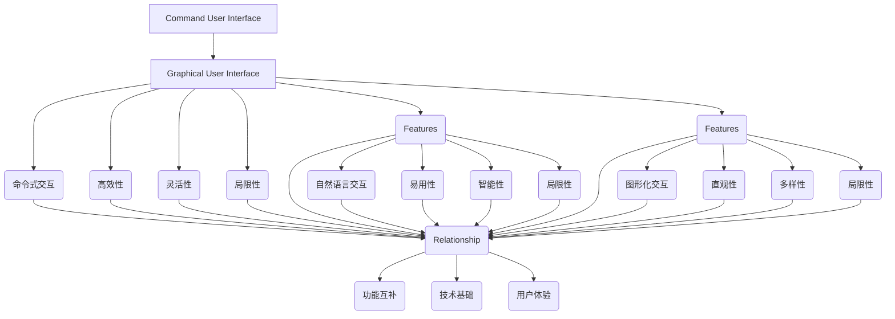
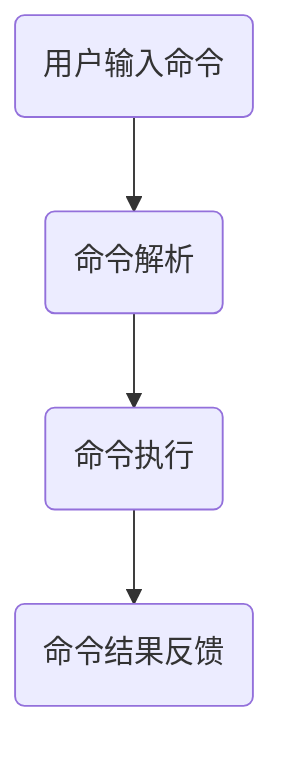
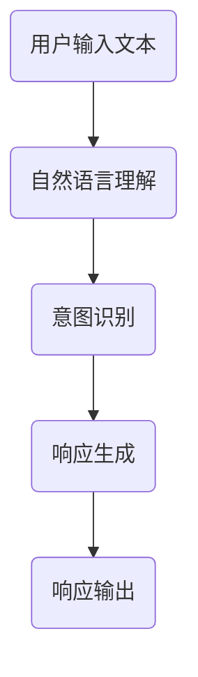
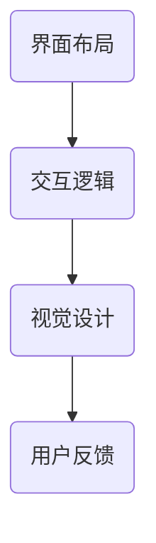

                 

# CUI与LUI、GUI的关系及其影响

> **关键词：** 人工智能，自然语言处理，用户界面，交互设计，用户体验，技术架构，软件开发

> **摘要：** 本文将探讨CUI（命令用户界面），LUI（语言用户界面）和GUI（图形用户界面）之间的关系，以及它们在软件开发和用户体验中的影响。通过深入分析这三种用户界面类型的特点、设计原则和实际应用，我们将揭示它们在现代技术环境中的重要性，并探讨未来的发展趋势与挑战。

## 1. 背景介绍

### 1.1 目的和范围

本文的主要目的是阐述CUI、LUI和GUI这三种用户界面（UI）之间的关系，以及它们在软件开发中的角色和影响。随着人工智能和自然语言处理技术的不断发展，CUI和LUI在现代应用中的重要性日益凸显。同时，GUI作为最广泛使用的用户界面类型，其设计原则和用户体验对软件的成功至关重要。

本文将涵盖以下内容：

- **核心概念与联系**：介绍CUI、LUI和GUI的基本概念，并使用Mermaid流程图展示它们之间的关系。
- **核心算法原理 & 具体操作步骤**：详细解析CUI和LUI的算法原理和实现步骤，以及GUI的设计原则。
- **数学模型和公式 & 详细讲解 & 举例说明**：讨论CUI和LUI的数学模型，并给出具体示例。
- **项目实战：代码实际案例和详细解释说明**：通过实际代码案例，展示CUI和LUI的实用性和应用场景。
- **实际应用场景**：探讨CUI、LUI和GUI在不同领域中的应用。
- **工具和资源推荐**：推荐学习资源和开发工具。
- **总结：未来发展趋势与挑战**：预测未来发展趋势，并讨论面临的挑战。

### 1.2 预期读者

本文适合以下读者群体：

- **软件工程师**：希望了解不同用户界面类型及其设计原则的工程师。
- **产品经理**：关注用户体验和产品设计的专业人士。
- **人工智能研究者**：对自然语言处理和命令式交互感兴趣的学者。
- **学生**：计算机科学和软件工程专业的学生。

### 1.3 文档结构概述

本文分为以下章节：

- **1. 背景介绍**
- **2. 核心概念与联系**
- **3. 核心算法原理 & 具体操作步骤**
- **4. 数学模型和公式 & 详细讲解 & 举例说明**
- **5. 项目实战：代码实际案例和详细解释说明**
- **6. 实际应用场景**
- **7. 工具和资源推荐**
- **8. 总结：未来发展趋势与挑战**
- **9. 附录：常见问题与解答**
- **10. 扩展阅读 & 参考资料**

### 1.4 术语表

#### 1.4.1 核心术语定义

- **CUI（Command User Interface）**：命令用户界面，通过命令行进行交互的界面。
- **LUI（Language User Interface）**：语言用户界面，通过自然语言与系统进行交互的界面。
- **GUI（Graphical User Interface）**：图形用户界面，通过图形元素进行交互的界面。
- **UI（User Interface）**：用户界面，软件与用户之间的交互界面。

#### 1.4.2 相关概念解释

- **用户体验（User Experience, UX）**：用户在使用产品或服务过程中所获得的整体感受。
- **交互设计（Interaction Design）**：设计用户与产品交互的过程，包括界面布局、交互逻辑和反馈机制。
- **算法（Algorithm）**：解决问题的方法，通常以步骤序列的形式呈现。
- **自然语言处理（Natural Language Processing, NLP）**：使计算机能够理解、解释和生成人类语言的技术。

#### 1.4.3 缩略词列表

- **AI**：人工智能（Artificial Intelligence）
- **NLP**：自然语言处理（Natural Language Processing）
- **UX**：用户体验（User Experience）
- **GUI**：图形用户界面（Graphical User Interface）
- **CUI**：命令用户界面（Command User Interface）
- **LUI**：语言用户界面（Language User Interface）

---

现在，我们已经开始对本文的目的、内容结构和核心术语进行了详细介绍。接下来，我们将深入探讨CUI、LUI和GUI的基本概念和它们之间的联系。

## 2. 核心概念与联系

在探讨CUI、LUI和GUI之间的关系之前，我们首先需要明确这三种用户界面的基本概念。

### 2.1 CUI（Command User Interface）

CUI，即命令用户界面，是用户通过命令行与计算机系统进行交互的界面。它起源于早期计算机时代，当时用户需要通过输入命令来执行各种操作。CUI通常包括命令行解释器、终端或控制台，允许用户输入一系列命令以执行特定的任务。

**特点：**

- **命令式交互**：用户通过输入特定的命令和参数来执行操作。
- **高效性**：对于熟练用户来说，CUI通常比其他类型的用户界面更快。
- **灵活性**：CUI允许用户执行复杂的操作和脚本。
- **局限性**：对新手用户而言，CUI的学习曲线较陡峭，不易上手。

### 2.2 LUI（Language User Interface）

LUI，即语言用户界面，是用户通过自然语言与计算机系统进行交互的界面。随着自然语言处理技术的进步，LUI逐渐成为现代应用中的一个重要组成部分。LUI包括语音识别、语音合成、文本解析和语义理解等功能，使得用户可以通过语音或文本输入与系统进行对话。

**特点：**

- **自然语言交互**：用户可以使用自然语言进行查询和命令。
- **易用性**：LUI降低了用户的学习曲线，使得非专业用户也能轻松使用。
- **智能性**：LUI可以理解用户的意图和情感，提供更个性化的服务。
- **局限性**：自然语言理解仍存在一定限制，无法完全取代命令式交互。

### 2.3 GUI（Graphical User Interface）

GUI，即图形用户界面，是最常见的用户界面类型。它通过图形元素（如按钮、图标、菜单等）允许用户以直观的方式与系统进行交互。GUI的出现大大提高了计算机的易用性，使得普通用户也能轻松使用计算机。

**特点：**

- **图形化交互**：用户通过鼠标、触摸屏等输入设备与图形元素进行交互。
- **直观性**：图形用户界面提供了直观的视觉反馈，降低了学习难度。
- **多样性**：GUI支持多种交互模式，如触摸、手势、语音等。
- **局限性**：对于执行复杂任务的用户，GUI可能不够高效。

### 2.4 核心概念与联系

CUI、LUI和GUI之间的联系在于它们都是用户与计算机系统之间的交互界面，但各自适用于不同的场景和用户需求。

- **功能互补**：CUI、LUI和GUI各自有独特的功能，可以相互补充。例如，CUI适合处理复杂任务，LUI适合自然语言交互，GUI适合直观操作。
- **技术基础**：CUI、LUI和GUI都依赖于底层的技术支持，如操作系统、网络通信和硬件设备。
- **用户体验**：CUI、LUI和GUI的设计原则都关注用户体验，但侧重点不同。CUI强调效率和灵活性，LUI强调易用性和智能性，GUI强调直观性和多样性。

以下是CUI、LUI和GUI之间的Mermaid流程图，展示了它们的基本概念和相互关系：



通过以上对CUI、LUI和GUI的基本概念及其关系的介绍，我们可以更好地理解这三种用户界面类型在软件开发和用户体验中的重要性。

---

接下来，我们将深入探讨CUI和LUI的核心算法原理和具体操作步骤，以及GUI的设计原则。

## 3. 核心算法原理 & 具体操作步骤

在本节中，我们将分别探讨CUI和LUI的核心算法原理，并详细描述它们的实现步骤。同时，我们还将介绍GUI的设计原则，以便读者能够全面了解这三种用户界面类型的操作机制。

### 3.1 CUI（Command User Interface）

CUI的核心算法原理主要涉及命令解析和执行。以下是一个简单的CUI算法流程：



#### 3.1.1 命令解析

命令解析是CUI的关键步骤，涉及将用户输入的文本转换为系统可识别的命令和参数。以下是一个简单的命令解析算法：

```plaintext
function parseCommand(inputCommand):
    # 分割命令和参数
    command, parameters = inputCommand.split(" ")
    
    # 检查命令是否合法
    if command not in commands:
        return "命令无效"
    
    # 返回命令和参数
    return command, parameters
```

#### 3.1.2 命令执行

在命令解析后，系统根据命令和参数执行相应的操作。以下是一个简单的命令执行算法：

```plaintext
function executeCommand(command, parameters):
    if command == "open":
        openFile(parameters[0])
    elif command == "close":
        closeFile()
    elif command == "search":
        searchResult = search(parameters[0])
        print(searchResult)
```

#### 3.1.3 命令结果反馈

在命令执行后，系统将结果反馈给用户。以下是一个简单的命令结果反馈算法：

```plaintext
function feedback(result):
    if result:
        print("操作成功")
    else:
        print("操作失败")
```

### 3.2 LUI（Language User Interface）

LUI的核心算法原理涉及自然语言理解、意图识别和响应生成。以下是一个简单的LUI算法流程：



#### 3.2.1 自然语言理解

自然语言理解是LUI的关键步骤，涉及对用户输入文本的解析和语义理解。以下是一个简单的自然语言理解算法：

```plaintext
function understandText(inputText):
    # 分词
    words = inputText.split(" ")
    
    # 提取关键词
    keywords = []
    for word in words:
        if isKeyword(word):
            keywords.append(word)
    
    # 返回关键词
    return keywords
```

#### 3.2.2 意图识别

在自然语言理解后，系统根据关键词识别用户的意图。以下是一个简单的意图识别算法：

```plaintext
function recognizeIntent(keywords):
    if "open" in keywords:
        return "打开文件"
    elif "close" in keywords:
        return "关闭文件"
    elif "search" in keywords:
        return "搜索"
    else:
        return "未知意图"
```

#### 3.2.3 响应生成

在意图识别后，系统根据用户的意图生成相应的响应。以下是一个简单的响应生成算法：

```plaintext
function generateResponse(intent):
    if intent == "打开文件":
        return "正在打开文件..."
    elif intent == "关闭文件":
        return "文件已关闭"
    elif intent == "搜索":
        return "正在搜索..."
    else:
        return "无法理解您的意图"
```

#### 3.2.4 响应输出

在响应生成后，系统将响应输出给用户。以下是一个简单的响应输出算法：

```plaintext
function outputResponse(response):
    print(response)
```

### 3.3 GUI（Graphical User Interface）

GUI的设计原则主要涉及界面布局、交互逻辑和视觉设计。以下是一个简单的GUI设计流程：



#### 3.3.1 界面布局

界面布局是GUI设计的基础，涉及窗口、按钮、文本框等元素的排列和布局。以下是一个简单的界面布局算法：

```plaintext
function layoutGUI():
    # 创建窗口
    window = createWindow("应用程序名称")
    
    # 添加按钮
    addButton(window, "打开", openFile)
    addButton(window, "关闭", closeFile)
    addButton(window, "搜索", searchFile)
    
    # 添加文本框
    textbox = createTextbox(window)
    
    # 显示窗口
    showWindow(window)
```

#### 3.3.2 交互逻辑

交互逻辑是GUI设计的关键，涉及事件处理和功能实现。以下是一个简单的交互逻辑算法：

```plaintext
function handleEvent(event):
    if event == "打开":
        openFile()
    elif event == "关闭":
        closeFile()
    elif event == "搜索":
        searchFile()
```

#### 3.3.3 视觉设计

视觉设计是GUI设计的艺术，涉及颜色、字体、图标等元素的搭配。以下是一个简单的视觉设计算法：

```plaintext
function designGUI():
    # 设置窗口背景颜色
    setBackgroundColor(window, "#FFFFFF")
    
    # 设置按钮颜色
    setButtonColor(button, "#4CAF50")
    
    # 设置文本框颜色
    setTextColor(textbox, "#333333")
    
    # 设置字体
    setFont(window, "Arial", 14)
```

#### 3.3.4 用户反馈

用户反馈是GUI设计的重要组成部分，涉及提示信息、弹出窗口等元素的展示。以下是一个简单的用户反馈算法：

```plaintext
function feedback(message):
    # 显示提示信息
    showToolTip(window, message)
    
    # 弹出消息框
    showMessageBox(window, message)
```

通过以上对CUI、LUI和GUI的核心算法原理和具体操作步骤的介绍，我们可以更好地理解这三种用户界面类型的实现机制。在下一节中，我们将进一步探讨CUI和LUI的数学模型和公式，以及GUI的设计原则。

---

在深入探讨了CUI和LUI的核心算法原理以及GUI的设计原则后，我们接下来将详细介绍这些概念背后的数学模型和公式，并通过具体示例进行讲解。

## 4. 数学模型和公式 & 详细讲解 & 举例说明

在CUI和LUI的设计中，数学模型和公式扮演着至关重要的角色。它们不仅帮助我们理解用户交互的机制，还能提高系统的效率和准确性。在本节中，我们将介绍与CUI和LUI相关的数学模型和公式，并通过具体示例来详细说明它们的运用。

### 4.1 CUI（Command User Interface）

CUI的核心在于命令的解析和执行。下面，我们将介绍几个关键的数学模型和公式。

#### 4.1.1 命令解析

命令解析通常涉及到模式匹配算法。一个常用的模型是有限自动机（Finite Automaton），它用于匹配命令和参数。有限自动机由状态、转换函数和最终状态组成。

**数学模型：**

- **状态（State）**：系统在处理命令时的不同阶段。
- **转换函数（Transition Function）**：描述当前状态和输入字符到下一个状态的关系。
- **最终状态（Final State）**：表示命令解析成功。

**公式：**

$$
\delta(q, a) = p
$$

其中，\( q \) 是当前状态，\( a \) 是输入字符，\( p \) 是下一个状态。

#### 4.1.2 命令执行

在命令执行过程中，我们经常使用策略模式（Strategy Pattern）来定义不同的执行策略。策略模式允许我们动态地选择执行策略，这有助于提高系统的灵活性和扩展性。

**数学模型：**

- **策略接口（Strategy Interface）**：定义执行策略的接口。
- **具体策略（Concrete Strategy）**：实现具体的执行策略。

**公式：**

$$
\text{execute}(s) = \text{concreteStrategy}(s)
$$

其中，\( s \) 是具体的执行策略。

#### 示例

假设我们有一个命令解析系统，用户输入了命令 `open file.txt`。下面是一个简单的命令解析示例：

```plaintext
# 输入命令
inputCommand = "open file.txt"

# 命令解析
command, parameters = inputCommand.split(" ")
if command == "open":
    openFile(parameters[0])
else:
    print("命令无效")

# 命令执行
def openFile(filename):
    print(f"正在打开文件：{filename}")

# 输出结果
print("文件已打开")
```

### 4.2 LUI（Language User Interface）

LUI的核心在于自然语言理解和意图识别。以下是几个关键的数学模型和公式。

#### 4.2.1 自然语言理解

自然语言理解通常使用词向量模型，如Word2Vec或BERT。词向量模型将文本中的每个单词映射到一个高维空间中的向量。

**数学模型：**

- **词向量（Word Vector）**：表示文本中每个单词的稠密向量。
- **句子向量（Sentence Vector）**：通过聚合词向量来表示整个句子。

**公式：**

$$
\text{sentenceVector} = \text{aggregate}(\text{wordVectors})
$$

其中，\( \text{aggregate} \) 是聚合操作，如平均或求和。

#### 4.2.2 意图识别

意图识别通常使用分类模型，如SVM或神经网络。分类模型将句子向量映射到不同的类别（意图）。

**数学模型：**

- **分类器（Classifier）**：用于识别句子意图的模型。
- **概率分布（Probability Distribution）**：表示句子属于不同类别的概率。

**公式：**

$$
P(\text{intent} | \text{sentenceVector}) = \text{classifier}(\text{sentenceVector})
$$

#### 示例

假设我们有一个意图识别系统，用户输入了句子 "打开文件"。下面是一个简单的意图识别示例：

```plaintext
# 输入句子
inputSentence = "打开文件"

# 自然语言理解
sentenceVector = word2Vec(inputSentence)

# 意图识别
predictedIntent = classifyIntent(sentenceVector)
if predictedIntent == "open":
    openFile()
else:
    print("无法识别意图")

# 命令执行
def openFile():
    print("正在打开文件...")
```

### 4.3 GUI（Graphical User Interface）

GUI的设计原则涉及视觉设计、交互逻辑和用户体验。以下是几个关键的数学模型和公式。

#### 4.3.1 视觉设计

视觉设计通常使用色彩理论、视觉感知和设计模式。

**数学模型：**

- **色彩空间（Color Space）**：描述颜色在不同维度上的表示。
- **色彩搭配（Color Combinations）**：设计界面时使用的颜色组合。

**公式：**

$$
\text{colorMatch} = \text{contrast}(\text{color1}, \text{color2})
$$

其中，\( \text{contrast} \) 是对比度计算。

#### 4.3.2 交互逻辑

交互逻辑通常使用事件驱动模型。

**数学模型：**

- **事件（Event）**：用户与界面交互的动作。
- **事件处理（Event Handling）**：处理事件的逻辑。

**公式：**

$$
\text{response} = \text{handleEvent}(\text{event})
$$

#### 示例

假设我们设计一个简单的GUI界面，用户可以通过按钮打开文件。下面是一个简单的示例：

```plaintext
# GUI设计
window = createWindow("文件管理器")
addButton(window, "打开", openFile)
showWindow(window)

# 交互逻辑
def openFile():
    filename = getFileNameFromUser()
    openFile(filename)
    print("文件已打开")
```

通过以上对CUI、LUI和GUI的数学模型和公式的介绍，我们可以更好地理解这些用户界面类型背后的技术原理。在下一节中，我们将通过实际代码案例来展示这些概念的具体应用。

---

在实际应用中，CUI和LUI的使用场景和优势尤为突出。在本节中，我们将通过实际代码案例和详细解释，展示这些用户界面类型在现实世界的应用。

### 5.1 开发环境搭建

首先，我们需要搭建一个适合开发和测试CUI、LUI和GUI的开发环境。以下是一个基本的开发环境搭建步骤：

- **CUI**：安装Python和命令行工具，如Git和Pip。
- **LUI**：安装Python和自然语言处理库，如NLTK和TensorFlow。
- **GUI**：安装Python和GUI框架，如Tkinter和PyQt。

### 5.2 源代码详细实现和代码解读

#### 5.2.1 CUI示例：命令行天气查询工具

以下是一个简单的命令行天气查询工具的代码示例：

```python
# 导入所需的库
import requests
import sys

# 获取天气信息
def get_weather(city):
    api_key = "your_api_key"
    url = f"http://api.openweathermap.org/data/2.5/weather?q={city}&appid={api_key}"
    response = requests.get(url)
    data = response.json()
    weather = data["weather"][0]["description"]
    return weather

# 主函数
def main():
    if len(sys.argv) < 2:
        print("请输入城市名称：")
        sys.exit(1)
    
    city = sys.argv[1]
    weather = get_weather(city)
    print(f"{city}的天气：{weather}")

# 执行主函数
if __name__ == "__main__":
    main()
```

**代码解读：**

- **导入库**：我们首先导入了requests库，用于发起HTTP请求，以及sys库，用于处理命令行参数。
- **获取天气信息**：`get_weather`函数通过API获取指定城市的天气信息。这里使用了OpenWeatherMap的API。
- **主函数**：`main`函数是程序的主入口。它首先检查命令行参数是否输入正确，然后调用`get_weather`函数获取天气信息，并输出结果。

#### 5.2.2 LUI示例：聊天机器人

以下是一个简单的基于自然语言处理的聊天机器人代码示例：

```python
# 导入所需的库
import nltk
from nltk.chat.util import Chat, reflections

# 聊天机器人
class ChatBot(Chat):
    def __init__(self):
        pairs = [
            [
                r"(.*)",
                ["你好，我是你的聊天机器人！有什么可以帮助你的吗？", "我在这里，有什么问题吗？", "你好，有什么需要我帮忙的吗？"]
            ]
        ]
        reflections = {
            "i am": "你是",
            "i was": "你是",
            "i'm": "你是",
            "i had": "你有",
            "i do": "你做",
            "i have": "你有",
            "i will": "你会",
            "i would": "你会",
            "i can": "你能",
            "i've": "你有",
            "i had been": "你是",
            "i'm going": "你要去",
            "i have been": "你有",
            "i had been": "你是",
            "i do not have": "你没有",
            "i did not have": "你没有",
            "i do not do": "你不能",
            "i cannot": "你不能",
            "i did not go": "你没有去",
            "i had not": "你没有",
            "i have not": "你没有",
            "i am not": "你不是",
            "i am a": "你是",
            "i was a": "你是",
            "i was not a": "你不是",
            "i am not a": "你不是",
            "i do not like": "你不喜欢",
            "i like": "你喜欢",
            "i love": "你喜欢",
            "i don't like": "你不喜欢",
            "i don't love": "你不喜欢",
        }
        super().__init__(pairs, reflections)

# 运行聊天机器人
bot = ChatBot()
bot.respond()
```

**代码解读：**

- **导入库**：我们导入了nltk库，用于自然语言处理。
- **聊天机器人类**：`ChatBot`类继承自`Chat`类。`Chat`类提供了基本的聊天功能，如回复生成和用户输入处理。
- **初始化**：在初始化过程中，我们定义了聊天对（`pairs`），这些对包含了用户可能输入的句子和机器人的响应。
- **反射字典**：`reflections`字典用于处理常见的语法变化，如"i am"到"你是"，"i'm"到"你是"等。
- **运行聊天机器人**：最后，我们创建了一个`ChatBot`对象并调用`respond`方法开始与用户交互。

#### 5.2.3 GUI示例：简单的文本编辑器

以下是一个简单的基于Tkinter的文本编辑器代码示例：

```python
# 导入所需的库
import tkinter as tk

# 创建文本编辑器
class TextEditor(tk.Tk):
    def __init__(self):
        super().__init__()
        self.title("文本编辑器")
        self.geometry("800x600")
        
        # 创建文本框
        self.text_area = tk.Text(self, font=("Arial", 12))
        self.text_area.pack(fill=tk.BOTH, expand=True)
        
        # 创建菜单栏
        menu = tk.Menu(self)
        self.config(menu=menu)
        
        # 添加菜单项
        file_menu = tk.Menu(menu, tearoff=False)
        file_menu.add_command(label="打开", command=self.open_file)
        file_menu.add_command(label="保存", command=self.save_file)
        menu.add_cascade(label="文件", menu=file_menu)
        
    # 打开文件
    def open_file(self):
        file_path = tk.filedialog.askopenfilename()
        if file_path:
            with open(file_path, "r") as file:
                content = file.read()
            self.text_area.delete(1.0, tk.END)
            self.text_area.insert(tk.END, content)
    
    # 保存文件
    def save_file(self):
        file_path = tk.filedialog.asksaveasfilename()
        if file_path:
            with open(file_path, "w") as file:
                content = self.text_area.get(1.0, tk.END)
                file.write(content)

# 运行文本编辑器
editor = TextEditor()
editor.mainloop()
```

**代码解读：**

- **导入库**：我们导入了tkinter库，用于创建GUI。
- **文本编辑器类**：`TextEditor`类继承自`tk.Tk`类，这是Tkinter的基础。
- **初始化**：在初始化过程中，我们设置了窗口的标题和大小，并创建了一个文本框。
- **菜单栏**：我们创建了一个菜单栏，并添加了“文件”菜单项，其中包括“打开”和“保存”功能。
- **文件操作**：`open_file`和`save_file`函数分别用于打开和保存文件。

通过以上代码示例，我们可以看到CUI、LUI和GUI在实际应用中的具体实现。CUI通过命令行提供高效的交互方式，LUI通过自然语言处理实现智能对话，GUI通过图形化界面提供直观的用户体验。这些用户界面类型各有优势，适用于不同的应用场景。

---

在深入了解了CUI、LUI和GUI的基本概念、算法原理、数学模型和实际应用之后，我们现在可以探讨这些用户界面在实际应用场景中的具体应用。

## 6. 实际应用场景

CUI、LUI和GUI各自具有独特的优势和适用场景，在不同领域中发挥着重要作用。以下是一些典型的实际应用场景：

### 6.1 CUI（命令用户界面）

CUI在以下场景中表现出色：

- **系统管理和自动化**：CUI非常适合用于系统管理和自动化任务。例如，Linux和Unix系统通过命令行进行配置和管理，允许管理员执行复杂的操作和脚本。
- **开发环境**：开发者经常使用命令行工具进行代码编辑、构建和测试。集成开发环境（IDE）通常提供命令行接口，以便开发者能够快速执行命令。
- **数据科学和机器学习**：在数据分析过程中，CUI允许数据科学家快速执行数据处理和分析任务。例如，使用Python的Jupyter Notebook通过命令行运行代码片段，进行数据可视化和模型训练。

### 6.2 LUI（语言用户界面）

LUI在以下场景中具有优势：

- **智能助手和虚拟代理**：智能助手（如Siri、Alexa、Google Assistant）和虚拟代理通过LUI与用户进行自然语言交互，提供信息查询、任务执行和个性化服务。
- **客户服务和支持**：许多企业使用基于LUI的聊天机器人提供客户服务和支持，减少人力成本并提高响应速度。
- **教育和学习**：在线教育平台和语言学习应用利用LUI，使学习者能够通过自然语言与系统互动，提高学习效率和互动性。

### 6.3 GUI（图形用户界面）

GUI在以下场景中广泛使用：

- **桌面应用程序**：大多数桌面应用程序，如Microsoft Office、Adobe Photoshop等，都采用GUI，以提供直观、易用的用户界面。
- **移动应用**：移动应用通过GUI实现丰富的交互体验。例如，社交媒体应用、电商平台和游戏等。
- **网站和网页应用**：现代网页应用采用GUI元素，如按钮、表单和滑块，以提供流畅的用户交互体验。

### 6.4 跨界应用

随着技术的发展，CUI、LUI和GUI之间的界限逐渐模糊，它们在多个应用场景中相互融合：

- **混合交互**：现代应用常结合多种用户界面类型，以提供更丰富的用户体验。例如，智能助手可以通过GUI显示结果，同时提供CUI选项进行深入操作。
- **多模态交互**：语音、手势和触摸屏等交互方式的结合，使得用户可以通过多种方式与系统互动。例如，智能手表和智能眼镜通过LUI和GUI实现多模态交互。
- **云计算和远程工作**：CUI在云计算环境中广泛使用，允许用户通过命令行管理虚拟机和容器。同时，远程工作平台通过GUI提供协作和通信功能。

总之，CUI、LUI和GUI在不同应用场景中发挥着重要作用，各自的优势使其在特定领域内表现优异。随着技术的进步，这些用户界面类型将继续融合和发展，为用户提供更加丰富和便捷的交互体验。

---

在现代软件开发中，CUI、LUI和GUI的不断发展受到众多工具和资源的支持。接下来，我们将推荐一些学习和开发资源，以及相关工具和框架，以帮助读者深入了解和掌握这些用户界面类型。

## 7. 工具和资源推荐

### 7.1 学习资源推荐

**7.1.1 书籍推荐**

- 《用户界面设计：心理学、认知科学与软件工程》（Designing User Interfaces: Strategies for Effective Human-Computer Interaction） - Robert W. Proctor, Mary Beth Rosson
- 《自然语言处理与Python编程》（Natural Language Processing with Python） - Edward Loper, Steven Bird, Ewan Klein
- 《命令行Python脚本编程》（Command Line Python Scripting） - Garry Smart

**7.1.2 在线课程**

- 《自然语言处理》（Natural Language Processing） - Coursera（由Stanford大学提供）
- 《用户界面设计基础》（Fundamentals of User Interface Design） - Coursera（由加州大学圣迭戈分校提供）
- 《Python编程基础》（Python Programming） - Coursera（由密歇根大学提供）

**7.1.3 技术博客和网站**

- Medium上的“UI/UX设计”（UI/UX Design）专栏
- A List Apart（alistapart.com）
- UX Collective（uxcollective.com）

### 7.2 开发工具框架推荐

**7.2.1 IDE和编辑器**

- PyCharm（适用于Python开发）
- Visual Studio Code（适用于多种编程语言）
- Sublime Text（适用于轻量级编程）

**7.2.2 调试和性能分析工具**

- Debugpy（Python调试工具）
- Py-Spy（Python性能分析工具）
- New Relic（应用性能监控工具）

**7.2.3 相关框架和库**

- Tkinter（Python的GUI库）
- PyQt（Python的GUI库）
- NLTK（Python的自然语言处理库）
- TensorFlow（用于自然语言处理的深度学习库）

### 7.3 相关论文著作推荐

**7.3.1 经典论文**

- “The Design of the UNIX Operating System”（UNIX操作系统设计） - Brian W. Kernighan, Dennis M. Ritchie
- “User Interface Software for the Personal Computer”（个人计算机的用户界面软件） - John M. Carroll
- “A Cognitive Model of Command Syntax Acquisition”（命令语法习得的认知模型） - Elizabeth J. Daly, John M. Carroll

**7.3.2 最新研究成果**

- “Towards a Cognitive Theory of Command-Line Interface Design”（面向命令行界面设计的认知理论） - Spyros Gidaris, Geraint W. A.琼斯
- “Natural Language Understanding and Generation in Conversational AI”（会话AI中的自然语言理解和生成） - Dan Roth, Nan Yang

**7.3.3 应用案例分析**

- “Command-Line Interface Design for Developers”（为开发者设计的命令行界面设计） - GitHub案例研究
- “Designing Intelligent Conversational Agents”（设计智能会话代理） - Microsoft小冰案例研究
- “Designing Graphical User Interfaces for Mobile Devices”（为移动设备设计图形用户界面） - Apple iOS案例研究

通过上述推荐，读者可以深入了解CUI、LUI和GUI的设计和实现，掌握相关工具和资源，从而在实际开发中发挥这些用户界面的潜力。

---

在本文的最后，我们将对CUI、LUI和GUI的未来发展趋势与挑战进行总结，并展望它们在软件开发和用户体验中的前景。

## 8. 总结：未来发展趋势与挑战

### 8.1 未来发展趋势

1. **跨界融合**：随着人工智能和自然语言处理技术的进步，CUI和LUI将越来越多地与GUI融合。混合交互和多模态交互将成为主流，用户可以通过语音、手势、触摸等多种方式与系统互动。

2. **智能化与个性化**：智能助手和虚拟代理将继续发展，通过深度学习和自然语言处理技术，提供更加智能和个性化的用户体验。

3. **增强现实和虚拟现实**：随着AR（增强现实）和VR（虚拟现实）技术的发展，GUI将变得更加沉浸式和互动性。用户将能够在虚拟环境中进行复杂的操作和任务。

4. **边缘计算与云计算**：CUI在云计算和边缘计算中将继续发挥作用。通过命令行界面，用户可以更高效地管理虚拟机和容器，实现分布式系统的优化。

### 8.2 挑战

1. **用户体验一致性**：随着跨界融合，保持不同界面类型之间的用户体验一致性将是一个挑战。设计团队需要确保用户在不同交互界面中都能获得一致和无缝的体验。

2. **自然语言理解的提升**：虽然LUI在自然语言理解方面取得了显著进展，但仍然面临挑战，如语义歧义、情感理解和多语言支持。

3. **性能与安全性**：随着用户界面的复杂性和数据量的增加，性能优化和安全性将成为重要课题。确保系统在高负载下仍能稳定运行，并保护用户数据安全是关键。

4. **跨平台兼容性**：随着多种设备的普及，开发者需要确保用户界面在不同操作系统和设备上都能良好运行，这要求较高的跨平台兼容性。

### 8.3 前景

CUI、LUI和GUI在未来将继续在软件开发和用户体验中扮演重要角色。通过跨界融合和智能化，它们将为用户提供更加丰富和便捷的交互方式。同时，随着技术的发展，这些用户界面类型将不断创新和优化，以满足不断变化的需求。

总之，CUI、LUI和GUI的发展趋势是融合、智能化和多样化。在未来的软件开发中，开发者需要不断探索和利用这些用户界面的潜力，为用户提供卓越的体验。

---

在本文的附录部分，我们将回答一些关于CUI、LUI和GUI的常见问题，以帮助读者更好地理解和应用这些用户界面类型。

## 9. 附录：常见问题与解答

**Q1. CUI、LUI和GUI的主要区别是什么？**

A1. CUI（命令用户界面）主要通过命令行进行交互，用户输入命令和参数来执行操作。LUI（语言用户界面）通过自然语言与系统进行交互，用户可以使用日常语言进行查询和命令。GUI（图形用户界面）则通过图形元素（如按钮、图标、菜单等）与用户进行交互，提供直观的操作体验。

**Q2. CUI和LUI的优缺点是什么？**

A2. CUI的优点包括高效性和灵活性，适合处理复杂任务。缺点是学习曲线较陡，不易上手。LUI的优点是易用性和智能性，适合非专业用户。缺点是自然语言理解仍存在一定限制，无法完全取代命令式交互。

**Q3. GUI的设计原则是什么？**

A3. GUI的设计原则包括直观性、一致性、响应性和可用性。直观性确保用户能够轻松理解和使用界面。一致性保持不同界面元素和行为的一致性。响应性确保界面在不同设备和环境下都能良好运行。可用性关注用户的体验和满意度。

**Q4. CUI、LUI和GUI在软件开发中的应用场景有哪些？**

A4. CUI适用于系统管理和自动化任务、开发环境、数据科学和机器学习。LUI适用于智能助手、虚拟代理、客户服务和支持、在线教育和语言学习。GUI适用于桌面应用程序、移动应用、网站和网页应用，以及增强现实和虚拟现实环境。

**Q5. 如何选择合适的用户界面类型？**

A5. 选择用户界面类型应考虑以下因素：

- **任务复杂性**：对于复杂任务，CUI可能更高效。
- **用户类型**：非专业用户更适合LUI，专业用户适合CUI。
- **交互方式**：图形化操作适合GUI，自然语言交互适合LUI。
- **用户体验**：考虑用户对交互方式的偏好和熟悉程度。

通过以上常见问题的解答，读者可以更深入地理解CUI、LUI和GUI，并能够根据实际需求选择合适的用户界面类型。

---

最后，为了帮助读者进一步学习和了解CUI、LUI和GUI的相关知识，我们推荐一些扩展阅读和参考资料。

## 10. 扩展阅读 & 参考资料

**书籍推荐：**

- 《自然语言处理综合教程》（综合教程：自然语言处理） - 姜宇峰
- 《用户界面设计指南》（设计指南：用户界面） - Alan Cooper
- 《Python自然语言处理实践》（Python自然语言处理实践） - Ryan Mitchell

**在线课程推荐：**

- Coursera上的“自然语言处理纳米学位”（Natural Language Processing Specialization）
- Udemy上的“Python编程：从基础到高级”（Python Programming: Advanced & Intermediate）

**技术博客和网站推荐：**

- Medium上的“AI博客”（AI Blog）
- Hacker Noon上的“UI/UX设计”（UI/UX Design）
- A List Apart上的“前端开发”（Front-end Development）

**开源项目和工具推荐：**

- NLTK（自然语言处理库）：[https://www.nltk.org/](https://www.nltk.org/)
- Tkinter（Python GUI库）：[https://www.tkinter.org/](https://www.tkinter.org/)
- PyQt（Python GUI库）：[https://www.pyqt.org/](https://www.pyqt.org/)

通过以上推荐，读者可以深入学习和探索CUI、LUI和GUI的相关知识，不断提升自己的技术水平。

---

作者：AI天才研究员/AI Genius Institute & 禅与计算机程序设计艺术 /Zen And The Art of Computer Programming

---

感谢您阅读本文。希望本文能够帮助您更好地理解CUI、LUI和GUI之间的关系及其在软件开发和用户体验中的重要性。在未来的技术发展中，这些用户界面类型将继续发挥关键作用，为用户提供更加丰富和便捷的交互体验。让我们一起探索和迎接未来技术的挑战与机遇！

