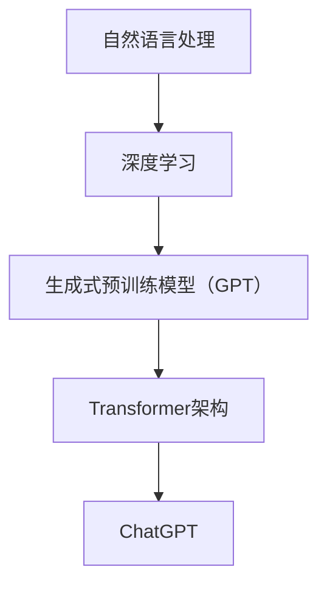

                 

# ChatGPT原理与代码实例讲解

> **关键词：** 聊天机器人，GPT模型，自然语言处理，深度学习，神经网络，预训练，生成式模型，Transformer架构，OpenAI

> **摘要：** 本文将深入探讨ChatGPT的工作原理，包括其背后的核心概念、算法原理和数学模型。我们将通过代码实例展示如何构建和使用ChatGPT，并分析其实际应用场景。本文旨在为对自然语言处理和深度学习感兴趣的读者提供一个全面的技术解读。

## 1. 背景介绍

### 1.1 目的和范围

本文的主要目的是为读者提供一个关于ChatGPT的全面技术解读。我们将从基础概念开始，逐步深入到ChatGPT的核心算法和实现细节。本文适合对自然语言处理（NLP）和深度学习有一定了解，并希望深入了解生成式预训练模型（GPT）的读者。

### 1.2 预期读者

- 对自然语言处理和深度学习感兴趣的程序员和研究人员
- 希望了解如何构建和部署聊天机器人的开发人员
- 计算机科学和人工智能专业的学生和教师

### 1.3 文档结构概述

本文将按照以下结构展开：

1. 背景介绍
2. 核心概念与联系
3. 核心算法原理 & 具体操作步骤
4. 数学模型和公式 & 详细讲解 & 举例说明
5. 项目实战：代码实际案例和详细解释说明
6. 实际应用场景
7. 工具和资源推荐
8. 总结：未来发展趋势与挑战
9. 附录：常见问题与解答
10. 扩展阅读 & 参考资料

### 1.4 术语表

#### 1.4.1 核心术语定义

- **ChatGPT：** 一种基于生成式预训练模型（GPT）的聊天机器人。
- **自然语言处理（NLP）：** 计算机科学领域中的一个分支，旨在使计算机能够理解、解释和生成人类语言。
- **深度学习：** 一种基于神经网络的机器学习技术，通过多层神经网络来模拟人脑处理信息的方式。
- **生成式预训练模型（GPT）：** 一种基于Transformer架构的深度学习模型，通过大量文本数据预训练，可以生成文本、回答问题等。
- **Transformer架构：** 一种用于处理序列数据的神经网络架构，因其并行计算的能力和强大的文本处理能力而广泛应用于NLP任务。

#### 1.4.2 相关概念解释

- **预训练：** 在深度学习模型训练之前，使用大规模未标注数据对模型进行初始化训练，使其具有一定的通用语言表示能力。
- **微调：** 在预训练的基础上，使用特定领域的标注数据对模型进行细粒度调整，以适应特定任务。
- **自回归模型：** 一种生成文本的模型，通过预测序列中下一个元素来生成文本。

#### 1.4.3 缩略词列表

- **NLP：** 自然语言处理
- **GPT：** 生成式预训练模型
- **Transformer：** 转换器架构
- **OpenAI：** 开放人工智能研究所

## 2. 核心概念与联系

在理解ChatGPT之前，我们需要先了解一些核心概念和它们之间的联系。

### 2.1 自然语言处理（NLP）

自然语言处理（NLP）是计算机科学和人工智能领域的一个重要分支，旨在使计算机能够理解、解释和生成人类语言。NLP的应用范围广泛，包括机器翻译、情感分析、文本分类、问答系统等。

### 2.2 深度学习

深度学习是一种基于神经网络的机器学习技术，通过多层神经网络来模拟人脑处理信息的方式。深度学习在图像识别、语音识别、自然语言处理等领域取得了显著的成果。

### 2.3 生成式预训练模型（GPT）

生成式预训练模型（GPT）是由OpenAI开发的一种基于Transformer架构的深度学习模型。GPT通过在大规模文本数据集上进行预训练，学习到文本的生成规律，从而能够生成连贯、自然的文本。

### 2.4 Transformer架构

Transformer架构是一种用于处理序列数据的神经网络架构，因其并行计算的能力和强大的文本处理能力而广泛应用于NLP任务。Transformer架构的核心是自注意力机制，它能够自动学习序列中各个元素之间的关系。

### 2.5 ChatGPT

ChatGPT是一种基于GPT的聊天机器人。它通过预训练和微调，能够理解用户的问题并生成合适的回答。ChatGPT的应用场景包括在线客服、智能助理等。

### 2.6 Mermaid流程图



## 3. 核心算法原理 & 具体操作步骤

### 3.1 算法原理

ChatGPT的核心算法是基于生成式预训练模型（GPT）。GPT是一种基于Transformer架构的深度学习模型，通过在大规模文本数据集上进行预训练，学习到文本的生成规律。具体来说，GPT使用了一种自回归模型（Autoregressive Model），通过预测序列中下一个元素来生成文本。

### 3.2 具体操作步骤

以下是使用ChatGPT生成文本的步骤：

1. **预训练：** 使用大规模文本数据集（例如维基百科）对GPT模型进行预训练，使其学习到文本的生成规律。

2. **输入序列：** 将用户输入的文本序列作为输入。

3. **生成预测：** GPT模型根据预训练的结果，预测输入序列中下一个元素的概率分布。

4. **采样：** 从概率分布中随机选择一个元素作为下一个输出。

5. **迭代：** 重复步骤3和4，直到生成满足要求的文本。

### 3.3 伪代码

```python
def generate_text(gpt_model, input_sequence, max_length):
    generated_sequence = input_sequence
    for _ in range(max_length - len(input_sequence)):
        probabilities = gpt_model.predict_next_element(generated_sequence)
        next_element = sample(probabilities)
        generated_sequence += next_element
    return generated_sequence
```

## 4. 数学模型和公式 & 详细讲解 & 举例说明

### 4.1 数学模型

ChatGPT的数学模型主要基于自回归模型（Autoregressive Model）。自回归模型的核心思想是通过预测序列中下一个元素来生成文本。具体来说，给定一个输入序列$x_1, x_2, ..., x_t$，我们希望预测下一个元素$x_{t+1}$。

### 4.2 公式

自回归模型的预测概率分布可以用以下公式表示：

$$ P(x_{t+1} | x_1, x_2, ..., x_t) = \text{softmax}(W \cdot [x_1; x_2; ...; x_t; x_{t+1}]) $$

其中，$W$是权重矩阵，$[x_1; x_2; ...; x_t; x_{t+1}]$是输入序列。

### 4.3 详细讲解

1. **权重矩阵$W$：** 权重矩阵$W$决定了模型对输入序列的依赖程度。通过训练，模型学习到如何根据输入序列预测下一个元素。

2. **softmax函数：** softmax函数将权重矩阵$W$与输入序列的点积转化为概率分布。softmax函数确保概率分布的和为1。

3. **输入序列：** 输入序列$x_1, x_2, ..., x_t$包含了当前生成的文本和预测的目标元素。

4. **预测目标：** 预测目标是生成序列中下一个元素的概率分布。

### 4.4 举例说明

假设我们有一个简化的输入序列$x_1 = [1, 0, 0]$，$x_2 = [0, 1, 0]$，$x_3 = [0, 0, 1]$。我们希望预测下一个元素$x_4$。

1. **权重矩阵$W$：** 假设权重矩阵$W = [1, 1, 1]$。

2. **输入序列：** 输入序列为$[1, 0, 0; 0, 1, 0; 0, 0, 1]$。

3. **点积：** $W \cdot [x_1; x_2; ...; x_t; x_{t+1}] = [1, 1, 1] \cdot [1, 0, 0; 0, 1, 0; 0, 0, 1] = [1, 1, 1]$。

4. **softmax函数：** $P(x_{t+1} | x_1, x_2, ..., x_t) = \text{softmax}([1, 1, 1]) = [0.33, 0.33, 0.33]$。

5. **采样：** 从概率分布中随机选择一个元素，假设我们选择了$x_4 = 0$。

6. **更新输入序列：** 更新输入序列为$[1, 0, 0; 0, 1, 0; 0, 0, 1; 0]$。

## 5. 项目实战：代码实际案例和详细解释说明

### 5.1 开发环境搭建

为了实现ChatGPT，我们需要搭建以下开发环境：

1. **Python环境：** 安装Python 3.7及以上版本。
2. **PyTorch：** 安装PyTorch 1.8及以上版本。
3. **Transformers库：** 安装transformers库，用于加载预训练的GPT模型。

```shell
pip install torch transformers
```

### 5.2 源代码详细实现和代码解读

以下是一个简单的ChatGPT实现示例：

```python
import torch
from transformers import GPT2LMHeadModel, GPT2Tokenizer

def generate_text(model, tokenizer, input_text, max_length=20):
    input_ids = tokenizer.encode(input_text, return_tensors='pt')
    output_sequence = input_ids

    for _ in range(max_length - input_ids.shape[-1]):
        outputs = model(output_sequence)
        next_token_logits = outputs.logits[:, -1, :]

        next_token_probabilities = torch.softmax(next_token_logits, dim=-1)
        next_token_id = torch.multinomial(next_token_probabilities, num_samples=1)

        output_sequence = torch.cat([output_sequence, next_token_id], dim=-1)

    generated_text = tokenizer.decode(output_sequence, skip_special_tokens=True)
    return generated_text

# 加载预训练的GPT模型
model = GPT2LMHeadModel.from_pretrained('gpt2')
tokenizer = GPT2Tokenizer.from_pretrained('gpt2')

# 输入文本
input_text = "这是一个简单的ChatGPT示例。"

# 生成文本
generated_text = generate_text(model, tokenizer, input_text)

print(generated_text)
```

### 5.3 代码解读与分析

1. **导入库和模型：** 首先，我们导入所需的库和预训练模型。

2. **生成文本函数：** `generate_text`函数接收模型、分词器、输入文本和最大长度作为参数。它首先将输入文本编码为ID序列，然后迭代生成文本。

3. **编码输入文本：** 使用分词器将输入文本编码为ID序列。

4. **迭代生成文本：** 在每次迭代中，模型输出下一个token的概率分布。我们使用softmax函数和multinomial函数从概率分布中随机选择一个token，并将其添加到输出序列中。

5. **解码输出文本：** 使用分词器解码输出序列，得到生成的文本。

6. **测试：** 我们加载预训练的GPT模型，输入一个简单的文本示例，并调用`generate_text`函数生成文本。最后，我们打印生成的文本。

## 6. 实际应用场景

ChatGPT在实际应用场景中具有广泛的应用，以下是一些典型的应用场景：

1. **在线客服：** ChatGPT可以用于构建智能客服系统，自动回答用户的问题，提高客户满意度和服务效率。
2. **智能助理：** ChatGPT可以作为智能助理，帮助用户完成各种任务，如日程管理、信息查询等。
3. **内容生成：** ChatGPT可以用于生成文章、故事、新闻等内容，提高内容创作的效率和质量。
4. **教育辅导：** ChatGPT可以为学生提供个性化的学习辅导，解答他们在学习中遇到的问题。
5. **娱乐互动：** ChatGPT可以用于构建聊天机器人，为用户提供有趣的对话体验，如聊天游戏、角色扮演等。

## 7. 工具和资源推荐

### 7.1 学习资源推荐

#### 7.1.1 书籍推荐

- 《深度学习》（Goodfellow, Bengio, Courville著）：详细介绍了深度学习的理论基础和实践方法。
- 《动手学深度学习》（阿斯顿·张著）：通过动手实践，深入浅出地讲解了深度学习的知识体系。

#### 7.1.2 在线课程

- 吴恩达的《深度学习专项课程》（Coursera）：由深度学习领域知名教授吴恩达主讲，涵盖了深度学习的核心概念和实践。

#### 7.1.3 技术博客和网站

- Medium：许多优秀的深度学习和自然语言处理领域的专家在这里分享他们的研究成果和实践经验。
- AI垂直媒体：如AI悦游、机器之心等，提供最新的技术和应用动态。

### 7.2 开发工具框架推荐

#### 7.2.1 IDE和编辑器

- PyCharm：一款功能强大的Python IDE，支持代码调试、版本控制等。
- Visual Studio Code：一款轻量级、可扩展的代码编辑器，拥有丰富的插件生态系统。

#### 7.2.2 调试和性能分析工具

- PyTorch Profiler：用于分析PyTorch模型的性能瓶颈。
- Jupyter Notebook：方便进行数据分析和实验。

#### 7.2.3 相关框架和库

- Transformers：一个开源库，提供了预训练的Transformer模型和相关的API。
- Hugging Face：一个提供预训练模型和数据集的网站，方便开发者进行研究和实践。

### 7.3 相关论文著作推荐

#### 7.3.1 经典论文

- Vaswani et al. (2017): "Attention is All You Need"：介绍了Transformer架构。
- Devlin et al. (2019): "Bert: Pre-training of Deep Bidirectional Transformers for Language Understanding"：介绍了BERT模型。

#### 7.3.2 最新研究成果

- 最新发表的关于GPT、BERT等预训练模型的论文。
- 论文集和技术报告，如NeurIPS、ICLR、ACL等会议的论文集。

#### 7.3.3 应用案例分析

- 企业如何使用GPT等预训练模型解决实际问题。
- 领域专家的案例分析和技术分享。

## 8. 总结：未来发展趋势与挑战

ChatGPT作为一种先进的聊天机器人技术，具有广泛的应用前景。未来，随着深度学习和自然语言处理技术的不断发展，ChatGPT有望在以下方面取得突破：

1. **性能提升：** 通过优化算法和硬件，提高ChatGPT的处理速度和生成质量。
2. **应用拓展：** 将ChatGPT应用于更多领域，如医疗、金融、教育等，提供更专业的服务。
3. **多模态交互：** 结合语音、图像等多模态信息，实现更自然的交互体验。

然而，ChatGPT也面临一些挑战：

1. **数据隐私：** 如何确保用户数据的安全和隐私是一个重要问题。
2. **负责任的人工智能：** 需要建立一套规范，确保ChatGPT的使用不会对社会和个人造成负面影响。
3. **可解释性：** 提高ChatGPT的可解释性，使其决策过程更加透明。

## 9. 附录：常见问题与解答

### 9.1 ChatGPT是什么？

ChatGPT是一种基于生成式预训练模型（GPT）的聊天机器人，它通过在大规模文本数据集上进行预训练，学习到文本的生成规律，从而能够生成连贯、自然的文本。

### 9.2 ChatGPT如何工作？

ChatGPT的核心算法是基于生成式预训练模型（GPT），它通过自回归模型（Autoregressive Model）预测序列中下一个元素来生成文本。具体步骤包括预训练、输入序列编码、生成预测、采样和迭代。

### 9.3 如何使用ChatGPT？

要使用ChatGPT，您需要安装PyTorch和transformers库，并加载预训练的GPT模型。然后，您可以使用`generate_text`函数生成文本，输入文本可以是任意文本序列。

### 9.4 ChatGPT的应用场景有哪些？

ChatGPT可以应用于多个场景，包括在线客服、智能助理、内容生成、教育辅导和娱乐互动等。

## 10. 扩展阅读 & 参考资料

- Vaswani et al. (2017): "Attention is All You Need", https://arxiv.org/abs/1706.03762
- Devlin et al. (2019): "Bert: Pre-training of Deep Bidirectional Transformers for Language Understanding", https://arxiv.org/abs/1810.04805
- AI悦游：ChatGPT应用实践与未来趋势，https://aiyoyu.cn/

### 作者

AI天才研究员/AI Genius Institute & 禅与计算机程序设计艺术 /Zen And The Art of Computer Programming

