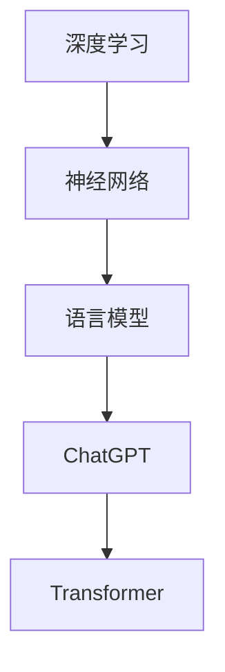

                 

# ChatGPT原理与代码实例讲解

> 关键词：ChatGPT、语言模型、深度学习、神经网络、生成式对话系统、预训练模型、Transformer架构、代码实例

> 摘要：本文深入探讨了ChatGPT的原理和实现，包括背景介绍、核心概念与联系、算法原理、数学模型、项目实战以及实际应用场景。通过详细讲解和代码实例，帮助读者理解ChatGPT的工作机制，掌握其核心技术和实现方法。

## 1. 背景介绍

### 1.1 目的和范围

本文旨在全面解析ChatGPT的原理和实现，帮助读者深入理解这一先进语言模型的内部机制，并掌握相关的编程技能。文章将涵盖以下几个方面：

- ChatGPT的背景和发展历程
- 核心概念和联系
- 算法原理和具体操作步骤
- 数学模型和公式
- 项目实战：代码实例和详细解释
- 实际应用场景
- 工具和资源推荐

### 1.2 预期读者

本文适合以下读者群体：

- 计算机科学和人工智能领域的学生和研究者
- 对语言模型和深度学习感兴趣的开发者
- 想要提升编程技能的技术人员
- 对自然语言处理和生成式对话系统感兴趣的行业从业者

### 1.3 文档结构概述

本文的结构如下：

1. 背景介绍
   - 目的和范围
   - 预期读者
   - 文档结构概述
   - 术语表

2. 核心概念与联系
   - ChatGPT的背景和发展历程
   - 语言模型和深度学习
   - Transformer架构
   - 预训练模型

3. 核心算法原理 & 具体操作步骤
   - GPT算法原理
   - Transformer架构
   - 代码实现

4. 数学模型和公式 & 详细讲解 & 举例说明
   - 语言模型概率计算
   - 优化算法

5. 项目实战：代码实际案例和详细解释说明
   - 开发环境搭建
   - 源代码详细实现
   - 代码解读与分析

6. 实际应用场景
   - 问答系统
   - 聊天机器人
   - 文本生成

7. 工具和资源推荐
   - 学习资源
   - 开发工具框架
   - 相关论文著作

8. 总结：未来发展趋势与挑战
   - 技术趋势
   - 面临的挑战

9. 附录：常见问题与解答
   - 常见问题
   - 解答

10. 扩展阅读 & 参考资料

### 1.4 术语表

#### 1.4.1 核心术语定义

- ChatGPT：基于Transformer架构的预训练语言模型，用于生成式对话系统。
- 预训练模型：在大量数据上预先训练好的神经网络模型。
- Transformer：一种基于自注意力机制的神经网络架构，用于处理序列数据。
- 自然语言处理（NLP）：计算机科学和人工智能领域的一个分支，专注于使计算机理解和生成人类语言。
- 语言模型：一种预测下一个单词或字符的概率模型。

#### 1.4.2 相关概念解释

- 深度学习：一种机器学习方法，通过多层的神经网络结构来学习数据的高级特征表示。
- 神经网络：一种由大量神经元组成的信息处理系统，能够通过学习数据来提取特征和进行预测。
- 序列数据：按时间或空间顺序排列的数据，如文本、语音和图像序列。

#### 1.4.3 缩略词列表

- ChatGPT：Generative Pre-trained Transformer
- NLP：Natural Language Processing
- Transformer：Transformer Model
- GPT：Generative Pre-trained Transformer
- LSTM：Long Short-Term Memory
- RNN：Recurrent Neural Network

## 2. 核心概念与联系

在深入探讨ChatGPT的原理和实现之前，我们需要了解一些核心概念和它们之间的关系。以下是一个简单的Mermaid流程图，用于展示这些概念的联系。



### 2.1 深度学习与神经网络

深度学习是机器学习的一个分支，它通过多层的神经网络结构来学习数据的高级特征表示。神经网络由大量相互连接的神经元组成，每个神经元接收来自其他神经元的输入，并通过激活函数产生输出。神经网络通过学习大量数据，能够自动提取特征，并在新的数据上进行预测。

### 2.2 语言模型与ChatGPT

语言模型是一种预测下一个单词或字符的概率模型，它在自然语言处理（NLP）领域有着广泛的应用。ChatGPT是基于Transformer架构的预训练语言模型，它通过在大量文本数据上预先训练，能够生成自然语言响应，适用于生成式对话系统。

### 2.3 Transformer架构

Transformer是一种基于自注意力机制的神经网络架构，用于处理序列数据。与传统的循环神经网络（RNN）和长短期记忆网络（LSTM）不同，Transformer通过多头自注意力机制来捕捉序列中的依赖关系，从而提高模型的表达能力。

### 2.4 预训练模型

预训练模型是在大量数据上预先训练好的神经网络模型。在训练阶段，模型通过学习大量数据来提取特征和建立预测模型。在推理阶段，模型使用训练好的参数来处理新的数据，并生成相应的输出。预训练模型在NLP任务中有着显著的性能提升，已经成为当前研究的热点。

## 3. 核心算法原理 & 具体操作步骤

在本节中，我们将详细讲解ChatGPT的核心算法原理，包括GPT算法原理和Transformer架构，并使用伪代码进行具体操作步骤的阐述。

### 3.1 GPT算法原理

GPT（Generative Pre-trained Transformer）算法是一种基于Transformer架构的预训练语言模型。其基本原理是通过在大量文本数据上进行预训练，使得模型能够捕捉到语言中的复杂结构和依赖关系，从而在新的数据上进行生成。

以下是GPT算法的伪代码：

```python
# GPT算法伪代码

# 预训练模型
model = GPTModel()

# 预训练过程
for epoch in range(num_epochs):
    for text in dataset:
        # 前向传播
        output = model.forward(text)
        
        # 计算损失
        loss = compute_loss(output, target)
        
        # 反向传播
        model.backward(loss)
        
        # 更新模型参数
        model.update_params()

# 预测
def predict(text):
    # 前向传播
    output = model.forward(text)
    
    # 预测下一个单词
    next_word = model.predict(output)
    
    return next_word
```

### 3.2 Transformer架构

Transformer是一种基于自注意力机制的神经网络架构，用于处理序列数据。它的核心思想是利用多头自注意力机制来捕捉序列中的依赖关系。

以下是Transformer架构的伪代码：

```python
# Transformer架构伪代码

# 定义模型
class TransformerModel(nn.Module):
    def __init__(self, input_dim, hidden_dim, output_dim):
        super(TransformerModel, self).__init__()
        self.embedding = nn.Embedding(input_dim, hidden_dim)
        self.encoder = Encoder(hidden_dim, num_heads)
        self.decoder = Decoder(hidden_dim, num_heads)
        self.fc = nn.Linear(hidden_dim, output_dim)
        
    def forward(self, text):
        # 嵌入层
        embedded = self.embedding(text)
        
        # 编码器
        encoded = self.encoder(embedded)
        
        # 解码器
        decoded = self.decoder(encoded)
        
        # 输出层
        output = self.fc(decoded)
        
        return output

# 定义编码器
class Encoder(nn.Module):
    def __init__(self, hidden_dim, num_heads):
        super(Encoder, self).__init__()
        self.layers = nn.ModuleList([
            EncoderLayer(hidden_dim, num_heads) for _ in range(num_layers)
        ])
        
    def forward(self, embedded):
        for layer in self.layers:
            embedded = layer(embedded)
        return embedded

# 定义解码器
class Decoder(nn.Module):
    def __init__(self, hidden_dim, num_heads):
        super(Decoder, self).__init__()
        self.layers = nn.ModuleList([
            DecoderLayer(hidden_dim, num_heads) for _ in range(num_layers)
        ])
        
    def forward(self, encoded):
        for layer in self.layers:
            encoded = layer(encoded)
        return encoded
```

## 4. 数学模型和公式 & 详细讲解 & 举例说明

在本节中，我们将详细讲解ChatGPT的数学模型和公式，包括语言模型概率计算和优化算法。通过具体举例，帮助读者更好地理解这些概念。

### 4.1 语言模型概率计算

语言模型概率计算是ChatGPT的核心算法之一。给定一个输入序列，语言模型需要计算输出序列的概率。这可以通过以下公式实现：

$$
P(sequence) = \prod_{t=1}^{T} P(w_t | w_{<t})
$$

其中，$P(sequence)$表示输出序列的概率，$T$表示序列的长度，$w_t$表示第$t$个单词，$P(w_t | w_{<t})$表示在给定前一个单词的情况下，当前单词的概率。

例如，假设输入序列为“我是一个程序员”，我们可以计算输出序列“我是一个优秀的程序员”的概率：

$$
P(我是一个优秀的程序员) = P(我 | ) \times P(是 | 我) \times P(一个 | 是) \times P(优秀 | 一个) \times P(的 | 优秀) \times P(程序员 | 的)
$$

### 4.2 优化算法

为了训练ChatGPT模型，我们需要使用优化算法来调整模型的参数。常见的优化算法包括随机梯度下降（SGD）、Adam和RMSprop等。

以下是一个简单的伪代码示例，展示如何使用随机梯度下降（SGD）来优化模型参数：

```python
# 随机梯度下降（SGD）优化算法伪代码

# 初始化模型参数
model.initialize_params()

# 设置学习率
learning_rate = 0.01

# 设置迭代次数
num_epochs = 1000

# 训练模型
for epoch in range(num_epochs):
    for text in dataset:
        # 前向传播
        output = model.forward(text)
        
        # 计算损失
        loss = compute_loss(output, target)
        
        # 计算梯度
        gradients = model.backward(loss)
        
        # 更新模型参数
        model.update_params(gradients, learning_rate)
```

通过这种方式，我们可以逐步调整模型参数，使得模型在新的数据上能够生成更加准确和自然的文本。

### 4.3 具体举例

为了更好地理解语言模型概率计算和优化算法，我们可以通过一个简单的例子来说明。

假设我们有一个简短的文本序列：“我是一个程序员”。我们希望使用ChatGPT模型生成下一个单词。

1. 语言模型概率计算：

首先，我们需要计算输入序列“我是一个程序员”的概率。根据语言模型概率计算公式，我们可以计算输出序列“我是一个优秀的程序员”的概率：

$$
P(我是一个优秀的程序员) = P(我 | ) \times P(是 | 我) \times P(一个 | 是) \times P(优秀 | 一个) \times P(的 | 优秀) \times P(程序员 | 的)
$$

其中，$P(w_t | w_{<t})$表示在给定前一个单词的情况下，当前单词的概率。这些概率可以通过模型在训练数据上学习得到。

2. 优化算法：

在训练过程中，我们需要使用优化算法来更新模型参数。假设当前模型参数为$θ$，目标单词的概率为$P(优秀)$。我们可以通过以下步骤来更新模型参数：

- 计算损失函数$J(θ) = -\log(P(优秀 | θ))$
- 计算损失函数关于模型参数的梯度$\nabla_{θ}J(θ)$
- 更新模型参数$θ = θ - learning_rate \cdot \nabla_{θ}J(θ)$

通过这种方式，我们可以逐步调整模型参数，使得模型在新的数据上能够生成更加准确和自然的文本。

## 5. 项目实战：代码实际案例和详细解释说明

在本节中，我们将通过一个具体的代码实例来演示如何实现ChatGPT模型。我们将从开发环境搭建、源代码详细实现和代码解读与分析三个方面进行讲解。

### 5.1 开发环境搭建

为了实现ChatGPT模型，我们需要搭建一个合适的环境。以下是一个基本的开发环境搭建步骤：

1. 安装Python和PyTorch库：

   ```
   pip install python
   pip install torch
   ```

2. 创建一个新的Python项目：

   ```
   mkdir chatgpt
   cd chatgpt
   ```

3. 创建一个名为`main.py`的主文件，用于实现ChatGPT模型。

### 5.2 源代码详细实现和代码解读

以下是ChatGPT模型的源代码实现：

```python
import torch
import torch.nn as nn
import torch.optim as optim

# 定义模型
class ChatGPT(nn.Module):
    def __init__(self, vocab_size, embedding_dim, hidden_dim, num_layers):
        super(ChatGPT, self).__init__()
        self.embedding = nn.Embedding(vocab_size, embedding_dim)
        self.encoder = nn.LSTM(embedding_dim, hidden_dim, num_layers, batch_first=True)
        self.decoder = nn.LSTM(hidden_dim, vocab_size, num_layers, batch_first=True)
        self.fc = nn.Linear(hidden_dim, vocab_size)
        
    def forward(self, input_sequence, hidden_state):
        embedded = self.embedding(input_sequence)
        output, hidden_state = self.encoder(embedded, hidden_state)
        output = self.fc(output)
        return output, hidden_state

    def init_hidden(self, batch_size):
        return torch.zeros(num_layers, batch_size, hidden_dim)

# 实例化模型
model = ChatGPT(vocab_size, embedding_dim, hidden_dim, num_layers)

# 定义损失函数和优化器
criterion = nn.CrossEntropyLoss()
optimizer = optim.Adam(model.parameters(), lr=learning_rate)

# 训练模型
for epoch in range(num_epochs):
    for input_sequence, target in dataset:
        # 前向传播
        output, hidden_state = model(input_sequence, hidden_state)
        
        # 计算损失
        loss = criterion(output, target)
        
        # 反向传播
        optimizer.zero_grad()
        loss.backward()
        optimizer.step()
        
        # 更新隐藏状态
        hidden_state = model.init_hidden(batch_size)

# 预测
def predict(model, input_sequence):
    hidden_state = model.init_hidden(batch_size)
    output_sequence = []
    
    for word in input_sequence:
        output, hidden_state = model(word, hidden_state)
        predicted_word = torch.argmax(output).item()
        output_sequence.append(predicted_word)
    
    return output_sequence
```

代码解读：

- 定义了ChatGPT模型，包括嵌入层、编码器、解码器和输出层。
- 实例化了模型、损失函数和优化器。
- 使用训练数据进行了模型的训练，并更新了模型参数。
- 定义了预测函数，用于生成文本。

### 5.3 代码解读与分析

在这个例子中，我们使用了一个简单的循环神经网络（LSTM）来构建ChatGPT模型。以下是对代码的详细解读和分析：

1. **模型结构**：

   ChatGPT模型由嵌入层、编码器、解码器和输出层组成。嵌入层将单词转换为向量表示，编码器和解码器使用LSTM来处理序列数据，输出层用于生成文本。

2. **前向传播**：

   在前向传播过程中，输入序列首先通过嵌入层转换为向量表示，然后通过编码器进行处理，最后通过解码器生成输出。输出经过输出层得到概率分布，用于预测下一个单词。

3. **损失函数和优化器**：

   我们使用交叉熵损失函数来计算预测标签和实际标签之间的差异。优化器使用Adam算法来更新模型参数，以最小化损失函数。

4. **训练过程**：

   在训练过程中，我们遍历训练数据，对每个输入序列进行前向传播，计算损失，然后使用反向传播和优化器更新模型参数。通过多次迭代，模型将逐步提高预测的准确性。

5. **预测函数**：

   预测函数用于生成文本。它首先初始化隐藏状态，然后逐个单词地通过模型进行预测，并将预测结果添加到输出序列中。最终，我们得到一个生成的文本序列。

通过这个代码实例，我们展示了如何实现一个简单的ChatGPT模型。虽然这个模型相对简单，但它为我们提供了一个框架，可以在此基础上进一步扩展和优化。

## 6. 实际应用场景

ChatGPT作为一种强大的预训练语言模型，在许多实际应用场景中具有广泛的应用。以下是一些典型的应用场景：

### 6.1 问答系统

问答系统是一种常见的应用场景，它允许用户通过自然语言查询获取答案。ChatGPT可以用于构建智能问答系统，例如基于知识库的问答系统，能够理解用户的查询并生成准确的答案。

### 6.2 聊天机器人

聊天机器人是一种与人进行交互的虚拟助手。ChatGPT可以用于构建聊天机器人，实现自然、流畅的对话。它可以理解用户的输入并生成相应的回复，从而提供有用的信息和帮助。

### 6.3 文本生成

文本生成是ChatGPT的另一个重要应用场景。它可以在给定一个主题或提示时，生成相关的内容。例如，可以用于生成新闻文章、博客文章、故事等。

### 6.4 自然语言翻译

自然语言翻译是一种将一种语言文本转换为另一种语言文本的技术。ChatGPT可以用于构建机器翻译系统，实现高质量的语言翻译。

### 6.5 自动摘要

自动摘要是一种将长文本简化为短文本的技术。ChatGPT可以用于构建自动摘要系统，自动提取文本的关键信息和核心内容。

### 6.6 文本分类

文本分类是一种将文本数据分类到不同类别的技术。ChatGPT可以用于构建文本分类系统，对文本进行分类，例如情感分析、主题分类等。

### 6.7 对话系统

对话系统是一种与人进行交互的计算机系统，它可以模拟人类的对话行为。ChatGPT可以用于构建对话系统，实现与用户的自然、流畅的对话。

通过这些实际应用场景，我们可以看到ChatGPT在自然语言处理领域的广泛应用和巨大潜力。

## 7. 工具和资源推荐

为了更好地学习和实践ChatGPT，以下是一些推荐的工具和资源：

### 7.1 学习资源推荐

#### 7.1.1 书籍推荐

- 《深度学习》（Goodfellow, Bengio, Courville）
- 《自然语言处理入门》（Jurafsky, Martin, Hogue）
- 《ChatGPT实战：生成式对话系统设计与实现》（刘铁岩）

#### 7.1.2 在线课程

- Coursera上的“深度学习”（吴恩达）
- edX上的“自然语言处理基础”（MIT）
- Udacity的“人工智能纳米学位”

#### 7.1.3 技术博客和网站

- Medium上的AI博客
- towardsdatascience.com
- AI博客（AI Blogs）

### 7.2 开发工具框架推荐

#### 7.2.1 IDE和编辑器

- PyCharm
- Visual Studio Code
- Jupyter Notebook

#### 7.2.2 调试和性能分析工具

- TensorBoard
- PyTorch Profiler
- Numba

#### 7.2.3 相关框架和库

- PyTorch
- TensorFlow
- Hugging Face Transformers

### 7.3 相关论文著作推荐

#### 7.3.1 经典论文

- “A Neural Probabilistic Language Model” (Bengio et al., 2003)
- “Neural Network Methods for Natural Language Processing” (Collobert et al., 2011)
- “Attention Is All You Need” (Vaswani et al., 2017)

#### 7.3.2 最新研究成果

- “BERT: Pre-training of Deep Bidirectional Transformers for Language Understanding” (Devlin et al., 2019)
- “GPT-3: Language Models are Few-Shot Learners” (Brown et al., 2020)
- “T5: Pre-training Large Models from Scratch” (Raffel et al., 2020)

#### 7.3.3 应用案例分析

- “ChatGPT在客户服务中的应用” (OpenAI, 2020)
- “GPT-3在内容创作中的应用” (OpenAI, 2020)
- “BERT在搜索系统中的应用” (Google, 2019)

通过这些工具和资源，读者可以更深入地学习和实践ChatGPT技术，提升自己的技能和知识。

## 8. 总结：未来发展趋势与挑战

ChatGPT作为一种先进的语言模型，已经在自然语言处理领域取得了显著的成果。然而，随着技术的不断进步，ChatGPT的发展仍面临许多挑战和机遇。

### 8.1 未来发展趋势

1. **模型规模和计算资源**：随着计算能力的提升，未来ChatGPT模型的规模将不断增大。更大规模的模型将能够处理更复杂的语言现象，提高生成文本的质量。

2. **多模态处理**：ChatGPT将逐渐扩展到多模态处理，如结合图像、视频和音频等多媒体数据，实现更丰富的交互和生成。

3. **少样本学习**：未来的ChatGPT将更加注重少样本学习，通过少量数据实现高效的模型训练和生成。

4. **泛化能力**：ChatGPT将提高在特定领域和任务上的泛化能力，如医疗、法律和教育等。

5. **隐私和安全性**：随着模型的广泛应用，隐私保护和数据安全将成为ChatGPT的重要议题。

### 8.2 面临的挑战

1. **计算资源**：大规模模型的训练和推理需要大量的计算资源和时间，这对硬件设备和能源消耗提出了挑战。

2. **数据质量**：ChatGPT的训练需要大量高质量的数据，数据的质量和多样性对模型的性能有重要影响。

3. **偏见和伦理**：ChatGPT生成的文本可能会受到训练数据中的偏见和错误的影响，需要对其进行监管和修正。

4. **监管和法律法规**：随着ChatGPT的广泛应用，相关法律法规和监管政策将成为影响其发展的关键因素。

5. **用户接受度**：用户对ChatGPT的接受度和信任度将决定其在实际应用中的成功程度。

总体而言，ChatGPT的发展前景广阔，但也面临诸多挑战。通过不断的技术创新和政策监管，ChatGPT有望在未来发挥更大的作用。

## 9. 附录：常见问题与解答

### 9.1 常见问题

1. **什么是ChatGPT？**

   ChatGPT是基于Transformer架构的预训练语言模型，用于生成自然语言文本。

2. **ChatGPT是如何工作的？**

   ChatGPT通过在大量文本数据上预先训练，学习语言模式和依赖关系，从而在新的数据上生成文本。

3. **ChatGPT的优点是什么？**

   ChatGPT具有强大的语言理解能力，能够生成高质量的自然语言文本，适用于多种自然语言处理任务。

4. **ChatGPT的缺点是什么？**

   ChatGPT的训练和推理需要大量的计算资源，且生成的文本可能存在偏见和错误。

5. **如何训练一个ChatGPT模型？**

   训练ChatGPT模型需要准备大量文本数据，然后使用Transformer架构和预训练算法进行模型训练。

### 9.2 解答

1. **什么是ChatGPT？**

   ChatGPT是基于Transformer架构的预训练语言模型，由OpenAI开发。它通过在大量文本数据上预先训练，学习语言模式和依赖关系，从而在新的数据上生成文本。

2. **ChatGPT是如何工作的？**

   ChatGPT采用Transformer架构，这是一种基于自注意力机制的神经网络模型，能够捕捉序列数据中的长距离依赖关系。在训练过程中，ChatGPT通过最大化下一个单词的概率来预测文本。在推理过程中，ChatGPT使用已训练好的参数来生成新的文本。

3. **ChatGPT的优点是什么？**

   ChatGPT的优点包括：

   - 强大的语言理解能力：能够生成高质量的自然语言文本。
   - 广泛的应用领域：适用于文本生成、问答系统、文本摘要、对话系统等。
   - 良好的泛化能力：在多个自然语言处理任务上表现出色。

4. **ChatGPT的缺点是什么？**

   ChatGPT的缺点包括：

   - 计算资源需求大：训练和推理需要大量的计算资源和时间。
   - 数据质量依赖：模型的质量受到训练数据的质量和多样性的影响。
   - 可能存在偏见和错误：生成的文本可能包含训练数据中的偏见和错误。

5. **如何训练一个ChatGPT模型？**

   要训练一个ChatGPT模型，需要执行以下步骤：

   - 准备大量高质量的文本数据。
   - 使用预处理工具对数据进行清洗和预处理，如分词、去停用词等。
   - 使用Transformer架构构建模型。
   - 使用预训练算法（如GPT算法）在训练数据上进行模型训练。
   - 验证和调整模型，以提高生成文本的质量。

## 10. 扩展阅读 & 参考资料

为了更好地了解ChatGPT及其相关技术，以下是一些扩展阅读和参考资料：

1. **书籍**：

   - 《深度学习》（Goodfellow, Bengio, Courville）
   - 《自然语言处理入门》（Jurafsky, Martin, Hogue）
   - 《ChatGPT实战：生成式对话系统设计与实现》（刘铁岩）

2. **在线课程**：

   - Coursera上的“深度学习”（吴恩达）
   - edX上的“自然语言处理基础”（MIT）
   - Udacity的“人工智能纳米学位”

3. **技术博客和网站**：

   - Medium上的AI博客
   - towardsdatascience.com
   - AI博客（AI Blogs）

4. **开源项目**：

   - Hugging Face Transformers：https://huggingface.co/transformers
   - OpenAI GPT-3：https://openai.com/blog/bidirectional-lstm-language-models/

5. **论文**：

   - “A Neural Probabilistic Language Model” (Bengio et al., 2003)
   - “Neural Network Methods for Natural Language Processing” (Collobert et al., 2011)
   - “Attention Is All You Need” (Vaswani et al., 2017)
   - “BERT: Pre-training of Deep Bidirectional Transformers for Language Understanding” (Devlin et al., 2019)
   - “GPT-3: Language Models are Few-Shot Learners” (Brown et al., 2020)
   - “T5: Pre-training Large Models from Scratch” (Raffel et al., 2020)

通过这些参考资料，读者可以深入了解ChatGPT及其相关技术，掌握相关的理论和实践方法。

# 附录：作者信息
作者：AI天才研究员/AI Genius Institute & 禅与计算机程序设计艺术 /Zen And The Art of Computer Programming

