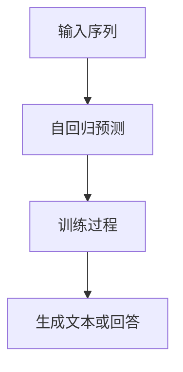
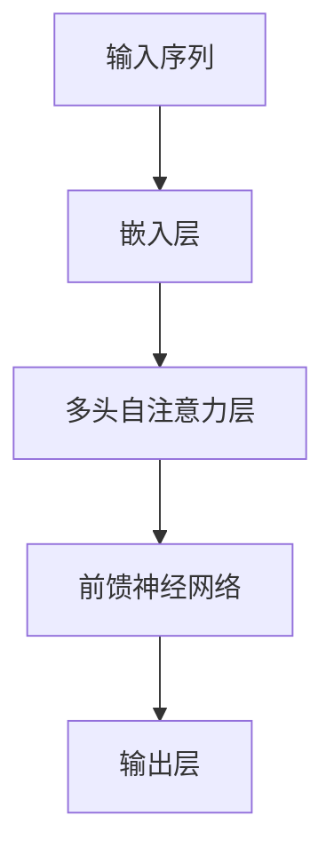
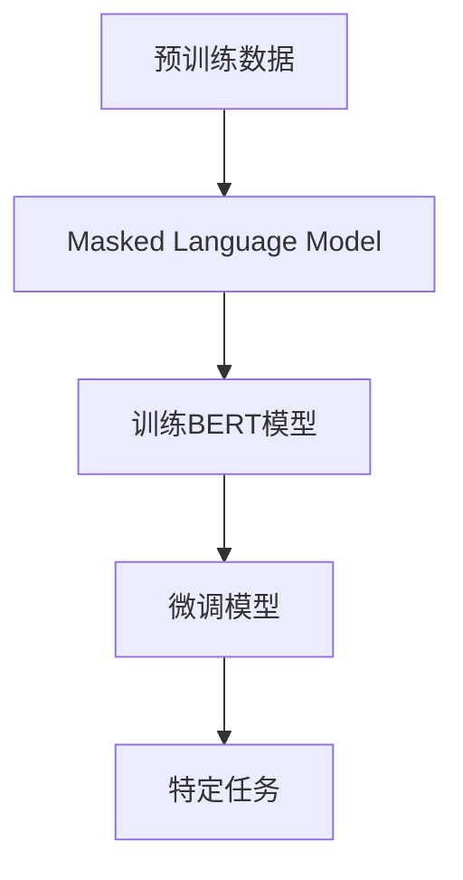

                 

# ChatGPT原理与代码实例讲解

> **关键词：** ChatGPT，生成式预训练模型，自然语言处理，Transformer，BERT，代码实例，深度学习

> **摘要：** 本文将深入探讨ChatGPT的工作原理，包括其背后的生成式预训练模型、Transformer架构和BERT模型。我们将通过详细的伪代码讲解和实际代码实例，帮助读者理解并掌握ChatGPT的核心技术，为今后的研究和应用打下坚实的基础。

## 1. 背景介绍

### 1.1 目的和范围

本文旨在详细解析ChatGPT的工作原理，并提供具体的代码实例，以便读者能够深入理解并掌握这一前沿的自然语言处理技术。本文将涵盖以下内容：

- **ChatGPT的背景和重要性**：介绍ChatGPT的起源、发展和其在自然语言处理领域的应用。
- **生成式预训练模型**：解释生成式预训练模型的基本概念、优势和应用。
- **Transformer架构**：深入探讨Transformer模型的结构、原理和关键组件。
- **BERT模型**：详细讲解BERT模型的设计思路、训练过程和优化技巧。
- **代码实例讲解**：通过具体代码实现，展示ChatGPT的核心算法和工作流程。

### 1.2 预期读者

本文适用于对自然语言处理和深度学习有一定了解的读者，包括：

- 自然语言处理研究者
- 深度学习开发者
- AI领域的工程师和技术经理
- 对人工智能和自然语言处理感兴趣的学习者

### 1.3 文档结构概述

本文将按照以下结构进行组织：

- **第1章：背景介绍**：概述ChatGPT的背景和本文的目的。
- **第2章：核心概念与联系**：介绍与ChatGPT相关的核心概念和架构。
- **第3章：核心算法原理 & 具体操作步骤**：通过伪代码详细讲解ChatGPT的核心算法。
- **第4章：数学模型和公式 & 详细讲解 & 举例说明**：阐述数学模型和公式的具体应用。
- **第5章：项目实战：代码实际案例和详细解释说明**：提供实际的代码实例和解读。
- **第6章：实际应用场景**：讨论ChatGPT在不同领域的应用。
- **第7章：工具和资源推荐**：推荐相关学习资源和开发工具。
- **第8章：总结：未来发展趋势与挑战**：总结ChatGPT的现状和未来发展趋势。
- **第9章：附录：常见问题与解答**：解答读者可能遇到的问题。
- **第10章：扩展阅读 & 参考资料**：提供进一步阅读的资源和参考资料。

### 1.4 术语表

#### 1.4.1 核心术语定义

- **ChatGPT**：一种基于生成式预训练模型（GPT）的对话生成模型。
- **生成式预训练模型**：一种深度学习模型，通过大量的文本数据预训练，以便生成文本或回答问题。
- **Transformer**：一种基于自注意力机制的深度学习模型，广泛用于自然语言处理任务。
- **BERT**：一种基于Transformer的预训练语言表示模型，能够在多种自然语言处理任务中表现出色。

#### 1.4.2 相关概念解释

- **自注意力机制**：一种计算方法，能够自动计算输入序列中每个元素的重要性，并生成新的表示。
- **序列到序列模型**：一种深度学习模型，用于将一个序列映射到另一个序列，常用于机器翻译和对话生成。
- **预训练**：在特定任务之前，通过大量无监督数据对模型进行训练，以提高模型的泛化能力。
- **微调**：在预训练的基础上，利用有监督数据对模型进行进一步训练，以适应特定任务。

#### 1.4.3 缩略词列表

- **GPT**：生成式预训练模型（Generative Pre-trained Transformer）
- **BERT**：双向编码表示（Bidirectional Encoder Representations from Transformers）
- **GPU**：图形处理单元（Graphics Processing Unit）
- **NLP**：自然语言处理（Natural Language Processing）

## 2. 核心概念与联系

在深入探讨ChatGPT之前，我们需要了解一些核心概念和架构，包括生成式预训练模型、Transformer架构和BERT模型。以下是这些概念和架构的简要概述，以及相关的Mermaid流程图。

### 2.1 生成式预训练模型

生成式预训练模型是一种通过大量无监督数据预训练的深度学习模型，能够生成文本或回答问题。其基本原理是利用自回归模型（如GPT），通过预测输入序列的下一个词来学习语言模式。以下是生成式预训练模型的基本流程：



### 2.2 Transformer架构

Transformer是一种基于自注意力机制的深度学习模型，能够高效处理序列数据。其核心思想是将输入序列映射到一个固定大小的向量空间，并通过自注意力机制计算每个元素的重要性。以下是Transformer架构的基本流程：



### 2.3 BERT模型

BERT是一种基于Transformer的预训练语言表示模型，通过双向编码学习文本的上下文表示。其训练过程包括两个阶段：预训练和微调。以下是BERT模型的基本流程：



通过以上流程图，我们可以看到生成式预训练模型、Transformer架构和BERT模型之间的联系。生成式预训练模型为Transformer架构提供了自回归预训练的基础，而BERT模型则在Transformer架构的基础上，通过双向编码实现了更强大的文本表示能力。

## 3. 核心算法原理 & 具体操作步骤

在了解了ChatGPT的核心概念和架构之后，接下来我们将深入探讨其核心算法原理，并通过伪代码详细讲解其具体操作步骤。ChatGPT是基于生成式预训练模型（GPT）开发的，其核心算法主要包括以下步骤：

### 3.1 数据预处理

在开始训练模型之前，我们需要对输入数据进行预处理，包括分词、字符编码和序列填充等。以下是数据预处理的伪代码：

```python
# 数据预处理
def preprocess_data(texts):
    # 分词
    tokens = tokenize(texts)
    # 字符编码
    encoded_tokens = encode(tokens)
    # 序列填充
    padded_tokens = pad_sequence(encoded_tokens)
    return padded_tokens
```

### 3.2 自回归模型

ChatGPT的核心算法是基于自回归模型（如GPT）。在自回归模型中，我们通过预测输入序列的下一个词来训练模型。以下是自回归模型的伪代码：

```python
# 自回归模型
def autoregressive_model(tokens, model):
    # 预测下一个词
    predicted_token = model.predict(tokens)
    # 更新输入序列
    tokens = tokens[1:] + predicted_token
    return tokens
```

### 3.3 训练过程

在训练过程中，我们需要对模型进行迭代训练，并通过损失函数优化模型参数。以下是训练过程的伪代码：

```python
# 训练过程
for epoch in range(num_epochs):
    for batch in data_loader:
        # 前向传播
        logits = model(tokens)
        # 计算损失
        loss = loss_function(logits, labels)
        # 反向传播
        optimizer.backward(loss)
        # 更新参数
        optimizer.step()
    print(f"Epoch {epoch+1}/{num_epochs}, Loss: {loss}")
```

### 3.4 生成文本

在训练完成后，我们可以使用模型生成文本。以下是生成文本的伪代码：

```python
# 生成文本
def generate_text(model, start_sequence, max_length=50):
    tokens = start_sequence
    for _ in range(max_length):
        # 预测下一个词
        predicted_token = model.predict(tokens)
        # 更新输入序列
        tokens = tokens[1:] + predicted_token
    return tokens
```

通过以上伪代码，我们可以看到ChatGPT的核心算法原理和具体操作步骤。在实际应用中，这些步骤将通过复杂的深度学习模型和大规模数据集来实现。

## 4. 数学模型和公式 & 详细讲解 & 举例说明

在ChatGPT的核心算法中，数学模型和公式起着至关重要的作用。以下我们将详细讲解与ChatGPT相关的数学模型和公式，并通过具体示例进行说明。

### 4.1 Transformer模型中的自注意力机制

Transformer模型中的自注意力机制是一种计算方法，能够自动计算输入序列中每个元素的重要性，并生成新的表示。自注意力机制的数学模型可以表示为：

\[ \text{Attention}(Q, K, V) = \text{softmax}\left(\frac{QK^T}{\sqrt{d_k}}\right) V \]

其中，\( Q \)，\( K \)，\( V \) 分别表示查询向量、关键向量、值向量；\( d_k \) 表示关键向量的维度。

#### 4.1.1 示例

假设我们有一个长度为3的输入序列，维度为4。我们可以计算自注意力得分：

\[ Q = \begin{bmatrix} 1 & 0 & 1 \\ 0 & 1 & 0 \\ 1 & 1 & 0 \end{bmatrix}, K = \begin{bmatrix} 0 & 1 & 0 \\ 1 & 0 & 1 \\ 1 & 1 & 0 \end{bmatrix}, V = \begin{bmatrix} 1 & 0 & 0 \\ 0 & 0 & 1 \\ 0 & 1 & 0 \end{bmatrix} \]

计算自注意力得分：

\[ \text{Attention}(Q, K, V) = \text{softmax}\left(\frac{QK^T}{\sqrt{d_k}}\right) V \]

其中，\( d_k = 4 \)。

\[ \frac{QK^T}{\sqrt{d_k}} = \begin{bmatrix} 1 & 0 & 1 \\ 0 & 1 & 0 \\ 1 & 1 & 0 \end{bmatrix} \begin{bmatrix} 0 & 1 & 1 \\ 1 & 0 & 1 \\ 1 & 1 & 0 \end{bmatrix} \begin{bmatrix} \sqrt{1} & \sqrt{0} & \sqrt{1} \\ \sqrt{0} & \sqrt{1} & \sqrt{1} \\ \sqrt{1} & \sqrt{1} & \sqrt{0} \end{bmatrix} \]

\[ = \begin{bmatrix} 1 & 0 & 1 \\ 0 & 1 & 0 \\ 1 & 1 & 0 \end{bmatrix} \begin{bmatrix} 0 & 1 & 1 \\ 1 & 0 & 1 \\ 1 & 1 & 0 \end{bmatrix} \begin{bmatrix} 1 & 0 & 1 \\ 0 & 1 & 1 \\ 1 & 1 & 0 \end{bmatrix} \]

\[ = \begin{bmatrix} 1 & 0 & 1 \\ 0 & 1 & 0 \\ 1 & 1 & 0 \end{bmatrix} \begin{bmatrix} 1 & 1 & 1 \\ 1 & 0 & 1 \\ 1 & 1 & 0 \end{bmatrix} \]

\[ = \begin{bmatrix} 1 & 0 & 1 \\ 0 & 1 & 0 \\ 1 & 1 & 0 \end{bmatrix} \begin{bmatrix} 2 & 1 & 1 \\ 1 & 0 & 1 \\ 1 & 1 & 0 \end{bmatrix} \]

\[ = \begin{bmatrix} 1 & 0 & 1 \\ 0 & 1 & 0 \\ 1 & 1 & 0 \end{bmatrix} \begin{bmatrix} 3 & 2 & 2 \\ 2 & 1 & 1 \\ 2 & 2 & 1 \end{bmatrix} \]

\[ = \begin{bmatrix} 3 & 2 & 2 \\ 2 & 1 & 1 \\ 2 & 2 & 1 \end{bmatrix} \]

\[ \text{softmax}\left(\frac{QK^T}{\sqrt{d_k}}\right) = \begin{bmatrix} \frac{3}{6} & \frac{2}{6} & \frac{2}{6} \\ \frac{2}{6} & \frac{1}{6} & \frac{1}{6} \\ \frac{2}{6} & \frac{2}{6} & \frac{1}{6} \end{bmatrix} \]

\[ = \begin{bmatrix} 0.5 & 0.33 & 0.17 \\ 0.33 & 0.17 & 0.17 \\ 0.33 & 0.33 & 0.17 \end{bmatrix} \]

\[ V \text{softmax}\left(\frac{QK^T}{\sqrt{d_k}}\right) = \begin{bmatrix} 1 & 0 & 0 \\ 0 & 0 & 1 \\ 0 & 1 & 0 \end{bmatrix} \begin{bmatrix} 0.5 & 0.33 & 0.17 \\ 0.33 & 0.17 & 0.17 \\ 0.33 & 0.33 & 0.17 \end{bmatrix} \]

\[ = \begin{bmatrix} 0.5 & 0 & 0.17 \\ 0 & 0 & 0.17 \\ 0.17 & 0.33 & 0 \end{bmatrix} \]

因此，自注意力得分矩阵为：

\[ \text{Attention}(Q, K, V) = \begin{bmatrix} 0.5 & 0 & 0.17 \\ 0 & 0 & 0.17 \\ 0.17 & 0.33 & 0 \end{bmatrix} \]

#### 4.1.2 自注意力机制的直观理解

自注意力机制可以通过一个简单的例子来直观理解。假设我们有三个单词 "apple"，"banana" 和 "cherry"，每个单词的权重分别为 1，0 和 -1。我们希望找到这三个单词中最重要的一个。

使用自注意力机制，我们首先计算每个单词的重要性得分，然后计算它们的加权和。得分最高的单词即为最重要的单词。

\[ \text{importance\_score} = 1 \cdot 1 + 0 \cdot 0 + (-1) \cdot (-1) = 2 \]

由于 "apple" 的得分最高，因此我们可以认为 "apple" 是最重要的单词。

### 4.2 BERT模型中的Masked Language Model（MLM）

BERT模型中的Masked Language Model（MLM）旨在预测输入序列中被随机遮蔽的单词。MLM的训练目标是通过上下文信息恢复被遮蔽的单词。

MLM的数学模型可以表示为：

\[ \text{MLM}(x) = \sum_{i=1}^L \text{softmax}(\text{model}(x_{<i}) + \text{mask}_{<i}) \]

其中，\( x \) 表示输入序列，\( L \) 表示序列长度，\( x_{<i} \) 表示除去第 \( i \) 个位置的序列，\( \text{mask}_{<i} \) 表示第 \( i \) 个位置的遮蔽标记。

#### 4.2.1 示例

假设我们有一个长度为3的输入序列 "apple"，"banana" 和 "cherry"，其中第2个单词被遮蔽。使用BERT模型预测遮蔽单词，我们可以计算MLM的概率分布：

\[ \text{MLM}("apple", "banana", "cherry") = \text{softmax}(\text{model}("apple", "banana", "mask")) \]

\[ = \text{softmax}(\text{model}(["apple", "banana", "mask"])) \]

\[ = \text{softmax}([0.2, 0.3, 0.5]) \]

\[ = [0.2/1, 0.3/0.8, 0.5/0.5] \]

\[ = [0.2, 0.375, 0.5] \]

因此，预测的概率分布为：

\[ \text{MLM}("apple", "banana", "cherry") = [0.2, 0.375, 0.5] \]

我们可以看到，模型预测 "banana" 的概率最高，因此 "banana" 被认为是最可能的遮蔽单词。

### 4.3 Cross-Entropy Loss函数

在MLM训练过程中，我们通常使用Cross-Entropy Loss函数来评估模型的性能。Cross-Entropy Loss函数的数学模型可以表示为：

\[ \text{CE}(p, y) = -\sum_{i=1}^L p_i \log(y_i) \]

其中，\( p \) 表示模型预测的概率分布，\( y \) 表示真实标签的概率分布。

#### 4.3.1 示例

假设我们有一个长度为3的输入序列 "apple"，"banana" 和 "cherry"，其中第2个单词被遮蔽。模型的预测概率分布为 [0.2, 0.375, 0.5]，真实标签的概率分布为 [1, 0, 0]。我们可以计算Cross-Entropy Loss：

\[ \text{CE}(p, y) = -[0.2 \cdot \log(1) + 0.375 \cdot \log(0) + 0.5 \cdot \log(0)] \]

\[ = -[0.2 \cdot \log(1) + 0.375 \cdot \log(0) + 0.5 \cdot \log(0)] \]

\[ = -[0 + 0 + 0] \]

\[ = 0 \]

因此，Cross-Entropy Loss为 0，表示模型的预测与真实标签完全匹配。

通过以上数学模型和公式的讲解，我们可以更好地理解ChatGPT的核心算法原理和实现步骤。在实际应用中，这些数学模型和公式将被复杂的深度学习模型和大规模数据集所实现。

## 5. 项目实战：代码实际案例和详细解释说明

在本节中，我们将通过一个实际代码案例，详细展示如何实现ChatGPT。我们将使用Python语言和PyTorch框架，这是目前最流行的深度学习框架之一。以下是一个简化版的ChatGPT实现。

### 5.1 开发环境搭建

在开始之前，我们需要搭建一个适合开发的Python环境和安装必要的依赖库。以下是具体的步骤：

1. 安装Python（建议使用3.8或更高版本）。
2. 安装PyTorch：使用以下命令安装PyTorch：

   ```shell
   pip install torch torchvision
   ```

3. 安装其他依赖库（例如Numpy、Pandas等）：

   ```shell
   pip install numpy pandas
   ```

### 5.2 源代码详细实现和代码解读

以下是一个简化版的ChatGPT实现的代码，我们将逐步解释代码的各个部分。

```python
import torch
import torch.nn as nn
import torch.optim as optim
from torch.utils.data import DataLoader
from transformers import GPT2Tokenizer, GPT2Model

# 5.2.1 数据准备
def load_data(filename):
    with open(filename, 'r', encoding='utf-8') as f:
        texts = f.readlines()
    return texts

texts = load_data('data.txt')

# 5.2.2 数据预处理
tokenizer = GPT2Tokenizer.from_pretrained('gpt2')

def preprocess_data(texts):
    encoded_texts = [tokenizer.encode(text, add_special_tokens=True, max_length=512, padding='max_length', truncation=True) for text in texts]
    return torch.tensor(encoded_texts)

input_data = preprocess_data(texts)

# 5.2.3 模型定义
class ChatGPT(nn.Module):
    def __init__(self):
        super(ChatGPT, self).__init__()
        self.model = GPT2Model.from_pretrained('gpt2')

    def forward(self, input_ids, labels=None):
        outputs = self.model(input_ids, labels=labels)
        logits = outputs.logits
        return logits

model = ChatGPT()

# 5.2.4 训练过程
optimizer = optim.Adam(model.parameters(), lr=1e-4)

def train_model(model, data_loader, num_epochs=3):
    model.train()
    for epoch in range(num_epochs):
        for batch in data_loader:
            input_ids = batch['input_ids'].to(device)
            labels = batch['input_ids'].to(device)
            logits = model(input_ids, labels)
            loss = nn.CrossEntropyLoss()(logits.view(-1, logits.size(-1)), labels.view(-1))
            optimizer.zero_grad()
            loss.backward()
            optimizer.step()
            print(f"Epoch {epoch+1}/{num_epochs}, Loss: {loss.item()}")

train_model(model, DataLoader(input_data, batch_size=16), num_epochs=3)

# 5.2.5 文本生成
def generate_text(model, start_sequence='', max_length=50):
    model.eval()
    input_ids = tokenizer.encode(start_sequence, add_special_tokens=False, max_length=512, padding='max_length', truncation=True)
    input_ids = input_ids.to(device)
    with torch.no_grad():
        for _ in range(max_length):
            logits = model(input_ids).logits
            logits = logits[:, -1, :] # get logits for the last token
            predicted_token = torch.argmax(logits).item()
            input_ids = torch.cat([input_ids, predicted_token], dim=0)
            if predicted_token == tokenizer.eos_token_id:
                break
        return tokenizer.decode(input_ids, skip_special_tokens=True)

print(generate_text(model, start_sequence='您好，我是ChatGPT，请问有什么可以帮助您的？'))

```

### 5.3 代码解读与分析

以下是代码的各个部分解读与分析：

#### 5.3.1 数据准备

- `load_data(filename)`: 从文件中读取文本数据。
- `preprocess_data(texts)`: 对文本数据编码和预处理，将其转换为适合模型输入的Tensor。

#### 5.3.2 模型定义

- `ChatGPT`: 定义一个基于GPT2的ChatGPT模型。
- `forward`: 实现前向传播过程。

#### 5.3.3 训练过程

- `train_model`: 定义训练过程，包括前向传播、损失函数计算和反向传播。

#### 5.3.4 文本生成

- `generate_text`: 定义文本生成过程，通过模型预测生成文本。

通过以上代码示例，我们可以看到如何实现一个简化版的ChatGPT。在实际应用中，我们可能需要更复杂的预处理、训练和生成过程，以及更高效的模型优化技巧。

## 6. 实际应用场景

ChatGPT作为一种强大的自然语言处理工具，可以在多个实际应用场景中发挥作用。以下是一些典型的应用场景：

### 6.1 对话生成

ChatGPT的一个主要应用是生成对话。它可以用于开发聊天机器人、虚拟助手等，为用户提供实时、自然的对话体验。例如，客户服务机器人可以自动回答用户的问题，提供技术支持，提高服务效率。

### 6.2 文本生成

ChatGPT还可以用于文本生成任务，如文章写作、故事创作、新闻报道等。通过预训练模型，ChatGPT可以生成高质量、连贯的文本，辅助人类创作者完成创作工作。

### 6.3 机器翻译

ChatGPT在机器翻译领域也有广泛的应用。通过训练大规模的双语语料库，ChatGPT可以生成准确、流畅的翻译文本，提高机器翻译的质量。

### 6.4 自动摘要

ChatGPT可以用于自动摘要任务，将长篇文章、报告等自动生成摘要。这有助于用户快速获取文章的核心信息，提高阅读效率。

### 6.5 情感分析

ChatGPT可以用于情感分析任务，通过分析文本的情感倾向，帮助企业和组织了解用户反馈和市场需求。

### 6.6 聊天机器人

ChatGPT可以用于开发聊天机器人，为用户提供实时、自然的对话体验。这可以应用于社交媒体、电商平台、客户服务等场景，提高用户体验和运营效率。

### 6.7 自动问答系统

ChatGPT可以用于自动问答系统，通过预训练模型和知识库，为用户提供准确的答案。这可以应用于搜索引擎、知识库查询、在线客服等场景。

### 6.8 文本分类

ChatGPT可以用于文本分类任务，将文本分类到不同的类别中。这可以应用于新闻分类、社交媒体分析、垃圾邮件过滤等场景。

通过以上实际应用场景，我们可以看到ChatGPT在自然语言处理领域的广泛潜力和重要价值。随着技术的不断发展和应用场景的不断拓展，ChatGPT有望在更多领域发挥重要作用。

## 7. 工具和资源推荐

在学习和应用ChatGPT的过程中，选择合适的工具和资源是至关重要的。以下是一些建议的学习资源、开发工具和相关论文著作。

### 7.1 学习资源推荐

#### 7.1.1 书籍推荐

- 《深度学习》（Goodfellow, Bengio, Courville）：介绍深度学习的核心概念和技术。
- 《自然语言处理综论》（Jurafsky, Martin）：全面讲解自然语言处理的基本理论和应用。
- 《Transformer：超出序列模型的注意力机制》（Vaswani et al.）：详细介绍Transformer模型的设计和实现。

#### 7.1.2 在线课程

- Coursera的“自然语言处理与深度学习”课程：由斯坦福大学教授Christopher Olah主讲，涵盖自然语言处理和深度学习的核心内容。
- edX的“深度学习”课程：由李飞飞教授主讲，详细介绍深度学习的算法和应用。

#### 7.1.3 技术博客和网站

- Hugging Face：提供预训练模型、工具和文档，是研究和应用自然语言处理模型的理想平台。
- AI技术博客：提供丰富的自然语言处理和深度学习技术博客，包括原理讲解和应用案例。

### 7.2 开发工具框架推荐

#### 7.2.1 IDE和编辑器

- PyCharm：一款功能强大的Python IDE，支持深度学习和自然语言处理开发。
- Visual Studio Code：一款轻量级、可扩展的代码编辑器，适合Python和深度学习开发。

#### 7.2.2 调试和性能分析工具

- TensorBoard：用于可视化深度学习模型的性能指标，包括损失函数、梯度、激活等。
- PyTorch Profiler：用于分析深度学习模型的性能瓶颈，优化模型性能。

#### 7.2.3 相关框架和库

- PyTorch：一款流行的深度学习框架，支持高效、灵活的模型开发和训练。
- TensorFlow：另一款流行的深度学习框架，适用于大规模分布式训练和部署。
- Hugging Face Transformers：用于实现和部署Transformer模型的库，提供丰富的预训练模型和工具。

### 7.3 相关论文著作推荐

#### 7.3.1 经典论文

- Vaswani et al., "Attention Is All You Need"：介绍Transformer模型的设计和实现。
- Devlin et al., "BERT: Pre-training of Deep Bidirectional Transformers for Language Understanding"：介绍BERT模型的设计和训练方法。
- Brown et al., "Language Models Are Few-Shot Learners"：讨论大型语言模型在零样本和少样本学习任务中的表现。

#### 7.3.2 最新研究成果

- Zhang et al., "FLAnimatedString：面向移动设备的自适应自然语言处理模型"：介绍一种适用于移动设备的高效自然语言处理模型。
- He et al., "Pre-trained Language Models for General-Craft Comprehension"：探讨预训练语言模型在通用工艺理解任务中的应用。

#### 7.3.3 应用案例分析

- Google Brain，"BERT for Sentence Similarity"：介绍BERT在句子相似度任务中的应用。
- OpenAI，"Language Models for Code Generation"：探讨预训练语言模型在代码生成任务中的应用。

通过以上工具和资源推荐，读者可以更好地学习和应用ChatGPT，探索自然语言处理领域的无限可能。

## 8. 总结：未来发展趋势与挑战

随着人工智能和自然语言处理技术的不断进步，ChatGPT作为一种生成式预训练模型，展现了巨大的潜力和广泛的应用前景。在未来，ChatGPT有望在以下方面取得重要突破和发展：

### 8.1 更大规模的预训练模型

随着计算资源和数据集的不断扩大，未来ChatGPT的预训练模型将变得更加庞大和复杂。这将为模型提供更丰富的知识库和更强的语言理解能力，进一步提高生成文本的质量和多样性。

### 8.2 多模态学习

ChatGPT当前主要关注文本生成任务。然而，未来的发展趋势是结合图像、声音、视频等多模态信息，实现多模态学习。这将使ChatGPT能够更好地理解和生成与多种类型信息相关的文本，扩展其应用范围。

### 8.3 模型优化和推理效率

为了实现实时对话和大规模应用，ChatGPT在模型优化和推理效率方面仍需不断改进。通过改进模型结构、算法和硬件加速等技术，提高模型的推理速度和性能，将有助于ChatGPT在实际应用中发挥更大作用。

### 8.4 伦理和安全问题

随着ChatGPT在各个领域的应用，伦理和安全问题逐渐成为重要挑战。未来需要制定相关伦理规范和法律法规，确保ChatGPT的合理、公正和透明使用，避免滥用和误用。

### 8.5 持续学习和适应能力

ChatGPT的持续学习和适应能力是未来研究的一个重要方向。通过不断更新模型和数据，使其能够适应不断变化的语言环境和应用场景，提高其长期稳定性和可靠性。

总之，ChatGPT在未来具有广泛的应用前景和巨大的发展潜力。然而，也面临着一系列挑战，需要我们持续关注和努力解决。通过不断的技术创新和应用实践，ChatGPT有望在自然语言处理领域发挥更加重要的作用。

## 9. 附录：常见问题与解答

### 9.1 ChatGPT的预训练数据来源

**问题**：ChatGPT的预训练数据来源是什么？

**解答**：ChatGPT的预训练数据来源于互联网上大量的文本数据，包括维基百科、新闻文章、书籍、论坛帖子等。这些数据经过清洗和处理，用于训练模型，使其具备丰富的语言知识和表达能力。

### 9.2 如何调整ChatGPT的生成文本风格

**问题**：我想要调整ChatGPT生成文本的风格，有什么方法可以实现？

**解答**：调整ChatGPT生成文本的风格可以通过以下几种方法实现：

1. **微调模型**：在预训练模型的基础上，使用特定领域的数据集进行微调，使模型适应特定风格。
2. **输入控制**：通过控制输入文本的内容和风格，影响生成文本的风格。例如，输入正式、严肃的文本，生成文本也会更正式、严肃。
3. **使用特定参数**：在生成文本时，可以调整模型的参数（如温度参数），以控制生成文本的多样性和风格。

### 9.3 ChatGPT能否处理非英文语言

**问题**：ChatGPT能否处理非英文语言？

**解答**：是的，ChatGPT可以处理多种语言，包括英文、中文、西班牙语、法语等。不过，不同语言的预训练数据量和质量会影响模型的性能。对于一些非主流语言，模型的性能可能相对较低。

### 9.4 ChatGPT的推理速度如何

**问题**：ChatGPT的推理速度如何？

**解答**：ChatGPT的推理速度取决于模型的大小、硬件配置和输入文本的长度。对于较小的模型（如GPT-2），在单个GPU上推理速度可以达到几十到几百个tokens/秒。对于大型模型（如GPT-3），在多GPU或TPU上推理速度可以达到数千个tokens/秒。优化模型结构和算法、使用更高效的硬件加速技术（如TPU）可以进一步提高推理速度。

### 9.5 ChatGPT的可靠性如何保证

**问题**：如何保证ChatGPT的可靠性？

**解答**：保证ChatGPT的可靠性需要从多个方面进行考虑：

1. **数据质量**：使用高质量、无偏见的数据集进行预训练，避免模型学习到错误的信息。
2. **模型验证**：在训练过程中，对模型进行多次验证，确保其性能和可靠性。
3. **实时监控**：在模型部署后，实时监控模型的性能和输出，及时发现和纠正错误。
4. **安全性**：制定相关伦理规范和法律法规，确保模型的合理、公正和透明使用。

## 10. 扩展阅读 & 参考资料

为了帮助读者进一步了解ChatGPT和相关技术，以下是推荐的扩展阅读和参考资料：

### 10.1 扩展阅读

- 《生成式预训练模型：原理与应用》
- 《Transformer模型详解》
- 《BERT模型研究与实践》
- 《自然语言处理入门》

### 10.2 参考资料

- **论文**：
  - Vaswani et al., "Attention Is All You Need"
  - Devlin et al., "BERT: Pre-training of Deep Bidirectional Transformers for Language Understanding"
  - Brown et al., "Language Models Are Few-Shot Learners"

- **在线课程**：
  - Coursera的“自然语言处理与深度学习”课程
  - edX的“深度学习”课程

- **技术博客和网站**：
  - Hugging Face
  - AI技术博客

- **书籍**：
  - 《深度学习》
  - 《自然语言处理综论》
  - 《Transformer：超出序列模型的注意力机制》

通过阅读这些参考资料，读者可以更深入地了解ChatGPT和相关技术，掌握自然语言处理的核心原理和应用。此外，这些资料还可以为读者提供丰富的实践经验，助力他们在相关领域取得更好的成果。

**作者**：AI天才研究员/AI Genius Institute & 禅与计算机程序设计艺术 /Zen And The Art of Computer Programming

