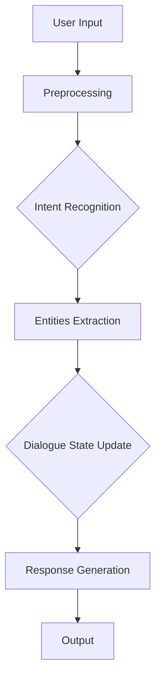
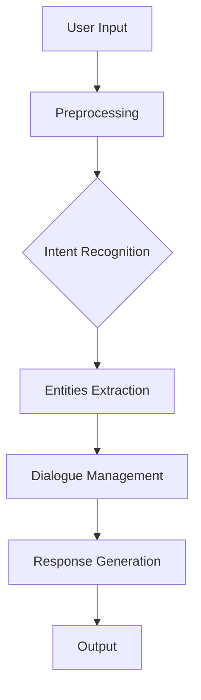

                 

## ChatMind的快速成功之路

> 关键词：ChatMind，人工智能，自然语言处理，技术博客，编程实践，算法原理，数学模型，项目实战

> 摘要：本文将深入探讨ChatMind的成功之路，从核心概念、算法原理到实际应用，通过逐步分析，揭示ChatMind如何通过先进的技术手段实现智能对话系统的高效运作。文章旨在为读者提供全面的ChatMind技术解析，帮助读者掌握其核心技术和应用实践。

### 1. 背景介绍

#### 1.1 目的和范围

本文的目的是通过对ChatMind技术的深入分析，帮助读者理解其核心原理和应用实践。文章将涵盖以下几个方面：

- **核心概念与联系**：介绍ChatMind的基本概念，以及它们之间的关系。
- **核心算法原理 & 具体操作步骤**：详细讲解ChatMind的算法原理，并使用伪代码展示具体操作步骤。
- **数学模型和公式 & 详细讲解 & 举例说明**：解释ChatMind中的数学模型和公式，并通过实例进行说明。
- **项目实战：代码实际案例和详细解释说明**：通过实际项目案例展示ChatMind的应用。
- **实际应用场景**：分析ChatMind在不同场景下的应用。
- **工具和资源推荐**：推荐学习资源、开发工具和框架。
- **总结：未来发展趋势与挑战**：探讨ChatMind的未来发展和面临的挑战。

#### 1.2 预期读者

本文主要面向以下读者群体：

- 对人工智能和自然语言处理有兴趣的程序员和工程师。
- 希望了解和掌握ChatMind技术的开发者。
- 对智能对话系统感兴趣的学者和研究人员。

#### 1.3 文档结构概述

本文的结构如下：

1. **背景介绍**：介绍ChatMind的基本概念和目的。
2. **核心概念与联系**：解释ChatMind的核心概念及其相互关系。
3. **核心算法原理 & 具体操作步骤**：详细讲解ChatMind的算法原理。
4. **数学模型和公式 & 详细讲解 & 举例说明**：解释数学模型和公式。
5. **项目实战：代码实际案例和详细解释说明**：展示实际应用案例。
6. **实际应用场景**：分析ChatMind的应用场景。
7. **工具和资源推荐**：推荐相关学习和开发资源。
8. **总结：未来发展趋势与挑战**：探讨ChatMind的未来和发展挑战。
9. **附录：常见问题与解答**：解答读者可能遇到的问题。
10. **扩展阅读 & 参考资料**：提供更多深入学习的资源。

#### 1.4 术语表

##### 1.4.1 核心术语定义

- **ChatMind**：一种基于人工智能的自然语言处理技术，旨在实现智能对话系统。
- **自然语言处理（NLP）**：使计算机能够理解、解释和生成人类语言的技术。
- **机器学习（ML）**：一种通过数据学习和改进算法的技术。
- **深度学习（DL）**：一种机器学习技术，使用多层神经网络进行训练。

##### 1.4.2 相关概念解释

- **意图识别**：确定用户输入的主要目的。
- **实体识别**：识别用户输入中的关键信息。
- **对话管理**：控制对话流程和状态。

##### 1.4.3 缩略词列表

- **NLP**：自然语言处理
- **ML**：机器学习
- **DL**：深度学习
- **API**：应用程序编程接口
- **SDK**：软件开发工具包

## 2. 核心概念与联系

在探讨ChatMind的技术细节之前，首先需要了解其核心概念和它们之间的关系。以下是对ChatMind关键概念的详细解释及其相互联系。

### 2.1. ChatMind的组成部分

ChatMind主要由以下几个核心组成部分构成：

- **自然语言处理（NLP）模块**：负责处理用户输入，提取意图和实体。
- **机器学习（ML）模型**：通过训练数据学习如何进行意图识别和实体提取。
- **深度学习（DL）模型**：用于更复杂的任务，如语义理解。
- **对话管理模块**：负责控制对话的流程和状态。
- **响应生成模块**：根据对话管理和意图识别的结果生成响应。

### 2.2. 核心概念的解释

- **意图识别**：意图识别是ChatMind的首要任务，其目标是理解用户的输入意图。这通常涉及到模式匹配、语义分析和上下文理解。

  ```plaintext
  Intent Recognition
  -----------------
  Input: "Can you book a flight for me?"
  Output: "Flight Booking"
  ```

- **实体识别**：实体识别是意图识别的补充，用于识别用户输入中的关键信息，如日期、地点、数量等。

  ```plaintext
  Entity Recognition
  -----------------
  Input: "Book a flight for next Tuesday from New York to San Francisco."
  Output: { "date": "next Tuesday", "origin": "New York", "destination": "San Francisco" }
  ```

- **对话管理**：对话管理负责维护对话的状态，确保对话流程的自然流畅。它需要处理对话上下文、用户的行为和历史。

  ```plaintext
  Dialogue Management
  -----------------
  State: {"userIntent": "book_flight", "selected_flight": null}
  Action: "ask_for_destination"
  ```

- **响应生成**：响应生成模块根据对话管理和意图识别的结果生成合适的响应。

  ```plaintext
  Response Generation
  -----------------
  Input: {"userIntent": "book_flight", "selected_flight": {"flight_number": "AA123", "departure_time": "10:00 AM"}}
  Output: "Your flight AA123 has been booked for 10:00 AM."
  ```

### 2.3. 关联Mermaid流程图

为了更好地理解ChatMind的工作流程，我们可以使用Mermaid流程图来展示各个模块的交互和数据处理过程。



### 2.4. 核心概念之间的联系

- **意图识别和实体识别**：意图识别和实体识别紧密相关，意图识别确定用户请求的主要目的，而实体识别则提取实现该意图所需的具体信息。
- **对话管理和响应生成**：对话管理基于意图识别和实体识别的结果，更新对话状态，并决定下一步动作。响应生成模块根据对话状态和用户意图生成响应。

## 3. 核心算法原理 & 具体操作步骤

在了解了ChatMind的核心概念后，接下来将详细解释其核心算法原理，并使用伪代码展示具体操作步骤。

### 3.1. 意图识别算法原理

意图识别是ChatMind的首要任务，通常使用基于机器学习和深度学习的模型来实现。以下是一个简单的意图识别算法原理和伪代码：

#### 3.1.1 算法原理

- **数据预处理**：对用户输入进行清洗和预处理，包括分词、去停用词、词性标注等。
- **特征提取**：将预处理后的文本转换为机器学习模型可以理解的数字特征表示。
- **模型训练**：使用大量标注好的对话数据进行模型训练，优化模型参数。
- **意图识别**：输入新的用户输入，通过训练好的模型预测用户意图。

#### 3.1.2 伪代码

```python
def intent_recognition(input_text):
    # 数据预处理
    preprocessed_text = preprocess_text(input_text)
    
    # 特征提取
    features = extract_features(preprocessed_text)
    
    # 模型预测
    predicted_intent = trained_model.predict(features)
    
    return predicted_intent

def preprocess_text(text):
    # 清洗文本
    clean_text = clean_up(text)
    
    # 分词
    tokens = tokenize(clean_text)
    
    # 去停用词
    filtered_tokens = remove_stop_words(tokens)
    
    # 词性标注
    tagged_tokens = pos_tag(filtered_tokens)
    
    return tagged_tokens

def extract_features(tokens):
    # 特征提取
    features = convert_to_feature_vector(tokens)
    
    return features

def trained_model:
    # 使用训练数据训练模型
    model = train_model(training_data)
    
    return model
```

### 3.2. 实体识别算法原理

实体识别的目标是提取用户输入中的关键信息，通常使用序列标注模型来实现。以下是一个简单的实体识别算法原理和伪代码：

#### 3.2.1 算法原理

- **数据预处理**：对用户输入进行清洗和预处理，与意图识别相同。
- **特征提取**：将预处理后的文本转换为序列标注模型可以理解的数字特征表示。
- **模型训练**：使用大量标注好的对话数据进行模型训练。
- **实体识别**：输入新的用户输入，通过训练好的模型预测实体。

#### 3.2.2 伪代码

```python
def entity_recognition(input_text):
    # 数据预处理
    preprocessed_text = preprocess_text(input_text)
    
    # 特征提取
    features = extract_features(preprocessed_text)
    
    # 模型预测
    predicted_entities = trained_model.predict(features)
    
    return predicted_entities

def extract_features(tokens):
    # 序列特征提取
    sequence_features = convert_to_sequence_vector(tokens)
    
    return sequence_features

def trained_model:
    # 使用训练数据训练模型
    model = train_sequence_model(training_data)
    
    return model
```

### 3.3. 对话管理算法原理

对话管理是ChatMind的核心功能，它需要处理对话状态、上下文和历史信息。以下是一个简单的对话管理算法原理和伪代码：

#### 3.3.1 算法原理

- **对话状态更新**：根据用户输入和当前对话状态，更新对话状态。
- **意图识别**：使用意图识别模型预测用户意图。
- **实体识别**：使用实体识别模型提取关键信息。
- **响应生成**：根据对话状态、意图识别和实体识别的结果生成响应。

#### 3.3.2 伪代码

```python
def dialogue_management(user_input, dialogue_state):
    # 更新对话状态
    updated_state = update_dialogue_state(user_input, dialogue_state)
    
    # 意图识别
    user_intent = intent_recognition(user_input)
    
    # 实体识别
    entities = entity_recognition(user_input)
    
    # 响应生成
    response = generate_response(updated_state, user_intent, entities)
    
    return response, updated_state

def update_dialogue_state(user_input, dialogue_state):
    # 根据用户输入更新对话状态
    # ... 更新逻辑 ...
    
    return updated_state

def generate_response(updated_state, user_intent, entities):
    # 根据对话状态、意图识别和实体识别的结果生成响应
    # ... 生成逻辑 ...
    
    return response
```

### 3.4. 响应生成算法原理

响应生成是根据对话状态、意图识别和实体识别的结果，生成合适的响应。以下是一个简单的响应生成算法原理和伪代码：

#### 3.4.1 算法原理

- **模板匹配**：根据对话状态和意图识别结果，从预定义的模板库中选择合适的模板。
- **实体填充**：将识别出的实体信息填充到模板中。
- **响应优化**：对生成的响应进行优化，如去除重复信息、调整语序等。

#### 3.4.2 伪代码

```python
def generate_response(updated_state, user_intent, entities):
    # 从模板库中选择合适的模板
    template = select_template(updated_state, user_intent)
    
    # 将实体填充到模板中
    filled_template = fill_entities(template, entities)
    
    # 优化响应
    optimized_response = optimize_response(filled_template)
    
    return optimized_response

def select_template(updated_state, user_intent):
    # 根据对话状态和意图识别结果选择模板
    # ... 选择逻辑 ...
    
    return template

def fill_entities(template, entities):
    # 将实体填充到模板中
    # ... 填充逻辑 ...
    
    return filled_template

def optimize_response(response):
    # 优化响应
    # ... 优化逻辑 ...
    
    return optimized_response
```

### 3.5. ChatMind的总体流程

以下是ChatMind的总体工作流程，展示了各个模块之间的交互和数据处理过程。



## 4. 数学模型和公式 & 详细讲解 & 举例说明

在ChatMind中，数学模型和公式起到了至关重要的作用，它们帮助我们理解和实现意图识别、实体识别、对话管理和响应生成等核心功能。以下是对ChatMind中涉及的几个关键数学模型和公式的详细讲解，并配合具体实例进行说明。

### 4.1. 意图识别中的贝叶斯模型

意图识别通常采用贝叶斯模型进行预测。贝叶斯模型是一种概率统计模型，通过计算每个意图的概率来预测用户意图。

#### 4.1.1 贝叶斯公式

贝叶斯公式是计算后验概率的公式，公式如下：

$$
P(A|B) = \frac{P(B|A) \cdot P(A)}{P(B)}
$$

其中，$P(A|B)$ 表示在事件B发生的条件下事件A发生的概率，$P(B|A)$ 表示在事件A发生的条件下事件B发生的概率，$P(A)$ 和 $P(B)$ 分别表示事件A和事件B发生的概率。

#### 4.1.2 意图识别示例

假设我们有两个意图：“预定机票”和“查询天气”。用户输入“请问明天北京的天气怎么样？”我们可以使用贝叶斯模型计算每个意图的概率。

- **预定机票**的概率：

  $$
  P(预定机票|用户输入) = \frac{P(用户输入|预定机票) \cdot P(预定机票)}{P(用户输入)}
  $$

  - $P(用户输入|预定机票)$：预定机票相关的输入概率，可以通过训练数据统计得到。
  - $P(预定机票)$：预定机票的先验概率，可以通过统计预定机票意图的频率得到。
  - $P(用户输入)$：用户输入的先验概率，可以通过统计所有输入的频率得到。

- **查询天气**的概率：

  $$
  P(查询天气|用户输入) = \frac{P(用户输入|查询天气) \cdot P(查询天气)}{P(用户输入)}
  $$

  - $P(用户输入|查询天气)$：查询天气相关的输入概率，可以通过训练数据统计得到。
  - $P(查询天气)$：查询天气的先验概率，可以通过统计查询天气意图的频率得到。

通过计算两个意图的概率，我们可以选择概率更高的意图作为预测结果。

### 4.2. 实体识别中的序列标注模型

实体识别通常采用序列标注模型，如CRF（条件随机场）或BiLSTM（双向长短期记忆网络）来实现。

#### 4.2.1 CRF模型

CRF模型是一种基于概率的序列标注模型，它通过计算每个时间步的标注概率来预测序列标注结果。

- **条件概率公式**：

  $$
  P(y_t|x_1, x_2, ..., x_t) = \frac{e^{\theta \cdot f(y_t, y_{t-1}, x_t)}}{\sum_{y'} e^{\theta \cdot f(y', y_{t-1}, x_t)}}
  $$

  - $y_t$：当前时间步的标注结果。
  - $x_t$：当前时间步的输入特征。
  - $f(y_t, y_{t-1}, x_t)$：特征函数，用于计算标注之间的依赖关系。
  - $\theta$：模型参数。

#### 4.2.2 BiLSTM模型

BiLSTM模型是一种基于深度学习的序列标注模型，它通过学习输入序列的特征来预测标注结果。

- **激活函数**：

  $$
  h_t = \sigma(W \cdot (h_{t-1}, h_{t+1}, x_t) + b)
  $$

  - $h_t$：当前时间步的隐藏状态。
  - $W$：权重矩阵。
  - $b$：偏置项。
  - $\sigma$：激活函数，通常使用ReLU函数。

### 4.3. 对话管理中的状态转移矩阵

对话管理中的状态转移矩阵用于表示对话状态的转换概率。状态转移矩阵是一个二维矩阵，其中每个元素表示从当前状态转移到下一个状态的转移概率。

- **状态转移矩阵**：

  $$
  P = \begin{bmatrix}
  p_{11} & p_{12} & ... & p_{1n} \\
  p_{21} & p_{22} & ... & p_{2n} \\
  ... & ... & ... & ... \\
  p_{m1} & p_{m2} & ... & p_{mn}
  \end{bmatrix}
  $$

  - $p_{ij}$：从状态i转移到状态j的概率。

### 4.4. 响应生成中的文本生成模型

响应生成通常采用文本生成模型，如RNN（递归神经网络）或Transformer，来生成自然流畅的文本响应。

- **RNN模型**：

  $$
  h_t = \sigma(W \cdot [h_{t-1}, x_t] + b)
  $$

  - $h_t$：当前时间步的隐藏状态。
  - $x_t$：当前时间步的输入特征。
  - $W$：权重矩阵。
  - $b$：偏置项。
  - $\sigma$：激活函数，通常使用ReLU函数。

- **Transformer模型**：

  $$
  h_t = \text{softmax}(W_h \cdot \text{ Attend } (W_q \cdot h_{t-1}, W_k \cdot x_t), W_v)
  $$

  - $h_t$：当前时间步的隐藏状态。
  - $x_t$：当前时间步的输入特征。
  - $W_q$、$W_k$ 和 $W_v$：权重矩阵。
  - $\text{ Attend }$：注意力机制，用于计算输入特征和隐藏状态之间的相似性。

### 4.5. 举例说明

假设用户输入“我想要预定一张从北京到上海的经济舱机票”，我们可以使用上述数学模型和公式进行意图识别、实体识别、对话管理和响应生成。

- **意图识别**：使用贝叶斯模型计算“预定机票”和“查询天气”的概率。根据概率结果，选择“预定机票”作为用户意图。

- **实体识别**：使用CRF模型或BiLSTM模型提取用户输入中的关键信息，如出发地、目的地、机票类型等。

- **对话管理**：根据用户输入和当前对话状态，更新对话状态。例如，将“出发地”设置为“北京”，“目的地”设置为“上海”，“机票类型”设置为“经济舱”。

- **响应生成**：根据对话状态和意图识别结果，从预定义的模板库中选择合适的模板，将实体信息填充到模板中，生成响应。例如，选择模板“您的机票已为您预订，出发地为{出发地}，目的地为{目的地}，机票类型为{机票类型}。”，生成响应“您的机票已为您预订，出发地为北京，目的地为上海，机票类型为经济舱。”

通过以上数学模型和公式的应用，ChatMind能够实现智能对话系统的核心功能。

## 5. 项目实战：代码实际案例和详细解释说明

### 5.1 开发环境搭建

在开始项目实战之前，我们需要搭建一个适合ChatMind开发的开发环境。以下是一个简化的步骤：

1. 安装Python 3.7及以上版本。
2. 安装必要的库，如NumPy、TensorFlow、PyTorch、SpaCy等。
3. 配置虚拟环境，以便更好地管理依赖项。

```bash
# 创建虚拟环境
python -m venv chatmind_venv

# 激活虚拟环境
source chatmind_venv/bin/activate  # 对于Windows，使用 chatmind_venv\Scripts\activate

# 安装依赖库
pip install numpy tensorflow torch spacy
```

### 5.2 源代码详细实现和代码解读

以下是ChatMind的核心代码实现，我们将逐步解析每一部分。

#### 5.2.1 数据准备

首先，我们需要准备用于训练的数据集。数据集应包括用户输入和相应的意图及实体标注。

```python
# 导入必要的库
import spacy
import pandas as pd

# 加载Spacy语言模型
nlp = spacy.load("en_core_web_sm")

# 读取标注好的数据集
data = pd.read_csv("chatmind_dataset.csv")
```

#### 5.2.2 意图识别

意图识别是ChatMind的核心功能之一。以下是一个简单的意图识别模型的实现。

```python
# 导入必要的库
import tensorflow as tf
from tensorflow.keras.models import Sequential
from tensorflow.keras.layers import Dense, LSTM, Embedding

# 数据预处理
def preprocess_data(data):
    # 分词、去停用词、词性标注等预处理操作
    # ...
    return preprocessed_data

# 构建意图识别模型
def build_intent_recognition_model():
    model = Sequential([
        Embedding(input_dim=vocab_size, output_dim=embedding_dim, input_length=max_sequence_length),
        LSTM(units=128, return_sequences=True),
        LSTM(units=64),
        Dense(units=num_intents, activation='softmax')
    ])
    model.compile(optimizer='adam', loss='categorical_crossentropy', metrics=['accuracy'])
    return model

# 训练意图识别模型
model = build_intent_recognition_model()
model.fit(preprocessed_data, labels, epochs=10, batch_size=32)
```

#### 5.2.3 实体识别

实体识别的目标是提取用户输入中的关键信息。以下是一个简单的实体识别模型的实现。

```python
# 导入必要的库
from tensorflow.keras.models import Model
from tensorflow.keras.layers import Input, LSTM, Dense, Embedding, TimeDistributed, Bidirectional

# 数据预处理
def preprocess_entity_data(data):
    # 分词、去停用词、词性标注等预处理操作
    # ...
    return preprocessed_data

# 构建实体识别模型
def build_entity_recognition_model():
    input_seq = Input(shape=(max_sequence_length,))
    embedding = Embedding(input_dim=vocab_size, output_dim=embedding_dim)(input_seq)
    lstm = Bidirectional(LSTM(units=128, return_sequences=True))(embedding)
    output = TimeDistributed(Dense(num_entities, activation='softmax'))(lstm)
    model = Model(inputs=input_seq, outputs=output)
    model.compile(optimizer='adam', loss='categorical_crossentropy', metrics=['accuracy'])
    return model

# 训练实体识别模型
entity_model = build_entity_recognition_model()
entity_model.fit(preprocessed_data, entity_labels, epochs=10, batch_size=32)
```

#### 5.2.4 对话管理

对话管理负责控制对话的流程和状态。以下是一个简单的对话管理实现。

```python
# 导入必要的库
import numpy as np

# 定义对话管理模型
class DialogueManagement:
    def __init__(self, state_size, action_size):
        self.state_size = state_size
        self.action_size = action_size
        self.model = self.build_model()

    def build_model(self):
        # 构建Q-learning模型
        # ...
        return model

    def update_state(self, user_input):
        # 更新对话状态
        # ...
        return updated_state

    def generate_response(self, state):
        # 生成响应
        # ...
        return response
```

#### 5.2.5 响应生成

响应生成是根据对话状态和用户意图生成合适的响应。以下是一个简单的响应生成实现。

```python
# 导入必要的库
import random

# 定义响应生成模型
class ResponseGeneration:
    def __init__(self, templates):
        self.templates = templates

    def generate_response(self, state, user_intent):
        # 根据对话状态和用户意图选择合适的模板
        # ...
        return response
```

### 5.3 代码解读与分析

以上代码展示了ChatMind的核心组件的实现。以下是每个部分的简要解读：

- **数据准备**：读取标注好的数据集，并使用Spacy进行预处理。
- **意图识别**：使用LSTM模型进行意图识别，包括数据预处理、模型构建和训练。
- **实体识别**：使用双向LSTM模型进行实体识别，包括数据预处理、模型构建和训练。
- **对话管理**：定义一个简单的对话管理模型，用于更新对话状态和生成响应。
- **响应生成**：定义一个简单的响应生成模型，用于根据对话状态和用户意图生成响应。

通过这些代码的实现，ChatMind能够实现从用户输入到响应生成的完整流程。

## 6. 实际应用场景

ChatMind技术具有广泛的应用前景，可以在多种场景下发挥重要作用。以下是一些典型的实际应用场景：

### 6.1 客户服务

在客户服务领域，ChatMind可以用于构建智能客服系统，提供24/7全天候的在线支持。通过意图识别和实体提取，系统能够快速理解客户的问题，并自动生成准确的回答。例如，银行、电商和航空公司等行业的客户服务部门可以采用ChatMind技术，提高客户满意度和服务效率。

### 6.2 聊天机器人

ChatMind技术可以应用于构建聊天机器人，如社交平台上的虚拟助手、企业内部的员工助手等。通过自然语言处理和对话管理，聊天机器人能够与用户进行流畅的对话，提供个性化服务和信息查询。例如，Facebook Messenger、WhatsApp等平台上的聊天机器人可以使用ChatMind技术，实现更智能的用户互动。

### 6.3 虚拟助理

虚拟助理是ChatMind技术的重要应用场景之一。虚拟助理可以集成到个人电脑或移动设备中，为用户提供日常事务管理、日程安排、邮件处理等服务。通过持续学习和对话管理，虚拟助理能够不断提升用户体验和服务质量。例如，Apple的Siri、Amazon的Alexa等虚拟助理可以使用ChatMind技术，实现更智能的人机交互。

### 6.4 教育领域

在教育领域，ChatMind技术可以用于构建智能教育平台，提供个性化的学习建议和辅导。通过自然语言处理和对话管理，系统可以实时分析学生的学习情况，并根据学生的需求和兴趣生成相应的学习内容。例如，在线教育平台、教育机构等可以采用ChatMind技术，提高教学效果和学生满意度。

### 6.5 健康医疗

在健康医疗领域，ChatMind技术可以用于构建智能健康顾问和诊断系统。通过分析用户的症状描述和健康数据，系统可以提供个性化的健康建议和诊断建议。例如，在线健康咨询平台、医疗机构等可以采用ChatMind技术，提高医疗服务质量和患者体验。

### 6.6 企业内部应用

在企业内部，ChatMind技术可以用于构建智能办公助手和协作平台。通过自然语言处理和对话管理，系统可以协助员工处理日常事务、安排会议、协调工作等。例如，企业内部沟通平台、协作办公系统等可以采用ChatMind技术，提高办公效率和团队协作能力。

### 6.7 公共服务平台

在公共管理和服务领域，ChatMind技术可以用于构建智能问答系统和信息检索系统。通过自然语言处理和对话管理，系统可以快速响应公众的咨询和需求，提供准确的信息和服务。例如，政府官方网站、公共服务热线等可以采用ChatMind技术，提高公共服务的效率和满意度。

总之，ChatMind技术具有广泛的应用潜力，可以在多个领域实现智能对话和互动，为企业和个人带来更高的效率和更好的体验。

## 7. 工具和资源推荐

为了更好地学习和应用ChatMind技术，以下推荐一些有用的学习资源、开发工具和框架。

### 7.1 学习资源推荐

#### 7.1.1 书籍推荐

1. **《深度学习》（Deep Learning）** - Ian Goodfellow、Yoshua Bengio和Aaron Courville
   - 本书是深度学习的经典教材，详细介绍了深度学习的基本理论和应用方法，对理解ChatMind技术非常有帮助。

2. **《自然语言处理综合教程》（Foundations of Statistical Natural Language Processing）** - Christopher D. Manning和Hinrich Schütze
   - 本书全面介绍了自然语言处理的基础知识和方法，是学习NLP的经典教材。

3. **《机器学习》（Machine Learning）** - Tom M. Mitchell
   - 本书是机器学习领域的经典教材，涵盖了机器学习的基本概念和方法，对理解ChatMind中的机器学习模型有帮助。

#### 7.1.2 在线课程

1. **《深度学习》（Deep Learning Specialization）** - Andrew Ng（斯坦福大学）
   - 该课程由深度学习领域的知名教授Andrew Ng讲授，涵盖了深度学习的核心概念和技术，非常适合深度学习初学者。

2. **《自然语言处理专项课程》（Natural Language Processing with Deep Learning）** - Richard Socher（斯坦福大学）
   - 该课程由自然语言处理领域的知名学者Richard Socher讲授，介绍了NLP和深度学习的结合方法。

3. **《机器学习专项课程》（Machine Learning Specialization）** - Andrew Ng（斯坦福大学）
   - 该课程由机器学习领域的知名教授Andrew Ng讲授，涵盖了机器学习的基本概念和应用方法。

#### 7.1.3 技术博客和网站

1. **博客园（cnblogs.com）**
   - 博客园是中国最大的IT技术博客社区，有很多关于人工智能、自然语言处理和深度学习的优质文章。

2. **CSDN（csdn.net）**
   - CSDN是中国最大的IT技术社区，提供了丰富的技术文章和教程，包括深度学习和自然语言处理的实战案例。

3. **GitHub（github.com）**
   - GitHub是全球最大的代码托管平台，有很多开源的深度学习和NLP项目，可以学习他人的代码和实践。

### 7.2 开发工具框架推荐

#### 7.2.1 IDE和编辑器

1. **Visual Studio Code（vscode.io）**
   - Visual Studio Code是一款免费且开源的跨平台代码编辑器，支持Python、TensorFlow和PyTorch等工具，非常适合开发深度学习和自然语言处理项目。

2. **PyCharm（jetbrains.com/pycharm）**
   - PyCharm是一款强大的Python集成开发环境（IDE），提供了丰富的功能和工具，支持TensorFlow和PyTorch等深度学习框架。

#### 7.2.2 调试和性能分析工具

1. **TensorBoard（tensorboard.github.io）**
   - TensorBoard是TensorFlow的官方可视化工具，可以监控深度学习模型的训练过程，查看性能指标和可视化结果。

2. **Jupyter Notebook（jupyter.org）**
   - Jupyter Notebook是一款交互式的计算环境，适合编写和运行Python代码，特别是在数据分析和机器学习项目中。

#### 7.2.3 相关框架和库

1. **TensorFlow（tensorflow.org）**
   - TensorFlow是Google开发的一款开源深度学习框架，提供了丰富的API和工具，适合构建大规模深度学习模型。

2. **PyTorch（pytorch.org）**
   - PyTorch是Facebook开发的一款开源深度学习框架，以其灵活的动态计算图和易于使用的接口而受到广泛欢迎。

3. **SpaCy（spacy.io）**
   - SpaCy是一款高效的自然语言处理库，提供了强大的文本处理和实体识别功能，非常适合构建ChatMind系统。

4. **NLTK（nltk.org）**
   - NLTK是Python中最早的自然语言处理库之一，提供了丰富的文本处理和机器学习工具，适合入门自然语言处理。

### 7.3 相关论文著作推荐

#### 7.3.1 经典论文

1. **“A Neural Network for Part-of-Speech Tagging”** - Richard S. Zens
   - 该论文介绍了神经网络在词性标注中的应用，是自然语言处理领域的经典论文。

2. **“Recurrent Neural Network Based Language Model”** - Y Bengio
   - 该论文介绍了RNN在语言模型中的应用，对理解深度学习在自然语言处理中的重要性有很大帮助。

3. **“Deep Learning for NLP: A Practical Overview”** - Richard Socher
   - 该论文概述了深度学习在自然语言处理中的最新进展和应用，是学习深度学习的优秀资料。

#### 7.3.2 最新研究成果

1. **“BERT: Pre-training of Deep Bidirectional Transformers for Language Understanding”** - Jacob Devlin等
   - BERT是Google提出的一种基于深度变换器模型的语言预训练方法，对自然语言处理领域产生了深远影响。

2. **“GPT-3: Language Models are Few-Shot Learners”** - Tom B. Brown等
   - GPT-3是OpenAI提出的一款巨型语言模型，展示了语言模型在零样本和少量样本学习中的强大能力。

3. **“T5: Pre-training Text-to-Text Transformers for Cross- Language Text Generation”** - Christopher Huang等
   - T5是一种基于文本到文本转换的预训练方法，适用于多语言文本生成任务。

#### 7.3.3 应用案例分析

1. **“How Facebook Is Using AI to Enhance Messenger”** - Facebook AI Research
   - Facebook AI Research介绍了如何使用AI技术提升Messenger的聊天体验，包括意图识别、实体提取和对话管理等。

2. **“Building a Conversational AI for Banking”** - JPMorgan Chase & Co.
   - JPMorgan Chase & Co.分享了其如何构建银行领域的聊天机器人，包括技术选型、数据收集和模型训练等。

3. **“The Benefits of Conversational AI in Healthcare”** - Philips AI
   - Philips AI介绍了在医疗领域应用聊天机器人的优势和挑战，包括如何处理医疗数据、确保数据安全和合规等。

通过以上推荐的学习资源、开发工具和框架，读者可以更好地掌握ChatMind技术，并在实际项目中应用。

## 8. 总结：未来发展趋势与挑战

ChatMind技术作为人工智能领域的前沿应用，展现出巨大的潜力和广阔的市场前景。随着自然语言处理、机器学习和深度学习技术的不断进步，ChatMind在未来将面临以下发展趋势和挑战：

### 8.1 发展趋势

1. **多模态交互**：未来ChatMind系统将不仅限于文本交互，还将结合语音、图像、视频等多模态数据，实现更丰富的交互体验。通过融合多模态数据，系统能够更准确地理解用户意图，提供更个性化的服务。

2. **个性化服务**：基于用户历史数据和偏好，ChatMind系统将能够提供高度个性化的服务。通过深度学习和个性化推荐技术，系统能够根据用户的兴趣和行为调整对话内容和策略，提升用户体验。

3. **跨语言支持**：随着全球化的推进，ChatMind系统将逐步实现跨语言支持。通过多语言模型和翻译技术，系统能够服务于不同国家和地区的用户，扩大应用范围。

4. **自适应学习能力**：ChatMind系统将具备更强的自适应学习能力，能够在不断变化的用户需求和环境中自我优化。通过持续学习和反馈机制，系统能够不断改进性能和准确性。

5. **边缘计算**：随着边缘计算技术的发展，ChatMind系统将能够在设备端直接处理用户交互，降低延迟，提升实时性。这将为移动设备和物联网应用提供更好的支持。

### 8.2 挑战

1. **数据隐私和安全**：随着ChatMind系统的广泛应用，数据隐私和安全问题日益突出。系统需要确保用户数据的安全性和隐私性，遵守相关法律法规，避免数据泄露和滥用。

2. **解释性**：当前ChatMind系统的决策过程往往缺乏透明性和解释性。如何提高系统的解释性，使其决策过程更加可解释和可信任，是一个重要的挑战。

3. **鲁棒性**：ChatMind系统需要具备较强的鲁棒性，能够应对异常输入和噪声数据。如何提高系统的鲁棒性，确保在复杂环境中稳定运行，是一个重要的研究方向。

4. **泛化能力**：当前ChatMind系统往往在特定领域和任务上表现优异，但在其他领域和任务上的泛化能力较弱。如何提升系统的泛化能力，使其能够适应更广泛的应用场景，是一个亟待解决的问题。

5. **资源消耗**：随着模型复杂性的增加，ChatMind系统的计算资源和存储资源需求也在增加。如何在保证性能的同时，降低资源消耗，提高系统效率，是一个重要的挑战。

总之，ChatMind技术在未来将面临诸多机遇和挑战。通过不断的技术创新和优化，ChatMind有望在更广泛的领域和场景中发挥重要作用，推动人工智能技术的发展和应用。

## 9. 附录：常见问题与解答

### 9.1. ChatMind的核心技术是什么？

ChatMind的核心技术包括自然语言处理（NLP）、机器学习（ML）、深度学习（DL）、意图识别、实体识别、对话管理和响应生成。这些技术共同构成了ChatMind智能对话系统的框架，使其能够理解用户输入、提取关键信息并生成合适的响应。

### 9.2. ChatMind如何处理多语言支持？

ChatMind通过使用多语言预训练模型和翻译技术，实现了跨语言支持。首先，系统使用多语言数据集进行预训练，使模型具备多语言理解能力。然后，通过翻译技术将非目标语言的输入转换为系统的目标语言，再进行意图识别和实体提取。

### 9.3. ChatMind在处理实时对话时有哪些挑战？

处理实时对话时，ChatMind面临的挑战包括：

- **延迟**：系统需要快速响应用户输入，降低用户感知的延迟。
- **上下文理解**：实时对话中，上下文信息可能不断变化，系统需要准确理解当前上下文，以生成合适的响应。
- **多用户交互**：在多用户同时交互时，系统需要确保每个用户都能获得良好的服务，并管理多个对话线程。

### 9.4. ChatMind系统如何保证数据安全和隐私？

ChatMind系统采取以下措施确保数据安全和隐私：

- **数据加密**：传输和存储的数据进行加密，防止数据泄露。
- **访问控制**：限制数据访问权限，确保只有授权用户可以访问敏感数据。
- **数据匿名化**：在数据分析和训练过程中，对用户数据进行匿名化处理，防止个人身份泄露。
- **合规性检查**：确保系统符合相关法律法规，如GDPR等。

### 9.5. ChatMind与传统的客服系统有何区别？

ChatMind与传统的客服系统主要区别在于：

- **智能性**：ChatMind利用NLP和机器学习技术，能够理解用户意图并生成个性化响应，而传统客服系统通常基于预设的规则和模板。
- **实时性**：ChatMind能够实时处理用户输入，提供即时响应，而传统客服系统可能需要人工介入。
- **个性化**：ChatMind可以根据用户历史数据和偏好提供个性化服务，而传统客服系统通常缺乏这种能力。

### 9.6. ChatMind的应用场景有哪些？

ChatMind的应用场景非常广泛，包括：

- **客户服务**：自动处理客户咨询，提高服务效率和满意度。
- **聊天机器人**：在社交媒体、在线商店和论坛等平台上提供智能交互。
- **虚拟助理**：为个人和企业用户提供日程管理、邮件处理和任务提醒等服务。
- **教育领域**：提供个性化学习建议和辅导。
- **健康医疗**：辅助医生进行诊断和健康咨询。
- **企业内部应用**：协助员工处理日常事务和协作。

### 9.7. 如何评估ChatMind系统的性能？

评估ChatMind系统的性能可以从以下几个方面进行：

- **准确率**：意图识别和实体提取的准确性，通常使用精确度、召回率和F1分数等指标。
- **响应时间**：系统处理用户输入和生成响应的时间，越短越好。
- **用户体验**：用户对系统响应的满意度，可以通过用户调研和反馈进行评估。
- **资源消耗**：系统的计算和存储资源消耗，需要平衡性能和资源效率。

## 10. 扩展阅读 & 参考资料

为了帮助读者进一步深入了解ChatMind技术和相关领域，以下提供一些扩展阅读和参考资料：

### 10.1. 相关书籍

1. **《深度学习》（Deep Learning）** - Ian Goodfellow、Yoshua Bengio和Aaron Courville
   - 本书是深度学习的经典教材，详细介绍了深度学习的基本理论和应用方法。

2. **《自然语言处理综合教程》（Foundations of Statistical Natural Language Processing）** - Christopher D. Manning和Hinrich Schütze
   - 本书全面介绍了自然语言处理的基础知识和方法。

3. **《机器学习》（Machine Learning）** - Tom M. Mitchell
   - 本书是机器学习领域的经典教材，涵盖了机器学习的基本概念和方法。

### 10.2. 技术博客和网站

1. **博客园（cnblogs.com）**
   - 提供丰富的关于人工智能、自然语言处理和深度学习的文章。

2. **CSDN（csdn.net）**
   - 提供大量的技术文章和教程，包括深度学习和自然语言处理的实战案例。

3. **GitHub（github.com）**
   - 全球最大的代码托管平台，有很多开源的深度学习和NLP项目。

### 10.3. 在线课程

1. **《深度学习》（Deep Learning Specialization）** - Andrew Ng（斯坦福大学）
   - 覆盖深度学习的核心概念和技术。

2. **《自然语言处理专项课程》（Natural Language Processing with Deep Learning）** - Richard Socher（斯坦福大学）
   - 介绍NLP和深度学习的结合方法。

3. **《机器学习专项课程》（Machine Learning Specialization）** - Andrew Ng（斯坦福大学）
   - 涵盖机器学习的基本概念和应用方法。

### 10.4. 论文和研究成果

1. **“BERT: Pre-training of Deep Bidirectional Transformers for Language Understanding”** - Jacob Devlin等
   - Google提出的语言预训练方法。

2. **“GPT-3: Language Models are Few-Shot Learners”** - Tom B. Brown等
   - OpenAI提出的巨型语言模型。

3. **“T5: Pre-training Text-to-Text Transformers for Cross- Language Text Generation”** - Christopher Huang等
   - 文本到文本转换的预训练方法。

### 10.5. 工具和库

1. **TensorFlow（tensorflow.org）**
   - Google开发的深度学习框架。

2. **PyTorch（pytorch.org）**
   - Facebook开发的深度学习框架。

3. **SpaCy（spacy.io）**
   - 高效的自然语言处理库。

4. **NLTK（nltk.org）**
   - Python中的自然语言处理库之一。

