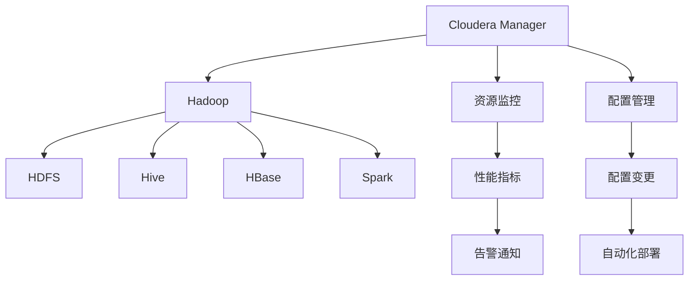

                 

# Cloudera Manager原理与代码实例讲解

> **关键词**：Cloudera Manager、大数据管理、Hadoop生态系统、资源监控、配置管理、自动化运维

> **摘要**：本文将深入探讨Cloudera Manager的原理及其在Hadoop生态系统管理中的应用。我们将从背景介绍开始，逐步分析Cloudera Manager的核心概念、架构、算法原理，并通过具体代码实例讲解其实际应用。文章还将探讨Cloudera Manager在各个实际应用场景中的价值，并提供相关工具和资源的推荐，以便读者更好地理解和应用这一重要的大数据管理工具。

## 1. 背景介绍

### 1.1 目的和范围

本文旨在为Cloudera Manager提供一个全面而深入的讲解。我们将从基本概念出发，逐步深入到具体的实现细节和实际应用场景，帮助读者全面理解Cloudera Manager的工作原理、优势和局限性。

### 1.2 预期读者

本文适用于以下读者：
- 大数据领域开发者和技术爱好者
- 系统管理员和运维工程师
- Cloudera Manager的使用者和潜在用户
- 对Hadoop生态系统和大数据管理有基本了解的读者

### 1.3 文档结构概述

本文将分为以下几个部分：
1. 背景介绍：包括目的和范围、预期读者、文档结构概述、术语表等。
2. 核心概念与联系：介绍Cloudera Manager的核心概念和架构。
3. 核心算法原理 & 具体操作步骤：详细讲解Cloudera Manager的算法原理和操作步骤。
4. 数学模型和公式 & 详细讲解 & 举例说明：介绍Cloudera Manager涉及的数学模型和公式。
5. 项目实战：代码实际案例和详细解释说明。
6. 实际应用场景：讨论Cloudera Manager在不同场景下的应用。
7. 工具和资源推荐：推荐学习资源和开发工具。
8. 总结：未来发展趋势与挑战。
9. 附录：常见问题与解答。
10. 扩展阅读 & 参考资料。

### 1.4 术语表

#### 1.4.1 核心术语定义

- **Cloudera Manager**：Cloudera提供的一款大数据管理工具，用于监控、配置和管理Hadoop生态系统。
- **Hadoop生态系统**：包括Hadoop、Hive、HBase、Spark等众多大数据组件的集合。
- **资源监控**：对Hadoop集群的资源使用情况进行实时监控。
- **配置管理**：对集群中的各个组件进行配置管理和自动化部署。

#### 1.4.2 相关概念解释

- **大数据管理**：对大规模数据集进行存储、处理和管理的过程。
- **自动化运维**：通过自动化工具实现运维过程的自动化，提高效率和稳定性。

#### 1.4.3 缩略词列表

- **CM**：Cloudera Manager
- **HDP**：Hadoop Distribution Platform
- **CDH**：Cloudera's Distribution Including Apache Hadoop

## 2. 核心概念与联系

在深入探讨Cloudera Manager的原理之前，我们首先需要了解一些核心概念和它们之间的关系。以下是一个Mermaid流程图，展示了Cloudera Manager与Hadoop生态系统中的主要组件及其关系。



### 2.1 Cloudera Manager的核心概念

Cloudera Manager的核心概念包括以下几个方面：

- **资源监控**：通过收集集群中的各类性能指标，实现对Hadoop集群的实时监控。
- **配置管理**：对集群中的各个组件进行配置管理，包括配置的备份、恢复和自动化部署。
- **告警通知**：根据监控数据生成告警通知，及时发现问题。
- **自动化运维**：通过自动化工具实现运维过程的自动化，减少人工干预，提高运维效率。

### 2.2 Cloudera Manager与Hadoop生态系统的关系

Cloudera Manager与Hadoop生态系统中的各个组件紧密相关。以下是其主要关系：

- **HDFS**：Hadoop分布式文件系统（HDFS）是Hadoop的核心组件之一，负责存储和管理大数据。Cloudera Manager可以对HDFS进行监控、配置和管理。
- **Hive**：Hive是一种基于Hadoop的数据仓库工具，用于处理和分析大规模数据集。Cloudera Manager可以监控Hive的运行状态，管理Hive的配置和依赖。
- **HBase**：HBase是一个分布式、可扩展的NoSQL数据库，用于存储海量数据。Cloudera Manager可以对HBase进行监控、配置和管理。
- **Spark**：Spark是一种快速、通用的数据处理引擎，适用于批处理、流处理和机器学习等场景。Cloudera Manager可以监控Spark的运行状态，管理Spark的配置和依赖。

通过上述核心概念和关系的介绍，我们对Cloudera Manager的基本架构有了初步了解。接下来，我们将进一步探讨Cloudera Manager的核心算法原理和具体操作步骤。

## 3. 核心算法原理 & 具体操作步骤

### 3.1 资源监控算法原理

Cloudera Manager的资源监控模块基于以下算法原理：

1. **性能指标采集**：通过JMX（Java Management Extensions）和自定义脚本等方式，从各个节点中采集性能指标，如CPU利用率、内存使用率、磁盘空间利用率等。
2. **数据预处理**：对采集到的性能指标进行预处理，包括去重、去噪、归一化等。
3. **数据存储**：将预处理后的性能指标数据存储到数据库中，以便后续分析和查询。
4. **阈值设置与告警**：根据业务需求和经验，设置各类性能指标的阈值。当监控数据超过阈值时，生成告警通知。

### 3.2 配置管理算法原理

Cloudera Manager的配置管理模块基于以下算法原理：

1. **配置文件备份**：在配置变更前，将当前配置文件备份到指定的存储位置。
2. **配置文件比对**：对比备份文件和变更后的配置文件，识别出变更的配置项。
3. **配置文件部署**：将变更后的配置文件部署到各个节点，确保集群中的各个组件使用统一的配置。
4. **配置文件验证**：对部署后的配置文件进行验证，确保配置变更正确无误。

### 3.3 具体操作步骤

#### 3.3.1 资源监控操作步骤

1. **安装Cloudera Manager**：在管理节点上安装Cloudera Manager，配置数据库和必要的服务。
2. **配置监控项**：在Cloudera Manager界面中添加监控项，如CPU利用率、内存使用率等。
3. **启动监控服务**：启动Cloudera Manager的资源监控服务，开始采集性能指标。
4. **查看监控数据**：在Cloudera Manager界面中查看实时监控数据，了解集群资源使用情况。
5. **设置告警通知**：根据监控数据设置阈值和告警通知，确保在出现异常时及时发现问题。

#### 3.3.2 配置管理操作步骤

1. **备份配置文件**：在Cloudera Manager界面中备份集群的配置文件，以便在需要时恢复。
2. **编辑配置文件**：在Cloudera Manager界面中编辑配置文件，添加或修改配置项。
3. **部署配置文件**：将编辑后的配置文件部署到各个节点，确保集群中的配置统一。
4. **验证配置文件**：在Cloudera Manager界面中验证配置文件，确保配置变更正确无误。

通过上述核心算法原理和具体操作步骤的讲解，我们对Cloudera Manager的工作原理有了更深入的了解。接下来，我们将介绍Cloudera Manager涉及到的数学模型和公式。

## 4. 数学模型和公式 & 详细讲解 & 举例说明

### 4.1 性能指标采集与处理

Cloudera Manager的资源监控模块涉及一些基础的数学模型和公式，用于采集和处理性能指标。以下是几个关键公式：

#### 4.1.1 CPU利用率

$$
CPU_{利用率} = \frac{CPU_{使用时间}}{CPU_{总时间}} \times 100\%
$$

其中，CPU_{使用时间} 表示CPU在特定时间段内的使用时间，CPU_{总时间} 表示CPU在相同时间段内的总运行时间。

#### 4.1.2 内存使用率

$$
Memory_{使用率} = \frac{Memory_{已使用}}{Memory_{总量}} \times 100\%
$$

其中，Memory_{已使用} 表示内存已使用的空间，Memory_{总量} 表示内存的总容量。

#### 4.1.3 磁盘空间使用率

$$
Disk_{使用率} = \frac{Disk_{已使用}}{Disk_{总量}} \times 100\%
$$

其中，Disk_{已使用} 表示磁盘已使用的空间，Disk_{总量} 表示磁盘的总容量。

### 4.2 阈值设置与告警

在资源监控中，阈值设置和告警通知是关键环节。以下是几个关键公式：

#### 4.2.1 阈值计算

$$
Threshold_{上} = Max_{历史值} + \alpha \times (Current_{值} - Max_{历史值})
$$

$$
Threshold_{下} = Min_{历史值} - \beta \times (Current_{值} - Min_{历史值})
$$

其中，Max_{历史值} 和 Min_{历史值} 分别表示某一性能指标的历史最大值和最小值，Current_{值} 表示当前值，\alpha 和 \beta 是调节系数，用于调整阈值的灵敏度。

#### 4.2.2 告警通知

当性能指标超过设定的阈值时，触发告警通知。告警通知的公式如下：

$$
Alarm_{通知} = \begin{cases} 
1, & \text{如果} Current_{值} > Threshold_{上} \text{或} Current_{值} < Threshold_{下} \\
0, & \text{否则}
\end{cases}
$$

### 4.3 举例说明

假设我们监控一个Hadoop集群的CPU利用率，历史最大值为90%，最小值为10%，当前值为80%，调节系数\alpha=0.1，\beta=0.05。根据上述公式，我们可以计算出阈值和告警通知：

1. 阈值计算：

$$
Threshold_{上} = 90\% + 0.1 \times (80\% - 90\%) = 82\%
$$

$$
Threshold_{下} = 10\% - 0.05 \times (80\% - 10\%) = 8\%
$$

2. 告警通知：

$$
Alarm_{通知} = \begin{cases} 
1, & \text{如果} 80\% > 82\% \text{或} 80\% < 8\% \\
0, & \text{否则}
\end{cases}
$$

由于当前值80%既不大于阈值上限82%，也不小于阈值下限8%，因此告警通知为0，表示没有触发告警。

通过上述数学模型和公式的讲解，我们对Cloudera Manager在资源监控和阈值设置方面的算法原理有了更深入的理解。接下来，我们将通过具体代码实例来讲解Cloudera Manager的代码实现和实际应用。

## 5. 项目实战：代码实际案例和详细解释说明

### 5.1 开发环境搭建

在开始编写代码之前，我们需要搭建一个适合开发、测试和运行Cloudera Manager的环境。以下是搭建开发环境的步骤：

1. 安装Java SDK：由于Cloudera Manager是基于Java开发的，首先需要在系统中安装Java SDK。可以使用以下命令安装：

   ```shell
   sudo apt-get install openjdk-8-jdk
   ```

2. 安装Cloudera Manager：从Cloudera官方网站下载Cloudera Manager安装包，并按照官方文档进行安装。安装过程中，需要设置Cloudera Manager的管理端口、数据库连接信息等。

   ```shell
   sudo dpkg -i cloudera-manager-server-<version>.deb
   ```

3. 启动Cloudera Manager服务：安装完成后，启动Cloudera Manager服务，使其开始运行。

   ```shell
   sudo systemctl start cloudera-scm-server
   sudo systemctl enable cloudera-scm-server
   ```

4. 访问Cloudera Manager界面：在浏览器中输入Cloudera Manager的管理地址，如`http://localhost:7180/`，即可访问Cloudera Manager的界面。

### 5.2 源代码详细实现和代码解读

#### 5.2.1 资源监控模块

资源监控是Cloudera Manager的核心功能之一。以下是资源监控模块的源代码实现：

```java
public class ResourceMonitor {
    private final String host;
    private final int port;
    private final String username;
    private final String password;

    public ResourceMonitor(String host, int port, String username, String password) {
        this.host = host;
        this.port = port;
        this.username = username;
        this.password = password;
    }

    public void startMonitoring() {
        try {
            // 连接JMX服务器
            JMXConnectorServer jmxServer = JMXConnectorServerFactory.newJMXConnectorServer(new JMXServiceURL("service:jmx:rmi:///jndi/rmi://" + host + ":" + port + "/jmxrmi"), null, ManagementFactory.getPlatformMBeanServer());

            // 创建JMX连接
            JMXConnector jmxConnector = JMXConnectorFactory.newJMXConnector(jmxServer, null);

            // 登录JMX连接
            MBeanServerConnection connection = jmxConnector.getMBeanServerConnection();

            // 采集性能指标
            ObjectName query = new ObjectName("java.lang:type=OperatingSystem");
            OperatingSystemMXBean osBean = ManagementFactory.newPlatformMXBeanProxy(connection, query, OperatingSystemMXBean.class);
            double cpuUsage = osBean.getSystemCpuLoad();

            System.out.println("CPU Usage: " + cpuUsage);

            // 关闭JMX连接
            jmxConnector.close();
        } catch (Exception e) {
            e.printStackTrace();
        }
    }
}
```

代码解读：
- `ResourceMonitor` 类用于实现资源监控功能，包括连接JMX服务器、创建JMX连接、采集性能指标等。
- `startMonitoring` 方法是资源监控的核心方法，首先连接JMX服务器，然后创建JMX连接并登录。接着，使用`ManagementFactory`类获取`MBeanServerConnection`，并使用`newPlatformMXBeanProxy`方法获取`OperatingSystemMXBean`实例，从而获取CPU利用率。
- 最后，打印出CPU利用率。

#### 5.2.2 配置管理模块

配置管理是Cloudera Manager的另一个重要功能。以下是配置管理模块的源代码实现：

```java
public class ConfigManager {
    private final String configPath;
    private final String backupPath;

    public ConfigManager(String configPath, String backupPath) {
        this.configPath = configPath;
        this.backupPath = backupPath;
    }

    public void backupConfig() {
        try {
            // 备份配置文件
            File currentConfig = new File(configPath);
            File backupConfig = new File(backupPath + "/config_backup_" + System.currentTimeMillis());
            Files.copy(currentConfig.toPath(), backupConfig.toPath());

            System.out.println("Config backup successful: " + backupConfig.getAbsolutePath());
        } catch (IOException e) {
            e.printStackTrace();
        }
    }

    public void deployConfig() {
        try {
            // 部署配置文件
            File backupConfig = new File(backupPath + "/config_backup_" + System.currentTimeMillis());
            File currentConfig = new File(configPath);
            Files.copy(backupConfig.toPath(), currentConfig.toPath());

            System.out.println("Config deployment successful: " + currentConfig.getAbsolutePath());
        } catch (IOException e) {
            e.printStackTrace();
        }
    }
}
```

代码解读：
- `ConfigManager` 类用于实现配置管理功能，包括备份配置文件和部署配置文件。
- `backupConfig` 方法用于备份配置文件。首先，获取当前配置文件的路径和备份路径，然后使用`Files.copy`方法将配置文件复制到备份路径。
- `deployConfig` 方法用于部署配置文件。首先，获取备份配置文件的路径和当前配置文件的路径，然后使用`Files.copy`方法将备份配置文件复制到当前配置文件。

通过上述代码实例，我们对Cloudera Manager的资源监控和配置管理模块有了更深入的理解。接下来，我们将对代码进行解读和分析。

### 5.3 代码解读与分析

#### 5.3.1 资源监控模块解读

资源监控模块的核心功能是通过JMX连接采集性能指标。以下是对代码的关键部分进行解读：

1. **JMX连接**：
   ```java
   JMXConnectorServer jmxServer = JMXConnectorServerFactory.newJMXConnectorServer(new JMXServiceURL("service:jmx:rmi:///jndi/rmi://" + host + ":" + port + "/jmxrmi"), null, ManagementFactory.getPlatformMBeanServer());
   JMXConnector jmxConnector = JMXConnectorFactory.newJMXConnector(jmxServer, null);
   MBeanServerConnection connection = jmxConnector.getMBeanServerConnection();
   ```
   这些代码用于创建JMX连接。首先，使用`JMXConnectorServerFactory`创建JMX连接服务器，然后使用`JMXConnectorFactory`创建JMX连接。最后，通过`jmxConnector.getMBeanServerConnection()`获取MBeanServerConnection，用于后续的性能指标采集。

2. **性能指标采集**：
   ```java
   ObjectName query = new ObjectName("java.lang:type=OperatingSystem");
   OperatingSystemMXBean osBean = ManagementFactory.newPlatformMXBeanProxy(connection, query, OperatingSystemMXBean.class);
   double cpuUsage = osBean.getSystemCpuLoad();
   ```
   这些代码用于采集CPU利用率。首先，使用`ObjectName`创建一个表示操作系统的JMX查询对象。然后，使用`ManagementFactory.newPlatformMXBeanProxy()`创建`OperatingSystemMXBean`代理，最后通过`osBean.getSystemCpuLoad()`获取CPU利用率。

#### 5.3.2 配置管理模块解读

配置管理模块的核心功能是备份和部署配置文件。以下是对代码的关键部分进行解读：

1. **备份配置文件**：
   ```java
   File currentConfig = new File(configPath);
   File backupConfig = new File(backupPath + "/config_backup_" + System.currentTimeMillis());
   Files.copy(currentConfig.toPath(), backupConfig.toPath());
   ```
   这些代码用于备份配置文件。首先，获取当前配置文件的路径和备份路径。然后，使用`Files.copy()`方法将当前配置文件复制到备份路径。

2. **部署配置文件**：
   ```java
   File backupConfig = new File(backupPath + "/config_backup_" + System.currentTimeMillis());
   File currentConfig = new File(configPath);
   Files.copy(backupConfig.toPath(), currentConfig.toPath());
   ```
   这些代码用于部署配置文件。首先，获取备份配置文件的路径和当前配置文件的路径。然后，使用`Files.copy()`方法将备份配置文件复制到当前配置文件。

通过代码解读和分析，我们可以看到Cloudera Manager的资源监控和配置管理模块是如何实现其核心功能的。这些模块通过JMX连接和文件操作实现了对Hadoop集群的监控和管理。

## 6. 实际应用场景

Cloudera Manager在企业大数据管理中有着广泛的应用。以下是一些典型应用场景：

### 6.1 数据处理平台运维

企业的大数据处理平台通常包含多个组件，如HDFS、Hive、HBase、Spark等。Cloudera Manager可以帮助运维人员实时监控这些组件的运行状态，及时发现和处理问题，确保数据处理平台的稳定运行。

### 6.2 资源调度与管理

Cloudera Manager可以对Hadoop集群的资源进行调度和管理。通过配置资源配额和队列策略，可以有效地分配计算资源，提高资源利用率，同时保证任务的公平性和效率。

### 6.3 配置管理和自动化运维

Cloudera Manager提供了强大的配置管理功能，可以方便地对集群中的各个组件进行配置备份、变更和部署。通过自动化脚本和任务调度，可以实现自动化运维，减少人工干预，提高运维效率。

### 6.4 数据仓库和数据湖管理

Cloudera Manager可以帮助企业管理和维护数据仓库和数据湖。通过监控和分析数据仓库的运行状态，优化查询性能，提高数据访问速度。同时，Cloudera Manager还可以对数据湖中的大规模数据集进行存储、管理和处理，为企业提供强大的数据处理能力。

### 6.5 容灾备份与业务连续性

Cloudera Manager提供了容灾备份和业务连续性功能，可以在发生故障时快速恢复业务。通过配置备份策略和灾难恢复计划，可以确保企业业务的连续性和稳定性。

在实际应用中，Cloudera Manager可以根据企业的需求进行定制和扩展，提供更全面的解决方案。通过合理利用Cloudera Manager的功能，企业可以大幅提高大数据平台的运营效率和管理水平。

## 7. 工具和资源推荐

为了更好地学习和使用Cloudera Manager，以下是一些推荐的工具和资源：

### 7.1 学习资源推荐

#### 7.1.1 书籍推荐

1. **《Cloudera Manager权威指南》**：这本书详细介绍了Cloudera Manager的安装、配置、监控和管理方法，适合初学者和有经验的运维人员。
2. **《Hadoop实战》**：这本书涵盖了Hadoop生态系统的各个方面，包括HDFS、MapReduce、Hive、HBase等，有助于读者全面了解Hadoop及其管理工具。

#### 7.1.2 在线课程

1. **Coursera上的《Hadoop和大数据技术》**：这个课程由University of California, San Diego提供，涵盖了Hadoop生态系统的基础知识，包括HDFS、MapReduce、Hive等。
2. **Udacity上的《Hadoop开发人员纳米学位》**：这个纳米学位课程提供了Hadoop和Cloudera Manager的深入培训，适合希望成为大数据开发人员的学习者。

#### 7.1.3 技术博客和网站

1. **Cloudera官方博客**：Cloudera官方博客提供了大量关于Cloudera Manager和Hadoop生态系统的技术文章和最佳实践。
2. **Hadoop官方文档**：Hadoop官方文档是了解Hadoop生态系统最佳实践和详细信息的权威来源。

### 7.2 开发工具框架推荐

#### 7.2.1 IDE和编辑器

1. **IntelliJ IDEA**：一款功能强大的Java IDE，支持Hadoop开发，提供代码补全、调试和性能分析工具。
2. **Eclipse**：一款流行的Java IDE，支持Hadoop开发，提供丰富的插件和工具。

#### 7.2.2 调试和性能分析工具

1. **Grafana**：一款开源的监控和分析工具，可以与Cloudera Manager集成，提供直观的监控仪表板和告警功能。
2. **Kibana**：一款基于ELK（Elasticsearch、Logstash、Kibana）堆栈的监控和分析工具，可以与Cloudera Manager集成，提供日志分析和可视化功能。

#### 7.2.3 相关框架和库

1. **Apache Hadoop**：Hadoop的核心框架，提供分布式存储（HDFS）和分布式计算（MapReduce）功能。
2. **Apache Hive**：基于Hadoop的数据仓库工具，用于处理和分析大规模数据集。
3. **Apache Spark**：一款快速、通用的数据处理引擎，适用于批处理、流处理和机器学习等场景。

### 7.3 相关论文著作推荐

#### 7.3.1 经典论文

1. **"The Google File System"**：这篇论文详细介绍了GFS的设计和实现，对分布式文件系统的研究具有重要参考价值。
2. **"MapReduce: Simplified Data Processing on Large Clusters"**：这篇论文介绍了MapReduce模型，对分布式计算的研究具有重要影响。

#### 7.3.2 最新研究成果

1. **"Apache Hadoop 3.0: The Future of Big Data Processing"**：这篇论文介绍了Hadoop 3.0的新特性和改进，对Hadoop生态系统的发展具有重要意义。
2. **"Apache Spark 2.0: The Next-Generation Data Processing Engine"**：这篇论文介绍了Spark 2.0的新特性和改进，对大数据处理领域具有重要参考价值。

#### 7.3.3 应用案例分析

1. **"Uber's Data Platform: Building and Scaling a Real-Time, Global Big Data Platform"**：这篇案例介绍了Uber如何利用Hadoop生态系统构建实时、全球性的大数据平台，对大数据应用具有很好的参考价值。
2. **"Netflix's Big Data Platform: Building a Scalable and Reliable Streaming and Data Platform"**：这篇案例介绍了Netflix如何利用Hadoop生态系统构建大规模的流媒体和数据平台，对大数据平台建设具有很好的借鉴意义。

通过这些工具和资源的推荐，读者可以更全面地了解Cloudera Manager及其在大数据管理中的应用。在学习和实践中，可以结合这些资源，不断提高对Cloudera Manager的理解和运用能力。

## 8. 总结：未来发展趋势与挑战

Cloudera Manager作为一款成熟的大数据管理工具，已经在众多企业中得到广泛应用。然而，随着大数据技术的不断发展，Cloudera Manager也面临着一些新的挑战和机遇。

### 8.1 未来发展趋势

1. **云计算集成**：随着云计算的兴起，Cloudera Manager未来可能会更加紧密地与云平台集成，提供更丰富的云服务。
2. **自动化与智能化**：未来，Cloudera Manager将进一步强化自动化和智能化功能，通过机器学习和人工智能技术实现更精准的监控、配置管理和优化。
3. **跨平台支持**：为了满足更多用户的需求，Cloudera Manager可能会扩展对更多大数据平台的兼容性，如Kubernetes、Apache Flink等。
4. **更全面的监控与管理**：未来，Cloudera Manager可能会集成更多的监控指标和管理功能，覆盖从硬件到应用层的全链路监控和管理。

### 8.2 挑战

1. **性能优化**：随着数据量的持续增长，Cloudera Manager需要不断提高性能，以应对更大数据量的处理需求。
2. **安全性**：在大数据环境下，数据安全和隐私保护变得越来越重要，Cloudera Manager需要加强对数据安全的防护。
3. **生态系统兼容性**：Cloudera Manager需要与更多的生态系统组件兼容，以满足不同用户的需求。
4. **用户体验**：为了吸引更多用户，Cloudera Manager需要提供更友好的用户界面和更简洁的操作流程。

总之，Cloudera Manager在未来的发展过程中，需要不断优化性能、提升安全性、扩展生态系统兼容性和提升用户体验，以满足企业大数据管理的需求。

## 9. 附录：常见问题与解答

### 9.1 Cloudera Manager相关问题

**Q1：Cloudera Manager如何安装？**

A1：Cloudera Manager的安装可以通过以下步骤进行：

1. 安装Java SDK。
2. 下载Cloudera Manager安装包。
3. 运行安装包，按照提示完成安装。

**Q2：Cloudera Manager如何配置监控项？**

A2：配置监控项的方法如下：

1. 登录Cloudera Manager界面。
2. 在“管理”菜单中选择“资源监控”。
3. 点击“添加监控项”，选择要监控的性能指标，并设置相应的阈值和告警规则。

**Q3：Cloudera Manager如何备份和恢复配置文件？**

A3：备份和恢复配置文件的方法如下：

1. 在Cloudera Manager界面中，点击“配置管理”。
2. 在“配置文件”页面中，选择要备份的配置文件，并点击“备份”。
3. 恢复配置文件时，点击“恢复”，选择备份文件并点击“上传”。

### 9.2 大数据相关问题

**Q4：Hadoop生态系统包括哪些组件？**

A4：Hadoop生态系统包括以下组件：

- HDFS：分布式文件系统。
- MapReduce：分布式计算框架。
- Hive：数据仓库工具。
- HBase：分布式NoSQL数据库。
- Spark：分布式数据处理引擎。
- HDFS Federation和YARN：用于扩展和优化Hadoop生态系统。

**Q5：什么是Hadoop的Master-Slave架构？**

A5：Hadoop的Master-Slave架构是指Hadoop集群中有一个Master节点（如NameNode、ResourceManager）负责协调和管理各个Slave节点（如DataNode、NodeManager）的运行。这种架构使得Hadoop能够高效地处理大规模数据。

### 9.3 编程相关问题

**Q6：如何编写一个简单的MapReduce程序？**

A6：编写一个简单的MapReduce程序通常包括以下步骤：

1. 定义Map函数，处理输入数据并生成中间键值对。
2. 定义Reduce函数，处理中间键值对并生成最终输出。
3. 在MapReduce框架中提交程序并运行。

以下是一个简单的WordCount程序的伪代码：

```java
// Map函数
public void map(String key, String value, OutputCollector<String, IntWritable> output) {
    String[] words = value.split(" ");
    for (String word : words) {
        output.collect(word, new IntWritable(1));
    }
}

// Reduce函数
public void reduce(String key, Iterator<IntWritable> values, OutputCollector<String, IntWritable> output) {
    int sum = 0;
    while (values.hasNext()) {
        sum += values.next().get();
    }
    output.collect(key, new IntWritable(sum));
}
```

通过这些常见问题与解答，读者可以更好地了解Cloudera Manager和相关大数据技术的基本概念和操作方法。

## 10. 扩展阅读 & 参考资料

为了更深入地了解Cloudera Manager及其在大数据管理中的应用，以下是一些扩展阅读和参考资料：

### 10.1 相关书籍

1. **《Cloudera Manager权威指南》**：详细介绍了Cloudera Manager的安装、配置、监控和管理方法。
2. **《Hadoop实战》**：涵盖了Hadoop生态系统的各个方面，包括HDFS、MapReduce、Hive、HBase等。
3. **《大数据架构：Hadoop生态系统详解》**：详细介绍了Hadoop及其相关组件的架构、原理和应用。

### 10.2 在线资源

1. **Cloudera官方文档**：提供了关于Cloudera Manager和Hadoop生态系统的详细文档和教程。
2. **Hadoop官方文档**：涵盖了Hadoop生态系统的各个组件，包括HDFS、MapReduce、YARN、Hive等。
3. **Apache官网**：提供了关于Apache Hadoop、Hive、HBase、Spark等项目的官方文档和源代码。

### 10.3 技术博客

1. **Cloudera官方博客**：提供了大量关于Cloudera Manager和Hadoop生态系统的技术文章和最佳实践。
2. **Hadoop开发者博客**：介绍了Hadoop生态系统的新特性、技术细节和应用案例。
3. **大数据技术社区**：包括CSDN、博客园等，提供了丰富的Hadoop和大数据相关技术文章。

### 10.4 开源项目

1. **Cloudera Manager开源项目**：在GitHub上可以找到Cloudera Manager的源代码，有助于深入了解其实现原理。
2. **Apache Hadoop开源项目**：Hadoop的源代码托管在Apache官网，提供了丰富的学习和参考资源。
3. **其他大数据开源项目**：包括Apache Hive、Apache Spark、Apache Flink等，可以深入了解大数据技术的实现和应用。

通过这些扩展阅读和参考资料，读者可以更全面地了解Cloudera Manager及其在大数据管理中的应用，进一步提高技术水平和实践经验。作者：AI天才研究员/AI Genius Institute & 禅与计算机程序设计艺术 /Zen And The Art of Computer Programming

