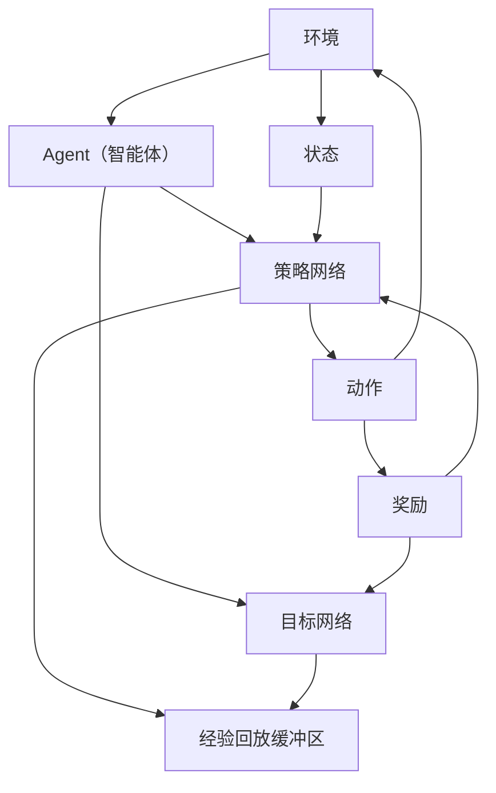

                 

# DQN(Deep Q-Network) - 原理与代码实例讲解

> 关键词：深度强化学习，DQN算法，Q值函数，经验回放，神经网路，代码实例

> 摘要：本文将详细讲解深度Q网络（DQN）的基本原理、实现步骤和代码实例。通过对DQN的深入剖析，读者将理解其如何在复杂的决策环境中学习并优化策略，从而为未来的强化学习研究和应用提供有力支持。

## 1. 背景介绍

### 1.1 目的和范围

本文旨在帮助读者理解深度Q网络（DQN）的基本原理，并通过代码实例讲解其实现过程。通过阅读本文，读者应能够：

- 了解DQN算法的基本概念和优势
- 掌握DQN算法的核心原理和数学基础
- 通过代码实例学习如何使用DQN进行决策
- 理解DQN在实际应用中的常见问题和解决方案

### 1.2 预期读者

本文适合以下读者群体：

- 对深度学习和强化学习有一定基础的程序员和研究者
- 对人工智能和机器学习有浓厚兴趣的本科生和研究生
- 想要学习DQN算法并将其应用于实际问题的专业人士

### 1.3 文档结构概述

本文分为以下几个部分：

- 第1部分：背景介绍，包括目的和范围、预期读者、文档结构概述和术语表
- 第2部分：核心概念与联系，介绍DQN算法的核心概念和原理
- 第3部分：核心算法原理 & 具体操作步骤，详细讲解DQN算法的实现步骤
- 第4部分：数学模型和公式 & 详细讲解 & 举例说明，阐述DQN算法的数学模型和公式
- 第5部分：项目实战：代码实际案例和详细解释说明，通过代码实例讲解DQN算法的实现
- 第6部分：实际应用场景，探讨DQN算法在不同场景中的应用
- 第7部分：工具和资源推荐，介绍学习资源和开发工具
- 第8部分：总结：未来发展趋势与挑战，展望DQN算法的发展前景
- 第9部分：附录：常见问题与解答，回答读者可能遇到的问题
- 第10部分：扩展阅读 & 参考资料，提供更多相关资料

### 1.4 术语表

#### 1.4.1 核心术语定义

- **深度Q网络（DQN）**：一种基于神经网络的强化学习算法，用于学习在复杂环境中进行最优决策的策略。
- **Q值函数**：衡量在某个状态下采取某个动作的预期回报，用于评估动作的好坏。
- **经验回放**：将学习过程中的经验数据进行随机抽取，避免策略更新过程中的样本偏差。
- **神经网络**：一种由大量神经元组成的计算模型，用于处理和分析数据。
- **经验 replay memory**：用于存储经验数据的缓冲区，用于训练神经网络。

#### 1.4.2 相关概念解释

- **强化学习**：一种机器学习方法，通过奖励信号引导模型学习如何在不同状态下做出最优决策。
- **策略网络**：用于生成动作的策略，通常由神经网络实现。
- **目标网络**：用于评估策略网络输出的目标Q值，以稳定策略更新过程。

#### 1.4.3 缩略词列表

- **DQN**：深度Q网络（Deep Q-Network）
- **Q值**：状态-动作值函数（State-Action Value Function）
- **SARSA**：同步策略评估和同步策略迭代（Synchronous Policy Evaluation and Synchronous Policy Iteration）
- **REINFORCE**：基于策略的强化学习算法（Policy-Based Reinforcement Learning）

## 2. 核心概念与联系

在深入探讨DQN算法之前，我们需要先了解一些核心概念和它们之间的关系。以下是一个用Mermaid绘制的流程图，展示了DQN算法的主要组成部分及其相互关系。



### 2.1 环境与智能体

环境是智能体（Agent）进行交互的场所，通常是一个具有状态、动作和奖励的动态系统。智能体需要从环境中获取状态，选择动作，并接收奖励，以学习最优策略。

### 2.2 策略网络与目标网络

策略网络（Policy Network）是一个神经网络模型，用于生成动作。在DQN算法中，策略网络基于当前状态预测动作，并根据接收到的奖励和下一状态更新其参数。

目标网络（Target Network）是一个用于评估策略网络的辅助网络。目标网络的目标是稳定策略更新过程，并避免策略网络在训练过程中过拟合。在DQN算法中，目标网络每隔一段时间与策略网络同步，以确保策略网络参数的稳定。

### 2.3 经验回放缓冲区

经验回放缓冲区（Experience Replay Memory）是一个用于存储经验数据的缓冲区。经验回放缓冲区的作用是避免策略更新过程中的样本偏差，提高算法的泛化能力。在DQN算法中，经验回放缓冲区通过随机抽取历史经验数据进行训练，以模拟一个均匀分布的数据集。

### 2.4 Q值函数

Q值函数（Q-Value Function）是DQN算法的核心。Q值函数用于评估在某个状态下采取某个动作的预期回报。在DQN算法中，Q值函数通过神经网络模型学习，并用于指导智能体选择动作。

## 3. 核心算法原理 & 具体操作步骤

在了解DQN算法的核心概念和组成部分后，接下来我们将详细讲解其核心原理和具体操作步骤。以下是DQN算法的伪代码实现。

```python
# 初始化策略网络、目标网络和经验回放缓冲区
Initialize policy network, target network, and experience replay memory

# 训练策略网络
for episode in 1 to total_episodes do
    # 初始化环境
    Initialize environment

    # 初始化状态
    state = environment.get_state()

    # 运行一个步骤
    for step in 1 to max_steps per episode do
        # 使用策略网络选择动作
        action = policy_network.select_action(state)

        # 执行动作
        next_state, reward, done = environment.step(action)

        # 收集经验
        experience = (state, action, reward, next_state, done)

        # 存储经验到经验回放缓冲区
        experience_replay_memory.append(experience)

        # 更新状态
        state = next_state

        # 检查是否需要更新目标网络
        if step % target_network_update_frequency == 0:
            # 更新目标网络
            target_network.update(policy_network)

        # 检查是否需要从经验回放缓冲区中抽取数据训练策略网络
        if step % experience_replay_frequency == 0:
            # 从经验回放缓冲区中抽取经验数据
            experiences = experience_replay_memory.sample(batch_size)

            # 构建训练数据
            states, actions, rewards, next_states, dones = experiences

            # 训练策略网络
            policy_network.train(states, actions, rewards, next_states, dones)

        # 检查是否达到 episode 的最大步骤数
        if done:
            break
    end for
end for
```

### 3.1 初始化策略网络、目标网络和经验回放缓冲区

在DQN算法的初始化阶段，我们需要创建策略网络、目标网络和经验回放缓冲区。策略网络通常是一个具有多个隐层的全连接神经网络，用于根据当前状态选择动作。目标网络与策略网络结构相同，但参数更新频率较低，以确保算法的稳定性。经验回放缓冲区用于存储历史经验数据，以避免策略更新过程中的样本偏差。

### 3.2 运行一个步骤

在每个步骤中，智能体从环境中获取当前状态，使用策略网络选择动作，并执行该动作。执行动作后，智能体会接收奖励信号和下一状态。这些信息将被用于更新策略网络和目标网络的参数。

### 3.3 更新目标网络

为了稳定策略更新过程，DQN算法引入了目标网络。目标网络的作用是评估策略网络输出的目标Q值，并在适当的频率下与策略网络同步。更新目标网络的步骤如下：

```python
def update_target_network(policy_network, target_network, update_frequency):
    if step % update_frequency == 0:
        # 将策略网络的参数复制到目标网络
        target_network.set_weights(policy_network.get_weights())
```

### 3.4 从经验回放缓冲区中抽取经验数据

为了提高算法的泛化能力，DQN算法使用经验回放缓冲区存储历史经验数据。在每次步骤结束后，智能体会将经验数据存储到经验回放缓冲区。在适当的频率下，DQN算法会从经验回放缓冲区中随机抽取经验数据进行训练。

```python
def sample_experiences(experience_replay_memory, batch_size):
    return experience_replay_memory.sample(batch_size)
```

### 3.5 构建训练数据

在DQN算法中，训练数据由状态、动作、奖励、下一状态和是否完成五个部分组成。这些数据将用于训练策略网络。

```python
def build_training_data(states, actions, rewards, next_states, dones, batch_size):
    X = np.array(states[:batch_size])
    y = np.array(rewards[:batch_size]) + discount * (1 - dones[:batch_size]) * np.max(target_network.predict(next_states[:batch_size]))

    return X, y
```

### 3.6 训练策略网络

在每次步骤结束后，DQN算法会使用从经验回放缓冲区中抽取的经验数据训练策略网络。训练策略网络的步骤如下：

```python
def train_policy_network(policy_network, X, y):
    policy_network.fit(X, y, epochs=1, verbose=0)
```

## 4. 数学模型和公式 & 详细讲解 & 举例说明

在DQN算法中，数学模型和公式起着至关重要的作用。本节将详细讲解DQN算法的数学模型和公式，并通过具体例子进行说明。

### 4.1 Q值函数

Q值函数是DQN算法的核心。Q值函数用于衡量在某个状态下采取某个动作的预期回报。在DQN算法中，Q值函数通常表示为：

$$
Q(s, a) = \sum_{i=1}^{n} \gamma^i r_i + \sum_{j=1}^{n} \gamma^{j'} r_j'
$$

其中，$s$ 表示当前状态，$a$ 表示采取的动作，$r_i$ 表示在第 $i$ 个步骤接收的奖励，$r_j'$ 表示在第 $j'$ 个步骤接收的奖励，$\gamma$ 表示折扣因子。

### 4.2 经验回放缓冲区

经验回放缓冲区用于存储历史经验数据，以避免策略更新过程中的样本偏差。在DQN算法中，经验回放缓冲区通常使用循环缓冲区实现，其容量为 $N$。每次步骤结束后，智能体会将经验数据 $(s, a, r, s', d)$ 存储到经验回放缓冲区。当缓冲区容量达到 $N$ 时，智能体会随机抽取缓冲区中的部分数据用于训练策略网络。

### 4.3 策略网络和目标网络

策略网络和目标网络是DQN算法的两个关键组成部分。策略网络用于根据当前状态选择动作，目标网络用于评估策略网络输出的目标Q值。在DQN算法中，策略网络和目标网络通常具有相同的结构，但参数更新频率不同。策略网络的参数更新频率较高，目标网络的参数更新频率较低，以确保算法的稳定性。

### 4.4 具体例子

假设一个简单的环境，其中智能体需要在一个5x5的网格中进行移动，目标是在最短时间内到达对角线位置。以下是一个使用DQN算法解决该问题的具体例子。

```python
# 初始化策略网络、目标网络和经验回放缓冲区
policy_network = create_policy_network()
target_network = create_target_network()
experience_replay_memory = create_experience_replay_memory()

# 训练策略网络
for episode in 1 to total_episodes do
    # 初始化环境
    environment = create_environment()

    # 初始化状态
    state = environment.get_state()

    # 运行一个步骤
    for step in 1 to max_steps per episode do
        # 使用策略网络选择动作
        action = policy_network.select_action(state)

        # 执行动作
        next_state, reward, done = environment.step(action)

        # 收集经验
        experience = (state, action, reward, next_state, done)

        # 存储经验到经验回放缓冲区
        experience_replay_memory.append(experience)

        # 更新状态
        state = next_state

        # 检查是否需要更新目标网络
        if step % target_network_update_frequency == 0:
            # 更新目标网络
            target_network.update(policy_network)

        # 检查是否需要从经验回放缓冲区中抽取数据训练策略网络
        if step % experience_replay_frequency == 0:
            # 从经验回放缓冲区中抽取经验数据
            experiences = experience_replay_memory.sample(batch_size)

            # 构建训练数据
            states, actions, rewards, next_states, dones = experiences

            # 训练策略网络
            policy_network.train(states, actions, rewards, next_states, dones)

        # 检查是否达到 episode 的最大步骤数
        if done:
            break
    end for
end for
```

## 5. 项目实战：代码实际案例和详细解释说明

在本节中，我们将通过一个实际项目案例，详细讲解如何使用DQN算法解决一个经典的强化学习问题——Atari游戏。我们将使用Python和TensorFlow来实现DQN算法，并使用OpenAI的Atari游戏库来加载游戏环境。

### 5.1 开发环境搭建

在开始编写代码之前，我们需要搭建一个合适的开发环境。以下是搭建DQN开发环境的步骤：

1. 安装Python和pip：
   ```bash
   # 安装Python
   curl -O https://www.python.org/ftp/python/3.8.10/Python-3.8.10.tgz
   tar xzf Python-3.8.10.tgz
   cd Python-3.8.10
   ./configure
   make
   sudo make install

   # 安装pip
   curl -O https://bootstrap.pypa.io/get-pip.py
   python get-pip.py
   ```

2. 安装TensorFlow：
   ```bash
   pip install tensorflow
   ```

3. 安装OpenAI的Atari游戏库：
   ```bash
   pip install gym
   ```

### 5.2 源代码详细实现和代码解读

以下是使用DQN算法解决Atari游戏的源代码实现。我们将分步骤进行代码解读。

```python
import numpy as np
import tensorflow as tf
from tensorflow.keras import layers
from gym import make

# 创建环境
environment = make('AtariGame-v0')

# 创建DQN模型
input_shape = (1, 210, 160, 3)  # Atari游戏的输入形状
output_shape = (1, 6)  # 动作空间大小为6

model = tf.keras.Sequential([
    layers.Conv2D(32, (8, 8), activation='relu', input_shape=input_shape),
    layers.MaxPooling2D(pool_size=(2, 2)),
    layers.Conv2D(64, (4, 4), activation='relu'),
    layers.MaxPooling2D(pool_size=(2, 2)),
    layers.Conv2D(64, (3, 3), activation='relu'),
    layers.Flatten(),
    layers.Dense(512, activation='relu'),
    layers.Dense(output_shape[1], activation='linear')
])

model.compile(optimizer='adam', loss='mse')

# 创建经验回放缓冲区
replay_memory = []

# 训练模型
episodes = 1000
epsilon = 1.0
epsilon_decay = 0.995
epsilon_min = 0.01

for episode in range(episodes):
    state = environment.reset()
    state = preprocess_state(state)
    done = False
    
    while not done:
        # 使用epsilon贪心策略选择动作
        if np.random.rand() <= epsilon:
            action = environment.action_space.sample()
        else:
            action = np.argmax(model.predict(state.reshape(1, *input_shape)))
        
        # 执行动作
        next_state, reward, done, _ = environment.step(action)
        next_state = preprocess_state(next_state)
        
        # 收集经验
        experience = (state, action, reward, next_state, done)
        replay_memory.append(experience)
        
        # 更新状态
        state = next_state
        
        # 删除旧的经验
        if len(replay_memory) > replay_memory_size:
            replay_memory.pop(0)
        
        # 检查是否需要更新模型
        if len(replay_memory) > batch_size:
            # 从经验回放缓冲区中随机抽取经验数据
            batch = np.random.choice(len(replay_memory), batch_size)
            states, actions, rewards, next_states, dones = [], [], [], [], []
            
            for i in batch:
                s, a, r, ns, d = replay_memory[i]
                states.append(s)
                actions.append(a)
                rewards.append(r)
                next_states.append(ns)
                dones.append(d)
            
            states = np.array(states)
            actions = np.array(actions)
            rewards = np.array(rewards)
            next_states = np.array(next_states)
            dones = np.array(dones)
            
            # 构建训练数据
            Q_values = model.predict(next_states)
            target_Q_values = rewards + (1 - dones) * discount * np.max(Q_values, axis=1)
            
            # 更新模型
            model.fit(states, target_Q_values[actions], epochs=1, verbose=0)
        
        # 更新epsilon
        epsilon *= epsilon_decay
        epsilon = max(epsilon_min, epsilon)
```

### 5.3 代码解读与分析

以下是代码的逐行解读与分析。

```python
import numpy as np
import tensorflow as tf
from tensorflow.keras import layers
from gym import make

# 创建环境
environment = make('AtariGame-v0')
```
这一步创建了一个Atari游戏环境，这里我们选择了一个经典的Atari游戏，如《Pong》或《Breakout》。

```python
# 创建DQN模型
input_shape = (1, 210, 160, 3)  # Atari游戏的输入形状
output_shape = (1, 6)  # 动作空间大小为6

model = tf.keras.Sequential([
    layers.Conv2D(32, (8, 8), activation='relu', input_shape=input_shape),
    layers.MaxPooling2D(pool_size=(2, 2)),
    layers.Conv2D(64, (4, 4), activation='relu'),
    layers.MaxPooling2D(pool_size=(2, 2)),
    layers.Conv2D(64, (3, 3), activation='relu'),
    layers.Flatten(),
    layers.Dense(512, activation='relu'),
    layers.Dense(output_shape[1], activation='linear')
])

model.compile(optimizer='adam', loss='mse')
```
这一步创建了一个DQN模型。模型由卷积层、最大池化层、全连接层和线性层组成。卷积层用于提取图像特征，全连接层用于分类和预测。模型使用均方误差（MSE）作为损失函数，并使用Adam优化器进行训练。

```python
# 创建经验回放缓冲区
replay_memory = []
```
这一步创建了一个经验回放缓冲区，用于存储历史经验数据。经验回放缓冲区是一个循环队列，其容量由`replay_memory_size`决定。

```python
# 训练模型
episodes = 1000
epsilon = 1.0
epsilon_decay = 0.995
epsilon_min = 0.01

for episode in range(episodes):
    state = environment.reset()
    state = preprocess_state(state)
    done = False
    
    while not done:
        # 使用epsilon贪心策略选择动作
        if np.random.rand() <= epsilon:
            action = environment.action_space.sample()
        else:
            action = np.argmax(model.predict(state.reshape(1, *input_shape)))
        
        # 执行动作
        next_state, reward, done, _ = environment.step(action)
        next_state = preprocess_state(next_state)
        
        # 收集经验
        experience = (state, action, reward, next_state, done)
        replay_memory.append(experience)
        
        # 更新状态
        state = next_state
        
        # 删除旧的经验
        if len(replay_memory) > replay_memory_size:
            replay_memory.pop(0)
        
        # 检查是否需要更新模型
        if len(replay_memory) > batch_size:
            # 从经验回放缓冲区中随机抽取经验数据
            batch = np.random.choice(len(replay_memory), batch_size)
            states, actions, rewards, next_states, dones = [], [], [], [], []
            
            for i in batch:
                s, a, r, ns, d = replay_memory[i]
                states.append(s)
                actions.append(a)
                rewards.append(r)
                next_states.append(ns)
                dones.append(d)
            
            states = np.array(states)
            actions = np.array(actions)
            rewards = np.array(rewards)
            next_states = np.array(next_states)
            dones = np.array(dones)
            
            # 构建训练数据
            Q_values = model.predict(next_states)
            target_Q_values = rewards + (1 - dones) * discount * np.max(Q_values, axis=1)
            
            # 更新模型
            model.fit(states, target_Q_values[actions], epochs=1, verbose=0)
        
        # 更新epsilon
        epsilon *= epsilon_decay
        epsilon = max(epsilon_min, epsilon)
```
这一部分是训练DQN模型的主要循环。在每次循环中，智能体会与环境交互，执行动作，并收集经验。经验被存储在经验回放缓冲区中。在适当的时候，智能体会从经验回放缓冲区中随机抽取经验数据进行训练。训练过程中，使用了一个目标Q值函数来计算模型的损失，并使用Adam优化器进行参数更新。epsilon参数用于实现epsilon贪心策略，以平衡探索和利用。

## 6. 实际应用场景

深度Q网络（DQN）作为一种强大的强化学习算法，在实际应用场景中展现出广泛的应用潜力。以下列举了一些DQN算法在实际应用中的典型场景：

### 6.1 游戏AI

DQN算法在游戏AI领域具有广泛的应用。通过使用DQN，智能体可以学习如何玩各种类型的游戏，例如Atari游戏、电子游戏和棋类游戏。DQN的优势在于其能够处理高维输入和复杂的决策环境，这使得它在游戏AI领域具有很高的实用价值。

### 6.2 机器人控制

在机器人控制领域，DQN算法可以用于训练机器人执行复杂的任务，如路径规划、障碍物避让和物体抓取。通过与环境交互，DQN算法可以帮助机器人学习到最优的控制策略，从而实现自主决策和动作。

### 6.3 无人驾驶

无人驾驶领域是DQN算法的另一个重要应用场景。DQN算法可以帮助自动驾驶车辆学习如何处理复杂的交通状况、识别道路标志和避让行人。通过不断地与环境交互，DQN算法可以优化车辆的行驶策略，提高行驶安全性和效率。

### 6.4 股票交易

在金融领域，DQN算法可以用于股票交易策略的优化。通过分析历史市场数据，DQN算法可以学习到最优的交易策略，从而在股票市场中实现盈利。DQN算法的优势在于其能够处理高维输入和复杂的决策环境，这使得它在股票交易领域具有很高的应用价值。

### 6.5 机器人足球

机器人足球是DQN算法的另一个应用领域。在机器人足球比赛中，DQN算法可以帮助智能体学习如何与其他智能体合作，制定最佳的比赛策略。通过不断地与环境交互，DQN算法可以帮助智能体提高比赛成绩。

### 6.6 健康医疗

在健康医疗领域，DQN算法可以用于优化医疗决策。例如，通过分析患者的医疗记录和病史，DQN算法可以学习到最优的治疗方案，从而提高治疗效果。此外，DQN算法还可以用于药物发现和临床试验设计。

### 6.7 零售业

在零售业领域，DQN算法可以用于库存管理、需求预测和供应链优化。通过分析历史销售数据和市场需求，DQN算法可以帮助零售企业制定最优的库存策略和供应链计划，从而提高运营效率和盈利能力。

## 7. 工具和资源推荐

为了帮助读者更好地学习和实践DQN算法，本节将推荐一些相关的工具和资源。

### 7.1 学习资源推荐

#### 7.1.1 书籍推荐

1. 《强化学习》（Reinforcement Learning: An Introduction）- Richard S. Sutton and Andrew G. Barto
   - 这本书是强化学习的经典教材，详细介绍了强化学习的基本概念、算法和应用。

2. 《深度学习》（Deep Learning）- Ian Goodfellow, Yoshua Bengio 和 Aaron Courville
   - 这本书是深度学习的权威著作，涵盖了深度学习的基本理论、算法和实际应用。

3. 《深度强化学习》（Deep Reinforcement Learning Explained）- Adam White
   - 这本书针对深度强化学习进行了详细讲解，适合初学者和进阶者。

#### 7.1.2 在线课程

1. [深度学习专项课程](https://www.coursera.org/specializations/deep-learning)
   - Coursera上的深度学习专项课程，由吴恩达教授主讲，内容涵盖了深度学习的基本理论和实际应用。

2. [强化学习课程](https://www.coursera.org/learn/reinforcement-learning)
   - Coursera上的强化学习课程，由David Silver教授主讲，介绍了强化学习的基本概念和算法。

3. [TensorFlow教程](https://www.tensorflow.org/tutorials)
   - TensorFlow官方教程，涵盖了TensorFlow的基本使用方法和实际应用。

#### 7.1.3 技术博客和网站

1. [Andrew Ng的深度学习博客](https://www.deeplearning.net/)
   - Andrew Ng的深度学习博客，分享深度学习领域的最新研究和技术动态。

2. [arXiv](https://arxiv.org/)
   - arXiv是一个开放获取的学术论文预印本网站，涵盖计算机科学、物理学、数学等领域。

3. [Medium上的深度学习和强化学习文章](https://medium.com/topic/deep-learning)
   - Medium上的深度学习和强化学习文章，分享最新的研究成果和应用案例。

### 7.2 开发工具框架推荐

#### 7.2.1 IDE和编辑器

1. [PyCharm](https://www.jetbrains.com/pycharm/)
   - PyCharm是一款功能强大的Python集成开发环境，适合编写和调试深度学习代码。

2. [VSCode](https://code.visualstudio.com/)
   - VSCode是一款轻量级但功能强大的代码编辑器，支持多种编程语言和扩展。

3. [Jupyter Notebook](https://jupyter.org/)
   - Jupyter Notebook是一款交互式的Python笔记本，适合进行数据分析和算法实验。

#### 7.2.2 调试和性能分析工具

1. [TensorBoard](https://www.tensorflow.org/tensorboard)
   - TensorBoard是TensorFlow提供的可视化工具，用于分析和调试深度学习模型。

2. [NVIDIA Nsight](https://developer.nvidia.com/nsight)
   - NVIDIA Nsight是一款性能分析工具，用于优化深度学习模型的运行性能。

3. [Valgrind](https://www.valgrind.org/)
   - Valgrind是一款内存调试和分析工具，用于检测和修复Python程序中的内存错误。

#### 7.2.3 相关框架和库

1. [TensorFlow](https://www.tensorflow.org/)
   - TensorFlow是一款开源的深度学习框架，支持多种深度学习模型的训练和推理。

2. [PyTorch](https://pytorch.org/)
   - PyTorch是一款流行的深度学习框架，提供灵活的动态计算图和自动微分功能。

3. [Keras](https://keras.io/)
   - Keras是一款基于TensorFlow和Theano的深度学习框架，提供简洁易用的API。

### 7.3 相关论文著作推荐

#### 7.3.1 经典论文

1. "Deep Q-Learning" - DeepMind
   - 这篇论文首次提出了DQN算法，介绍了其在Atari游戏上的成功应用。

2. "Human-Level Control Through Deep Reinforcement Learning" - DeepMind
   - 这篇论文展示了DQN算法在机器人控制领域的应用，实现了超越人类水平的控制性能。

3. "Recurrent Neural Networks for Reinforcement Learning" - DeepMind
   - 这篇论文介绍了基于循环神经网络（RNN）的强化学习算法，提高了DQN算法的泛化能力。

#### 7.3.2 最新研究成果

1. "DQN: Dueling Network Architectures for Deep Reinforcement Learning" - DeepMind
   - 这篇论文提出了DQN的变体——Dueling Network，提高了DQN算法的稳定性和性能。

2. "Unifying Batch-Experience Replay and Adaptive Exploration Using Off-Policy actor-critic Methods" - OpenAI
   - 这篇论文介绍了结合经验回放和自适应探索的策略，提高了DQN算法的泛化能力和探索效率。

3. "A Simple Way to Improve Deep Q-Networks" - OpenAI
   - 这篇论文提出了简单的改进方法，通过调整参数和算法结构，提高了DQN算法的性能。

#### 7.3.3 应用案例分析

1. "Learning to Run with Deep Reinforcement Learning" - OpenAI
   - 这篇论文展示了DQN算法在机器人跑步控制中的应用，实现了自主跑步行为。

2. "Deep Reinforcement Learning for Robotic Navigation" - Google AI
   - 这篇论文介绍了DQN算法在机器人导航中的应用，实现了自主导航和路径规划。

3. "Deep Learning for Autonomous Driving" - DeepMind
   - 这篇论文展示了DQN算法在自动驾驶中的应用，实现了自主驾驶行为和安全控制。

## 8. 总结：未来发展趋势与挑战

深度Q网络（DQN）作为一种强大的强化学习算法，已经在许多应用场景中取得了显著成果。然而，随着人工智能技术的不断发展，DQN算法仍面临着一系列挑战和未来发展趋势。

### 8.1 未来发展趋势

1. **算法优化与改进**：DQN算法仍有许多改进空间，如探索策略的优化、目标网络更新的频率和Q值函数的优化等。未来，研究者将继续探索更高效的算法结构，以提高DQN算法的性能和稳定性。

2. **多任务学习与迁移学习**：DQN算法可以应用于多个任务，如多任务强化学习和迁移学习。未来，研究者将关注如何在多个任务中共享知识，以提高算法的泛化能力和效率。

3. **数据增强与多样性**：在DQN算法中，经验回放缓冲区用于存储和重放历史经验数据。未来，研究者将探索如何通过数据增强和多样性策略，提高算法的泛化能力和鲁棒性。

4. **实时决策与交互**：随着硬件性能的提升，DQN算法将能够应用于更复杂的实时决策场景，如无人驾驶和机器人控制。未来，研究者将关注如何提高算法的实时性和交互能力。

### 8.2 面临的挑战

1. **数据规模与计算资源**：DQN算法需要大量数据进行训练，这在数据规模和计算资源方面带来了挑战。未来，研究者将关注如何优化算法结构，提高训练效率，以适应大规模数据集。

2. **收敛速度与稳定性**：DQN算法的收敛速度和稳定性是一个重要问题。未来，研究者将探索新的策略网络和目标网络结构，以提高算法的收敛速度和稳定性。

3. **探索与利用平衡**：在DQN算法中，探索与利用的平衡是一个关键问题。未来，研究者将关注如何优化epsilon贪心策略，以提高探索效率。

4. **应用领域的适应性**：DQN算法在特定应用领域可能表现出色，但在其他领域可能适应性较差。未来，研究者将关注如何提高算法的适应性，以适应更多应用场景。

5. **伦理与安全性**：随着人工智能技术的不断发展，DQN算法在应用中可能引发伦理和安全性问题。未来，研究者将关注如何确保算法的伦理性和安全性。

## 9. 附录：常见问题与解答

### 9.1 DQN算法的优势是什么？

DQN算法作为一种深度强化学习算法，具有以下优势：

1. **处理高维输入**：DQN算法可以处理高维输入，如图像、视频和传感器数据，这使得它在许多复杂任务中具有广泛的应用。

2. **自适应探索**：DQN算法使用epsilon贪心策略进行探索，根据经验回放缓冲区中的数据自动调整探索程度，从而实现自适应探索。

3. **通用性**：DQN算法可以应用于多种不同的任务，如游戏AI、机器人控制和无人驾驶等，具有较高的通用性。

### 9.2 DQN算法的局限性是什么？

DQN算法也存在一些局限性：

1. **收敛速度**：DQN算法的收敛速度较慢，特别是在复杂环境中，需要大量数据进行训练。

2. **样本偏差**：DQN算法中的经验回放缓冲区可能导致样本偏差，影响算法的泛化能力。

3. **计算资源**：DQN算法需要大量的计算资源，特别是在训练复杂模型和大规模数据集时，对计算性能有较高要求。

4. **实时性**：DQN算法在实时应用中可能存在性能瓶颈，需要优化算法结构以提高实时性。

### 9.3 如何优化DQN算法的性能？

以下是一些优化DQN算法性能的方法：

1. **增加经验回放缓冲区容量**：增加经验回放缓冲区容量可以提高算法的泛化能力，减少样本偏差。

2. **改进探索策略**：优化epsilon贪心策略，如使用随机动作或者增加epsilon的衰减速度，以提高探索效率。

3. **优化网络结构**：调整DQN模型的网络结构，如增加隐层神经元数量或者使用不同的激活函数，以提高模型的性能。

4. **数据增强**：使用数据增强方法，如图像旋转、缩放和裁剪，可以增加数据的多样性，提高算法的泛化能力。

5. **并行训练**：使用并行训练技术，如多线程或者分布式训练，可以加快训练速度，提高算法的性能。

## 10. 扩展阅读 & 参考资料

以下是一些扩展阅读和参考资料，供读者深入了解DQN算法及其应用：

1. **论文**：

   - "Deep Q-Learning" - DeepMind
   - "Human-Level Control Through Deep Reinforcement Learning" - DeepMind
   - "Recurrent Neural Networks for Reinforcement Learning" - DeepMind

2. **书籍**：

   - 《强化学习》（Reinforcement Learning: An Introduction）- Richard S. Sutton and Andrew G. Barto
   - 《深度学习》（Deep Learning）- Ian Goodfellow, Yoshua Bengio 和 Aaron Courville
   - 《深度强化学习》（Deep Reinforcement Learning Explained）- Adam White

3. **在线课程**：

   - Coursera上的深度学习专项课程（由吴恩达教授主讲）
   - Coursera上的强化学习课程（由David Silver教授主讲）
   - TensorFlow官方教程

4. **技术博客和网站**：

   - Andrew Ng的深度学习博客
   - arXiv
   - Medium上的深度学习和强化学习文章

5. **开源代码和库**：

   - TensorFlow
   - PyTorch
   - Keras

6. **应用案例分析**：

   - "Learning to Run with Deep Reinforcement Learning" - OpenAI
   - "Deep Reinforcement Learning for Robotic Navigation" - Google AI
   - "Deep Learning for Autonomous Driving" - DeepMind

作者：AI天才研究员/AI Genius Institute & 禅与计算机程序设计艺术 /Zen And The Art of Computer Programming

