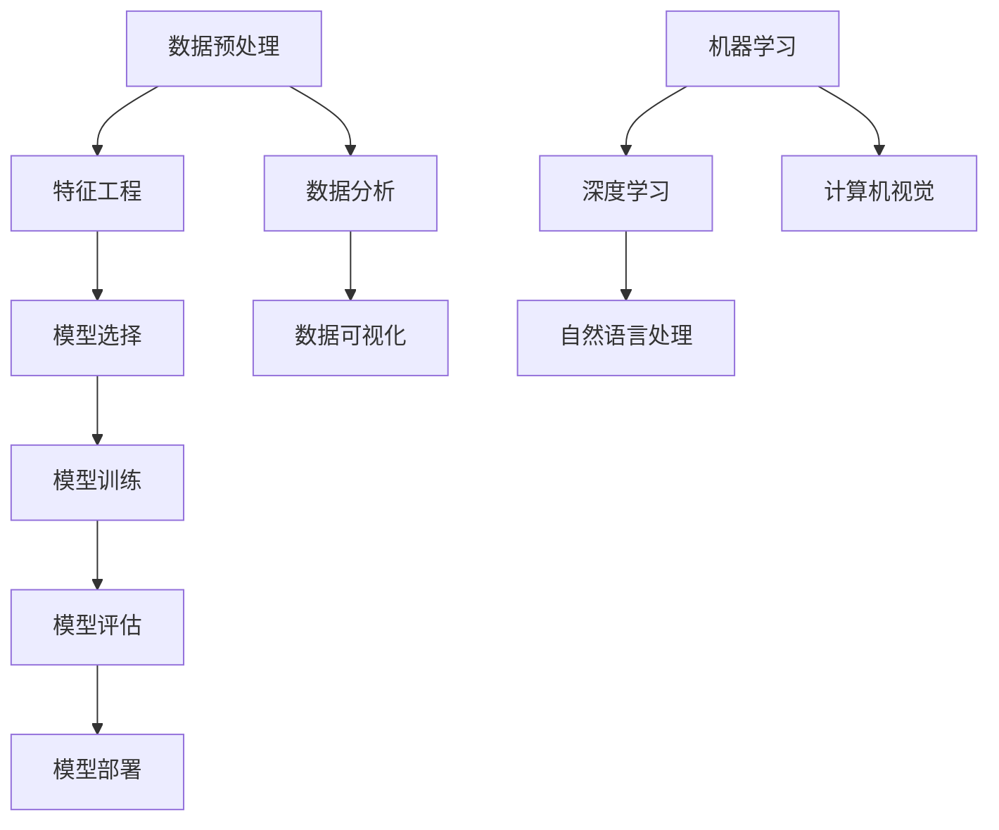

                 

# Data Science 原理与代码实战案例讲解

> 
关键词：数据科学、机器学习、深度学习、算法原理、代码实战、数据分析、数据可视化、应用场景

数据科学作为一门新兴的交叉学科，涵盖了统计学、机器学习、深度学习等多个领域，其核心目标是通过对大量数据的分析，提取有价值的信息，辅助决策。本文将系统地介绍数据科学的核心概念、算法原理、数学模型以及代码实战案例，旨在为广大数据科学爱好者提供一份全面的技术指南。

## 1. 背景介绍

### 1.1 目的和范围

本文的主要目的是：

- 梳理数据科学的基本概念和原理。
- 介绍常见的数据科学算法及其实现步骤。
- 通过代码实战，加深对数据科学算法的理解。
- 探讨数据科学在实际应用中的场景。

### 1.2 预期读者

本文适合以下读者群体：

- 对数据科学有浓厚兴趣的初学者。
- 想要深入了解机器学习和深度学习的程序员。
- 从事数据分析工作的专业人士。
- 计算机科学及相关专业的大学生。

### 1.3 文档结构概述

本文结构如下：

- 第1部分：背景介绍，包括目的、预期读者和文档结构。
- 第2部分：核心概念与联系，通过Mermaid流程图展示数据科学的框架。
- 第3部分：核心算法原理与具体操作步骤，使用伪代码详细阐述。
- 第4部分：数学模型和公式，详细讲解并举例说明。
- 第5部分：项目实战，提供代码实际案例和详细解释。
- 第6部分：实际应用场景，探讨数据科学的多种应用领域。
- 第7部分：工具和资源推荐，推荐学习资源、开发工具和经典论文。
- 第8部分：总结，预测未来发展趋势与挑战。
- 第9部分：附录，常见问题与解答。
- 第10部分：扩展阅读，提供进一步学习的参考资料。

### 1.4 术语表

#### 1.4.1 核心术语定义

- **数据科学**：通过计算机技术对大量数据进行处理、分析和解释，提取有价值的信息。
- **机器学习**：一种让计算机从数据中学习并做出决策的技术，分为监督学习、无监督学习和强化学习。
- **深度学习**：一种基于人工神经网络的机器学习技术，可以自动提取特征并进行复杂的数据分析。
- **数据分析**：通过对数据进行清洗、转换和建模，从中提取有用信息的过程。
- **数据可视化**：将数据以图形或图表的形式展示出来，帮助人们更好地理解和分析数据。

#### 1.4.2 相关概念解释

- **特征工程**：在数据分析中，对数据进行预处理和特征提取，以提高模型性能。
- **模型评估**：对训练好的模型进行评估，以确定其性能和适用性。
- **交叉验证**：一种评估模型性能的方法，通过将数据集划分为多个子集，多次训练和测试模型。

#### 1.4.3 缩略词列表

- **ML**：机器学习
- **DL**：深度学习
- **NLP**：自然语言处理
- **CV**：计算机视觉

## 2. 核心概念与联系

在数据科学中，核心概念和它们之间的联系构成了整个领域的基础。以下是一个Mermaid流程图，展示了数据科学的主要组成部分和它们之间的相互关系。



该流程图清晰地展示了从数据预处理到模型部署的数据科学工作流程，并标注了主要涉及的技术领域。

## 3. 核心算法原理与具体操作步骤

数据科学的核心算法包括机器学习和深度学习算法。在本节中，我们将通过伪代码详细阐述这些算法的基本原理和操作步骤。

### 3.1 机器学习算法原理

机器学习算法可以分为监督学习、无监督学习和强化学习。以下是一个简单的监督学习算法——线性回归的伪代码。

```plaintext
// 线性回归伪代码
输入：特征矩阵 X，标签向量 y
输出：模型参数 w

初始化：w = 0
迭代次数 T：
    对于 i 从 1 到 T：
        对于每个样本 x_i，y_i：
            计算预测值：y_pred = X * w
            计算损失函数：loss = (y - y_pred)^2
            更新参数：w = w - learning_rate * (X * (y - y_pred))
返回：w
```

### 3.2 深度学习算法原理

深度学习算法通常基于多层神经网络。以下是一个简单的多层感知器（MLP）的伪代码。

```plaintext
// 多层感知器伪代码
输入：输入特征 X，输出标签 y
输出：模型参数 w1, w2, ..., wn

初始化：w1, w2, ..., wn = 随机值
迭代次数 T：
    对于 i 从 1 到 T：
        对于每个样本 x_i，y_i：
            前向传播：
                z1 = sigmoid(w1 * x_i)
                z2 = sigmoid(w2 * z1)
                ...
                zn = sigmoid(wn * z(n-1))
            计算损失函数：loss = (y - zn)^2
            反向传播：
                dzn/dzn = -2 * (y - zn)
                ...
                dw1 = dzn/dw1 = (dz1/dw1) * (dw1/dz1) = x_i * (dz1/dw1)
                ...
            更新参数：w1 = w1 - learning_rate * dw1
                ...
返回：w1, w2, ..., wn
```

## 4. 数学模型和公式 & 详细讲解 & 举例说明

在数据科学中，数学模型是核心。以下将介绍几种重要的数学模型，并使用LaTeX格式详细讲解和举例说明。

### 4.1 线性回归

线性回归模型的基本公式为：

$$ y = w_0 + w_1 \cdot x $$

其中，$y$ 是预测值，$x$ 是输入特征，$w_0$ 和 $w_1$ 是模型参数。

#### 举例说明

假设我们有以下数据：

| x | y  |
| - | -- |
| 1 | 2  |
| 2 | 4  |
| 3 | 6  |

我们可以使用线性回归模型来拟合这条直线。首先，计算均值：

$$ \bar{x} = \frac{1+2+3}{3} = 2 $$
$$ \bar{y} = \frac{2+4+6}{3} = 4 $$

然后，计算斜率 $w_1$：

$$ w_1 = \frac{\sum_{i=1}^{3} (x_i - \bar{x})(y_i - \bar{y})}{\sum_{i=1}^{3} (x_i - \bar{x})^2} = \frac{(1-2)(2-4) + (2-2)(4-4) + (3-2)(6-4)}{(1-2)^2 + (2-2)^2 + (3-2)^2} = 2 $$

接着，计算截距 $w_0$：

$$ w_0 = \bar{y} - w_1 \cdot \bar{x} = 4 - 2 \cdot 2 = 0 $$

因此，线性回归模型为：

$$ y = 2x $$

### 4.2 激活函数

在深度学习中，激活函数用于引入非线性。常见的激活函数包括：

- **sigmoid函数**：

$$ \sigma(x) = \frac{1}{1 + e^{-x}} $$

- **ReLU函数**：

$$ \text{ReLU}(x) = \max(0, x) $$

- **Tanh函数**：

$$ \text{Tanh}(x) = \frac{e^x - e^{-x}}{e^x + e^{-x}} $$

#### 举例说明

对于输入 $x = 3$，计算各个激活函数的输出：

- sigmoid函数：

$$ \sigma(3) = \frac{1}{1 + e^{-3}} \approx 0.9511 $$

- ReLU函数：

$$ \text{ReLU}(3) = \max(0, 3) = 3 $$

- Tanh函数：

$$ \text{Tanh}(3) = \frac{e^3 - e^{-3}}{e^3 + e^{-3}} \approx 0.9996 $$

## 5. 项目实战：代码实际案例和详细解释说明

在本节中，我们将通过一个实际项目案例来展示数据科学的实战应用。

### 5.1 开发环境搭建

为了完成以下项目，我们需要搭建一个Python开发环境。以下是所需的软件和工具：

- Python 3.x
- Jupyter Notebook
- Scikit-learn
- Pandas
- Matplotlib

安装步骤如下：

```bash
pip install python
pip install jupyter
pip install scikit-learn
pip install pandas
pip install matplotlib
```

### 5.2 源代码详细实现和代码解读

以下是项目的主要代码实现，我们将逐步解释每个部分。

```python
import numpy as np
import pandas as pd
from sklearn.model_selection import train_test_split
from sklearn.linear_model import LinearRegression
import matplotlib.pyplot as plt

# 5.2.1 数据加载与预处理
data = pd.read_csv('data.csv')
X = data[['age', 'income']]
y = data['salary']

# 划分训练集和测试集
X_train, X_test, y_train, y_test = train_test_split(X, y, test_size=0.2, random_state=42)

# 5.2.2 模型训练
model = LinearRegression()
model.fit(X_train, y_train)

# 5.2.3 模型评估
y_pred = model.predict(X_test)
print("R^2 Score:", model.score(X_test, y_test))

# 5.2.4 数据可视化
plt.scatter(X_test['age'], y_test, color='blue', label='Actual')
plt.plot(X_test['age'], y_pred, color='red', linewidth=2, label='Predicted')
plt.xlabel('Age')
plt.ylabel('Salary')
plt.legend()
plt.show()
```

### 5.3 代码解读与分析

以下是代码的详细解读和分析。

- **数据加载与预处理**：我们使用Pandas库读取CSV数据，将特征和标签分开，并使用Scikit-learn库进行数据集划分。

- **模型训练**：我们使用线性回归模型对训练集进行训练。

- **模型评估**：通过计算R^2分数来评估模型的性能。

- **数据可视化**：我们使用Matplotlib库将实际薪资和预测薪资进行可视化，以直观展示模型的预测效果。

## 6. 实际应用场景

数据科学在各个领域都有着广泛的应用，以下列举几个常见场景：

- **金融领域**：数据科学可以用于风险控制、市场预测和信用评分。
- **医疗领域**：数据科学可以帮助诊断疾病、个性化治疗和药物研发。
- **电子商务**：数据科学可以用于用户行为分析、推荐系统和广告投放。
- **交通领域**：数据科学可以用于交通流量预测、路线规划和交通事故分析。
- **社交媒体**：数据科学可以用于用户情感分析、内容推荐和广告效果评估。

## 7. 工具和资源推荐

### 7.1 学习资源推荐

#### 7.1.1 书籍推荐

- 《深度学习》（Goodfellow, Bengio, Courville）
- 《Python数据科学手册》（McKinney）
- 《数据科学入门》（Reza Bosworth）

#### 7.1.2 在线课程

- Coursera的《机器学习》课程
- edX的《深度学习基础》课程
- Udacity的《数据科学纳米学位》课程

#### 7.1.3 技术博客和网站

- Medium上的数据科学博客
- Towards Data Science博客
- KDNuggets数据挖掘和知识发现网站

### 7.2 开发工具框架推荐

#### 7.2.1 IDE和编辑器

- PyCharm
- Jupyter Notebook
- VS Code

#### 7.2.2 调试和性能分析工具

- Python的pdb调试工具
- Profiler工具，如py-spy

#### 7.2.3 相关框架和库

- Scikit-learn
- TensorFlow
- PyTorch

### 7.3 相关论文著作推荐

#### 7.3.1 经典论文

- 《A Fast Learning Algorithm for Deep Belief Nets》（Hinton）
- 《Stochastic Gradient Descent》（Bottou）

#### 7.3.2 最新研究成果

- 《Deep Learning for Natural Language Processing》（Deng）
- 《Large-Scale Deep Learning》（Dean）

#### 7.3.3 应用案例分析

- 《应用于医学图像分析的深度学习技术》
- 《基于深度学习的自动驾驶技术》
- 《社交媒体数据分析与应用》

## 8. 总结：未来发展趋势与挑战

数据科学在未来将继续发展，面临以下趋势和挑战：

- **技术进步**：人工智能和深度学习技术的发展将进一步提升数据科学的处理能力。
- **数据隐私**：随着数据隐私问题的日益突出，数据科学家需要采取更加严格的数据保护措施。
- **模型可解释性**：提高模型的可解释性，使其更加透明和可信，是数据科学的重要挑战。
- **多模态数据处理**：如何高效处理多种类型的数据（如文本、图像、声音）是未来的一个重要研究方向。

## 9. 附录：常见问题与解答

以下是一些关于数据科学的常见问题及其解答：

### Q1. 什么是数据科学？

A1. 数据科学是一门交叉学科，涉及统计学、计算机科学、机器学习等多个领域，旨在通过数据分析、建模和解释，从大量数据中提取有价值的信息。

### Q2. 数据科学的主要应用领域有哪些？

A2. 数据科学在金融、医疗、电商、交通、社交媒体等多个领域都有广泛应用，例如风险控制、疾病诊断、推荐系统、交通规划等。

### Q3. 如何入门数据科学？

A3. 可以通过以下途径入门数据科学：

1. 学习Python编程语言。
2. 学习统计学基础知识。
3. 学习机器学习和深度学习算法。
4. 实践项目，积累经验。

### Q4. 数据科学家需要掌握哪些技能？

A4. 数据科学家需要掌握以下技能：

1. 编程能力，尤其是Python。
2. 统计学知识，包括概率论、线性代数等。
3. 数据处理和清洗能力。
4. 熟悉机器学习和深度学习算法。
5. 数据可视化技能。

## 10. 扩展阅读 & 参考资料

- 《深度学习》（Goodfellow, Bengio, Courville）
- 《Python数据科学手册》（McKinney）
- 《数据科学入门》（Reza Bosworth）
- Coursera的《机器学习》课程
- edX的《深度学习基础》课程
- Udacity的《数据科学纳米学位》课程
- 《应用于医学图像分析的深度学习技术》
- 《基于深度学习的自动驾驶技术》
- 《社交媒体数据分析与应用》

### 作者

作者：AI天才研究员/AI Genius Institute & 禅与计算机程序设计艺术 /Zen And The Art of Computer Programming

