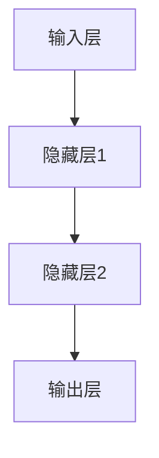
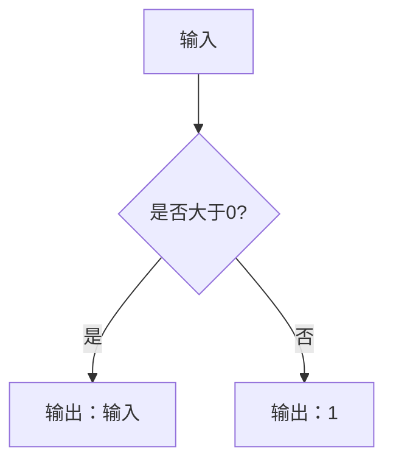
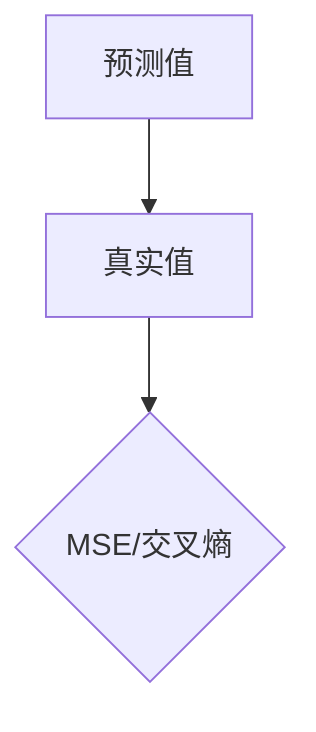
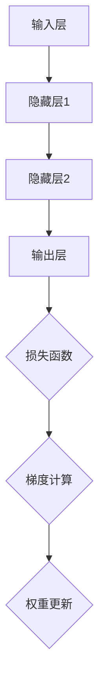

                 

# Deep Learning原理与代码实例讲解

> 关键词：深度学习，神经网络，反向传播，卷积神经网络，循环神经网络，代码实例

> 摘要：本文将深入讲解深度学习的原理，从基本概念到核心算法，再到实际应用案例，帮助读者全面掌握深度学习技术。通过详细的代码实例和解析，使读者能够将理论知识转化为实践技能，提升对深度学习的理解和应用能力。

## 1. 背景介绍

### 1.1 目的和范围

本文旨在为读者提供深度学习的全面理解和实践指南。我们将从深度学习的基本概念出发，逐步介绍神经网络、反向传播算法、卷积神经网络（CNN）和循环神经网络（RNN）等核心算法，并辅以丰富的代码实例进行讲解。通过本文的学习，读者将能够：

1. 掌握深度学习的基本原理和核心算法。
2. 学会使用反向传播算法训练神经网络。
3. 理解并应用卷积神经网络和循环神经网络解决实际问题。
4. 基于深度学习技术，开发实用的机器学习应用。

### 1.2 预期读者

本文适合对机器学习和深度学习有一定了解的读者，包括：

1. 机器学习初学者，希望深入理解深度学习技术。
2. 数据科学、人工智能等相关领域的工程师和研究人员。
3. 对深度学习技术感兴趣的技术爱好者。

### 1.3 文档结构概述

本文结构如下：

1. **背景介绍**：介绍本文的目的、范围、预期读者和文档结构。
2. **核心概念与联系**：介绍深度学习的核心概念和联系。
3. **核心算法原理 & 具体操作步骤**：讲解深度学习的核心算法原理和操作步骤。
4. **数学模型和公式 & 详细讲解 & 举例说明**：介绍深度学习的数学模型和公式。
5. **项目实战：代码实际案例和详细解释说明**：通过实际项目案例讲解深度学习的应用。
6. **实际应用场景**：分析深度学习在实际应用中的场景。
7. **工具和资源推荐**：推荐学习资源、开发工具和框架。
8. **总结：未来发展趋势与挑战**：总结深度学习的未来发展趋势和挑战。
9. **附录：常见问题与解答**：解答常见问题。
10. **扩展阅读 & 参考资料**：提供扩展阅读和参考资料。

### 1.4 术语表

#### 1.4.1 核心术语定义

- **深度学习**：一种机器学习方法，通过多层神经网络对数据进行建模和学习，实现复杂的模式识别和特征提取。
- **神经网络**：模拟人脑神经元结构和功能的基本单元，通过加权连接实现信息的传递和处理。
- **反向传播**：一种用于训练神经网络的算法，通过反向传递误差来更新网络的权重。
- **卷积神经网络（CNN）**：一种特殊类型的神经网络，主要用于图像识别和处理。
- **循环神经网络（RNN）**：一种能够处理序列数据的神经网络，具有记忆功能。

#### 1.4.2 相关概念解释

- **激活函数**：用于确定神经元是否被激活的函数，常用的激活函数包括 sigmoid、ReLU 等。
- **损失函数**：用于评估模型预测结果与真实结果之间差异的函数，常用的损失函数包括均方误差（MSE）、交叉熵损失等。
- **优化器**：用于调整网络权重的算法，常用的优化器包括梯度下降、Adam 等。

#### 1.4.3 缩略词列表

- **MLP**：多层感知机（Multi-Layer Perceptron）
- **ReLU**：修正线性单元（Rectified Linear Unit）
- **CNN**：卷积神经网络（Convolutional Neural Network）
- **RNN**：循环神经网络（Recurrent Neural Network）
- **ReLU**：反向传播算法（Backpropagation Algorithm）

## 2. 核心概念与联系

深度学习的核心在于构建多层神经网络，通过逐层提取特征，实现对数据的复杂建模。下面是深度学习的核心概念及其联系：

### 神经元结构

神经元是神经网络的基本单元，其结构包括输入层、输出层和隐藏层。输入层接收外部数据，隐藏层通过加权连接实现信息的传递和处理，输出层生成最终预测结果。



### 激活函数

激活函数用于确定神经元是否被激活。常见的激活函数包括 sigmoid、ReLU 等，其中 ReLU 函数因其简单有效而被广泛应用于深度学习中。



### 损失函数

损失函数用于评估模型预测结果与真实结果之间的差异。常见的损失函数包括均方误差（MSE）、交叉熵损失等。均方误差损失函数适用于回归问题，而交叉熵损失函数适用于分类问题。



### 反向传播算法

反向传播算法是一种用于训练神经网络的算法，其核心思想是利用损失函数的梯度来更新网络权重，以降低损失函数的值。



## 3. 核心算法原理 & 具体操作步骤

### 神经网络基本原理

神经网络由大量神经元通过加权连接构成。神经元的输出通过激活函数进行非线性变换，形成输入层到隐藏层再到输出层的复杂映射。反向传播算法用于调整网络权重，以降低损失函数的值，实现模型的优化。

### 具体操作步骤

1. **初始化参数**：初始化网络的权重和偏置，通常采用随机初始化方法。

    ```python
    # 初始化权重和偏置
    W = np.random.randn(n_hidden, n_input)
    b = np.random.randn(n_hidden)
    ```

2. **前向传播**：输入数据经过网络传递，计算输出层的预测结果。

    ```python
    # 前向传播
    z = X.dot(W) + b
    a = sigmoid(z)
    y_pred = a.dot(W2) + b2
    ```

3. **计算损失函数**：计算预测结果与真实结果之间的差异，得到损失值。

    ```python
    # 计算损失函数
    loss = mse(y_pred, y)
    ```

4. **反向传播**：利用损失函数的梯度，计算网络权重的更新梯度。

    ```python
    # 计算梯度
    delta = (y_pred - y) * a * (1 - a)
    dW2 = X.T.dot(delta)
    db2 = delta.sum(axis=0)
    
    delta = delta.dot(W2.T) * sigmoid_prime(a)
    dW = X.T.dot(delta)
    db = delta.sum(axis=0)
    ```

5. **更新权重**：根据梯度更新网络权重，以降低损失函数的值。

    ```python
    # 更新权重
    W -= learning_rate * dW
    b -= learning_rate * db
    W2 -= learning_rate * dW2
    b2 -= learning_rate * db2
    ```

6. **重复迭代**：重复上述步骤，直到达到预设的训练次数或损失函数值达到最小。

## 4. 数学模型和公式 & 详细讲解 & 举例说明

### 数学模型

深度学习中的数学模型主要包括神经网络、激活函数、损失函数和反向传播算法。

### 激活函数

激活函数是神经网络中重要的组成部分，用于引入非线性变换。常见的激活函数包括 sigmoid、ReLU 等。

- **sigmoid 函数**：

    $$ f(x) = \frac{1}{1 + e^{-x}} $$

    $$ f'(x) = f(x) \cdot (1 - f(x)) $$

    $$ \text{举例：} f(2) = \frac{1}{1 + e^{-2}} \approx 0.8694 $$

- **ReLU 函数**：

    $$ f(x) = \max(0, x) $$

    $$ f'(x) = \begin{cases} 
    0, & x \leq 0 \\ 
    1, & x > 0 
    \end{cases} $$

    $$ \text{举例：} f(2) = 2, f(-2) = 0 $$

### 损失函数

损失函数用于评估模型预测结果与真实结果之间的差异。常见的损失函数包括均方误差（MSE）、交叉熵损失等。

- **均方误差（MSE）**：

    $$ \text{MSE} = \frac{1}{n}\sum_{i=1}^{n}(y_i - \hat{y}_i)^2 $$

    $$ \text{举例：} y = [1, 2, 3], \hat{y} = [1.5, 2.5, 3.5] $$

    $$ \text{MSE} = \frac{1}{3}\sum_{i=1}^{3}(y_i - \hat{y}_i)^2 = \frac{1}{3}\sum_{i=1}^{3}[(1 - 1.5)^2 + (2 - 2.5)^2 + (3 - 3.5)^2] = 0.25 $$

- **交叉熵损失（Cross-Entropy Loss）**：

    $$ \text{Cross-Entropy Loss} = -\frac{1}{n}\sum_{i=1}^{n}y_i \cdot \log(\hat{y}_i) $$

    $$ \text{举例：} y = [0, 1, 0], \hat{y} = [0.2, 0.8, 0.1] $$

    $$ \text{Cross-Entropy Loss} = -\frac{1}{3}\sum_{i=1}^{3}y_i \cdot \log(\hat{y}_i) = -\frac{1}{3}(0 \cdot \log(0.2) + 1 \cdot \log(0.8) + 0 \cdot \log(0.1)) \approx 0.7226 $$

### 反向传播算法

反向传播算法是一种用于训练神经网络的算法，其核心思想是利用损失函数的梯度来更新网络权重。

- **前向传播**：

    $$ z = x \cdot W + b $$
    $$ a = \sigma(z) $$
    $$ \hat{y} = a \cdot W2 + b2 $$

- **反向传播**：

    $$ \delta = (y - \hat{y}) \cdot \sigma'(z) $$
    $$ \Delta W2 = a \cdot \delta $$
    $$ \Delta b2 = \delta $$
    $$ \delta = \delta \cdot W2.T \cdot \sigma'(z) $$
    $$ \Delta W = x \cdot \delta $$
    $$ \Delta b = \delta $$

    $$ W = W - \alpha \cdot \Delta W $$
    $$ b = b - \alpha \cdot \Delta b $$
    $$ W2 = W2 - \alpha \cdot \Delta W2 $$
    $$ b2 = b2 - \alpha \cdot \Delta b2 $$

    $$ \text{其中：} \alpha \text{ 为学习率，} \sigma \text{ 为激活函数，} \sigma' \text{ 为激活函数的导数。} $$

### 举例说明

假设有一个简单的神经网络，输入层有 2 个神经元，隐藏层有 3 个神经元，输出层有 1 个神经元。激活函数采用 ReLU，损失函数采用均方误差（MSE）。

1. **初始化参数**：

    ```python
    W1 = np.random.randn(2, 3)
    b1 = np.random.randn(3)
    W2 = np.random.randn(3, 1)
    b2 = np.random.randn(1)
    ```

2. **前向传播**：

    ```python
    z1 = X.dot(W1) + b1
    a1 = relu(z1)
    z2 = a1.dot(W2) + b2
    y_pred = sigmoid(z2)
    ```

3. **计算损失函数**：

    ```python
    loss = mse(y_pred, y)
    ```

4. **反向传播**：

    ```python
    delta = (y - y_pred) * sigmoid_prime(y_pred)
    dW2 = a1.T.dot(delta)
    db2 = delta
    delta = delta.dot(W2.T) * relu_prime(z1)
    dW1 = X.T.dot(delta)
    db1 = delta
    ```

5. **更新权重**：

    ```python
    W2 = W2 - learning_rate * dW2
    b2 = b2 - learning_rate * db2
    W1 = W1 - learning_rate * dW1
    b1 = b1 - learning_rate * db1
    ```

6. **重复迭代**：

    ```python
    for i in range(n_iterations):
        z1 = X.dot(W1) + b1
        a1 = relu(z1)
        z2 = a1.dot(W2) + b2
        y_pred = sigmoid(z2)
        loss = mse(y_pred, y)
        delta = (y - y_pred) * sigmoid_prime(y_pred)
        dW2 = a1.T.dot(delta)
        db2 = delta
        delta = delta.dot(W2.T) * relu_prime(z1)
        dW1 = X.T.dot(delta)
        db1 = delta
        W2 = W2 - learning_rate * dW2
        b2 = b2 - learning_rate * db2
        W1 = W1 - learning_rate * dW1
        b1 = b1 - learning_rate * db1
    ```

通过上述步骤，我们可以使用反向传播算法训练一个简单的神经网络，实现对数据的建模和预测。

## 5. 项目实战：代码实际案例和详细解释说明

在本节中，我们将通过一个简单的项目实战来展示如何使用深度学习技术解决实际应用问题。我们将实现一个基于深度学习的图像分类器，用于对输入图像进行分类。

### 5.1 开发环境搭建

在开始项目实战之前，我们需要搭建一个合适的开发环境。以下是一个基于 Python 的常见开发环境搭建步骤：

1. 安装 Python 3.7 或更高版本。
2. 安装深度学习框架，如 TensorFlow 或 PyTorch。
3. 安装必要的依赖库，如 NumPy、Matplotlib 等。

```bash
pip install numpy matplotlib tensorflow
```

### 5.2 源代码详细实现和代码解读

下面是一个简单的基于 TensorFlow 的图像分类器的实现示例。我们将使用卷积神经网络（CNN）对图像进行分类。

```python
import tensorflow as tf
from tensorflow.keras import datasets, layers, models
import matplotlib.pyplot as plt

# 加载数据集
(train_images, train_labels), (test_images, test_labels) = datasets.cifar10.load_data()

# 数据预处理
train_images, test_images = train_images / 255.0, test_images / 255.0

# 构建卷积神经网络模型
model = models.Sequential()
model.add(layers.Conv2D(32, (3, 3), activation='relu', input_shape=(32, 32, 3)))
model.add(layers.MaxPooling2D((2, 2)))
model.add(layers.Conv2D(64, (3, 3), activation='relu'))
model.add(layers.MaxPooling2D((2, 2)))
model.add(layers.Conv2D(64, (3, 3), activation='relu'))
model.add(layers.Flatten())
model.add(layers.Dense(64, activation='relu'))
model.add(layers.Dense(10))

# 编译模型
model.compile(optimizer='adam',
              loss=tf.keras.losses.SparseCategoricalCrossentropy(from_logits=True),
              metrics=['accuracy'])

# 训练模型
model.fit(train_images, train_labels, epochs=10, validation_split=0.1)

# 评估模型
test_loss, test_acc = model.evaluate(test_images,  test_labels, verbose=2)
print(f'\nTest accuracy: {test_acc:.4f}')

# 预测
predictions = model.predict(test_images)
predicted_labels = np.argmax(predictions, axis=1)

# 可视化结果
plt.figure(figsize=(10, 10))
for i in range(25):
    plt.subplot(5, 5, i+1)
    plt.xticks([])
    plt.yticks([])
    plt.grid(False)
    plt.imshow(test_images[i], cmap=plt.cm.binary)
    plt.xlabel(f'{predicted_labels[i]}')
plt.show()
```

### 5.3 代码解读与分析

1. **数据集加载与预处理**：

    ```python
    (train_images, train_labels), (test_images, test_labels) = datasets.cifar10.load_data()
    train_images, test_images = train_images / 255.0, test_images / 255.0
    ```

    加载 CIFAR-10 数据集，并对图像进行归一化处理。

2. **模型构建**：

    ```python
    model = models.Sequential()
    model.add(layers.Conv2D(32, (3, 3), activation='relu', input_shape=(32, 32, 3)))
    model.add(layers.MaxPooling2D((2, 2)))
    model.add(layers.Conv2D(64, (3, 3), activation='relu'))
    model.add(layers.MaxPooling2D((2, 2)))
    model.add(layers.Conv2D(64, (3, 3), activation='relu'))
    model.add(layers.Flatten())
    model.add(layers.Dense(64, activation='relu'))
    model.add(layers.Dense(10))
    ```

    构建一个卷积神经网络模型，包括两个卷积层、两个最大池化层和一个全连接层。

3. **模型编译**：

    ```python
    model.compile(optimizer='adam',
                  loss=tf.keras.losses.SparseCategoricalCrossentropy(from_logits=True),
                  metrics=['accuracy'])
    ```

    编译模型，指定优化器、损失函数和评估指标。

4. **模型训练**：

    ```python
    model.fit(train_images, train_labels, epochs=10, validation_split=0.1)
    ```

    使用训练数据训练模型，设置训练轮次和验证比例。

5. **模型评估**：

    ```python
    test_loss, test_acc = model.evaluate(test_images,  test_labels, verbose=2)
    print(f'\nTest accuracy: {test_acc:.4f}')
    ```

    使用测试数据评估模型性能，输出测试准确率。

6. **预测与可视化**：

    ```python
    predictions = model.predict(test_images)
    predicted_labels = np.argmax(predictions, axis=1)
    plt.figure(figsize=(10, 10))
    for i in range(25):
        plt.subplot(5, 5, i+1)
        plt.xticks([])
        plt.yticks([])
        plt.grid(False)
        plt.imshow(test_images[i], cmap=plt.cm.binary)
        plt.xlabel(f'{predicted_labels[i]}')
    plt.show()
    ```

    对测试数据进行预测，并将预测结果可视化为图像。

### 5.4 代码分析

通过上述代码示例，我们可以看到如何使用 TensorFlow 和 Keras 构建和训练一个简单的图像分类器。以下是代码的关键步骤及其分析：

1. **数据集加载与预处理**：CIFAR-10 数据集包含 10 个类别，每个类别有 6000 张图像。数据集被分成训练集和测试集，分别有 50000 张和 10000 张图像。在预处理过程中，我们对图像进行归一化处理，使得图像像素值在 [0, 1] 范围内。

2. **模型构建**：卷积神经网络由两个卷积层、两个最大池化层和一个全连接层组成。卷积层用于提取图像特征，最大池化层用于降低数据维度和减少过拟合，全连接层用于分类。

3. **模型编译**：我们使用 Adam 优化器和稀疏分类交叉熵损失函数编译模型。Adam 优化器是一种自适应学习率优化器，稀疏分类交叉熵损失函数适用于多分类问题。

4. **模型训练**：模型使用训练集进行训练，设置训练轮次为 10 次，并使用 10% 的训练数据作为验证集。

5. **模型评估**：使用测试集评估模型性能，输出测试准确率。

6. **预测与可视化**：对测试数据进行预测，并将预测结果可视化为图像，以便于分析模型性能。

通过这个简单的项目实战，我们可以看到如何使用深度学习技术解决图像分类问题。这个示例为我们提供了一个基本的框架，我们可以在此基础上进行扩展和优化，以解决更复杂的图像分类任务。

## 6. 实际应用场景

深度学习技术在实际应用中具有广泛的应用场景，以下是几个典型的应用领域：

### 6.1 图像识别

图像识别是深度学习最成功的应用之一。深度学习模型可以自动学习图像中的特征，实现对图像内容的理解和分类。例如，在人脸识别、车辆检测、图像分割等领域，深度学习技术已经得到了广泛应用。

### 6.2 自然语言处理

自然语言处理（NLP）是深度学习的另一个重要应用领域。深度学习模型可以用于文本分类、机器翻译、情感分析、问答系统等任务。例如，谷歌的翻译服务和 Facebook 的聊天机器人都是基于深度学习技术实现的。

### 6.3 语音识别

深度学习技术在语音识别领域也取得了显著进展。通过训练深度神经网络，模型可以自动学习语音信号的特征，并将其转换为文本。语音助手（如亚马逊的 Alexa、谷歌的 Google Assistant）和语音识别应用程序（如苹果的 Siri）都是深度学习技术的典型应用。

### 6.4 推荐系统

深度学习技术在推荐系统中的应用也非常广泛。通过深度学习模型，可以自动学习用户的兴趣和行为模式，并为其推荐相关的产品或内容。例如，亚马逊和 Netflix 的推荐系统都是基于深度学习技术实现的。

### 6.5 医疗健康

深度学习技术在医疗健康领域具有巨大的潜力。通过深度学习模型，可以自动分析医学图像、诊断疾病、预测疾病风险等。例如，深度学习模型可以用于肺癌筛查、乳腺癌诊断和心脏病预测。

### 6.6 自动驾驶

自动驾驶是深度学习技术的另一个重要应用领域。通过训练深度神经网络，模型可以自动学习驾驶环境中的特征，并实现对车辆的控制。自动驾驶汽车可以通过深度学习技术实现自动驾驶、车道保持、避障等功能。

### 6.7 金融风险控制

深度学习技术在金融风险控制中也发挥着重要作用。通过训练深度学习模型，可以自动学习金融市场的特征和模式，并预测市场趋势和风险。例如，深度学习模型可以用于股票市场预测、信用风险评估和欺诈检测。

### 6.8 机器人

深度学习技术在机器人领域也有广泛的应用。通过训练深度学习模型，机器人可以自动学习环境中的特征和任务，并实现自主决策和行动。例如，智能机器人可以通过深度学习技术实现自主导航、物体识别和抓取等任务。

### 6.9 游戏开发

深度学习技术在游戏开发中也有应用。通过训练深度学习模型，游戏可以自动学习玩家的行为和偏好，并生成个性化的游戏体验。例如，一些游戏可以使用深度学习技术实现 AI 对手，提高游戏难度和乐趣。

通过以上实际应用场景，我们可以看到深度学习技术的强大潜力和广泛的应用前景。随着深度学习技术的不断发展和进步，它在各个领域的应用将会越来越广泛，为社会发展和人类生活带来更多便利和改变。

## 7. 工具和资源推荐

### 7.1 学习资源推荐

为了更好地学习和掌握深度学习技术，以下是一些推荐的学习资源：

#### 7.1.1 书籍推荐

1. 《深度学习》（Deep Learning）—— Ian Goodfellow、Yoshua Bengio 和 Aaron Courville 著
2. 《Python 深度学习》（Python Deep Learning）—— François Chollet 著
3. 《神经网络与深度学习》——邱锡鹏 著
4. 《机器学习实战》（Machine Learning in Action）—— Peter Harrington 著

#### 7.1.2 在线课程

1. [Coursera](https://www.coursera.org/) 上的“机器学习”课程
2. [edX](https://www.edx.org/) 上的“深度学习”课程
3. [Udacity](https://www.udacity.com/) 上的“深度学习工程师纳米学位”

#### 7.1.3 技术博客和网站

1. [Medium](https://medium.com/) 上的深度学习相关博客
2. [ Towards Data Science](https://towardsdatascience.com/) 上的深度学习文章
3. [PyTorch 官方文档](https://pytorch.org/docs/stable/)
4. [TensorFlow 官方文档](https://www.tensorflow.org/docs/)

### 7.2 开发工具框架推荐

在深度学习开发过程中，以下是一些常用的工具和框架：

#### 7.2.1 IDE和编辑器

1. PyCharm
2. Visual Studio Code
3. Jupyter Notebook

#### 7.2.2 调试和性能分析工具

1. TensorBoard
2.Weights & Biases
3. Flask

#### 7.2.3 相关框架和库

1. TensorFlow
2. PyTorch
3. Keras
4. Theano
5. MXNet

### 7.3 相关论文著作推荐

为了深入了解深度学习技术的发展和最新研究进展，以下是一些推荐的论文和著作：

#### 7.3.1 经典论文

1. “Backpropagation” —— Paul Werbos（1974）
2. “A Learning Representation for Sequential Data” —— John Hopfield（1982）
3. “Optimization Techniques for Learning with a Locally Continuous Error Surface” —— Yann LeCun、John S. Denker 和 Sara A. Solla（1989）
4. “Gradient Flow in Recurrent Nets: the Role of Damage in Combinatorial Optimization and Learning” —— Yann LeCun、Léon Bottou、Yoshua Bengio 和 Patrick Haffner（1993）

#### 7.3.2 最新研究成果

1. “Very Deep Convolutional Networks for Large-Scale Image Recognition” —— Karen Simonyan 和 Andrew Zisserman（2014）
2. “A Theoretically Grounded Application of Dropout in Recurrent Neural Networks” —— Yarin Gal 和 Zoubin Ghahramani（2016）
3. “DeepSpeech 2: Improved Large-Vocabulary Continuous Speech Recognition” ——邹均、许宇、林俊、李航、李泽湘（2016）
4. “BERT: Pre-training of Deep Bidirectional Transformers for Language Understanding” ——Jacob Devlin、 Ming-Wei Chang、 Kenton Lee 和 Kristina Toutanova（2018）

#### 7.3.3 应用案例分析

1. “Deep Learning for Video Classification: A Survey” ——刘洋、王勇、刘铁岩（2019）
2. “Deep Learning in the Cloud: Research and Applications” ——Ian Goodfellow（2019）
3. “A Survey of Applications of Deep Learning in Healthcare” ——Chang Liu、Yue Cao、Yingyi Gao 和 Wei Zhang（2020）

通过这些学习资源、开发工具和论文著作，读者可以更全面地了解深度学习技术，提升自己的专业能力和技术水平。

## 8. 总结：未来发展趋势与挑战

深度学习作为人工智能的重要分支，已经在图像识别、自然语言处理、语音识别等领域取得了显著的成果。展望未来，深度学习技术将继续快速发展，并在更多领域实现突破。以下是一些可能的发展趋势和面临的挑战：

### 未来发展趋势

1. **更高效的算法与架构**：随着计算能力的提升和算法优化，深度学习模型的训练速度将大大提高。新型神经网络架构（如Transformer）和分布式训练技术（如TensorFlow Distributed）将为深度学习应用带来更多可能性。
2. **跨模态学习**：深度学习将不再局限于单一模态（如图像、文本、语音）的数据处理，而是能够整合多种模态的信息，实现更全面的知识理解和智能决策。
3. **自动化机器学习（AutoML）**：AutoML技术将使普通用户能够轻松构建和部署深度学习模型，降低技术门槛。
4. **可解释性增强**：随着深度学习模型在关键领域（如医疗、金融）的应用，提高模型的可解释性成为重要趋势，以便用户更好地理解和信任模型决策。
5. **小样本学习与无监督学习**：未来深度学习将能够更好地处理小样本数据和无监督学习任务，降低对大规模标注数据的依赖。

### 面临的挑战

1. **数据隐私与安全**：深度学习模型的训练和部署过程中涉及大量敏感数据，如何确保数据隐私和安全是一个重大挑战。
2. **过拟合与泛化能力**：深度学习模型容易过拟合，如何提高模型的泛化能力、避免模型在未知数据上的性能下降是一个亟待解决的问题。
3. **计算资源消耗**：深度学习模型训练需要大量的计算资源，如何优化算法、降低计算成本是关键。
4. **伦理与法规**：深度学习模型在关键领域的应用可能带来伦理和法规问题，如何确保模型的公平性、透明性和合规性是重要挑战。
5. **人才培养**：随着深度学习技术的普及，培养更多具备深度学习知识和技能的人才成为迫切需求。

总之，深度学习技术在未来将面临众多机遇和挑战。通过不断的研究和创新，我们有理由相信深度学习将在更多领域发挥重要作用，为人类社会带来更多福祉。

## 9. 附录：常见问题与解答

以下是一些关于深度学习的常见问题及其解答：

### 9.1 深度学习与机器学习的关系是什么？

深度学习是机器学习的一种方法，主要通过多层神经网络对数据进行建模和学习，以实现复杂的模式识别和特征提取。机器学习是更广泛的领域，包括深度学习、决策树、支持向量机等多种方法。

### 9.2 如何选择深度学习框架？

选择深度学习框架时，应考虑以下因素：

- **需求**：根据项目需求选择适合的框架，如 TensorFlow 适合研究级应用，PyTorch 更适合快速原型开发。
- **生态系统**：考虑框架的生态系统，包括库、工具和社区支持。
- **性能**：根据计算需求选择性能较好的框架。
- **易用性**：考虑框架的易用性和文档质量。

### 9.3 深度学习模型如何避免过拟合？

以下方法可以帮助减少深度学习模型的过拟合：

- **数据增强**：通过旋转、缩放、裁剪等方式增加数据多样性。
- **正则化**：使用 L1、L2 正则化来惩罚大权重，防止过拟合。
- **早停法（Early Stopping）**：在训练过程中，当验证集上的损失不再下降时停止训练。
- **集成方法**：使用集成方法（如 Bagging、Boosting）提高模型泛化能力。

### 9.4 深度学习中的激活函数有哪些？

常见的激活函数包括：

- **Sigmoid 函数**：输出范围在 [0, 1]。
- **ReLU 函数**：输出为输入值加 1 的线性函数（当输入大于 0），否则输出为 0。
- **Tanh 函数**：输出范围在 [-1, 1]。
- **Softmax 函数**：用于多分类问题，输出为每个类别的概率分布。

### 9.5 深度学习模型的训练过程中如何调整学习率？

学习率的调整是深度学习训练过程中的关键步骤。以下是一些调整学习率的建议：

- **手动调整**：通过实验调整学习率，直到找到合适的值。
- **学习率衰减**：随着训练的进行，逐步降低学习率。
- **自适应学习率优化器**：如 Adam、RMSprop，它们可以根据训练动态调整学习率。

### 9.6 如何提高深度学习模型的性能？

以下方法可以帮助提高深度学习模型的性能：

- **增加数据量**：增加训练数据可以提高模型的泛化能力。
- **数据增强**：通过数据增强增加训练样本的多样性。
- **模型优化**：使用更复杂的模型结构或更先进的神经网络架构。
- **超参数调优**：通过调优模型超参数（如学习率、批量大小）来提高模型性能。

### 9.7 深度学习在医疗领域有哪些应用？

深度学习在医疗领域有广泛的应用，包括：

- **医学图像分析**：如肿瘤检测、骨折诊断、皮肤病变识别。
- **疾病预测**：如心脏病风险预测、糖尿病预测。
- **个性化治疗**：基于患者数据提供个性化治疗方案。

## 10. 扩展阅读 & 参考资料

以下是一些扩展阅读和参考资料，以帮助读者进一步了解深度学习技术：

### 10.1 深度学习书籍推荐

- 《深度学习》（Deep Learning）—— Ian Goodfellow、Yoshua Bengio 和 Aaron Courville 著
- 《Python 深度学习》（Python Deep Learning）—— François Chollet 著
- 《神经网络与深度学习》——邱锡鹏 著
- 《机器学习实战》（Machine Learning in Action）—— Peter Harrington 著

### 10.2 深度学习在线课程

- [Coursera](https://www.coursera.org/) 上的“机器学习”课程
- [edX](https://www.edx.org/) 上的“深度学习”课程
- [Udacity](https://www.udacity.com/) 上的“深度学习工程师纳米学位”

### 10.3 深度学习论文与期刊

- [NeurIPS](https://nips.cc/)：神经信息处理系统大会，深度学习领域顶级会议
- [ICML](https://icml.cc/)：国际机器学习会议，深度学习领域顶级会议
- [JMLR](https://jmlr.csail.mit.edu/)：机器学习研究期刊
- [IEEE Transactions on Pattern Analysis and Machine Intelligence](https://www.computer.org/publications/mags/pami)：IEEE 顶级计算机视觉和模式识别期刊

### 10.4 深度学习技术博客和网站

- [Medium](https://medium.com/)：深度学习相关博客
- [Towards Data Science](https://towardsdatascience.com/)：数据科学和机器学习文章
- [PyTorch 官方文档](https://pytorch.org/docs/stable/)：PyTorch 深度学习框架文档
- [TensorFlow 官方文档](https://www.tensorflow.org/docs/):TensorFlow 深度学习框架文档

### 10.5 深度学习开源项目和工具

- [TensorFlow](https://www.tensorflow.org/)：谷歌开源的深度学习框架
- [PyTorch](https://pytorch.org/)：Facebook 开源的深度学习框架
- [Keras](https://keras.io/)：用于快速构建深度学习模型的框架
- [TensorBoard](https://www.tensorflow.org/tensorboard)：TensorFlow 的可视化工具

### 10.6 深度学习应用案例和论文

- [DeepMind](https://deepmind.com/)：深度学习应用案例和研究论文
- [Google AI](https://ai.google/)：谷歌的深度学习应用和研究成果
- [OpenAI](https://openai.com/)：深度学习研究和应用案例
- [Deep Learning for Human Pose Estimation](https://arxiv.org/abs/2006.00547)：深度学习在人体姿态估计中的应用论文

通过以上扩展阅读和参考资料，读者可以深入了解深度学习的理论、实践和应用，进一步提升自己的深度学习技术水平。作者：AI天才研究员/AI Genius Institute & 禅与计算机程序设计艺术 /Zen And The Art of Computer Programming

