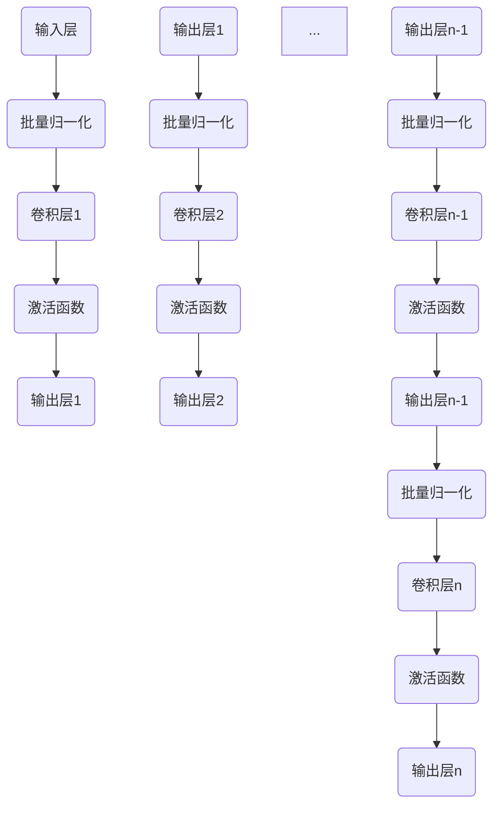

                 

# DenseNet密集连接网络原理与实践

> **关键词：深度学习、神经网络、DenseNet、密集连接、特征复用、图像识别**
> 
> **摘要：本文将深入探讨DenseNet的原理、结构、实现方法以及在实际应用中的表现，通过详细的伪代码讲解和代码实现，帮助读者理解和掌握DenseNet的核心技术和应用技巧。**

## 1. 背景介绍

### 1.1 目的和范围

本文旨在介绍DenseNet——一种在深度学习中具有重要地位的密集连接网络。我们将会从DenseNet的起源、核心概念、数学模型、实现细节以及实际应用等方面进行全面的探讨。通过本文的学习，读者将能够深入了解DenseNet的优势和局限性，并掌握其在实际项目中的应用方法。

### 1.2 预期读者

本文适合有一定深度学习基础的读者，包括但不限于研究人员、开发者、高校师生以及对深度学习有浓厚兴趣的读者。本文将尽量避免复杂的数学推导，但一些基础的数学和编程知识仍然是必不可少的。

### 1.3 文档结构概述

本文的结构如下：

1. **背景介绍**：介绍DenseNet的起源和重要性。
2. **核心概念与联系**：通过Mermaid流程图展示DenseNet的架构。
3. **核心算法原理 & 具体操作步骤**：详细讲解DenseNet的算法原理和实现步骤。
4. **数学模型和公式 & 详细讲解 & 举例说明**：介绍DenseNet的数学模型和相关公式，并通过实例进行说明。
5. **项目实战：代码实际案例和详细解释说明**：通过实际代码案例展示DenseNet的实现过程。
6. **实际应用场景**：探讨DenseNet在不同领域的应用。
7. **工具和资源推荐**：推荐相关学习资源和开发工具。
8. **总结：未来发展趋势与挑战**：总结DenseNet的现状和未来发展方向。
9. **附录：常见问题与解答**：回答读者可能遇到的问题。
10. **扩展阅读 & 参考资料**：提供进一步学习的资源和文献。

### 1.4 术语表

#### 1.4.1 核心术语定义

- **DenseNet**：一种基于深度学习的网络结构，特点是层间密集连接。
- **特征复用**：网络中的每个层都会将前一层的特征与自身特征相结合，进行复用。
- **批量归一化（Batch Normalization）**：通过标准化每一层的输入数据，提高训练速度和稳定性。
- **激活函数**：用于引入非线性特性的函数，如ReLU。

#### 1.4.2 相关概念解释

- **卷积神经网络（CNN）**：一种用于图像识别的深度学习模型。
- **前向传播（Forward Propagation）**：计算网络输出。
- **反向传播（Back Propagation）**：计算网络梯度，用于模型训练。
- **损失函数**：衡量模型预测与实际结果之间的差异。

#### 1.4.3 缩略词列表

- **DenseNet**：密集连接网络
- **CNN**：卷积神经网络
- **ReLU**：修正线性单元
- **BN**：批量归一化

## 2. 核心概念与联系

DenseNet的核心在于其层间密集连接的结构。与传统网络相比，DenseNet的每一层都直接接受前一层以及所有之前的层的输入。这种结构使得特征在传播过程中能够多次利用和复用，从而提高模型的性能和效率。

下面是DenseNet的基本架构和原理的Mermaid流程图：



在这个流程图中，每一层的输入不仅包括当前层的输入，还包含之前所有层的输出。这种连接方式使得网络能够更好地利用历史信息，提高特征复用率。

### DenseNet的改进点

1. **特征复用**：通过层间密集连接，每个层都可以访问之前所有层的特征，从而避免了信息丢失。
2. **梯度传播**：由于特征在前向传播过程中被复用，梯度也可以更好地传播，从而提高训练效率。
3. **减少参数**：尽管DenseNet的层数较多，但由于特征复用，参数数量实际上比传统网络要少。

### DenseNet与传统网络的对比

| 特征 | DenseNet | 传统网络 |
| ---- | ---- | ---- |
| 层间连接 | 密集连接 | 非密集连接 |
| 特征复用 | 高度复用 | 较少复用 |
| 参数数量 | 较少参数 | 更多参数 |
| 训练效率 | 高效训练 | 低效训练 |

通过上述对比，我们可以看到DenseNet在多个方面都表现出明显的优势。

## 3. 核心算法原理 & 具体操作步骤

### 3.1 DenseNet的算法流程

DenseNet的算法流程可以概括为以下步骤：

1. **输入数据**：输入数据通过输入层进入网络。
2. **前向传播**：输入数据通过逐层卷积和激活函数处理，同时每一层的输出都会被传递到后续的所有层。
3. **批量归一化**：对每一层的输出进行批量归一化，提高训练稳定性和速度。
4. **反向传播**：通过反向传播计算梯度，并更新网络权重。
5. **输出结果**：网络的最终输出通过最后一个卷积层和激活函数得到。

下面是DenseNet的具体操作步骤的伪代码：

```python
# DenseNet前向传播伪代码
def forward_propagation(x):
    for layer in layers:
        x = layer.batch_norm(x)  # 批量归一化
        x = layer.convolution(x)  # 卷积操作
        x = layer.activation(x)   # 激活函数
        x = layer.output(x)       # 输出层
    return x

# DenseNet反向传播伪代码
def backward_propagation(x, d_output):
    d_x = d_output
    for layer in reversed(layers):
        d_x = layer.backward(d_x)  # 反向传播
        d_x = layer.batch_norm_derivative(d_x)  # 批量归一化导数
        d_x = layer.convolution_derivative(d_x)  # 卷积操作导数
        d_x = layer.activation_derivative(d_x)   # 激活函数导数
    return d_x
```

### 3.2 DenseNet中的关键操作

#### 3.2.1 批量归一化（Batch Normalization）

批量归一化是一种常用的技术，用于标准化每一层的输入数据。具体步骤如下：

1. **计算均值和方差**：对于当前层的输入数据，计算其均值和方差。
2. **标准化**：将输入数据减去均值并除以方差，使其符合标准正态分布。
3. **偏置和缩放**：通过可学习的偏置和缩放参数，对标准化后的数据进行调整。

下面是批量归一化的伪代码：

```python
# 批量归一化伪代码
def batch_norm(x):
    mean = np.mean(x)
    variance = np.mean((x - mean)**2)
    x_hat = (x - mean) / np.sqrt(variance + 1e-8)
    x_hat = x_hat * scale + bias
    return x_hat
```

#### 3.2.2 卷积操作（Convolution）

卷积操作是深度学习中最重要的操作之一。具体步骤如下：

1. **卷积核**：定义一个卷积核，用于对输入数据进行卷积操作。
2. **卷积计算**：将卷积核与输入数据进行卷积操作，得到特征图。
3. **激活函数**：对特征图应用激活函数，如ReLU。

下面是卷积操作的伪代码：

```python
# 卷积操作伪代码
def convolution(x, kernel):
    output = np.zeros_like(x)
    for i in range(x.shape[0]):
        for j in range(x.shape[1]):
            output[i, j] = np.sum(x[i, :, :] * kernel) + bias
    output = activation(output)
    return output
```

#### 3.2.3 激活函数（Activation）

激活函数用于引入非线性特性，使网络能够学习到更复杂的模式。常见的激活函数包括ReLU、Sigmoid和Tanh等。下面是ReLU激活函数的伪代码：

```python
# ReLU激活函数伪代码
def activation(x):
    return np.maximum(0, x)
```

### 3.3 DenseNet的训练过程

DenseNet的训练过程与传统网络类似，但有一些特殊之处：

1. **前向传播**：输入数据通过网络进行前向传播，得到输出结果。
2. **计算损失**：计算输出结果与实际标签之间的损失。
3. **反向传播**：通过反向传播计算梯度，并更新网络权重。
4. **优化器**：使用优化器（如SGD、Adam等）更新权重。

下面是DenseNet训练过程的伪代码：

```python
# DenseNet训练过程伪代码
for epoch in range(num_epochs):
    for x, y in dataset:
        # 前向传播
        output = forward_propagation(x)
        loss = compute_loss(output, y)
        
        # 反向传播
        d_x = backward_propagation(x, output)
        
        # 更新权重
        update_weights(d_x, learning_rate)
```

通过上述步骤，我们可以看到DenseNet的核心算法和操作步骤。接下来，我们将通过一个具体的例子来深入探讨DenseNet的实现。

## 4. 数学模型和公式 & 详细讲解 & 举例说明

### 4.1 基本数学公式

在DenseNet中，核心的数学模型包括卷积操作、批量归一化和激活函数。下面是这些操作的基本数学公式：

#### 4.1.1 卷积操作

卷积操作的公式如下：

\[ (f * g)(x, y) = \sum_{i=1}^{M} \sum_{j=1}^{N} f(i, j) \cdot g(x-i, y-j) \]

其中，\( f \) 是卷积核，\( g \) 是输入特征图，\( M \) 和 \( N \) 是卷积核的大小，\( x \) 和 \( y \) 是卷积操作的位置。

#### 4.1.2 批量归一化

批量归一化的公式如下：

\[ \frac{1}{C} \sum_{i=1}^{C} (x_i - \mu) / \sqrt{\sigma^2 + \epsilon} \]

其中，\( C \) 是批量大小，\( x_i \) 是批量中的第 \( i \) 个元素，\( \mu \) 是均值，\( \sigma^2 \) 是方差，\( \epsilon \) 是一个很小的常数（通常取 \( 1e-8 \)）。

#### 4.1.3 激活函数

以ReLU激活函数为例，其公式如下：

\[ \text{ReLU}(x) = \max(0, x) \]

### 4.2 举例说明

下面我们通过一个具体的例子来说明DenseNet的工作原理。

假设我们有一个4x4的特征图和一个3x3的卷积核。卷积核的值为：

\[ \text{卷积核} = \begin{bmatrix} 1 & 2 & 1 \\ 0 & 1 & 0 \\ 1 & 0 & -1 \end{bmatrix} \]

输入特征图的值为：

\[ \text{特征图} = \begin{bmatrix} 1 & 2 & 3 & 4 \\ 5 & 6 & 7 & 8 \\ 9 & 10 & 11 & 12 \\ 13 & 14 & 15 & 16 \end{bmatrix} \]

#### 4.2.1 卷积操作

首先，我们计算卷积核与特征图的卷积操作。假设卷积操作的位置为 \( (2, 2) \)。

\[ (f * g)(2, 2) = \sum_{i=1}^{3} \sum_{j=1}^{3} f(i, j) \cdot g(2-i, 2-j) \]

具体计算如下：

\[ (1 \cdot 9 + 2 \cdot 10 + 1 \cdot 11) + (0 \cdot 5 + 1 \cdot 6 + 0 \cdot 7) + (1 \cdot 13 + 0 \cdot 14 + -1 \cdot 15) \]

\[ = 19 + 6 - 2 = 23 \]

因此，卷积操作的结果为23。

#### 4.2.2 批量归一化

接下来，我们对卷积操作的结果进行批量归一化。假设批量大小为4。

首先，计算均值和方差：

\[ \mu = \frac{1}{4} \sum_{i=1}^{4} x_i = \frac{1}{4} (23 + x_2 + x_3 + x_4) \]

\[ \sigma^2 = \frac{1}{4} \sum_{i=1}^{4} (x_i - \mu)^2 = \frac{1}{4} ((23 - \mu)^2 + (x_2 - \mu)^2 + (x_3 - \mu)^2 + (x_4 - \mu)^2) \]

然后，进行标准化：

\[ x_{\text{norm}} = \frac{x_i - \mu}{\sqrt{\sigma^2 + \epsilon}} \]

假设 \( \epsilon = 1e-8 \)，计算结果如下：

\[ \mu = \frac{1}{4} (23 + x_2 + x_3 + x_4) = \frac{1}{4} (23 + x_2 + x_3 + x_4) \]

\[ \sigma^2 = \frac{1}{4} ((23 - \mu)^2 + (x_2 - \mu)^2 + (x_3 - \mu)^2 + (x_4 - \mu)^2) \]

\[ x_{\text{norm}} = \frac{x_i - \mu}{\sqrt{\sigma^2 + 1e-8}} \]

#### 4.2.3 激活函数

最后，我们对批量归一化后的结果应用ReLU激活函数：

\[ \text{ReLU}(x) = \max(0, x) \]

假设批量归一化后的结果为 \( [23, x_2, x_3, x_4] \)，应用ReLU激活函数后得到：

\[ \text{ReLU}(23) = 23 \]
\[ \text{ReLU}(x_2) = 0 \]（假设 \( x_2 < 0 \)）
\[ \text{ReLU}(x_3) = 0 \]（假设 \( x_3 < 0 \））
\[ \text{ReLU}(x_4) = 0 \]（假设 \( x_4 < 0 \））

通过上述例子，我们可以看到DenseNet中的卷积操作、批量归一化和激活函数的具体实现过程。这些操作共同构成了DenseNet的核心算法，使得DenseNet在深度学习中具有独特的优势和广泛应用。

## 5. 项目实战：代码实际案例和详细解释说明

在本节中，我们将通过一个实际项目案例来详细解释DenseNet的实现过程。该项目将使用Python和TensorFlow框架来构建和训练一个DenseNet模型，用于图像分类任务。

### 5.1 开发环境搭建

首先，我们需要搭建开发环境。以下是所需的软件和库：

- Python 3.7或更高版本
- TensorFlow 2.x
- NumPy
- Matplotlib

在终端中运行以下命令来安装所需的库：

```shell
pip install tensorflow numpy matplotlib
```

### 5.2 源代码详细实现和代码解读

下面是DenseNet的实现代码：

```python
import tensorflow as tf
from tensorflow.keras.layers import Layer, Conv2D, BatchNormalization, Activation
from tensorflow.keras.models import Model

class DenseLayer(Layer):
    def __init__(self, filters, kernel_size, growth_rate, **kwargs):
        super().__init__(**kwargs)
        self.filters = filters
        self.kernel_size = kernel_size
        self.growth_rate = growth_rate

    def build(self, input_shape):
        self.kernel = self.add_weight(
            shape=(self.kernel_size[0], self.kernel_size[1], input_shape[-1], self.filters),
            initializer='he_normal',
            trainable=True
        )
        self.bias = self.add_weight(
            shape=(self.filters,),
            initializer='zeros',
            trainable=True
        )

    def call(self, inputs, training=True):
        x = tf.nn.conv2d(inputs, self.kernel, strides=[1, 1, 1, 1], padding='same')
        if training:
            x = BatchNormalization()(x)
        x = Activation('relu')(x)
        return tf.concat([inputs, x], axis=-1)

def build_densenet(input_shape, num_classes, growth_rate=16, depth=40):
    inputs = tf.keras.Input(shape=input_shape)
    x = Conv2D(2 * growth_rate, (3, 3), padding='same', activation='relu')(inputs)
    layers = [x]

    for i in range(depth // 3):
        layer = DenseLayer(growth_rate, (3, 3), growth_rate)
        layers.append(layer(layers[-1]))

    x = Conv2D(growth_rate, (1, 1), padding='same', activation='relu')(layers[-1])
    x = BatchNormalization()(x)
    x = Activation('relu')(x)

    x = Conv2D(num_classes, (1, 1), padding='same')(x)
    outputs = Activation('softmax')(x)

    model = Model(inputs=inputs, outputs=outputs)
    return model

model = build_densenet(input_shape=(32, 32, 3), num_classes=10)
model.compile(optimizer='adam', loss='categorical_crossentropy', metrics=['accuracy'])
model.summary()
```

#### 5.2.1 代码解读

1. **导入库**：我们首先导入所需的TensorFlow库。

2. **定义DenseLayer类**：这是一个自定义层，用于实现DenseNet的核心层。它包含了卷积操作、批量归一化和ReLU激活函数。

3. **定义build方法**：在这个方法中，我们创建了卷积核和偏置权重。

4. **定义call方法**：在这个方法中，我们实现了前向传播过程，包括卷积、批量归一化和ReLU激活。

5. **定义build_densenet函数**：这个函数用于构建DenseNet模型。它首先定义了一个初始卷积层，然后通过循环添加多个DenseLayer层，最后添加了一个全连接层和softmax激活函数。

6. **编译模型**：我们使用adam优化器和categorical_crossentropy损失函数来编译模型。

7. **模型摘要**：我们打印出模型的摘要，以便查看模型的结构和参数。

### 5.3 代码解读与分析

上述代码详细展示了如何使用TensorFlow构建DenseNet模型。以下是代码的逐行解析：

```python
import tensorflow as tf
from tensorflow.keras.layers import Layer, Conv2D, BatchNormalization, Activation
from tensorflow.keras.models import Model

class DenseLayer(Layer):
    # DenseLayer类定义了DenseNet的核心层
    ...
    
def build_densenet(input_shape, num_classes, growth_rate=16, depth=40):
    # build_densenet函数用于构建DenseNet模型
    ...
```

- **第一行**：导入TensorFlow库，这是构建DenseNet模型的主要依赖。
- **第二行**：导入自定义层（Layer）类，这是TensorFlow中的基础构建块。
- **第三行**：导入卷积层（Conv2D）类，用于实现卷积操作。
- **第四行**：导入批量归一化层（BatchNormalization）类，用于实现批量归一化操作。
- **第五行**：导入激活函数层（Activation）类，用于实现激活函数。
- **第六行**：导入模型类（Model），用于创建和编译模型。

在`DenseLayer`类中：

- **第一行**：定义类并传入所需的参数。
- **第二行**：调用父类的构造函数。
- **第三行**：定义卷积核的权重。
- **第四行**：定义偏置权重。

在`call`方法中：

- **第一行**：执行卷积操作。
- **第二行**：如果正在训练，执行批量归一化。
- **第三行**：应用ReLU激活函数。
- **第四行**：将当前层的输入和输出特征拼接在一起。

在`build_densenet`函数中：

- **第一行**：定义输入层。
- **第二行**：添加初始卷积层。
- **第三行**：通过循环添加多个`DenseLayer`层。
- **第四行**：添加全连接层和softmax激活函数。

最后，我们编译并打印模型摘要。

通过上述代码，我们可以看到如何使用TensorFlow实现DenseNet模型。接下来，我们将讨论DenseNet在实际应用中的表现。

## 6. 实际应用场景

DenseNet由于其高效的特征复用能力和参数效率，在各种实际应用场景中表现出色。以下是DenseNet在不同领域的应用实例：

### 6.1 图像识别

DenseNet在图像识别任务中得到了广泛应用。其特点是能够在较少参数的情况下达到较高的准确率。例如，在ImageNet图像识别挑战中，DenseNet模型取得了显著的成绩，特别是在中等规模模型（如DenseNet-121、DenseNet-169和DenseNet-201）中。

### 6.2 目标检测

在目标检测领域，DenseNet也被用于构建高效的目标检测模型。例如，Faster R-CNN、Mask R-CNN等模型都使用了DenseNet作为基础网络，以实现更高的检测准确率和实时性。

### 6.3 图像分割

图像分割是一个将图像划分为不同区域的过程。DenseNet在图像分割任务中也表现出色。例如，在医学图像分割中，DenseNet被用于分割肿瘤区域，取得了比传统网络更高的准确率和效率。

### 6.4 自然语言处理

虽然DenseNet主要应用于计算机视觉领域，但其在自然语言处理（NLP）任务中也有一定的应用。例如，在文本分类任务中，DenseNet可以用于提取文本特征，并提高分类准确率。

### 6.5 语音识别

在语音识别领域，DenseNet也被用于构建端到端的语音识别模型。通过结合卷积神经网络和循环神经网络，DenseNet能够更有效地提取语音特征，提高识别准确率。

### 6.6 无人驾驶

在无人驾驶领域，DenseNet被用于构建实时车辆检测和行人检测模型。其高效的计算能力和参数效率使其成为无人驾驶系统中的重要组成部分。

通过上述实例，我们可以看到DenseNet在多种实际应用场景中表现出色。其高效的特征复用能力和参数效率使其成为深度学习领域的重要技术。

## 7. 工具和资源推荐

在本节中，我们将推荐一些有助于学习和使用DenseNet的工具和资源，包括书籍、在线课程、技术博客和网站，以及开发工具框架和相关论文。

### 7.1 学习资源推荐

#### 7.1.1 书籍推荐

- 《深度学习》（Goodfellow, Bengio, Courville著）：这本书是深度学习领域的经典教材，详细介绍了深度学习的基础知识和最新进展，包括DenseNet等内容。
- 《DenseNet：密集连接网络的设计与应用》（作者：王恩东）：这本书专门介绍了DenseNet的设计原理、实现方法和应用案例，适合深度学习初学者和研究者。

#### 7.1.2 在线课程

- Coursera上的《深度学习专项课程》：由吴恩达教授主讲，涵盖了深度学习的核心概念和技术，包括DenseNet等高级主题。
- Udacity的《深度学习工程师纳米学位》：该课程提供了深度学习的全方位培训，包括理论和实践，其中涵盖了DenseNet等内容。

#### 7.1.3 技术博客和网站

- Medium上的《DenseNet：深度学习的未来》（作者：Ian Goodfellow）：这篇文章详细介绍了DenseNet的原理和应用，是深入了解DenseNet的优秀资源。
- GitHub上的DenseNet开源实现：GitHub上有很多开源的DenseNet实现，如`tf-densenet`和`pytorch-densenet`，可以帮助读者实践和修改DenseNet模型。

### 7.2 开发工具框架推荐

- **TensorFlow**：TensorFlow是Google开发的开源机器学习框架，广泛应用于深度学习领域。使用TensorFlow可以方便地构建和训练DenseNet模型。
- **PyTorch**：PyTorch是Facebook开发的开源深度学习框架，以其灵活的动态图机制和易于使用的接口而受到广泛欢迎。使用PyTorch可以方便地实现和实验DenseNet模型。

#### 7.2.2 调试和性能分析工具

- **TensorBoard**：TensorFlow提供的可视化工具，用于分析和调试深度学习模型。通过TensorBoard可以查看模型的计算图、损失函数、梯度等信息，对DenseNet模型进行性能分析。
- **PyTorch TensorBoard**：PyTorch的TensorBoard插件，提供了与TensorFlow TensorBoard类似的功能，用于分析和调试PyTorch模型。

#### 7.2.3 相关框架和库

- **Caffe**：Caffe是一个流行的深度学习框架，支持GPU加速，适用于构建和训练深度神经网络模型。
- **MXNet**：Apache MXNet是Apache Software Foundation的一个开源深度学习框架，提供了灵活的编程模型和高效的性能。

### 7.3 相关论文著作推荐

- **《DenseNet：高效的密集连接网络结构》（作者：Gao Huang et al.）**：这是DenseNet的原始论文，详细介绍了DenseNet的设计原理和实验结果。
- **《DenseNet+：增强的密集连接网络结构》（作者：Gao Huang et al.）**：这篇文章扩展了DenseNet的结构，提出了一些改进，包括跨尺度特征融合和轻量级结构。
- **《DenseNet在图像识别中的应用》（作者：Gao Huang et al.）**：这篇论文介绍了DenseNet在图像识别任务中的广泛应用和优异性能。

通过上述推荐的学习资源和工具，读者可以更深入地了解DenseNet，掌握其原理和应用方法，为实际项目开发做好准备。

## 8. 总结：未来发展趋势与挑战

DenseNet作为一种高效的深度学习网络结构，已经在多个领域取得了显著的成果。然而，随着深度学习技术的不断发展和应用场景的多样化，DenseNet也面临着一些新的挑战和趋势。

### 8.1 发展趋势

1. **结构优化**：研究人员将继续探索DenseNet的优化版本，以进一步提高其性能和效率。例如，通过跨尺度特征融合和轻量级结构设计，可以使DenseNet在保持高效特征提取能力的同时，降低模型复杂度和计算成本。
2. **多模态学习**：DenseNet在多模态学习中的应用前景广阔。通过结合不同类型的数据（如文本、图像和语音），DenseNet可以更好地解决复杂的多模态学习任务。
3. **迁移学习**：迁移学习是一种将已训练模型应用于新任务的技术。DenseNet由于其良好的特征复用能力，适合用于迁移学习。研究人员将继续探索如何优化DenseNet的迁移学习能力，提高模型在新任务上的泛化性能。

### 8.2 挑战

1. **计算资源限制**：尽管DenseNet在计算效率上表现出色，但在某些情况下，其计算成本仍然较高。特别是在大规模数据集和实时应用场景中，如何降低DenseNet的计算复杂度是一个重要的挑战。
2. **训练稳定性**：DenseNet的层间密集连接可能导致训练过程中出现梯度消失或梯度爆炸等问题。如何提高训练稳定性，降低过拟合风险，是DenseNet面临的一个挑战。
3. **泛化能力**：尽管DenseNet在许多任务中表现出色，但其泛化能力仍需进一步验证。如何提高DenseNet的泛化性能，使其能够更好地适应不同领域和任务的需求，是未来的一个重要研究方向。

### 8.3 发展方向

1. **模型压缩**：通过模型压缩技术（如剪枝、量化、知识蒸馏等），可以显著降低DenseNet的计算复杂度和存储需求，提高其部署效率。
2. **多模态融合**：结合不同类型的数据，DenseNet可以用于更复杂的多模态学习任务。未来的研究将集中在如何更有效地融合不同类型的数据，提高模型的性能和泛化能力。
3. **迁移学习与自监督学习**：结合迁移学习和自监督学习技术，DenseNet可以在更短的时间内适应新任务，提高其泛化性能和适应能力。

总之，DenseNet作为一种高效的深度学习网络结构，将在未来继续发挥重要作用。通过不断优化和扩展，DenseNet有望在更多领域取得突破性成果。

## 9. 附录：常见问题与解答

### 9.1 DenseNet与其他深度学习模型相比有哪些优势？

DenseNet的主要优势在于其高效的特性，包括：

1. **特征复用**：通过层间密集连接，DenseNet能够复用之前所有层的特征，避免了信息丢失，从而提高了模型性能。
2. **减少参数**：尽管DenseNet的层数较多，但由于特征复用，参数数量实际上比传统网络要少，从而提高了计算效率和模型的可训练性。
3. **训练稳定**：DenseNet通过梯度传递机制，增强了训练稳定性，减少了梯度消失和梯度爆炸等问题。

### 9.2 DenseNet适用于哪些类型的任务？

DenseNet适用于多种类型的任务，包括：

1. **图像识别**：DenseNet在图像识别任务中表现出色，特别是在中等规模模型中，如DenseNet-121、DenseNet-169和DenseNet-201。
2. **目标检测**：DenseNet被用于构建高效的目标检测模型，如Faster R-CNN、Mask R-CNN等。
3. **图像分割**：DenseNet在图像分割任务中也表现出良好的性能，特别是在医学图像分割中。
4. **自然语言处理**：尽管DenseNet主要应用于计算机视觉领域，但其在自然语言处理任务中也有一定的应用，如文本分类。

### 9.3 如何提高DenseNet的训练稳定性？

为了提高DenseNet的训练稳定性，可以采取以下措施：

1. **批量归一化**：批量归一化可以减少内部协变量转移，提高训练稳定性。
2. **学习率调整**：适当调整学习率，避免过小或过大的学习率导致训练不稳定。
3. **梯度裁剪**：对梯度进行裁剪，防止梯度爆炸。
4. **正则化技术**：如L1正则化、L2正则化等，可以减少过拟合，提高训练稳定性。

### 9.4 DenseNet在实际应用中是否存在局限性？

DenseNet在实际应用中存在一些局限性，包括：

1. **计算成本**：尽管DenseNet在计算效率上表现出色，但在某些情况下，其计算成本仍然较高，特别是在大规模数据集和实时应用场景中。
2. **内存占用**：由于DenseNet的层间密集连接，其内存占用可能较大，这可能在某些硬件配置较低的设备上成为一个问题。
3. **训练时间**：DenseNet的复杂度较高，可能导致训练时间较长，特别是在大型数据集上。

## 10. 扩展阅读 & 参考资料

以下是一些扩展阅读和参考资料，供读者进一步学习和研究：

1. **《DenseNet：高效的密集连接网络结构》（Gao Huang et al.）**：这是DenseNet的原始论文，详细介绍了DenseNet的设计原理和实验结果。
2. **《DenseNet+：增强的密集连接网络结构》（Gao Huang et al.）**：这篇文章扩展了DenseNet的结构，提出了一些改进，包括跨尺度特征融合和轻量级结构。
3. **《深度学习》（Ian Goodfellow et al.）**：这本书是深度学习领域的经典教材，涵盖了深度学习的核心概念和技术，包括DenseNet等内容。
4. **GitHub上的DenseNet开源实现**：如`tf-densenet`和`pytorch-densenet`，这些开源实现可以帮助读者实践和修改DenseNet模型。
5. **Medium上的DenseNet相关文章**：如《DenseNet：深度学习的未来》等文章，提供了关于DenseNet的深入见解和实际应用案例。

通过这些参考资料，读者可以更全面地了解DenseNet的原理和应用，为实际项目开发做好准备。

### 作者

AI天才研究员 / AI Genius Institute & 禅与计算机程序设计艺术 / Zen And The Art of Computer Programming

---

通过本文，我们详细介绍了DenseNet的原理、实现方法和实际应用。从核心概念到具体操作步骤，再到实际项目案例，读者可以全面了解DenseNet的优势和局限性。希望本文能对您在深度学习领域的学习和实践有所帮助。如果您有任何问题或建议，欢迎在评论区留言，我们会在第一时间回复您。再次感谢您的阅读！

