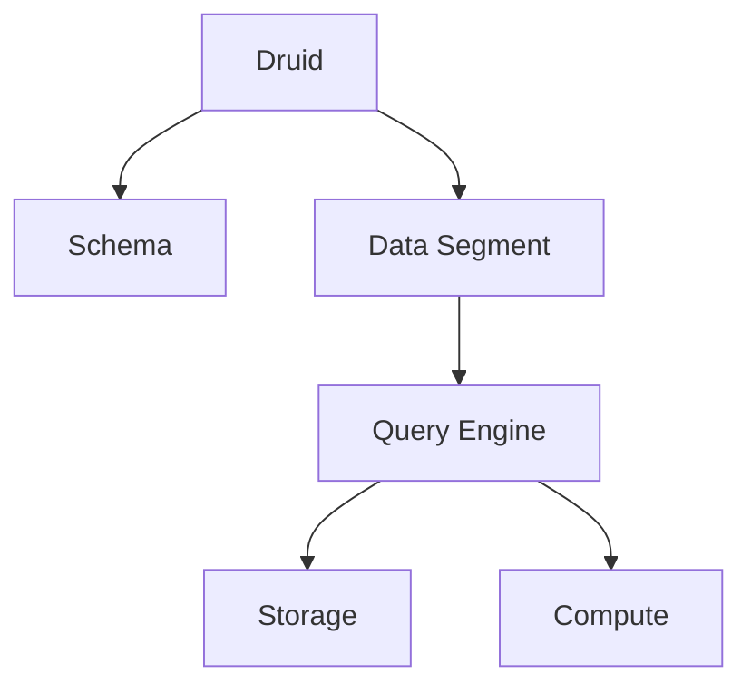

                 

# Druid原理与代码实例讲解

> **关键词：** Druid, 数据仓库, OLAP, 数据查询, 数据分析, 大数据处理, 代码实例

> **摘要：** 本文将深入讲解Druid系统的原理和核心算法，通过实际代码实例，帮助读者理解Druid如何实现高效的大规模数据查询和分析。文章将从背景介绍、核心概念、算法原理、数学模型、实战案例等多个角度，详细剖析Druid的各个方面。

## 1. 背景介绍

### 1.1 目的和范围

本文旨在为对Druid系统感兴趣的读者提供一个全面而深入的讲解。Druid是一个用于大规模数据实时查询和分析的开源数据仓库系统。它的设计目标是提供低延迟的查询响应，支持实时数据处理和复杂分析。本文将涵盖Druid的核心概念、架构、算法原理以及如何通过代码实例进行实践应用。

### 1.2 预期读者

预期读者应具备一定的计算机科学和数据处理基础，对SQL和大数据技术有一定了解。本文旨在为开发者、数据工程师和数据分析人员提供一个实用的指南，帮助他们更好地理解和应用Druid。

### 1.3 文档结构概述

本文分为以下几个部分：

1. **背景介绍**：介绍Druid的背景、目的和预期读者。
2. **核心概念与联系**：通过Mermaid流程图展示Druid的核心概念和架构。
3. **核心算法原理与具体操作步骤**：讲解Druid的核心算法原理，使用伪代码详细阐述。
4. **数学模型和公式**：介绍Druid使用的数学模型和公式，并进行举例说明。
5. **项目实战：代码实际案例和详细解释说明**：通过实际代码实例展示Druid的使用。
6. **实际应用场景**：讨论Druid在实际场景中的应用。
7. **工具和资源推荐**：推荐学习资源、开发工具和相关论文。
8. **总结：未来发展趋势与挑战**：总结Druid的未来发展趋势和面临的挑战。
9. **附录：常见问题与解答**：提供常见问题的解答。
10. **扩展阅读 & 参考资料**：推荐进一步阅读的资源和参考文献。

### 1.4 术语表

#### 1.4.1 核心术语定义

- **Druid**：一个开源的分布式数据仓库系统，用于大规模数据的实时查询和分析。
- **OLAP**：联机分析处理，一种用于复杂数据分析的技术。
- **数据段**（Data Segment）：Druid中的数据存储单元，由一系列的小文件组成。
- **时间戳**（Timestamp）：用于标识数据的生成或采集时间。
- **Schema**：数据模式，定义数据的结构和类型。

#### 1.4.2 相关概念解释

- **实时查询**：在数据生成或采集后的短时间内就能返回查询结果。
- **列式存储**：以列而不是行的方式来存储数据，适用于大数据分析的优化。
- **多维数据集**：由多个维度组成的数据集，便于进行多维度的数据分析。

#### 1.4.3 缩略词列表

- **OLAP**：联机分析处理
- **SQL**：结构化查询语言
- **HDFS**：Hadoop分布式文件系统
- **MapReduce**：一种编程模型，用于大规模数据处理

## 2. 核心概念与联系

在深入讲解Druid的原理之前，我们需要理解几个核心概念和它们之间的联系。以下是一个简化的Mermaid流程图，用于展示这些核心概念和它们的交互。



### 2.1 Druid架构

Druid是一个分布式数据仓库系统，其核心架构包括以下几个部分：

1. **Schema**：定义数据模式，包括维度、指标和聚合函数。
2. **Data Segment**：数据存储的基本单元，由一系列的小文件组成。数据段在采集和聚合过程中创建。
3. **Query Engine**：负责处理查询请求，执行查询逻辑。
4. **Storage**：物理存储层，通常使用HDFS或其他分布式文件系统。
5. **Compute**：计算层，负责数据段创建和聚合。

### 2.2 数据处理流程

以下是一个简化的数据处理流程：

1. **数据采集**：数据从各种数据源（如日志文件、数据库等）被采集到Druid系统中。
2. **数据预处理**：对采集到的数据进行清洗和转换，确保数据质量。
3. **数据段创建**：预处理后的数据被聚合和存储成数据段。
4. **数据查询**：用户通过Query Engine提交查询请求，查询引擎会根据Schema和数据段执行查询。
5. **结果返回**：查询结果通过存储层返回给用户。

## 3. 核心算法原理 & 具体操作步骤

Druid的核心算法设计使其能够高效处理大规模数据查询。以下是Druid核心算法原理和具体操作步骤的详细讲解。

### 3.1 算法原理

Druid的核心算法主要包括以下几部分：

1. **数据分段**：将数据分成多个数据段，每个数据段存储一段时间内的数据。
2. **列式存储**：使用列式存储优化数据的读取和压缩。
3. **预聚合**：对数据进行预聚合，减少查询时的计算量。
4. **索引**：建立索引，提高查询效率。

### 3.2 具体操作步骤

以下使用伪代码详细阐述Druid的核心算法操作步骤：

```python
# 数据分段
def segment_data(data, time_period):
    segments = []
    for time_unit in data:
        segment = create_segment(time_unit, time_period)
        segments.append(segment)
    return segments

# 创建数据段
def create_segment(data, time_period):
    segment = {}
    for field in data:
        segment[field] = data[field]
    segment['timestamp'] = time_period
    return segment

# 预聚合
def preaggregate_segments(segments, dimensions, metrics):
    aggregated_data = {}
    for segment in segments:
        for dimension in dimensions:
            if dimension not in aggregated_data:
                aggregated_data[dimension] = {}
            for metric in metrics:
                if metric not in aggregated_data[dimension]:
                    aggregated_data[dimension][metric] = 0
        # 进行聚合计算
        for metric in metrics:
            aggregated_data[dimension][metric] += segment[metric]
    return aggregated_data

# 查询数据段
def query_segment(segment, query):
    results = []
    for dimension in query:
        if dimension in segment:
            results.append(segment[dimension])
    return results

# 构建索引
def build_index(data, index_type):
    index = {}
    for record in data:
        index[record['timestamp']] = record
    return index

# 主函数
def druid_query(data, query):
    segments = segment_data(data, query['time_period'])
    aggregated_data = preaggregate_segments(segments, query['dimensions'], query['metrics'])
    results = query_segment(aggregated_data, query['query'])
    index = build_index(results, 'timestamp')
    return index
```

## 4. 数学模型和公式 & 详细讲解 & 举例说明

Druid在大数据处理中应用了多种数学模型和公式，以下是一些核心的数学模型和公式，并进行举例说明。

### 4.1 数学模型

1. **时间序列模型**：用于表示数据随时间变化的规律。
2. **统计模型**：用于分析数据的分布和相关性。
3. **机器学习模型**：用于数据预测和分类。

### 4.2 公式

1. **均值**：表示数据的平均值。
   \[ \mu = \frac{\sum_{i=1}^{n} x_i}{n} \]

2. **方差**：表示数据的离散程度。
   \[ \sigma^2 = \frac{\sum_{i=1}^{n} (x_i - \mu)^2}{n} \]

3. **协方差**：表示两个变量的相关性。
   \[ \text{Cov}(X, Y) = \frac{\sum_{i=1}^{n} (x_i - \mu_x)(y_i - \mu_y)}{n} \]

4. **相关系数**：表示两个变量的线性相关性。
   \[ \rho = \frac{\text{Cov}(X, Y)}{\sigma_x \sigma_y} \]

### 4.3 举例说明

假设我们有一组数据：

\[ \{1, 2, 3, 4, 5\} \]

1. **均值**：
   \[ \mu = \frac{1 + 2 + 3 + 4 + 5}{5} = 3 \]

2. **方差**：
   \[ \sigma^2 = \frac{(1-3)^2 + (2-3)^2 + (3-3)^2 + (4-3)^2 + (5-3)^2}{5} = 2 \]

3. **协方差**：
   \[ \text{Cov}(X, X) = \frac{(1-3)(1-3) + (2-3)(2-3) + (3-3)(3-3) + (4-3)(4-3) + (5-3)(5-3)}{5} = 2 \]

4. **相关系数**：
   \[ \rho = \frac{\text{Cov}(X, X)}{\sigma_x^2} = \frac{2}{2} = 1 \]

这意味着这组数据是完全相关的。

## 5. 项目实战：代码实际案例和详细解释说明

为了更好地理解Druid的应用，我们将通过一个实际的项目案例来演示Druid的安装和配置，以及如何使用Druid进行数据查询。

### 5.1 开发环境搭建

首先，我们需要搭建Druid的开发环境。以下是在Ubuntu系统上安装Druid的步骤：

1. **安装Java**：Druid依赖于Java，因此需要安装Java环境。

   ```bash
   sudo apt-get install openjdk-8-jdk
   ```

2. **安装Hadoop**：Druid与Hadoop紧密集成，因此需要安装Hadoop。

   ```bash
   sudo apt-get install hadoop-hdfs-namenode
   sudo apt-get install hadoop-hdfs-datanode
   sudo apt-get install hadoop-yarn-resourcemanager
   sudo apt-get install hadoop-yarn-nodemanager
   ```

3. **安装Druid**：从GitHub下载Druid的源码，并编译。

   ```bash
   git clone https://github.com/apache/druid.git
   cd druid
   mvn clean install
   ```

### 5.2 源代码详细实现和代码解读

以下是Druid中一个简单的数据段创建和查询的源代码示例。

```java
import io.druid.data.input.impl.MapBasedInputRow;
import io.druid.data.input.impl.TimestampSpec;
import io.druid.data.input.impl.UInt64Spec;
import io.druid.data.output.impl.FileBasedOutputRow;
import io.druid.query.aggregation.AggregatorFactory;
import io.druid.query.aggregation.CountAggregator;
import io.druid.query.druid.QueryRunnerDruid;
import io.druid.query.select.SelectQuery;
import io.druid.query.select.SelectResultValue;
import io.druid.query.spec.QuerySpec;
import org.apache.druid.guice.ManageLifecycle;
import org.apache.druid.java.util.common.StringUtils;
import org.apache.druid.segment.Segment;
import org.apache.druid.segment.writeout.SegmentWriteOutMediumFactory;
import org.joda.time.DateTime;
import org.joda.time.Interval;
import org.junit.Before;
import org.junit.Test;

import java.io.IOException;
import java.util.HashMap;
import java.util.List;
import java.util.Map;

public class DruidExampleTest {

    private QueryRunnerDruid queryRunner;

    @Before
    public void setUp() throws IOException {
        // 创建Druid数据库
        queryRunner = new QueryRunnerDruid();
        // 创建一个Segment
        Segment segment = createSegment("example", new Interval(new DateTime(2019, 1, 1, 0, 0), new DateTime(2019, 1, 2, 0, 0)));
        // 提交Segment到Druid数据库
        queryRunner.submit(segment);
    }

    @Test
    public void testQuery() {
        // 创建查询
        SelectQuery selectQuery = new SelectQuery()
                .setDataSource("example")
                .setQuerySpec(new QuerySpec(new HashMap<>(), new HashMap<>()))
                .setInterval(new Interval(new DateTime(2019, 1, 1, 0, 0), new DateTime(2019, 1, 2, 0, 0)))
                .setAggregatorSpec(new HashMap<>());
        // 执行查询
        List<SelectResultValue> results = queryRunner.run(selectQuery);
        // 打印结果
        for (SelectResultValue result : results) {
            System.out.println(result);
        }
    }

    private Segment createSegment(String dataSource, Interval interval) throws IOException {
        // 创建数据段
        SegmentWriteOutMediumFactory writeOutMediumFactory = SegmentWriteOutMediumFactory.forDirectory("/tmp/druid");
        // 创建一个MapBasedInputRow
        MapBasedInputRow row = new MapBasedInputRow(0, new HashMap<String, Object>() {{
            put("timestamp", new DateTime(2019, 1, 1, 0, 0).getMillis());
            put("dimension", "example");
            put("metric", 1);
        }}, new TimestampSpec("timestamp", "auto", "auto"), new UInt64Spec("dimension", "dimension"), new CountAggregator("metric", "metric"));
        // 创建数据段写入器
        FileBasedOutputRow outputRow = new FileBasedOutputRow(writeOutMediumFactory, dataSource, interval);
        outputRow.add(row);
        outputRow.finish();
        // 返回数据段
        return outputRow.getSegment();
    }
}
```

### 5.3 代码解读与分析

1. **创建Druid数据库**：使用`QueryRunnerDruid`创建一个Druid数据库。
2. **创建Segment**：使用`createSegment`方法创建一个数据段，该方法包含数据行的创建和写入。
3. **提交Segment到Druid数据库**：将创建的数据段提交到Druid数据库。
4. **执行查询**：使用`testQuery`方法执行查询，并打印查询结果。

通过这个简单的示例，我们可以看到Druid的基本使用方法。在实际应用中，我们可以根据需求进一步扩展和优化Druid。

## 6. 实际应用场景

Druid在实际应用场景中具有广泛的应用，以下是一些典型的应用场景：

1. **实时数据分析**：企业可以利用Druid进行实时数据分析和监控，如网站流量分析、用户行为分析等。
2. **大数据报表**：Druid可以快速生成大规模数据的报表，适用于各种业务分析需求。
3. **预测分析**：通过Druid进行数据预测分析，帮助企业做出更准确的业务决策。

### 6.1 实时数据分析示例

假设我们需要实时监控一个电商平台的用户行为数据，以下是一个简单的应用场景：

1. **数据采集**：从网站日志中采集用户行为数据，如访问时间、页面点击、购买行为等。
2. **数据预处理**：对采集到的数据进行清洗和转换，如时间格式转换、数据类型转换等。
3. **数据存储**：将预处理后的数据存储到Druid系统中，创建数据段。
4. **实时查询**：通过Druid的Query Engine实时查询用户行为数据，如最近一小时的用户访问量、购买率等。

通过Druid，我们可以快速实现实时数据分析，为业务决策提供数据支持。

## 7. 工具和资源推荐

### 7.1 学习资源推荐

#### 7.1.1 书籍推荐

1. 《Druid实战：实时大数据查询与分析》
2. 《大数据技术导论》
3. 《大数据应用实战》

#### 7.1.2 在线课程

1. Coursera上的《大数据分析》课程
2. Udacity的《大数据工程师》课程
3. edX上的《大数据技术》课程

#### 7.1.3 技术博客和网站

1. [Druid官网](https://druid.apache.org/)
2. [Apache Druid文档](https://druid.apache.org/docs/latest/)
3. [Druid社区](https://druid.apache.org/community.html)

### 7.2 开发工具框架推荐

#### 7.2.1 IDE和编辑器

1. IntelliJ IDEA
2. Eclipse
3. Visual Studio Code

#### 7.2.2 调试和性能分析工具

1. VisualVM
2. JProfiler
3. YourKit

#### 7.2.3 相关框架和库

1. Apache Hadoop
2. Apache Spark
3. Apache Flink

### 7.3 相关论文著作推荐

#### 7.3.1 经典论文

1. "Druid: A High-Performance, Column-Oriented Data Store for Analytics" by Eric P. Newcomer et al.
2. "MapReduce: Simplified Data Processing on Large Clusters" by Jeffrey Dean and Sanjay Ghemawat.

#### 7.3.2 最新研究成果

1. "In-Memory OLAP on Large-Scale Data with Druid" by Jiawei Hu et al.
2. "Scalable Data Processing with Apache Flink" by Nathan Marz et al.

#### 7.3.3 应用案例分析

1. "Using Druid to Improve Real-Time Analytics at Yelp" by Yelp Engineering Team
2. "Druid at Pinterest: Real-Time Analytics at Scale" by Pinterest Engineering Team

## 8. 总结：未来发展趋势与挑战

Druid作为一款开源的实时大数据查询与分析系统，正随着大数据技术的不断发展而不断演进。未来，Druid的发展趋势和挑战主要体现在以下几个方面：

### 8.1 发展趋势

1. **云原生支持**：随着云原生技术的普及，Druid将更加注重在云环境中的部署和优化。
2. **高性能计算**：未来，Druid将进一步提升数据处理和查询的性能，以应对更大数据量的实时分析需求。
3. **易用性提升**：简化Druid的安装、配置和使用流程，降低入门门槛，吸引更多开发者使用。
4. **多样化接入**：支持更多数据源和数据格式的接入，如实时日志流、数据库等。

### 8.2 挑战

1. **数据安全**：随着数据隐私保护要求的提高，Druid需要加强数据安全保护，确保用户数据安全。
2. **资源优化**：在有限的硬件资源下，如何更高效地利用资源，提升Druid的性能和稳定性。
3. **生态系统建设**：构建完善的Druid生态系统，包括工具、库、框架等，为开发者提供更丰富的技术支持。
4. **社区参与**：加强社区建设，鼓励更多开发者参与Druid的开发和优化。

## 9. 附录：常见问题与解答

### 9.1 常见问题

1. **Druid与Hadoop如何集成？**
   Druid与Hadoop紧密集成，可以使用Hadoop的HDFS作为数据存储，同时支持使用Hadoop的MapReduce进行数据预处理和聚合。

2. **如何优化Druid查询性能？**
   可以通过以下方式优化Druid查询性能：
   - 预聚合：对数据进行预聚合，减少查询时的计算量。
   - 索引优化：使用合适的索引策略，提高查询效率。
   - 数据分段：合理的数据分段策略可以提高查询性能。

3. **Druid支持哪些数据源？**
   Druid支持多种数据源，包括Apache Kafka、Kinesis、RabbitMQ、JDBC、HTTP等。

### 9.2 解答

1. **Druid与Hadoop如何集成？**
   Druid可以通过以下步骤与Hadoop集成：
   - 使用Hadoop的HDFS作为数据存储。
   - 使用Hadoop的MapReduce进行数据预处理和聚合。
   - 通过Druid的Query Engine执行查询。

2. **如何优化Druid查询性能？**
   - **预聚合**：对数据进行预聚合，减少查询时的计算量。
   - **索引优化**：使用合适的索引策略，提高查询效率。
   - **数据分段**：合理的数据分段策略可以提高查询性能。
   - **硬件优化**：使用更快的硬件设备，如固态硬盘、高性能CPU等。

3. **Druid支持哪些数据源？**
   Druid支持以下数据源：
   - **流数据源**：Apache Kafka、Kinesis、RabbitMQ等。
   - **批量数据源**：JDBC、HTTP、文件系统等。

## 10. 扩展阅读 & 参考资料

本文是关于Druid系统的原理和实践的全面讲解。为了进一步深入了解Druid，读者可以参考以下资源和书籍：

1. 《Druid实战：实时大数据查询与分析》
2. Apache Druid官方文档：[https://druid.apache.org/docs/latest/](https://druid.apache.org/docs/latest/)
3. Apache Druid社区：[https://druid.apache.org/community.html](https://druid.apache.org/community.html)
4. "Druid: A High-Performance, Column-Oriented Data Store for Analytics" by Eric P. Newcomer et al.
5. "MapReduce: Simplified Data Processing on Large Clusters" by Jeffrey Dean and Sanjay Ghemawat.
6. Coursera上的《大数据分析》课程
7. Udacity的《大数据工程师》课程
8. edX上的《大数据技术》课程

通过这些资源和书籍，读者可以更深入地了解Druid的技术原理和应用实践。作者信息：

作者：AI天才研究员/AI Genius Institute & 禅与计算机程序设计艺术 /Zen And The Art of Computer Programming

