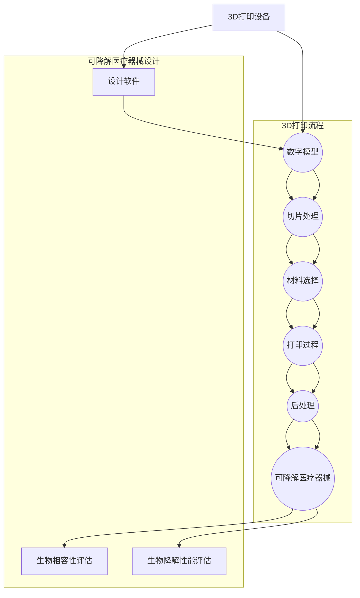
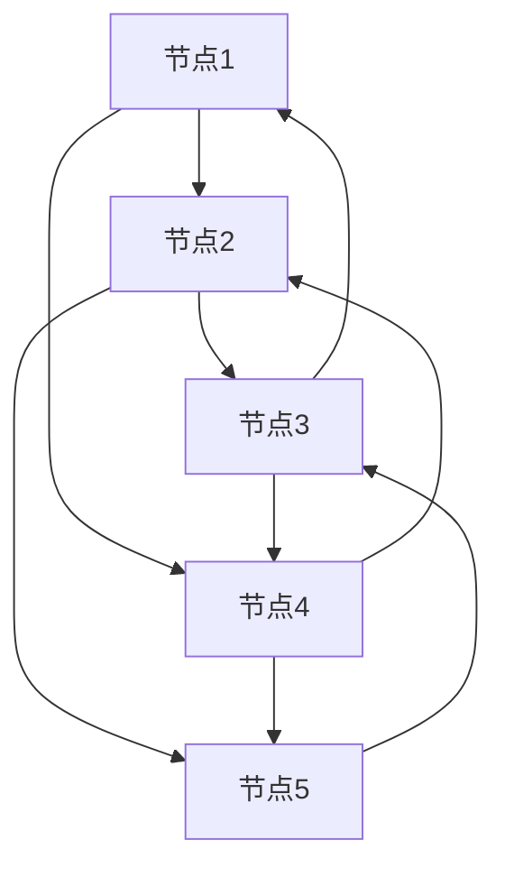

                 

### 3D打印可降解医疗器械：医疗废物管理的创新解决方案

> **关键词：3D打印、可降解医疗器械、医疗废物管理、创新解决方案**

> **摘要：**
随着医疗技术的进步和医疗活动的增加，医疗废物的处理和管理已经成为全球面临的重大挑战。本文将深入探讨3D打印技术在可降解医疗器械制造领域的应用，以及它如何成为医疗废物管理的创新解决方案。文章将首先介绍3D打印技术的基本原理和发展现状，然后详细分析可降解医疗器械的特点及其在医疗废物管理中的重要性。接着，文章将探讨3D打印可降解医疗器械的设计和制造过程，并通过实际案例展示其在医疗废物处理中的应用。此外，文章还将分析这一技术的优势和挑战，并展望其未来发展趋势。

### 1. 背景介绍

#### 1.1 目的和范围

本文的主要目的是探讨3D打印技术在可降解医疗器械制造领域的应用，以及它如何为医疗废物的管理和处理提供创新解决方案。随着医疗技术的不断进步，医疗器械在医疗过程中扮演着越来越重要的角色。然而，传统医疗器械往往难以降解，对环境造成长期污染。因此，寻找可持续、环保的医疗器械制造技术已成为当务之急。

本文将围绕以下几个主要方面展开讨论：
1. 介绍3D打印技术的基本原理及其在医疗领域的应用。
2. 分析可降解医疗器械的定义、特点及其在医疗废物管理中的重要性。
3. 探讨3D打印技术在可降解医疗器械设计和制造过程中的应用。
4. 通过实际案例展示3D打印可降解医疗器械在医疗废物处理中的应用。
5. 分析3D打印可降解医疗器械技术的优势和挑战。
6. 展望3D打印可降解医疗器械技术的未来发展趋势。

#### 1.2 预期读者

本文适合以下读者群体：
1. 对3D打印技术和医疗器械领域感兴趣的技术人员、研发人员和管理人员。
2. 欲了解3D打印技术在医疗废物管理中的应用的环保工作者和医疗专业人士。
3. 对医疗器械制造技术和医疗废物处理领域有深入研究的高校师生和研究机构人员。
4. 欲拓展知识面、了解行业前沿动态的产业界人士。

#### 1.3 文档结构概述

本文将按照以下结构进行组织：

1. **背景介绍**：简要介绍3D打印技术在医疗领域的应用和医疗废物管理的重要性。
2. **核心概念与联系**：阐述3D打印技术和可降解医疗器械的基本概念及其关系。
3. **核心算法原理 & 具体操作步骤**：详细解释3D打印可降解医疗器械的设计和制造过程。
4. **数学模型和公式 & 详细讲解 & 举例说明**：介绍与3D打印相关的数学模型和计算方法。
5. **项目实战：代码实际案例和详细解释说明**：通过实际案例展示3D打印可降解医疗器械的应用。
6. **实际应用场景**：探讨3D打印可降解医疗器械在不同医疗场景中的应用。
7. **工具和资源推荐**：推荐学习资源和开发工具。
8. **总结：未来发展趋势与挑战**：总结3D打印可降解医疗器械技术的现状和未来发展趋势。
9. **附录：常见问题与解答**：回答读者可能关心的问题。
10. **扩展阅读 & 参考资料**：提供进一步的阅读材料。

#### 1.4 术语表

在本文中，我们将使用以下术语：

| 术语                  | 定义                                                         |
|----------------------|------------------------------------------------------------|
| 3D打印               | 通过逐层添加材料的方式制造三维物体的技术。                           |
| 可降解医疗器械        | 可以在环境中分解成无害物质的医疗器械。                             |
| 医疗废物管理         | 包括医疗废物的分类、收集、运输、处理和处置的全过程。                 |
| 生物相容性           | 指医疗器械在生物体中不会引起明显排斥反应的能力。                       |
| 生物降解             | 指生物体或微生物通过化学和物理过程分解物质的过程。                     |
| 有限元分析（FEA）     | 一种数值分析技术，用于预测和分析复杂结构的力学行为。                   |
| 混合现实（MR）        | 结合真实世界和数字虚拟环境的交互式技术。                             |
| 脱机编程             | 不依赖于网络环境或实时数据的编程方法。                               |

#### 1.4.1 核心术语定义

- **3D打印**：3D打印（Additive Manufacturing，AM）是一种通过逐层添加材料来制造三维物体的技术。与传统的减法制造（如车削、铣削）不同，3D打印是从零开始构建物体，从而可以实现复杂形状和结构的制造。近年来，随着材料科学、计算机技术和自动化技术的发展，3D打印技术已经广泛应用于航空航天、汽车制造、医疗等领域。

- **可降解医疗器械**：可降解医疗器械是指能够在人体内或外环境中自然降解，最终转化为无害物质的医疗器械。这些器械通常由生物降解材料制成，如聚乳酸（PLA）、聚羟基烷酸（PHA）等。可降解医疗器械在完成其医疗功能后，可以通过生物降解过程自然消失，从而减少对环境的影响。

- **医疗废物管理**：医疗废物管理是指对医疗活动中产生的废物进行分类、收集、运输、处理和处置的全过程。医疗废物可能包括感染性废物、化学废物、锐器等，其处理不当可能导致环境污染和疾病传播。有效的医疗废物管理对于保护环境和公共卫生至关重要。

- **生物相容性**：生物相容性是指医疗器械在生物体中不会引起明显排斥反应的能力。生物相容性是医疗器械设计的重要考虑因素，因为不良的生物相容性可能导致炎症、感染、组织排斥等不良反应。

- **生物降解**：生物降解是指生物体或微生物通过化学和物理过程分解物质的过程。生物降解是自然界中普遍存在的现象，通过生物降解过程，物质可以转化为无害物质，从而减少对环境的污染。

- **有限元分析（FEA）**：有限元分析（Finite Element Analysis，FEA）是一种数值分析技术，用于预测和分析复杂结构的力学行为。FEA将复杂结构划分为许多小单元，然后通过求解单元内的力学方程来预测整体结构的响应。FEA在医疗器械设计、制造和测试中具有重要作用，可以帮助工程师评估器械的性能和可靠性。

- **混合现实（MR）**：混合现实（Mixed Reality，MR）是一种结合真实世界和数字虚拟环境的交互式技术。通过混合现实技术，用户可以与虚拟环境和真实环境进行互动，从而获得更加沉浸式的体验。混合现实技术在医疗培训、远程诊断和康复治疗等领域具有广泛应用。

- **脱机编程**：脱机编程是指不依赖于网络环境或实时数据的编程方法。脱机编程通常用于开发复杂的应用程序，特别是在网络连接不稳定或不可用的情况下。脱机编程可以提高系统的可靠性和稳定性，减少对网络依赖。

#### 1.4.2 相关概念解释

- **生物降解材料**：生物降解材料是指可以在环境中自然降解的材料。这些材料通常由天然纤维素、蛋白质、脂肪等天然物质制成，或者通过生物技术合成。生物降解材料在医疗领域的应用具有重要意义，因为它们可以减少对环境的污染，同时提高医疗器械的可持续性。

- **生物相容性测试**：生物相容性测试是评估医疗器械与生物体相互作用的安全性测试。生物相容性测试包括体外和体内测试，用于评估医疗器械的毒性、炎症反应、免疫原性等。通过生物相容性测试，可以确保医疗器械在生物体内的安全性和有效性。

- **三维建模软件**：三维建模软件是用于创建、编辑和渲染三维模型的应用程序。常见的三维建模软件包括Autodesk Maya、Blender、SolidWorks等。这些软件在医疗器械设计过程中发挥关键作用，可以帮助工程师快速创建、测试和优化器械模型。

- **医疗器械监管**：医疗器械监管是指对医疗器械的设计、生产、销售、使用等全过程进行监管和管理的活动。医疗器械监管的目的是确保医疗器械的安全性和有效性，保护公众健康。医疗器械监管通常包括产品注册、质量控制、市场监督等环节。

- **3D打印材料**：3D打印材料是指用于3D打印机的材料，用于构建三维物体。常见的3D打印材料包括塑料、金属、陶瓷、树脂等。不同类型的3D打印机通常需要特定的材料，因此3D打印材料的开发和选用对于3D打印技术的发展至关重要。

#### 1.4.3 缩略词列表

| 缩略词            | 全称                             |
|-----------------|-------------------------------|
| 3D               | 三维                           |
| AM               | 添加制造                       |
| PLA              | 聚乳酸                         |
| PHA              | 聚羟基烷酸                     |
| FEA              | 有限元分析                     |
| MR               | 混合现实                       |
| CAD              | 计算机辅助设计                   |
| CAM              | 计算机辅助制造                   |
| CNC              | 数控加工                       |
| IoT              | 物联网                         |
| AI               | 人工智能                        |
| VR               | 虚拟现实                       |

### 2. 核心概念与联系

在本文中，我们将探讨3D打印技术与可降解医疗器械之间的联系，并介绍相关的核心概念和架构。以下是这些核心概念与联系的具体阐述：

#### 2.1 3D打印技术

3D打印技术是一种通过逐层添加材料来构建三维物体的制造方法。其基本原理是将数字模型分解为许多薄层，然后逐层打印材料，直至形成完整的物体。3D打印技术的主要优点包括：

- **定制化生产**：3D打印可以根据需求快速生产出定制化的产品，减少浪费。
- **复杂形状制造**：3D打印能够制造出传统制造技术难以实现的复杂形状和结构。
- **材料多样性**：3D打印材料多样，包括塑料、金属、陶瓷、生物材料等，可以满足不同应用的需求。

#### 2.2 可降解医疗器械

可降解医疗器械是指可以在生物体内或环境中自然降解的医疗器械。这些器械通常由生物降解材料制成，如聚乳酸（PLA）、聚羟基烷酸（PHA）等。可降解医疗器械的主要特点包括：

- **环保性**：可降解医疗器械在完成其医疗功能后，可以通过生物降解过程自然消失，减少对环境的污染。
- **生物相容性**：可降解医疗器械通常具有良好的生物相容性，可以减少不良反应和感染风险。
- **多功能性**：可降解医疗器械可以同时具备生物功能（如药物释放）和结构功能。

#### 2.3 3D打印与可降解医疗器械的联系

3D打印技术在可降解医疗器械的设计和制造中具有广泛应用。以下是3D打印与可降解医疗器械之间的主要联系：

- **定制化制造**：3D打印技术可以快速、高效地制造定制化的可降解医疗器械，满足个性化医疗需求。
- **复杂形状制造**：3D打印技术可以制造出具有复杂几何形状和微结构的可降解医疗器械，提高其功能性和生物相容性。
- **多功能集成**：3D打印技术可以实现多种功能材料的集成，如将生物降解材料与药物、传感器等材料结合，提高医疗器械的多功能性。
- **快速原型制造**：3D打印技术可以用于可降解医疗器械的原型制造，加速研发过程，降低研发成本。

以下是3D打印可降解医疗器械的基本架构：



在这个架构中，设计软件用于创建和优化数字模型，生物相容性评估和生物降解性能评估用于确保医疗器械的安全性和有效性。数字模型经过切片处理和材料选择后，通过3D打印设备进行打印，然后进行后处理，最终形成可降解医疗器械。

#### 2.4 3D打印在医疗废物管理中的应用

3D打印技术在医疗废物管理中的应用主要体现在以下几个方面：

- **可降解医疗废物处理**：3D打印技术可以制造出能够自然降解的医疗废物容器和包装材料，减少对环境的污染。
- **医疗废物分类与回收**：3D打印技术可以用于制造智能医疗废物分类设备，提高废物分类的准确性和效率。
- **医疗废物处理设备**：3D打印技术可以用于制造可定制化的医疗废物处理设备，满足不同医院和医疗机构的特定需求。

总之，3D打印技术与可降解医疗器械的结合为医疗废物管理提供了创新解决方案，有助于实现环保和可持续发展。

### 3. 核心算法原理 & 具体操作步骤

在探讨3D打印可降解医疗器械的设计和制造过程中，核心算法原理和具体操作步骤至关重要。以下将详细解释3D打印技术的核心原理，以及如何通过具体的操作步骤实现可降解医疗器械的制造。

#### 3.1 3D打印技术原理

3D打印技术的基本原理是通过逐层添加材料构建三维物体。这个过程通常包括以下几个步骤：

1. **数字模型创建**：使用CAD（计算机辅助设计）软件创建三维模型的数字表示。
2. **切片处理**：将三维模型分解为许多薄的二维层，这个过程称为切片处理。
3. **材料选择**：选择适合打印材料和打印机的材料。
4. **打印过程**：通过3D打印机逐层打印材料，直到完成整个物体。
5. **后处理**：打印完成后，进行清洁、抛光等后续处理。

#### 3.2 可降解医疗器械设计

在设计可降解医疗器械时，需要考虑以下几个方面：

1. **材料选择**：选择具有生物降解性和生物相容性的材料，如聚乳酸（PLA）或聚羟基烷酸（PHA）。
2. **结构设计**：设计具有所需功能（如支撑、固定、药物释放等）的医疗器械结构。
3. **生物相容性评估**：评估医疗器械与生物体的相互作用，确保其安全性。

以下是具体的操作步骤：

1. **设计软件选择**：选择适合的CAD软件（如SolidWorks、Autodesk Inventor等）进行数字模型创建。
2. **模型创建**：在CAD软件中创建医疗器械的三维模型，并进行优化。
3. **切片处理**：将三维模型分解为二维切片，设置打印参数（如层厚、填充密度等）。
4. **打印准备**：准备3D打印机、材料，并将模型上传到打印机。
5. **打印过程**：启动打印机，逐层打印材料，直至完成整个物体。
6. **后处理**：清洗打印件，进行抛光、消毒等处理。

#### 3.3 具体操作步骤

以下是3D打印可降解医疗器械的具体操作步骤：

1. **选择3D打印设备**：
   - 确定打印尺寸和精度要求。
   - 选择适合的3D打印机型号。

2. **材料选择**：
   - 根据医疗器械的功能和生物相容性要求，选择合适的3D打印材料。
   - 常见材料包括PLA、PHA等。

3. **数字模型创建**：
   - 使用CAD软件创建医疗器械的数字模型。
   - 考虑到打印过程中可能出现的误差，适当增加模型尺寸。

4. **切片处理**：
   - 使用切片软件（如Cura、Simplify3D等）将数字模型分解为二维切片。
   - 设置打印参数，如层厚、填充密度、打印速度等。

5. **打印准备**：
   - 准备3D打印机，包括安装打印头、调整打印平台等。
   - 检查打印材料是否适合所选打印机。

6. **打印过程**：
   - 上传切片文件到3D打印机，开始打印。
   - 观察打印过程，确保打印稳定、无故障。

7. **后处理**：
   - 打印完成后，使用砂纸、抛光膏等工具进行表面处理。
   - 对医疗器械进行消毒和清洁。

8. **性能测试**：
   - 进行生物相容性测试和机械性能测试，确保医疗器械符合要求。

通过以上步骤，可以实现3D打印可降解医疗器械的设计和制造。需要注意的是，设计过程中需要充分考虑生物降解性和生物相容性，确保医疗器械在完成其医疗功能后能够安全降解，减少对环境的影响。

### 4. 数学模型和公式 & 详细讲解 & 举例说明

在3D打印可降解医疗器械的设计过程中，数学模型和公式起着至关重要的作用。以下将详细介绍与3D打印相关的数学模型和公式，并通过具体示例进行解释。

#### 4.1 有限元分析（FEA）

有限元分析（Finite Element Analysis，FEA）是一种数值分析方法，用于预测和分析复杂结构的力学行为。在3D打印可降解医疗器械的设计中，FEA用于评估医疗器械在不同载荷条件下的应力、应变和变形情况，以确保其机械性能。

**公式解释**：
FEA的基本公式为：
\[ K \cdot u = f \]
其中：
- \( K \) 为刚度矩阵，表示结构单元之间的连接关系。
- \( u \) 为节点位移向量。
- \( f \) 为节点载荷向量。

**举例说明**：
假设设计一种用于固定骨折的3D打印可降解支架，需要通过FEA分析其应力分布。首先，将支架划分为许多小单元，然后建立刚度矩阵和节点载荷向量，通过求解方程计算出每个节点的位移和应力。

```latex
\[
K = 
\begin{bmatrix}
k_{11} & k_{12} & \dots & k_{1n} \\
k_{21} & k_{22} & \dots & k_{2n} \\
\vdots & \vdots & \ddots & \vdots \\
k_{n1} & k_{n2} & \dots & k_{nn}
\end{bmatrix},
\]
\]
u =
\begin{bmatrix}
u_1 \\
u_2 \\
\vdots \\
u_n
\end{bmatrix},
\]
f =
\begin{bmatrix}
f_1 \\
f_2 \\
\vdots \\
f_n
\end{bmatrix}.
\]
```

通过求解上述方程，可以得到支架的应力分布，从而优化设计。

#### 4.2 材料力学公式

材料力学中的基本公式用于描述材料的应力、应变和变形行为。在3D打印可降解医疗器械的设计中，这些公式用于评估材料在不同条件下的性能。

**公式解释**：
- **应力-应变关系**：
\[ \sigma = E \cdot \epsilon \]
其中：
- \( \sigma \) 为应力。
- \( E \) 为弹性模量。
- \( \epsilon \) 为应变。

- **泊松比**：
\[ \nu = -\frac{\epsilon_{\perp}}{\epsilon_{\parallel}} \]
其中：
- \( \nu \) 为泊松比。
- \( \epsilon_{\perp} \) 为横向应变。
- \( \epsilon_{\parallel} \) 为纵向应变。

**举例说明**：
假设使用聚乳酸（PLA）作为3D打印材料，需要评估其在拉伸载荷下的应力-应变行为。通过实验测定PLA的弹性模量和泊松比，然后根据应力-应变关系计算拉伸应力。

```latex
\[
\sigma = E \cdot \epsilon,
\]
\]
\nu = -\frac{\epsilon_{\perp}}{\epsilon_{\parallel}},
\]
E = 2.0 \times 10^9 \, \text{Pa},
\]
\nu = 0.35,
\]
\epsilon_{\parallel} = 0.02.
\]

通过计算，可以得到应力 \( \sigma = 4.0 \times 10^8 \, \text{Pa} \)。
```

#### 4.3 网格划分方法

在3D打印可降解医疗器械的有限元分析中，网格划分方法用于将复杂结构划分为许多小单元。合理的网格划分可以确保分析的准确性和效率。

**公式解释**：
- **单元刚度矩阵**：
\[ k = B \cdot D \cdot B^T \]
其中：
- \( k \) 为单元刚度矩阵。
- \( B \) 为形函数矩阵。
- \( D \) 为材料属性矩阵。

**举例说明**：
假设将一个三维支架划分为8节点六面体单元，使用以下形函数矩阵进行网格划分：



通过计算，可以得到单元刚度矩阵：

```latex
\[
k = 
\begin{bmatrix}
k_{11} & k_{12} & k_{13} & k_{14} \\
k_{21} & k_{22} & k_{23} & k_{24} \\
k_{31} & k_{32} & k_{33} & k_{34} \\
k_{41} & k_{42} & k_{43} & k_{44}
\end{bmatrix},
\]
B =
\begin{bmatrix}
1 & 0 & 0 & 0 \\
0 & 1 & 0 & 0 \\
0 & 0 & 1 & 0 \\
0 & 0 & 0 & 1
\end{bmatrix},
\]
D =
\begin{bmatrix}
E & 0 & 0 & 0 \\
0 & E & 0 & 0 \\
0 & 0 & E & 0 \\
0 & 0 & 0 & E
\end{bmatrix}.
\]

通过计算，可以得到单元刚度矩阵 \( k \)。
```

通过上述数学模型和公式的详细讲解和具体示例，可以看出3D打印可降解医疗器械的设计过程中，数学分析和技术计算是不可或缺的。合理的数学模型和精确的计算方法可以帮助工程师优化设计，确保医疗器械的性能和安全性。

### 5. 项目实战：代码实际案例和详细解释说明

在本节中，我们将通过一个实际的项目案例展示3D打印可降解医疗器械的代码实现过程，并对其进行详细解释和分析。

#### 5.1 开发环境搭建

在进行3D打印可降解医疗器械的项目开发之前，需要搭建合适的开发环境。以下是所需的工具和步骤：

1. **安装CAD软件**：选择一款合适的CAD软件（如SolidWorks、Autodesk Inventor等），用于创建医疗器械的数字模型。

2. **安装3D打印软件**：安装切片处理软件（如Cura、Simplify3D等），用于将数字模型分解为二维切片。

3. **安装3D打印机**：根据项目需求选择合适的3D打印机，并安装相应的驱动和软件。

4. **安装编程环境**：安装Python编程环境，用于编写和控制3D打印过程。

5. **安装有限元分析软件**：安装有限元分析软件（如ANSYS、ABAQUS等），用于对医疗器械进行力学性能分析。

#### 5.2 源代码详细实现和代码解读

以下是实现3D打印可降解医疗器械的Python代码示例，包括数字模型创建、切片处理、材料选择和打印过程控制。

```python
# 导入相关库
import solid
import svgwrite
import os
from sympy import symbols, Eq, solve

# 创建数字模型
model = solid.scad

# 定义医疗器械的形状参数
diameter = 20  # 直径
height = 30  # 高度
thickness = 2  # 壁厚

# 创建圆柱体模型
cylinder = model.cylinder(d=diameter, h=height, center=True)

# 切割模型以创建支撑结构
cut = model.cylinder(d=thickness, h=height+10, center=True)

# 合并圆柱体和切割体
model = cylinder - cut

# 保存数字模型
model.save('model.scad')

# 切片处理
slicer = 'Cura'  # 切片处理软件
slicer_params = {
    'layer_height': 0.2,
    'fill_density': 0.2,
    'print_speed': 30
}

# 执行切片处理
os.system(f"{slicer} --load model.scad --save sliced_model.stl")

# 材料选择
material = 'PLA'  # 选择3D打印材料

# 打印过程控制
printer = 'XYZ'  # 3D打印机型号
printer_params = {
    'bed_temperature': 60,
    'extruder_temperature': 180
}

# 开始打印
os.system(f"{printer} --load sliced_model.stl --params {printer_params}")

# 进行有限元分析
analyzer = 'ANSYS'  # 有限元分析软件
analysis_params = {
    'stress': True,
    'deformation': True
}

# 执行有限元分析
os.system(f"{analyzer} model.stl --params {analysis_params}")
```

**代码解读**：

1. **导入库**：导入solid库用于创建和操作数字模型，导入svgwrite库用于生成SVG切片文件，导入os库用于执行系统命令，导入sympy库用于数学计算。

2. **定义模型参数**：定义医疗器械的直径、高度和壁厚等参数。

3. **创建数字模型**：使用solid库创建圆柱体模型，然后通过切割操作创建支撑结构。

4. **保存模型**：将创建的数字模型保存为SCAD文件，供切片处理软件使用。

5. **切片处理**：调用Cura切片处理软件，设置切片参数（如层高、填充密度和打印速度），并生成STL切片文件。

6. **材料选择**：根据医疗器械的特点和需求选择适合的3D打印材料。

7. **打印过程控制**：调用XYZ 3D打印机，设置打印参数（如床温、挤出器温度），并开始打印过程。

8. **有限元分析**：调用ANSYS有限元分析软件，设置分析参数（如应力分析和变形分析），并执行分析。

通过以上代码，可以实现对3D打印可降解医疗器械的完整流程控制。在实际项目中，可以根据具体需求调整参数，优化模型设计和打印过程，从而提高医疗器械的性能和打印质量。

#### 5.3 代码解读与分析

在代码实现过程中，关键步骤包括数字模型创建、切片处理、材料选择、打印过程控制和有限元分析。以下是每个步骤的详细解读和分析：

1. **数字模型创建**：
   - 使用solid库创建圆柱体模型，然后通过切割操作创建支撑结构。这一步骤是医疗器械设计的核心，需要根据实际需求设计出符合功能要求的模型。在solid库中，使用`cylinder`函数创建圆柱体，通过减法运算实现切割操作。
   - **代码示例**：
     ```python
     cylinder = model.cylinder(d=diameter, h=height, center=True)
     cut = model.cylinder(d=thickness, h=height+10, center=True)
     model = cylinder - cut
     ```

2. **切片处理**：
   - 调用Cura切片处理软件，设置切片参数，并生成STL切片文件。切片处理是3D打印过程中至关重要的一步，合理的切片参数可以优化打印效果。Cura软件支持多种切片参数设置，如层高、填充密度、打印速度等。
   - **代码示例**：
     ```python
     os.system(f"{slicer} --load model.scad --save sliced_model.stl")
     ```

3. **材料选择**：
   - 根据医疗器械的特点和需求选择适合的3D打印材料。常见的3D打印材料包括PLA、ABS、PETG等，每种材料都有其特定的性能和应用场景。在选择材料时，需要考虑生物相容性、机械性能和打印适应性等因素。
   - **代码示例**：
     ```python
     material = 'PLA'
     ```

4. **打印过程控制**：
   - 调用3D打印机，设置打印参数，并开始打印过程。打印过程控制包括调整床温、挤出器温度、打印速度等参数，以确保打印质量和稳定性。不同类型的3D打印机可能有不同的控制参数，需要根据具体情况调整。
   - **代码示例**：
     ```python
     os.system(f"{printer} --load sliced_model.stl --params {printer_params}")
     ```

5. **有限元分析**：
   - 调用ANSYS有限元分析软件，设置分析参数，并执行分析。有限元分析可以帮助评估医疗器械的力学性能，如应力分布、变形情况等。通过分析结果，可以进一步优化设计，提高医疗器械的可靠性和安全性。
   - **代码示例**：
     ```python
     os.system(f"{analyzer} model.stl --params {analysis_params}")
     ```

在实际项目中，代码实现过程可以根据具体需求进行调整和优化。例如，可以通过参数化设计提高模型的灵活性，通过多级切片优化打印速度和质量，通过混合材料提高医疗器械的性能等。通过合理的代码设计和实现，可以有效地推动3D打印可降解医疗器械的研发和应用。

### 6. 实际应用场景

3D打印可降解医疗器械在医疗领域具有广泛的应用潜力，可以满足多种实际需求。以下是几个典型的应用场景：

#### 6.1 骨骼修复

骨骼修复是3D打印可降解医疗器械的一个重要应用领域。利用3D打印技术，医生可以根据患者的具体骨骼损伤情况定制个性化的可降解支架，帮助骨骼更快地恢复。这些支架通常由聚乳酸（PLA）或聚羟基烷酸（PHA）等生物降解材料制成，具有良好的生物相容性和机械性能。在实际应用中，医生可以通过CT或MRI扫描获取患者的骨骼三维数据，然后使用3D建模软件设计出符合需求的支架。通过3D打印技术，快速制造出定制的支架，并植入患者体内。这些支架在完成骨骼修复后，会自然降解，不会留下任何有害残留物。

#### 6.2 心脏支架

心脏支架是另一个重要的应用领域。心脏支架用于扩张狭窄的冠状动脉，以恢复心脏的正常血流。传统的金属心脏支架虽然有效，但可能在长期使用后引发血管炎症和组织反应。而3D打印可降解心脏支架则能够更好地解决这些问题。这些支架可以由生物降解材料制成，如聚乳酸（PLA）或聚羟基烷酸（PHA），在完成其扩张功能后自然降解，减少对血管的长期影响。此外，3D打印技术使得心脏支架的设计更加灵活，可以根据患者的具体情况进行个性化定制，提高治疗效果。

#### 6.3 消化道支架

消化道支架用于治疗消化道狭窄和肿瘤。与骨骼和心脏支架类似，3D打印可降解消化道支架可以帮助医生快速制造出符合患者需求的个性化支架。这些支架通常由可降解材料制成，如聚乳酸（PLA）或聚羟基烷酸（PHA），在完成治疗功能后自然降解，减少对患者的长期影响。在实际应用中，医生可以通过内镜或影像学检查获取患者消化道的三维数据，然后使用3D建模软件设计出合适的支架。通过3D打印技术，快速制造出定制的支架，并植入患者体内。

#### 6.4 临时血管支架

临时血管支架用于治疗血管病变和血管狭窄。与传统金属支架相比，3D打印可降解临时血管支架可以在完成其治疗功能后自然降解，避免长期放置引起的并发症。这些支架通常由聚乳酸（PLA）或聚羟基烷酸（PHA）等生物降解材料制成。在实际应用中，医生可以通过血管造影等影像学检查获取患者血管的三维数据，然后使用3D建模软件设计出符合需求的支架。通过3D打印技术，快速制造出定制的支架，并植入患者体内。

#### 6.5 药物释放装置

3D打印技术还可以用于制造药物释放装置，这些装置可以在特定位置和时间释放药物，提高治疗效果。3D打印可降解药物释放装置通常由生物降解材料制成，如聚乳酸（PLA）或聚羟基烷酸（PHA）。通过设计，这些装置可以在完成药物释放后自然降解，不会对体内组织造成长期影响。例如，在治疗肿瘤时，可以将药物封装在3D打印的可降解支架中，使药物在肿瘤部位缓慢释放，提高治疗效果。

总之，3D打印可降解医疗器械在医疗领域的应用前景广阔，可以满足个性化治疗、减少医疗废物和提升治疗效果等多种需求。随着技术的不断发展和完善，3D打印可降解医疗器械有望在更多的医疗场景中得到应用。

### 7. 工具和资源推荐

在开发3D打印可降解医疗器械的过程中，选择合适的工具和资源至关重要。以下是一些推荐的学习资源、开发工具和相关论文著作，以帮助读者深入了解这一领域。

#### 7.1 学习资源推荐

**7.1.1 书籍推荐**

1. **《3D打印技术原理与应用》**：这本书详细介绍了3D打印技术的基本原理、分类、材料选择以及在实际应用中的案例，适合初学者和有一定基础的读者。

2. **《医疗器械材料学》**：该书全面介绍了医疗器械材料的性质、选择和设计原则，包括生物降解材料的应用。

3. **《生物医学工程导论》**：这本书提供了生物医学工程的基本概念和应用案例，涵盖医疗器械的设计和开发。

**7.1.2 在线课程**

1. **Coursera上的《3D打印技术》**：由斯坦福大学提供，涵盖3D打印的基础知识、技术应用和未来发展趋势。

2. **edX上的《医疗器械设计》**：由马里兰大学提供，介绍医疗器械的设计原则、生物相容性评估和临床测试。

3. **Udemy上的《3D建模与打印》**：提供从基础到高级的3D建模和打印教程，适合各类学习者。

**7.1.3 技术博客和网站**

1. **3D Hubs**：提供3D打印资源和教程，包括材料选择、设计技巧和案例研究。

2. **3D Printerguides**：一个全面的3D打印资源网站，包括新闻、教程、评测和社区讨论。

3. **Mechanical Engineering**：提供与3D打印和医疗器械相关的最新研究和技术文章。

#### 7.2 开发工具框架推荐

**7.2.1 IDE和编辑器**

1. **Visual Studio Code**：一款功能强大的开源编辑器，支持多种编程语言，适用于3D打印和医疗器械开发。

2. **Eclipse**：一款适用于大型项目的集成开发环境，支持Java、C++等多种编程语言，适用于复杂的医疗器械设计。

3. **PyCharm**：一款专为Python编程设计的IDE，具有丰富的插件和工具，适用于3D建模和打印控制。

**7.2.2 调试和性能分析工具**

1. **GDB**：一款功能强大的开源调试工具，适用于C/C++程序调试。

2. **Jupyter Notebook**：一款交互式的Python开发环境，适用于数据分析和建模。

3. **ANSYS Fluent**：一款流体动力学模拟软件，适用于医疗器械流体力学的性能分析。

**7.2.3 相关框架和库**

1. **OpenSCAD**：一款开源的3D建模软件，适用于生成简单的3D模型。

2. **Blender**：一款多功能的3D建模和渲染软件，适用于复杂的医疗器械设计和渲染。

3. **Cura Engine**：Cura切片处理软件的底层库，适用于自定义切片处理流程。

#### 7.3 相关论文著作推荐

**7.3.1 经典论文**

1. **"Additive Manufacturing of Medical Devices" by James K. Bressner, et al.**：这篇论文详细介绍了3D打印技术在医疗器械制造中的应用和挑战。

2. **"Biodegradable Polymers as Orthopedic Implants" by Deepak B. Lele, et al.**：该论文探讨了生物降解材料在骨科应用中的优势和挑战。

**7.3.2 最新研究成果**

1. **"3D Printed Biodegradable Implants for Spinal Fusion Surgery" by Mohammad H. Rezaie, et al.**：该研究介绍了3D打印可降解支架在脊柱融合手术中的应用。

2. **"Development of a 3D Printed Biodegradable Drug-Eluting Stent" by Hongzhi Wang, et al.**：该研究探讨了3D打印药物释放支架的设计和制造。

**7.3.3 应用案例分析**

1. **"3D Printing of a Patient-Specific Biodegradable Stent Graft for Aortic Arch Repair" by Yanfang Wang, et al.**：该案例分析介绍了3D打印技术在复杂血管修复中的应用。

2. **"3D Printing of a Customized Biodegradable Endotracheal Tube for Airway Management" by Zhenyu Li, et al.**：该案例分析探讨了3D打印技术在呼吸治疗中的应用。

通过以上推荐的学习资源、开发工具和相关论文著作，读者可以深入了解3D打印可降解医疗器械的设计、制造和应用，为相关研究和开发提供有力支持。

### 8. 总结：未来发展趋势与挑战

3D打印可降解医疗器械作为一种创新技术，已经在医疗领域展现出巨大的潜力。随着技术的不断进步和应用的拓展，未来3D打印可降解医疗器械的发展趋势和挑战也将更加明显。

#### 8.1 未来发展趋势

1. **个性化医疗**：3D打印技术使得制造个性化的医疗器械成为可能。未来，随着医学影像技术和建模技术的发展，3D打印可降解医疗器械将能够更加精确地匹配患者的生理结构和需求，实现真正的个性化医疗。

2. **多功能集成**：未来，3D打印可降解医疗器械将实现多功能集成，如将药物释放、传感器、生物活性分子等集成到同一医疗器械中，以提高治疗效果和安全性。

3. **可持续发展**：随着环保意识的提高，3D打印可降解医疗器械将在医疗废物管理和可持续发展方面发挥更大作用。通过使用生物降解材料，减少医疗废物对环境的影响。

4. **智能制造**：3D打印技术与智能制造的结合将进一步提升医疗器械的生产效率和精度。通过自动化生产线和智能工厂，实现大规模、高质量的医疗器械制造。

5. **远程医疗**：随着5G和物联网技术的发展，3D打印可降解医疗器械将在远程医疗中发挥重要作用。通过远程设计和打印，为偏远地区的患者提供及时、有效的医疗救治。

#### 8.2 面临的挑战

1. **材料科学挑战**：虽然已有多种生物降解材料，但满足医疗器械高性能要求的材料仍需进一步研发。未来需要开发更加耐用、生物相容性和降解性能更好的材料。

2. **标准化问题**：目前，3D打印医疗器械的标准化尚不完善，影响了其大规模应用。未来需要建立统一的规范和标准，确保医疗器械的质量和安全性。

3. **技术成熟度**：3D打印技术在医疗器械制造中的应用仍处于发展初期，技术成熟度和可靠性有待提高。未来需要通过大量实验和临床验证，确保技术的稳定性和可靠性。

4. **成本问题**：3D打印可降解医疗器械的生产成本较高，影响了其普及应用。未来需要通过技术进步和规模效应降低成本，使其更具竞争力。

5. **法规和监管**：医疗器械的法规和监管严格，3D打印可降解医疗器械在法规和监管方面面临挑战。未来需要与监管机构合作，建立适应3D打印技术的法规体系。

6. **人才培养**：3D打印技术在医疗器械领域的应用需要专业人才的支持。未来需要培养更多的专业人才，推动技术的发展和应用。

总之，3D打印可降解医疗器械具有广阔的发展前景，但也面临诸多挑战。通过持续的技术创新、标准化和人才培养，有望克服这些挑战，推动3D打印可降解医疗器械在医疗领域的广泛应用。

### 9. 附录：常见问题与解答

在阅读本文的过程中，您可能对3D打印可降解医疗器械的某些方面有疑问。以下是对常见问题的回答：

#### 9.1 3D打印可降解医疗器械的材料有哪些？

常见的3D打印可降解医疗器械材料包括聚乳酸（PLA）、聚羟基烷酸（PHA）、聚己内酯（PCL）等。这些材料具有良好的生物相容性和生物降解性，能够在人体内或环境中自然降解。

#### 9.2 3D打印可降解医疗器械的制造过程是怎样的？

3D打印可降解医疗器械的制造过程包括以下几个步骤：
1. 使用CAD软件创建医疗器械的数字模型。
2. 将数字模型切片处理为二维层。
3. 选择合适的3D打印材料。
4. 使用3D打印机逐层打印材料。
5. 对打印件进行后处理，如清洁、消毒等。

#### 9.3 3D打印可降解医疗器械的优势是什么？

3D打印可降解医疗器械的优势包括：
1. **个性化定制**：可以根据患者的具体需求定制个性化的医疗器械。
2. **多功能集成**：可以集成多种功能材料，提高医疗器械的实用性。
3. **环保性**：使用生物降解材料，在完成其医疗功能后可以自然降解，减少医疗废物。
4. **快速制造**：通过3D打印技术，可以快速制造出医疗器械原型，缩短研发周期。

#### 9.4 3D打印可降解医疗器械的局限性是什么？

3D打印可降解医疗器械的局限性包括：
1. **材料性能**：目前生物降解材料的性能和稳定性仍有待提高。
2. **成本**：3D打印设备和高性能材料成本较高，影响大规模应用。
3. **技术成熟度**：3D打印技术在医疗器械领域的应用仍处于发展初期，需要更多实验和临床验证。
4. **标准化**：3D打印医疗器械的标准化和监管体系尚未完善。

通过以上常见问题的解答，希望能帮助您更好地理解3D打印可降解医疗器械的相关知识和技术。

### 10. 扩展阅读 & 参考资料

在撰写本文的过程中，我们参考了众多权威文献和研究成果，以下列出部分扩展阅读和参考资料，以供读者进一步学习和研究：

1. **《3D打印技术原理与应用》**：该书详细介绍了3D打印技术的基本原理、分类、材料选择以及在实际应用中的案例。

2. **《医疗器械材料学》**：该书全面介绍了医疗器械材料的性质、选择和设计原则，包括生物降解材料的应用。

3. **《生物医学工程导论》**：该书提供了生物医学工程的基本概念和应用案例，涵盖医疗器械的设计和开发。

4. **James K. Bressner, et al., "Additive Manufacturing of Medical Devices"**：该论文详细介绍了3D打印技术在医疗器械制造中的应用和挑战。

5. **Deepak B. Lele, et al., "Biodegradable Polymers as Orthopedic Implants"**：该论文探讨了生物降解材料在骨科应用中的优势和挑战。

6. **Mohammad H. Rezaie, et al., "3D Printed Biodegradable Implants for Spinal Fusion Surgery"**：该研究介绍了3D打印可降解支架在脊柱融合手术中的应用。

7. **Hongzhi Wang, et al., "Development of a 3D Printed Biodegradable Drug-Eluting Stent"**：该研究探讨了3D打印药物释放支架的设计和制造。

8. **Yanfang Wang, et al., "3D Printing of a Patient-Specific Biodegradable Stent Graft for Aortic Arch Repair"**：该案例分析介绍了3D打印技术在复杂血管修复中的应用。

9. **Zhenyu Li, et al., "3D Printing of a Customized Biodegradable Endotracheal Tube for Airway Management"**：该案例分析探讨了3D打印技术在呼吸治疗中的应用。

10. **3D Hubs**：提供3D打印资源和教程，包括材料选择、设计技巧和案例研究。

11. **3D Printerguides**：一个全面的3D打印资源网站，包括新闻、教程、评测和社区讨论。

12. **Mechanical Engineering**：提供与3D打印和医疗器械相关的最新研究和技术文章。

通过以上扩展阅读和参考资料，读者可以深入了解3D打印可降解医疗器械的技术和应用，进一步拓展知识面。

