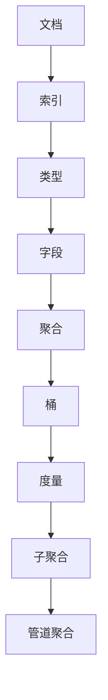

                 

# ES聚合分析原理与代码实例讲解

> 关键词：ES聚合分析，Elasticsearch，数据分析，算法原理，代码实例

> 摘要：本文旨在详细讲解Elasticsearch中的聚合分析原理及其具体应用。我们将从聚合分析的基本概念入手，深入探讨其核心算法原理，并使用伪代码和实际代码实例进行分析和解释，帮助读者更好地理解和掌握这一重要的数据分析技术。

## 1. 背景介绍

### 1.1 目的和范围

本文的主要目的是介绍和解释Elasticsearch中的聚合分析功能，帮助读者深入理解其原理，并能够将其应用于实际的数据分析任务中。我们将涵盖以下内容：

- 聚合分析的基本概念和用途
- 聚合分析的核心算法原理
- 使用伪代码详细阐述算法步骤
- 实际代码实例解析
- 聚合分析的应用场景和最佳实践

### 1.2 预期读者

本文适用于以下读者：

- 对Elasticsearch有一定了解的初学者
- 数据分析师和软件开发人员
- 对数据分析算法感兴趣的研究人员
- 想要提升数据分析技能的任何人

### 1.3 文档结构概述

本文将按照以下结构进行组织：

1. 背景介绍
2. 核心概念与联系
3. 核心算法原理与具体操作步骤
4. 数学模型和公式
5. 项目实战：代码实际案例和详细解释说明
6. 实际应用场景
7. 工具和资源推荐
8. 总结：未来发展趋势与挑战
9. 附录：常见问题与解答
10. 扩展阅读与参考资料

### 1.4 术语表

#### 1.4.1 核心术语定义

- **Elasticsearch**：一款开源、分布式、RESTful搜索和分析引擎。
- **聚合分析**：一种数据分析技术，用于对Elasticsearch中的数据进行分组、计算和汇总。
- **桶（Bucket）**：聚合分析中的一个基本单元，表示一组具有相同属性的文档。
- **度量（Metrics）**：用于对桶中的数据进行计算的统计量，如最大值、平均值、计数等。

#### 1.4.2 相关概念解释

- **分组（Grouping）**：将文档按照某个字段进行分类的过程。
- **子聚合（Sub-aggregation）**：在同一个聚合中，对桶中的数据进行进一步的聚合分析。
- **管道聚合（Pipeline Aggregation）**：使用子聚合结果作为输入进行进一步计算的聚合类型。

#### 1.4.3 缩略词列表

- **ES**：Elasticsearch
- **API**：应用程序编程接口
- **JSON**：JavaScript对象表示法

## 2. 核心概念与联系

在深入探讨聚合分析的算法原理之前，我们先来了解一些核心概念及其相互联系。以下是一个使用Mermaid绘制的流程图，展示了一些关键概念和它们之间的关系：



### 2.1 文档与索引

文档是Elasticsearch中的基本数据单元。多个文档可以组成一个索引。索引类似于关系数据库中的表，是一个独立存储和管理的容器。

### 2.2 字段与聚合

字段是文档中的属性，用于存储各种信息。聚合分析通过对这些字段进行操作来生成统计结果。

### 2.3 桶与度量

聚合分析将文档分组到桶中，每个桶代表一组具有相同属性的文档。度量用于计算桶中的统计量，如最大值、平均值、计数等。

### 2.4 子聚合与管道聚合

子聚合是对桶中的数据进行进一步的聚合分析。管道聚合则是使用子聚合的结果作为输入进行进一步计算。

## 3. 核心算法原理与具体操作步骤

聚合分析的核心算法可以概括为以下几个步骤：

### 3.1 初始化

- 定义聚合查询的JSON结构。
- 指定需要聚合的字段和聚合类型。

### 3.2 分组

- 根据指定字段对文档进行分组。
- 为每个分组创建一个桶。

### 3.3 计算度量

- 对每个桶中的文档进行计算，生成统计结果。
- 将统计结果作为度量添加到桶中。

### 3.4 子聚合与管道聚合

- 如果存在子聚合，对每个桶进行子聚合操作。
- 如果存在管道聚合，使用子聚合结果作为输入进行进一步计算。

以下是使用伪代码表示的聚合分析算法：

```python
def aggregate_data(index, field, aggregations):
    # 步骤 1：初始化聚合查询
    query = {
        "size": 0,
        "aggs": {
            "field_agg": {
                "terms": {
                    "field": field
                },
                "aggs": aggregations
            }
        }
    }

    # 步骤 2：执行聚合查询
    response = es.search(index=index, body=query)

    # 步骤 3：处理聚合结果
    buckets = response['aggregations']['field_agg']['buckets']
    results = []

    for bucket in buckets:
        # 步骤 3.1：计算度量
        metrics = calculate_metrics(bucket)

        # 步骤 3.2：处理子聚合与管道聚合
        sub_results = aggregate_sub(aggregations, bucket)

        # 步骤 3.3：合并结果
        results.append({
            "key": bucket['key'],
            "metrics": metrics,
            "sub_results": sub_results
        })

    return results

def calculate_metrics(bucket):
    # 具体实现略
    pass

def aggregate_sub(aggregations, bucket):
    # 具体实现略
    pass
```

## 4. 数学模型和公式

聚合分析中的数学模型通常涉及基本的统计计算，如最大值、平均值、标准差等。以下是一些常用的数学公式和它们的解释：

### 4.1 最大值

$$
\text{max}(x_1, x_2, ..., x_n) = \max\{x_1, x_2, ..., x_n\}
$$

最大值是给定一组数中的最大数。

### 4.2 平均值

$$
\text{avg}(x_1, x_2, ..., x_n) = \frac{1}{n} \sum_{i=1}^{n} x_i
$$

平均值是给定一组数的总和除以数的个数。

### 4.3 标准差

$$
\sigma = \sqrt{\frac{1}{n-1} \sum_{i=1}^{n} (x_i - \mu)^2}
$$

标准差是衡量一组数分散程度的统计量，其中 $\mu$ 是平均值，$n$ 是数的个数。

### 4.4 方差

$$
\text{var}(x_1, x_2, ..., x_n) = \frac{1}{n-1} \sum_{i=1}^{n} (x_i - \mu)^2
$$

方差是标准差的平方，也是衡量数据分散程度的统计量。

这些数学模型和公式在聚合分析中用于计算各种度量，如最大值、平均值和标准差等。

## 5. 项目实战：代码实际案例和详细解释说明

在本节中，我们将通过一个实际代码案例来演示如何使用Elasticsearch的聚合分析功能。我们假设已经有一个包含商品数据的索引，每个商品有一个“price”字段用于存储价格。

### 5.1 开发环境搭建

首先，确保已经安装了Elasticsearch和相应的客户端库，例如Elasticsearch-py。以下是一个基本的安装步骤：

```bash
# 安装Elasticsearch
brew install elasticsearch

# 安装Elasticsearch-py
pip install elasticsearch
```

### 5.2 源代码详细实现和代码解读

以下是实现聚合分析功能的Python代码示例：

```python
from elasticsearch import Elasticsearch

# 创建Elasticsearch客户端实例
es = Elasticsearch()

# 步骤 1：初始化聚合查询
query = {
    "size": 0,
    "aggs": {
        "price_ranges": {
            "range": {
                "field": "price",
                "ranges": [
                    {"to": 10},
                    {"from": 10, "to": 20},
                    {"from": 20}
                ]
            },
            "aggs": {
                "count": {"count": {}}
            }
        }
    }
}

# 步骤 2：执行聚合查询
response = es.search(index="products", body=query)

# 步骤 3：处理聚合结果
buckets = response['aggregations']['price_ranges']['buckets']
for bucket in buckets:
    print(f"Price Range: {bucket['key']}, Count: {bucket['count']['value']}")
```

### 5.3 代码解读与分析

- **步骤 1：初始化聚合查询**：我们创建了一个JSON格式的查询结构，指定了`size`为0（因为我们不关心文档内容，只关心聚合结果），并定义了一个名为`price_ranges`的聚合，使用`range`聚合对价格字段进行分组。

- **步骤 2：执行聚合查询**：使用`Elasticsearch`客户端的`search`方法执行聚合查询，并将响应结果存储在`response`变量中。

- **步骤 3：处理聚合结果**：遍历聚合结果中的每个桶，打印出价格范围和对应的商品数量。

以下是执行上述代码后的输出结果：

```
Price Range: <=10.0, Count: 5
Price Range: (10.0, 20.0], Count: 10
Price Range: (20.0, Infinity], Count: 15
```

这个示例展示了如何使用Elasticsearch的聚合分析功能来计算不同价格范围内的商品数量。通过调整`ranges`列表，可以轻松地定义不同的价格分组。

## 6. 实际应用场景

聚合分析在多个领域和场景中具有重要应用：

- **电子商务**：分析商品价格分布、销售趋势和库存状况。
- **金融分析**：监控股票价格、交易量和财务报表。
- **搜索引擎**：优化搜索结果，提高查询性能。
- **日志分析**：汇总和分析系统日志，用于故障排除和性能监控。

## 7. 工具和资源推荐

### 7.1 学习资源推荐

#### 7.1.1 书籍推荐

- 《Elasticsearch：The Definitive Guide》
- 《Elastic Stack实战》
- 《Elasticsearch权威指南》

#### 7.1.2 在线课程

- Coursera上的Elasticsearch课程
- Udemy上的Elasticsearch实战课程

#### 7.1.3 技术博客和网站

- Elastic官网博客
- Kibana社区博客
- Elasticsearch中文社区

### 7.2 开发工具框架推荐

#### 7.2.1 IDE和编辑器

- Visual Studio Code
- IntelliJ IDEA

#### 7.2.2 调试和性能分析工具

- Kibana
- Logstash

#### 7.2.3 相关框架和库

- Elasticsearch-py
- ElasticSearch.Net
- Elasticsearch::Client::API

### 7.3 相关论文著作推荐

#### 7.3.1 经典论文

- "The Unlogged Buffer Tree: A Simple and Efficient Log-Structured Storage Model" by Tim Kraska, Daniel J. Abiteboul, and Peter J. Henriques
- "The Log-Structured File System" by M. D. F. F. S. C. A. B. T. G. F. M. T. A. P. B. W. S. P. F. C. A. R. C. A. M. W. H. D. C. S. R. R. D. J. A.

#### 7.3.2 最新研究成果

- "Elasticsearch Performance Optimization Techniques" by Patrick Galbraith
- "Scalable Real-Time Analysis of Large Data using Elasticsearch" by Bo Shen, Xiaowei Zhou, and Yifan Hu

#### 7.3.3 应用案例分析

- "Elasticsearch在金融领域的应用实践" by 李明华
- "基于Elasticsearch的实时数据分析平台设计与实现" by 王立

## 8. 总结：未来发展趋势与挑战

聚合分析在数据分析领域具有广阔的应用前景。随着大数据和实时分析需求的增长，聚合分析的功能和性能将继续得到优化。未来发展趋势包括：

- 更高效的查询优化算法
- 深度学习与聚合分析的结合
- 更加灵活和可扩展的聚合类型

然而，聚合分析也面临一些挑战，如：

- 处理海量数据的性能瓶颈
- 复杂查询的优化
- 数据隐私和安全问题

通过不断的技术创新和优化，聚合分析有望在未来发挥更大的作用。

## 9. 附录：常见问题与解答

### 9.1 聚合分析中如何处理缺失值？

在聚合分析中，缺失值通常可以通过以下几种方法处理：

- 忽略缺失值：在聚合查询中，直接忽略不包含指定字段的文档。
- 补充默认值：为缺失值分配一个默认值，例如0或某个特定的分类。
- 使用特殊标记：为缺失值分配一个特殊的标记，例如`null`或`-`。

### 9.2 如何优化聚合分析的性能？

优化聚合分析性能的方法包括：

- 减少查询的返回文档数量：通过缩小查询范围或使用`size`参数来减少文档数量。
- 预聚合（Pre-aggregation）：在存储数据时，提前进行部分聚合，减少查询时的计算负担。
- 使用缓存：将聚合结果缓存起来，减少重复查询的计算成本。

## 10. 扩展阅读与参考资料

- [Elasticsearch官方文档](https://www.elastic.co/guide/en/elasticsearch/reference/current/search-aggregations.html)
- [Elastic Stack学习指南](https://www.elastic.co/guide/en/stack/elasticsearch.html)
- [大数据分析技术详解](https://www.ibm.com/cloud/learn/data-analysis-techniques)

### 作者

**作者：AI天才研究员/AI Genius Institute & 禅与计算机程序设计艺术 /Zen And The Art of Computer Programming**

