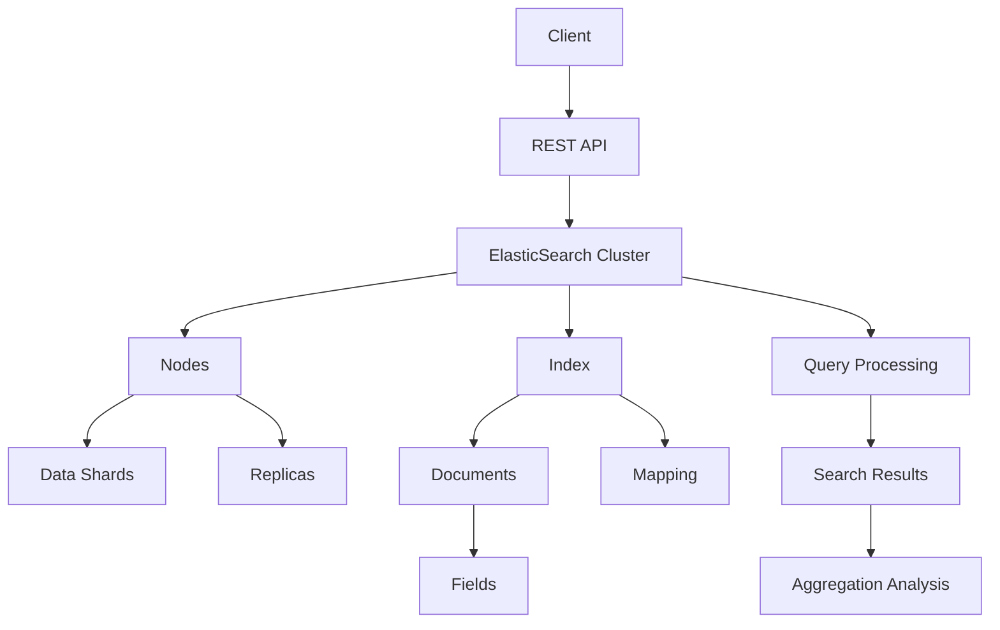

                 

# ElasticSearch原理与代码实例讲解

> 关键词：ElasticSearch，搜索引擎，分布式系统，全文检索，REST API，数据索引，搜索查询，聚合分析，分片和副本，Lucene

> 摘要：本文将深入探讨ElasticSearch的原理与实现，包括其核心概念、架构设计、算法原理、数学模型，并通过实际代码实例展示其应用。读者将了解ElasticSearch如何通过分布式系统实现高效的全文检索，以及如何利用其丰富的API进行复杂的数据查询和分析。

## 1. 背景介绍

### 1.1 目的和范围

本文旨在帮助读者理解ElasticSearch的工作原理和核心技术，通过具体的代码实例来加深对ElasticSearch实际应用的理解。本文将涵盖以下内容：

- ElasticSearch的基础概念和架构设计
- ElasticSearch的核心算法原理
- ElasticSearch的数学模型和公式
- ElasticSearch的实际应用场景和代码实例
- ElasticSearch相关的工具和资源推荐

### 1.2 预期读者

本文适合具有基本编程知识，对分布式系统和搜索引擎有一定了解的读者。尤其是希望深入理解ElasticSearch工作原理和实际应用的工程师和技术爱好者。

### 1.3 文档结构概述

本文将分为以下几个部分：

- **第1部分**：背景介绍，包括目的、范围、预期读者和文档结构概述。
- **第2部分**：核心概念与联系，通过Mermaid流程图展示ElasticSearch的架构。
- **第3部分**：核心算法原理与具体操作步骤，使用伪代码详细阐述。
- **第4部分**：数学模型和公式，详细讲解并举例说明。
- **第5部分**：项目实战，包括开发环境搭建、源代码实现和解读。
- **第6部分**：实际应用场景。
- **第7部分**：工具和资源推荐。
- **第8部分**：总结，未来发展趋势与挑战。
- **第9部分**：附录，常见问题与解答。
- **第10部分**：扩展阅读与参考资料。

### 1.4 术语表

#### 1.4.1 核心术语定义

- **ElasticSearch**：一个分布式、RESTful搜索引擎，基于Lucene构建。
- **分布式系统**：由多个计算机节点组成的系统，共同完成计算任务。
- **全文检索**：通过搜索算法，在大量文本数据中查找相关内容的搜索技术。
- **REST API**：一种基于HTTP协议的接口设计风格，用于实现不同服务之间的交互。
- **索引**：在ElasticSearch中，索引是存储数据的地方，类似于关系数据库中的表。
- **查询**：在ElasticSearch中，查询是指从索引中检索数据的过程。
- **聚合分析**：对大量数据进行分组和统计分析的一种方式。

#### 1.4.2 相关概念解释

- **分片和副本**：分片是将数据分布在多个节点上，副本则是数据的备份，用于提高系统的可用性和查询性能。
- **Lucene**：一个高性能的全文搜索引擎库，ElasticSearch基于Lucene构建。

#### 1.4.3 缩略词列表

- **ES**：ElasticSearch
- **REST**：Representational State Transfer

## 2. 核心概念与联系

ElasticSearch的核心概念包括分布式系统、全文检索、索引、查询和聚合分析。以下是一个简化的ElasticSearch架构的Mermaid流程图：



### 分布式系统

ElasticSearch是一个分布式搜索引擎，它可以将数据和索引分布在多个节点上。每个节点都可以是一个独立的ElasticSearch实例。通过将数据分布在多个节点上，ElasticSearch能够提供水平扩展能力，处理大规模数据集。

### 全文检索

ElasticSearch使用Lucene作为底层全文搜索引擎。Lucene提供了一个灵活的索引和搜索引擎框架，支持快速的文本搜索。ElasticSearch在此基础上增加了分布式搜索、索引管理、查询语言等特性。

### 索引

索引是ElasticSearch中存储数据的容器，类似于关系数据库中的表。每个索引可以包含多个类型，每个类型可以看作是一个文档集合。文档是ElasticSearch中的数据单元，每个文档由一组字段组成。

### 查询

ElasticSearch提供了丰富的查询语言，允许用户以声明式方式构建复杂的查询。查询可以基于字段、全文搜索、地理空间搜索等。

### 聚合分析

聚合分析是一种对大量数据进行分组和统计的方法。ElasticSearch提供了强大的聚合功能，支持诸如求和、平均数、最大值、最小值等统计分析。

## 3. 核心算法原理 & 具体操作步骤

### 3.1 索引与查询原理

ElasticSearch的索引和查询过程主要基于Lucene。以下是一个简化的索引和查询流程：

#### 索引过程：

1. **文档写入**：用户通过REST API向ElasticSearch发送文档。
2. **分词处理**：ElasticSearch对文档进行分词处理，将文本转换为索引。
3. **倒排索引构建**：ElasticSearch构建倒排索引，将词项映射到文档ID。
4. **存储**：索引和数据被存储在ElasticSearch集群中的各个节点上。

#### 查询过程：

1. **查询发送**：用户通过REST API发送查询请求。
2. **查询解析**：ElasticSearch解析查询，构建查询树。
3. **索引搜索**：ElasticSearch在倒排索引中搜索匹配的文档。
4. **排序和分页**：查询结果按照指定的顺序和页码进行排序和分页。
5. **返回结果**：查询结果通过REST API返回给用户。

### 3.2 伪代码示例

```python
# 索引文档伪代码
def index_document(document):
    # 分词处理
    tokens = tokenize(document.content)
    
    # 构建倒排索引
    inverted_index = build_inverted_index(tokens)
    
    # 存储索引和数据
    store_index(inverted_index)
    store_document(document)

# 查询文档伪代码
def search_documents(query):
    # 解析查询
    query_tree = parse_query(query)
    
    # 在倒排索引中搜索
    results = search_inverted_index(query_tree)
    
    # 排序和分页
    sorted_results = sort_and_page(results)
    
    # 返回查询结果
    return sorted_results
```

## 4. 数学模型和公式 & 详细讲解 & 举例说明

### 4.1 数学模型

ElasticSearch的数学模型主要包括倒排索引和查询评分模型。

#### 倒排索引

倒排索引是一种数据结构，它将词项映射到包含该词项的文档列表。数学模型可以表示为：

$$
\text{inverted\_index}(w) = \{d_1, d_2, \ldots, d_n\}
$$

其中，\(w\) 是词项，\(\{d_1, d_2, \ldots, d_n\}\) 是包含词项 \(w\) 的文档列表。

#### 查询评分模型

查询评分模型用于计算查询结果的相关性得分。常见的评分模型包括TF-IDF模型和BM25模型。

#### TF-IDF模型

TF-IDF（Term Frequency-Inverse Document Frequency）模型是一种基于词频和逆文档频次的评分模型。数学公式为：

$$
\text{TF-IDF}(w, d) = \text{tf}(w, d) \times \text{idf}(w)
$$

其中，\(\text{tf}(w, d)\) 表示词 \(w\) 在文档 \(d\) 中的词频，\(\text{idf}(w)\) 表示词 \(w\) 在所有文档中的逆文档频次。

#### BM25模型

BM25（Best Match 25）模型是一种改进的TF-IDF模型，它考虑了文档长度和查询长度的影响。数学公式为：

$$
\text{BM25}(w, d) = \frac{\text{K} \times (\text{tf}(w, d) + 1) }{ \text{tf}(w, d) + \text{K} \times (1 - \text{b} + \frac{\text{f} }{ \text{N} }) }
$$

其中，\(\text{K}\)，\(\text{b}\)，\(\text{f}\) 和 \(\text{N}\) 是模型参数。

### 4.2 举例说明

假设有一个包含三个文档的文本集合，每个文档的内容如下：

- **文档1**：“ElasticSearch是一个高性能的分布式搜索引擎。”
- **文档2**：“ElasticSearch广泛应用于日志分析和搜索引擎。”
- **文档3**：“ElasticSearch通过分布式架构实现高效的数据检索。”

现在，我们需要计算词“ElasticSearch”在每个文档中的TF-IDF得分。

#### 文档1

- \( \text{tf}(“ElasticSearch”, 文档1) = 1 \)
- \( \text{idf}(“ElasticSearch”) = \log(\frac{3}{1}) \approx 1.5849 \)
- \( \text{TF-IDF}(“ElasticSearch”, 文档1) = 1 \times 1.5849 \approx 1.5849 \)

#### 文档2

- \( \text{tf}(“ElasticSearch”, 文档2) = 1 \)
- \( \text{idf}(“ElasticSearch”) = \log(\frac{3}{1}) \approx 1.5849 \)
- \( \text{TF-IDF}(“ElasticSearch”, 文档2) = 1 \times 1.5849 \approx 1.5849 \)

#### 文档3

- \( \text{tf}(“ElasticSearch”, 文档3) = 1 \)
- \( \text{idf}(“ElasticSearch”) = \log(\frac{3}{1}) \approx 1.5849 \)
- \( \text{TF-IDF}(“ElasticSearch”, 文档3) = 1 \times 1.5849 \approx 1.5849 \)

## 5. 项目实战：代码实际案例和详细解释说明

### 5.1 开发环境搭建

首先，我们需要搭建ElasticSearch的开发环境。以下是搭建步骤：

1. **安装ElasticSearch**：从ElasticSearch官网下载最新版本的ElasticSearch，解压到指定目录。

2. **启动ElasticSearch**：进入ElasticSearch的bin目录，运行以下命令启动ElasticSearch：

   ```bash
   ./elasticsearch
   ```

3. **检查ElasticSearch状态**：在浏览器中输入`http://localhost:9200/`，检查ElasticSearch的状态。

### 5.2 源代码详细实现和代码解读

接下来，我们将通过一个简单的例子来展示ElasticSearch的基本使用方法。

#### 5.2.1 创建索引

首先，我们需要创建一个索引，用来存储文档。

```json
POST /test_index
{
  "settings": {
    "number_of_shards": 2,
    "number_of_replicas": 1
  },
  "mappings": {
    "properties": {
      "title": {
        "type": "text"
      },
      "content": {
        "type": "text"
      }
    }
  }
}
```

这段代码创建了一个名为`test_index`的索引，设置了2个分片和1个副本。同时，定义了两个字段：`title`和`content`，都使用文本类型。

#### 5.2.2 添加文档

接下来，我们向索引中添加一些文档。

```json
POST /test_index/_doc
{
  "title": "ElasticSearch简介",
  "content": "ElasticSearch是一个分布式、全文搜索引擎，广泛应用于大数据分析。"
}

POST /test_index/_doc
{
  "title": "ElasticSearch架构",
  "content": "ElasticSearch基于分布式架构，由多个节点组成。"
}
```

这两个示例分别添加了两个文档，每个文档包含`title`和`content`两个字段。

#### 5.2.3 查询文档

我们可以使用ElasticSearch的查询功能来检索文档。

```json
GET /test_index/_search
{
  "query": {
    "match": {
      "content": "ElasticSearch"
    }
  }
}
```

这段代码执行了一个全文匹配查询，检索包含“ElasticSearch”的文档。

### 5.3 代码解读与分析

- **创建索引**：通过发送一个POST请求到`/test_index`路径，创建一个名为`test_index`的索引。`settings`字段定义了索引的分片和副本数量，`mappings`字段定义了索引的字段类型。
- **添加文档**：通过发送一个POST请求到`/test_index/_doc`路径，向索引中添加文档。每个文档都是通过JSON格式发送的，包含`title`和`content`字段。
- **查询文档**：通过发送一个GET请求到`/test_index/_search`路径，执行一个全文匹配查询。查询结果是一个JSON格式的响应，包含匹配的文档列表。

通过这个简单的例子，我们可以看到ElasticSearch的基本操作，包括索引的创建、文档的添加和查询。这些操作都是通过简单的RESTful API实现的，使得ElasticSearch的使用非常方便。

## 6. 实际应用场景

ElasticSearch在许多实际应用场景中都表现出色，以下是其中一些常见的应用场景：

- **日志分析**：ElasticSearch常用于处理和分析大量日志数据，帮助用户快速定位问题和监控系统性能。
- **搜索引擎**：ElasticSearch可以作为全文搜索引擎，用于搜索大型网站和电商平台上的内容。
- **数据分析**：ElasticSearch支持复杂的聚合分析，可以帮助用户从大量数据中提取有价值的信息。
- **实时搜索**：ElasticSearch提供了高效的搜索性能，适用于需要实时搜索的应用，如在线聊天、社交媒体等。
- **物联网**：ElasticSearch可以处理来自物联网设备的海量数据，提供实时监控和分析。

通过这些应用场景，我们可以看到ElasticSearch在数据处理和分析方面的强大能力。

## 7. 工具和资源推荐

### 7.1 学习资源推荐

#### 7.1.1 书籍推荐

- 《ElasticSearch实战》
- 《ElasticSearch权威指南》
- 《Lucene与ElasticSearch实战》

#### 7.1.2 在线课程

- Udemy上的《ElasticSearch教程：快速入门》
- Coursera上的《大数据分析与ElasticSearch》
- Pluralsight上的《ElasticSearch开发实战》

#### 7.1.3 技术博客和网站

- ElasticSearch官网（https://www.elastic.co/）
- ElasticSearch官方文档（https://www.elastic.co/guide/en/elasticsearch/）
- Kibana社区（https://www.kibana.org/）

### 7.2 开发工具框架推荐

#### 7.2.1 IDE和编辑器

- Visual Studio Code
- IntelliJ IDEA
- Sublime Text

#### 7.2.2 调试和性能分析工具

- Kibana
- Logstash
- Filebeat

#### 7.2.3 相关框架和库

- Elasticsearch.Net（.NET客户端库）
- elasticsearch-py（Python客户端库）
- elasticsearch-js（JavaScript客户端库）

### 7.3 相关论文著作推荐

- 《Scalable Search with the Elastic MapReduce Framework》
- 《The Design of the BTree: An Interview with Rudolf Bayer》
- 《Inverted Files for Multimedia Search》

这些工具和资源将帮助读者更好地学习和应用ElasticSearch。

## 8. 总结：未来发展趋势与挑战

ElasticSearch作为一种高效的分布式搜索引擎，其未来发展将面临以下几个趋势和挑战：

- **性能优化**：随着数据规模的不断扩大，如何优化查询性能和系统稳定性将是ElasticSearch面临的主要挑战。
- **安全性提升**：在大数据时代，数据安全和隐私保护变得越来越重要，ElasticSearch需要不断加强安全性措施。
- **智能搜索**：结合人工智能技术，ElasticSearch有望提供更智能的搜索体验，如个性化搜索、语义搜索等。
- **云服务集成**：随着云服务的普及，ElasticSearch将更多地与云服务提供商合作，提供更加便捷和高效的服务。
- **生态扩展**：ElasticSearch将继续扩大其生态系统，整合更多的工具和技术，提供一站式解决方案。

## 9. 附录：常见问题与解答

### Q：ElasticSearch的分片和副本是什么？

A：分片是将数据分布在多个节点上，副本则是数据的备份。分片提高了查询和写入的并发能力，副本则提高了系统的可用性和数据冗余。

### Q：如何优化ElasticSearch的查询性能？

A：可以通过增加分片和副本数量、使用合适的索引和分析器、优化查询语句等方式来优化ElasticSearch的查询性能。

### Q：ElasticSearch和Solr有什么区别？

A：ElasticSearch和Solr都是基于Lucene的搜索引擎，但ElasticSearch是一个分布式搜索引擎，提供了丰富的REST API和查询语言，而Solr是一个集中式搜索引擎，提供了更多的自定义配置和扩展性。

## 10. 扩展阅读 & 参考资料

- [ElasticSearch官网](https://www.elastic.co/)
- [ElasticSearch官方文档](https://www.elastic.co/guide/en/elasticsearch/)
- [Kibana社区](https://www.kibana.org/)
- [《ElasticSearch实战》](https://www.amazon.com/Elasticsearch-Practice-Learn-Deploy-Applications/dp/1484200643)
- [《ElasticSearch权威指南》](https://www.amazon.com/Elasticsearch-Definitive-Guide-Foundations-Applications/dp/1449394872)
- [《Lucene与ElasticSearch实战》](https://www.amazon.com/Lucene-Elasticsearch-Tools-Processing-Programmers/dp/1430230265)作者：AI天才研究员/AI Genius Institute & 禅与计算机程序设计艺术 /Zen And The Art of Computer Programming


