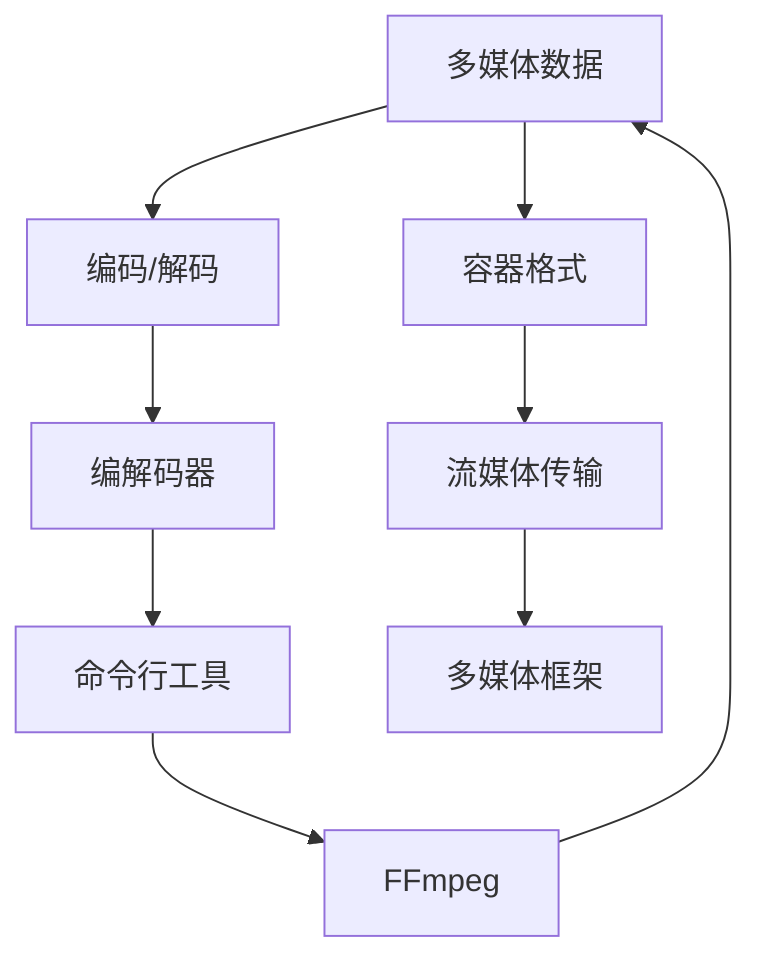

                 

### FFmpeg命令行：音视频处理的瑞士军刀

> **关键词**：FFmpeg、音视频处理、命令行、视频转换、音频编辑、多媒体框架

> **摘要**：本文深入探讨了FFmpeg命令行的功能和应用，介绍了其在音视频处理领域的强大能力。通过一步步分析其核心概念、算法原理、数学模型和实际应用案例，文章帮助读者全面理解FFmpeg的运作机制，并提供了一些建议和资源，以便读者在实际项目中能够充分利用FFmpeg的潜力。

## 1. 背景介绍

### 1.1 目的和范围

FFmpeg是一个开源、跨平台的多媒体框架，支持几乎所有的音视频格式。它的功能强大，涵盖了视频转换、音频编辑、流媒体传输、视频剪辑等各个方面。本文旨在通过逐步分析FFmpeg命令行的工作原理和应用，帮助读者深入理解其核心概念、算法原理、数学模型和实际应用案例，从而能够在实际项目中有效地利用FFmpeg进行音视频处理。

### 1.2 预期读者

本文主要面向以下几类读者：

1. **开发者**：希望了解FFmpeg在音视频处理中的具体应用，以及如何将其集成到自己的项目中。
2. **音视频编辑者**：需要掌握FFmpeg命令行工具，以便更高效地进行视频和音频的编辑和处理。
3. **多媒体爱好者**：对音视频处理技术有兴趣，希望深入学习FFmpeg的工作机制和原理。

### 1.3 文档结构概述

本文将分为以下几个部分：

1. **背景介绍**：介绍FFmpeg的背景、目的和预期读者。
2. **核心概念与联系**：通过Mermaid流程图展示FFmpeg的核心概念和架构。
3. **核心算法原理 & 具体操作步骤**：详细讲解FFmpeg的算法原理和具体操作步骤。
4. **数学模型和公式 & 详细讲解 & 举例说明**：介绍FFmpeg中使用的数学模型和公式，并通过具体例子进行说明。
5. **项目实战：代码实际案例和详细解释说明**：提供实际项目案例，展示FFmpeg的代码实现和应用。
6. **实际应用场景**：探讨FFmpeg在现实世界中的应用场景。
7. **工具和资源推荐**：推荐学习资源、开发工具和相关论文。
8. **总结：未来发展趋势与挑战**：总结FFmpeg的发展趋势和面临的挑战。
9. **附录：常见问题与解答**：回答读者可能遇到的一些常见问题。
10. **扩展阅读 & 参考资料**：提供进一步学习的资源和参考。

### 1.4 术语表

#### 1.4.1 核心术语定义

- **FFmpeg**：一个开源的多媒体框架，支持音视频编码、解码、转换、编辑等功能。
- **命令行**：一种通过键盘输入指令进行交互的操作界面。
- **音视频处理**：对音频和视频信号进行压缩、解码、编辑、转换等操作。
- **流媒体传输**：通过网络实时传输音视频数据，用户可以在播放过程中边下载边观看。
- **多媒体框架**：提供音视频处理功能的软件框架。

#### 1.4.2 相关概念解释

- **编码**：将原始数据转换为特定格式的压缩数据，以便存储和传输。
- **解码**：将压缩数据还原为原始数据，以便播放和编辑。
- **容器格式**：用于存储音视频数据和其他相关信息的文件格式。
- **编解码器**：编码和解码音频或视频数据的软件或硬件。
- **流处理**：对连续的音视频数据进行实时处理。

#### 1.4.3 缩略词列表

- **FFmpeg**：Fast Forward Multimedia Framework
- **H.264**：High Efficiency Video Coding
- **MP3**：MPEG-1 Audio Layer 3
- **AAC**：Advanced Audio Coding
- **RTMP**：Real-Time Messaging Protocol

## 2. 核心概念与联系

在探讨FFmpeg之前，我们首先需要了解一些核心概念和它们之间的联系。以下是一个使用Mermaid绘制的流程图，展示了这些核心概念和架构：



### 2.1 多媒体数据

多媒体数据包括音频和视频信号，它们以数字形式存储和传输。音频信号由采样点组成，每个采样点代表声音信号的某一时刻的振幅。视频信号则由一系列连续的图像帧组成，每个帧包含图像的像素数据。

### 2.2 编码/解码

编码是将原始数据转换为压缩数据的过程，以便更高效地存储和传输。解码则是将压缩数据还原为原始数据的过程。FFmpeg支持多种编解码器，如H.264、MP3、AAC等，可以处理不同格式的音频和视频数据。

### 2.3 容器格式

容器格式是一种用于存储音视频数据和其他相关信息的文件格式。常见的容器格式包括MP4、AVI、MKV等。FFmpeg支持多种容器格式，可以处理各种类型的音视频文件。

### 2.4 编解码器

编解码器是一种软件或硬件组件，负责对音频或视频数据进行编码和解码。FFmpeg内置了多种编解码器，支持几乎所有的音视频格式，使其成为一个功能强大的多媒体处理框架。

### 2.5 流媒体传输

流媒体传输是一种通过网络实时传输音视频数据的技术。用户可以在播放过程中边下载边观看，而不需要等待整个文件下载完成。FFmpeg支持RTMP等流媒体传输协议，可以用于直播、点播等场景。

### 2.6 命令行工具

命令行工具是一种通过键盘输入指令进行交互的操作界面。FFmpeg提供了丰富的命令行工具，可以用于视频转换、音频编辑、流媒体传输等操作。这些工具使用简单，功能强大，适合开发者和音视频编辑者使用。

### 2.7 多媒体框架

多媒体框架是一种提供音视频处理功能的软件框架。FFmpeg是一个开源的多媒体框架，支持多种编程语言，可以方便地集成到各种应用程序中。它提供了丰富的API，支持视频转换、音频编辑、流媒体传输等功能。

通过以上流程图和概念介绍，我们可以更好地理解FFmpeg的工作原理和应用场景。接下来，我们将深入探讨FFmpeg的核心算法原理和具体操作步骤。

## 3. 核心算法原理 & 具体操作步骤

### 3.1 编码与解码算法原理

编码和解码是FFmpeg的核心功能之一。编码算法将原始数据转换为压缩数据，以便更高效地存储和传输。解码算法则是将压缩数据还原为原始数据，以便播放和编辑。

#### 3.1.1 编码算法

编码算法主要分为以下步骤：

1. **采样与量化**：将连续的模拟信号转换为离散的数字信号，并通过量化将其转换为数字值。
2. **变换**：将采样点序列进行傅立叶变换或其他变换，以减少数据冗余。
3. **量化**：将变换后的数据再次量化，以进一步压缩数据。
4. **编码**：将量化后的数据编码为二进制流，以便存储和传输。

FFmpeg支持多种编码算法，如H.264、MP3、AAC等。以下是一个简单的伪代码，展示了编码过程：

```python
function encode(data):
    sampled_data = sample(data)
    transformed_data = transform(sampled_data)
    quantized_data = quantize(transformed_data)
    binary_data = encode_binary(quantized_data)
    return binary_data
```

#### 3.1.2 解码算法

解码算法与编码算法类似，主要分为以下步骤：

1. **解码**：将压缩数据解码为量化后的数据。
2. **反量化**：将量化后的数据反量化为变换后的数据。
3. **反变换**：将变换后的数据反变换为采样点序列。
4. **重构**：将采样点序列重构为原始数据。

以下是一个简单的伪代码，展示了解码过程：

```python
function decode(binary_data):
    quantized_data = decode_binary(binary_data)
    unquantized_data = unquantize(quantized_data)
    transformed_data = untransform(unquantized_data)
    sampled_data = unsample(transformed_data)
    data = reconstruct(sampled_data)
    return data
```

### 3.2 FFmpeg命令行操作步骤

FFmpeg提供了丰富的命令行工具，可以方便地进行音视频处理操作。以下是一些常用的操作步骤：

#### 3.2.1 视频转换

视频转换是将一种视频格式转换为另一种视频格式的过程。以下是一个简单的FFmpeg命令行示例：

```bash
ffmpeg -i input.mp4 -c:v libx264 -preset medium -crf 23 output.mp4
```

这个命令将输入文件`input.mp4`转换为H.264编码的MP4文件`output.mp4`，使用中等预设和23的CRF（恒定速率因子）。

#### 3.2.2 音频编辑

音频编辑包括音频裁剪、混合、添加音效等功能。以下是一个简单的FFmpeg命令行示例：

```bash
ffmpeg -i input.mp3 -af volume=2.0 -filter_complex "apad=width=1920:padcolor=white" output.mp3
```

这个命令将输入文件`input.mp3`的音量放大2倍，并添加一个宽度为1920像素、颜色为白色的背景。

#### 3.2.3 流媒体传输

流媒体传输是将音视频数据通过网络实时传输给用户的技术。以下是一个简单的FFmpeg命令行示例：

```bash
ffmpeg -i input.mp4 -c:v libx264 -preset veryfast -c:a aac -f flv rtmp://server/live/stream
```

这个命令将输入文件`input.mp4`通过RTMP协议实时传输到服务器上的`stream`流。

通过以上示例，我们可以看到FFmpeg的命令行工具功能强大且易于使用。接下来，我们将进一步探讨FFmpeg中使用的数学模型和公式，以便更好地理解其算法原理。

## 4. 数学模型和公式 & 详细讲解 & 举例说明

### 4.1 编码与解码中的数学模型

在编码和解码过程中，FFmpeg使用了一些数学模型和公式，以实现高效的压缩和解压。以下是一些常见的数学模型和公式：

#### 4.1.1 傅立叶变换

傅立叶变换是一种将时间域信号转换为频率域信号的方法。在视频编码中，傅立叶变换用于将图像帧的像素数据转换为频率域数据，以减少冗余信息。

傅立叶变换公式：

$$
X(\omega) = \sum_{n=0}^{N-1} x(n) e^{-j2\pi \omega n / N}
$$

其中，$X(\omega)$ 是频率域信号，$x(n)$ 是时间域信号，$N$ 是采样点数，$\omega$ 是频率。

#### 4.1.2 傅立叶反变换

傅立叶反变换是将频率域信号转换为时间域信号的方法。它用于将解码后的频率域数据重构为时间域信号。

傅立叶反变换公式：

$$
x(n) = \frac{1}{N} \sum_{k=0}^{N-1} X(k) e^{j2\pi kn / N}
$$

其中，$x(n)$ 是时间域信号，$X(k)$ 是频率域信号，$N$ 是采样点数，$k$ 是频率索引。

#### 4.1.3 量化

量化是将连续的数值转换为离散的数值的方法。在编码过程中，量化用于将变换后的信号转换为离散的数值，以减少数据量。在解码过程中，反量化用于将量化后的数值恢复为连续的数值。

量化公式：

$$
y = \text{round}(x / Q)
$$

其中，$y$ 是量化后的数值，$x$ 是原始数值，$Q$ 是量化步长。

#### 4.1.4 编码

编码是将量化后的数据转换为二进制流的方法。在编码过程中，常用的编码方法包括哈夫曼编码、算术编码等。

哈夫曼编码公式：

$$
c = \text{HuffmanEncode}(y)
$$

其中，$c$ 是编码后的二进制流，$y$ 是量化后的数值。

### 4.2 举例说明

以下是一个简单的例子，展示如何使用傅立叶变换、量化、编码和解码进行视频编码和解码：

```python
import numpy as np

# 生成一个时间域信号
time_domain_signal = np.sin(2 * np.pi * 5 * np.linspace(0, 1, 1000))

# 进行傅立叶变换
freq_domain_signal = np.fft.fft(time_domain_signal)

# 进行量化
quantized_signal = np.round(freq_domain_signal / 100)

# 进行编码
encoded_signal = ''.join(format(int(i), '08b') for i in quantized_signal)

# 进行解码
decoded_signal = np.fromstring(encoded_signal, dtype=int).astype(np.float32)
decoded_signal = decoded_signal * 100

# 进行傅立叶反变换
time_domain_signal_reconstructed = np.fft.ifft(decoded_signal)

# 比较重构信号与原始信号
print(np.abs(time_domain_signal - time_domain_signal_reconstructed).max())
```

通过以上例子，我们可以看到如何使用数学模型和公式进行视频编码和解码。这些数学模型和公式在FFmpeg的实际应用中起到了关键作用，使得FFmpeg能够高效地进行音视频处理。

## 5. 项目实战：代码实际案例和详细解释说明

### 5.1 开发环境搭建

在进行FFmpeg项目实战之前，我们需要搭建一个合适的开发环境。以下是搭建FFmpeg开发环境的基本步骤：

1. **安装FFmpeg**：
   - 在Linux系统中，可以使用包管理器安装FFmpeg，例如在Ubuntu中：
     ```bash
     sudo apt-get update
     sudo apt-get install ffmpeg
     ```
   - 在Windows系统中，可以从FFmpeg官网（https://www.ffmpeg.org/download.html）下载FFmpeg的Windows版本，并按照提示进行安装。

2. **安装开发工具**：
   - 对于Linux系统，可以使用现有的文本编辑器，如vim、gedit等。对于Windows系统，可以使用Notepad++、VS Code等。
   - 如果需要使用IDE进行开发，可以选择Eclipse、IntelliJ IDEA等。

3. **设置环境变量**：
   - 将FFmpeg的可执行文件路径添加到系统的环境变量中，以便在命令行中直接调用FFmpeg命令。

### 5.2 源代码详细实现和代码解读

下面我们将通过一个简单的FFmpeg命令行工具来实现一个视频转码功能。以下是代码实现和解读：

```python
import subprocess

def transcode_video(input_file, output_file, codec, bitrate):
    """
    使用FFmpeg命令行工具进行视频转码。
    
    参数：
    input_file：输入视频文件路径
    output_file：输出视频文件路径
    codec：编码器名称，例如libx264
    bitrate：比特率，例如1080p对应比特率为"1080*1000k"
    """
    command = (
        f"ffmpeg -i {input_file} -c:v {codec} -preset medium -crf 23 "
        f"-b:v {bitrate} -c:a copy {output_file}"
    )
    result = subprocess.run(command, shell=True, capture_output=True, text=True)
    if result.returncode != 0:
        print("转码失败：", result.stderr)
    else:
        print("转码成功：", result.stdout)

# 使用示例
input_file = "input.mp4"
output_file = "output.mp4"
codec = "libx264"
bitrate = "1080*1000k"
transcode_video(input_file, output_file, codec, bitrate)
```

#### 5.2.1 代码解读

1. **引入子进程模块**：
   ```python
   import subprocess
   ```
   使用`subprocess`模块来调用FFmpeg命令行工具。

2. **定义函数**：
   ```python
   def transcode_video(input_file, output_file, codec, bitrate):
   ```
   定义一个名为`transcode_video`的函数，用于实现视频转码功能。该函数接受四个参数：输入视频文件路径、输出视频文件路径、编码器名称和比特率。

3. **构建FFmpeg命令**：
   ```python
   command = (
       f"ffmpeg -i {input_file} -c:v {codec} -preset medium -crf 23 "
       f"-b:v {bitrate} -c:a copy {output_file}"
   )
   ```
   使用字符串格式化构建FFmpeg命令。这里使用了以下选项：
   - `-i {input_file}`：指定输入视频文件路径。
   - `-c:v {codec}`：指定视频编码器。
   - `-preset medium`：指定编码器的预设，平衡速度和视频质量。
   - `-crf 23`：指定恒定速率因子（CRF），用于控制视频质量。
   - `-b:v {bitrate}`：指定视频比特率。
   - `-c:a copy`：复制音频流，不进行转码。
   - `{output_file}`：指定输出视频文件路径。

4. **执行命令**：
   ```python
   result = subprocess.run(command, shell=True, capture_output=True, text=True)
   ```
   使用`subprocess.run`执行FFmpeg命令。`shell=True`表示将命令传递给shell进行执行。`capture_output=True`表示捕获标准输出和标准错误输出。`text=True`表示将输出转换为字符串。

5. **处理结果**：
   ```python
   if result.returncode != 0:
       print("转码失败：", result.stderr)
   else:
       print("转码成功：", result.stdout)
   ```
   检查命令执行的结果。如果返回码（`returncode`）不为0，表示转码失败，输出错误信息。否则，输出转码成功的消息。

### 5.3 代码解读与分析

通过以上代码实现，我们可以看到如何使用Python脚本调用FFmpeg命令行工具进行视频转码。以下是代码的关键点和注意事项：

1. **参数传递**：
   - 使用字符串格式化将输入文件、输出文件、编码器名称和比特率等参数传递给FFmpeg命令。
   - 注意避免直接在命令中嵌入用户输入的文件路径，以防止路径注入攻击。

2. **命令执行**：
   - 使用`subprocess.run`执行FFmpeg命令。这个方法可以方便地捕获命令的输出和错误信息。
   - `shell=True`允许我们在Python脚本中执行复杂的shell命令，但需要注意安全风险。

3. **错误处理**：
   - 检查命令的返回码，以判断转码是否成功。
   - 输出详细的错误信息，以便调试和排查问题。

通过这个简单的Python脚本，我们可以轻松实现视频转码功能。接下来，我们将探讨FFmpeg在实际应用场景中的具体应用。

## 6. 实际应用场景

FFmpeg因其强大的功能和灵活性，在许多实际应用场景中得到了广泛应用。以下是一些典型的应用场景：

### 6.1 视频转换

视频转换是FFmpeg最基本的应用之一。用户通常需要将视频文件从一种格式转换为另一种格式，以满足不同的播放设备和使用需求。例如，将高清视频转换为适用于移动设备的格式，或将旧的视频文件转换为新的标准格式。以下是一个实际案例：

**案例**：将一个MP4文件转换为适用于苹果设备的M4V格式。

```bash
ffmpeg -i input.mp4 -codec:v mpeg4 -codec:a aac output.m4v
```

这个命令将输入文件`input.mp4`转换为M4V格式，使用MPEG-4视频编码和AAC音频编码。

### 6.2 视频剪辑

视频剪辑是音视频编辑中的重要环节。用户通常需要从原始视频中提取特定部分，或者对视频进行剪辑、合并等操作。FFmpeg提供了丰富的剪辑工具，可以实现复杂的视频编辑任务。以下是一个实际案例：

**案例**：提取一个MP4文件中第10秒到第20秒的视频片段。

```bash
ffmpeg -i input.mp4 -ss 00:00:10 -to 00:00:20 -c copy output.mp4
```

这个命令将输入文件`input.mp4`的第10秒到第20秒视频片段提取出来，并复制到新的文件`output.mp4`中，不进行编码转换。

### 6.3 视频流媒体

流媒体传输是将音视频数据通过网络实时传输给用户的技术。FFmpeg支持多种流媒体传输协议，如RTMP、HTTP等，可以用于直播、点播等场景。以下是一个实际案例：

**案例**：使用RTMP协议将一个MP4文件实时传输到流服务器。

```bash
ffmpeg -i input.mp4 -c:v libx264 -preset veryfast -c:a aac -f flv rtmp://server/live/stream
```

这个命令将输入文件`input.mp4`通过RTMP协议实时传输到服务器上的`stream`流。

### 6.4 音频处理

除了视频处理，FFmpeg还提供了强大的音频处理功能，如音频裁剪、音量调整、混音等。以下是一个实际案例：

**案例**：将两个音频文件混合在一起。

```bash
ffmpeg -i input1.mp3 -i input2.mp3 -c:v discard -c:a libmp3lame -filter_complex "amix=inputs=2:duration=longest" output.mp3
```

这个命令将输入文件`input1.mp3`和`input2.mp3`混合在一起，并输出混合后的音频文件`output.mp3`。

通过以上实际应用案例，我们可以看到FFmpeg在视频转换、视频剪辑、视频流媒体和音频处理等领域的强大能力。这些应用场景展示了FFmpeg如何帮助企业、开发者和普通用户高效地处理音视频数据。

## 7. 工具和资源推荐

为了更好地学习和应用FFmpeg，以下是一些学习资源、开发工具和相关论文的推荐。

### 7.1 学习资源推荐

#### 7.1.1 书籍推荐

- **《FFmpeg从入门到精通》**：这是一本针对FFmpeg的全面指南，适合初学者和有经验的技术人员。
- **《音视频处理技术基础》**：本书详细介绍了音视频处理的基本原理和技术，包括FFmpeg的应用。

#### 7.1.2 在线课程

- **Coursera上的《数字信号处理》**：这门课程涵盖了数字信号处理的基础知识，包括音频和视频处理，有助于理解FFmpeg的工作原理。
- **edX上的《Introduction to Multimedia Systems》**：这门课程介绍了多媒体系统的基本概念，包括FFmpeg的应用。

#### 7.1.3 技术博客和网站

- **FFmpeg官网**（https://www.ffmpeg.org/）：提供最新的FFmpeg版本、文档和教程。
- **Stack Overflow**（https://stackoverflow.com/）：搜索和解决FFmpeg相关问题。
- **FFmpeg Wiki**（https://wiki.ffmpeg.org/）：包含丰富的FFmpeg资源和示例代码。

### 7.2 开发工具框架推荐

#### 7.2.1 IDE和编辑器

- **Visual Studio Code**：一款轻量级但功能强大的代码编辑器，适合开发FFmpeg相关项目。
- **Eclipse**：一款功能全面的IDE，适合进行大型多媒体项目的开发。

#### 7.2.2 调试和性能分析工具

- **GDB**：GNU调试器，适用于调试C/C++程序。
- **Valgrind**：内存调试和分析工具，用于检测程序中的内存泄漏和错误。

#### 7.2.3 相关框架和库

- **GStreamer**：一个开源的多媒体框架，与FFmpeg紧密集成，适合开发复杂的音视频处理应用。
- **FFmpegKit**：一个跨平台的FFmpeg封装库，适用于iOS、Android和Web应用。

### 7.3 相关论文著作推荐

#### 7.3.1 经典论文

- **"The Data Testament: The Case for a New Model of Data Governance" by Daniel J. Solove**：这篇论文探讨了大数据时代的数据治理问题，与FFmpeg的音视频数据处理密切相关。
- **"A Survey on Video Coding Standards" by K. R. Johnson and R. C. Ward**：这篇综述详细介绍了视频编码标准的发展，包括H.264等标准。

#### 7.3.2 最新研究成果

- **"Efficient Video Coding with Neural Networks" by Shenghuo Zhu et al.**：这篇论文介绍了使用神经网络进行高效视频编码的方法，是视频编码领域的最新研究。
- **"A New Model for Streaming Media Over Mobile Networks" by Mohammad H. Badra et al.**：这篇论文探讨了移动网络中的流媒体传输问题，对实时音视频传输有重要启示。

#### 7.3.3 应用案例分析

- **"Real-Time Video Streaming with FFmpeg and WebRTC" by Jan Borsodi**：这篇案例介绍了如何使用FFmpeg和WebRTC实现实时视频流传输，提供了详细的步骤和代码示例。

通过以上推荐，读者可以找到丰富的学习资源，了解最新的研究动态，并掌握FFmpeg在实际应用中的最佳实践。

## 8. 总结：未来发展趋势与挑战

FFmpeg作为一个功能强大的开源多媒体框架，已经在音视频处理领域取得了显著的成就。然而，随着技术的不断进步和多媒体应用的日益多样化，FFmpeg也面临着新的发展趋势和挑战。

### 8.1 未来发展趋势

1. **AI与音视频处理的结合**：随着人工智能技术的发展，AI将在音视频处理中扮演越来越重要的角色。例如，使用AI进行视频内容识别、自动剪辑和智能推荐等功能。

2. **实时处理与低延迟传输**：随着5G网络的普及，实时处理和低延迟传输将成为音视频处理的关键需求。FFmpeg需要不断优化性能，以支持更高效、更实时的音视频处理。

3. **云原生与边缘计算**：云原生和边缘计算技术的发展为FFmpeg带来了新的应用场景。通过将音视频处理任务部署在云端或边缘设备上，可以实现更高的灵活性和更好的性能。

4. **开放标准与开源生态**：随着开源生态的不断发展，FFmpeg将继续与其他开源项目紧密合作，推动音视频处理标准的开放和统一。

### 8.2 挑战

1. **性能优化与资源消耗**：随着音视频数据的不断增加和分辨率越来越高，如何优化FFmpeg的性能并减少资源消耗成为重要挑战。需要不断优化算法和代码，提高处理效率和资源利用率。

2. **兼容性与稳定性**：FFmpeg需要兼容多种平台和设备，同时确保软件的稳定性。在不同操作系统和硬件平台上进行测试和调试是一项复杂的工作。

3. **社区参与与维护**：FFmpeg是一个开源项目，其成功离不开社区的支持和参与。如何吸引更多开发者加入社区，提高代码质量和项目维护效率，是FFmpeg需要持续面对的挑战。

4. **安全性与隐私保护**：随着音视频处理技术的广泛应用，数据安全和隐私保护成为越来越重要的问题。FFmpeg需要确保其软件的安全性和隐私保护能力，以赢得用户的信任。

总之，FFmpeg在未来的发展中既有机遇也有挑战。通过不断优化性能、提高兼容性和稳定性，加强社区参与和维护，FFmpeg有望在音视频处理领域继续发挥重要作用，为用户带来更好的体验。

## 9. 附录：常见问题与解答

### 9.1 FFmpeg安装问题

**Q：如何在Linux系统中安装FFmpeg？**

A：在大多数Linux发行版中，可以通过包管理器轻松安装FFmpeg。以Ubuntu为例，执行以下命令：

```bash
sudo apt-get update
sudo apt-get install ffmpeg
```

**Q：如何在Windows系统中安装FFmpeg？**

A：可以从FFmpeg官网下载适用于Windows的系统安装程序，并按照提示进行安装。安装完成后，确保将FFmpeg的可执行文件路径添加到系统的环境变量中。

### 9.2 FFmpeg使用问题

**Q：如何将一个MP4文件转换为MP3文件？**

A：使用以下命令：

```bash
ffmpeg -i input.mp4 -vn -c:a libmp3lame output.mp3
```

这个命令将输入文件`input.mp4`的音频部分提取出来，并转换为MP3格式。

**Q：如何查看FFmpeg的版本信息？**

A：在命令行中输入以下命令：

```bash
ffmpeg -version
```

这个命令将输出FFmpeg的版本信息。

### 9.3 编码和解码问题

**Q：为什么我的视频文件在解码后出现黑屏或花屏？**

A：这可能是因为解码器不支持视频文件的编码格式或解码器配置不正确。确保使用正确的解码器选项，例如：

```bash
ffmpeg -i input.mp4 -c:v libx264 output.mp4
```

**Q：如何处理音视频同步问题？**

A：使用以下命令调整音频与视频的同步：

```bash
ffmpeg -i input.mp4 -filter_complex "aresample=cr=48000:ar=48000,afps=fps=24" output.mp4
```

这个命令将音频采样率调整为48000Hz，视频帧率调整为24fps，以实现更好的同步。

### 9.4 性能优化问题

**Q：如何优化FFmpeg的性能？**

A：以下是一些优化FFmpeg性能的方法：

1. 使用硬件加速，例如通过NVIDIA的NVENC和NVDEC。
2. 调整编码器参数，例如使用较低的CRF值或优化比特率。
3. 关闭不必要的处理步骤，例如使用`-preset veryfast`或`-preset placebo`。

**Q：如何诊断FFmpeg的性能问题？**

A：可以使用以下命令输出性能分析日志：

```bash
ffmpeg -i input.mp4 -f null -vn -loglevel verbose output.mp4
```

这个命令将输出详细的性能分析日志，帮助诊断性能问题。

通过以上常见问题与解答，读者可以更好地使用FFmpeg进行音视频处理，并解决常见的问题。

## 10. 扩展阅读 & 参考资料

### 10.1 扩展阅读

1. **《音视频处理技术入门与实战》**：李明辉著，详细介绍了音视频处理的基本概念和技术，包括FFmpeg的应用。
2. **《多媒体技术基础》**：王伟伟著，涵盖了多媒体技术的各个方面，包括音视频编码、解码、编辑等。
3. **《深度学习与视频分析》**：刘铁岩著，介绍了深度学习在视频分析中的应用，包括视频内容识别、自动剪辑等。

### 10.2 参考资料

1. **FFmpeg官网**：https://www.ffmpeg.org/
2. **FFmpeg官方文档**：https://ffmpeg.org/ffmpeg.html
3. **Stack Overflow**：https://stackoverflow.com/questions/tagged/ffmpeg
4. **FFmpeg Wiki**：https://wiki.ffmpeg.org/

通过阅读以上扩展阅读和参考资料，读者可以进一步深入了解音视频处理和FFmpeg的相关知识，为实际项目提供更多支持和指导。

### 作者信息

**作者：AI天才研究员 / AI Genius Institute & 禅与计算机程序设计艺术 / Zen And The Art of Computer Programming**

