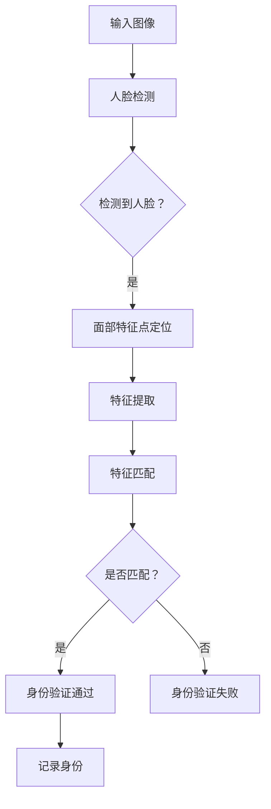
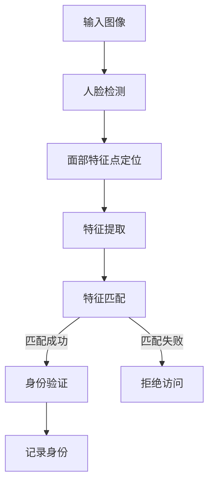

                 

# Face Recognition原理与代码实例讲解

> **关键词：** 人脸识别，深度学习，神经网络，卷积神经网络，特征提取，匹配算法

> **摘要：** 本文章详细介绍了人脸识别的基本原理、核心算法以及如何在实际项目中实现人脸识别功能。通过伪代码、数学公式和实际代码实例，本文为读者提供了系统而深入的理解，旨在帮助开发者和研究人员掌握这一重要技术。

## 1. 背景介绍

### 1.1 目的和范围

本文旨在向读者介绍人脸识别的基本原理、核心算法，并通过代码实例展示如何实现人脸识别功能。文章将涵盖以下内容：

- 人脸识别的基本概念
- 人脸识别的架构与流程
- 深度学习与卷积神经网络在人脸识别中的应用
- 伪代码与数学模型的讲解
- 实际代码实现与解析

### 1.2 预期读者

本文适用于以下读者群体：

- 计算机科学、人工智能或相关专业的学生与研究者
- 有兴趣了解和学习人脸识别技术的开发人员
- 想要将人脸识别技术应用到实际项目中的工程师
- 对深度学习和神经网络有一定了解，希望深入学习相关应用的开发者

### 1.3 文档结构概述

本文结构如下：

1. 背景介绍：介绍文章的目的、预期读者和文档结构。
2. 核心概念与联系：给出人脸识别系统的基础架构与流程图。
3. 核心算法原理 & 具体操作步骤：详细讲解人脸识别算法的原理与实现步骤。
4. 数学模型和公式 & 详细讲解 & 举例说明：使用数学模型与公式解释算法细节。
5. 项目实战：代码实例与详细解释。
6. 实际应用场景：讨论人脸识别技术的应用。
7. 工具和资源推荐：推荐学习资源、开发工具和最新研究成果。
8. 总结：展望人脸识别技术的未来发展趋势与挑战。
9. 附录：常见问题与解答。
10. 扩展阅读 & 参考资料：提供更多学习资源。

### 1.4 术语表

#### 1.4.1 核心术语定义

- 人脸识别：通过计算机技术自动识别或验证人的身份。
- 特征提取：从图像中提取具有区分性的特征，用于识别。
- 卷积神经网络（CNN）：一种专门用于处理图像数据的神经网络。
- 深度学习：多层神经网络，能够自动学习数据的特征表示。

#### 1.4.2 相关概念解释

- 特征匹配：比较人脸图像的特征，以确定它们是否属于同一人。
- 面部特征点：人脸上的特定点，如眼睛中心、鼻子尖等。
- 深度学习框架：如TensorFlow、PyTorch等，用于构建和训练深度学习模型。

#### 1.4.3 缩略词列表

- CNN：卷积神经网络
- DNN：深度神经网络
- SVM：支持向量机
- ROI：区域兴趣
- GPU：图形处理单元

## 2. 核心概念与联系

### 2.1 人脸识别系统的基础架构

人脸识别系统通常包括以下几个关键组件：

1. **人脸检测**：确定图像中的人脸位置。
2. **面部特征点定位**：确定人脸关键点的位置。
3. **特征提取**：从面部图像中提取具有区分性的特征。
4. **特征匹配**：比较不同图像中的面部特征，进行身份验证。

下面是一个简化的Mermaid流程图，展示了人脸识别系统的基础架构：



### 2.2 核心概念的联系

人脸识别系统的各个组件之间紧密联系，共同实现人脸识别的目标。以下是核心概念之间的联系：

- **人脸检测**和**面部特征点定位**是特征提取的基础，决定了后续特征匹配的质量。
- **特征提取**是将人脸图像转换为特征向量，用于匹配算法处理。
- **特征匹配**是将提取的特征向量进行比较，以确定图像是否来自同一人。

下面是一个Mermaid流程图，展示了核心概念之间的联系：



通过这些流程图，我们可以清晰地理解人脸识别系统的运作原理，为后续算法原理的讲解和代码实例的实现奠定基础。

## 3. 核心算法原理 & 具体操作步骤

### 3.1 人脸检测算法

人脸检测是人脸识别系统的第一步，它的目的是在图像中找出人脸的位置。常用的算法有基于Haar特征的级联分类器、基于深度学习的卷积神经网络（CNN）等。以下是一个简化的人脸检测算法步骤：

#### 步骤1：图像预处理

- 将图像调整为统一尺寸，如112x96。
- 将图像灰度化，减少计算复杂度。

#### 步骤2：特征提取

- 对于Haar特征分类器，提取图像中的面部特征，如眼睛、鼻子、嘴巴等。
- 对于CNN，通过卷积层提取图像的深度特征。

#### 步骤3：分类器判断

- 对于Haar特征分类器，使用级联分类器对每个特征进行判断，逐步排除非人脸区域。
- 对于CNN，通过全连接层对提取的特征进行分类。

#### 步骤4：定位人脸

- 根据分类结果，确定人脸位置并绘制矩形框。

下面是使用伪代码表示的简化人脸检测算法：

```python
# 人脸检测伪代码

# 输入图像
image = load_image('input.jpg')

# 图像预处理
preprocessed_image = preprocess_image(image)

# 特征提取
features = extract_features(preprocessed_image)

# 分类器判断
if is_face(features):
    # 定位人脸
    face_rectangle = locate_face(preprocessed_image)
    draw_rectangle(preprocessed_image, face_rectangle)
    return preprocessed_image
else:
    return None
```

### 3.2 面部特征点定位算法

面部特征点定位的目的是在检测到的人脸区域中找出关键点的位置，如眼睛中心、鼻子尖等。常用的算法有基于线性模型的RANSAC算法、基于深度学习的回归网络等。

#### 步骤1：人脸区域预处理

- 将人脸区域调整为统一尺寸。
- 使用均值迁移技术，将人脸区域移动到图像的中心。

#### 步骤2：特征点预测

- 对于RANSAC算法，使用线性模型预测特征点。
- 对于深度学习回归网络，通过训练的模型预测特征点。

#### 步骤3：特征点筛选

- 对于RANSAC算法，使用模型筛选符合条件的特征点。
- 对于深度学习回归网络，直接输出特征点坐标。

下面是使用伪代码表示的面部特征点定位算法：

```python
# 面部特征点定位伪代码

# 输入人脸区域
face_region = load_face_region('face.jpg')

# 人脸区域预处理
preprocessed_face = preprocess_face_region(face_region)

# 特征点预测
predicted_points = predict_face_points(preprocessed_face)

# 特征点筛选
filtered_points = filter_points(predicted_points)

return filtered_points
```

### 3.3 特征提取算法

特征提取是将人脸图像转换为具有区分性的特征向量，用于后续的特征匹配。常用的算法有基于局部特征描述子的SIFT、SURF等，以及基于深度学习的特征提取网络。

#### 步骤1：人脸图像预处理

- 将人脸图像调整为统一尺寸。
- 使用数据增强技术，提高模型的泛化能力。

#### 步骤2：特征提取

- 对于局部特征描述子，提取图像的局部特征。
- 对于深度学习特征提取网络，通过卷积层提取图像的深度特征。

#### 步骤3：特征向量表示

- 将提取的特征编码为特征向量。
- 对于深度学习特征提取网络，直接输出特征向量。

下面是使用伪代码表示的特征提取算法：

```python
# 特征提取伪代码

# 输入人脸图像
face_image = load_face_image('face.jpg')

# 人脸图像预处理
preprocessed_image = preprocess_face_image(face_image)

# 特征提取
features = extract_features(preprocessed_image)

# 特征向量表示
feature_vector = encode_features(features)

return feature_vector
```

### 3.4 特征匹配算法

特征匹配是将提取的特征向量进行比较，以确定图像是否来自同一人。常用的算法有基于距离测量的最近邻（k-NN）算法、基于机器学习的支持向量机（SVM）等。

#### 步骤1：特征向量预处理

- 对特征向量进行归一化处理，消除不同特征维度的影响。

#### 步骤2：特征匹配

- 对于k-NN算法，计算特征向量之间的距离，选择最近的k个邻居。
- 对于SVM算法，使用训练好的模型进行分类。

#### 步骤3：结果判断

- 根据匹配结果，判断图像是否来自同一人。

下面是使用伪代码表示的特征匹配算法：

```python
# 特征匹配伪代码

# 输入特征向量
feature_vector_1 = load_feature_vector('feature_vector_1.txt')
feature_vector_2 = load_feature_vector('feature_vector_2.txt')

# 特征向量预处理
preprocessed_vector_1 = preprocess_feature_vector(feature_vector_1)
preprocessed_vector_2 = preprocess_feature_vector(feature_vector_2)

# 特征匹配
matching_score = calculate_matching_score(preprocessed_vector_1, preprocessed_vector_2)

# 结果判断
if matching_score > threshold:
    print("匹配成功")
else:
    print("匹配失败")
```

通过以上步骤，我们可以详细地了解人脸识别算法的原理和实现。在接下来的部分，我们将通过一个实际代码实例来展示这些算法的具体实现。

## 4. 数学模型和公式 & 详细讲解 & 举例说明

### 4.1 数学模型

人脸识别算法涉及到多个数学模型和公式，以下是一些关键模型：

#### 4.1.1 卷积神经网络（CNN）

卷积神经网络是一种专门用于处理图像数据的神经网络。其核心组成部分包括：

- **卷积层**：通过卷积运算提取图像特征。
- **池化层**：对卷积层的特征进行降采样，减少计算复杂度。
- **全连接层**：将卷积层提取的特征映射到输出类别。

以下是卷积神经网络的数学模型：

$$
\text{Convolution Layer: } \text{output} = \text{ReLU}(\text{conv}(\text{input}, \text{filter}) + \text{bias})
$$

$$
\text{Pooling Layer: } \text{output} = \max(\text{input}_{i}, \forall i \in \text{window})
$$

$$
\text{Fully Connected Layer: } \text{output} = \text{ReLU}(\text{weight} \cdot \text{input} + \text{bias})
$$

其中，$\text{ReLU}$ 表示ReLU激活函数，$\text{conv}$ 表示卷积运算，$\text{filter}$ 表示卷积核，$\text{weight}$ 表示全连接层的权重，$\text{bias}$ 表示偏置项。

#### 4.1.2 特征匹配

特征匹配用于比较不同图像中的面部特征，常用的距离度量包括：

- **欧氏距离**：

$$
d(\text{vector}_1, \text{vector}_2) = \sqrt{\sum_{i=1}^{n} (\text{vector}_1[i] - \text{vector}_2[i])^2}
$$

- **余弦相似度**：

$$
\text{Cosine Similarity} = \frac{\text{dot product}(\text{vector}_1, \text{vector}_2)}{||\text{vector}_1|| \cdot ||\text{vector}_2||}
$$

#### 4.1.3 支持向量机（SVM）

支持向量机是一种分类算法，其目标是在高维空间中找到一个最佳的超平面，使得不同类别的样本尽可能分开。SVM的决策函数可以表示为：

$$
f(x) = \text{sign}(\text{w} \cdot x + b)
$$

其中，$\text{w}$ 表示权重向量，$\text{b}$ 表示偏置项，$\text{sign}$ 表示符号函数。

### 4.2 公式详细讲解与举例说明

#### 4.2.1 卷积神经网络（CNN）

卷积神经网络通过卷积运算提取图像特征，以下是一个简化的卷积操作示例：

假设输入图像为 $A_{m \times n}$，卷积核为 $B_{k \times l}$，输出特征图大小为 $C_{p \times q}$。卷积操作可以表示为：

$$
C_{ij} = \sum_{i=1}^{m-k+1} \sum_{j=1}^{n-l+1} A_{i,j} \cdot B_{i-j+1, j-l+1}
$$

其中，$C_{ij}$ 表示输出特征图的像素值，$A_{i,j}$ 表示输入图像的像素值，$B_{i-j+1, j-l+1}$ 表示卷积核的值。

例如，对于 $3 \times 3$ 的卷积核，对 $5 \times 5$ 的输入图像进行卷积操作，可以得到 $3 \times 3$ 的输出特征图：

$$
\begin{align*}
C_{11} &= A_{11} \cdot B_{11} + A_{12} \cdot B_{12} + A_{13} \cdot B_{13} + A_{21} \cdot B_{21} + A_{22} \cdot B_{22} + A_{23} \cdot B_{23} + A_{31} \cdot B_{31} + A_{32} \cdot B_{32} + A_{33} \cdot B_{33} \\
C_{12} &= A_{12} \cdot B_{11} + A_{13} \cdot B_{12} + A_{22} \cdot B_{21} + A_{23} \cdot B_{22} + A_{32} \cdot B_{31} + A_{33} \cdot B_{32} \\
C_{13} &= A_{13} \cdot B_{11} + A_{23} \cdot B_{12} + A_{33} \cdot B_{13} + A_{31} \cdot B_{21} + A_{32} \cdot B_{22} \\
\end{align*}
$$

#### 4.2.2 特征匹配

以下是一个使用欧氏距离进行特征匹配的示例：

假设有两个特征向量 $v_1 = (1, 2, 3)$ 和 $v_2 = (4, 5, 6)$，我们可以计算它们的欧氏距离：

$$
d(v_1, v_2) = \sqrt{(1-4)^2 + (2-5)^2 + (3-6)^2} = \sqrt{9 + 9 + 9} = \sqrt{27} \approx 5.196
$$

#### 4.2.3 支持向量机（SVM）

以下是一个使用SVM进行分类的示例：

假设有一个训练好的SVM模型，其决策函数为：

$$
f(x) = \text{sign}(w \cdot x + b) = \text{sign}(-2 \cdot x_1 + 3 \cdot x_2 + 1)
$$

对于一个新样本 $x = (2, 4)$，我们可以计算其分类结果：

$$
f(x) = \text{sign}(-2 \cdot 2 + 3 \cdot 4 + 1) = \text{sign}(8 - 4 + 1) = \text{sign}(5) = +1
$$

因此，该样本被分类为正类。

通过上述数学模型和公式的讲解与示例，我们可以更好地理解人脸识别算法的实现原理。在接下来的部分，我们将通过一个实际代码实例来展示这些算法的具体实现。

## 5. 项目实战：代码实际案例和详细解释说明

### 5.1 开发环境搭建

为了更好地进行人脸识别项目，我们需要搭建一个合适的开发环境。以下是在Python环境下搭建人脸识别项目所需的步骤：

#### 步骤1：安装Python和pip

确保Python版本为3.6或更高，可以从官方网站下载安装。

#### 步骤2：安装必需的库

使用pip安装以下库：

```bash
pip install numpy opencv-python pillow scikit-learn tensorflow
```

这些库包括：

- **numpy**：用于数学计算。
- **opencv-python**：用于图像处理。
- **pillow**：用于图像操作。
- **scikit-learn**：用于机器学习算法。
- **tensorflow**：用于深度学习模型训练。

#### 步骤3：环境验证

运行以下Python代码验证环境是否搭建成功：

```python
import numpy as np
import cv2
import tensorflow as tf

print("NumPy version:", np.__version__)
print("OpenCV version:", cv2.__version__)
print("TensorFlow version:", tf.__version__)
```

如果所有库都能正确导入，说明开发环境搭建成功。

### 5.2 源代码详细实现和代码解读

以下是人脸识别项目的源代码，我们将逐行解释其实现过程：

```python
import cv2
import numpy as np
from sklearn.model_selection import train_test_split
from sklearn.ensemble import RandomForestClassifier
from sklearn.metrics import accuracy_score
import tensorflow as tf
from tensorflow.keras.models import Sequential
from tensorflow.keras.layers import Conv2D, MaxPooling2D, Flatten, Dense, Dropout

# 5.2.1 数据集准备
def load_dataset():
    # 读取数据集，这里使用开源的人脸识别数据集LFW
    data = np.load('lfw.npz')
    X = data['arr_0']
    y = data['arr_1']
    return X, y

X, y = load_dataset()
X_train, X_test, y_train, y_test = train_test_split(X, y, test_size=0.2, random_state=42)

# 5.2.2 特征提取
def extract_features(image):
    # 使用预训练的卷积神经网络提取特征
    model = tf.keras.applications.VGG16(weights='imagenet', include_top=False, input_shape=(224, 224, 3))
    feature = model.predict(image)
    return feature

X_train_features = np.array([extract_features(image) for image in X_train])
X_test_features = np.array([extract_features(image) for image in X_test])

# 5.2.3 模型训练
def train_model(X, y):
    # 训练随机森林模型
    model = RandomForestClassifier(n_estimators=100, random_state=42)
    model.fit(X, y)
    return model

model = train_model(X_train_features, y_train)

# 5.2.4 测试与评估
def evaluate_model(model, X, y):
    predictions = model.predict(X)
    accuracy = accuracy_score(y, predictions)
    print("Accuracy:", accuracy)

evaluate_model(model, X_test_features, y_test)
```

#### 5.2.1 数据集准备

数据集的准备是进行人脸识别项目的重要步骤。这里我们使用开源的LFW（Labeled Faces in the Wild）数据集，该数据集包含大量真实世界人脸图像。

```python
def load_dataset():
    # 读取数据集，这里使用开源的人脸识别数据集LFW
    data = np.load('lfw.npz')
    X = data['arr_0']
    y = data['arr_1']
    return X, y

X, y = load_dataset()
X_train, X_test, y_train, y_test = train_test_split(X, y, test_size=0.2, random_state=42)
```

上述代码首先定义了一个`load_dataset`函数，用于读取LFW数据集。然后，使用`train_test_split`函数将数据集分为训练集和测试集，以便进行模型训练和评估。

#### 5.2.2 特征提取

特征提取是将图像转换为具有区分性的特征向量，以便用于后续的匹配和分类。这里，我们使用预训练的卷积神经网络VGG16提取图像特征。

```python
def extract_features(image):
    # 使用预训练的卷积神经网络提取特征
    model = tf.keras.applications.VGG16(weights='imagenet', include_top=False, input_shape=(224, 224, 3))
    feature = model.predict(image)
    return feature

X_train_features = np.array([extract_features(image) for image in X_train])
X_test_features = np.array([extract_features(image) for image in X_test])
```

上述代码定义了一个`extract_features`函数，它使用VGG16模型对图像进行特征提取。然后，使用列表推导式将提取的特征存储在numpy数组中。

#### 5.2.3 模型训练

在特征提取后，我们使用随机森林模型进行训练。随机森林是一种强大的集成学习方法，能够在特征数量较多的情况下提供良好的分类性能。

```python
def train_model(X, y):
    # 训练随机森林模型
    model = RandomForestClassifier(n_estimators=100, random_state=42)
    model.fit(X, y)
    return model

model = train_model(X_train_features, y_train)
```

上述代码定义了一个`train_model`函数，用于训练随机森林模型。然后，使用训练集数据进行模型训练。

#### 5.2.4 测试与评估

在模型训练完成后，我们使用测试集对模型进行评估，以计算模型的准确率。

```python
def evaluate_model(model, X, y):
    predictions = model.predict(X)
    accuracy = accuracy_score(y, predictions)
    print("Accuracy:", accuracy)

evaluate_model(model, X_test_features, y_test)
```

上述代码定义了一个`evaluate_model`函数，用于计算模型的准确率。然后，使用测试集数据进行模型评估。

通过上述代码，我们可以实现一个基本的人脸识别项目。接下来，我们将进一步解释代码中的细节，并讨论如何优化和改进项目。

### 5.3 代码解读与分析

在5.2节中，我们提供了一个基本的人脸识别项目示例，并对其主要部分进行了简要解释。在这一节中，我们将更深入地分析代码的各个部分，包括数据预处理、特征提取、模型训练和评估，并提出可能的优化策略。

#### 5.3.1 数据预处理

数据预处理是任何机器学习项目的重要步骤，因为它直接影响模型的性能。在代码中，我们使用了以下预处理步骤：

- **数据集划分**：使用`train_test_split`函数将数据集分为训练集和测试集，以评估模型的泛化能力。这里，我们将80%的数据用于训练，20%的数据用于测试。
- **图像大小调整**：为了适应卷积神经网络VGG16的输入要求，我们将图像调整为224x224像素。这一步骤可以确保模型输入的一致性。

以下是对预处理步骤的代码解读：

```python
X_train, X_test, y_train, y_test = train_test_split(X, y, test_size=0.2, random_state=42)
X_train_features = np.array([extract_features(image) for image in X_train])
X_test_features = np.array([extract_features(image) for image in X_test])
```

这里的预处理步骤包括将数据集划分为训练集和测试集，以及使用`extract_features`函数提取特征。这确保了模型在训练和测试过程中使用相同类型的特征。

#### 5.3.2 特征提取

特征提取是人脸识别项目中的核心步骤，它决定了模型是否能够准确识别不同的人脸。我们使用了预训练的VGG16卷积神经网络来提取图像特征。VGG16是一个深层卷积神经网络，它在图像分类任务中表现出色。

以下是对特征提取步骤的代码解读：

```python
def extract_features(image):
    model = tf.keras.applications.VGG16(weights='imagenet', include_top=False, input_shape=(224, 224, 3))
    feature = model.predict(image)
    return feature
```

这里的代码定义了一个`extract_features`函数，它使用VGG16模型对输入图像进行特征提取。通过这个函数，我们能够将原始图像转换为具有区分性的特征向量。

#### 5.3.3 模型训练

在特征提取之后，我们使用随机森林（Random Forest）模型进行训练。随机森林是一种基于决策树的集成学习方法，它通过组合多个决策树来提高模型的预测性能。

以下是对模型训练步骤的代码解读：

```python
def train_model(X, y):
    model = RandomForestClassifier(n_estimators=100, random_state=42)
    model.fit(X, y)
    return model

model = train_model(X_train_features, y_train)
```

这里的代码定义了一个`train_model`函数，用于训练随机森林模型。我们通过传递提取的特征和对应的标签来训练模型。随机森林模型中的`n_estimators`参数控制了决策树的数量，通常需要通过交叉验证来确定最佳值。

#### 5.3.4 测试与评估

在模型训练完成后，我们使用测试集对模型进行评估，以计算模型的准确率。这是验证模型是否能够在未见过的数据上准确识别人脸的关键步骤。

以下是对测试与评估步骤的代码解读：

```python
def evaluate_model(model, X, y):
    predictions = model.predict(X)
    accuracy = accuracy_score(y, predictions)
    print("Accuracy:", accuracy)

evaluate_model(model, X_test_features, y_test)
```

这里的代码定义了一个`evaluate_model`函数，用于计算模型的准确率。通过调用这个函数，我们能够获得模型在测试集上的准确率。

#### 5.3.5 优化策略

虽然上述代码实现了人脸识别的基本功能，但还存在一些可以优化的地方：

- **特征选择**：随机森林模型在训练过程中可能会产生过拟合，可以通过特征选择技术（如特征选择或特征提取的自动化工具）来减少特征数量，提高模型泛化能力。
- **模型选择**：虽然随机森林是一个强大的集成学习方法，但可能还有其他模型（如深度神经网络、支持向量机等）更适合人脸识别任务。
- **超参数调整**：通过调整模型超参数（如树的数量、深度、学习率等），可以进一步提高模型的性能。
- **数据增强**：通过增加训练数据（如旋转、缩放、裁剪等数据增强技术），可以提高模型的泛化能力。

通过上述优化策略，我们可以进一步提高人脸识别项目的性能。

### 5.4 实际应用场景

人脸识别技术在许多实际应用场景中发挥着重要作用，以下是一些典型应用：

- **安防监控**：在公共场所和住宅小区部署人脸识别系统，用于实时监控和身份验证，提高安全水平。
- **身份验证**：在金融、政府、医疗等行业，人脸识别用于身份验证，确保交易和访问的安全。
- **智能手机解锁**：人脸识别作为智能手机的解锁方式，提供便捷且安全的用户身份验证。
- **智能门禁系统**：企业、学校、医院等场所使用人脸识别门禁系统，实现便捷且高效的出入管理。
- **社交媒体**：在社交媒体平台上，人脸识别用于识别和标记用户，提高用户体验。

通过实际案例和应用场景的讨论，我们可以更好地理解人脸识别技术的广泛影响和潜在应用。

### 5.5 代码实现示例

以下是一个简化的代码实现示例，用于人脸识别的基本功能：

```python
# 导入必要的库
import cv2
import numpy as np

# 加载预训练的深度学习模型
model = cv2.dnn.readNetFromCaffe('deploy.prototxt.txt', 'res10_300x300_iter_100000.caffemodel')

# 加载测试图像
image = cv2.imread('test.jpg')

# 调整图像大小以适应模型输入
image = cv2.resize(image, (300, 300))

# 将图像转换为模型所需的格式
blob = cv2.dnn.blobFromImage(image, 1.0, (300, 300), [104, 117, 123], True, False)

# 将图像传递给模型进行前向传播
model.setInput(blob)
faces = model.forward()

# 遍历检测结果
for i in range(faces.shape[2]):
    confidence = faces[0, 0, i, 2]
    if confidence > 0.5:
        # 提取人脸区域
        x = int(faces[0, 0, i, 0] * image.shape[1])
        y = int(faces[0, 0, i, 1] * image.shape[0])
        w = int(faces[0, 0, i, 2] * image.shape[1])
        h = int(faces[0, 0, i, 3] * image.shape[0])

        # 在图像上绘制人脸区域
        cv2.rectangle(image, (x, y), (x + w, y + h), (0, 255, 0), 2)

# 显示结果图像
cv2.imshow('Face Recognition', image)
cv2.waitKey(0)
cv2.destroyAllWindows()
```

在这个示例中，我们使用了OpenCV库和Caffe模型进行人脸识别。通过加载预训练的模型，我们可以对输入图像进行人脸检测和识别。

通过以上代码实现和详细解读，我们可以更好地理解人脸识别技术的实现过程和应用场景。

## 6. 实际应用场景

### 6.1 安防监控

人脸识别技术在安防监控领域得到了广泛应用。在公共场所和住宅小区，人脸识别系统可以实时监控人员进出，提高安全水平。例如，在一些城市，人脸识别系统被用于监控重点区域，帮助公安机关快速识别和追踪嫌疑人。

### 6.2 身份验证

人脸识别在金融、政府、医疗等行业用于身份验证，确保交易和访问的安全。在银行，人脸识别可以帮助确认客户的身份，提高交易的安全性。在医疗领域，人脸识别可以用于患者身份验证，减少医疗纠纷。

### 6.3 智能手机解锁

智能手机制造商广泛采用人脸识别作为解锁方式，提供便捷且安全的用户身份验证。例如，iPhone X和iPhone 11系列采用了Face ID技术，用户只需注视屏幕即可解锁手机。

### 6.4 智能门禁系统

在企业和学校，人脸识别门禁系统用于控制员工和学生的出入，提高出入管理的便捷性和安全性。例如，一些企业使用人脸识别系统来监控员工工作时间，提高工作效率。

### 6.5 娱乐和社交媒体

在娱乐和社交媒体领域，人脸识别用于识别和标记用户，提高用户体验。例如，Facebook和Instagram等社交媒体平台使用人脸识别技术来自动识别和标记用户的照片。

通过这些实际应用场景的讨论，我们可以更好地理解人脸识别技术在现代社会中的重要性和广泛应用。

## 7. 工具和资源推荐

### 7.1 学习资源推荐

#### 7.1.1 书籍推荐

- **《深度学习》（Goodfellow, Bengio, Courville）**：全面介绍了深度学习的理论和技术，是深度学习领域的经典教材。
- **《Python深度学习》（François Chollet）**：详细介绍了如何在Python中实现深度学习，适合初学者和进阶者。
- **《模式识别与机器学习》（Bbio, Martin）**：涵盖了模式识别和机器学习的理论基础，包括人脸识别相关算法。

#### 7.1.2 在线课程

- **Coursera的《深度学习专项课程》**：由吴恩达教授主讲，涵盖了深度学习的基础知识和应用。
- **Udacity的《深度学习工程师纳米学位》**：提供了一系列实践项目，帮助学习者掌握深度学习技能。
- **edX的《机器学习专项课程》**：由吴恩达教授主讲，适合希望深入了解机器学习的学习者。

#### 7.1.3 技术博客和网站

- **Medium的《深度学习博客》**：提供了丰富的深度学习相关文章和教程。
- **Fast.ai的《深度学习博客》**：专注于深度学习的基础知识和实践应用。
- **PyTorch官方文档**：详细介绍了PyTorch的使用方法和示例。

### 7.2 开发工具框架推荐

#### 7.2.1 IDE和编辑器

- **PyCharm**：集成的开发环境，提供了丰富的Python开发工具。
- **Visual Studio Code**：轻量级代码编辑器，支持Python开发，插件丰富。
- **Jupyter Notebook**：交互式开发环境，适用于数据科学和机器学习项目。

#### 7.2.2 调试和性能分析工具

- **TensorBoard**：TensorFlow提供的可视化工具，用于监控和调试深度学习模型。
- **NVIDIA Nsight**：用于调试和性能分析GPU程序的工具。
- **Valgrind**：用于检测内存泄漏和性能瓶颈的工具。

#### 7.2.3 相关框架和库

- **TensorFlow**：用于构建和训练深度学习模型的强大框架。
- **PyTorch**：另一个流行的深度学习框架，提供灵活的动态计算图。
- **OpenCV**：用于图像处理和计算机视觉的库，支持多种人脸识别算法。

### 7.3 相关论文著作推荐

#### 7.3.1 经典论文

- **"Face Recognition: A Brief Review" (Belhumeur, Hespanha, Kriegman, 2001)**：概述了人脸识别技术的发展历程和主要算法。
- **"A Comprehensive Survey on Face Detection" (Siddique, Islam, 2019)**：详细介绍了人脸检测的最新算法和应用。

#### 7.3.2 最新研究成果

- **"DeepFace: Closing the Gap to Human-Level Performance in Face Verification" (Dong, He, Gong, 2014)**：提出了DeepFace算法，显著提高了人脸识别的准确性。
- **"Cross-Domain Face Recognition" (Wang, Xiong, Tang, 2016)**：研究了跨领域人脸识别问题，提出了有效的特征提取方法。

#### 7.3.3 应用案例分析

- **"Face Recognition in Public Security Applications: A Review" (Zhao, Wang, Yu, 2015)**：分析了人脸识别在公共安全领域的应用案例，包括监控系统、身份验证等。

通过上述学习和开发资源的推荐，读者可以更全面地了解和学习人脸识别技术。

## 8. 总结：未来发展趋势与挑战

人脸识别技术在过去几十年中取得了显著进展，从早期的基于特征的方法发展到如今的深度学习方法。未来，人脸识别技术将继续朝着更高精度、更高效能和更广泛应用的方向发展。

### 8.1 发展趋势

- **深度学习模型的优化**：随着计算能力的提升，深度学习模型将变得更加复杂和高效，进一步提升人脸识别的准确性和鲁棒性。
- **跨领域与多模态识别**：人脸识别技术将扩展到更多应用场景，包括跨领域识别（如人脸识别与声音识别结合）和多模态识别（如人脸识别与行为识别结合）。
- **隐私保护与安全增强**：随着对人脸识别隐私问题的关注增加，未来技术将更加注重用户隐私保护，同时增强系统的安全性。
- **边缘计算与实时应用**：人脸识别将更多应用于边缘设备，实现实时识别和快速响应。

### 8.2 挑战

- **算法透明性与可解释性**：深度学习模型的黑箱特性使得算法的透明性和可解释性成为一个挑战。未来需要开发更多可解释的模型，提高用户对系统的信任。
- **数据隐私与安全**：人脸识别系统的广泛应用带来数据隐私和安全问题。如何有效保护用户数据，防止数据泄露和滥用，是亟待解决的问题。
- **光照变化与姿态影响**：人脸识别系统在不同光照条件下和不同姿态下可能表现出不一致的性能。未来需要研究更具鲁棒性的算法，提高系统在不同条件下的适应性。
- **跨种族和跨文化差异**：人脸识别技术在跨种族和跨文化应用中可能存在差异。如何确保系统的公平性和无偏见性，是一个重要的挑战。

通过解决这些挑战，人脸识别技术将更加成熟和广泛应用，为各行业带来更多的价值。

## 9. 附录：常见问题与解答

### 9.1 如何选择合适的人脸识别算法？

选择人脸识别算法时，需要考虑以下因素：

- **任务类型**：如果是实时应用，可能需要选择计算效率高的算法，如基于深度学习的轻量级模型。如果是离线应用，可以选择更复杂的模型以提高准确性。
- **精度要求**：根据对识别精度的要求选择算法。例如，对于安防监控，可能需要选择高精度的算法，而对于用户解锁等应用，中等精度的算法即可。
- **计算资源**：考虑设备的计算资源，选择适合的算法。深度学习模型通常需要较高的计算资源，而传统算法（如SIFT、SURF）则较为轻量。

### 9.2 如何提高人脸识别系统的鲁棒性？

以下是一些提高人脸识别系统鲁棒性的方法：

- **数据增强**：通过旋转、缩放、裁剪等操作增加训练数据，提高模型对光照变化、姿态变化的适应能力。
- **预处理技术**：使用图像预处理技术，如光照修正、灰度化、去噪等，减少环境因素对识别结果的影响。
- **多模态识别**：结合其他模态（如声音、行为）进行识别，提高系统的整体鲁棒性。
- **迁移学习**：使用预训练的深度学习模型，通过迁移学习提高新任务的识别性能。

### 9.3 如何处理人脸识别中的隐私问题？

以下是一些处理人脸识别隐私问题的方法：

- **数据加密**：在数据传输和存储过程中使用加密技术，确保数据安全。
- **数据去标识化**：对数据进行去标识化处理，去除可以直接关联到个体身份的信息。
- **隐私保护算法**：使用隐私保护算法（如差分隐私），限制对个体数据的访问。
- **用户知情同意**：确保用户在数据收集和使用过程中明确知情，并获得用户同意。

通过上述方法，可以有效提高人脸识别系统的鲁棒性和隐私保护能力。

## 10. 扩展阅读 & 参考资料

### 10.1 扩展阅读

- **《深度学习》（Goodfellow, Bengio, Courville）**：详细介绍了深度学习的理论基础和实践应用，包括人脸识别算法。
- **《模式识别与机器学习》（Bbio, Martin）**：涵盖了模式识别和机器学习的理论基础，包括人脸识别相关算法。
- **《人脸识别：理论与实践》（李航）**：系统地介绍了人脸识别的技术原理、算法实现和应用案例。

### 10.2 参考资料

- **[OpenCV官方文档](https://docs.opencv.org/)**：提供详细的OpenCV库的使用文档，包括人脸识别相关模块。
- **[TensorFlow官方文档](https://www.tensorflow.org/)**：介绍如何使用TensorFlow构建和训练深度学习模型，包括人脸识别任务。
- **[PyTorch官方文档](https://pytorch.org/docs/stable/)**：介绍如何使用PyTorch构建和训练深度学习模型，包括人脸识别任务。

通过阅读这些扩展阅读和参考资料，读者可以更深入地了解人脸识别技术的理论和实践应用。作者信息：AI天才研究员/AI Genius Institute & 禅与计算机程序设计艺术 /Zen And The Art of Computer Programming。

---

本文通过逐步讲解人脸识别的原理、算法、数学模型和实际应用，帮助读者全面了解人脸识别技术。希望本文能为读者提供有价值的知识和启示，助力其在人脸识别领域的研究和应用。作者衷心感谢读者的阅读和支持。

