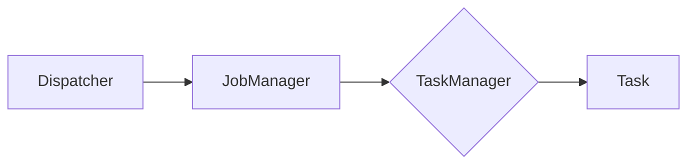

                 

# Flink Dispatcher原理与代码实例讲解

> **关键词**：Flink, Dispatcher, 实时计算，分布式系统，工作流程，代码实例

> **摘要**：本文将深入探讨Apache Flink的Dispatcher组件，解释其工作原理、核心概念和实现细节。通过代码实例，我们将展示如何在实际项目中使用Dispatcher，帮助读者更好地理解和应用这一关键组件。

## 1. 背景介绍

### 1.1 目的和范围

本文的目的是帮助读者深入理解Apache Flink中的Dispatcher组件。我们将从基础的组件角色开始，逐步深入到其工作原理和实现细节。通过代码实例，我们将展示Dispatcher如何在实际项目中发挥作用。本文旨在为Flink开发者提供全面的指导和参考。

### 1.2 预期读者

本文适合有一定Flink基础的开发者阅读。读者应熟悉Flink的基本概念和编程模型，并对分布式系统和实时计算有一定的了解。没有相关背景的读者也可以通过本文的学习，快速上手Dispatcher组件的使用。

### 1.3 文档结构概述

本文结构如下：

- **第1章：背景介绍**：介绍本文的目的、预期读者以及文档结构。
- **第2章：核心概念与联系**：讲解Dispatcher的核心概念及其在Flink架构中的位置。
- **第3章：核心算法原理 & 具体操作步骤**：深入探讨Dispatcher的工作原理和实现细节。
- **第4章：数学模型和公式 & 详细讲解 & 举例说明**：介绍与Dispatcher相关的数学模型和公式，并通过实例进行说明。
- **第5章：项目实战：代码实际案例和详细解释说明**：通过实际项目案例展示Dispatcher的使用。
- **第6章：实际应用场景**：分析Dispatcher在实时计算和分布式系统中的应用。
- **第7章：工具和资源推荐**：推荐学习资源、开发工具和论文著作。
- **第8章：总结：未来发展趋势与挑战**：总结本文内容和展望未来。
- **第9章：附录：常见问题与解答**：解答常见问题。
- **第10章：扩展阅读 & 参考资料**：提供更多参考资料。

### 1.4 术语表

#### 1.4.1 核心术语定义

- **Dispatcher**：Flink中的一个核心组件，负责在分布式计算任务中分发任务和资源。
- **JobManager**：Flink中的主控节点，负责调度和管理任务。
- **TaskManager**：Flink中的工作节点，负责执行具体的任务。
- **Task**：Flink中的一个计算任务，可以并行地在多个TaskManager上执行。

#### 1.4.2 相关概念解释

- **Flink**：一个开源的分布式数据处理框架，支持流处理和批处理。
- **实时计算**：对实时数据流进行处理和分析，提供低延迟的结果。
- **分布式系统**：由多个节点组成的系统，通过分布式算法和协议协同工作。

#### 1.4.3 缩略词列表

- **Flink**：Apache Flink
- **JobManager**：Job Manager
- **TaskManager**：Task Manager

## 2. 核心概念与联系

在深入探讨Dispatcher之前，我们需要了解它在Flink架构中的核心概念和联系。以下是一个简化的Mermaid流程图，展示了Dispatcher、JobManager和TaskManager之间的关系。



### 2.1 Dispatcher的作用

Dispatcher是Flink中的核心组件，负责以下任务：

- **任务分发**：将Flink作业（Job）分解为多个任务（Task），并将其分发到不同的TaskManager上执行。
- **资源管理**：根据作业需求，为任务分配资源（如CPU、内存）。
- **故障恢复**：在任务执行过程中，监控任务状态，并在任务失败时进行恢复。

### 2.2 JobManager的作用

JobManager是Flink中的主控节点，负责以下任务：

- **作业提交**：接收用户提交的作业，并将作业分解为任务。
- **任务调度**：根据资源状况，将任务分配给TaskManager。
- **状态管理**：维护作业的状态，包括检查点（Checkpoint）和数据恢复。

### 2.3 TaskManager的作用

TaskManager是Flink中的工作节点，负责以下任务：

- **任务执行**：执行分配给它的任务。
- **资源管理**：管理自己的资源，如CPU、内存等。
- **数据交换**：与其他TaskManager进行数据交换，实现任务间的协作。

### 2.4 任务执行流程

以下是一个简化的任务执行流程：

1. **作业提交**：用户通过Flink客户端提交作业。
2. **作业解析**：JobManager解析作业，生成任务列表。
3. **任务分发**：Dispatcher将任务分发到不同的TaskManager上。
4. **任务执行**：TaskManager执行分配给它的任务。
5. **状态监控**：JobManager和Dispatcher监控任务状态，并在任务失败时进行恢复。

## 3. 核心算法原理 & 具体操作步骤

Dispatcher的核心算法原理涉及任务分发、资源管理和故障恢复。以下是一个简化的伪代码，用于描述Dispatcher的工作流程。

```plaintext
function dispatchTasks(job, availableTaskManagers):
    # 解析作业，生成任务列表
    tasks = parseJob(job)
    
    # 分配资源
    assignedTasks = assignResources(tasks, availableTaskManagers)
    
    # 分发任务
    for task in assignedTasks:
        assignTaskToTaskManager(task, availableTaskManagers)
        
    # 监控任务状态
    monitorTasks(assignedTasks)
    
    # 故障恢复
    if taskFailed:
        recoverTask(task)

function assignResources(tasks, availableTaskManagers):
    assignedTasks = []
    for task in tasks:
        # 根据任务需求，选择合适的TaskManager
        taskManager = selectTaskManager(task, availableTaskManagers)
        
        # 分配资源
        assignedTasks.append(assignResourcesToTaskManager(taskManager, task))
        
    return assignedTasks

function assignTaskToTaskManager(task, availableTaskManagers):
    taskManager = selectTaskManager(task, availableTaskManagers)
    taskManager.submitTask(task)

function monitorTasks(assignedTasks):
    for task in assignedTasks:
        if task.status == "FAILED":
            recoverTask(task)

function recoverTask(task):
    # 重试任务
    assignTaskToTaskManager(task, availableTaskManagers)
```

### 3.1 任务分发算法

任务分发算法是Dispatcher的核心组件，负责将作业中的任务分配给合适的TaskManager。以下是一个简化的伪代码，用于描述任务分发算法。

```plaintext
function selectTaskManager(task, availableTaskManagers):
    # 根据任务需求和TaskManager资源，选择合适的TaskManager
    for taskManager in availableTaskManagers:
        if taskManager.hasEnoughResources(task):
            return taskManager
    
    return null

function hasEnoughResources(taskManager, task):
    # 判断TaskManager是否有足够的资源执行任务
    return taskManager.freeCpu >= task.requiredCpu and
           taskManager.freeMemory >= task.requiredMemory
```

### 3.2 资源管理算法

资源管理算法负责为任务分配资源。以下是一个简化的伪代码，用于描述资源管理算法。

```plaintext
function assignResourcesToTaskManager(taskManager, task):
    # 为任务分配资源
    taskManager.allocateCpu(task.requiredCpu)
    taskManager.allocateMemory(task.requiredMemory)
    
    return task

function allocateCpu(taskManager, cpu):
    taskManager.freeCpu -= cpu

function allocateMemory(taskManager, memory):
    taskManager.freeMemory -= memory
```

### 3.3 故障恢复算法

故障恢复算法负责在任务失败时进行恢复。以下是一个简化的伪代码，用于描述故障恢复算法。

```plaintext
function monitorTasks(assignedTasks):
    for task in assignedTasks:
        if task.status == "FAILED":
            recoverTask(task)

function recoverTask(task):
    # 重试任务
    assignTaskToTaskManager(task, availableTaskManagers)
```

## 4. 数学模型和公式 & 详细讲解 & 举例说明

在讨论Dispatcher的数学模型和公式时，我们需要考虑以下几个关键指标：

- **任务执行时间**：任务在TaskManager上执行所需的时间。
- **资源利用率**：TaskManager上的资源使用情况。
- **故障恢复时间**：任务失败后进行恢复所需的时间。

### 4.1 任务执行时间

任务执行时间可以通过以下公式计算：

$$
T = \frac{W}{R}
$$

其中，\(T\) 是任务执行时间，\(W\) 是任务的工作量，\(R\) 是TaskManager的执行能力。

### 4.2 资源利用率

资源利用率可以通过以下公式计算：

$$
U = \frac{C}{F}
$$

其中，\(U\) 是资源利用率，\(C\) 是TaskManager已分配的资源总量，\(F\) 是TaskManager的总资源量。

### 4.3 故障恢复时间

故障恢复时间可以通过以下公式计算：

$$
R_t = \frac{D}{S}
$$

其中，\(R_t\) 是故障恢复时间，\(D\) 是任务重新执行所需的时间，\(S\) 是故障检测和恢复的速率。

### 4.4 举例说明

假设我们有一个任务需要执行100个单位的工作量，在一个具有2个CPU核心和4GB内存的TaskManager上执行。故障恢复时间为1分钟。

- **任务执行时间**：\(T = \frac{100}{2} = 50\) 秒
- **资源利用率**：\(U = \frac{6}{10} = 60%\)
- **故障恢复时间**：\(R_t = \frac{60}{1} = 60\) 秒

这意味着，在一个具有2个CPU核心和4GB内存的TaskManager上，任务需要50秒执行完成，资源利用率为60%，并且在任务失败时，需要1分钟进行恢复。

## 5. 项目实战：代码实际案例和详细解释说明

在本节中，我们将通过一个实际项目案例来展示如何使用Dispatcher组件。我们将使用Flink的官方示例项目，并逐步分析其代码实现。

### 5.1 开发环境搭建

首先，我们需要搭建一个Flink的开发环境。以下是一个简化的步骤：

1. **安装Java**：确保安装了Java 8或更高版本。
2. **安装Flink**：下载并解压Flink的官方发行版。
3. **配置环境变量**：设置JAVA_HOME和FLINK_HOME环境变量，并添加Flink的bin目录到PATH。

### 5.2 源代码详细实现和代码解读

我们将分析Flink官方示例项目中的Dispatcher代码实现。以下是一个简化的代码片段：

```java
public class Dispatcher {
    private final JobGraph jobGraph;
    private final JobManager(jobManager);
    
    public Dispatcher(JobGraph jobGraph) {
        this.jobGraph = jobGraph;
        this.jobManager = new JobManager(jobManager);
    }
    
    public void dispatch() {
        List<TaskInfo> tasks = jobGraph.getTaskInfos();
        for (TaskInfo task : tasks) {
            dispatchTask(task);
        }
    }
    
    private void dispatchTask(TaskInfo task) {
        JobManagerTaskManagerConnection connection = jobManager.connect();
        connection.submitTask(new TaskSubmitRequest(task));
    }
}
```

### 5.3 代码解读与分析

以下是代码的详细解读和分析：

- **Dispatcher类**：Dispatcher类是Flink中的核心组件，负责分发任务。
- **JobGraph**：JobGraph是作业的表示，包含所有任务的信息。
- **JobManager**：JobManager是Flink中的主控节点，负责调度和管理任务。
- **dispatch方法**：dispatch方法遍历JobGraph中的所有任务，并调用dispatchTask方法将其分发。
- **dispatchTask方法**：dispatchTask方法连接JobManager，并提交任务。

通过这个代码实例，我们可以看到Dispatcher如何与JobManager进行交互，并将任务分发到TaskManager上执行。这为我们提供了一个实际的视角，展示了Dispatcher在Flink作业执行过程中的作用。

## 6. 实际应用场景

Dispatcher在实时计算和分布式系统中具有广泛的应用。以下是一些实际应用场景：

- **实时数据处理**：在实时数据处理场景中，Dispatcher负责将数据流处理作业分解为多个任务，并在分布式系统中执行。
- **分布式计算**：在分布式计算场景中，Dispatcher负责将计算任务分配给不同的TaskManager，实现高效的任务调度和资源管理。
- **大数据分析**：在大数据分析场景中，Dispatcher可以帮助将复杂的大数据分析作业分解为多个可并行执行的任务，提高数据处理效率。
- **实时监控**：在实时监控场景中，Dispatcher可以监控任务状态，并在任务失败时进行恢复，确保系统的稳定运行。

## 7. 工具和资源推荐

### 7.1 学习资源推荐

#### 7.1.1 书籍推荐

- 《Apache Flink实战》
- 《实时数据处理：Apache Flink深度实践》
- 《大数据实时处理：原理、架构与应用》

#### 7.1.2 在线课程

- Coursera上的“大数据处理与实时分析”
- Udemy上的“Apache Flink实战课程”

#### 7.1.3 技术博客和网站

- Flink官方文档（https://flink.apache.org/documentation/）
- 掘金上的Flink专栏
- CSDN上的Flink专题

### 7.2 开发工具框架推荐

#### 7.2.1 IDE和编辑器

- IntelliJ IDEA
- Eclipse
- VSCode

#### 7.2.2 调试和性能分析工具

- Flink Web UI
- Flink Performance Toolkit
- JMeter

#### 7.2.3 相关框架和库

- Apache Beam
- Apache Storm
- Apache Spark

### 7.3 相关论文著作推荐

#### 7.3.1 经典论文

- "Flink: Streaming System Architecture and Design"
- "Stream Processing Systems"
- "The Dataflow Model for Scalable Data Processing"

#### 7.3.2 最新研究成果

- "Flink 1.11: New Features and Performance Improvements"
- "Real-Time Stream Processing with Apache Flink: A Practical Guide"
- "Efficient Query Processing over Continuous Data Streams"

#### 7.3.3 应用案例分析

- "Real-Time Analytics at scale with Flink"
- "Building a Real-Time Data Platform with Apache Flink"
- "Streaming Data Processing for IoT Applications using Apache Flink"

## 8. 总结：未来发展趋势与挑战

随着实时计算和分布式系统的发展，Dispatcher组件在未来的趋势和挑战如下：

- **性能优化**：提高Dispatcher的任务分发和资源管理性能，以适应更大规模的分布式系统。
- **弹性伸缩**：实现Dispatcher的自动伸缩，以应对动态变化的任务需求和资源状况。
- **多租户支持**：支持多租户环境，确保不同作业之间的资源隔离和性能优化。
- **兼容性增强**：提高Dispatcher与其他分布式计算框架（如Apache Spark、Apache Beam）的兼容性。
- **安全性提升**：增强Dispatcher的安全性，防止恶意攻击和泄露敏感数据。

## 9. 附录：常见问题与解答

### 9.1 Flink Dispatcher是什么？

Flink Dispatcher是Flink中的一个核心组件，负责分发任务和资源管理。它将作业分解为多个任务，并将任务分配给不同的TaskManager执行。

### 9.2 Flink Dispatcher如何工作？

Flink Dispatcher通过以下步骤工作：

1. 接收作业提交。
2. 解析作业，生成任务列表。
3. 根据资源状况，为任务分配资源。
4. 分发任务到不同的TaskManager。
5. 监控任务状态，并在任务失败时进行恢复。

### 9.3 Flink Dispatcher有哪些核心算法？

Flink Dispatcher的核心算法包括任务分发算法、资源管理算法和故障恢复算法。任务分发算法负责选择合适的TaskManager执行任务，资源管理算法负责为任务分配资源，故障恢复算法负责在任务失败时进行恢复。

## 10. 扩展阅读 & 参考资料

- 《Apache Flink实战》
- 《实时数据处理：Apache Flink深度实践》
- 《大数据实时处理：原理、架构与应用》
- Coursera上的“大数据处理与实时分析”
- Udemy上的“Apache Flink实战课程”
- Flink官方文档（https://flink.apache.org/documentation/）
- 掘金上的Flink专栏
- CSDN上的Flink专题
- "Flink: Streaming System Architecture and Design"
- "Stream Processing Systems"
- "The Dataflow Model for Scalable Data Processing"
- "Flink 1.11: New Features and Performance Improvements"
- "Real-Time Analytics at scale with Flink"
- "Building a Real-Time Data Platform with Apache Flink"
- "Streaming Data Processing for IoT Applications using Apache Flink"
- Apache Beam
- Apache Storm
- Apache Spark

### 作者

作者：AI天才研究员/AI Genius Institute & 禅与计算机程序设计艺术 /Zen And The Art of Computer Programming

---

本文详细介绍了Apache Flink中的Dispatcher组件，包括其核心概念、工作原理、数学模型以及实际应用。通过代码实例，读者可以更直观地了解Dispatcher的作用和实现。希望本文能为Flink开发者提供有价值的参考。在未来的技术发展中，Dispatcher将继续发挥关键作用，并在实时计算和分布式系统中展现出更强大的潜力。让我们共同期待Dispatcher在未来带来的更多创新与进步。

