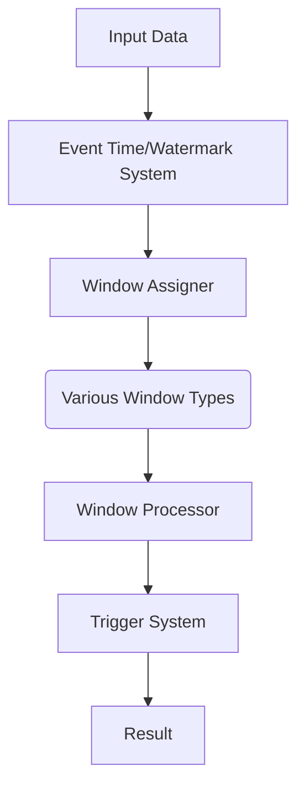

                 

# Flink Window原理与代码实例讲解

> **关键词：** Flink、Window、流处理、数据窗口、时间窗口、滑动窗口、数据流计算、数据处理框架、窗口函数、编程实例

> **摘要：** 本文深入探讨了Apache Flink中的Window机制，包括窗口的概念、分类、操作原理，并通过代码实例详细解析了时间窗口和滑动窗口的实现过程。通过本文，读者将能够掌握Flink Window的核心概念，理解其在流数据处理中的应用，并具备编写实际应用代码的能力。

## 1. 背景介绍

### 1.1 目的和范围

本文旨在向读者介绍Apache Flink中的Window机制，帮助读者理解窗口在流数据处理中的重要作用。我们将涵盖以下内容：

- 窗口的定义和分类
- Flink Window机制的工作原理
- 时间窗口和滑动窗口的代码实例解析
- 窗口函数的使用

### 1.2 预期读者

- 对流数据处理有一定了解的读者
- 想要学习Flink Window机制的工程师
- 对大数据处理框架感兴趣的学术研究者

### 1.3 文档结构概述

本文分为以下几个部分：

- 第1部分：背景介绍，包括目的、预期读者和文档结构概述。
- 第2部分：核心概念与联系，介绍窗口的基本概念和Flink Window架构。
- 第3部分：核心算法原理 & 具体操作步骤，详细解释窗口处理算法。
- 第4部分：数学模型和公式 & 详细讲解 & 举例说明，使用数学公式和实例说明窗口计算。
- 第5部分：项目实战：代码实际案例和详细解释说明，通过具体案例演示窗口实现。
- 第6部分：实际应用场景，介绍窗口在Flink中的应用。
- 第7部分：工具和资源推荐，推荐学习资源和开发工具。
- 第8部分：总结：未来发展趋势与挑战，探讨窗口技术的未来方向。
- 第9部分：附录：常见问题与解答，解答常见疑问。
- 第10部分：扩展阅读 & 参考资料，提供进一步学习的资源。

### 1.4 术语表

#### 1.4.1 核心术语定义

- **窗口（Window）**：在时间维度上对数据进行分组的一种机制。
- **时间窗口（Time Window）**：根据事件发生时间来划分窗口。
- **滑动窗口（Sliding Window）**：周期性地更新窗口，保持固定大小。
- **窗口函数（Window Function）**：对窗口内的数据进行聚合、转换等操作。

#### 1.4.2 相关概念解释

- **事件时间（Event Time）**：事件发生的实际时间。
- **处理时间（Processing Time）**：处理事件的时间。
- **摄取时间（Ingestion Time）**：数据进入系统的实际时间。

#### 1.4.3 缩略词列表

- **Flink**：Apache Flink，一种流行的流数据处理框架。
- **窗口函数**：Window Function，对窗口内数据进行处理的函数。

## 2. 核心概念与联系

### 2.1 Flink Window基本概念

在Flink中，窗口是一种数据处理机制，它允许我们将流数据按照时间或数据量等维度进行分组。窗口的基本概念包括：

- **窗口分配器（Window Assigner）**：决定每个元素属于哪个窗口的规则。
- **窗口处理器（Window Processor）**：对窗口内的数据进行处理（如聚合、转换等）的函数。

Flink支持以下几种窗口类型：

- **时间窗口（Time Window）**：根据事件时间或摄取时间来划分窗口。
- **滑动窗口（Sliding Window）**：周期性地更新窗口，保持固定大小。
- **全局窗口（Global Window）**：没有时间限制，适用于处理整个数据流。
- **计数窗口（Count Window）**：根据数据元素的数量来划分窗口。

### 2.2 Flink Window架构

Flink的Window机制主要包括以下组件：

- **Event Time/Watermark System**：事件时间和水印系统用于处理乱序数据，确保数据元素按照正确的时间顺序处理。
- **Window Assigner**：将数据元素分配到相应的窗口。
- **Window Processor**：对窗口内的数据执行聚合或其他操作。
- **Trigger System**：触发器系统决定何时将窗口传递给处理器。

以下是Flink Window架构的Mermaid流程图：



### 2.3 Flink Window核心算法原理

Flink Window处理算法主要包括以下步骤：

1. **分配窗口**：根据事件时间或处理时间，将数据元素分配到相应的窗口。
2. **处理窗口**：执行窗口处理器定义的聚合或转换操作。
3. **触发窗口**：根据触发器规则，决定何时将窗口传递给处理器。
4. **输出结果**：将处理后的窗口数据输出到下游处理器或存储系统。

以下是Flink Window处理算法的伪代码：

```python
def process_element(element):
    # 步骤1：分配窗口
    window = assign_window(element)

    # 步骤2：处理窗口
    result = process_window(window)

    # 步骤3：触发窗口
    trigger_window(window)

    # 步骤4：输出结果
    output_result(result)
```

## 3. 核心算法原理 & 具体操作步骤

在本节中，我们将深入探讨Flink Window的核心算法原理，并详细解释其具体操作步骤。

### 3.1 窗口分配器

窗口分配器是Flink Window机制中的关键组件，它决定了每个数据元素属于哪个窗口。Flink支持多种类型的窗口分配器，如基于事件时间的窗口分配器和基于处理时间的窗口分配器。

#### 3.1.1 事件时间窗口分配器

事件时间窗口分配器根据数据元素的事件时间来划分窗口。以下是一个基于事件时间的窗口分配器的伪代码：

```python
def event_time_window_assigner(element):
    event_time = element.event_time
    window_size = 60  # 窗口大小为1分钟
    
    window_start = get_window_start(event_time, window_size)
    window_end = window_start + window_size
    
    return WindowIdentifier(window_start, window_end)
```

#### 3.1.2 处理时间窗口分配器

处理时间窗口分配器根据数据元素的处理时间来划分窗口。以下是一个基于处理时间的窗口分配器的伪代码：

```python
def processing_time_window_assigner(element):
    processing_time = element.processing_time
    window_size = 60  # 窗口大小为1分钟
    
    window_start = get_window_start(processing_time, window_size)
    window_end = window_start + window_size
    
    return WindowIdentifier(window_start, window_end)
```

### 3.2 窗口处理器

窗口处理器用于对窗口内的数据进行处理，如聚合、转换等操作。Flink支持多种类型的窗口处理器，如聚合处理器、转换处理器等。

#### 3.2.1 聚合处理器

以下是一个简单的聚合处理器的伪代码：

```python
def aggregate_window_processor(window_elements):
    aggregated_result = sum(window_elements.values())
    return aggregated_result
```

#### 3.2.2 转换处理器

以下是一个简单的转换处理器的伪代码：

```python
def transform_window_processor(window_elements):
    transformed_elements = [element.transform() for element in window_elements]
    return transformed_elements
```

### 3.3 触发器系统

触发器系统用于决定何时将窗口传递给处理器。Flink支持多种触发器，如时间触发器、计数触发器等。

#### 3.3.1 时间触发器

以下是一个时间触发器的伪代码：

```python
def time_trigger(window):
    if window.end_time <= current_time():
        return True
    else:
        return False
```

#### 3.3.2 计数触发器

以下是一个计数触发器的伪代码：

```python
def count_trigger(window):
    if window.count >= threshold:
        return True
    else:
        return False
```

### 3.4 窗口处理流程

以下是Flink Window处理流程的伪代码：

```python
def process_elements(elements):
    for element in elements:
        # 步骤1：分配窗口
        window = assign_window(element)

        # 步骤2：处理窗口
        result = process_window(window)

        # 步骤3：触发窗口
        if trigger_window(window):
            # 步骤4：输出结果
            output_result(result)
```

## 4. 数学模型和公式 & 详细讲解 & 举例说明

在本节中，我们将使用数学模型和公式来详细解释Flink Window机制中的关键概念，并通过具体例子来说明其计算过程。

### 4.1 窗口计算公式

窗口计算主要包括以下两个步骤：窗口划分和窗口计算。

#### 4.1.1 窗口划分

窗口划分的公式如下：

$$
\text{窗口划分} = \left\lfloor \frac{\text{事件时间} - \text{窗口起始时间}}{\text{窗口大小}} \right\rfloor
$$

其中，事件时间表示数据元素的事件时间，窗口起始时间表示窗口的起始时间，窗口大小表示窗口的时间长度。

#### 4.1.2 窗口计算

窗口计算的公式如下：

$$
\text{窗口值} = \sum_{\text{窗口内数据元素}} \text{数据元素值}
$$

其中，窗口值表示窗口内数据元素的总和。

### 4.2 举例说明

假设我们有一个时间窗口，窗口大小为1分钟。现有以下数据元素（事件时间和数据值）：

| 时间戳   | 数据值 |
|----------|--------|
| 1626546789 | 10     |
| 1626546790 | 20     |
| 1626546800 | 30     |
| 1626546801 | 40     |
| 1626546900 | 50     |

根据窗口计算公式，我们可以计算出每个数据元素所属的窗口：

- 数据元素1：事件时间 = 1626546789，窗口起始时间 = 1626546780，窗口大小 = 60秒
- 数据元素2：事件时间 = 1626546790，窗口起始时间 = 1626546780，窗口大小 = 60秒
- 数据元素3：事件时间 = 1626546800，窗口起始时间 = 1626546780，窗口大小 = 60秒
- 数据元素4：事件时间 = 1626546801，窗口起始时间 = 1626546780，窗口大小 = 60秒
- 数据元素5：事件时间 = 1626546900，窗口起始时间 = 1626546780，窗口大小 = 60秒

根据窗口计算公式，我们可以计算出每个窗口的值：

- 窗口1：{10, 20}，窗口值 = 10 + 20 = 30
- 窗口2：{30, 40}，窗口值 = 30 + 40 = 70
- 窗口3：{50}，窗口值 = 50

因此，最终的结果如下：

| 窗口 | 数据值 |
|------|--------|
| 窗口1 | 30     |
| 窗口2 | 70     |
| 窗口3 | 50     |

## 5. 项目实战：代码实际案例和详细解释说明

### 5.1 开发环境搭建

在开始编写Flink Window的代码实例之前，我们需要搭建Flink的开发环境。以下是搭建Flink开发环境的基本步骤：

1. **安装Java环境**：确保Java环境版本至少为8及以上。
2. **下载Flink**：从Apache Flink官网下载Flink的二进制包（flink-1.11.2.tgz）。
3. **解压Flink**：将下载的Flink二进制包解压到一个合适的目录，如`/opt/flink`。
4. **配置环境变量**：在`~/.bashrc`或`~/.zshrc`文件中添加以下配置：

   ```bash
   export FLINK_HOME=/opt/flink
   export PATH=$PATH:$FLINK_HOME/bin
   ```

5. **启动Flink**：在终端运行以下命令启动Flink：

   ```bash
   start-flink.sh
   ```

   或者使用`nohup`命令在后台运行：

   ```bash
   nohup start-flink.sh &
   ```

### 5.2 源代码详细实现和代码解读

下面是一个简单的Flink Window时间窗口的实现，用于计算每分钟的请求次数。

#### 5.2.1 源代码

```java
import org.apache.flink.api.common.functions.ReduceFunction;
import org.apache.flink.api.java.tuple.Tuple2;
import org.apache.flink.streaming.api.datastream.DataStream;
import org.apache.flink.streaming.api.environment.StreamExecutionEnvironment;
import org.apache.flink.streaming.api.windowing.time.Time;

public class WindowExample {
    public static void main(String[] args) throws Exception {
        // 创建Flink执行环境
        final StreamExecutionEnvironment env = StreamExecutionEnvironment.getExecutionEnvironment();

        // 从文件读取数据
        DataStream<String> dataStream = env.readTextFile("path/to/your/data.txt");

        // 将文本数据转换为Tuple2类型
        DataStream<Tuple2<String, Long>> wordStream = dataStream
                .flatMap((String line) -> {
                    for (String word : line.split(" ")) {
                        yield new Tuple2<>(word, 1L);
                    }
                })
                .keyBy(0); // 根据单词进行分组

        // 使用时间窗口计算每分钟的请求次数
        DataStream<Tuple2<String, Long>> windowedStream = wordStream
                .window(Time.minutes(1))
                .reduce(new ReduceFunction<Tuple2<String, Long>>() {
                    @Override
                    public Tuple2<String, Long> reduce(Tuple2<String, Long> value1, Tuple2<String, Long> value2) {
                        return new Tuple2<>(value1.f0, value1.f1 + value2.f1);
                    }
                });

        // 打印结果
        windowedStream.print();

        // 执行Flink作业
        env.execute("Window Example");
    }
}
```

#### 5.2.2 代码解读

- **数据读取与转换**：首先从文件中读取文本数据，并将文本数据流转换为`Tuple2`类型的数据流。`Tuple2`的第一个字段是单词，第二个字段是计数（值为1）。

- **分组与键控**：使用`keyBy`函数根据单词进行分组。

- **时间窗口**：使用`window`函数定义一个时间窗口，窗口大小为1分钟。

- **聚合操作**：使用`reduce`函数对窗口内的单词计数进行聚合，即将窗口内的单词计数相加。

- **结果输出**：打印出窗口化后的结果，包括单词和其计数。

### 5.3 代码解读与分析

这个简单的例子展示了如何使用Flink实现一个时间窗口。以下是关键步骤的详细解读和分析：

- **数据读取**：首先从本地文件中读取数据，这可以是任何文本文件，其中每行代表一个数据元素。数据元素可以包含任何信息，例如用户行为数据、日志数据等。

- **文本分割**：使用`flatMap`函数将每行文本分割成单词。这里我们假设每个单词之间以空格分隔。

- **分组与键控**：使用`keyBy`函数根据单词对数据流进行分组。这意味着对于每个唯一的单词，将创建一个单独的数据分区。

- **时间窗口**：使用`window`函数定义一个时间窗口，窗口大小为1分钟。这意味着Flink将把连续一分钟内的数据看作一个窗口，并对每个窗口内的数据进行处理。

- **聚合操作**：使用`reduce`函数对每个窗口内的单词计数进行聚合。在这个例子中，我们简单地将窗口内的单词计数相加。这可以扩展为更复杂的聚合操作，例如计算最大值、最小值、平均值等。

- **结果输出**：最后，使用`print`函数将处理后的数据输出到控制台。在实际应用中，这些数据通常会传递给其他处理器或存储系统。

这个例子非常简单，但展示了如何使用Flink处理流数据并应用窗口机制。通过调整窗口大小、选择不同的聚合函数和触发器，可以实现各种复杂的流数据处理任务。

## 6. 实际应用场景

Flink Window机制在流数据处理中有着广泛的应用场景。以下是一些常见的实际应用场景：

### 6.1 实时监控

在实时监控系统中，Flink Window机制可以用于统计和分析实时数据。例如，可以计算每分钟的网站访问量、每小时的交易数量等。通过时间窗口，可以实现对数据流的实时切片和分析，从而快速响应系统异常和业务需求。

### 6.2 流计算任务

Flink Window机制是流计算任务的重要组成部分。例如，在金融领域，可以用于计算每分钟的股票价格波动、每小时的交易量等。通过滑动窗口，可以实现对实时数据的连续统计，从而为投资决策提供数据支持。

### 6.3 日志分析

在日志分析中，Flink Window机制可以用于分析日志文件中的事件流。例如，可以计算每分钟的错误日志数量、每小时的访问日志量等。通过窗口函数，可以对日志数据进行聚合、分类和统计，从而帮助运维团队快速定位问题。

### 6.4 社交网络分析

在社交网络分析中，Flink Window机制可以用于统计用户行为数据。例如，可以计算每分钟的用户活跃度、每小时的点赞数量等。通过窗口函数，可以对用户行为进行时间切片和分析，从而帮助运营团队了解用户行为模式。

### 6.5 智能推荐系统

在智能推荐系统中，Flink Window机制可以用于计算用户行为数据的动态模型。例如，可以计算每分钟的用户浏览页面、每小时的购买商品等。通过窗口函数，可以实现对用户行为的实时分析和推荐，从而提高推荐系统的准确性和用户体验。

## 7. 工具和资源推荐

### 7.1 学习资源推荐

#### 7.1.1 书籍推荐

- 《Flink：流数据处理框架》
- 《流计算：系统、算法与应用》
- 《大数据应用实践：使用Apache Flink进行实时数据处理》

#### 7.1.2 在线课程

- Coursera上的“大数据处理与流计算”课程
- Udacity的“Apache Flink：实时数据流处理”课程
- edX上的“大数据处理：流处理与批处理”课程

#### 7.1.3 技术博客和网站

- Flink官方文档（https://flink.apache.org/docs/）
- 阿里云Flink技术博客（https://developer.aliyun.com/article/）
- CSDN上的Flink专栏（https://blog.csdn.net/column/details/flink.html）

### 7.2 开发工具框架推荐

#### 7.2.1 IDE和编辑器

- IntelliJ IDEA Ultimate版
- Eclipse with Flink插件
- VSCode with Flink Extension

#### 7.2.2 调试和性能分析工具

- Flink WebUI：用于监控和管理Flink集群
- JMeter：用于负载测试和性能分析
- Prometheus：用于监控系统性能指标

#### 7.2.3 相关框架和库

- Apache Beam：用于构建可移植和并行处理的数据管道
- Apache Storm：另一种流行的流处理框架
- Spark Streaming：基于Apache Spark的流处理框架

### 7.3 相关论文著作推荐

#### 7.3.1 经典论文

- **"The Design and Implementation of the Flink Runtime"**：介绍了Flink的架构和设计。
- **"Real-Time Stream Processing with Apache Flink"**：详细讨论了Flink的流处理能力和应用。

#### 7.3.2 最新研究成果

- **"Windowing Techniques for Stream Data Processing"**：探讨窗口技术在流数据处理中的应用。
- **"Efficient Windowing in Stream Processing Systems"**：研究如何优化窗口处理性能。

#### 7.3.3 应用案例分析

- **"Apache Flink in Alibaba's E-Commerce Platform"**：介绍Flink在阿里巴巴电商平台的实际应用。
- **"Real-Time Analytics with Apache Flink in Financial Services"**：讨论Flink在金融行业的应用。

## 8. 总结：未来发展趋势与挑战

随着大数据和流处理技术的不断演进，Flink Window机制在实时数据处理中的应用前景广阔。未来，Flink Window可能朝着以下几个方向发展：

### 8.1 优化性能

随着数据流量的增长，窗口处理的性能优化成为一个重要挑战。未来，Flink可能会引入更高效的窗口处理算法和数据结构，以提高处理速度和降低资源消耗。

### 8.2 弹性扩展

随着流数据处理任务的复杂度增加，如何实现窗口处理的弹性扩展成为一个关键问题。Flink可能会引入更灵活的调度策略和资源管理机制，以支持大规模流数据处理任务。

### 8.3 可扩展性

随着不同领域对实时数据处理需求的不断增长，Flink Window机制需要具备更高的可扩展性，以便支持多样化的应用场景。未来，Flink可能会引入更多类型的窗口处理函数和触发器，以适应不同的应用需求。

### 8.4 深度学习与人工智能结合

随着深度学习和人工智能技术的发展，如何将Flink Window机制与这些技术相结合，实现更智能的实时数据处理，成为一个重要方向。未来，Flink可能会引入更多的机器学习算法和模型，以支持实时智能分析。

然而，面对这些发展趋势，Flink Window机制也面临一些挑战，如如何在保证性能的同时实现高效的数据处理、如何更好地支持多样化的应用场景等。这些挑战需要Flink社区和相关研究人员共同努力，以推动Flink Window技术的发展。

## 9. 附录：常见问题与解答

### 9.1 Flink Window机制的基本原理是什么？

Flink Window机制是用于在流数据处理中对数据元素进行分组和时间划分的一种机制。其基本原理包括窗口分配、窗口处理和触发器系统。窗口分配器决定每个数据元素属于哪个窗口，窗口处理器对窗口内的数据进行处理（如聚合、转换等），触发器系统决定何时将窗口传递给处理器。

### 9.2 Flink支持哪些类型的窗口？

Flink支持以下类型的窗口：

- **时间窗口（Time Window）**：根据事件时间或摄取时间来划分窗口。
- **滑动窗口（Sliding Window）**：周期性地更新窗口，保持固定大小。
- **全局窗口（Global Window）**：没有时间限制，适用于处理整个数据流。
- **计数窗口（Count Window）**：根据数据元素的数量来划分窗口。

### 9.3 如何在Flink中使用时间窗口？

在Flink中使用时间窗口的步骤如下：

1. 创建Flink执行环境。
2. 从数据源读取数据流。
3. 对数据流进行分组和键控（使用`keyBy`函数）。
4. 使用`window`函数定义时间窗口，指定窗口大小。
5. 使用窗口处理器（如`reduce`函数）对窗口内的数据进行处理。
6. 执行Flink作业。

### 9.4 如何在Flink中使用滑动窗口？

在Flink中使用滑动窗口的步骤如下：

1. 创建Flink执行环境。
2. 从数据源读取数据流。
3. 对数据流进行分组和键控（使用`keyBy`函数）。
4. 使用`window`函数定义滑动窗口，指定窗口大小和滑动间隔。
5. 使用窗口处理器（如`reduce`函数）对窗口内的数据进行处理。
6. 执行Flink作业。

### 9.5 Flink Window机制与Apache Storm和Apache Spark Streaming相比，有哪些优势？

与Apache Storm和Apache Spark Streaming相比，Flink Window机制具有以下优势：

- **更高的性能**：Flink采用事件驱动架构，支持异步处理和并行计算，能够提供更高的处理性能。
- **更强的容错性**：Flink支持分布式计算，具备自动恢复和容错机制，能够保证系统的高可用性。
- **更丰富的窗口处理功能**：Flink支持多种类型的窗口，如时间窗口、滑动窗口、全局窗口和计数窗口，能够满足多样化的应用需求。

## 10. 扩展阅读 & 参考资料

本文详细介绍了Flink Window机制的原理和实现，通过代码实例展示了如何使用Flink进行窗口处理。为了更深入地了解Flink Window技术，以下是一些扩展阅读和参考资料：

- **官方文档**：[https://flink.apache.org/docs/latest/](https://flink.apache.org/docs/latest/)
- **《Flink：流数据处理框架》**：[https://book.douban.com/subject/30137710/](https://book.douban.com/subject/30137710/)
- **《流计算：系统、算法与应用》**：[https://book.douban.com/subject/26987013/](https://book.douban.com/subject/26987013/)
- **CSDN上的Flink专栏**：[https://blog.csdn.net/column/details/flink.html](https://blog.csdn.net/column/details/flink.html)
- **阿里云Flink技术博客**：[https://developer.aliyun.com/article/](https://developer.aliyun.com/article/)

通过阅读这些资料，读者可以更全面地了解Flink Window机制，并在实际项目中应用这些技术。此外，Flink社区也提供了丰富的讨论资源和案例分享，可以帮助读者解决实际问题。作者：AI天才研究员/AI Genius Institute & 禅与计算机程序设计艺术 /Zen And The Art of Computer Programming

