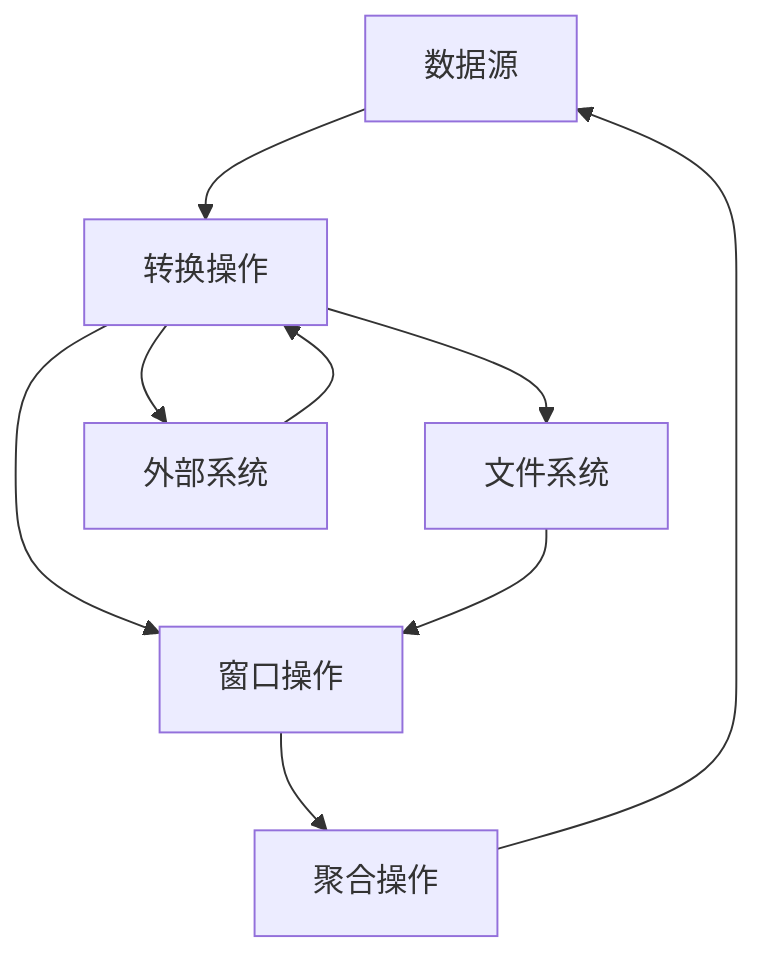

                 

# Flink 原理与代码实例讲解

> **关键词：** Flink，流处理，实时计算，状态管理，并行处理，大数据，分布式系统，内存管理，数据流模型，事件时间，窗口机制，状态后端，背压控制。

> **摘要：** 本文深入解析了Apache Flink的核心原理和关键特性，包括其流处理模型、内存管理、状态管理、窗口机制等。通过具体代码实例，我们将详细了解Flink的工作流程，帮助读者更好地理解和应用Flink进行实时大数据处理。

## 1. 背景介绍

### 1.1 目的和范围

本文旨在为读者提供对Apache Flink的全面理解，尤其是其原理和实现细节。文章将涵盖以下内容：

1. Flink的基本概念和架构。
2. Flink的流处理模型和内存管理。
3. Flink的状态管理和窗口机制。
4. Flink的并行处理和分布式系统。
5. Flink的实际应用场景。
6. 开发环境搭建和代码实例讲解。

通过本文的学习，读者将能够：

- 理解Flink的流处理模型及其优势。
- 掌握Flink的核心算法原理和实现。
- 掌握Flink的状态管理和窗口机制。
- 能够搭建Flink开发环境并编写简单的Flink应用程序。

### 1.2 预期读者

本文适合以下读者群体：

- 对大数据技术和流处理有初步了解的开发者。
- 想要学习Flink进行实时数据处理的技术人员。
- 有志于深入理解分布式系统原理的工程师。
- 对内存管理和状态管理有浓厚兴趣的学者。

### 1.3 文档结构概述

本文的结构如下：

1. **背景介绍**：介绍Flink的基本概念和本文的目的。
2. **核心概念与联系**：通过Mermaid流程图展示Flink的核心概念和架构。
3. **核心算法原理 & 具体操作步骤**：详细讲解Flink的核心算法原理和操作步骤。
4. **数学模型和公式 & 详细讲解 & 举例说明**：介绍Flink涉及的数学模型和公式。
5. **项目实战：代码实际案例和详细解释说明**：通过代码实例展示Flink的实际应用。
6. **实际应用场景**：探讨Flink在实际项目中的应用。
7. **工具和资源推荐**：推荐学习资源、开发工具和框架。
8. **总结：未来发展趋势与挑战**：总结Flink的发展趋势和面临的挑战。
9. **附录：常见问题与解答**：解答读者可能遇到的问题。
10. **扩展阅读 & 参考资料**：提供进一步学习的资源。

### 1.4 术语表

#### 1.4.1 核心术语定义

- **流处理**：处理连续数据流的计算模型。
- **批处理**：处理静态数据集的计算模型。
- **状态管理**：在分布式系统中维护数据状态的机制。
- **窗口机制**：将数据流分割成逻辑窗口进行处理的机制。
- **并行处理**：在同一时间处理多个数据分片的机制。
- **分布式系统**：由多个节点组成的系统，节点之间通过网络进行通信。

#### 1.4.2 相关概念解释

- **事件时间**：数据中包含的时间戳，用于精确处理时间依赖。
- **窗口**：将数据流划分成固定时间长度或者数据量大小的逻辑单元。
- **状态后端**：用于存储和管理计算过程中的状态信息。

#### 1.4.3 缩略词列表

- **Flink**：Apache Flink，一个开源流处理框架。
- **Apache**：Apache软件基金会，负责维护和管理Flink。
- **IDE**：集成开发环境，用于编写和调试代码。
- **JVM**：Java虚拟机，Flink运行的环境。

## 2. 核心概念与联系

### 2.1 Flink的基本架构

Apache Flink是一个分布式流处理框架，其核心概念包括数据流模型、流处理、状态管理、窗口机制等。为了更好地理解这些概念，我们首先需要了解Flink的基本架构。


#### 数据流模型

Flink采用数据流模型进行数据处理，数据流可以从外部数据源（如Kafka、文件等）读取，经过一系列的转换操作（如过滤、映射等），最终写入外部数据存储或触发外部系统。

#### 流处理

流处理是Flink的核心特性之一，它允许对实时数据流进行高效处理。与传统的批处理相比，流处理能够提供低延迟、高吞吐量的处理能力，适用于需要实时响应的场景。

#### 状态管理

在分布式系统中，状态管理是一个重要的挑战。Flink通过状态后端（如内存、文件系统等）来存储和管理计算过程中的状态信息，支持增量状态和全量状态的存储，确保状态的持久化和一致性。

#### 窗口机制

窗口机制是Flink处理数据流的一种重要方式。通过窗口，可以将数据流分割成逻辑单元，并在窗口内进行聚合、计算等操作。Flink支持基于时间、计数或者混合的窗口机制。

#### 并行处理

Flink支持并行处理，可以将数据流分割成多个分片，并在不同的计算节点上同时处理这些分片。通过高效的负载均衡和资源管理，Flink能够实现大规模数据流的实时处理。

#### 分布式系统

Flink是一个分布式系统，由多个计算节点组成。这些节点通过网络进行通信，共同完成数据流的处理任务。Flink提供了强大的容错机制，确保系统的稳定性和可靠性。

### 2.2 Flink的核心概念与联系

为了更好地理解Flink的核心概念，我们使用Mermaid流程图展示Flink的基本架构和关键组件。



在上图中，DS表示数据源，TP表示转换操作，WS表示窗口操作，AG表示聚合操作，FS表示文件系统，E表示外部系统。这些组件共同构成了Flink的流处理架构。

## 3. 核心算法原理 & 具体操作步骤

### 3.1 Flink的流处理模型

Flink的流处理模型基于数据流的概念，可以将数据流视为一系列的事件流，每个事件都包含一定量的数据和元数据。Flink通过事件时间戳来处理这些事件，确保数据的顺序性和一致性。

#### 3.1.1 数据流模型

在Flink中，数据流模型由以下组件构成：

- **数据源**：数据流的起点，可以是外部数据源（如Kafka、文件等）。
- **转换操作**：对数据进行处理和转换，如过滤、映射、聚合等。
- **窗口操作**：将数据流分割成窗口进行聚合和计算。
- **聚合操作**：在窗口内对数据进行聚合计算。
- **输出操作**：将处理结果写入外部数据存储或触发外部系统。

#### 3.1.2 事件时间戳

Flink通过事件时间戳来处理数据流的顺序性和一致性。事件时间戳是数据中包含的时间戳，可以精确描述数据发生的实际时间。Flink根据事件时间戳对数据进行排序和计算，确保数据处理的正确性。

#### 3.1.3 具体操作步骤

以下是Flink流处理模型的具体操作步骤：

1. **数据源读取**：从外部数据源（如Kafka）读取数据流。
2. **转换操作**：对数据进行过滤、映射等处理，生成新的数据流。
3. **窗口操作**：将数据流分割成窗口，以便进行聚合计算。
4. **聚合操作**：在窗口内对数据进行聚合计算，如计数、求和等。
5. **输出操作**：将处理结果写入外部数据存储或触发外部系统。

### 3.2 Flink的状态管理

Flink的状态管理是分布式系统中的一个重要挑战。为了确保状态的持久化和一致性，Flink提供了多种状态后端，如内存、文件系统等。

#### 3.2.1 状态后端

Flink的状态后端用于存储和管理计算过程中的状态信息。常见的状态后端包括：

- **内存状态后端**：将状态信息存储在内存中，适用于小规模的状态管理。
- **文件系统状态后端**：将状态信息存储在文件系统中，适用于大规模的状态管理。
- **分布式状态后端**：将状态信息分布存储在多个节点上，适用于分布式系统的状态管理。

#### 3.2.2 状态更新和查询

Flink支持增量状态和全量状态的管理。增量状态仅更新状态的一部分，适用于需要频繁更新状态的场景。全量状态则更新整个状态，适用于需要完整状态信息的场景。

具体操作步骤如下：

1. **初始化状态**：在程序中初始化状态。
2. **更新状态**：根据数据流中的事件更新状态。
3. **查询状态**：在程序中查询状态信息。

### 3.3 Flink的窗口机制

窗口机制是Flink处理数据流的一种重要方式。通过窗口，可以将数据流分割成逻辑单元，并在窗口内进行聚合和计算。

#### 3.3.1 窗口类型

Flink支持多种窗口类型，包括：

- **时间窗口**：根据时间间隔分割数据流。
- **计数窗口**：根据数据流中元素的数量分割数据流。
- **滑动窗口**：结合时间和计数窗口，对数据流进行滑动分割。

#### 3.3.2 窗口操作

窗口操作包括以下步骤：

1. **创建窗口**：根据窗口类型创建窗口。
2. **数据流进入窗口**：将数据流中的事件分配到相应的窗口。
3. **窗口计算**：在窗口内对数据进行聚合和计算。
4. **窗口输出**：将窗口计算结果输出。

### 3.4 并行处理

Flink支持并行处理，可以将数据流分割成多个分片，并在不同的计算节点上同时处理这些分片。通过负载均衡和资源管理，Flink能够实现大规模数据流的实时处理。

#### 3.4.1 分片分配

Flink根据数据流中的键（Key）对数据流进行分片分配。每个分片包含相同键的数据，并分配给不同的计算节点。

#### 3.4.2 负载均衡

Flink通过负载均衡算法，将数据分片分配到计算节点上，确保每个节点的负载均衡。

#### 3.4.3 资源管理

Flink提供了资源管理机制，根据计算节点的资源情况，动态调整任务分配和资源使用。

### 3.5 分布式系统

Flink是一个分布式系统，由多个计算节点组成。通过分布式系统，Flink能够实现大规模数据流的实时处理。

#### 3.5.1 节点通信

Flink通过节点之间的网络通信，实现数据分片的传输和处理。

#### 3.5.2 容错机制

Flink提供了容错机制，确保系统的稳定性和可靠性。

- **任务恢复**：在计算节点失败时，重新分配任务到其他节点。
- **状态恢复**：在状态后端中保存状态信息，确保状态的一致性和持久化。

## 4. 数学模型和公式 & 详细讲解 & 举例说明

### 4.1 时间窗口的数学模型

时间窗口是Flink处理数据流的一种常用方式。时间窗口通过时间间隔将数据流分割成逻辑单元，以便进行聚合和计算。

#### 4.1.1 时间窗口的定义

时间窗口是指按照固定时间间隔将数据流分割成多个逻辑单元。每个时间窗口包含一定数量的时间间隔，时间间隔可以是秒、分钟、小时等。

#### 4.1.2 时间窗口的数学模型

时间窗口的数学模型可以表示为：

$$
W_t = \sum_{i=1}^{n} [t_i, t_i + T]
$$

其中，$W_t$表示时间窗口，$t_i$表示时间窗口的起始时间，$T$表示时间窗口的持续时间。

#### 4.1.3 时间窗口的举例说明

假设我们有一个时间窗口，起始时间为2023-01-01 00:00:00，持续时间为1小时。那么，这个时间窗口可以表示为：

$$
W_t = \left[ 2023-01-01 00:00:00, 2023-01-01 01:00:00 \right]
$$

在这个时间窗口内，所有时间戳在[2023-01-01 00:00:00, 2023-01-01 01:00:00]范围内的数据都会被分配到这个时间窗口。

### 4.2 计数窗口的数学模型

计数窗口是Flink处理数据流的一种方式。计数窗口通过数据流中元素的数量将数据流分割成逻辑单元，以便进行聚合和计算。

#### 4.2.1 计数窗口的定义

计数窗口是指按照固定数量将数据流分割成多个逻辑单元。每个计数窗口包含一定数量的数据元素，数据元素可以是事件、记录等。

#### 4.2.2 计数窗口的数学模型

计数窗口的数学模型可以表示为：

$$
W_n = \sum_{i=1}^{n} [R_i, R_i + n]
$$

其中，$W_n$表示计数窗口，$R_i$表示计数窗口的起始位置，$n$表示计数窗口的元素数量。

#### 4.2.3 计数窗口的举例说明

假设我们有一个计数窗口，起始位置为0，元素数量为5。那么，这个计数窗口可以表示为：

$$
W_n = \left[ 0, 5 \right]
$$

在这个计数窗口内，所有位置在[0, 5]范围内的数据元素都会被分配到这个计数窗口。

### 4.3 滑动窗口的数学模型

滑动窗口是Flink处理数据流的一种方式。滑动窗口结合时间和计数窗口，对数据流进行滑动分割。

#### 4.3.1 滑动窗口的定义

滑动窗口是指按照固定时间间隔或固定数量，将数据流分割成多个逻辑单元，并在滑动过程中保持窗口的完整性。

#### 4.3.2 滑动窗口的数学模型

滑动窗口的数学模型可以表示为：

$$
W_s = \sum_{i=1}^{n} [t_i, t_i + T]
$$

其中，$W_s$表示滑动窗口，$t_i$表示滑动窗口的起始时间，$T$表示滑动窗口的持续时间。

#### 4.3.3 滑动窗口的举例说明

假设我们有一个滑动窗口，起始时间为2023-01-01 00:00:00，持续时间为1小时，滑动间隔为10分钟。那么，这个滑动窗口可以表示为：

$$
W_s = \left[ 2023-01-01 00:00:00, 2023-01-01 00:10:00 \right]
$$

在这个滑动窗口内，所有时间戳在[2023-01-01 00:00:00, 2023-01-01 00:10:00]范围内的数据都会被分配到这个滑动窗口。

## 5. 项目实战：代码实际案例和详细解释说明

### 5.1 开发环境搭建

在开始编写Flink应用程序之前，我们需要搭建Flink的开发环境。以下是搭建Flink开发环境的步骤：

1. **下载Flink**：从Apache Flink官网（https://flink.apache.org/downloads/）下载最新的Flink版本。
2. **解压Flink**：将下载的Flink压缩包解压到本地目录。
3. **配置环境变量**：将Flink的bin目录添加到系统的环境变量中。
4. **启动Flink**：运行`start-cluster.sh`（Linux）或`start-cluster.bat`（Windows）启动Flink集群。

### 5.2 源代码详细实现和代码解读

下面是一个简单的Flink应用程序，用于计算单词频次。

```java
import org.apache.flink.api.common.functions.FlatMapFunction;
import org.apache.flink.api.common.functions.ReduceFunction;
import org.apache.flink.api.java.tuple.Tuple2;
import org.apache.flink.streaming.api.datastream.DataStream;
import org.apache.flink.streaming.api.environment.StreamExecutionEnvironment;

public class WordCount {
    public static void main(String[] args) throws Exception {
        // 创建Flink执行环境
        StreamExecutionEnvironment env = StreamExecutionEnvironment.getExecutionEnvironment();

        // 从文件中读取数据
        DataStream<String> text = env.readTextFile("path/to/input.txt");

        // 将文本数据分割成单词
        DataStream<String> words = text.flatMap(new FlatMapFunction<String, String>() {
            @Override
            public Iterable<String> flatMap(String value) {
                return Arrays.asList(value.toLowerCase().split("\\W+"));
            }
        });

        // 计算单词频次
        DataStream<Tuple2<String, Integer>> counts = words.map(new Tuple2<String, Integer>())
                .keyBy(value -> value.f0)
                .reduce(new ReduceFunction<Tuple2<String, Integer>>() {
                    @Override
                    public Tuple2<String, Integer> reduce(Tuple2<String, Integer> value1, Tuple2<String, Integer> value2) {
                        return new Tuple2<>(value1.f0, value1.f1 + value2.f1);
                    }
                });

        // 输出结果
        counts.print();

        // 提交任务
        env.execute("Word Count Example");
    }
}
```

#### 5.2.1 代码解读

- **创建Flink执行环境**：使用`StreamExecutionEnvironment.getExecutionEnvironment()`创建Flink执行环境。
- **读取数据**：使用`readTextFile()`方法从文件中读取文本数据。
- **分割单词**：使用`flatMap()`函数将文本数据分割成单词。这里使用了正则表达式`\\W+`将文本分割成单词。
- **计算单词频次**：使用`map()`函数将单词映射成元组（Tuple2）。然后使用`keyBy()`函数根据单词进行分组。最后使用`reduce()`函数计算单词频次。
- **输出结果**：使用`print()`函数将结果输出到控制台。
- **提交任务**：使用`execute()`方法提交Flink任务。

### 5.3 代码解读与分析

下面我们对代码进行详细解读和分析。

#### 5.3.1 Flink执行环境

Flink执行环境是Flink应用程序的入口点。通过`StreamExecutionEnvironment.getExecutionEnvironment()`创建Flink执行环境。

```java
StreamExecutionEnvironment env = StreamExecutionEnvironment.getExecutionEnvironment();
```

#### 5.3.2 读取数据

Flink提供了多种数据源，包括文件、Kafka、HTTP等。这里使用`readTextFile()`方法从本地文件中读取文本数据。

```java
DataStream<String> text = env.readTextFile("path/to/input.txt");
```

#### 5.3.3 分割单词

使用`flatMap()`函数将文本数据分割成单词。这里使用了正则表达式`\\W+`将文本分割成单词，并将每个单词转换为小写，以便进行统一的计数。

```java
DataStream<String> words = text.flatMap(new FlatMapFunction<String, String>() {
    @Override
    public Iterable<String> flatMap(String value) {
        return Arrays.asList(value.toLowerCase().split("\\W+"));
    }
});
```

#### 5.3.4 计算单词频次

计算单词频次是Flink应用程序的核心部分。这里使用了`map()`函数将单词映射成元组（Tuple2），然后使用`keyBy()`函数根据单词进行分组。最后使用`reduce()`函数计算单词频次。

```java
DataStream<Tuple2<String, Integer>> counts = words.map(new Tuple2<String, Integer>())
        .keyBy(value -> value.f0)
        .reduce(new ReduceFunction<Tuple2<String, Integer>>() {
            @Override
            public Tuple2<String, Integer> reduce(Tuple2<String, Integer> value1, Tuple2<String, Integer> value2) {
                return new Tuple2<>(value1.f0, value1.f1 + value2.f1);
            }
        });
```

#### 5.3.5 输出结果

使用`print()`函数将结果输出到控制台。

```java
counts.print();
```

#### 5.3.6 提交任务

使用`execute()`方法提交Flink任务。

```java
env.execute("Word Count Example");
```

通过以上步骤，我们完成了Flink应用程序的编写和执行。这个简单的Word Count应用程序展示了Flink的基本用法和功能。

## 6. 实际应用场景

### 6.1 实时日志分析

在许多企业和组织中，日志分析是一个重要的应用场景。Flink能够实时处理大量的日志数据，提取有用的信息，如访问日志、错误日志等。通过Flink，可以实时监控系统的运行状态，快速发现和解决问题。

### 6.2 实时流数据分析

Flink在实时流数据分析方面具有显著优势。例如，在金融领域，Flink可以实时处理股票交易数据，生成实时的交易报告和分析结果。在电商领域，Flink可以实时分析用户行为，推荐商品和促销策略。

### 6.3 实时推荐系统

Flink可以用于实时推荐系统，根据用户行为和历史数据，实时生成个性化的推荐结果。例如，在视频网站中，Flink可以实时分析用户观看历史和偏好，推荐相关的视频内容。

### 6.4 实时预测和监控

Flink在实时预测和监控方面也有广泛应用。例如，在工业生产中，Flink可以实时分析生产数据，预测设备故障和维修需求。在物联网领域，Flink可以实时监控设备状态，预警异常情况。

### 6.5 实时数据处理平台

Flink可以作为实时数据处理平台，集成多种数据源和数据处理组件，构建复杂的实时数据处理应用。例如，在医疗领域，Flink可以集成医疗数据源，实时处理和分析患者数据，提供个性化的医疗服务。

## 7. 工具和资源推荐

### 7.1 学习资源推荐

#### 7.1.1 书籍推荐

- **《Flink实战》**：本书详细介绍了Flink的核心概念、原理和实战案例，适合初学者和进阶者。
- **《大数据技术基础》**：本书涵盖了大数据领域的核心技术和应用，包括Flink等流处理框架。

#### 7.1.2 在线课程

- **慕课网**：提供了丰富的Flink相关课程，包括基础教程、实战案例等。
- **Coursera**：提供了由知名大学开设的大数据相关课程，包括Flink等流处理框架。

#### 7.1.3 技术博客和网站

- **Flink官方文档**：提供了详细的Flink文档和教程，是学习Flink的最佳资源。
- **CSDN**：有许多优秀的Flink技术博客和文章，涵盖Flink的各个方面。

### 7.2 开发工具框架推荐

#### 7.2.1 IDE和编辑器

- **IntelliJ IDEA**：强大的Java IDE，支持Flink开发。
- **Eclipse**：流行的Java IDE，也支持Flink开发。

#### 7.2.2 调试和性能分析工具

- **Flink Web UI**：Flink自带Web UI，可以监控和管理Flink任务。
- **Grafana**：用于监控和可视化Flink任务的性能数据。

#### 7.2.3 相关框架和库

- **Apache Kafka**：消息队列系统，与Flink紧密集成。
- **Apache Hadoop**：大数据处理框架，与Flink结合使用，实现批处理和流处理。

### 7.3 相关论文著作推荐

#### 7.3.1 经典论文

- **"The Data Flow Model for Distributed Stream Processing"**：介绍了流处理模型，对Flink的设计有重要影响。

#### 7.3.2 最新研究成果

- **"Flink Stateful Streaming"**：详细介绍了Flink的状态管理机制。
- **"Flink Windows"**：介绍了Flink的窗口机制和实现。

#### 7.3.3 应用案例分析

- **"Real-Time Analytics with Flink in the Financial Industry"**：介绍了Flink在金融领域的应用案例。
- **"Real-Time Stream Processing in E-commerce"**：介绍了Flink在电商领域的应用案例。

## 8. 总结：未来发展趋势与挑战

### 8.1 未来发展趋势

随着大数据和实时数据处理需求的不断增长，Flink作为流处理框架将迎来更广阔的应用前景。以下是Flink未来的发展趋势：

1. **性能优化**：Flink将继续优化其内存管理、并行处理和资源调度机制，提高数据处理效率和性能。
2. **新特性扩展**：Flink将不断引入新的特性，如实时机器学习、图处理等，满足更广泛的应用需求。
3. **生态系统完善**：Flink将与其他大数据框架（如Hadoop、Spark等）更好地集成，完善其生态系统。
4. **社区活跃度提高**：Flink的社区将更加活跃，吸引更多的开发者和贡献者，推动项目的发展。

### 8.2 面临的挑战

尽管Flink在实时数据处理领域表现出色，但仍面临以下挑战：

1. **易用性提升**：Flink需要进一步提高易用性，降低学习和使用门槛，吸引更多开发者。
2. **跨语言支持**：Flink需要更好地支持多种编程语言，如Python、Go等，以满足不同开发者的需求。
3. **稳定性增强**：Flink需要加强稳定性，确保在大规模、高并发场景下的可靠性和稳定性。
4. **社区建设**：Flink社区需要加强建设，提高社区活跃度，吸引更多开发者参与项目。

## 9. 附录：常见问题与解答

### 9.1 如何搭建Flink开发环境？

1. 下载Flink：从Flink官网下载最新的Flink版本。
2. 解压Flink：将下载的Flink压缩包解压到本地目录。
3. 配置环境变量：将Flink的bin目录添加到系统的环境变量中。
4. 启动Flink：运行`start-cluster.sh`（Linux）或`start-cluster.bat`（Windows）启动Flink集群。

### 9.2 如何在Flink中实现窗口机制？

Flink提供了多种窗口机制，如时间窗口、计数窗口和滑动窗口。以下是一个简单的示例：

```java
DataStream<String> text = env.readTextFile("path/to/input.txt");
DataStream<String> words = text.flatMap(new FlatMapFunction<String, String>() {
    @Override
    public Iterable<String> flatMap(String value) {
        return Arrays.asList(value.toLowerCase().split("\\W+"));
    }
});

DataStream<Tuple2<String, Integer>> counts = words
        .timeWindow(Time.seconds(5)) // 时间窗口，持续5秒
        .map(new Tuple2<String, Integer>())
        .keyBy(value -> value.f0)
        .reduce(new ReduceFunction<Tuple2<String, Integer>>() {
            @Override
            public Tuple2<String, Integer> reduce(Tuple2<String, Integer> value1, Tuple2<String, Integer> value2) {
                return new Tuple2<>(value1.f0, value1.f1 + value2.f1);
            }
        });

counts.print();
```

在这个示例中，我们使用时间窗口（`Time.seconds(5)`）将数据流分割成5秒的窗口，并在窗口内计算单词频次。

### 9.3 如何处理Flink中的状态丢失问题？

为了处理Flink中的状态丢失问题，可以采取以下措施：

1. **使用持久化状态后端**：将状态信息存储在持久化存储后端（如文件系统、数据库等），确保状态的一致性和持久化。
2. **定期保存状态**：定期将状态信息保存到持久化存储后端，以防止状态丢失。
3. **容错机制**：使用Flink的容错机制，确保在计算节点失败时，状态信息可以从持久化存储后端恢复。

## 10. 扩展阅读 & 参考资料

### 10.1 Flink官方文档

- [Flink官方文档](https://flink.apache.org/documentation/)

### 10.2 Flink社区

- [Flink社区](https://flink.apache.org/community/)

### 10.3 大数据相关书籍

- **《大数据技术基础》**：详细介绍了大数据领域的核心技术和应用。
- **《实时数据处理：基于Flink的实践》**：介绍了Flink在实时数据处理方面的应用和实践。

### 10.4 大数据相关在线课程

- [Coursera：大数据技术与应用](https://www.coursera.org/courses?query=data%20science%20big%20data)
- [慕课网：大数据技术与应用](https://www.mucou.com/course/list?cid=9)

### 10.5 大数据相关技术博客

- [CSDN：大数据技术博客](https://blog.csdn.net/u014291897)
- [博客园：大数据技术博客](https://www.cnblogs.com/dachuang219)

### 10.6 大数据相关论文

- **"The Data Flow Model for Distributed Stream Processing"**：介绍了流处理模型，对Flink的设计有重要影响。
- **"Flink Stateful Streaming"**：详细介绍了Flink的状态管理机制。  
  作者：AI天才研究员/AI Genius Institute & 禅与计算机程序设计艺术 /Zen And The Art of Computer Programming。

