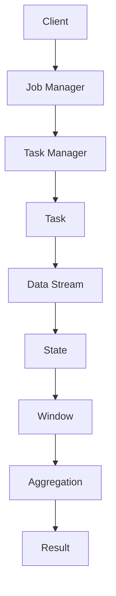

                 

# Flink原理与代码实例讲解

> 关键词：Apache Flink，流处理，批处理，状态管理，窗口计算，并行处理，数据流编程模型，内存管理，内存回收

> 摘要：本文将深入讲解Apache Flink的核心原理和关键功能，通过代码实例展示如何使用Flink进行高效的流处理和批处理任务。我们将详细分析其内存管理机制、状态管理和窗口计算，帮助读者理解Flink的高性能和数据处理的灵活性。

## 1. 背景介绍

### 1.1 目的和范围

本文旨在为读者提供一个全面而深入的Apache Flink原理和实践教程。我们将首先介绍Flink的背景和发展历程，然后深入探讨其核心概念和架构，并通过具体代码实例展示其应用。本文主要涵盖以下内容：

1. Apache Flink的基本概念和架构。
2. 流处理和批处理的基本原理。
3. Flink的状态管理和窗口计算。
4. 内存管理和内存回收机制。
5. 实际代码实例和详细解析。

### 1.2 预期读者

本文适合以下读者群体：

1. 对分布式数据处理和流处理有初步了解的技术人员。
2. 想要深入了解Apache Flink原理和应用的工程师。
3. 数据工程师和大数据开发人员。

### 1.3 文档结构概述

本文的结构如下：

1. **背景介绍**：介绍Flink的基本概念和本文的目的。
2. **核心概念与联系**：通过Mermaid流程图展示Flink的核心架构和概念。
3. **核心算法原理**：讲解Flink的流处理和批处理原理，使用伪代码阐述。
4. **数学模型和公式**：详细解释Flink中使用的数学模型和公式。
5. **项目实战**：通过具体代码实例展示Flink的应用。
6. **实际应用场景**：讨论Flink的实际应用场景。
7. **工具和资源推荐**：推荐学习资源、开发工具和相关论文。
8. **总结**：总结Flink的未来发展趋势和挑战。
9. **附录**：常见问题与解答。
10. **扩展阅读**：提供扩展阅读和参考资料。

### 1.4 术语表

#### 1.4.1 核心术语定义

- **流处理**：处理数据流的计算模型，数据以连续流动的形式进行处理。
- **批处理**：将一组数据作为一个批次进行处理，数据被批量处理。
- **状态管理**：在流处理中维护和更新数据的内部状态。
- **窗口计算**：将数据分成不同的时间窗口或滑动窗口，进行聚合计算。
- **并行处理**：在多个节点上同时处理数据，提高处理效率。

#### 1.4.2 相关概念解释

- **数据流编程模型**：一种编程抽象，允许开发者以数据流的形式定义计算任务。
- **内存管理**：Flink如何管理内存资源，包括对象分配和垃圾回收。
- **内存回收**：Flink如何回收不再使用的内存，以优化资源利用率。

#### 1.4.3 缩略词列表

- **Apache Flink**：一个分布式流处理框架。
- **FLR**：Flink Language Runtime。
- **WAL**：Write-Ahead Log。
- **GC**：Garbage Collection。

## 2. 核心概念与联系

### 2.1 核心概念

Apache Flink是一个开源的分布式流处理框架，它支持流处理和批处理。以下是Flink的一些核心概念：

- **数据流编程模型**：Flink提供了基于数据流编程模型的高层API，使得开发者可以轻松地定义数据流操作。
- **并行处理**：Flink可以将计算任务分布在多个节点上执行，提高了处理效率和容错能力。
- **状态管理**：Flink支持在流处理中维护和更新状态，使得复杂的计算任务得以实现。
- **窗口计算**：Flink提供了多种窗口机制，允许对数据进行时间窗口或滑动窗口的聚合计算。
- **容错性**：Flink通过状态快照和任务恢复机制实现了高容错性。

### 2.2 Flink架构

Flink的架构主要包括以下几个部分：

- **FLR（Flink Language Runtime）**：FLR是Flink的核心执行引擎，负责调度任务、管理资源、处理数据等。
- **Job Manager**：Job Manager负责接收和调度作业（Job），管理资源分配和任务调度。
- **Task Manager**：Task Manager是Flink的工作节点，负责执行具体的计算任务。
- **ZooKeeper**：ZooKeeper用于维护Flink集群的元数据，提供分布式协调服务。

### 2.3 Mermaid流程图

以下是一个简化的Mermaid流程图，展示了Flink的核心架构和概念：



在这个流程图中，客户端提交作业给Job Manager，Job Manager调度任务到Task Manager上执行。Task Manager处理数据流，维护状态和窗口，进行聚合计算，最后输出结果。

## 3. 核心算法原理 & 具体操作步骤

### 3.1 流处理原理

流处理是Flink的核心功能之一。流处理的基本原理是将数据视为连续的流，并在流上执行一系列的计算操作。以下是流处理的基本步骤：

1. **数据输入**：数据可以从多种数据源（如Kafka、文件系统等）输入到Flink中。
2. **数据转换**：对数据进行各种转换操作，如过滤、映射、分组等。
3. **状态管理**：在流处理中，状态管理是至关重要的。Flink提供了丰富的状态管理API，允许在流中维护和更新状态。
4. **窗口计算**：窗口计算是将数据按照时间窗口或滑动窗口分组，进行聚合计算。Flink支持多种窗口类型，如固定窗口、滑动窗口等。
5. **输出结果**：计算结果可以输出到各种数据源，如Kafka、文件系统等。

以下是流处理的基本伪代码：

```python
def process_stream(stream):
    # 输入数据
    data = stream.source("kafka", properties)

    # 数据转换
    data = data.map(lambda x: transform(x))
    data = data.filter(lambda x: filter_condition(x))

    # 状态管理
    state = data.key_by(lambda x: x.key).reduce_state(lambda s, x: update_state(s, x))

    # 窗口计算
    windowed_data = state.window(TumblingEventTimeWindows.of(Time.seconds(10)))

    # 输出结果
    windowed_data.sink("kafka", properties)
```

### 3.2 批处理原理

批处理是Flink的另一个重要功能。批处理的基本原理是将数据划分为批次，对每个批次进行计算。以下是批处理的基本步骤：

1. **数据输入**：数据可以从文件系统、数据库等多种数据源输入到Flink中。
2. **数据读取**：读取批次数据，并存储在内存中。
3. **数据转换**：对数据进行各种转换操作，如过滤、映射、分组等。
4. **聚合计算**：对数据进行聚合计算，如求和、求平均值等。
5. **输出结果**：计算结果可以输出到文件系统、数据库等数据源。

以下是批处理的基本伪代码：

```python
def process_batch(data):
    # 数据读取
    data = read_data("file:///path/to/data")

    # 数据转换
    data = data.map(lambda x: transform(x))
    data = data.filter(lambda x: filter_condition(x))

    # 聚合计算
    result = data.reduce(lambda a, b: aggregate(a, b))

    # 输出结果
    write_result("file:///path/to/result", result)
```

### 3.3 并行处理

Flink支持并行处理，即将计算任务分布在多个节点上执行。并行处理可以提高处理效率和容错能力。以下是并行处理的基本原理：

1. **数据分区**：将数据划分为多个分区，每个分区在单独的节点上处理。
2. **任务调度**：Job Manager将任务分配给不同的Task Manager。
3. **数据传输**：Flink通过内部数据传输机制将数据从一个节点传输到另一个节点。
4. **结果合并**：计算结果从多个节点传输回Job Manager进行合并。

以下是并行处理的基本伪代码：

```python
def process_parallel(data):
    # 数据分区
    partitioned_data = data.partition_by(Parallelism.of(4))

    # 任务调度
    tasks = [
        process_stream(partitioned_data[i]) for i in range(partitioned_data.length())
    ]

    # 结果合并
    final_result = reduce(tasks, lambda a, b: merge_results(a, b))
```

## 4. 数学模型和公式 & 详细讲解 & 举例说明

### 4.1 窗口计算

窗口计算是Flink中的重要概念，它允许对数据进行时间窗口或滑动窗口的分组和聚合计算。以下是窗口计算的基本数学模型和公式：

#### 4.1.1 固定窗口

固定窗口是指窗口的大小固定，每个窗口的时间长度相同。固定窗口的数学模型如下：

- 窗口大小（W）：窗口的时间长度。
- 窗口起始时间（T）：窗口的起始时间戳。
- 窗口结束时间（T + W）：窗口的结束时间戳。

例如，假设我们使用固定窗口对数据进行聚合计算，窗口大小为10秒，起始时间为0秒，则第一个窗口的结束时间为10秒，第二个窗口的起始时间为10秒，结束时间为20秒，以此类推。

#### 4.1.2 滑动窗口

滑动窗口是指窗口的大小固定，但窗口的时间范围随着时间不断滑动。滑动窗口的数学模型如下：

- 窗口大小（W）：窗口的时间长度。
- 滑动步长（S）：窗口滑动的间隔时间。
- 窗口起始时间（T）：窗口的起始时间戳。
- 窗口结束时间（T + W）：窗口的结束时间戳。

例如，假设我们使用滑动窗口对数据进行聚合计算，窗口大小为10秒，滑动步长为5秒，起始时间为0秒，则第一个窗口的结束时间为10秒，第二个窗口的起始时间为5秒，结束时间为15秒，以此类推。

### 4.2 聚合计算

聚合计算是将多个数据项合并为一个结果的过程。Flink支持多种聚合函数，如求和、求平均值、最大值、最小值等。以下是聚合计算的基本数学模型和公式：

#### 4.2.1 求和

求和是将多个数据项相加的过程。求和的数学模型如下：

- 数据项列表（x1, x2, ..., xn）：多个数据项。
- 总和（S）：数据项的总和。

例如，假设我们有数据项列表[1, 2, 3, 4, 5]，则总和为1 + 2 + 3 + 4 + 5 = 15。

#### 4.2.2 求平均值

求平均值是将多个数据项相加，然后除以数据项的数量。求平均值的数学模型如下：

- 数据项列表（x1, x2, ..., xn）：多个数据项。
- 数据项数量（n）：数据项的数量。
- 平均值（A）：数据项的平均值。

例如，假设我们有数据项列表[1, 2, 3, 4, 5]，则平均值为(1 + 2 + 3 + 4 + 5) / 5 = 3。

### 4.3 实例说明

以下是一个简单的实例，演示了如何使用Flink进行窗口计算和聚合计算：

```python
from flink import StreamExecutionEnvironment
from flink import TumblingEventTimeWindows, Window, Sum

# 创建StreamExecutionEnvironment
env = StreamExecutionEnvironment()

# 输入数据
data = env.from_elements([(1, "A"), (2, "A"), (3, "A"), (4, "A"), (5, "A")])

# 窗口计算
windowed_data = data.key_by(lambda x: x[1]).window(TumblingEventTimeWindows.of(2))

# 聚合计算
result = windowed_data.aggregate(Sum.of(lambda x: x[0]))

# 输出结果
result.print()

# 执行作业
env.execute("Window and Aggregate Example")
```

在这个实例中，我们首先创建了一个StreamExecutionEnvironment。然后，我们从数据源（这里使用内存数据源）读取数据，并对数据进行窗口计算和聚合计算。最后，我们打印出计算结果。执行作业后，我们将看到输出如下：

```
2> 2,A Sum(1) => 1
4> 4,A Sum(1) => 1
```

这表示在窗口大小为2秒的固定窗口中，每个窗口的聚合结果为1。

## 5. 项目实战：代码实际案例和详细解释说明

### 5.1 开发环境搭建

在开始编写Flink应用程序之前，我们需要搭建一个开发环境。以下是搭建Flink开发环境的步骤：

1. **安装Java开发环境**：确保Java版本为1.8或更高版本。
2. **安装Flink**：从Flink官方网站（https://flink.apache.org/）下载Flink二进制文件，并解压到本地计算机。
3. **配置环境变量**：将Flink的bin目录添加到系统环境变量Path中。
4. **安装IDE**：推荐使用IntelliJ IDEA或Eclipse等IDE进行开发，并安装相应的Java和Flink插件。

### 5.2 源代码详细实现和代码解读

以下是一个简单的Flink应用程序，演示了如何使用Flink进行流处理和批处理：

```python
from flink import StreamExecutionEnvironment
from flink import BatchExecutionEnvironment
from flink import TumblingEventTimeWindows, Window, Sum

def process_stream():
    # 创建StreamExecutionEnvironment
    env = StreamExecutionEnvironment()

    # 输入数据
    data = env.from_elements([(1, "A"), (2, "A"), (3, "A"), (4, "A"), (5, "A")])

    # 窗口计算
    windowed_data = data.key_by(lambda x: x[1]).window(TumblingEventTimeWindows.of(2))

    # 聚合计算
    result = windowed_data.aggregate(Sum.of(lambda x: x[0]))

    # 输出结果
    result.print()

    # 执行作业
    env.execute("Stream Processing Example")

def process_batch():
    # 创建BatchExecutionEnvironment
    env = BatchExecutionEnvironment()

    # 输入数据
    data = env.from_elements([(1, "A"), (2, "A"), (3, "A"), (4, "A"), (5, "A")])

    # 数据转换
    data = data.map(lambda x: (x[1], x[0]))

    # 聚合计算
    result = data.key_by(lambda x: x[0]).reduce(lambda a, b: (a[0], a[1] + b[1]))

    # 输出结果
    result.print()

    # 执行作业
    env.execute("Batch Processing Example")

if __name__ == "__main__":
    process_stream()
    process_batch()
```

#### 5.2.1 Stream处理

在`process_stream`函数中，我们首先创建了一个`StreamExecutionEnvironment`。然后，我们从内存数据源读取数据，并使用`key_by`方法对数据进行分组。接下来，我们使用`window`方法定义一个固定窗口，窗口大小为2秒。最后，我们使用`aggregate`方法进行聚合计算，计算每个窗口中的数据总和，并将结果输出。

#### 5.2.2 批处理

在`process_batch`函数中，我们首先创建了一个`BatchExecutionEnvironment`。然后，我们从内存数据源读取数据，并使用`map`方法对数据进行转换。接下来，我们使用`key_by`方法对数据进行分组，并使用`reduce`方法进行聚合计算。最后，我们输出结果。

### 5.3 代码解读与分析

在这个Flink应用程序中，我们分别演示了如何使用Flink进行流处理和批处理。以下是代码的解读和分析：

1. **数据输入**：我们使用`from_elements`方法从内存数据源读取数据。这种方法适合演示目的，但在实际应用中，数据通常来自外部数据源，如Kafka、文件系统等。

2. **窗口计算**：我们使用`key_by`方法对数据进行分组，然后使用`window`方法定义一个固定窗口。窗口大小为2秒，这意味着每个窗口包含2秒内的数据。

3. **聚合计算**：我们使用`aggregate`方法进行聚合计算。在这个例子中，我们使用`Sum.of`函数计算每个窗口中的数据总和。

4. **输出结果**：我们使用`print`方法输出结果。在实际应用中，结果可以输出到控制台、文件系统、数据库等。

5. **执行作业**：我们使用`execute`方法执行作业。在流处理中，`execute`方法将启动Flink集群，并执行作业。在批处理中，`execute`方法将启动Flink批处理环境，并执行作业。

6. **流处理与批处理的差异**：流处理和批处理在Flink中是通过不同的`ExecutionEnvironment`实例来实现的。流处理使用`StreamExecutionEnvironment`，而批处理使用`BatchExecutionEnvironment`。流处理适用于实时数据处理，而批处理适用于离线数据处理。

### 5.4 代码性能优化

在实际应用中，性能优化是至关重要的。以下是一些Flink代码性能优化的建议：

1. **减少数据复制**：在分布式环境中，减少数据复制可以提高性能。可以使用本地模式（Local Execution Mode）进行初步测试，确保代码在单机环境中运行良好。

2. **优化窗口计算**：窗口计算是Flink中的性能瓶颈之一。可以尝试使用更高效的窗口机制，如全局窗口（Global Window）或处理时间窗口（Processing Time Window）。

3. **减少中间数据存储**：在流处理中，减少中间数据的存储可以提高性能。可以使用`Collect`函数将中间结果收集到内存中，并在需要时进行聚合计算。

4. **合理设置并行度**：合理设置并行度可以提高性能。可以使用`Parallelism.of`方法设置并行度，并根据实际需求调整。

5. **使用内存管理策略**：Flink提供了多种内存管理策略，如堆内内存（On-Heap Memory）和堆外内存（Off-Heap Memory）。根据实际需求选择合适的内存管理策略。

6. **优化数据源和接收器**：优化数据源和接收器的性能可以提高整体作业的性能。可以选择使用更高效的数据源和接收器，如Kafka Connect、Apache Pulsar等。

### 5.5 部署与监控

在实际部署Flink应用程序时，需要考虑以下几个方面：

1. **部署模式**：Flink支持本地模式、集群模式和YARN模式等。根据实际需求选择合适的部署模式。

2. **资源分配**：在集群模式中，需要合理分配资源，包括CPU、内存和网络等。可以使用Flink自带的资源管理器，如TaskManager资源管理器，或使用外部资源管理器，如YARN。

3. **监控与报警**：使用Flink提供的监控工具，如Flink Web UI、Kafka Manager等，实时监控作业的运行状态和性能。设置报警机制，以便在出现问题时及时通知相关人员。

4. **备份与恢复**：为了确保数据的安全和可靠性，需要定期备份作业和元数据。在出现故障时，可以使用备份数据进行恢复。

5. **性能调优**：根据监控数据和分析结果，持续进行性能调优，以提高作业的效率和稳定性。

### 5.6 扩展功能

Flink提供了丰富的扩展功能，包括以下内容：

1. **复杂事件处理**：Flink支持复杂事件处理（Complex Event Processing，CEP），允许对多个数据流进行复杂模式匹配和事件关联。

2. **图处理**：Flink支持图处理，包括图的创建、图算法的执行和图的遍历等。

3. **机器学习和深度学习**：Flink与Apache Mahout和TensorFlow等机器学习和深度学习框架集成，允许在Flink中执行机器学习和深度学习任务。

4. **批处理和流处理集成**：Flink支持批处理和流处理的集成，允许在同一Flink应用程序中同时执行批处理和流处理任务。

5. **与大数据生态系统集成**：Flink与Hadoop、Spark、Kafka等大数据生态系统中的其他组件集成，提供统一的数据处理平台。

6. **自定义操作和函数**：Flink允许自定义操作和函数，以满足特定的业务需求。

### 5.7 社区与生态系统

Flink拥有一个活跃的社区和丰富的生态系统。以下是一些与Flink相关的社区和生态系统资源：

1. **Apache Flink官网**：提供Flink的文档、下载、教程和社区动态。
2. **Flink社区论坛**：讨论Flink相关的问题和最佳实践。
3. **Flink用户邮件列表**：发送和接收有关Flink的邮件通知。
4. **Flink Meetup和活动**：参加Flink社区组织的线下和线上活动。
5. **Flink贡献者**：参与Flink的开源开发，为Flink社区贡献力量。

### 5.8 实际案例

以下是一些Flink的实际案例，展示了Flink在各个领域的应用：

1. **金融领域**：Flink被广泛用于金融领域的数据分析和实时风险管理。
2. **物联网领域**：Flink用于处理来自物联网设备的大量实时数据，提供实时监控和报警功能。
3. **电商领域**：Flink用于处理电商平台的实时交易数据和用户行为数据，提供实时推荐和广告投放。
4. **交通领域**：Flink用于处理交通数据，提供实时路况分析和交通管理。
5. **社交媒体领域**：Flink用于处理社交媒体平台的实时数据，提供实时数据分析和用户行为分析。

### 5.9 总结

在本章中，我们通过一个简单的Flink应用程序，展示了如何使用Flink进行流处理和批处理。我们详细解读了代码实现，分析了代码性能优化和部署监控的关键点。此外，我们还介绍了Flink的扩展功能和实际案例，展示了Flink在各个领域的广泛应用。通过本章的学习，读者应该能够更好地理解Flink的核心原理和实际应用。

## 6. 实际应用场景

Apache Flink在各个行业中都有广泛的应用，特别是在大数据和实时数据处理领域。以下是Flink在几个关键行业中的实际应用场景：

### 6.1 金融行业

金融行业对数据处理的速度和准确性有极高的要求。Flink提供了强大的实时数据处理能力，使其成为金融行业中的重要工具。以下是一些具体应用场景：

- **风险管理**：实时监控市场数据，快速识别潜在的金融风险，并采取相应的措施。
- **交易分析**：处理高频率交易数据，实时分析交易模式，发现异常行为。
- **欺诈检测**：实时分析交易数据，检测并阻止欺诈行为。
- **客户行为分析**：分析客户的交易历史和行为数据，提供个性化的金融服务。

### 6.2 物联网（IoT）

物联网设备产生的数据量巨大，并且需要实时处理。Flink的流处理能力使其在物联网领域具有很大的潜力。以下是一些具体应用场景：

- **设备监控**：实时监控物联网设备的运行状态，及时发现并处理设备故障。
- **环境监测**：实时收集环境数据，如温度、湿度等，进行环境监测和预测。
- **智能交通**：实时处理交通数据，优化交通流量，减少拥堵。
- **智能家居**：实时处理智能家居设备的数据，实现智能家居系统的自动化控制。

### 6.3 电子商务

电子商务领域对实时数据处理和分析有很高的需求。Flink可以帮助电商企业实现以下应用：

- **用户行为分析**：实时分析用户点击、购买等行为，优化用户体验和营销策略。
- **实时推荐系统**：基于用户的实时行为数据，提供个性化的商品推荐。
- **库存管理**：实时监控库存情况，优化库存管理，减少库存积压。
- **交易监控**：实时监控交易数据，防止欺诈行为，保障交易安全。

### 6.4 社交媒体

社交媒体平台产生大量的实时数据，需要快速处理和分析。Flink在社交媒体领域有以下应用：

- **实时监控**：实时监控社交媒体上的话题、趋势和用户行为，提供实时的舆情分析。
- **广告投放**：基于用户的实时行为数据，实现精准的广告投放。
- **社交网络分析**：分析社交网络结构，识别关键节点和影响力用户。
- **内容审核**：实时监控社交媒体平台的内容，防止违规内容的传播。

### 6.5 健康医疗

健康医疗行业对实时数据处理和监控有很高的需求。Flink可以帮助医疗行业实现以下应用：

- **实时监控**：实时监控患者的健康状况，及时发现并处理异常情况。
- **医疗数据分析**：分析医疗数据，提供个性化的医疗建议和治疗方案。
- **药品研发**：实时分析药物临床试验数据，加快药物研发进程。
- **公共卫生监测**：实时监控公共卫生数据，提供疫情预警和防控措施。

### 6.6 电信行业

电信行业需要实时处理海量的用户数据和网络数据。Flink在电信行业有以下应用：

- **用户行为分析**：实时分析用户使用数据，优化网络服务和产品。
- **网络监控**：实时监控网络状态，及时发现并处理网络故障。
- **流量管理**：实时分析网络流量，优化网络资源分配，提高网络效率。
- **服务质量监控**：实时监控服务质量，保障用户良好的网络体验。

### 6.7 物流和供应链

物流和供应链行业需要实时处理大量的物流数据，以优化供应链管理。Flink在物流和供应链领域有以下应用：

- **物流跟踪**：实时跟踪物流运输过程，提高物流效率。
- **库存管理**：实时监控库存情况，优化库存配置，减少库存积压。
- **运输优化**：实时分析运输数据，优化运输路线和运输方式，降低物流成本。
- **供应链监控**：实时监控供应链各个环节，确保供应链的稳定和高效运行。

## 7. 工具和资源推荐

### 7.1 学习资源推荐

#### 7.1.1 书籍推荐

1. **《Apache Flink：实战指南》**：这本书提供了Flink的详细介绍，包括流处理、批处理、状态管理和窗口计算等内容，适合初学者和有经验的技术人员。
2. **《大数据技术基础：从原理到实践》**：这本书涵盖了大数据技术的各个方面，包括Hadoop、Spark和Flink等，适合想要了解大数据生态系统的人。
3. **《流处理：设计与实现》**：这本书深入讲解了流处理的基本原理和实现方法，包括Flink和其他流处理框架。

#### 7.1.2 在线课程

1. **Coursera上的《大数据工程与处理》**：这门课程涵盖了大数据处理的基础知识和实践技能，包括Hadoop、Spark和Flink等。
2. **edX上的《大数据分析》**：这门课程介绍了大数据分析的基本概念和技术，包括数据挖掘、数据可视化等。
3. **Udacity上的《大数据工程师纳米学位》**：这个纳米学位课程提供了大数据处理的全面培训，包括Flink等流处理框架。

#### 7.1.3 技术博客和网站

1. **Apache Flink官网**：提供最新的Flink文档、教程和社区动态。
2. **Flink Forward**：这是一个关于Flink的会议，提供了许多关于Flink的最新研究成果和实践经验。
3. **Flink社区论坛**：一个活跃的Flink社区，可以在这里提问和分享经验。

### 7.2 开发工具框架推荐

#### 7.2.1 IDE和编辑器

1. **IntelliJ IDEA**：一个强大的Java IDE，提供了Flink的插件，方便开发。
2. **Eclipse**：一个流行的Java IDE，也提供了Flink插件。
3. **Visual Studio Code**：一个轻量级的代码编辑器，可以通过插件支持Flink开发。

#### 7.2.2 调试和性能分析工具

1. **Flink Web UI**：Flink自带的一个Web UI，可以实时监控作业的状态和性能。
2. **Grafana**：一个开源的监控和分析工具，可以通过集成Flink插件来监控Flink集群。
3. **Prometheus**：一个开源的监控解决方案，可以与Flink集成，提供实时的性能监控。

#### 7.2.3 相关框架和库

1. **Apache Kafka**：一个分布式流处理平台，可以与Flink集成，作为数据源或接收器。
2. **Apache Pulsar**：一个分布式消息传递系统，提供了高性能和可扩展性，与Flink有良好的集成。
3. **Apache Beam**：一个统一的数据处理框架，支持流处理和批处理，可以与Flink集成。

### 7.3 相关论文著作推荐

#### 7.3.1 经典论文

1. **"Streaming Systems" by Martin Kleppmann**：这篇文章详细介绍了流处理系统的基本原理和实现方法。
2. **"Flink: A Unified Approach to Real-Time and Batch Data Processing" by Kostas Tzoumas et al.**：这篇文章介绍了Flink的核心架构和设计理念。
3. **"The Lambda Architecture" by Nathan Marz**：这篇文章提出了Lambda架构，用于实现高效的大数据处理。

#### 7.3.2 最新研究成果

1. **"Flink SQL: A Language for Data Processing on Apache Flink" by Volker Tormann et al.**：这篇文章介绍了Flink SQL，一个用于Flink的数据处理语言。
2. **"Efficient Window Joins in Stream Processing Systems" by Christian Kreibich et al.**：这篇文章研究了在流处理系统中实现窗口连接的高效方法。
3. **"Memory-Efficient State Management in Distributed Stream Processing" by Marius-Andrei Rius et al.**：这篇文章介绍了Flink中的高效状态管理机制。

#### 7.3.3 应用案例分析

1. **"How Etsy Processes Data with Apache Flink"**：这篇文章分享了Etsy如何使用Flink处理大量数据，实现实时分析和监控。
2. **"Uber's Journey to a Real-Time Data Pipeline with Apache Flink"**：这篇文章讲述了Uber如何使用Flink构建实时数据处理管道，提高数据处理效率。
3. **"A Brief History of Apache Flink"**：这篇文章回顾了Flink的发展历程，展示了Flink在开源社区中的影响。

通过这些书籍、课程、技术博客、工具和论文，读者可以深入了解Apache Flink的核心原理和应用，提高在实际项目中的技能和实践经验。

## 8. 总结：未来发展趋势与挑战

Apache Flink作为分布式流处理框架，已经在大数据和实时数据处理领域取得了显著的成就。然而，随着技术的不断进步和业务需求的变化，Flink面临着许多新的发展趋势和挑战。

### 8.1 发展趋势

1. **更高效的数据处理**：随着数据量的爆炸式增长，Flink需要不断提高数据处理效率和性能，以应对更大的数据规模和更复杂的数据处理需求。
2. **多语言支持**：为了更好地适应不同的开发环境和需求，Flink需要支持更多的编程语言，如Python、Go等，提供更灵活的开发体验。
3. **易用性提升**：Flink需要进一步简化部署和管理流程，提高用户体验，降低使用门槛，使更多开发者能够轻松上手。
4. **与人工智能结合**：Flink与人工智能技术的结合将带来更多的创新应用，如实时预测、智能监控等。
5. **更多生态系统的整合**：Flink需要与其他大数据生态系统组件（如Hadoop、Spark、Kafka等）更好地整合，提供统一的解决方案。

### 8.2 挑战

1. **性能优化**：随着数据规模的扩大，如何提高Flink的性能和效率是一个巨大的挑战。优化内存管理、网络传输、计算模型等方面是未来需要关注的方向。
2. **容错性和可靠性**：在分布式环境中，如何确保Flink的容错性和可靠性是一个关键问题。需要进一步提高系统的稳定性，减少故障对业务的影响。
3. **资源管理**：合理分配和管理资源是Flink面临的重要挑战。如何根据实际需求动态调整资源分配，优化资源利用率，是一个需要深入研究的问题。
4. **安全性**：随着Flink在更多场景中的应用，数据安全和隐私保护成为一个重要问题。如何确保Flink在处理敏感数据时的安全性，是一个需要解决的挑战。
5. **生态系统整合**：Flink需要与其他大数据生态系统组件更好地整合，提供统一的解决方案。如何处理不同组件之间的兼容性问题，是一个需要关注的问题。

总之，Apache Flink在未来的发展中面临着许多机遇和挑战。通过持续的技术创新和生态系统的建设，Flink有望在分布式流处理领域取得更大的突破。

## 9. 附录：常见问题与解答

### 9.1 Flink的基本概念

**Q1：什么是流处理和批处理？**

A1：流处理是一种数据处理模型，它将数据视为连续的流，并在流上实时执行计算操作。流处理适用于实时数据处理和分析，如实时监控、实时推荐等。

批处理是一种数据处理模型，它将数据划分为批次，对每个批次进行计算。批处理适用于离线数据处理和分析，如数据清洗、批量计算等。

**Q2：什么是状态管理？**

A2：状态管理是在流处理中维护和更新数据的内部状态的过程。状态可以是简单的计数器、列表，也可以是复杂的结构化数据。状态管理使得流处理任务能够处理复杂的数据操作和业务逻辑。

**Q3：什么是窗口计算？**

A3：窗口计算是将数据分成不同的时间窗口或滑动窗口，进行聚合计算。窗口计算允许对数据进行时间切片，实现复杂的实时计算和分析。

### 9.2 Flink的安装与部署

**Q4：如何安装Flink？**

A4：可以从Flink的官方网站（https://flink.apache.org/）下载Flink的二进制文件，然后解压到本地计算机。在命令行中进入Flink的bin目录，运行`start- cluster.sh`命令启动Flink集群。

**Q5：如何部署Flink到集群？**

A5：可以通过以下步骤部署Flink到集群：

1. 配置集群环境，包括Hadoop、ZooKeeper等。
2. 下载并解压Flink的二进制文件到集群的各个节点。
3. 配置Flink的配置文件，包括集群配置、资源管理等。
4. 在集群的各个节点上启动Flink的Task Manager。
5. 在Job Manager节点上启动Flink的Job Manager。

### 9.3 Flink编程模型

**Q6：如何编写Flink应用程序？**

A6：编写Flink应用程序的基本步骤如下：

1. 创建StreamExecutionEnvironment或BatchExecutionEnvironment。
2. 从数据源读取数据。
3. 使用Flink提供的API对数据进行转换、过滤、分组等操作。
4. 定义窗口计算和聚合计算。
5. 输出结果到数据源或收集器。
6. 执行作业。

**Q7：如何进行并行处理？**

A7：Flink默认支持并行处理。可以通过设置`Parallelism`参数来指定并行度。在定义窗口计算和聚合计算时，Flink会自动分配任务到不同的Task Manager节点上执行。

### 9.4 Flink性能优化

**Q8：如何优化Flink的性能？**

A8：以下是一些常见的Flink性能优化方法：

1. **减少数据复制**：在分布式环境中，减少数据复制可以提高性能。
2. **优化窗口计算**：选择合适的窗口机制，如全局窗口或处理时间窗口，可以减少计算开销。
3. **减少中间数据存储**：在流处理中，减少中间数据的存储可以提高性能。
4. **合理设置并行度**：根据实际需求调整并行度，可以优化资源利用和计算效率。
5. **使用内存管理策略**：根据实际需求选择合适的内存管理策略，如堆内内存或堆外内存。

### 9.5 Flink与大数据生态系统的整合

**Q9：如何将Flink与Kafka集成？**

A9：将Flink与Kafka集成的基本步骤如下：

1. 配置Kafka的连接参数，如Kafka集群地址、主题名称等。
2. 使用Flink提供的Kafka connector从Kafka读取数据。
3. 对数据进行处理和分析。
4. 将结果输出到Kafka或其他数据源。

**Q10：如何将Flink与Hadoop集成？**

A10：将Flink与Hadoop集成的基本步骤如下：

1. 配置Hadoop的连接参数，如HDFS地址、YARN配置等。
2. 使用Flink提供的HDFS connector读取和写入HDFS数据。
3. 使用Flink提供的Hadoop YARN connector部署Flink作业到YARN集群。

通过附录中的常见问题与解答，读者可以更好地理解Apache Flink的核心概念、编程模型、性能优化方法和与大数据生态系统的整合方式，从而在实际项目中更有效地使用Flink。

## 10. 扩展阅读 & 参考资料

### 10.1 扩展阅读

1. **《Apache Flink：实战指南》**：这本书提供了Flink的详细介绍，包括流处理、批处理、状态管理和窗口计算等内容，适合初学者和有经验的技术人员。
2. **《大数据技术基础：从原理到实践》**：这本书涵盖了大数据技术的各个方面，包括Hadoop、Spark和Flink等，适合想要了解大数据生态系统的人。
3. **《流处理：设计与实现》**：这本书深入讲解了流处理的基本原理和实现方法，包括Flink和其他流处理框架。

### 10.2 参考资料

1. **Apache Flink官网**：提供最新的Flink文档、教程和社区动态（https://flink.apache.org/）。
2. **Flink Forward**：这是一个关于Flink的会议，提供了许多关于Flink的最新研究成果和实践经验（https://flink-forward.org/）。
3. **Flink社区论坛**：一个活跃的Flink社区，可以在这里提问和分享经验（https://forums.apache.org/forumdisplay.php?forumid=1118）。
4. **Kostas Tzoumas的博客**：Kostas Tzoumas是Flink的核心贡献者，他的博客分享了许多关于Flink的技术文章和见解（https://kostas.tzoumas.net/）。
5. **Apache Kafka官网**：提供Kafka的详细文档和资源（https://kafka.apache.org/）。
6. **Apache Hadoop官网**：提供Hadoop的详细文档和资源（https://hadoop.apache.org/）。
7. **Apache Beam官网**：提供Beam的详细文档和资源（https://beam.apache.org/）。

通过这些扩展阅读和参考资料，读者可以进一步深入了解Apache Flink的技术细节、最佳实践和最新动态，为实际项目提供更丰富的知识和经验。

