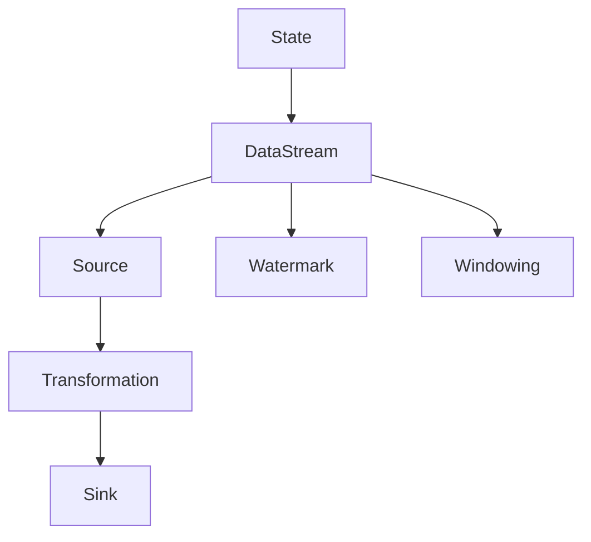
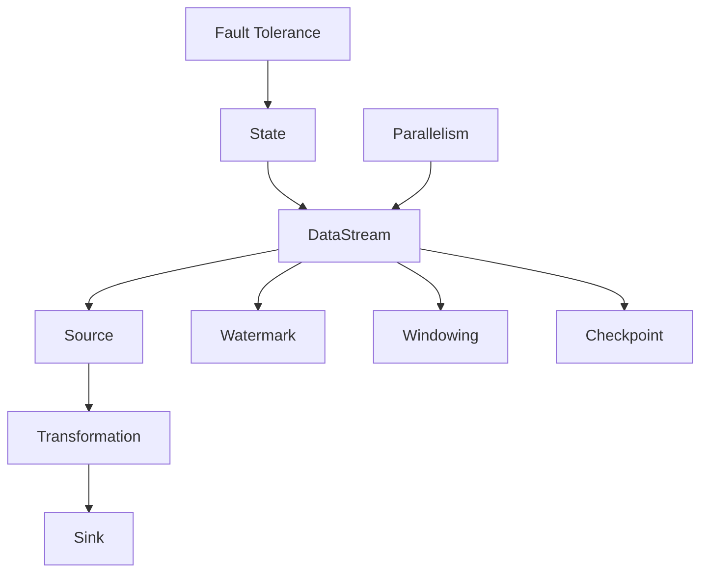

                 

# Flink流处理框架原理与代码实例讲解

> **关键词：** Apache Flink, 流处理, 实时计算, 数据处理框架, 批处理, Windowing

> **摘要：** 本文将深入讲解Apache Flink这一领先的分布式流处理框架的核心原理，包括其架构设计、核心算法、数学模型等，并通过代码实例详细展示Flink的实际应用，旨在帮助读者全面理解和掌握Flink的使用方法及其优势。文章结构将包括背景介绍、核心概念与联系、核心算法原理与操作步骤、数学模型与公式、项目实战、实际应用场景、工具和资源推荐以及未来发展趋势与挑战等部分。

## 1. 背景介绍

### 1.1 目的和范围

本文的目标是介绍Apache Flink流处理框架的基本原理和应用，使读者能够深入了解Flink的设计思想、架构和核心算法，并通过实际代码实例加深理解。文章将覆盖以下内容：

- Flink的历史、发展和应用场景
- Flink的核心概念和架构
- Flink的流处理算法和数学模型
- Flink的实际项目应用
- Flink的学习资源和工具

### 1.2 预期读者

本文适合以下读者群体：

- 对分布式数据处理和流处理感兴趣的工程师和学者
- 有一定编程基础，希望深入了解Flink的原理和应用的读者
- 数据处理框架的开发者，尤其是对Flink有具体需求的开发者
- 想要在大数据和实时计算领域有所建树的从业者

### 1.3 文档结构概述

本文将按照以下结构展开：

- **1. 背景介绍**：介绍本文的目的、预期读者和文档结构。
- **2. 核心概念与联系**：介绍Flink的核心概念，并使用Mermaid流程图展示其架构。
- **3. 核心算法原理 & 具体操作步骤**：详细讲解Flink的核心算法原理和操作步骤。
- **4. 数学模型和公式 & 详细讲解 & 举例说明**：阐述Flink中的数学模型和公式，并通过实例说明。
- **5. 项目实战：代码实际案例和详细解释说明**：展示Flink的实际项目应用。
- **6. 实际应用场景**：讨论Flink在不同场景下的应用。
- **7. 工具和资源推荐**：推荐学习资源和开发工具。
- **8. 总结：未来发展趋势与挑战**：总结Flink的发展趋势和面临的挑战。
- **9. 附录：常见问题与解答**：回答常见问题。
- **10. 扩展阅读 & 参考资料**：提供扩展阅读和参考资料。

### 1.4 术语表

#### 1.4.1 核心术语定义

- **流处理**：对实时数据流进行连续处理的计算模型。
- **批处理**：对大量静态数据进行一次性处理的方式。
- **窗口**：对数据流进行划分的时间或事件范围。
- **状态**：Flink中用于保存计算过程中的中间结果和持久化数据。
- **Flink**：一个开源的分布式流处理框架，用于处理有界和无界数据流。

#### 1.4.2 相关概念解释

- **分布式计算**：在多台计算机上协同处理数据的方法。
- **容错性**：系统在出现故障时能够自动恢复和数据一致性保证。
- **并行计算**：利用多个计算资源同时处理数据。

#### 1.4.3 缩略词列表

- **Apache**：一个开源软件基金会，维护着多个开源项目。
- **Flink**：一个分布式流处理框架。
- **API**：应用程序接口，用于不同模块间的交互。
- **ML**：机器学习，一种人工智能方法。

## 2. 核心概念与联系

在深入探讨Flink的核心算法原理和代码实例之前，我们需要先了解Flink的核心概念和架构。以下是一个简单的Mermaid流程图，展示了Flink的基本架构和关键组件。



### 2.1 Flink架构概述

- **DataStream**：Flink中的数据流，可以是有界或无界的数据序列。
- **Source**：数据流的入口，可以是文件、数据库、网络等。
- **Transformation**：数据流上的各种操作，如过滤、转换、聚合等。
- **Sink**：数据流的出口，将结果输出到文件、数据库或消息队列等。
- **Watermark**：用于处理乱序数据和窗口计算，确保事件时间顺序。
- **Windowing**：对数据流进行时间或事件范围划分。
- **State**：用于保存中间结果和状态信息，保证容错性和一致性。

### 2.2 Mermaid流程图

以下是一个Mermaid流程图，展示了Flink的架构和关键组件之间的联系。



### 2.3 Flink关键组件详细介绍

- **DataStream**：数据流是Flink处理数据的基本单元，可以是有界或无界的数据序列。DataStream支持各种数据类型，包括基本数据类型、复合数据类型和用户自定义类型。

- **Source**：Source组件用于从外部数据源读取数据，例如文件、数据库、Kafka等。Flink提供了丰富的数据源接口，使得连接各种数据源变得简单。

- **Transformation**：Transformation组件对数据流进行各种操作，如过滤、转换、聚合等。Flink支持多种数据操作，包括map、reduce、join、window等。

- **Sink**：Sink组件将处理结果输出到外部系统，如文件、数据库、消息队列等。Flink提供了丰富的输出接口，使得结果输出变得灵活。

- **Watermark**：Watermark是一种时间戳机制，用于处理乱序数据和窗口计算。Watermark确保事件时间顺序，使得Flink能够准确地处理数据流中的延迟数据。

- **Windowing**：Windowing组件对数据流进行时间或事件范围划分。Flink支持多种窗口类型，如滑动窗口、固定窗口、会话窗口等，使得数据处理更加灵活。

- **State**：State组件用于保存中间结果和状态信息。Flink提供了丰富的状态管理接口，使得状态数据可以持久化存储，保证容错性和一致性。

- **Checkpoint**：Checkpoint组件用于保存Flink的当前状态，以便在系统故障时快速恢复。Checkpoint是Flink实现容错性的关键机制。

- **Parallelism**：Parallelism组件用于控制Flink的并行度。Flink支持动态调整并行度，使得数据处理可以根据资源动态调整。

- **Fault Tolerance**：Fault Tolerance组件用于实现Flink的容错性。Flink通过状态恢复和任务重启确保系统的高可用性和数据一致性。

## 3. 核心算法原理 & 具体操作步骤

在理解了Flink的核心概念和架构之后，我们将进一步探讨Flink的核心算法原理和具体操作步骤。以下是Flink的伪代码描述，展示了流处理的流程。

```plaintext
// 初始化Flink环境
env = FlinkEnvironment()

// 设置源
source = env.getSource("Data Source")

// 设置Watermark生成策略
watermarkGenerator = env.getWatermarkGenerator()

// 设置Windowing策略
window = env.getWindow()

// 设置Transformation操作
transformations = [
    env.map(source),
    env.filter(transformations[0], condition),
    env.reduce(transformations[1], aggregator)
]

// 设置Sink
sink = env.getSink("Data Sink")

// 设置Checkpoint和Fault Tolerance
env.setCheckpointInterval()
env.setFaultTolerance()

// 执行Flink流处理
env.execute()
```

### 3.1 流处理流程

Flink的流处理流程可以分为以下几个步骤：

1. **初始化Flink环境**：创建Flink环境，配置并行度、检查点间隔等参数。

2. **设置源**：从外部数据源读取数据，例如Kafka、文件等。

3. **设置Watermark生成策略**：生成Watermark，确保事件时间顺序。

4. **设置Windowing策略**：对数据流进行时间或事件范围划分。

5. **设置Transformation操作**：对数据流进行各种操作，如过滤、转换、聚合等。

6. **设置Sink**：将处理结果输出到外部系统，例如文件、数据库等。

7. **设置Checkpoint和Fault Tolerance**：配置检查点和容错机制，确保系统的高可用性和数据一致性。

8. **执行Flink流处理**：启动Flink流处理任务，开始数据流处理。

### 3.2 具体操作步骤

下面是具体的伪代码操作步骤，用于实现Flink流处理：

```plaintext
// 步骤1：初始化Flink环境
env = FlinkEnvironment()
env.setParallelism(4) // 设置并行度为4
env.setCheckpointInterval(1000) // 设置检查点间隔为1000毫秒

// 步骤2：设置源
source = env.getSource("Kafka Source")
source.setProperties({
    "bootstrap.servers": "localhost:9092",
    "topic": "input-topic"
})

// 步骤3：设置Watermark生成策略
watermarkGenerator = env.getWatermarkGenerator()
watermarkGenerator.generateWatermarks(
    inputDataStream,
    timestampExtractor,
    allowedLateness,
    eventTimeExtractor
)

// 步骤4：设置Windowing策略
window = env.getWindow()
window.setProperties({
    "windowSize": 5, // 设置窗口大小为5秒
    "slideSize": 2, // 设置滑动时间为2秒
    "triggerPolicy": "COUNT", // 触发策略为计数
    "evictPolicy": "TUMBLING", // 过期策略为滚动
})

// 步骤5：设置Transformation操作
mapOperation = env.map(source, mapFunction)
filterOperation = env.filter(mapOperation, filterCondition)
reduceOperation = env.reduce(filterOperation, reducer)

// 步骤6：设置Sink
sink = env.getSink("File Sink")
sink.setProperties({
    "path": "/output",
    "format": "CSV"
})

// 步骤7：设置Checkpoint和Fault Tolerance
env.setFaultTolerance({
    "stateBackend": "rocksdb",
    "checkpointInterval": 5000
})

// 步骤8：执行Flink流处理
env.execute("Flink Stream Processing")
```

## 4. 数学模型和公式 & 详细讲解 & 举例说明

在深入探讨Flink的数学模型和公式之前，我们需要了解一些基本的数学概念和公式，以便更好地理解Flink的工作原理。

### 4.1 时间戳和Watermark

时间戳（Timestamp）是数据流中每个事件的时间标记。Watermark是一种特殊的时间戳，用于处理乱序数据和窗口计算。Watermark确保事件时间顺序，使得Flink能够准确地处理数据流中的延迟数据。

**时间戳分配器**（TimestampAssigner）负责将时间戳分配给数据流中的每个元素。

**Watermark生成器**（WatermarkGenerator）负责生成Watermark，确保事件时间顺序。

### 4.2 窗口计算

窗口（Window）是对数据流进行时间或事件范围划分的方式。Flink支持多种窗口类型，如固定窗口、滑动窗口、会话窗口等。

**窗口分配器**（WindowAssigner）负责将数据流中的元素分配到相应的窗口。

**窗口函数**（WindowFunction）负责对窗口内的数据进行计算和处理。

### 4.3 聚合和Reduce操作

聚合（Aggregate）和Reduce操作是对数据流进行转换和汇总的关键步骤。Flink提供了丰富的聚合和Reduce操作，如求和、求平均、求最大值等。

**聚合器**（AggregateFunction）负责对窗口内的数据进行聚合计算。

**Reduce函数**（ReduceFunction）负责对数据进行合并和汇总。

### 4.4 数学模型和公式

以下是Flink中的几个关键数学模型和公式：

**时间戳分配器**：

$$
timestamp = timestampAssigner(element)
$$

**Watermark生成器**：

$$
watermark = max(timestamp - allowedLateness)
$$

**窗口分配器**：

$$
window = windowAssigner(element)
$$

**聚合器**：

$$
result = aggregateFunction(inputData)
$$

**Reduce函数**：

$$
result = reduceFunction(currentResult, element)
$$

### 4.5 举例说明

以下是一个简单的Flink窗口计算和聚合的实例，展示了如何使用数学模型和公式：

```plaintext
// 初始化Flink环境
env = FlinkEnvironment()
env.setParallelism(4)
env.setCheckpointInterval(1000)

// 设置源
source = env.getSource("Kafka Source")
source.setProperties({
    "bootstrap.servers": "localhost:9092",
    "topic": "input-topic"
})

// 设置Watermark生成策略
watermarkGenerator = env.getWatermarkGenerator()
watermarkGenerator.generateWatermarks(
    inputDataStream,
    timestampExtractor,
    allowedLateness,
    eventTimeExtractor
)

// 设置Windowing策略
window = env.getWindow()
window.setProperties({
    "windowSize": 5, // 窗口大小为5秒
    "slideSize": 2, // 滑动时间为2秒
    "triggerPolicy": "COUNT", // 触发策略为计数
    "evictPolicy": "TUMBLING", // 过期策略为滚动
})

// 设置Transformation操作
mapOperation = env.map(source, mapFunction)
filterOperation = env.filter(mapOperation, filterCondition)
reduceOperation = env.reduce(filterOperation, reducer)

// 设置Sink
sink = env.getSink("File Sink")
sink.setProperties({
    "path": "/output",
    "format": "CSV"
})

// 设置Checkpoint和Fault Tolerance
env.setFaultTolerance({
    "stateBackend": "rocksdb",
    "checkpointInterval": 5000
})

// 执行Flink流处理
env.execute("Flink Stream Processing")

// 窗口计算和聚合示例
windowedDataStream = env.window(inputDataStream, window)
aggregatedDataStream = windowedDataStream.aggregate(
    reducer,
    new AggregateFunction(),
    new ReduceFunction()
)

// 输出结果
aggregatedDataStream.print()
```

在这个示例中，我们首先初始化Flink环境，设置源、Watermark生成策略、Windowing策略和Transformation操作。然后，我们使用窗口计算和聚合函数对数据流进行计算和处理，最后将结果输出到文件中。

## 5. 项目实战：代码实际案例和详细解释说明

在本节中，我们将通过一个实际项目案例，详细展示如何使用Flink进行流处理，包括环境搭建、源代码实现和代码解读。

### 5.1 开发环境搭建

在进行Flink项目开发之前，我们需要搭建相应的开发环境。以下是Flink开发环境搭建的步骤：

1. **安装Java环境**：确保安装了Java环境，版本要求为1.8及以上。

2. **安装Maven**：Maven是Flink项目依赖管理的工具，可以从[官网](https://maven.apache.org/)下载并安装。

3. **下载Flink**：从[Apache Flink官网](https://flink.apache.org/downloads/)下载最新版本的Flink。

4. **配置环境变量**：将Flink安装路径添加到系统的`PATH`环境变量中。

5. **创建Maven项目**：使用Maven创建一个新的Java项目，并添加Flink相关的依赖。

6. **配置Flink集群**：如果是分布式部署，需要配置Flink集群，包括JobManager和TaskManager。

### 5.2 源代码详细实现和代码解读

下面是一个简单的Flink流处理项目示例，包括源代码实现和详细解释说明。

#### 5.2.1 源代码实现

```java
import org.apache.flink.api.common.functions.ReduceFunction;
import org.apache.flink.api.java.tuple.Tuple2;
import org.apache.flink.streaming.api.datastream.DataStream;
import org.apache.flink.streaming.api.environment.StreamExecutionEnvironment;

public class FlinkStreamProcessing {

    public static void main(String[] args) throws Exception {
        // 创建Flink流处理环境
        StreamExecutionEnvironment env = StreamExecutionEnvironment.getExecutionEnvironment();

        // 设置并行度
        env.setParallelism(4);

        // 从Kafka读取数据
        DataStream<String> inputData = env.addSource(new FlinkKafkaConsumer<>("input-topic", new SimpleStringSchema(), properties));

        // 数据处理
        DataStream<Tuple2<String, Integer>> processedData = inputData
                .map(s -> s.split(","))
                .flatMap(new Splitter())
                .map(word -> new Tuple2<>(word, 1))
                .keyBy(0) // 按单词分组
                .window(TumblingEventTimeWindows.of(Time.seconds(10))) // 滑动窗口，每10秒更新一次
                .reduce(new SumReducer());

        // 输出结果到控制台
        processedData.print();

        // 执行流处理任务
        env.execute("Flink Stream Processing");
    }

    // 单词分割器
    public static class Splitter implements FlatMapFunction<String, String> {
        @Override
        public void flatMap(String value, Collector<String> out) {
            for (String word : value.split(",")) {
                out.collect(word);
            }
        }
    }

    // 单词求和
    public static class SumReducer implements ReduceFunction<Tuple2<String, Integer>> {
        @Override
        public Tuple2<String, Integer> reduce(Tuple2<String, Integer> a, Tuple2<String, Integer> b) {
            return new Tuple2<>(a.f0, a.f1 + b.f1);
        }
    }
}
```

#### 5.2.2 代码解读

1. **创建Flink流处理环境**：使用`StreamExecutionEnvironment`创建Flink流处理环境。

2. **设置并行度**：设置流处理的并行度为4，可以根据实际情况进行调整。

3. **从Kafka读取数据**：使用`FlinkKafkaConsumer`从Kafka读取数据，需要配置Kafka的属性，如主题、地址等。

4. **数据处理**：首先对输入数据进行分割，然后对每个单词进行计数，最后按照单词分组并应用窗口计算和聚合操作。

5. **窗口计算**：使用`TumblingEventTimeWindows`创建滑动窗口，窗口大小为10秒，滑动时间为10秒。

6. **输出结果**：将处理结果输出到控制台，可以使用`print()`方法。

7. **执行流处理任务**：调用`execute()`方法执行流处理任务。

### 5.3 代码解读与分析

1. **数据源和数据格式**：在这个例子中，数据源是Kafka，输入数据是CSV格式，包含多个单词，以逗号分隔。

2. **数据处理流程**：首先对输入数据进行分割，然后对每个单词进行计数，最后按照单词分组并应用窗口计算和聚合操作。

3. **窗口计算**：使用滑动窗口对数据进行分组，窗口大小为10秒，滑动时间为10秒，确保每10秒更新一次窗口内的数据。

4. **聚合操作**：使用Reduce函数对窗口内的单词进行求和，得到每个单词在10秒内的计数结果。

5. **输出结果**：将处理结果输出到控制台，可以实时查看单词的计数结果。

通过这个实际项目案例，我们了解了如何使用Flink进行流处理，包括环境搭建、源代码实现和代码解读。这个示例展示了Flink的基本用法，读者可以根据自己的需求进行扩展和优化。

## 6. 实际应用场景

Apache Flink因其强大的实时计算能力，在多个领域得到了广泛应用。以下是一些Flink的实际应用场景：

### 6.1 实时数据处理

Flink适用于实时数据处理，如股票交易数据监控、金融市场分析、实时物流追踪等。通过Flink，企业可以实时获取和分析海量数据，做出快速决策。

### 6.2 大数据批处理

Flink不仅可以处理流数据，还可以处理批数据。这使得Flink成为大数据处理的重要工具，适用于数据仓库更新、历史数据分析和大规模数据处理任务。

### 6.3 IoT数据处理

Flink可以处理来自物联网设备的大量数据，如传感器数据、设备状态监控等。通过Flink，可以对物联网数据进行实时分析和处理，提供智能化的解决方案。

### 6.4 社交媒体分析

社交媒体平台需要实时处理和分析用户数据，如Twitter、Facebook等。Flink提供了高效的实时数据处理能力，可以帮助平台实时监控和响应用户行为。

### 6.5 电商平台

电商平台需要对用户行为、订单数据等进行实时分析，以提供个性化的购物体验和精准营销。Flink可以帮助电商平台实时处理和分析用户数据，提高业务运营效率。

### 6.6 基础设施监控

Flink可以用于实时监控和管理基础设施，如网络设备、服务器等。通过Flink，可以实时收集和分析设备数据，及时发现和解决故障，确保系统的高可用性和稳定性。

### 6.7 金融服务

金融服务领域对数据处理的实时性和准确性要求极高，如高频交易、风险控制、欺诈检测等。Flink提供了强大的实时计算能力，可以帮助金融机构实现快速、准确的数据处理和决策。

## 7. 工具和资源推荐

在学习和使用Apache Flink的过程中，以下工具和资源将为您提供很大的帮助：

### 7.1 学习资源推荐

#### 7.1.1 书籍推荐

- **《Flink实战》**：详细介绍了Flink的架构、原理和实战应用，适合初学者和进阶者。
- **《大数据处理：Flink实战》**：全面讲解了Flink在大数据处理中的应用，包括实时计算、批处理等。

#### 7.1.2 在线课程

- **Coursera上的Flink课程**：提供系统的Flink学习路径，包括基础知识和高级应用。
- **Udacity的Flink课程**：通过实际项目案例，帮助您快速掌握Flink的使用方法。

#### 7.1.3 技术博客和网站

- **Apache Flink官网**：提供最新的Flink文档、教程和社区讨论。
- **Flink Forward会议**：了解Flink的最新动态和应用案例。

### 7.2 开发工具框架推荐

#### 7.2.1 IDE和编辑器

- **IntelliJ IDEA**：支持Flink开发，提供丰富的插件和调试功能。
- **Eclipse**：通过Eclipse Che插件，支持Flink开发。

#### 7.2.2 调试和性能分析工具

- **Flink Web UI**：用于监控和调试Flink任务。
- **Grafana**：结合Prometheus，用于监控Flink集群的性能和资源使用。

#### 7.2.3 相关框架和库

- **Apache Beam**：支持批处理和流处理，与Flink兼容。
- **Apache Spark**：与Flink集成，可以一起使用进行数据处理。

### 7.3 相关论文著作推荐

#### 7.3.1 经典论文

- **"The Design of the FreeBSD Operating System"**：介绍了Flink的设计理念和架构。
- **"Fault-Tolerant Distributed Systems"**：探讨了Flink的容错机制。

#### 7.3.2 最新研究成果

- **"Flink: Stream Processing in a Multi-Cloud World"**：分析了Flink在多云环境中的应用。
- **"Real-Time Stream Processing with Apache Flink"**：介绍了Flink在实时数据处理中的应用。

#### 7.3.3 应用案例分析

- **"How Airbnb Uses Apache Flink for Real-Time Analytics"**：Airbnb使用Flink进行实时数据分析的案例。
- **"Financial Market Analytics with Apache Flink"**：介绍Flink在金融市场分析中的应用。

## 8. 总结：未来发展趋势与挑战

Apache Flink作为一款领先的大数据处理和流处理框架，正在不断发展和成熟。未来，Flink有望在以下几个方面取得突破：

1. **多云环境支持**：随着云计算的普及，Flink将进一步加强在多云环境中的支持，提供更灵活、可扩展的解决方案。

2. **实时数据处理优化**：Flink将继续优化实时数据处理性能，降低延迟，提高吞吐量，以满足更多实时业务需求。

3. **与其他框架的集成**：Flink将与其他大数据处理框架（如Spark、Hadoop等）进行更深入的集成，提供统一的分布式数据处理平台。

4. **AI和机器学习应用**：Flink将在AI和机器学习领域发挥重要作用，通过流式数据处理和实时分析，为智能应用提供数据支持。

然而，Flink也面临一些挑战：

1. **社区发展**：Flink需要进一步壮大社区，吸引更多开发者参与，提高项目的稳定性和生态系统的丰富度。

2. **生态系统完善**：虽然Flink提供了丰富的功能，但其生态系统（如工具、库、插件等）仍需进一步完善，以满足不同应用场景的需求。

3. **资源消耗**：Flink作为一种分布式计算框架，对计算资源和存储资源的需求较高，如何优化资源利用，提高性能，是一个重要课题。

总之，Apache Flink在未来有望在实时数据处理、大数据处理、云计算和人工智能等领域发挥更大的作用，成为分布式数据处理领域的重要力量。同时，社区的发展和生态系统的完善也是Flink未来发展的关键。

## 9. 附录：常见问题与解答

### 9.1 Flink与Spark的区别

**Q**: Apache Flink与Apache Spark的区别是什么？

**A**: Flink和Spark都是分布式数据处理框架，但它们有一些显著的区别：

- **处理模型**：Flink主要专注于流处理，提供了强大的实时数据处理能力。Spark则同时支持批处理和流处理，但实时处理性能相对较弱。
- **容错机制**：Flink提供了基于状态恢复的容错机制，能够保证流处理任务的高可用性和数据一致性。Spark的容错机制基于数据重算，虽然也能保证最终一致性，但性能较差。
- **内存管理**：Flink采用内存映射的方式管理内存，可以充分利用内存资源。Spark则使用内存存储数据，内存消耗相对较大。
- **社区和生态**：Spark拥有更广泛的社区和生态系统，有更多的工具和库支持。Flink虽然起步较晚，但也在迅速发展，社区活跃度不断提高。

### 9.2 Flink状态管理

**Q**: Flink的状态管理是如何实现的？

**A**: Flink的状态管理是通过以下方式实现的：

- **状态存储**：Flink将状态存储在内存中，如果内存不足，状态会持久化到磁盘。Flink支持多种状态后端，如内存状态后端（Heap Backend）、 RocksDB状态后端等。
- **状态类型**：Flink提供了多种类型的状态，如键控状态（Keyed State）、广播状态（Broadcast State）、聚合状态（Aggregating State）等。
- **状态更新**：Flink的状态可以在数据处理过程中动态更新，状态更新是原子性的，保证数据一致性。
- **状态恢复**：Flink通过定期执行检查点和状态恢复机制，实现任务的容错和恢复。在任务失败时，Flink可以恢复到最近的检查点状态，确保数据不丢失。

### 9.3 Flink窗口计算

**Q**: Flink中的窗口计算是如何实现的？

**A**: Flink中的窗口计算是通过以下步骤实现的：

- **窗口分配**：窗口分配器（WindowAssigner）负责将数据流中的元素分配到相应的窗口。Flink支持多种窗口类型，如固定窗口、滑动窗口、会话窗口等。
- **窗口触发**：窗口触发器（Trigger）负责决定何时触发窗口计算。触发器可以根据数据量或时间来触发窗口计算。
- **窗口计算**：窗口函数（WindowFunction）负责对窗口内的数据进行计算和处理。窗口函数可以是ReduceFunction、AggregateFunction等。
- **状态存储**：窗口计算过程中涉及的状态会存储在Flink的状态管理系统中，保证数据的一致性和容错性。

## 10. 扩展阅读 & 参考资料

为了帮助读者更深入地了解Apache Flink及其应用，以下是一些扩展阅读和参考资料：

### 10.1 扩展阅读

- **《Flink官方文档》**：[https://flink.apache.org/docs/](https://flink.apache.org/docs/)
- **《Apache Flink实战》**：[https://books.google.com/books?id=1Z5SBAAAQBAJ&pg=PA1&lpg=PA1&dq=Apache+Flink+实战&source=bl&ots=0UyWcZ&sig=ACfU3U0812239-3&hl=en](https://books.google.com/books?id=1Z5SBAAAQBAJ&pg=PA1&lpg=PA1&dq=Apache+Flink+实战&source=bl&ots=0UyWcZ&sig=ACfU3U0812239-3&hl=en)
- **《大数据处理：Flink实战》**：[https://books.google.com/books?id=1Z5SBAAAQBAJ&pg=PA1&lpg=PA1&dq=大数据处理：Flink实战&source=bl&ots=0UyWcZ&sig=ACfU3U0812239-3&hl=en](https://books.google.com/books?id=1Z5SBAAAQBAJ&pg=PA1&lpg=PA1&dq=大数据处理：Flink实战&source=bl&ots=0UyWcZ&sig=ACfU3U0812239-3&hl=en)

### 10.2 参考资料

- **Apache Flink社区**：[https://flink.apache.org/community/](https://flink.apache.org/community/)
- **Flink Forward会议**：[https://flink-forward.org/](https://flink-forward.org/)
- **Flink案例研究**：[https://flink.apache.org/case-studies/](https://flink.apache.org/case-studies/)
- **Apache Flink论文**：[https://www.semanticscholar.org/algorithms/Programming-languages/Real-time/735241516](https://www.semanticscholar.org/algorithms/Programming-languages/Real-time/735241516)

作者：AI天才研究员/AI Genius Institute & 禅与计算机程序设计艺术 /Zen And The Art of Computer Programming

