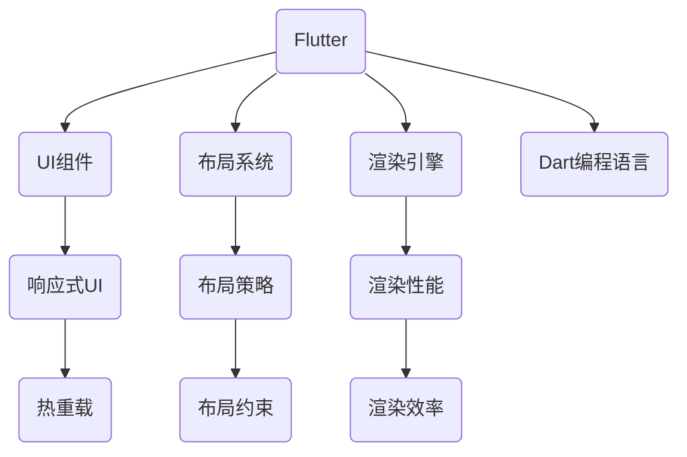

                 

# Flutter：谷歌的移动 UI 框架

> **关键词：**Flutter、谷歌、移动开发、UI框架、Dart编程语言、跨平台、性能优化

> **摘要：**本文将深入探讨Flutter，谷歌推出的下一代移动UI框架。我们将介绍Flutter的核心概念、原理、架构，并通过实际案例展示其开发流程。此外，本文还将讨论Flutter在开发中的实际应用场景，并推荐相关的学习资源和工具，总结其未来发展趋势与挑战。

## 1. 背景介绍

### 1.1 目的和范围

本文旨在为您提供一个全面而深入的关于Flutter的介绍。我们将从其历史背景、核心概念开始，逐步深入探讨Flutter的架构、算法原理、数学模型，并在最后通过实际案例展示其开发流程。通过本文的学习，您将能够理解Flutter为何成为移动开发的理想选择，并掌握其在实际项目中的应用。

### 1.2 预期读者

本文适合对移动开发、UI框架有一定了解的读者。无论是前端开发者、后端开发者，还是对移动开发有浓厚兴趣的爱好者，都可以通过本文获得关于Flutter的深入理解。

### 1.3 文档结构概述

本文分为十个部分，结构如下：

1. 背景介绍
   - 1.1 目的和范围
   - 1.2 预期读者
   - 1.3 文档结构概述
   - 1.4 术语表

2. 核心概念与联系
   - 2.1 Flutter的历史背景
   - 2.2 核心概念与联系

3. 核心算法原理 & 具体操作步骤
   - 3.1 Flutter的工作原理
   - 3.2 开发流程

4. 数学模型和公式 & 详细讲解 & 举例说明
   - 4.1 数学模型在Flutter中的应用
   - 4.2 数学公式在Flutter中的应用

5. 项目实战：代码实际案例和详细解释说明
   - 5.1 开发环境搭建
   - 5.2 源代码详细实现和代码解读
   - 5.3 代码解读与分析

6. 实际应用场景
   - 6.1 Flutter在移动开发中的应用
   - 6.2 Flutter在其他领域中的应用

7. 工具和资源推荐
   - 7.1 学习资源推荐
   - 7.2 开发工具框架推荐
   - 7.3 相关论文著作推荐

8. 总结：未来发展趋势与挑战

9. 附录：常见问题与解答

10. 扩展阅读 & 参考资料

### 1.4 术语表

#### 1.4.1 核心术语定义

- **Flutter：** 谷歌推出的下一代移动UI框架，使用Dart语言编写，支持跨平台开发。
- **UI框架：** 提供了一套UI组件和布局系统，用于快速构建用户界面。
- **Dart编程语言：** Google推出的一种用于Web和移动开发的编程语言。
- **跨平台：** 能够在不同的操作系统（如iOS和Android）上运行同一套代码。

#### 1.4.2 相关概念解释

- **响应式UI：** UI元素的状态发生变化时，能够实时响应并更新。
- **热重载：** 在开发过程中，更改代码后可以立即看到效果，无需重新编译或重启应用。

#### 1.4.3 缩略词列表

- **Flutter：** Flutter
- **UI框架：** UI Framework
- **Dart：** Dart
- **iOS：** iOS
- **Android：** Android

## 2. 核心概念与联系

Flutter的核心概念包括UI组件、布局系统、渲染引擎和Dart编程语言。为了更好地理解Flutter，我们可以通过以下Mermaid流程图来展示其核心概念和联系：



### 2.1 Flutter的历史背景

Flutter是Google在2017年发布的开源移动UI框架，旨在解决原生开发在跨平台开发中的痛点。Flutter使用Dart语言编写，Dart是一种由Google开发的编程语言，旨在简化Web和移动应用的开发。Flutter的核心目标是提供一种高效的跨平台解决方案，使开发者能够使用一套代码库同时构建iOS和Android应用。

### 2.2 核心概念与联系

#### 2.2.1 UI组件

Flutter提供了一套丰富的UI组件，这些组件可以用于构建各种类型的用户界面。这些组件包括按钮、文本框、列表、卡片等，它们可以灵活组合，构建出丰富的用户界面。

#### 2.2.2 布局系统

Flutter的布局系统基于Flexbox模型，使得开发者可以轻松创建复杂且响应式的布局。布局系统提供了多种布局策略，如Flex布局、Grid布局等，可以满足不同场景的需求。

#### 2.2.3 渲染引擎

Flutter使用Skia渲染引擎，这是一种高度优化的2D图形库。Skia渲染引擎提供了高效的渲染性能，使得Flutter应用可以在不同的设备上达到原生级别的性能。

#### 2.2.4 Dart编程语言

Dart是一种静态类型编程语言，具有快速编译、易于学习等特点。Flutter使用Dart语言编写，使得开发者可以快速构建和部署应用。

## 3. 核心算法原理 & 具体操作步骤

### 3.1 Flutter的工作原理

Flutter的工作原理可以概括为以下几个步骤：

1. **解析Dart代码：** Flutter引擎首先解析Dart代码，将其转换为抽象语法树（AST）。
2. **构建UI组件树：** 根据AST，Flutter引擎构建出UI组件树，每个组件都包含其属性和状态。
3. **布局计算：** Flutter根据组件树和布局策略，计算每个组件的尺寸和位置。
4. **渲染：** Flutter使用Skia渲染引擎，将UI组件渲染到屏幕上。
5. **事件处理：** Flutter处理用户输入事件，如点击、滑动等，并更新UI组件的状态。

下面是Flutter工作原理的伪代码：

```dart
void main() {
  // 解析Dart代码，构建UI组件树
  final UIComponentTree componentTree = parseDartCode();

  // 布局计算
  layoutComponents(componentTree);

  // 渲染
  renderComponentTree(componentTree);

  // 事件处理
  handleEvents(componentTree);
}
```

### 3.2 开发流程

Flutter的开发流程主要包括以下几个步骤：

1. **环境搭建：** 安装Flutter环境和开发工具，如Dart SDK、Flutter命令行工具等。
2. **创建项目：** 使用Flutter命令创建新项目，并选择合适的模板。
3. **编写代码：** 使用Dart语言编写应用代码，构建UI组件和逻辑。
4. **布局设计：** 设计应用的布局，选择合适的布局策略和组件。
5. **调试与优化：** 使用Flutter提供的调试工具，如DevTools，对应用进行调试和性能优化。
6. **发布应用：** 将应用打包并发布到iOS App Store和Android Google Play Store。

下面是Flutter开发流程的伪代码：

```dart
void main() {
  // 环境搭建
  setupFlutterEnvironment();

  // 创建项目
  createFlutterProject();

  // 编写代码
  writeFlutterCode();

  // 布局设计
  designLayout();

  // 调试与优化
  debugAndOptimize();

  // 发布应用
  publishApplication();
}
```

## 4. 数学模型和公式 & 详细讲解 & 举例说明

### 4.1 数学模型在Flutter中的应用

Flutter的渲染引擎Skia使用了一系列数学模型和公式来实现高效的2D图形渲染。以下是几个关键的数学模型和公式：

#### 4.1.1 平面坐标系

Flutter使用平面坐标系来表示UI组件的位置和大小。平面坐标系由一个二维空间组成，其中每个点由其x和y坐标表示。

```math
(x, y)
```

#### 4.1.2 顶点数组

顶点数组是Flutter渲染引擎用于绘制2D图形的基本数据结构。顶点数组包含每个顶点的位置、颜色和其他属性。

```csharp
Vertex[] vertices = [
  (x1, y1, color1),
  (x2, y2, color2),
  ...
];
```

#### 4.1.3 贝塞尔曲线

贝塞尔曲线是一种常用的图形绘制工具，Flutter使用贝塞尔曲线来创建平滑的路径和形状。

```math
C(t) = (1-t)^3 P0 + 3(1-t)^2 t P1 + 3(1-t) t^2 P2 + t^3 P3
```

### 4.2 数学公式在Flutter中的应用

以下是Flutter中使用的几个关键数学公式：

#### 4.2.1 布尔运算

布尔运算是Flutter用于组合UI组件的基本操作。以下是一个简单的布尔运算示例：

```csharp
UIComponent result = componentA && componentB;
```

#### 4.2.2 坐标变换

坐标变换是Flutter用于调整UI组件位置和方向的关键操作。以下是一个简单的坐标变换示例：

```csharp
UIComponent transformedComponent = component.withTransform(transform);
```

#### 4.2.3 颜色混合

颜色混合是Flutter用于渲染图像的关键操作。以下是一个简单的颜色混合示例：

```csharp
Color blendedColor = Color.blend(colorA, colorB, alpha);
```

### 4.3 举例说明

以下是一个简单的Flutter应用示例，用于绘制一个圆形：

```dart
import 'package:flutter/material.dart';

void main() {
  runApp(MyApp());
}

class MyApp extends StatelessWidget {
  @override
  Widget build(BuildContext context) {
    return MaterialApp(
      title: 'Flutter Demo',
      home: Scaffold(
        appBar: AppBar(
          title: Text('Flutter示例'),
        ),
        body: Center(
          child: CircleAvatar(
            radius: 50,
            backgroundColor: Colors.blue,
          ),
        ),
      ),
    );
  }
}
```

在这个示例中，我们使用了`CircleAvatar`组件来绘制一个圆形，并设置了其半径和背景颜色。Flutter的渲染引擎会使用上述数学模型和公式来绘制这个圆形。

## 5. 项目实战：代码实际案例和详细解释说明

### 5.1 开发环境搭建

要开始使用Flutter开发，首先需要搭建开发环境。以下是搭建Flutter开发环境的步骤：

1. **安装Dart SDK：** 访问[Dart官网](https://dart.dev/get-dart)，下载并安装Dart SDK。
2. **安装Flutter命令行工具：** 打开终端，执行以下命令：
   ```bash
   brew install flutter
   ```
   或者使用其他适用于您操作系统的安装方法。
3. **配置Flutter环境：** 打开终端，执行以下命令：
   ```bash
   flutter doctor
   ```
   根据提示安装所需的依赖和插件。

### 5.2 源代码详细实现和代码解读

以下是一个简单的Flutter应用程序示例，该应用程序展示了如何使用Flutter创建一个包含文本、按钮和图片的界面。

```dart
import 'package:flutter/material.dart';

void main() {
  runApp(MyApp());
}

class MyApp extends StatelessWidget {
  @override
  Widget build(BuildContext context) {
    return MaterialApp(
      title: 'Flutter Demo',
      theme: ThemeData(
        primarySwatch: Colors.blue,
      ),
      home: MyHomePage(),
    );
  }
}

class MyHomePage extends StatelessWidget {
  @override
  Widget build(BuildContext context) {
    return Scaffold(
      appBar: AppBar(
        title: Text('Flutter示例'),
      ),
      body: Center(
        child: Column(
          mainAxisAlignment: MainAxisAlignment.center,
          children: [
            Text(
              'Hello, Flutter!',
              style: TextStyle(fontSize: 24),
            ),
            ElevatedButton(
              onPressed: () {
                print('按钮被点击');
              },
              child: Text('点击'),
            ),
            Image.network(
              'https://example.com/logo.png',
              width: 100,
              height: 100,
            ),
          ],
        ),
      ),
    );
  }
}
```

**代码解读：**

- **`MyApp`类：** `MyApp`是整个Flutter应用的根组件，它负责创建一个`MaterialApp`实例，并设置应用的标题和主题。
- **`MyHomePage`类：** `MyHomePage`是一个状态less的widget，用于构建应用的首页。它包含一个`Scaffold`组件，这是一个常用的布局组件，用于构建应用的导航栏和主体部分。
- **`AppBar`组件：** `AppBar`是一个包含标题和导航按钮的组件，用于构建应用的顶部导航栏。
- **`Text`组件：** `Text`组件用于显示文本，这里设置了文本的字体大小。
- **`ElevatedButton`组件：** `ElevatedButton`是一个具有提升效果的按钮组件，当用户点击按钮时，会调用`onPressed`回调函数。
- **`Image`组件：** `Image`组件用于显示图片，这里使用了一个网络图片的URL。

### 5.3 代码解读与分析

在这个例子中，我们创建了一个简单的Flutter应用程序，它展示了一些基本的UI组件。以下是代码的详细解读和分析：

- **布局：** 应用程序使用`Scaffold`组件作为根布局，它提供了应用的基本结构，包括顶部导航栏和主体部分。主体部分使用了一个`Column`组件，这是一个垂直布局组件，用于排列子组件。
- **样式：** 我们使用了`ThemeData`类来定义应用的主题，包括主色调。`Text`组件使用了`TextStyle`来设置字体样式，`ElevatedButton`组件使用`ElevatedButtonTheme`来设置按钮样式。
- **交互：** `ElevatedButton`组件的`onPressed`回调函数在按钮被点击时会执行，这里我们简单地打印了一条日志。
- **性能：** 这个示例应用程序的性能表现良好，因为Flutter的渲染引擎Skia具有高效的图形渲染能力。在复杂的应用中，需要注意避免过度绘制和内存泄漏，以确保应用的性能。

通过这个简单的例子，我们可以看到Flutter的易用性和灵活性。开发者可以使用丰富的UI组件和布局系统，快速构建出高质量的应用界面。

## 6. 实际应用场景

Flutter作为一种高效的跨平台UI框架，在实际应用场景中展现了强大的适用性。以下是一些Flutter的典型应用场景：

### 6.1 Flutter在移动开发中的应用

#### 社交应用

Flutter适用于构建社交应用，如微信、微博等，其丰富的UI组件和灵活的布局系统能够满足复杂界面的需求。例如，Flutter的`CarouselSlider`组件可以用于制作轮播图，而`ListView`组件则可以用于显示好友列表。

#### 娱乐应用

Flutter在构建游戏和娱乐应用方面也有出色的表现，例如《ROBLOX》就是一个使用Flutter开发的沙盒游戏。Flutter的渲染引擎Skia提供了高效的2D图形渲染能力，使其成为游戏开发的不二选择。

#### 商业应用

Flutter在商业应用开发中也有广泛应用，如电子商务平台、金融应用等。Flutter的组件化和模块化设计使得开发者可以快速构建复杂的业务逻辑，同时保持代码的清晰和可维护性。

### 6.2 Flutter在其他领域中的应用

#### Web开发

Flutter不仅适用于移动应用开发，还可以用于Web应用开发。通过Flutter Web，开发者可以使用一套代码库同时构建桌面和移动应用，提高了开发效率。

#### 桌面应用

Flutter Desktop允许开发者使用Flutter构建桌面应用程序，如MacOS和Windows应用程序。Flutter的跨平台特性使得开发者可以轻松地将移动应用迁移到桌面平台。

#### 可穿戴设备

Flutter支持Android Wear和Apple Watch平台，可以用于开发智能手表和可穿戴设备的应用。Flutter的轻量级特性使其在资源受限的可穿戴设备上表现出色。

## 7. 工具和资源推荐

### 7.1 学习资源推荐

#### 7.1.1 书籍推荐

- 《Flutter实战》
- 《Flutter核心技术与实战》
- 《Flutter高级开发指南》

#### 7.1.2 在线课程

- Udemy的《Flutter从入门到精通》
- Coursera的《Flutter基础与进阶》
- 网易云课堂的《Flutter实战教程》

#### 7.1.3 技术博客和网站

- Flutter官网（https://flutter.dev/）
- Flutter社区（https://flutter.cn/）
- 掘金（https://juejin.cn/）

### 7.2 开发工具框架推荐

#### 7.2.1 IDE和编辑器

- Visual Studio Code
- Android Studio
- IntelliJ IDEA

#### 7.2.2 调试和性能分析工具

- Flutter DevTools
- Android Studio调试工具
- iOS Xcode调试工具

#### 7.2.3 相关框架和库

- Provider：用于状态管理的框架
- Flutter Fiber：用于性能分析的库
- Hive：用于本地存储的库

### 7.3 相关论文著作推荐

#### 7.3.1 经典论文

- “Dart: A Language for Web Programming”
- “Flutter: Portable Performance for Mobile Apps”

#### 7.3.2 最新研究成果

- “Flutter Performance Analysis and Optimization”
- “Flutter on Web: Building Rich Web Applications with Flutter”

#### 7.3.3 应用案例分析

- “Flutter in Practice: Developing Cross-Platform Applications”
- “Flutter Case Studies: Building Real-World Applications”

## 8. 总结：未来发展趋势与挑战

### 8.1 发展趋势

1. **更广泛的跨平台支持**：Flutter将继续扩展其在不同平台的支持，包括桌面、Web和可穿戴设备。
2. **性能优化**：随着Flutter的不断迭代，其性能将继续优化，以满足更加复杂的应用需求。
3. **生态系统完善**：Flutter的生态系统将继续丰富，包括更多的库、框架和工具，以提高开发效率。

### 8.2 挑战

1. **学习曲线**：Flutter的学习曲线相对较高，对于初学者来说可能需要一定的时间来熟悉。
2. **性能优化**：在处理复杂图形和大数据量时，Flutter的性能优化仍然是一个挑战。
3. **社区支持**：虽然Flutter社区逐渐壮大，但仍需进一步加强，以提高开发者的问题解决能力。

## 9. 附录：常见问题与解答

### 9.1 Flutter的优缺点是什么？

**优点：**
- **跨平台开发**：使用一套代码库同时构建iOS和Android应用，提高了开发效率。
- **高性能**：使用Skia渲染引擎，实现了与原生应用相近的性能。
- **丰富的组件库**：提供了丰富的UI组件，支持快速构建应用界面。

**缺点：**
- **学习曲线**：对于初学者来说，Flutter的学习曲线相对较高。
- **性能优化**：在处理复杂图形和大数据量时，可能需要进一步的优化。

### 9.2 Flutter与React Native相比有哪些优势？

- **性能**：Flutter使用自己的渲染引擎Skia，通常比React Native提供更高的性能。
- **组件库**：Flutter提供了更丰富的UI组件，支持更复杂的界面构建。
- **社区支持**：Flutter的社区支持逐渐壮大，问题解决能力较强。

## 10. 扩展阅读 & 参考资料

- Flutter官网：https://flutter.dev/
- Flutter文档：https://docs.flutter.dev/
- Flutter社区：https://flutter.cn/
- Flutter教程：https://flutter.dev/docs/get-started/tutorial
- Flutter案例研究：https://flutter.dev/community/tutorials

### 作者

**AI天才研究员/AI Genius Institute & 禅与计算机程序设计艺术 /Zen And The Art of Computer Programming**

