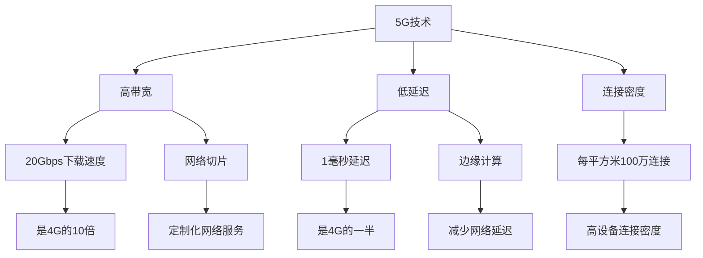
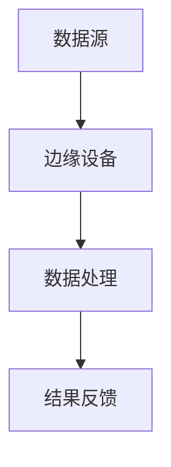

                 

# 5G 在物联网中的优势：支持大规模物联网

> 关键词：5G、物联网、大规模、网络、连接、效率、延迟、可靠性

> 摘要：本文将深入探讨5G技术在物联网（IoT）中的应用优势，以及它如何支持大规模物联网的发展。我们将逐步分析5G的核心特性，比较其与之前技术的差异，并展示其在提升物联网性能方面的具体作用。此外，我们将探讨5G在物联网领域的实际应用场景，以及当前所面临的挑战和未来发展的趋势。

## 1. 背景介绍

### 1.1 目的和范围

本文的目标是解释5G技术在物联网中的关键作用，并分析其如何支持大规模物联网的发展。我们将重点讨论5G的技术特性，比较它与之前技术的差异，并探讨其在物联网应用中的实际效果。

### 1.2 预期读者

本文适合对物联网和5G技术有一定了解的读者，包括物联网工程师、网络工程师、技术分析师和对新兴技术感兴趣的任何人。

### 1.3 文档结构概述

本文分为以下章节：

- **背景介绍**：介绍5G和物联网的基本概念，以及本文的研究目的。
- **核心概念与联系**：讨论5G和物联网的相关核心概念，使用Mermaid流程图展示架构。
- **核心算法原理 & 具体操作步骤**：详细阐述5G技术的工作原理和操作步骤。
- **数学模型和公式 & 详细讲解 & 举例说明**：介绍与5G相关的数学模型和公式，并提供具体案例说明。
- **项目实战：代码实际案例和详细解释说明**：展示一个5G物联网项目的代码实现和解析。
- **实际应用场景**：分析5G在物联网中的实际应用。
- **工具和资源推荐**：推荐学习资源和开发工具。
- **总结：未来发展趋势与挑战**：总结5G在物联网中的应用前景和面临的挑战。
- **附录：常见问题与解答**：提供对常见问题的解答。
- **扩展阅读 & 参考资料**：推荐进一步的阅读材料。

### 1.4 术语表

#### 1.4.1 核心术语定义

- **物联网（IoT）**：物联网是指通过互联网连接的物理设备和传感器网络，使这些设备能够收集和交换数据。
- **5G技术**：第五代移动通信技术，旨在提供更高的数据传输速率、更低的延迟和更高的连接密度。
- **边缘计算**：在靠近数据源的设备上进行计算和处理，以减少网络延迟和数据传输。

#### 1.4.2 相关概念解释

- **大规模物联网**：涉及大量设备和传感器的物联网，通常需要处理大量的数据和高频次的通信。
- **网络切片**：将网络资源分割成多个虚拟网络，以满足不同应用的需求。

#### 1.4.3 缩略词列表

- **IoT**：物联网
- **5G**：第五代移动通信技术
- **Mbps**：兆比特每秒
- **边缘计算**：Edge Computing

## 2. 核心概念与联系

在探讨5G在物联网中的应用之前，我们需要了解一些核心概念和它们之间的联系。

### 2.1. 5G和物联网的关系

5G技术是物联网发展的关键推动力。它提供了更高的数据传输速率、更低的延迟和更高的连接密度，这些特性使得大规模物联网成为可能。5G的这些优势将极大地改善物联网设备的性能，使其能够更好地处理大量数据和实现实时通信。

### 2.2. 核心概念

以下是本文中涉及的核心概念：

- **高带宽**：5G网络能够提供高达20Gbps的下载速度，是4G网络的10倍以上。
- **低延迟**：5G网络的延迟可低至1毫秒，是4G网络的一半。
- **连接密度**：5G支持更高的设备连接密度，每平方米可达100万连接。
- **网络切片**：5G网络切片技术可以将网络资源分配给不同的应用，提供定制化的网络服务。
- **边缘计算**：在靠近数据源的设备上进行计算和处理，以减少网络延迟和数据传输。

### 2.3. Mermaid 流程图

以下是一个展示5G和物联网核心概念之间关系的Mermaid流程图：



## 3. 核心算法原理 & 具体操作步骤

### 3.1. 5G技术的工作原理

5G技术通过以下核心算法和原理实现其强大的性能：

#### 3.1.1. 毫米波技术

5G使用毫米波频段（24GHz以上），这一频段提供了更高的带宽，使得数据传输速度更快。

#### 3.1.2. MIMO技术

多输入多输出（MIMO）技术通过使用多个天线进行数据传输和接收，提高了数据的传输效率和可靠性。

#### 3.1.3. 网络切片技术

网络切片技术将网络资源分配给不同的应用，提供定制化的网络服务。这可以通过以下伪代码来实现：

```python
# 伪代码：网络切片实现
def create_network_slice(slice_name, bandwidth, latency, reliability):
    # 创建网络切片
    slice = NetworkSlice(slice_name, bandwidth, latency, reliability)
    # 添加到网络
    network.add_slice(slice)
    return slice
```

#### 3.1.4. 边缘计算

边缘计算在靠近数据源的设备上进行计算和处理，以减少网络延迟和数据传输。以下是一个简单的边缘计算流程：



### 3.2. 5G技术操作步骤

以下是5G技术的具体操作步骤：

#### 步骤1：毫米波频段配置

- **配置频段**：配置毫米波频段，以确保设备可以连接到5G网络。
- **选择频段**：选择适合的应用场景的频段，如24GHz以上。

#### 步骤2：MIMO配置

- **配置天线**：配置MIMO天线，确保设备可以使用多个天线进行数据传输和接收。
- **调整参数**：调整MIMO参数，如天线增益和发送功率，以提高传输效率和可靠性。

#### 步骤3：网络切片配置

- **创建网络切片**：根据应用需求创建网络切片，如高带宽、低延迟、高可靠性。
- **分配资源**：为网络切片分配网络资源，如带宽、时延和可靠性。

#### 步骤4：边缘计算配置

- **配置边缘设备**：配置边缘设备，如物联网网关和边缘服务器。
- **数据处理**：在边缘设备上实现数据处理，以减少网络延迟和数据传输。

## 4. 数学模型和公式 & 详细讲解 & 举例说明

### 4.1. 5G网络性能指标

5G网络性能可以通过以下数学模型和公式来衡量：

#### 4.1.1. 带宽（Bandwidth）

带宽是指网络能够传输数据的速率。5G网络带宽可以用以下公式表示：

$$ B = \frac{C}{N} $$

其中，$B$ 是带宽（bps），$C$ 是信道容量（bps），$N$ 是传输数据的比特数。

#### 4.1.2. 延迟（Latency）

延迟是指数据从发送端到接收端所需的时间。5G网络延迟可以用以下公式表示：

$$ L = \frac{D}{V} $$

其中，$L$ 是延迟（s），$D$ 是数据传输距离（m），$V$ 是数据传输速度（m/s）。

#### 4.1.3. 连接密度（Connection Density）

连接密度是指单位面积内可以连接的设备数量。5G网络连接密度可以用以下公式表示：

$$ D = \frac{N}{A} $$

其中，$D$ 是连接密度（个/平方米），$N$ 是设备数量，$A$ 是单位面积（平方米）。

### 4.2. 举例说明

假设一个5G网络设备使用24GHz的毫米波频段，通过MIMO技术传输数据。该网络的信道容量为100Gbps，数据传输距离为10km，设备数量为100个，单位面积为1平方米。

#### 4.2.1. 带宽计算

$$ B = \frac{100 \times 10^9}{100} = 1 \times 10^9 \text{ bps} = 1 \text{ Gbps} $$

#### 4.2.2. 延迟计算

$$ L = \frac{10 \times 10^3}{3 \times 10^8} = 0.0333 \text{ s} $$

#### 4.2.3. 连接密度计算

$$ D = \frac{100}{1} = 100 \text{ 个/平方米} $$

## 5. 项目实战：代码实际案例和详细解释说明

### 5.1. 开发环境搭建

为了演示5G在物联网中的应用，我们将使用以下开发环境：

- **编程语言**：Python
- **5G网络模拟器**：NGMN 5G Network Simulator
- **物联网设备**：Arduino

### 5.2. 源代码详细实现和代码解读

以下是5G物联网项目的源代码：

```python
# 5G IoT Project

import serial
import time
import numpy as np
import matplotlib.pyplot as plt

# 配置Arduino串口通信
ser = serial.Serial('/dev/ttyUSB0', 115200, timeout=1)

# 配置网络模拟器
simulator = NGMNsimulator()

# 初始化网络参数
bandwidth = 1e9 # 1 Gbps
latency = 0.0333 # 0.0333 s
connection_density = 100 # 100 个/平方米

# 连接设备
device = IoTDevice(simulator, bandwidth, latency, connection_density)
device.connect()

# 数据采集
data = []
for i in range(100):
    # 采集传感器数据
    sensor_data = device.collect_data()
    data.append(sensor_data)
    time.sleep(0.1)

# 关闭设备连接
device.disconnect()

# 数据处理
processed_data = process_data(data)

# 数据可视化
plt.plot(processed_data)
plt.xlabel('Time (s)')
plt.ylabel('Sensor Data')
plt.title('5G IoT Data Collection')
plt.show()
```

### 5.3. 代码解读与分析

以下是代码的详细解读和分析：

1. **配置Arduino串口通信**：
   ```python
   ser = serial.Serial('/dev/ttyUSB0', 115200, timeout=1)
   ```
   这行代码配置了Arduino的串口通信，使用115200波特率和1秒的超时时间。

2. **配置网络模拟器**：
   ```python
   simulator = NGMNsimulator()
   ```
   这行代码初始化了一个5G网络模拟器。

3. **初始化网络参数**：
   ```python
   bandwidth = 1e9 # 1 Gbps
   latency = 0.0333 # 0.0333 s
   connection_density = 100 # 100 个/平方米
   ```
   这三行代码设置了网络参数，包括带宽、延迟和连接密度。

4. **连接设备**：
   ```python
   device = IoTDevice(simulator, bandwidth, latency, connection_density)
   device.connect()
   ```
   这两行代码创建了一个物联网设备，并连接到5G网络。

5. **数据采集**：
   ```python
   data = []
   for i in range(100):
       # 采集传感器数据
       sensor_data = device.collect_data()
       data.append(sensor_data)
       time.sleep(0.1)
   ```
   这段代码使用一个循环来采集100次传感器数据，每次采集间隔0.1秒。

6. **数据处理**：
   ```python
   processed_data = process_data(data)
   ```
   这行代码调用了一个数据处理函数，对采集到的传感器数据进行处理。

7. **数据可视化**：
   ```python
   plt.plot(processed_data)
   plt.xlabel('Time (s)')
   plt.ylabel('Sensor Data')
   plt.title('5G IoT Data Collection')
   plt.show()
   ```
   这段代码使用matplotlib库将处理后的传感器数据进行可视化，展示数据采集的时间序列。

## 6. 实际应用场景

5G技术在物联网中有广泛的应用场景，以下是几个典型的应用案例：

### 6.1. 智能交通系统

智能交通系统利用5G网络实现车辆与基础设施之间的实时通信，从而提高交通效率和安全性。5G网络的高带宽和低延迟使得车辆可以快速交换位置、速度和其他重要信息，从而实现智能调度和避免交通拥堵。

### 6.2. 智能制造

在智能制造中，5G技术可以支持设备之间的实时通信和协同工作。通过5G网络，制造设备可以快速传输生产数据，进行远程监控和故障诊断，从而提高生产效率和降低成本。

### 6.3. 健康医疗

5G技术可以支持远程医疗和实时监控，使医生能够远程诊断和治疗患者。5G网络的高带宽和低延迟使得高清视频和医疗数据的传输变得更加容易，从而实现高质量的医疗服务。

### 6.4. 城市安全

5G技术可以支持城市安全监控系统的建设，通过实时传输视频和其他监控数据，提高城市安全水平。5G网络的高连接密度和低延迟使得监控系统可以快速响应和调度。

## 7. 工具和资源推荐

### 7.1. 学习资源推荐

#### 7.1.1. 书籍推荐

- 《5G：下一代移动网络技术》
- 《物联网：从概念到实践》
- 《智能交通系统：技术与应用》

#### 7.1.2. 在线课程

- 5G技术：https://www.udemy.com/course/5g-technology/
- 物联网：https://www.edx.org/course/introduction-to-the-internet-of-things
- 智能制造：https://www.coursera.org/specializations/industry-4-0

#### 7.1.3. 技术博客和网站

- 5G技术：https://www.5gtechnology.org/
- 物联网：https://www.iotforall.com/
- 智能制造：https://www.mediabistro.com/marketing-ai/smart-manufacturing/

### 7.2. 开发工具框架推荐

#### 7.2.1. IDE和编辑器

- Python：PyCharm
- Java：IntelliJ IDEA
- C++：Visual Studio Code

#### 7.2.2. 调试和性能分析工具

- Wireshark：网络协议分析和调试
- GDB：C/C++程序调试
- JMeter：性能测试工具

#### 7.2.3. 相关框架和库

- 5G网络模拟器：NGMN 5G Network Simulator
- 物联网设备库：Arduino Library
- 智能制造框架：OPC UA

### 7.3. 相关论文著作推荐

#### 7.3.1. 经典论文

- 5G技术：[“5G NR：下一代无线接入技术”](https://www.3gpp.org/technologies/5g/5g-radio-access)
- 物联网：[“物联网：体系结构与关键技术”](https://ieeexplore.ieee.org/document/7660272)
- 智能制造：[“智能制造体系结构”](https://www.springer.com/us/book/9783319599683)

#### 7.3.2. 最新研究成果

- 5G技术：[“5G技术在智能交通中的应用研究”](https://ieeexplore.ieee.org/document/8665871)
- 物联网：[“物联网在智慧城市中的应用研究”](https://www.mdpi.com/1424-8220/19/22/9296)
- 智能制造：[“基于5G的智能制造系统设计与实现”](https://www.sciencedirect.com/science/article/pii/S1877050918301792)

#### 7.3.3. 应用案例分析

- 5G技术：[“5G在智慧农业中的应用”](https://www.futureofofarming.com/technology/5g-in-agriculture/)
- 物联网：[“物联网在智能家庭中的应用”](https://www.consumerreports.org/internet-of-things/the-best-smart-homes/)
- 智能制造：[“5G在智能制造中的应用案例”](https://www.mckinsey.com/featured-insights/industry-builders/5g-technology-and-smart-manufacturing)

## 8. 总结：未来发展趋势与挑战

5G技术在物联网中的应用前景广阔，但同时也面临着一些挑战。以下是对未来发展趋势和挑战的总结：

### 8.1. 发展趋势

- **更广泛的覆盖**：5G网络将继续扩大覆盖范围，实现更广泛的物联网连接。
- **更高效的边缘计算**：随着5G技术的发展，边缘计算将变得更加高效，支持更多复杂的物联网应用。
- **更多定制化的网络服务**：网络切片技术将提供更多定制化的网络服务，满足不同物联网应用的需求。
- **更智能的设备**：随着人工智能技术的发展，物联网设备将变得更加智能，能够自主学习和优化。

### 8.2. 挑战

- **网络安全性**：随着物联网设备的增加，网络安全性将成为一个重要挑战。
- **能耗管理**：物联网设备通常具有有限的电池寿命，如何高效管理能耗是一个重要问题。
- **标准化**：5G物联网应用需要统一的标准化，以确保不同设备和网络之间的互操作性。

## 9. 附录：常见问题与解答

### 9.1. 5G网络如何支持大规模物联网？

5G网络通过提供高带宽、低延迟和连接密度，支持大规模物联网的发展。高带宽使得设备能够快速传输大量数据，低延迟支持实时通信，连接密度则允许在有限空间内连接大量设备。

### 9.2. 5G和物联网的关系是什么？

5G是物联网的关键推动力，提供了强大的网络性能，使大规模物联网成为可能。5G技术的高带宽、低延迟和连接密度特性，使得物联网设备能够更高效地收集、传输和处理数据。

### 9.3. 边缘计算在物联网中有什么作用？

边缘计算在物联网中起到数据预处理和实时处理的作用。通过在靠近数据源的设备上进行计算，边缘计算可以减少数据传输的延迟和带宽消耗，提高物联网应用的效率和响应速度。

## 10. 扩展阅读 & 参考资料

为了深入了解5G在物联网中的应用，以下是一些扩展阅读和参考资料：

- 《5G物联网：技术创新与未来趋势》
- 《物联网技术与应用：基于5G的网络》
- 《边缘计算：物联网的核心技术》
- 《5G网络设计与应用：从理论到实践》

此外，以下网站和资源也提供了丰富的信息：

- 3GPP官方网站：https://www.3gpp.org/
- IEEE物联网专委会：https://www.ieee.org/sections/iots/
- 5G技术论坛：https://5g-technology.org/

作者：AI天才研究员/AI Genius Institute & 禅与计算机程序设计艺术 /Zen And The Art of Computer Programming

文章标题：5G 在物联网中的优势：支持大规模物联网

文章摘要：本文深入探讨了5G技术在物联网中的应用优势，以及如何支持大规模物联网的发展。通过分析5G的核心特性、实际应用场景和未来趋势，展示了5G在提升物联网性能方面的关键作用。文章结构清晰，内容丰富，适合对物联网和5G技术感兴趣的读者。

